# ECS开发思维导图

## 📋 目录
- [1. ECS核心概念](#1-ecs核心概念)
- [2. ECS架构思维](#2-ecs架构思维)
- [3. 设计原则](#3-设计原则)
- [4. 开发流程](#4-开发流程)
- [5. 最佳实践](#5-最佳实践)
- [6. 应用场景](#6-应用场景)

---

---

title: 四层架构关系与通信方式
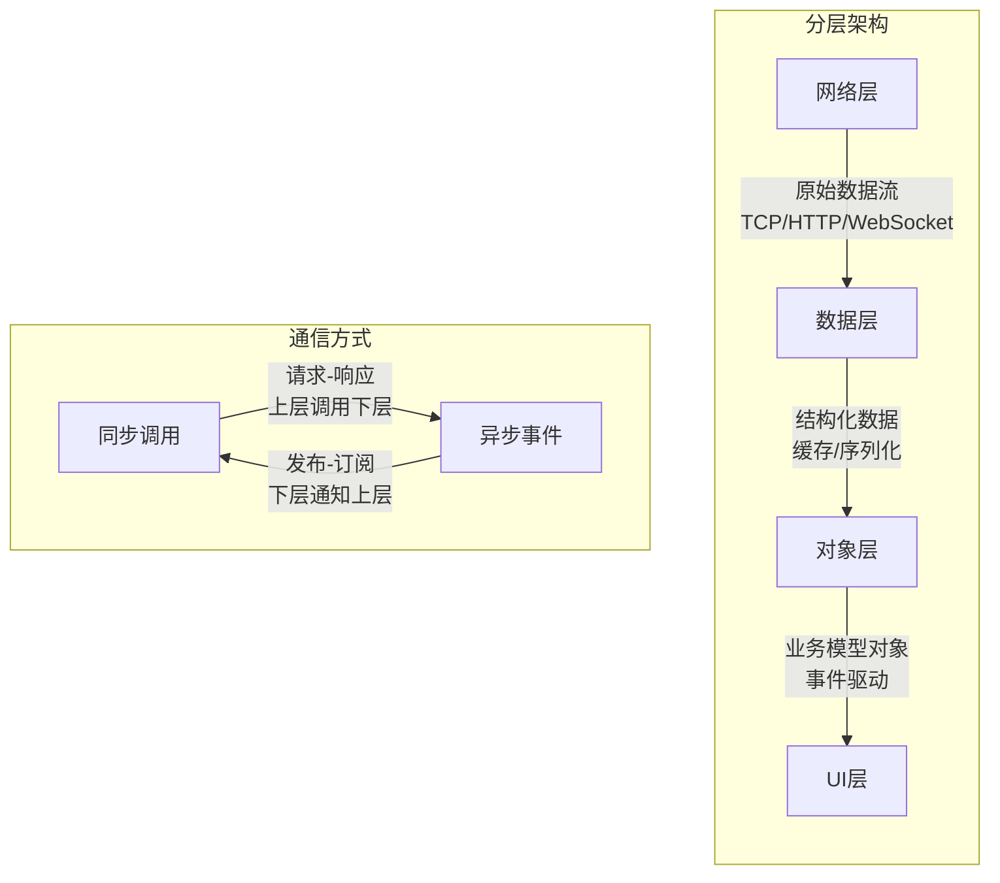

## 1. ECS核心概念

### 🧠 ECS思维导图

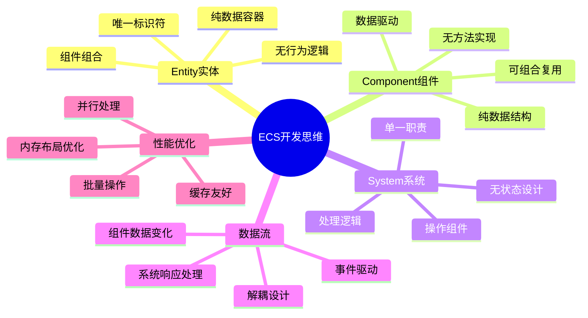

### 🏗️ ECS架构关系

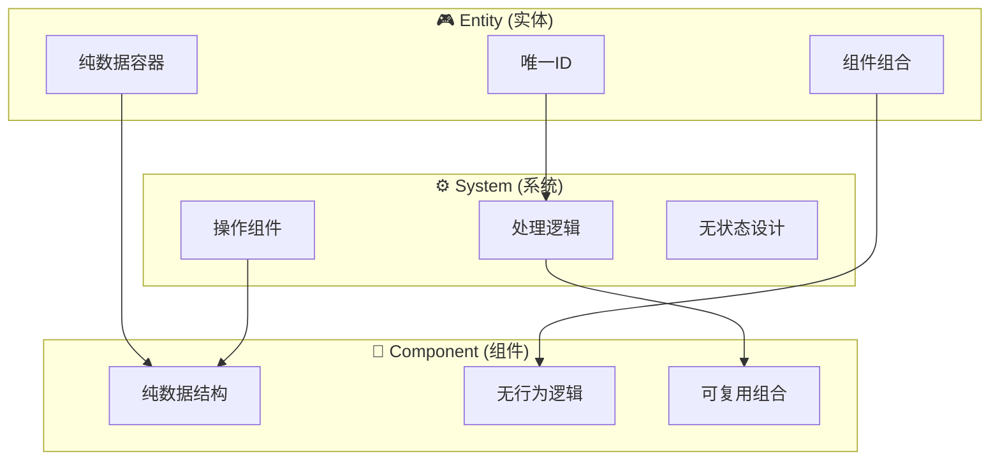

---

## 2. ECS架构思维

### 🔄 数据驱动思维

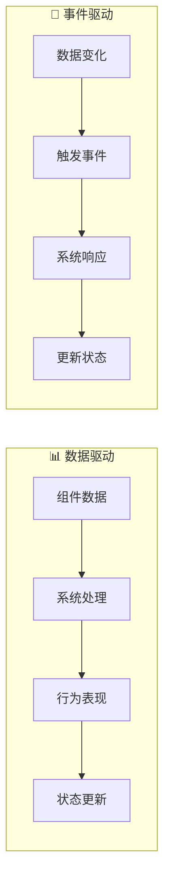

### 🎯 组合优于继承

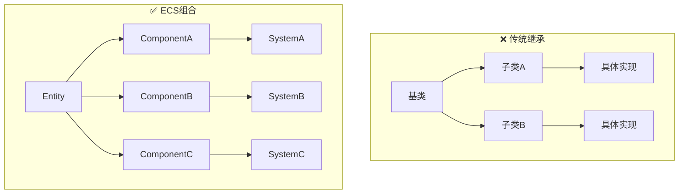

---

## 3. 设计原则

### 🎨 ECS设计原则

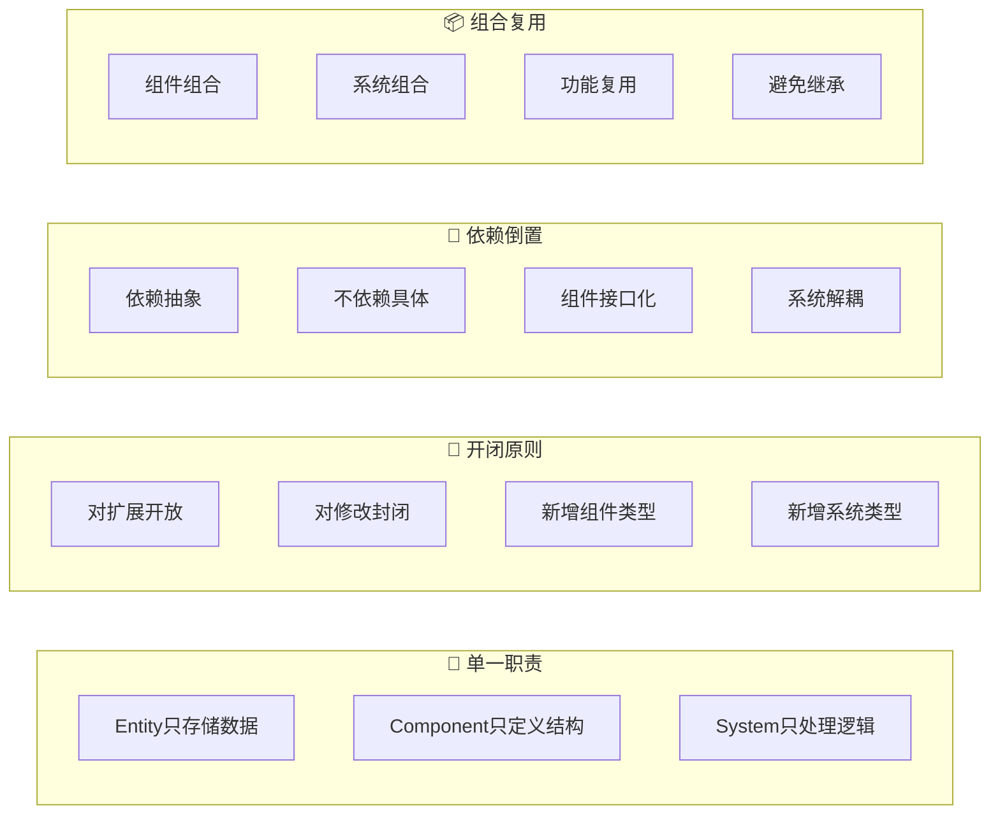

### 🏛️ 架构层次

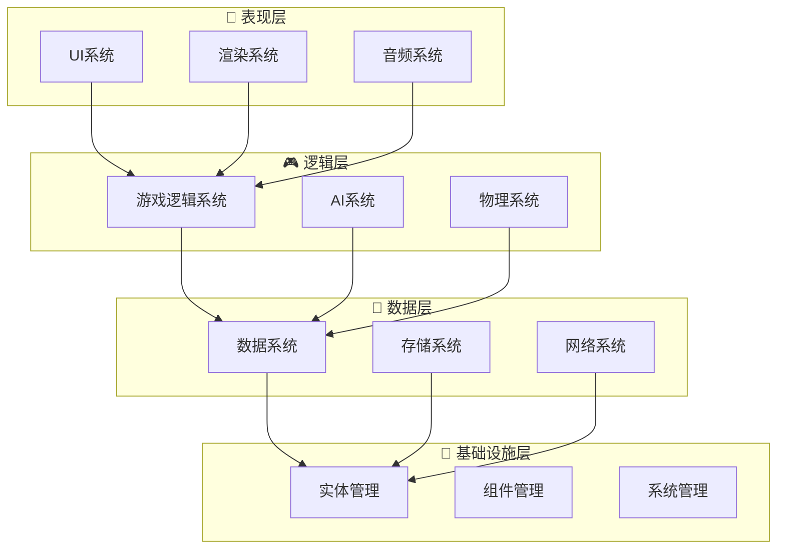

---

## 4. 开发流程

### 🔄 ECS开发流程

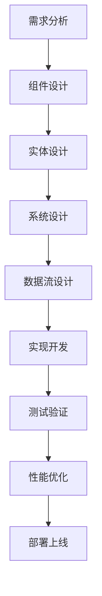

### 📋 开发步骤详解

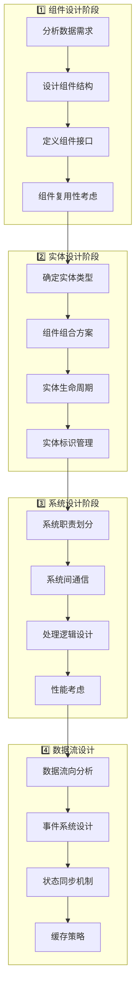

---

## 5. 最佳实践

### ⚡ ECS最佳实践

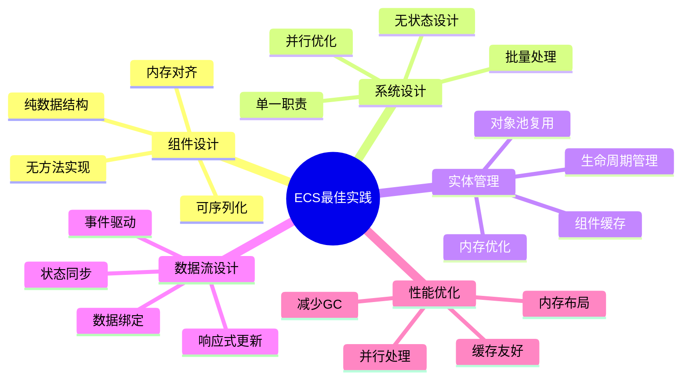

### 🔧 实现模式

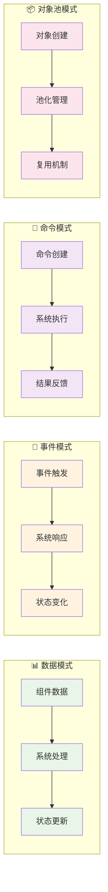

---

## 6. 应用场景

### 🎮 ECS应用场景

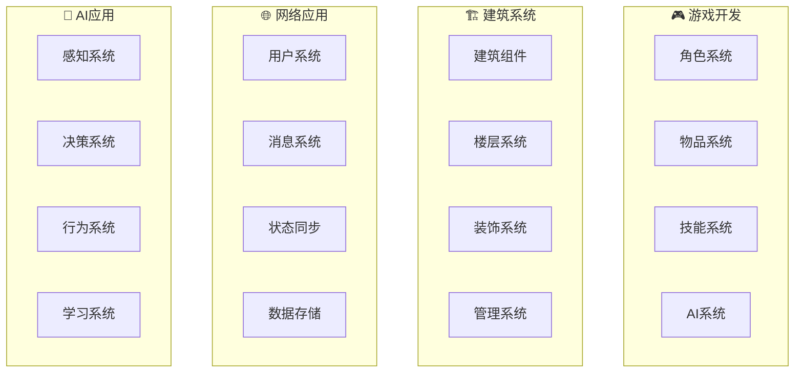

### 📊 场景对比

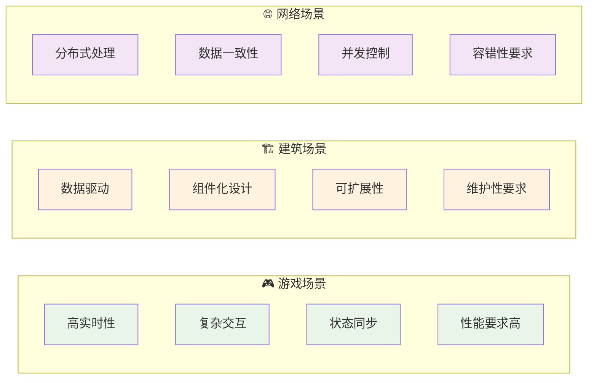

---

## 📋 总结

### 🎯 ECS开发思维核心

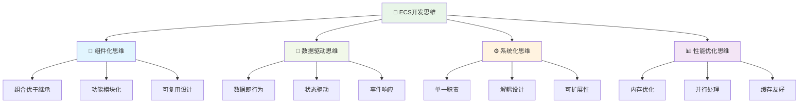

### 🚀 关键优势

- **🎯 清晰架构**: 职责分离，易于理解和维护
- **🔄 高度解耦**: 组件独立，系统松耦合
- **📈 性能优化**: 内存友好，并行处理
- **🔧 易于扩展**: 新增功能不影响现有代码
- **🧪 易于测试**: 组件和系统可独立测试
- **🔄 数据驱动**: 行为由数据决定，逻辑清晰

ECS开发思维是现代软件架构的重要思维方式，特别适合复杂系统的设计和开发！ 🎮✨ 