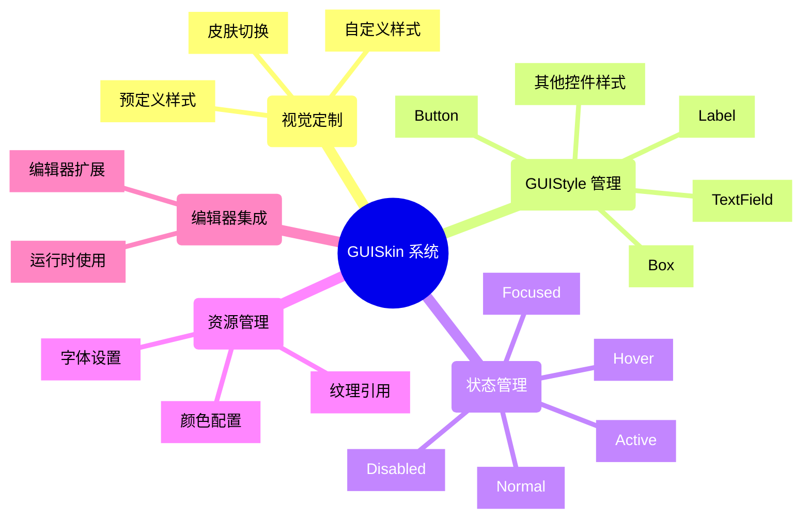
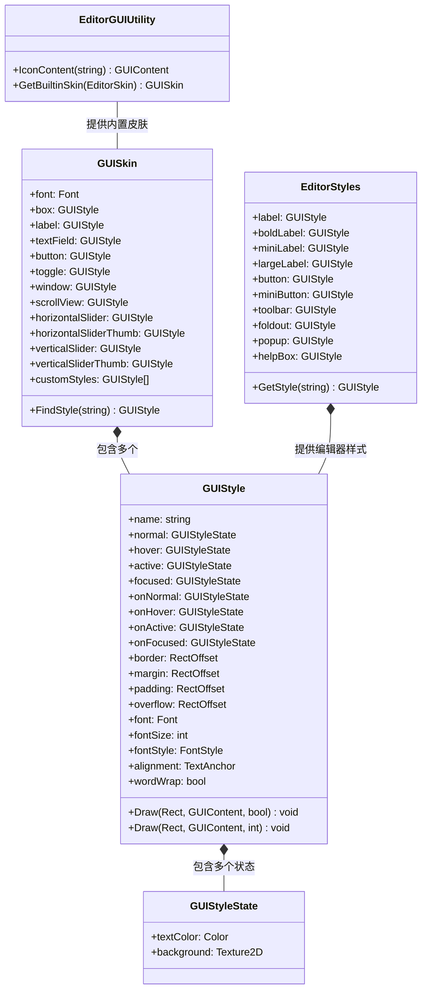

# Chapter 5 GUISkin

## 目录
- [简介](#简介)
- [GUISkin 特征](#guiskin-特征)
- [UML 图](#uml-图)
- [核心类和接口](#核心类和接口)
- [示例说明](#示例说明)
- [官方文档](#官方文档)

## 简介
GUISkin 是 Unity 中用于自定义 GUI 元素外观的系统。它允许开发者创建统一风格的界面，管理各种 GUI 控件的视觉样式。本章介绍 GUISkin 系统的使用方法，并提供了三个实用工具：GUI 样式预览器、GUI 图标预览器和 Editor 样式预览器。

## GUISkin 特征

### GUISkin 系统特征

| 特征 | 描述 |
|------|------|
| 样式统一性 | 通过 GUISkin 可以为整个应用定义统一的视觉风格 |
| 动态切换 | 支持在运行时切换不同的皮肤 |
| 细粒度控制 | 可为每种控件类型单独设置样式属性 |
| 状态响应 | 每个控件可以对不同交互状态显示不同外观 |
| 资源引用 | 可引用外部字体、纹理等资源定制外观 |
| 编辑器支持 | 提供编辑器工具便于预览和调整样式 |

## UML 图

## 核心类和接口

### 主要类

| 类名 | 功能描述 | 主要属性/方法 |
|------|---------|-------------|
| **GUISkin** | GUI皮肤容器 | `font`, `customStyles`, `FindStyle()` |
| **GUIStyle** | 单个控件样式 | `normal`, `hover`, `active`, `Draw()` |
| **GUIStyleState** | 控件状态样式 | `textColor`, `background` |
| **EditorStyles** | 编辑器内置样式 | `label`, `boldLabel`, `GetStyle()` |
| **EditorGUIUtility** | 编辑器GUI工具 | `IconContent()`, `GetBuiltinSkin()` |

### 主要接口

| 接口/方法 | 功能描述 | 用法 |
|----------|---------|------|
| `GUI.skin` | 当前使用的皮肤 | `GUI.skin = mySkin;` |
| `GUISkin.FindStyle()` | 查找自定义样式 | `GUIStyle style = skin.FindStyle("MyCustomStyle");` |
| `EditorGUIUtility.IconContent()` | 获取内置图标 | `GUIContent icon = EditorGUIUtility.IconContent("console.infoicon");` |
| `EditorStyles.GetStyle()` | 获取编辑器样式 | `GUIStyle style = EditorStyles.GetStyle("IN TextField");` |

## 示例说明

本章提供了三个主要工具示例：

1. **GUI 样式预览器 (GUIStylePreviewer)**
   - 功能：显示当前 GUISkin 中所有可用的 GUIStyle，并允许实时预览效果
   - 位置：`GUIPreviewer/Editor/GUIStylePreviewer.cs`
   - 主要特点：可视化展示样式属性，支持样式搜索

2. **GUI 图标预览器 (GUIIconPreviewer)**
   - 功能：展示 Unity 内置的所有图标
   - 位置：`GUIPreviewer/Editor/GUIIconPreviewer.cs`
   - 主要特点：按类别分组显示图标，提供搜索功能

3. **编辑器样式预览器 (EditorStylesPreviewer)**
   - 功能：展示 EditorStyles 中的所有样式
   - 位置：`EditorStylesPreviewer/Editor/EditorStylesPreviewer.cs`
   - 主要特点：展示编辑器特有样式，便于创建与编辑器匹配的扩展

## 官方文档

- [GUISkin 官方文档](https://docs.unity3d.com/ScriptReference/GUISkin.html)
- [GUIStyle 官方文档](https://docs.unity3d.com/ScriptReference/GUIStyle.html)
- [EditorStyles 官方文档](https://docs.unity3d.com/ScriptReference/EditorStyles.html)
- [EditorGUIUtility 官方文档](https://docs.unity3d.com/ScriptReference/EditorGUIUtility.html)
- [IMGUI 控件详解](https://docs.unity3d.com/Manual/gui-Controls.html)
- [自定义编辑器控件](https://docs.unity3d.com/Manual/editor-CustomEditors.html)

## 使用建议

1. **样式预览工具的使用方法**
   - 在 Unity 编辑器中选择 Window > GUI Style Previewer
   - 在预览器中可以查看、搜索和测试各种样式

2. **创建自定义 GUISkin**
   - 在 Project 窗口中右键 > Create > GUI Skin
   - 编辑 GUISkin 资源添加自定义样式
   - 在代码中设置 `GUI.skin = yourCustomSkin;`

3. **最佳实践**
   - 使用 GUIStyle.margin 和 GUIStyle.padding 控制元素间距
   - 重用样式以保持界面一致性
   - 使用预览工具辅助样式开发