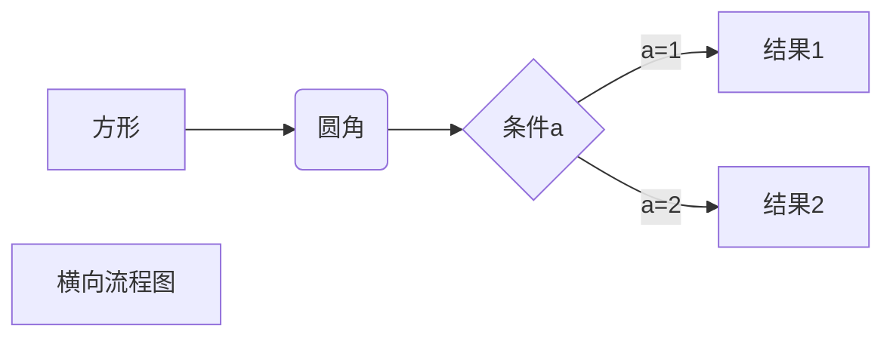

# 一级标题          或者用HTML语法：<h1>Heading level 1</h1>
## 二级标题			或者用HTML语法：<h2>Heading level 2</h2>
### 三级标题        ...
#### 四级标题       ...
##### 五级标题      ...
###### 六级标题     ...
在标题的下面写任意数量的==或者--来表示一级标题或者二级标题
*这里是文字*
_这里是文字_
**这里是文字**
***这里是文字***
~~这里是文字~~
我是正文
<table><tr><td bgcolor=orange>背景色是：orange</td></tr></table>
[文本替换链接](链接)
[百度一下，你就知道](baidu.com)

[百度一下，你就知道](baidu.com "搜索网站")

<a href="超链接地址" title="超链接title">超链接显示名</a>

<"...[相关链接]">

## 这是我的标题{#index}   //在某个标题后面设置锚点

跳转到[目录](#index)		//回到锚点

xxxx[^1]xxxxx

[^1]:xxxxx

``printf("hello world");``	//这是markdown语法
<code>printf("hello world");</code> //这是HTML语法

