# 效果系统架构设计

## 设计目标

设计一套完整的效果系统架构，支持多种效果类型（属性加成、专长授予、技能授予、控制效果等），实现效果生命周期管理、数值计算、目标适配、集合管理，提供基于DataHandleQueue的完全解耦数据驱动架构。

---

## 核心设计理念

### 1. DataHandleQueue解耦为核心

**本质**：效果系统的核心是DataHandleQueue的解耦通信
- 效果应用 = 推送数据到队列，不直接操作目标对象
- 效果停用 = 推送移除数据到队列，不直接清理目标状态
- 完全解耦 = 效果与目标对象无直接依赖，通过队列通信
- 数据驱动 = 效果只负责推送数据，目标对象负责处理业务逻辑

### 2. 数据驱动架构

**本质**：效果特性通过配置数据实现，无需修改代码
- 效果类型、参数、持续时间 → 通过配置数据定义
- 叠加策略、计算方式 → 通过配置数据调整
- 新增效果类型 → 扩展配置数据即可
- 效果平衡 → 调整配置数值即可

### 3. 分层架构 + 生命周期管理

**本质**：分层架构实现职责分离，生命周期管理实现标准化流程
- 五层架构：生命周期层、计算层、适配层、集合层、系统层
- 生命周期：激活 → 应用 → 更新 → 停用 → 清理
- 对象池管理：上下文对象池，减少GC压力
- 统一接口：所有效果类通过标准接口实现

---

## 整体架构设计

### 五层架构 + DataHandleQueue

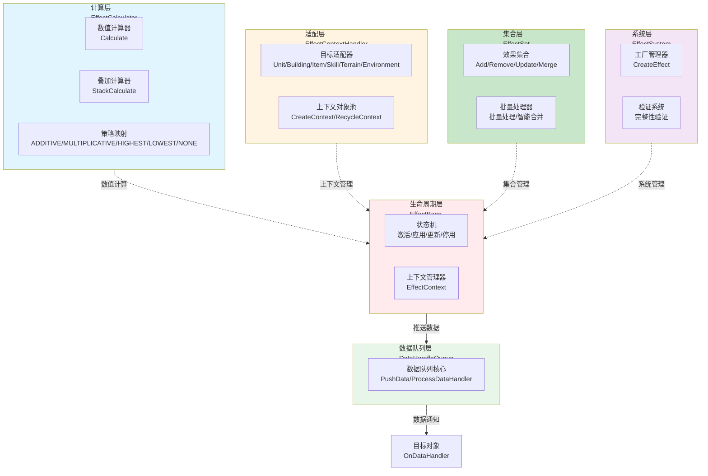

### 数据驱动数据流

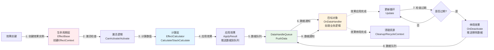

---

## 各层详细设计

### 生命周期层（EffectBase）

#### 架构设计

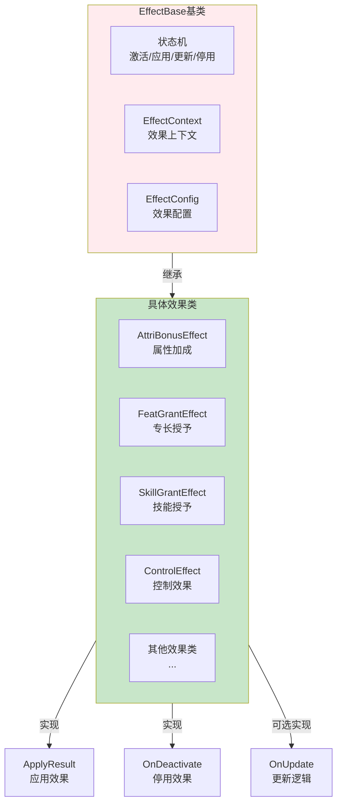

#### 核心组件说明

1. **EffectBase（效果基类）**
   - **职责**：管理效果的激活、停用、更新等生命周期
   - **特点**：所有效果类的基类，提供标准化流程
   - **核心方法**：
     - `Activate()`：激活效果
     - `Deactivate()`：停用效果
     - `Update()`：更新效果
     - `ApplyResult()`：应用效果（子类实现）
     - `OnDeactivate()`：停用逻辑（子类实现）

2. **EffectContext（效果上下文）**
   - **职责**：存储效果执行过程中的上下文数据
   - **数据**：目标对象、配置数据、计算结果等
   - **管理**：由EffectContextHandler创建和回收

3. **EffectConfig（效果配置）**
   - **职责**：存储效果的配置数据
   - **数据**：效果类型、参数、持续时间、叠加策略等
   - **来源**：EffectConfigManager或EffectUtil创建

---

### 计算层（EffectCalculator）

#### 架构设计

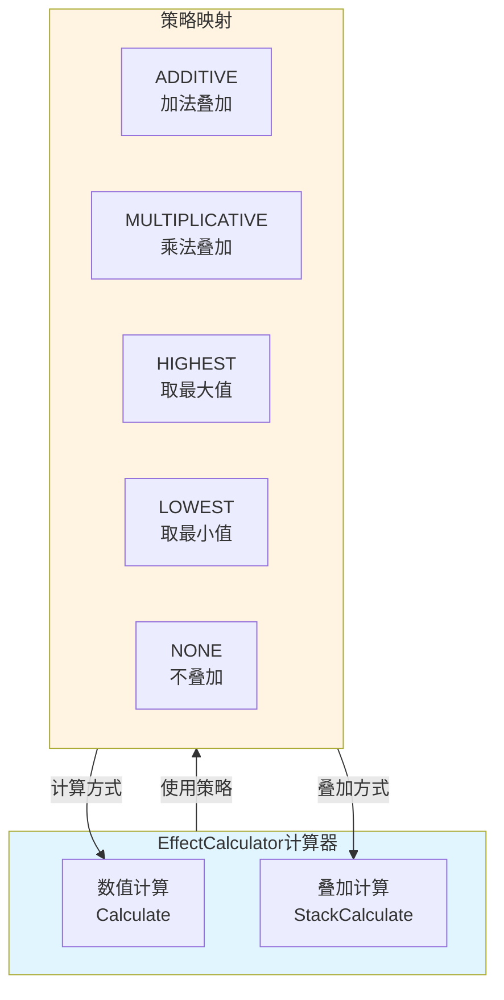

#### 核心组件说明

1. **EffectCalculator（效果计算器）**
   - **职责**：纯函数式数值计算和叠加逻辑
   - **特点**：无状态、可复用、高性能
   - **核心方法**：
     - `Calculate()`：计算效果数值
     - `StackCalculate()`：计算叠加后的数值

2. **叠加策略（StackStrategy）**
   - **ADDITIVE**：数值相加，适用于属性加成、伤害加成
   - **MULTIPLICATIVE**：数值相乘，适用于暴击倍率、经验加成
   - **HIGHEST**：保留最高值，适用于护甲值、抗性值
   - **LOWEST**：保留最低值，适用于移动速度限制
   - **NONE**：忽略重复，适用于唯一状态效果

---

### 适配层（EffectContextHandler）

#### 架构设计

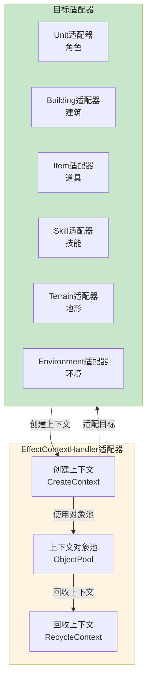

#### 核心组件说明

1. **EffectContextHandler（上下文处理器）**
   - **职责**：目标对象适配，统一操作接口
   - **支持目标**：角色、建筑、道具、技能、地形、环境
   - **核心功能**：
     - `CreateContext()`：创建上下文
     - `RecycleContext()`：回收上下文
     - 对象池管理：减少GC压力

---

### 集合层（EffectSet）

#### 架构设计

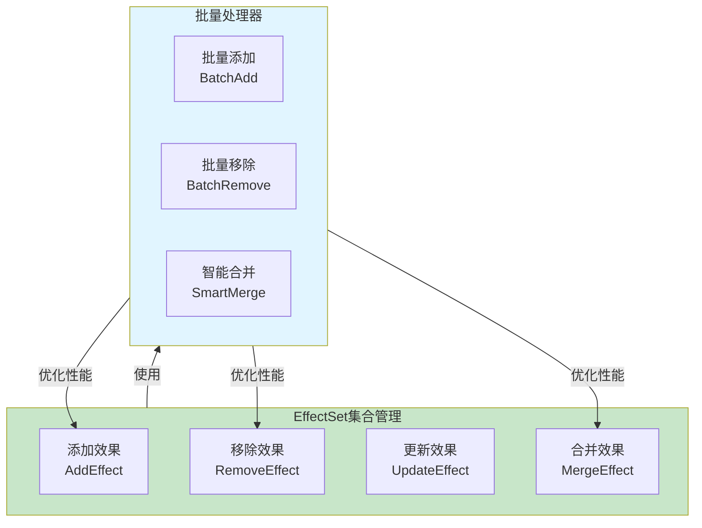

#### 核心组件说明

1. **EffectSet（效果集合）**
   - **职责**：效果集合管理、生命周期控制
   - **功能**：添加、移除、更新、合并效果
   - **性能优化**：批量处理、智能合并

---

### 系统层（EffectSystem）

#### 架构设计

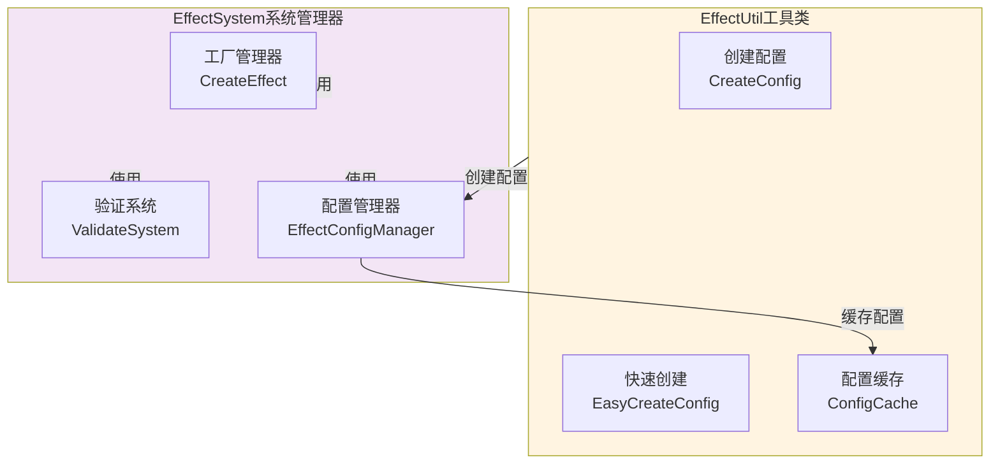

#### 核心组件说明

1. **EffectSystem（系统管理器）**
   - **职责**：系统级管理、对象池、完整性验证
   - **功能**：工厂管理、性能监控、系统验证

2. **EffectUtil（效果工具类）**
   - **职责**：效果配置创建、ID管理、快速配置生成
   - **配置缓存**：自动将创建的效果配置添加到系统缓存
   - **使用场景**：运行时动态创建效果、测试环境快速配置、程序化效果生成

---

## 效果类型体系

### 支持的效果类型

| 效果类型 | 枚举值 | 效果类 | 功能描述 |
|---------|-------|--------|----------|
| 属性加成 | `ATTR_BONUS` | `AttriBonusEffect` | 增加角色属性值 |
| 属性覆盖 | `ATTR_COVER` | `AttriCoverEffect` | 直接覆盖属性值 |
| 属性替换 | `ATTR_CHANGE` | `AttriChangeEffect` | 替换属性类型 |
| 专长授予 | `FEAT_GRANT` | `FeatGrantEffect` | 临时授予专长 |
| 技能授予 | `SKILL_GRANT` | `SkillGrantEffect` | 临时授予技能 |
| 技能替换 | `SKILL_REPLACE` | `SkillReplaceEffect` | 替换现有技能 |
| 控制效果 | `CONTROL` | `ControlEffect` | 施加控制状态 |
| 传送效果 | `TELEPORT` | `TeleportEffect` | 传送到指定位置 |
| 能力开关 | `CHARACTER_ABILITY` | `UnitAbilityEffect` | 开启/关闭角色能力 |

### 效果叠加策略

| 策略类型 | 枚举值 | 计算方式 | 适用场景 |
|---------|-------|----------|----------|
| 加法叠加 | `ADDITIVE` | 数值相加 | 属性加成、伤害加成 |
| 乘法叠加 | `MULTIPLICATIVE` | 数值相乘 | 暴击倍率、经验加成 |
| 取最大值 | `HIGHEST` | 保留最高值 | 护甲值、抗性值 |
| 取最小值 | `LOWEST` | 保留最低值 | 移动速度限制 |
| 不叠加 | `NONE` | 忽略重复 | 唯一状态效果 |

---

## 工作流程设计

### 效果激活流程

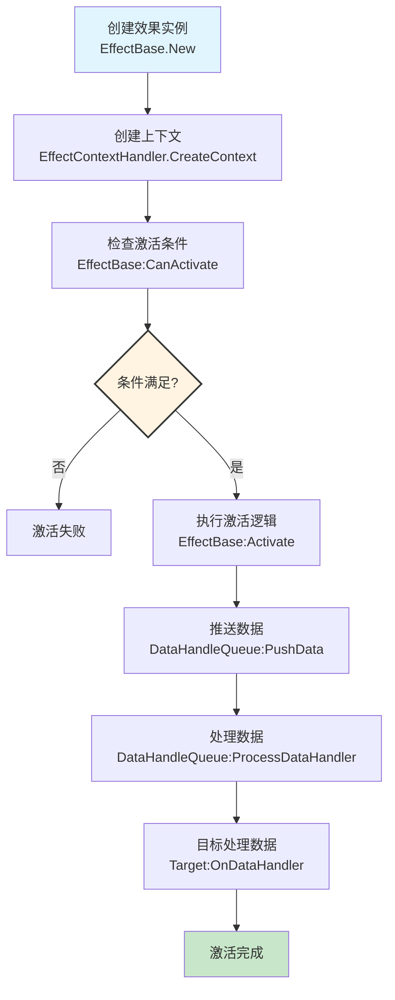

### 效果应用流程

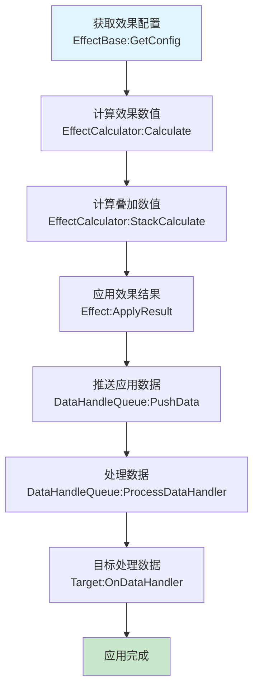

### 效果更新流程

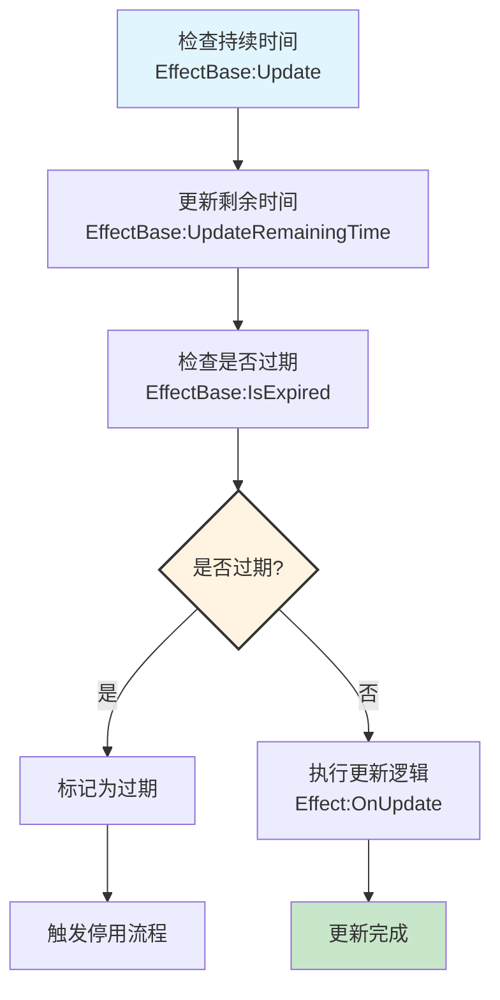

### 效果停用流程

```mermaid
flowchart TD
    Start[检查停用条件<br/>EffectBase:CanDeactivate] --> ExecuteDeactivate[执行停用逻辑<br/>Effect:OnDeactivate]
    ExecuteDeactivate --> PushRemoveData[推送移除数据<br/>DataHandleQueue:PushData(Remove)]
    PushRemoveData --> ProcessData[处理数据<br/>DataHandleQueue:ProcessDataHandler]
    ProcessData --> TargetHandler[目标处理数据<br/>Target:OnDataHandler]
    TargetHandler --> CleanupState[清理效果状态<br/>EffectBase:Cleanup]
    CleanupState --> RecycleContext[回收上下文<br/>EffectContextHandler.RecycleContext]
    RecycleContext --> DeactivateComplete[停用完成]
    
    style Start fill:#e1f5ff
    style DeactivateComplete fill:#c8e6c9
```

### 完整效果生命周期

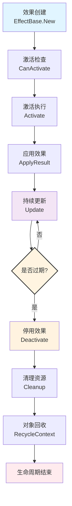

---

## 数据流设计

### Context数据流增强过程

```mermaid
graph LR
    Step1[1. 效果创建<br/>EffectBase.New<br/>创建EffectContext] --> Step2[2. 激活检查<br/>EffectBase:CanActivate<br/>+激活条件检查结果]
    Step2 --> Step3[3. 激活执行<br/>EffectBase:Activate<br/>+激活状态]
    Step3 --> Step4[4. 计算数值<br/>EffectCalculator:Calculate<br/>+计算结果]
    Step4 --> Step5[5. 应用效果<br/>Effect:ApplyResult<br/>+应用数据]
    Step5 --> Step6[6. 推送数据<br/>DataHandleQueue:PushData<br/>+队列数据]
    Step6 --> Step7[7. 目标处理<br/>Target:OnDataHandler<br/>+处理结果]
    Step7 --> Step8[8. 更新循环<br/>EffectBase:Update<br/>+更新时间]
    Step8 --> Step9[9. 停用效果<br/>Effect:OnDeactivate<br/>+停用数据]
    Step9 --> Step10[10. 清理资源<br/>EffectBase:Cleanup<br/>+清理状态]
    
    style Step1 fill:#e1f5ff
    style Step5 fill:#c8e6c9
    style Step6 fill:#e8f5e9
    style Step10 fill:#ffebee
```

### 数据流程说明

1. **效果激活流程**
   ```
   Effect.ApplyResult() → PushData() → DataHandleQueue → Target Handler
   ```

2. **效果停用流程**
   ```
   Effect.OnDeactivate() → PushData(Remove) → DataHandleQueue → Target Handler
   ```

3. **数据查询流程**
   ```
   Effect → DataHandleQueue.QueryNotify() → Target Handler → Return Result
   ```

---

## 使用方式

### 效果配置创建

系统提供两种配置创建方式：

#### 1. **完整配置创建**
通过 `EffectUtil.CreateConfig()` 创建包含所有参数的效果配置：
- 支持优先级、等级、持续时间、目标类型、叠加策略等完整参数
- 自动生成唯一ID并添加到系统缓存
- 适用于需要精确控制的效果配置

#### 2. **快速配置创建**
通过 `EffectUtil.EasyCreateConfig()` 快速创建基础效果配置：
- 只需提供模板ID和参数即可
- 自动设置合理的默认值
- 适用于快速原型开发和测试

### 创建新效果类

新效果类需要实现两个核心方法：
1. **ApplyResult**：应用效果时推送数据到队列
2. **OnDeactivate**：停用效果时推送移除数据到队列

### 注册数据处理器

目标对象通过注册处理器来响应数据变更，实现业务逻辑的具体处理。

---

## 架构验证

### 流程合理性验证

从架构可看出：
- **数据流完整**：效果创建 → 激活 → 应用 → 更新 → 停用 → 清理
- **职责清晰**：每层职责明确，无重叠
- **解耦设计**：通过DataHandleQueue实现效果与目标对象的完全解耦

### 扩展性验证

从架构可看出：
- **数据驱动**：新效果类型通过配置数据扩展
- **策略模式**：叠加策略支持灵活扩展
- **管道过滤器**：每层可独立替换和扩展

### 完整性验证

系统提供完整的验证机制，确保：
- **效果类型映射**：所有枚举都有对应的效果类
- **计算器完整性**：所有效果类型都有计算器和叠加计算器
- **配置有效性**：效果配置格式正确
- **目标适配**：目标类型适配器完整性

---

## 总结

TBBattle效果系统采用**分层架构 + 数据驱动 + DataHandleQueue解耦 + 对象池**的现代化设计，实现了：

- **完整架构**：五层架构设计，职责清晰，组件独立
- **完全解耦**：效果与目标对象无直接依赖，通过DataHandleQueue通信
- **高度可扩展**：新效果类型可轻松添加，只需实现ApplyResult和OnDeactivate
- **性能优化**：对象池和懒加载减少GC压力
- **代码简洁**：标准化的实现模板，统一的接口定义
- **易于维护**：清晰的职责分离和接口定义

这种架构为游戏系统的长期发展提供了坚实的基础，支持复杂的技能效果、状态管理和属性计算需求。
