# FSM状态机架构设计

## 设计目标

设计一套完整的状态机系统，支持多种状态机类型（基础状态机、下推状态机、并发状态机、层次状态机），实现状态切换、事件监听、状态栈管理、子状态机管理，提供灵活的状态管理解决方案。

---

## 核心设计理念

### 1. 状态模式为核心

**本质**：状态机系统的核心是状态模式的应用
- 状态切换 = 当前状态退出 → 新状态进入
- 状态更新 = 当前状态的Update方法持续调用
- 状态管理 = 状态注册、查找、切换的统一管理
- 状态隔离 = 每个状态独立管理自己的逻辑

### 2. 多态状态机架构

**本质**：通过继承实现多种状态机类型，满足不同场景需求
- 基础状态机 = 简单的状态切换，适用于单一系统
- 下推状态机 = 状态栈管理，适用于菜单系统、暂停恢复
- 并发状态机 = 多子状态机并行，适用于多系统协同
- 层次状态机 = 状态嵌套，适用于复杂状态管理

### 3. 对象池管理 + 事件驱动

**本质**：状态机使用对象池管理，通过事件系统实现解耦
- 对象池管理 = 状态机实例复用，减少GC压力
- 事件驱动 = 状态变化通过事件通知，实现解耦
- 生命周期管理 = 状态进入/退出/暂停/恢复的标准化流程

---

## 整体架构设计

### 四类状态机架构 + 状态模式

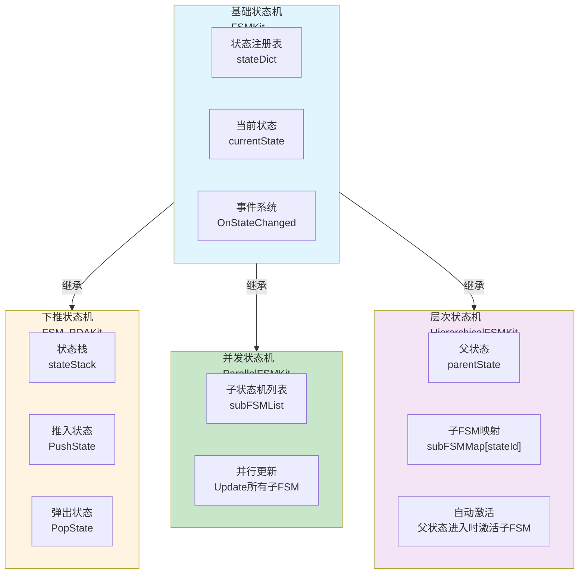

### 状态切换数据流

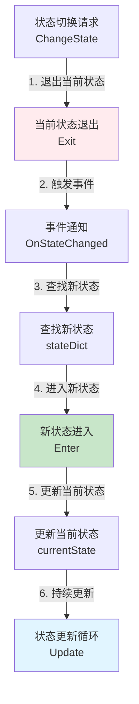

**数据流特性**：
- ✅ **状态隔离**：每个状态独立管理自己的逻辑
- ✅ **标准化流程**：退出 → 切换 → 进入 → 更新
- ✅ **事件驱动**：状态变化通过事件通知
- ✅ **生命周期管理**：状态进入/退出/暂停/恢复的完整生命周期

---

## 基础状态机架构设计

### 核心职责

状态注册管理 + 状态切换 + 状态更新 + 事件通知

### 架构图

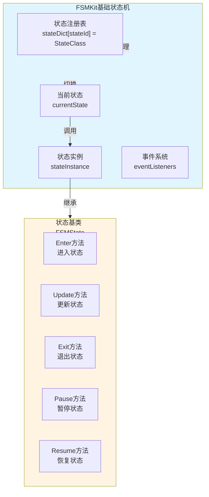

### 工作流程

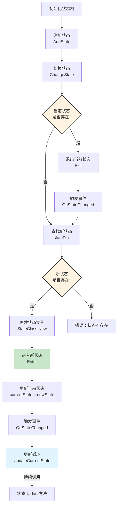

---

## 下推状态机架构设计

### 核心职责

状态栈管理 + 状态推入/弹出 + 状态暂停/恢复

### 架构图

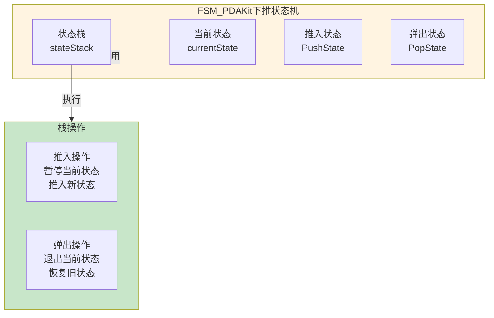

### 工作流程

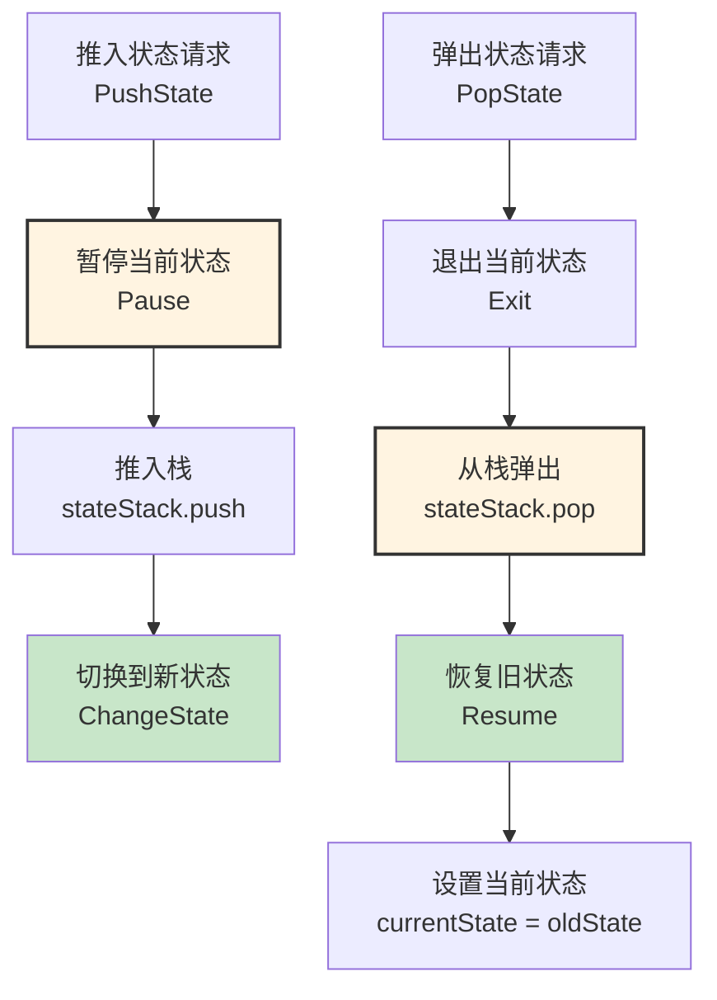

---

## 并发状态机架构设计

### 核心职责

多子状态机管理 + 并行更新 + 生命周期同步

### 架构图

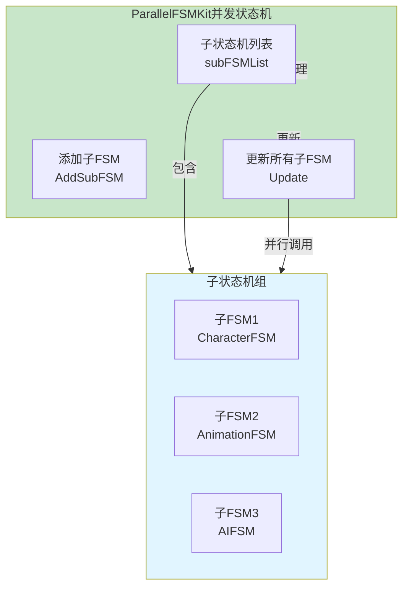

### 工作流程

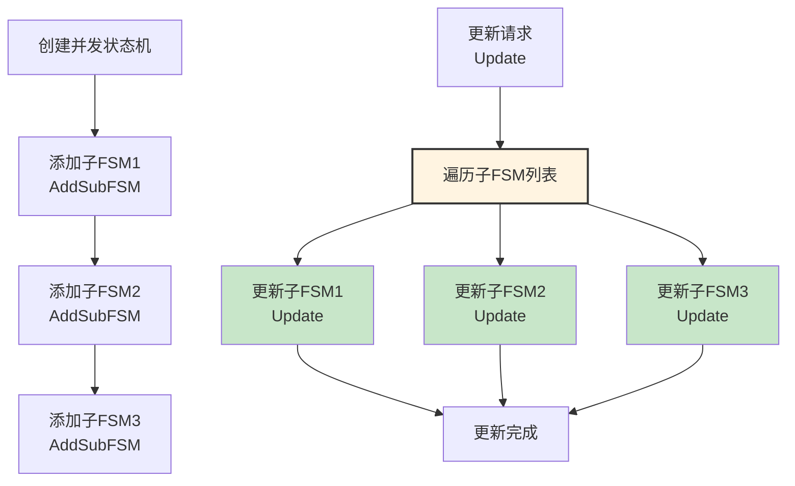

---

## 层次状态机架构设计

### 核心职责

状态嵌套管理 + 子FSM自动激活 + 父子状态同步

### 架构图

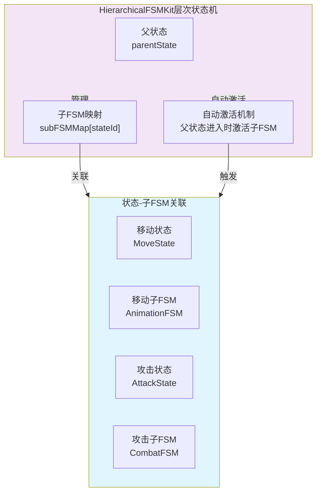

### 工作流程

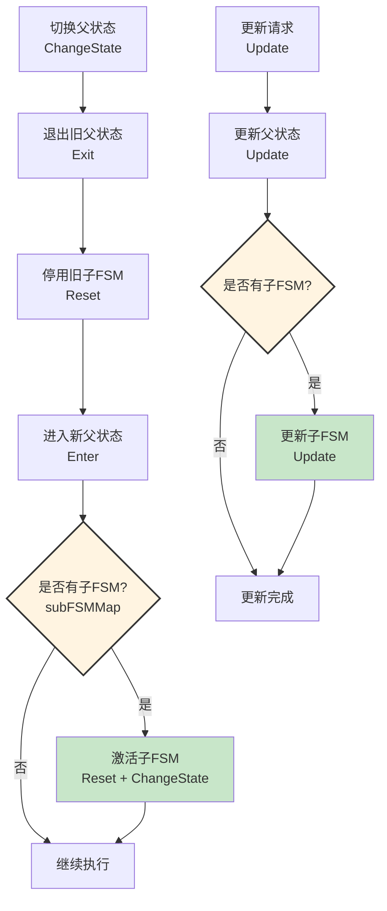

---

## 架构模式分析

### 状态模式（State Pattern）

**核心思想**：状态封装行为，状态机管理状态切换

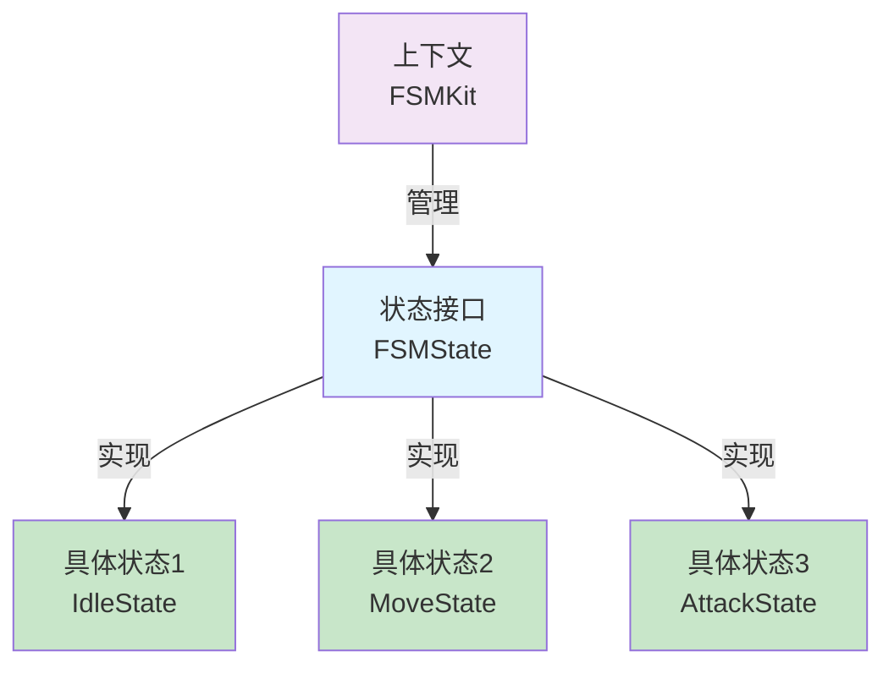

**优势**：
- ✅ **状态隔离**：每个状态独立管理自己的逻辑
- ✅ **易于扩展**：新增状态只需添加新的状态类
- ✅ **消除条件判断**：状态切换逻辑清晰，避免大量if-else

### 对象池模式（Object Pool Pattern）

**核心思想**：状态机实例复用，减少GC压力

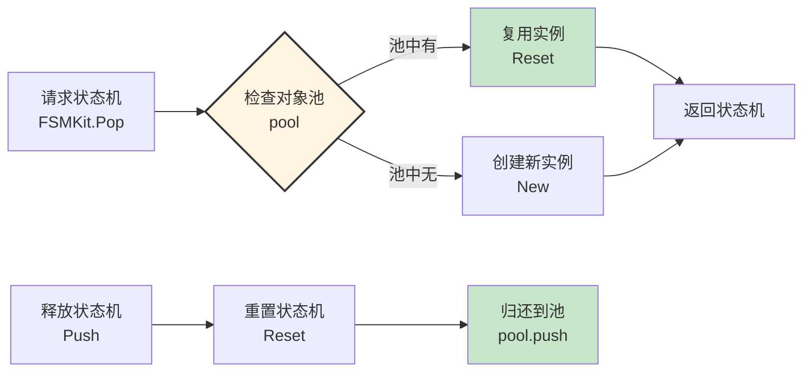

---

## 数据流设计

### 状态切换数据流

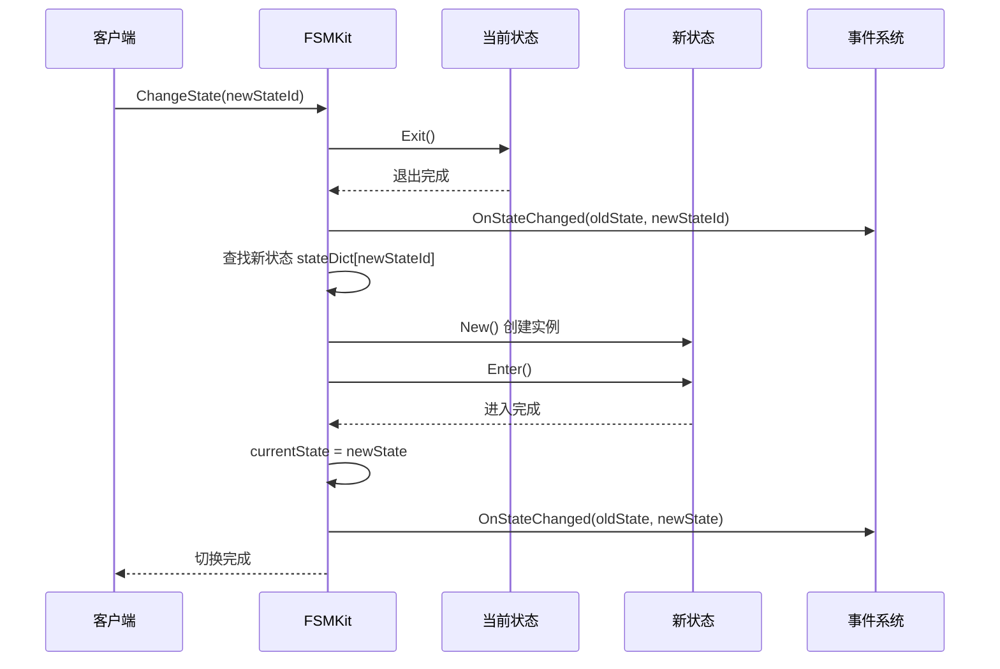

### 并发状态机更新数据流

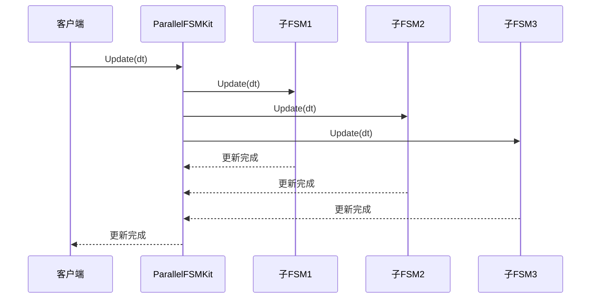

---

## 架构验证

### 流程合理性验证

从架构可验证：
- ✅ **数据流完整**：状态切换 → 退出 → 进入 → 更新（完整流程）
- ✅ **职责清晰**：基础状态机、下推状态机、并发状态机、层次状态机职责明确
- ✅ **解耦设计**：通过状态模式和事件系统实现解耦
- ✅ **生命周期管理**：状态进入/退出/暂停/恢复的完整生命周期

### 扩展性验证

从架构可验证：
- ✅ **状态模式**：新增状态只需添加新的状态类
- ✅ **多态设计**：通过继承实现多种状态机类型
- ✅ **事件系统**：支持状态变化的事件监听
- ✅ **对象池管理**：状态机实例复用，减少GC压力

### 易用性验证

从架构可验证：
- ✅ **统一接口**：所有状态机类型使用统一的接口
- ✅ **标准化流程**：状态切换流程标准化
- ✅ **事件驱动**：状态变化通过事件通知
- ✅ **调试支持**：提供调试日志和调试信息

---

## 开发指导原则

### 一、开发约束（什么能做，什么不能做）

#### ✅ 应该做的

1. **状态必须继承FSMState**
   ```
   ✅ 正确：
   local MyState = BaseClass(FSMState)
   
   ❌ 错误：
   不继承FSMState的状态类
   ```

2. **状态切换必须通过ChangeState**
   ```
   ✅ 正确：
   fsm:ChangeState(newStateId)
   
   ❌ 错误：
   直接修改currentState
   ```

3. **状态机必须使用对象池**
   ```
   ✅ 正确：
   local fsm = FSMKit.Pop(type)
   -- 使用后
   fsm:Push()
   
   ❌ 错误：
   直接创建状态机实例
   ```

#### ❌ 不应该做的

1. **禁止直接修改状态机内部状态**
   - 必须通过ChangeState切换状态
   - 不能直接修改currentState

2. **禁止在状态Update中执行耗时操作**
   - Update方法应该快速执行
   - 耗时操作应该异步处理

3. **禁止状态之间直接依赖**
   - 状态之间应该通过状态机通信
   - 不能直接调用其他状态的方法

### 二、开发流程（标准化开发步骤）

#### 开发新状态的流程

```
1. 定义状态枚举
   ↓
   ECharacterState = { Idle = 1, Move = 2 }
   
2. 创建状态类
   ↓
   local IdleState = BaseClass(FSMState)
   function IdleState:Enter() end
   function IdleState:Update() end
   function IdleState:Exit() end
   
3. 注册状态
   ↓
   fsm:AddState(ECharacterState.Idle, IdleState)
   
4. 切换状态
   ↓
   fsm:ChangeState(ECharacterState.Idle)
```

---

## 总结

### 架构设计价值

该架构设计文档的价值在于：
- ✅ **思路解构**：完整解构状态机系统的搭建思路
- ✅ **流程验证**：从架构层面验证流程合理性
- ✅ **模式分析**：分析状态模式、对象池模式的应用
- ✅ **开发指导**：为后续详细设计和实现提供清晰指导

### 设计原则

- ✅ **状态模式为核心**：状态封装行为，状态机管理状态切换
- ✅ **多态状态机架构**：通过继承实现多种状态机类型
- ✅ **对象池管理 + 事件驱动**：状态机实例复用，状态变化通过事件通知
- ✅ **生命周期管理**：状态进入/退出/暂停/恢复的标准化流程

### 架构特点

- ✅ **状态隔离**：每个状态独立管理自己的逻辑
- ✅ **灵活扩展**：支持基础、下推、并发、层次四种状态机类型
- ✅ **事件驱动**：状态变化通过事件通知，实现解耦
- ✅ **性能优化**：对象池管理，减少GC压力

细节实现是后续开发阶段的工作，当前架构设计已足够指导整个状态机系统的开发。
