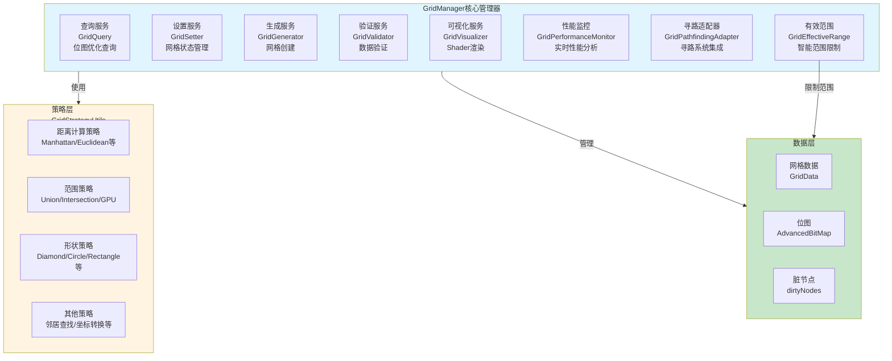
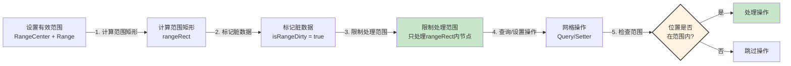
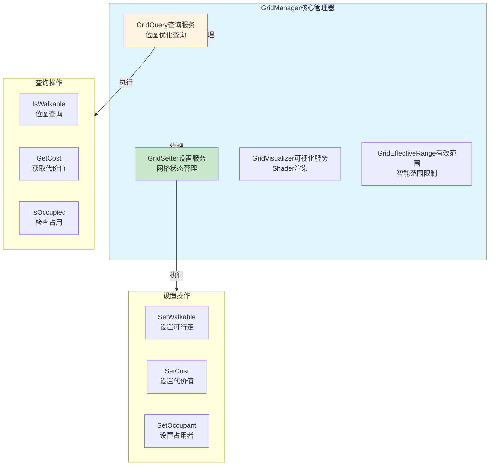
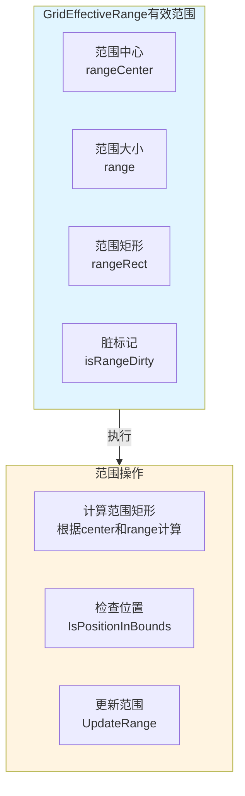
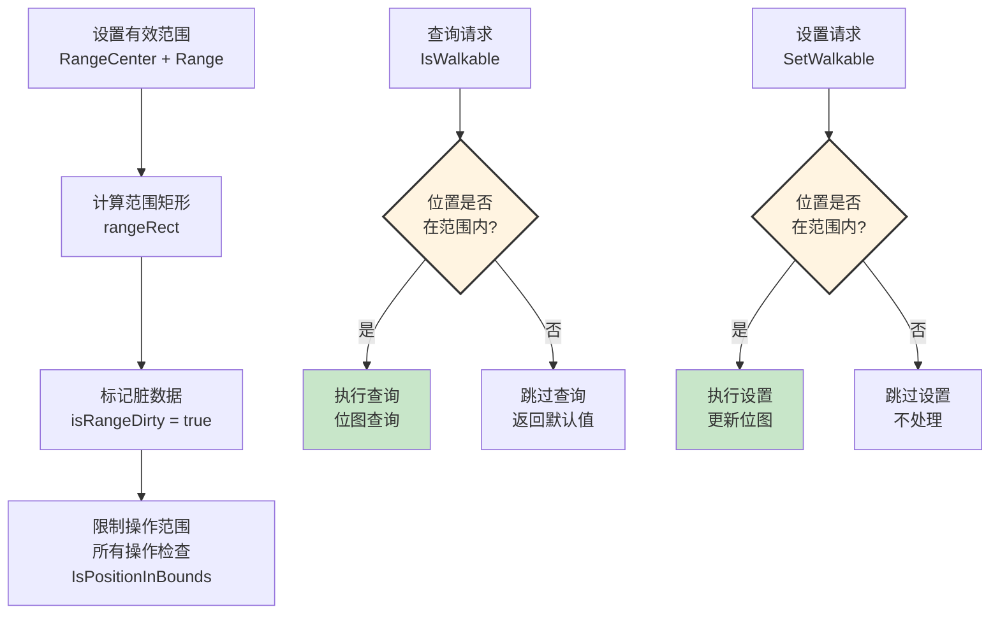
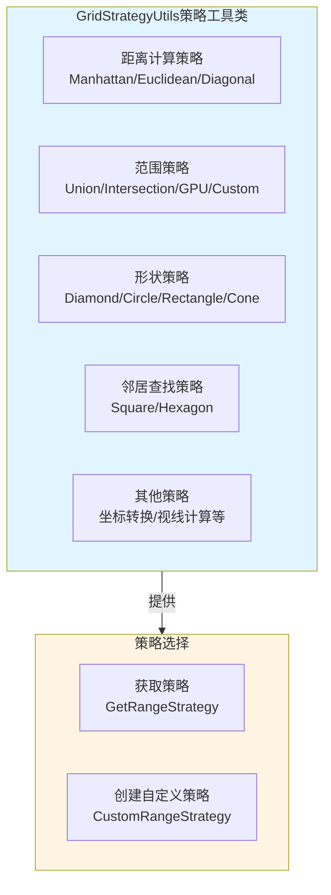
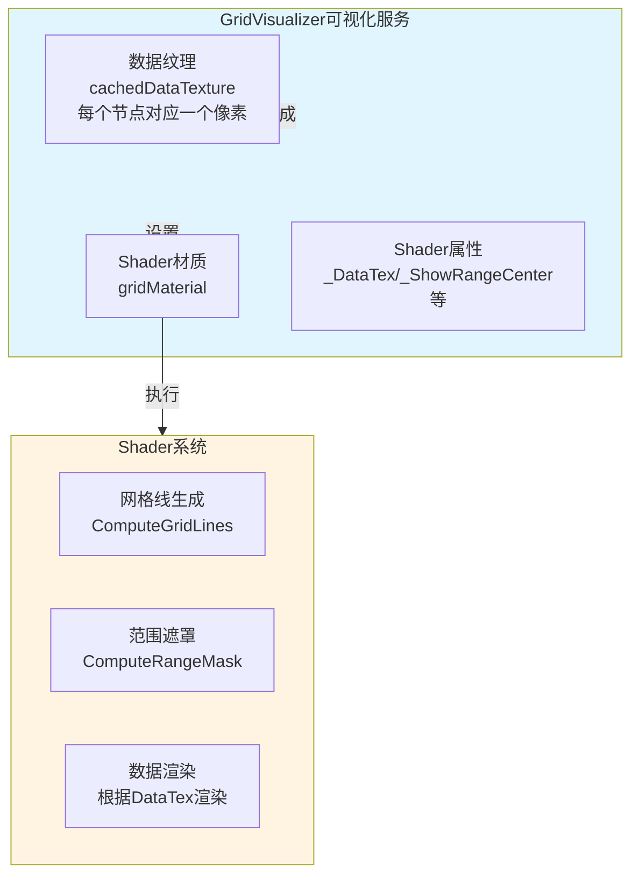
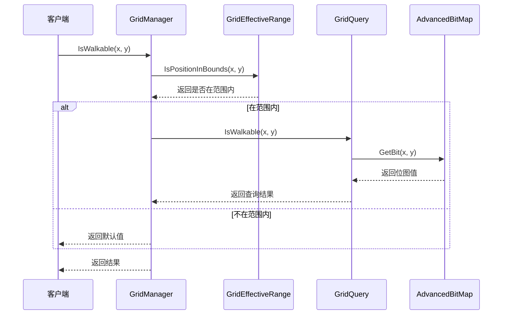
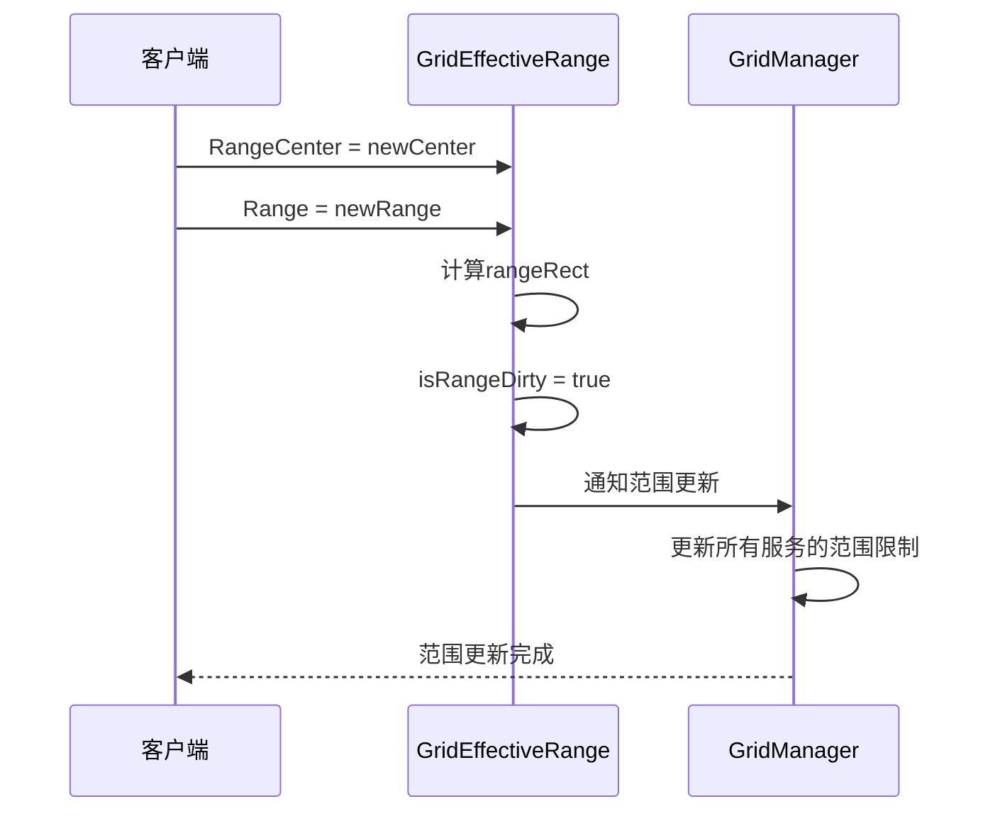

# GridSystem网格系统架构设计

## 设计目标

设计一套完整的高性能网格系统，支持大规模网格（10000x10000）、位图优化查询、有效范围系统、策略模式架构、Shader可视化渲染，提供灵活、高性能的网格管理解决方案。

---

## 核心设计理念

### 1. 有效范围系统为核心

**本质**：网格系统的核心是有效范围系统，通过智能限制数据同步范围实现数量级性能提升
- 范围限制 = 只处理有效范围内的网格节点
- 性能提升 = 从处理整个地图到只处理有效范围，实现2268倍性能提升
- 内存优化 = 99.96%内存节省
- 动态调整 = 支持运行时范围修改

### 2. 策略模式架构

**本质**：通过策略模式实现灵活的算法选择，易于扩展
- 距离计算策略 = Manhattan、Euclidean、Diagonal、Chebyshev
- 范围查找策略 = Node、Distance、Cost、Union、Intersection、GPU
- 形状策略 = 菱形、圆形、矩形、锥形、十字线
- 策略隔离 = 每个策略独立实现，互不干扰

### 3. 位图优化 + Shader渲染

**本质**：通过位图优化查询性能，通过Shader实现高性能渲染
- 位图优化 = 使用位运算实现O(1)复杂度查询，85%性能提升
- Shader渲染 = 单个Draw Call，极低内存占用
- 脏节点管理 = 只更新变化的节点
- 数据驱动 = Shader渲染，支持实时数据更新

---

## 整体架构设计

### 服务化架构 + 策略模式



### 有效范围数据流



**数据流特性**：
- ✅ **范围限制**：只处理有效范围内的网格节点
- ✅ **性能提升**：2268倍性能提升，99.96%内存节省
- ✅ **动态调整**：支持运行时范围修改
- ✅ **脏标记机制**：避免不必要的重复计算

---

## 服务层架构设计

### 核心职责

网格管理 + 查询服务 + 设置服务 + 可视化服务

### 架构图



---

## 有效范围系统架构设计

### 核心职责

范围计算 + 范围限制 + 脏标记管理

### 架构图



### 工作流程



---

## 策略层架构设计

### 核心职责

策略管理 + 策略选择 + 策略执行

### 架构图



---

## Shader可视化架构设计

### 核心职责

数据纹理生成 + Shader渲染 + 动态更新

### 架构图



---

## 架构模式分析

### 策略模式（Strategy Pattern）

**核心思想**：将不同的算法策略封装成独立的类，运行时动态选择

```mermaid
graph TB
    Context[上下文<br/>GridManager]
    StrategyInterface[策略接口<br/>IRangeStrategy等]
    
    Strategy1[策略1<br/>UnionRangeStrategy]
    Strategy2[策略2<br/>IntersectionRangeStrategy]
    Strategy3[策略3[GPURangeStrategy]]
    
    Context -->|使用| StrategyInterface
    StrategyInterface -->|实现| Strategy1
    StrategyInterface -->|实现| Strategy2
    StrategyInterface -->|实现| Strategy3
    
    style Context fill:#f3e5f5
    style StrategyInterface fill:#e1f5ff
    style Strategy1 fill:#c8e6c9
    style Strategy2 fill:#c8e6c9
    style Strategy3 fill:#c8e6c9
```

**优势**：
- ✅ **策略隔离**：每个策略独立实现，互不干扰
- ✅ **动态选择**：运行时动态选择最适合的策略
- ✅ **易于扩展**：新增策略只需实现策略接口
- ✅ **统一接口**：所有策略通过统一接口访问

---

## 数据流设计

### 网格查询数据流



### 有效范围更新数据流



---

## 架构验证

### 流程合理性验证

从架构可验证：
- ✅ **数据流完整**：查询请求 → 范围检查 → 位图查询 → 返回结果（完整流程）
- ✅ **职责清晰**：GridManager、各服务、策略层职责明确，无重叠
- ✅ **解耦设计**：通过策略模式和服务化架构实现解耦
- ✅ **性能优化**：有效范围系统、位图优化、Shader渲染

### 扩展性验证

从架构可验证：
- ✅ **策略模式**：新增策略只需实现策略接口
- ✅ **服务化架构**：新增服务只需实现服务接口
- ✅ **有效范围系统**：支持动态范围调整
- ✅ **Shader扩展**：可以扩展Shader功能

### 性能验证

从架构可验证：
- ✅ **有效范围**：2268倍性能提升，99.96%内存节省
- ✅ **位图优化**：85%查询性能提升
- ✅ **Shader渲染**：单个Draw Call，极低内存占用
- ✅ **脏节点管理**：只更新变化的节点

---

## 开发指导原则

### 一、开发约束（什么能做，什么不能做）

#### ✅ 应该做的

1. **网格操作必须通过GridManager**
   ```
   ✅ 正确：
   GridManager.Instance.Query.IsWalkable(x, y)
   
   ❌ 错误：
   直接访问GridData
   ```

2. **必须使用有效范围系统**
   ```
   ✅ 正确：
   GridEffectiveRange.Instance.RangeCenter = center
   GridEffectiveRange.Instance.Range = range
   
   ❌ 错误：
   不使用有效范围系统，处理整个地图
   ```

3. **策略必须通过GridStrategyUtils获取**
   ```
   ✅ 正确：
   var strategy = GridStrategyUtils.GetRangeStrategy(RangeStrategyType.Union)
   
   ❌ 错误：
   直接创建策略实例
   ```

#### ❌ 不应该做的

1. **禁止直接操作GridData**
   - 必须通过GridManager统一管理
   - 不能直接修改GridData

2. **禁止绕过有效范围系统**
   - 所有操作必须检查有效范围
   - 不能处理范围外的节点

3. **禁止直接操作位图**
   - 必须通过GridQuery和GridSetter
   - 不能直接操作AdvancedBitMap

### 二、开发流程（标准化开发步骤）

#### 使用网格系统的标准流程

```
1. 初始化网格
   ↓
   GridManager.Instance.GenerateFromConfig(config)
   
2. 设置有效范围
   ↓
   GridEffectiveRange.Instance.RangeCenter = center
   GridEffectiveRange.Instance.Range = range
   
3. 查询网格
   ↓
   GridManager.Instance.Query.IsWalkable(x, y)
   
4. 设置网格
   ↓
   GridManager.Instance.Setter.SetWalkable(x, y, true)
```

---

## 总结

### 架构设计价值

该架构设计文档的价值在于：
- ✅ **思路解构**：完整解构网格系统的搭建思路
- ✅ **流程验证**：从架构层面验证流程合理性
- ✅ **模式分析**：分析策略模式、服务化架构的应用
- ✅ **开发指导**：为后续详细设计和实现提供清晰指导

### 设计原则

- ✅ **有效范围系统为核心**：通过智能限制数据同步范围实现数量级性能提升
- ✅ **策略模式架构**：通过策略模式实现灵活的算法选择
- ✅ **位图优化 + Shader渲染**：通过位图优化查询性能，通过Shader实现高性能渲染
- ✅ **服务化架构**：通过服务化架构实现职责分离和模块化

### 架构特点

- ✅ **高性能**：有效范围系统实现2268倍性能提升，位图优化实现85%查询性能提升
- ✅ **灵活扩展**：策略模式架构支持灵活的算法选择
- ✅ **Shader渲染**：单个Draw Call，极低内存占用
- ✅ **有效范围**：智能限制数据同步范围，99.96%内存节省

细节实现是后续开发阶段的工作，当前架构设计已足够指导整个网格系统的开发。
