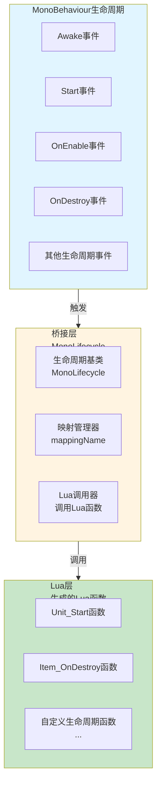
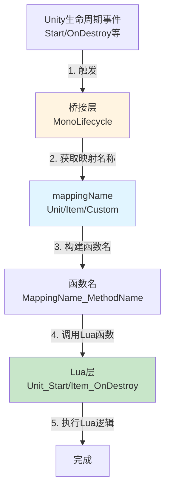
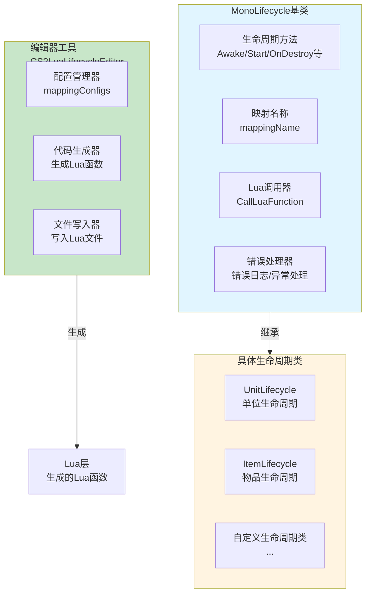
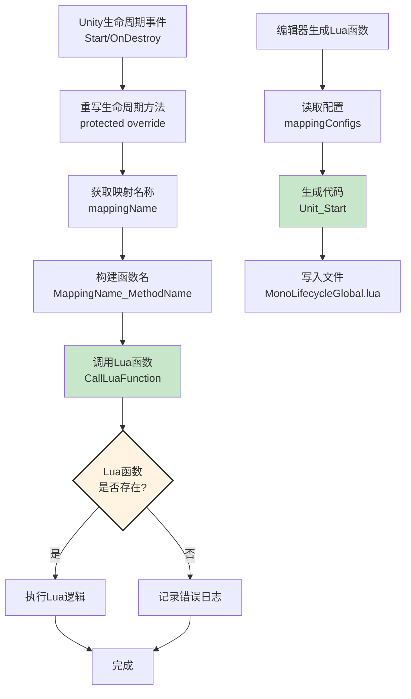
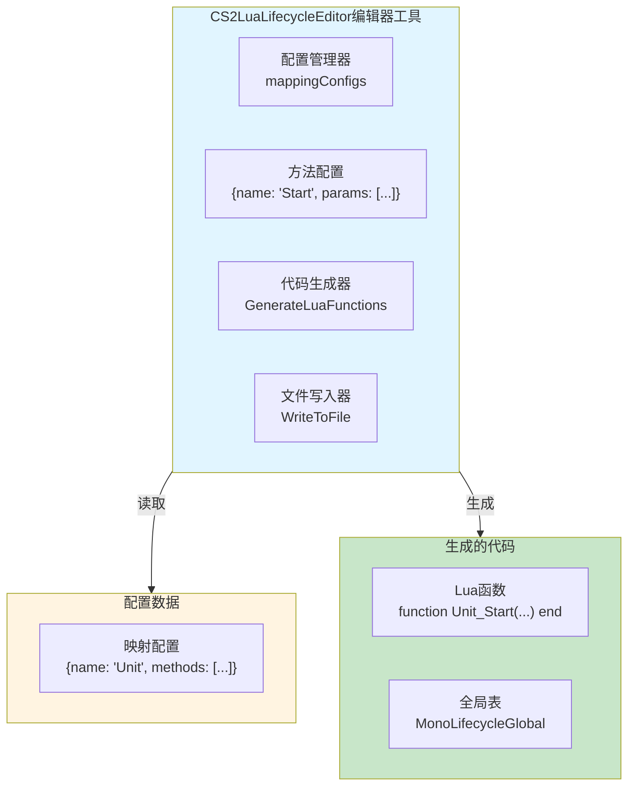
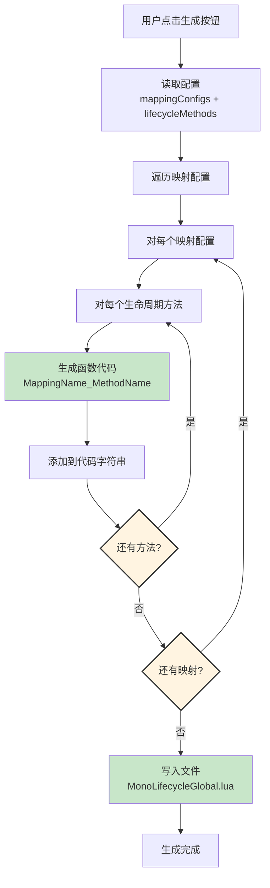
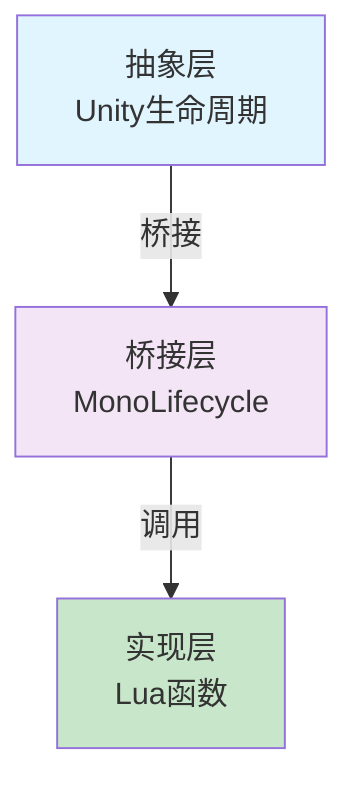
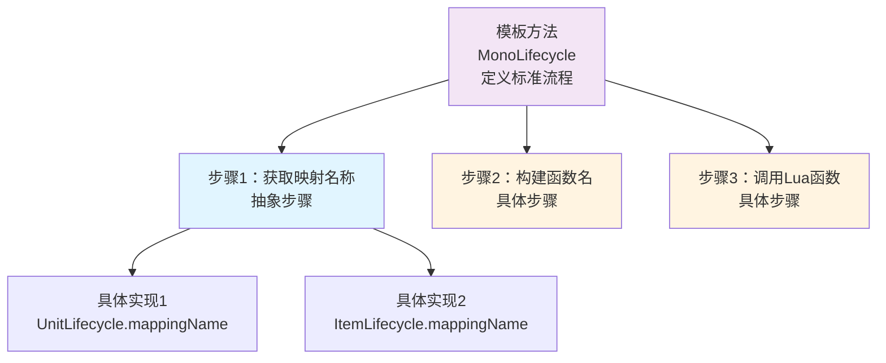
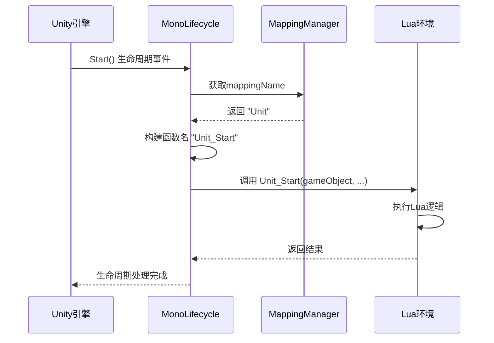
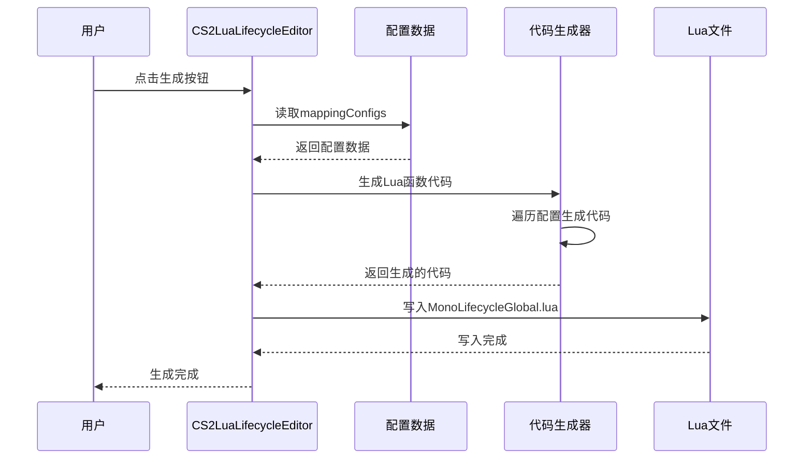

# Lifecycle生命周期架构设计

## 设计目标

设计一套完整的C#-Lua生命周期桥接系统，支持Unity生命周期事件自动调用Lua函数，实现C#与Lua之间的无缝交互，提供配置化的映射机制和自动代码生成。

---

## 核心设计理念

### 1. 桥接模式为核心

**本质**：生命周期系统的核心是C#与Lua之间的桥接
- C#生命周期 = Unity MonoBehaviour生命周期事件
- Lua函数调用 = 自动调用对应的Lua全局函数
- 映射机制 = 通过mappingName配置映射关系
- 自动生成 = 编辑器工具自动生成Lua函数代码

### 2. 模板方法模式 + 配置化

**本质**：通过模板方法模式定义标准流程，通过配置化实现灵活映射
- 模板方法 = MonoLifecycle定义标准的生命周期流程
- 配置化 = mappingName配置不同的映射类型
- 自动生成 = 编辑器工具根据配置自动生成Lua函数
- 统一接口 = 所有生命周期组件继承自MonoLifecycle

### 3. 职责分离 + 开闭原则

**本质**：每个类只负责特定的生命周期管理，对扩展开放对修改封闭
- 单一职责 = 每个类只负责特定的生命周期管理
- 开闭原则 = 新增生命周期类型只需继承MonoLifecycle
- 配置化 = 通过mappingName实现配置化的接口映射
- 统一接口 = 所有生命周期组件都继承自同一个基类

---

## 整体架构设计

### 三层架构 + 桥接模式



### 生命周期桥接数据流



**数据流特性**：
- ✅ **自动桥接**：Unity生命周期事件自动调用Lua函数
- ✅ **配置化映射**：通过mappingName配置不同的映射类型
- ✅ **统一接口**：所有生命周期组件使用统一的桥接机制
- ✅ **自动生成**：编辑器工具自动生成Lua函数代码

---

## 桥接层架构设计

### 核心职责

生命周期事件捕获 + 映射管理 + Lua函数调用

### 架构图



### 工作流程



---

## 编辑器工具架构设计

### 核心职责

配置管理 + 代码生成 + 文件写入

### 架构图



### 代码生成流程



---

## 架构模式分析

### 桥接模式（Bridge Pattern）

**核心思想**：将C#生命周期和Lua函数调用分离，通过桥接层连接



**优势**：
- ✅ **解耦设计**：C#生命周期和Lua实现分离
- ✅ **灵活扩展**：可以轻松添加新的生命周期类型
- ✅ **统一接口**：所有生命周期组件使用统一的桥接机制

### 模板方法模式（Template Method Pattern）

**核心思想**：MonoLifecycle定义标准的生命周期流程



---

## 数据流设计

### 生命周期事件数据流



### 代码生成数据流



---

## 架构验证

### 流程合理性验证

从架构可验证：
- ✅ **数据流完整**：Unity事件 → 桥接层 → Lua函数（完整流程）
- ✅ **职责清晰**：Unity层、桥接层、Lua层职责明确，无重叠
- ✅ **解耦设计**：通过桥接模式实现C#和Lua解耦
- ✅ **配置化**：通过mappingName实现配置化的映射

### 扩展性验证

从架构可验证：
- ✅ **模板方法模式**：新增生命周期类型只需继承MonoLifecycle
- ✅ **配置化映射**：通过mappingName配置不同的映射类型
- ✅ **自动生成**：编辑器工具自动生成Lua函数代码
- ✅ **统一接口**：所有生命周期组件使用统一的桥接机制

### 易用性验证

从架构可验证：
- ✅ **简单配置**：只需设置mappingName即可完成配置
- ✅ **自动生成**：编辑器工具自动生成Lua函数代码
- ✅ **统一接口**：所有生命周期组件使用统一的接口
- ✅ **错误处理**：完善的错误日志和异常处理

---

## 开发指导原则

### 一、开发约束（什么能做，什么不能做）

#### ✅ 应该做的

1. **生命周期类必须继承MonoLifecycle**
   ```
   ✅ 正确：
   public class UnitLifecycle : MonoLifecycle
   
   ❌ 错误：
   不继承MonoLifecycle的生命周期类
   ```

2. **必须设置mappingName**
   ```
   ✅ 正确：
   SetMappingName("Unit")
   
   ❌ 错误：
   不设置mappingName
   ```

3. **必须调用基类方法**
   ```
   ✅ 正确：
   protected override void Start()
   {
       base.Start();
   }
   
   ❌ 错误：
   不调用base.Start()
   ```

#### ❌ 不应该做的

1. **禁止直接调用Lua函数**
   - 必须通过MonoLifecycle的桥接机制
   - 不能直接调用Lua函数

2. **禁止修改生成的Lua函数**
   - 生成的Lua函数应该由编辑器工具管理
   - 不能手动修改生成的代码

3. **禁止在生命周期方法中执行耗时操作**
   - 生命周期方法应该快速执行
   - 耗时操作应该异步处理

### 二、开发流程（标准化开发步骤）

#### 开发新生命周期类型的流程

```
1. 创建生命周期类
   ↓
   public class MyLifecycle : MonoLifecycle
   
2. 设置映射名称
   ↓
   SetMappingName("MyCustom")
   
3. 重写生命周期方法
   ↓
   protected override void Start() { base.Start(); }
   
4. 使用编辑器工具生成Lua函数
   ↓
   Tools/CS2LuaLifecycle/生成Lua生命周期函数
   
5. 在Lua端实现函数
   ↓
   function MyCustom_Start(gameObject, ...) end
```

---

## 总结

### 架构设计价值

该架构设计文档的价值在于：
- ✅ **思路解构**：完整解构生命周期桥接系统的搭建思路
- ✅ **流程验证**：从架构层面验证流程合理性
- ✅ **模式分析**：分析桥接模式、模板方法模式的应用
- ✅ **开发指导**：为后续详细设计和实现提供清晰指导

### 设计原则

- ✅ **桥接模式为核心**：C#生命周期和Lua函数调用通过桥接层连接
- ✅ **模板方法模式 + 配置化**：通过模板方法定义标准流程，通过配置化实现灵活映射
- ✅ **职责分离 + 开闭原则**：每个类只负责特定的生命周期管理，对扩展开放对修改封闭
- ✅ **自动生成**：编辑器工具自动生成Lua函数代码

### 架构特点

- ✅ **自动桥接**：Unity生命周期事件自动调用Lua函数
- ✅ **配置化映射**：通过mappingName配置不同的映射类型
- ✅ **统一接口**：所有生命周期组件使用统一的桥接机制
- ✅ **自动生成**：编辑器工具自动生成Lua函数代码

细节实现是后续开发阶段的工作，当前架构设计已足够指导整个生命周期桥接系统的开发。
