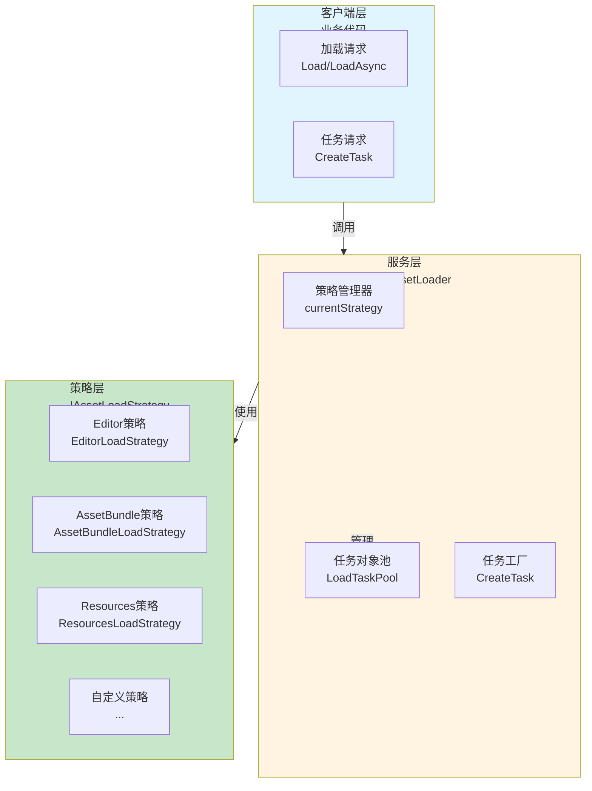
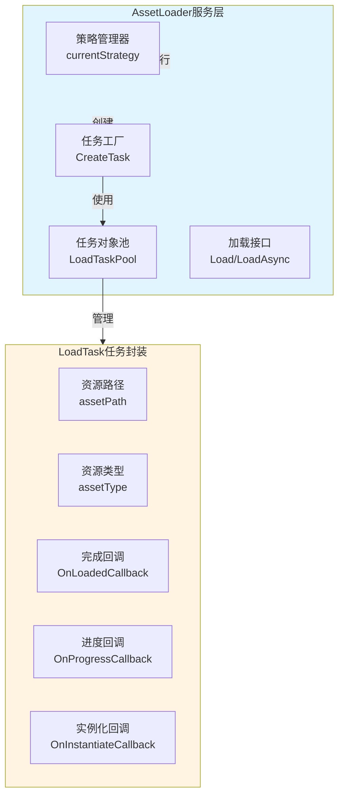
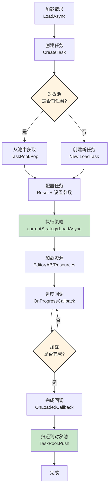
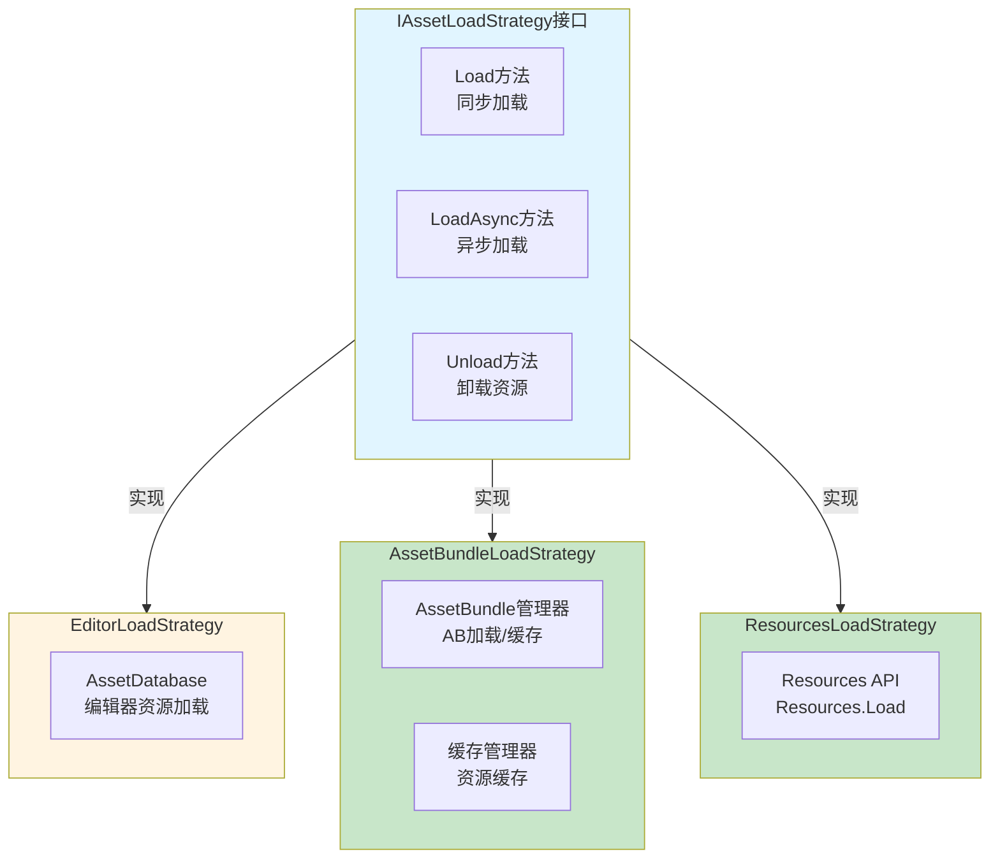
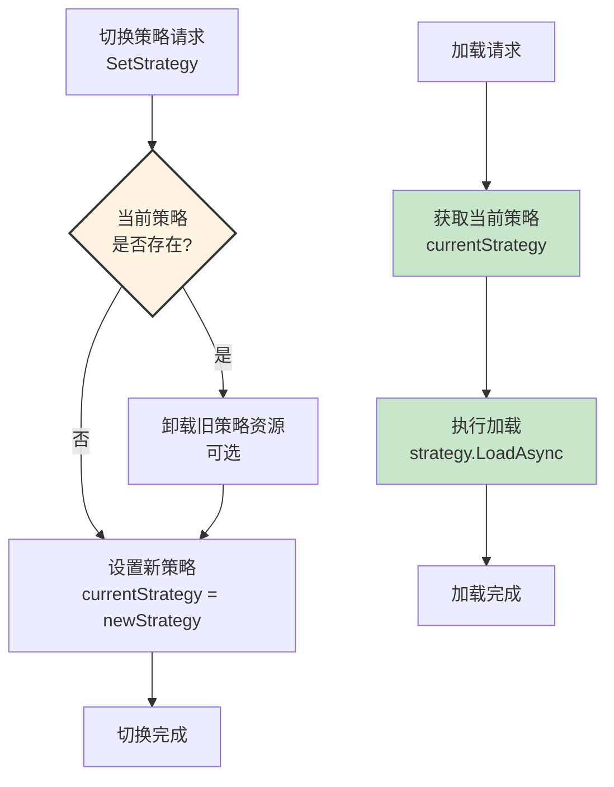
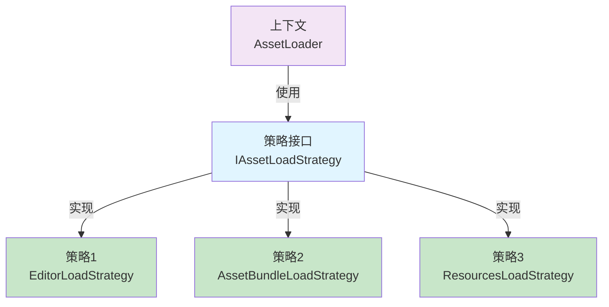
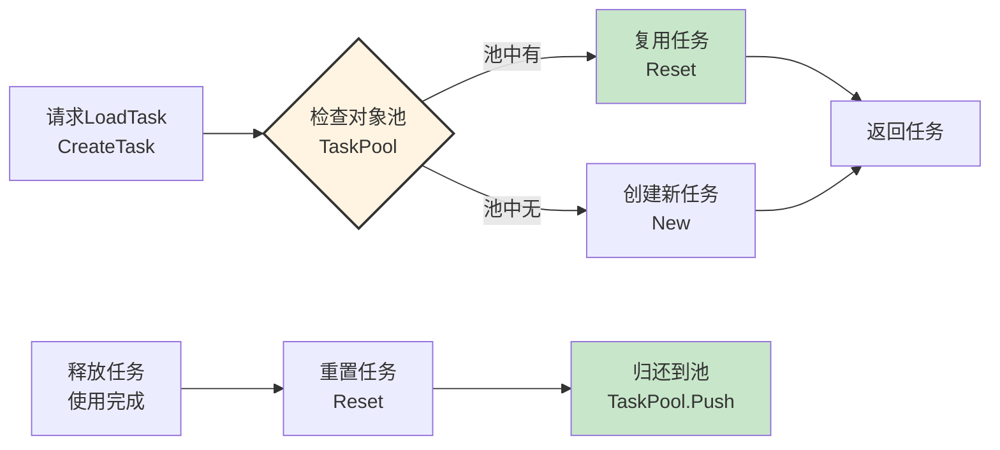
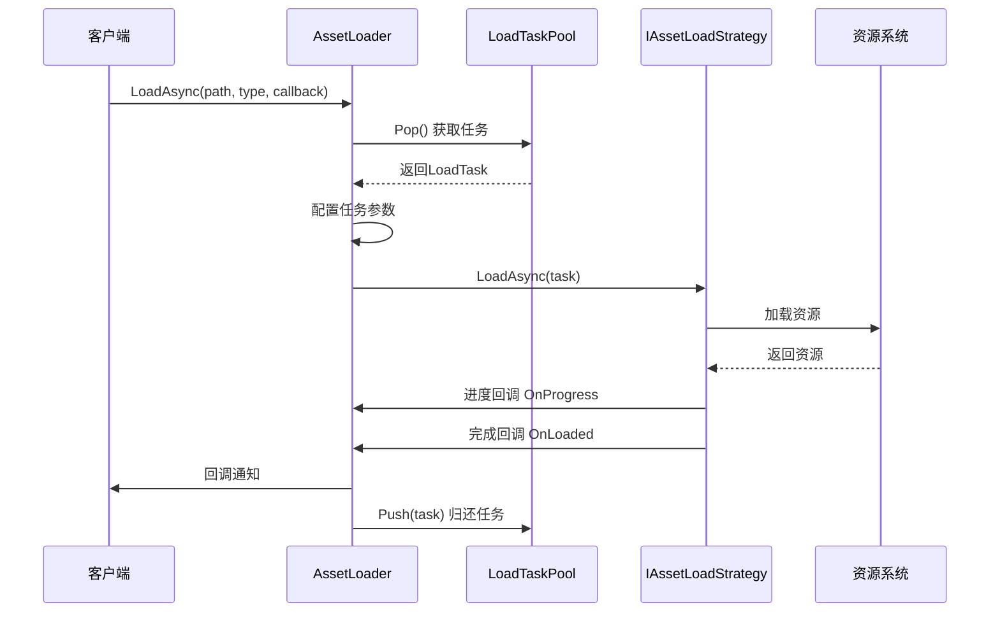
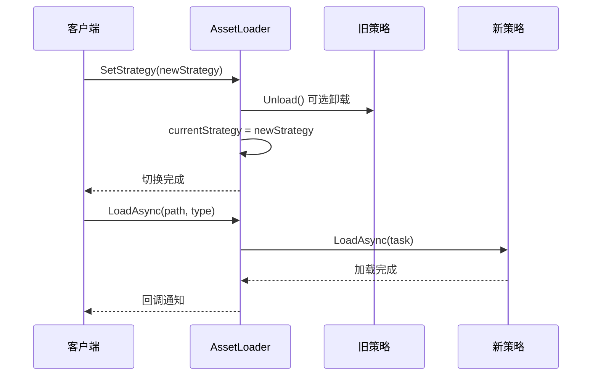

# Loader资源加载系统架构设计

## 设计目标

设计一套完整的资源加载系统，支持多种加载策略（Editor、AssetBundle、Resources），实现统一接口、策略切换、异步加载、对象池优化，提供灵活、高性能的资源管理解决方案。

---

## 核心设计理念

### 1. 策略模式为核心

**本质**：资源加载系统的核心是策略模式的应用
- 加载策略 = 不同的资源加载方式（Editor/AssetBundle/Resources）
- 策略切换 = 运行时动态切换加载策略
- 统一接口 = 所有策略通过统一接口访问
- 策略隔离 = 每个策略独立实现，互不干扰

### 2. 对象池优化 + 任务封装

**本质**：通过对象池管理LoadTask，通过任务封装简化异步加载
- 对象池管理 = LoadTask使用对象池，减少GC压力
- 任务封装 = LoadTask封装加载参数和回调
- 链式配置 = 流畅的API设计，易于使用
- 性能优化 = 对象池复用，减少对象创建开销

### 3. 职责分离 + 开闭原则

**本质**：加载逻辑和业务逻辑分离，对扩展开放对修改封闭
- 职责分离 = 专注底层概念，避免业务耦合
- 开闭原则 = 新增加载策略只需实现IAssetLoadStrategy
- 统一接口 = 所有策略通过统一接口访问
- 向后兼容 = 与旧版本完全兼容

---

## 整体架构设计

### 三层架构 + 策略模式



### 资源加载数据流



```mermaid
graph LR
    Start[加载请求<br/>LoadAsync] -->|1. 创建任务| CreateTask[创建LoadTask<br/>从对象池获取]
    CreateTask -->|2. 配置任务| ConfigTask[配置回调<br/>OnLoaded/OnProgress]
    ConfigTask -->|3. 执行策略| Strategy[当前策略<br/>currentStrategy.LoadAsync]
    Strategy -->|4. 加载资源| LoadAsset[加载资源<br/>Editor/AB/Resources]
    LoadAsset -->|5. 回调通知| Callback[回调通知<br/>OnLoaded/OnProgress]
    Callback -->|6. 归还任务| ReturnTask[归还到对象池<br/>TaskPool.Push]
    ReturnTask -->|7. 完成| End[加载完成]
    
    style CreateTask fill:#e1f5ff
    style Strategy fill:#fff4e1
    style LoadAsset fill:#c8e6c9
    style ReturnTask fill:#c8e6c9
```

**数据流特性**：
- ✅ **策略隔离**：每个策略独立实现，互不干扰
- ✅ **统一接口**：所有策略通过统一接口访问
- ✅ **对象池优化**：LoadTask使用对象池，减少GC压力
- ✅ **异步加载**：支持进度回调和完成回调

---

## 服务层架构设计

### 核心职责

策略管理 + 任务管理 + 统一接口

### 架构图



### 工作流程



---

## 策略层架构设计

### 核心职责

资源加载实现 + 缓存管理 + 错误处理

### 架构图



### 策略切换流程



---

## 架构模式分析

### 策略模式（Strategy Pattern）

**核心思想**：将不同的加载策略封装成独立的类，运行时动态切换



**优势**：
- ✅ **策略隔离**：每个策略独立实现，互不干扰
- ✅ **动态切换**：运行时动态切换加载策略
- ✅ **易于扩展**：新增策略只需实现IAssetLoadStrategy
- ✅ **统一接口**：所有策略通过统一接口访问

### 对象池模式（Object Pool Pattern）

**核心思想**：LoadTask使用对象池管理，减少GC压力



---

## 数据流设计

### 资源加载数据流



### 策略切换数据流



---

## 架构验证

### 流程合理性验证

从架构可验证：
- ✅ **数据流完整**：加载请求 → 创建任务 → 执行策略 → 加载资源 → 回调通知（完整流程）
- ✅ **职责清晰**：客户端层、服务层、策略层职责明确，无重叠
- ✅ **解耦设计**：通过策略模式实现加载逻辑和业务逻辑解耦
- ✅ **性能优化**：对象池管理，减少GC压力

### 扩展性验证

从架构可验证：
- ✅ **策略模式**：新增加载策略只需实现IAssetLoadStrategy
- ✅ **统一接口**：所有策略通过统一接口访问
- ✅ **对象池优化**：LoadTask使用对象池，减少GC压力
- ✅ **向后兼容**：与旧版本完全兼容

### 易用性验证

从架构可验证：
- ✅ **统一接口**：所有策略使用统一的加载接口
- ✅ **链式配置**：LoadTask支持链式配置，易于使用
- ✅ **异步加载**：支持进度回调和完成回调
- ✅ **策略切换**：运行时动态切换加载策略

---

## 开发指导原则

### 一、开发约束（什么能做，什么不能做）

#### ✅ 应该做的

1. **加载策略必须实现IAssetLoadStrategy**
   ```
   ✅ 正确：
   public class CustomStrategy : IAssetLoadStrategy
   
   ❌ 错误：
   不实现IAssetLoadStrategy的策略类
   ```

2. **加载必须通过AssetLoader**
   ```
   ✅ 正确：
   AssetLoader.LoadAsync(path, type, callback)
   
   ❌ 错误：
   直接调用策略的LoadAsync方法
   ```

3. **LoadTask必须使用对象池**
   ```
   ✅ 正确：
   var task = AssetLoader.CreateTask(path, type)
   -- 使用后自动归还到池
   
   ❌ 错误：
   直接创建LoadTask实例
   ```

#### ❌ 不应该做的

1. **禁止直接创建LoadTask**
   - 必须通过AssetLoader.CreateTask创建
   - 不能直接new LoadTask

2. **禁止直接调用策略方法**
   - 必须通过AssetLoader统一接口
   - 不能直接调用策略的LoadAsync方法

3. **禁止在回调中执行耗时操作**
   - 回调应该快速执行
   - 耗时操作应该异步处理

### 二、开发流程（标准化开发步骤）

#### 开发新加载策略的流程

```
1. 实现IAssetLoadStrategy接口
   ↓
   public class CustomStrategy : IAssetLoadStrategy
   
2. 实现Load和LoadAsync方法
   ↓
   public object Load(string path, Type type)
   public void LoadAsync(LoadTask task)
   
3. 注册策略
   ↓
   AssetLoader.SetStrategy(new CustomStrategy())
   
4. 使用策略
   ↓
   AssetLoader.LoadAsync(path, type, callback)
```

---

## 总结

### 架构设计价值

该架构设计文档的价值在于：
- ✅ **思路解构**：完整解构资源加载系统的搭建思路
- ✅ **流程验证**：从架构层面验证流程合理性
- ✅ **模式分析**：分析策略模式、对象池模式的应用
- ✅ **开发指导**：为后续详细设计和实现提供清晰指导

### 设计原则

- ✅ **策略模式为核心**：不同的加载策略封装成独立的类，运行时动态切换
- ✅ **对象池优化 + 任务封装**：LoadTask使用对象池，通过任务封装简化异步加载
- ✅ **职责分离 + 开闭原则**：加载逻辑和业务逻辑分离，对扩展开放对修改封闭
- ✅ **统一接口**：所有策略通过统一接口访问

### 架构特点

- ✅ **策略隔离**：每个策略独立实现，互不干扰
- ✅ **动态切换**：运行时动态切换加载策略
- ✅ **对象池优化**：LoadTask使用对象池，减少GC压力
- ✅ **向后兼容**：与旧版本完全兼容

细节实现是后续开发阶段的工作，当前架构设计已足够指导整个资源加载系统的开发。
