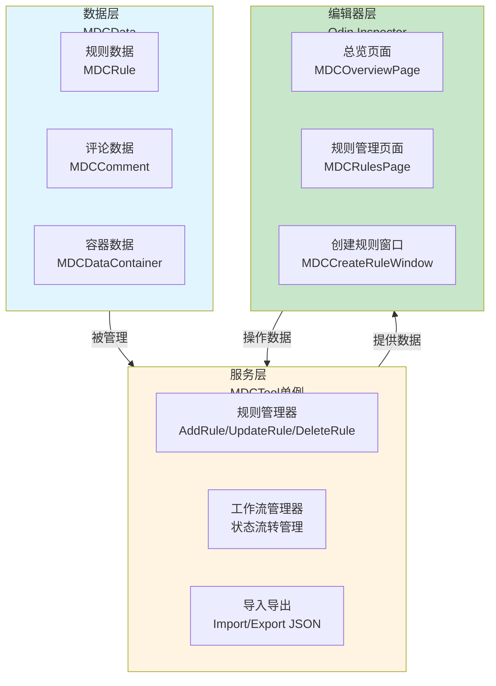
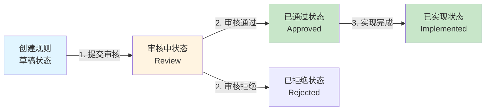
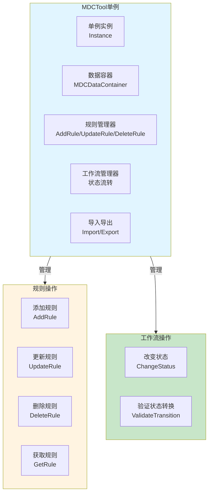
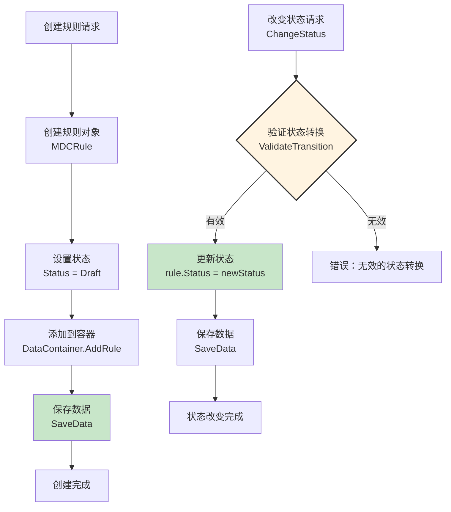
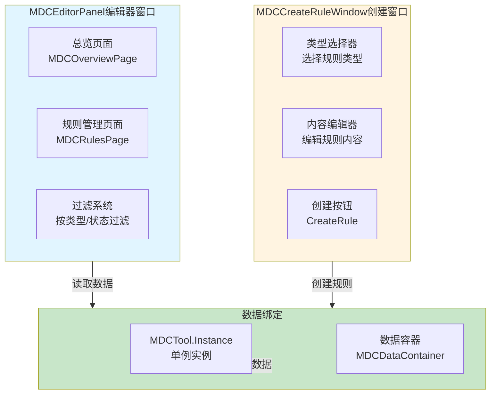
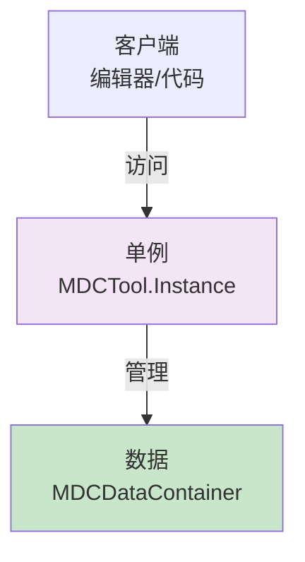
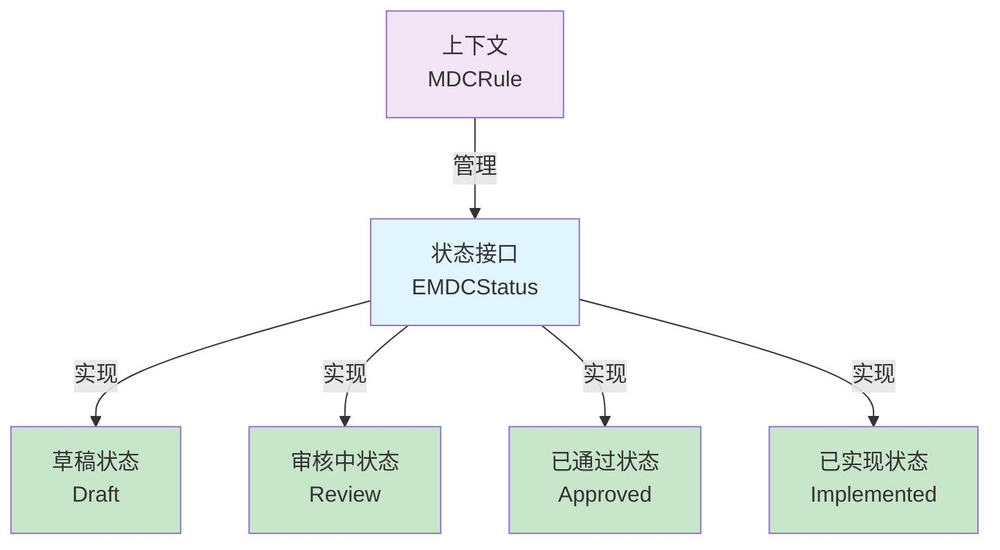
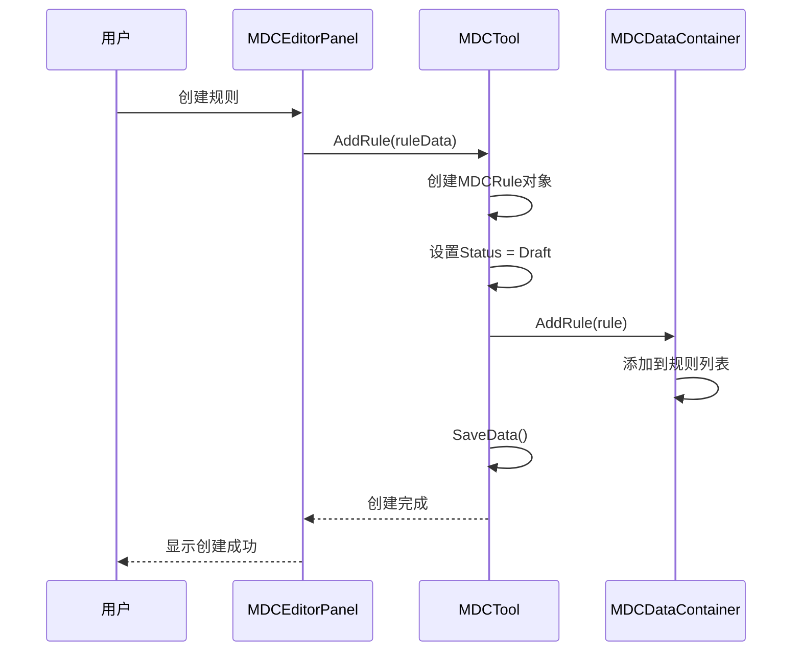
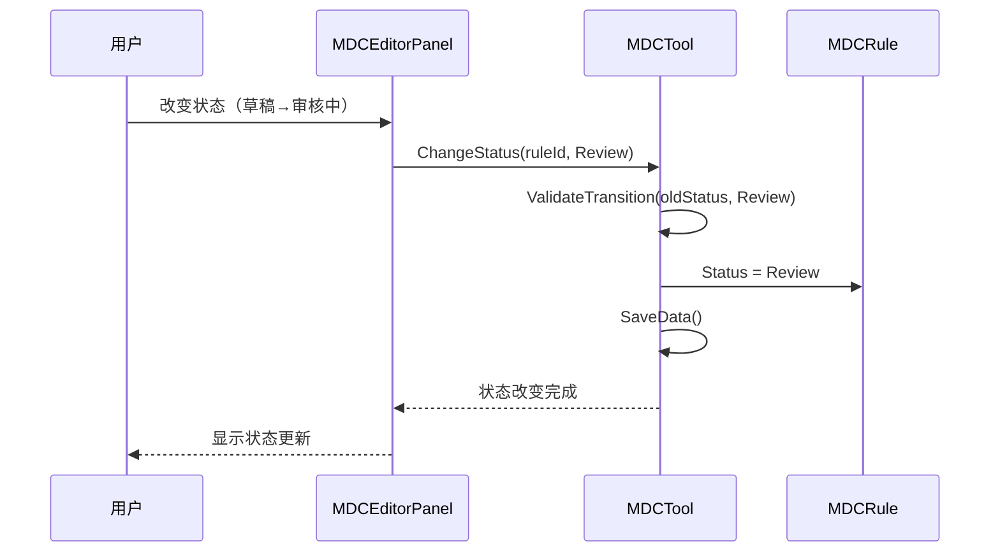

# MDC工具架构设计

## 设计目标

设计一套完整的游戏设计文档管理系统，支持11种规则类型、工作流管理（草稿→审核→通过→实现）、团队协作（评论、标签、版本控制），提供与Unity编辑器集成的设计文档管理解决方案。

---

## 核心设计理念

### 1. 文档结构化 + 工作流管理为核心

**本质**：MDC工具的核心是设计文档的结构化管理和工作流控制
- 文档结构化 = 将设计文档按11种规则类型分类管理
- 工作流管理 = 草稿 → 审核中 → 已通过/已拒绝 → 已实现的状态流转
- 版本控制 = 设计文档的版本管理和历史记录
- Unity集成 = 在Unity编辑器内管理设计文档，打通设计与实现

### 2. 数据驱动架构

**本质**：设计文档特性通过配置数据实现，无需修改代码
- 规则类型、规则状态 → 通过配置数据定义
- 工作流状态、评论标签 → 通过配置数据调整
- 新增规则类型 → 扩展配置数据即可
- 文档管理 → 调整配置数据即可

### 3. 单例模式 + 编辑器工具

**本质**：通过单例模式管理全局数据，通过编辑器工具提供可视化界面
- 单例模式 = MDCTool作为单例管理所有文档数据
- 编辑器工具 = Odin Inspector提供可视化编辑界面
- 数据持久化 = 设计文档数据保存到ScriptableObject
- 导入导出 = 支持JSON格式的导入导出

---

## 整体架构设计

### 三层架构 + 单例模式



### 工作流数据流



**数据流特性**：
- ✅ **状态流转**：草稿 → 审核中 → 已通过/已拒绝 → 已实现
- ✅ **规则分类**：11种规则类型（Player、Character、Quest、Battle等）
- ✅ **团队协作**：评论系统、标签系统、版本控制
- ✅ **Unity集成**：在Unity编辑器内管理设计文档

---

## 服务层架构设计

### 核心职责

规则管理 + 工作流管理 + 数据持久化

### 架构图



### 工作流程



---

## 编辑器层架构设计

### 核心职责

可视化界面 + 规则编辑 + 工作流管理

### 架构图



---

## 架构模式分析

### 单例模式（Singleton Pattern）

**核心思想**：MDCTool作为单例管理全局文档数据



**优势**：
- ✅ **全局访问**：任何地方都可以访问MDCTool实例
- ✅ **数据统一**：所有文档数据统一管理
- ✅ **状态管理**：工作流状态统一管理

### 状态模式（State Pattern）

**核心思想**：工作流状态通过状态模式管理



---

## 数据流设计

### 规则创建数据流



### 工作流状态转换数据流



---

## 架构验证

### 流程合理性验证

从架构可验证：
- ✅ **数据流完整**：创建规则 → 状态流转 → 实现完成（完整流程）
- ✅ **职责清晰**：数据层、服务层、编辑器层职责明确，无重叠
- ✅ **解耦设计**：通过单例模式和编辑器工具实现解耦
- ✅ **工作流管理**：状态流转逻辑清晰，支持验证

### 扩展性验证

从架构可验证：
- ✅ **规则类型扩展**：新增规则类型只需扩展EMDCType枚举
- ✅ **状态扩展**：新增状态只需扩展EMDCStatus枚举
- ✅ **编辑器扩展**：新增编辑器页面只需继承OdinMenuEditorWindow
- ✅ **数据驱动**：规则特性通过配置数据扩展

### 易用性验证

从架构可验证：
- ✅ **可视化界面**：Odin Inspector提供友好的编辑界面
- ✅ **工作流管理**：清晰的状态流转和验证机制
- ✅ **团队协作**：评论系统、标签系统、版本控制
- ✅ **Unity集成**：在Unity编辑器内管理设计文档

---

## 开发指导原则

### 一、开发约束（什么能做，什么不能做）

#### ✅ 应该做的

1. **规则必须通过MDCTool管理**
   ```
   ✅ 正确：
   MDCTool.Instance.AddRule(rule)
   
   ❌ 错误：
   直接操作MDCDataContainer
   ```

2. **状态转换必须验证**
   ```
   ✅ 正确：
   MDCTool.Instance.ChangeStatus(ruleId, newStatus)
   -- 内部验证状态转换有效性
   
   ❌ 错误：
   直接修改rule.Status
   ```

3. **数据必须持久化**
   ```
   ✅ 正确：
   MDCTool.Instance.SaveData()
   
   ❌ 错误：
   修改数据后不保存
   ```

#### ❌ 不应该做的

1. **禁止直接操作MDCDataContainer**
   - 必须通过MDCTool统一管理
   - 不能直接修改DataContainer

2. **禁止绕过状态验证**
   - 状态转换必须通过ChangeStatus方法
   - 不能直接修改rule.Status

3. **禁止在编辑器外直接修改数据**
   - 数据修改应该通过编辑器工具
   - 不能直接修改ScriptableObject文件

### 二、开发流程（标准化开发步骤）

#### 使用MDC工具的标准流程

```
1. 打开编辑器窗口
   ↓
   Window > MDC > MDC Editor Panel
   
2. 创建规则
   ↓
   点击"创建规则"按钮
   选择规则类型（Player/Character/Quest等）
   编辑规则内容
   
3. 提交审核
   ↓
   规则状态：草稿 → 审核中
   
4. 审核通过
   ↓
   规则状态：审核中 → 已通过
   
5. 实现完成
   ↓
   规则状态：已通过 → 已实现
```

---

## 总结

### 架构设计价值

该架构设计文档的价值在于：
- ✅ **思路解构**：完整解构MDC工具系统的搭建思路
- ✅ **流程验证**：从架构层面验证流程合理性
- ✅ **模式分析**：分析单例模式、状态模式的应用
- ✅ **开发指导**：为后续详细设计和实现提供清晰指导

### 设计原则

- ✅ **文档结构化 + 工作流管理为核心**：设计文档按规则类型分类，通过工作流管理状态流转
- ✅ **数据驱动架构**：设计文档特性通过配置数据实现
- ✅ **单例模式 + 编辑器工具**：通过单例管理全局数据，通过编辑器工具提供可视化界面
- ✅ **Unity集成**：在Unity编辑器内管理设计文档，打通设计与实现

### 架构特点

- ✅ **规则分类**：11种规则类型（Player、Character、Quest、Battle等）
- ✅ **工作流管理**：草稿 → 审核中 → 已通过/已拒绝 → 已实现
- ✅ **团队协作**：评论系统、标签系统、版本控制
- ✅ **Unity集成**：在Unity编辑器内管理设计文档

细节实现是后续开发阶段的工作，当前架构设计已足够指导整个MDC工具系统的开发。
