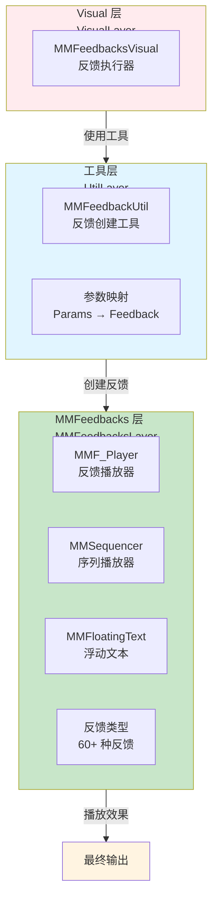
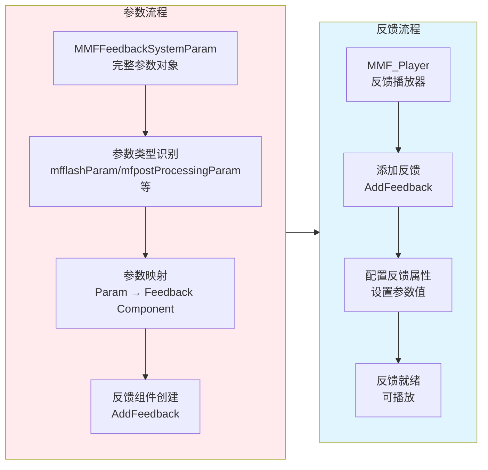
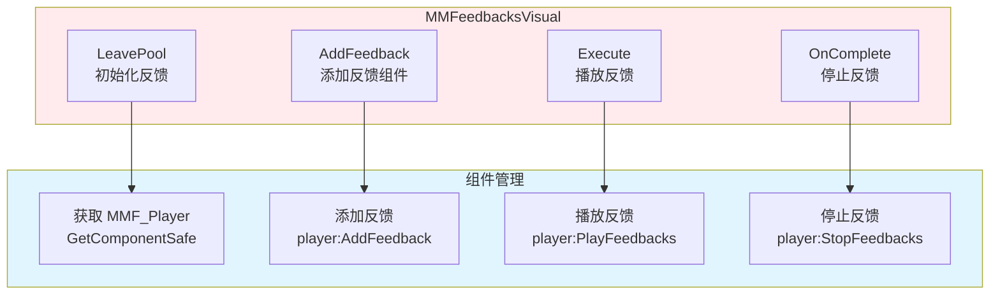
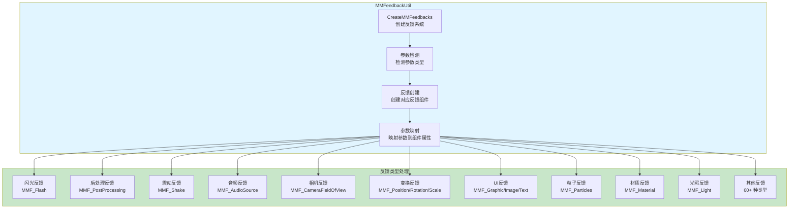
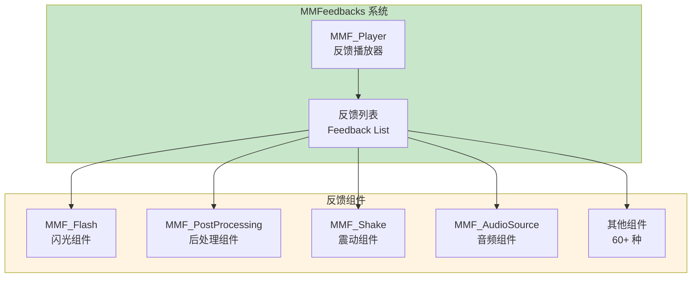
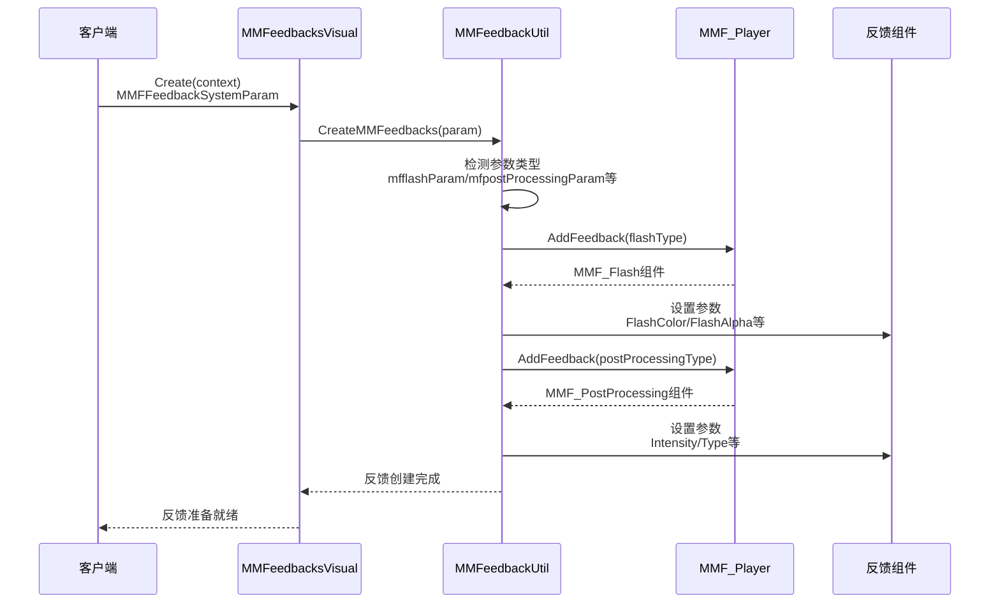
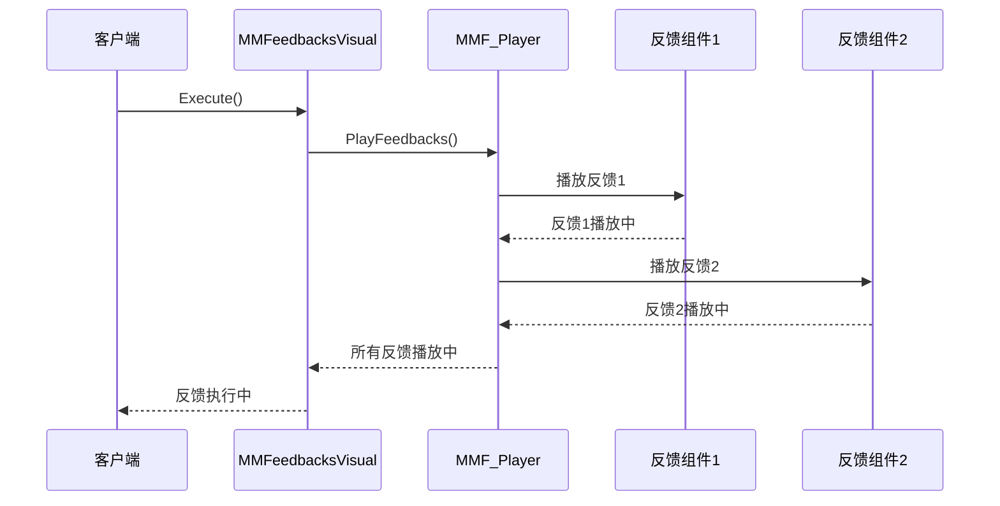
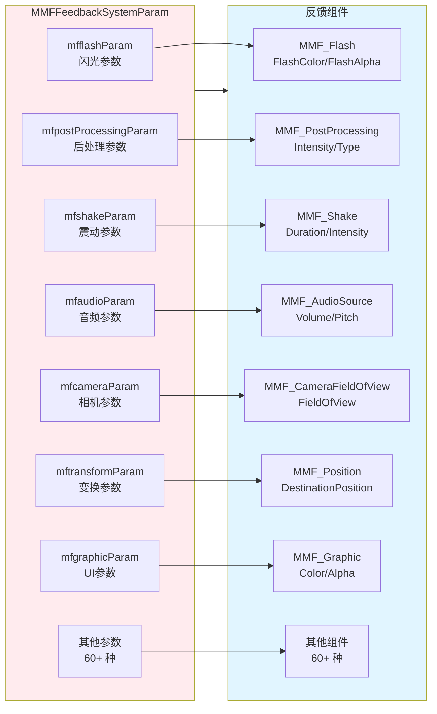

# MMFeedbacks 系统架构设计

## 设计目标

设计一套基于 MMFeedbacks 插件的统一反馈系统，支持 60+ 种反馈类型（动画、音频、相机、UI、后处理等），实现参数化配置、统一接口、高性能、易扩展的反馈效果框架。

---

## 核心设计理念

### 1. 参数化配置为核心

**本质**：MMFeedbacks 系统的核心是参数化配置和统一接口
- 参数驱动 = 所有反馈效果通过参数配置，无需直接操作组件
- 统一接口 = 60+ 种反馈类型使用统一的参数接口
- 配置分离 = 参数配置与反馈执行分离，易于维护
- 类型安全 = 通过参数类型定义，确保配置正确性

### 2. 统一反馈管理

**本质**：所有反馈通过 MMF_Player 统一管理，提供一致的播放控制
- 统一播放 = 所有反馈通过 `MMF_Player:PlayFeedbacks()` 统一播放
- 统一停止 = 所有反馈通过 `MMF_Player:StopFeedbacks()` 统一停止
- 统一管理 = 反馈生命周期由 MMF_Player 统一管理
- 组合播放 = 支持多个反馈组合播放，形成复杂效果

### 3. 工具函数封装

**本质**：通过工具函数封装反馈创建逻辑，简化使用复杂度
- 函数封装 = `MMFeedbackUtil.CreateMMFeedbacks()` 封装所有反馈创建逻辑
- 参数映射 = 工具函数自动将参数映射到对应的反馈组件
- 类型识别 = 根据参数类型自动识别需要创建的反馈类型
- 错误处理 = 统一的错误处理和日志输出

### 4. 多组件支持

**本质**：系统支持 MMF_Player、MMSequencer、MMFloatingText 三种组件类型
- MMF_Player = 主要反馈播放器，支持 60+ 种反馈类型
- MMSequencer = 序列化反馈播放器，支持复杂序列
- MMFloatingText = 浮动文本反馈，专门用于文本效果
- 统一接口 = 三种组件使用统一的 Visual 接口

---

## 整体架构设计

### 三层架构 + 工具函数封装



### 反馈创建数据流



---

## 详细层级设计

### 1. Visual 层：MMFeedbacksVisual

#### 1.1 MMFeedbacksVisual 架构

**架构图**：



**工作流程**：

1. **初始化阶段**（LeavePool）：
   - 从 Context 获取反馈类型和参数
   - 调用 `MMFeedbackUtil.CreateMMFeedbacks()` 创建反馈
   - 获取或创建 `MMF_Player` 组件

2. **反馈添加阶段**（AddFeedback）：
   - 传入反馈类型（如 `ETypeClass.MMFeedbacks.MMF_Flash`）
   - 调用 `MMF_Player:AddFeedback()` 添加反馈组件
   - 返回反馈组件供外部配置

3. **执行阶段**（Execute）：
   - 调用 `MMF_Player:PlayFeedbacks()` 播放所有反馈
   - 支持 `MMSequencer:Play()` 和 `MMFloatingText:Spawn()` 的播放

4. **完成阶段**（OnComplete）：
   - 调用 `MMF_Player:StopFeedbacks()` 停止所有反馈
   - 支持 `MMSequencer:Stop()` 的停止

**核心组件**：

- `MMFeedbacksVisual:LeavePool()` - 初始化反馈系统
- `MMFeedbacksVisual:AddFeedback(feedbackType)` - 添加反馈组件
- `MMFeedbacksVisual:Execute()` - 播放反馈
- `MMFeedbacksVisual:OnComplete()` - 停止反馈
- `MMFeedbacksVisual:Check()` - 检查反馈状态

### 2. 工具层：MMFeedbackUtil

#### 2.1 MMFeedbackUtil 架构

**架构图**：



**工作流程**：

1. **参数检测阶段**：
   - 检测 `MMFFeedbackSystemParam` 中的各个参数字段
   - 根据参数字段判断需要创建哪些反馈类型
   - 支持多个反馈类型同时创建

2. **反馈创建阶段**：
   - 根据参数类型调用 `mmf_visual:AddFeedback()` 创建对应反馈组件
   - 支持 60+ 种反馈类型的创建
   - 每个反馈类型都有对应的参数结构

3. **参数映射阶段**：
   - 将参数值映射到反馈组件的属性
   - 支持参数验证和默认值设置
   - 处理资源加载（如音频、材质等）

**核心组件**：

- `MMFeedbackUtil.CreateMMFeedbacks()` - 创建反馈系统的主函数
- 参数检测逻辑 - 检测各个参数字段，判断需要创建的反馈类型
- 反馈创建逻辑 - 为每种反馈类型创建对应的反馈组件
- 参数映射逻辑 - 将参数值映射到反馈组件属性

**反馈类型分类**：

1. **视觉效果反馈**：
   - `MMF_Flash` - 全屏闪光
   - `MMF_PostProcessing` - 后处理效果（LensDistortion、Bloom、ChromaticAberration 等）
   - `MMF_Flicker` - 闪烁效果

2. **相机反馈**：
   - `MMF_CameraFieldOfView` - 视野调整
   - `MMF_CameraZoom` - 缩放效果
   - `MMF_CameraOrthographicSize` - 正交大小
   - `MMF_CameraClippingPlanes` - 裁剪平面

3. **音频反馈**：
   - `MMF_AudioSource` - 音频播放
   - `MMF_AudioSourcePitch` - 音调调整
   - `MMF_AudioSourceVolume` - 音量调整
   - `MMF_AudioSourceStereoPan` - 立体声混音
   - `MMF_AudioFilterLowPass/HighPass/Echo/Reverb/Distortion` - 音频滤镜

4. **变换反馈**：
   - `MMF_Position` - 位置变换
   - `MMF_Rotation` - 旋转变换
   - `MMF_Scale` - 缩放变换
   - `MMF_PositionShake/RotationShake/ScaleShake` - 震动效果
   - `MMF_Wiggle` - 摆动效果

5. **UI 反馈**：
   - `MMF_Graphic` - 图形反馈
   - `MMF_Image` - 图像反馈
   - `MMF_ImageAlpha` - 图像透明度
   - `MMF_ImageFill` - 图像填充
   - `MMF_Text` - 文本反馈
   - `MMF_TextColor` - 文本颜色
   - `MMF_CanvasGroupBlocksRaycasts` - Canvas 组反馈

6. **动画反馈**：
   - `MMF_Animation` - 动画播放
   - `MMF_AnimatorSpeed` - 动画器速度

7. **粒子反馈**：
   - `MMF_Particles` - 粒子系统
   - `MMF_ParticlesInstantiation` - 粒子实例化

8. **材质反馈**：
   - `MMF_Material` - 材质属性

9. **光照反馈**：
   - `MMF_Light` - 光照效果

10. **其他反馈**：
    - `MMF_TimescaleModifier` - 时间缩放
    - `MMF_FreezeFrame` - 冻结帧
    - `MMF_Enable` - 启用/禁用
    - `MMF_Instantiate` - 实例化
    - `MMF_Destroy` - 销毁
    - `MMF_Scene` - 场景加载
    - `MMF_Events` - 事件触发
    - `MMF_ShaderGlobal` - 全局着色器参数
    - 等等...

### 3. MMFeedbacks 层：MMF_Player 和反馈组件

**架构图**：



**工作流程**：

1. **反馈添加**：
   - 通过 `MMF_Player:AddFeedback(feedbackType)` 添加反馈组件
   - 反馈组件自动添加到反馈列表
   - 支持动态添加和移除反馈

2. **反馈配置**：
   - 直接设置反馈组件的属性（如 `Duration`、`Intensity` 等）
   - 支持运行时修改反馈参数
   - 参数验证和默认值处理

3. **反馈播放**：
   - 调用 `MMF_Player:PlayFeedbacks()` 播放所有反馈
   - 反馈按顺序或并行播放（取决于配置）
   - 支持播放完成回调

4. **反馈停止**：
   - 调用 `MMF_Player:StopFeedbacks()` 停止所有反馈
   - 支持立即停止或平滑停止

**核心组件**：

- `MMF_Player` - MMFeedbacks 反馈播放器
- `MMF_Feedback` - 反馈组件基类
- `MMSequencer` - 序列化反馈播放器
- `MMFloatingText` - 浮动文本反馈

---

## 架构模式分析

### 1. 工厂模式（Factory）

**应用场景**：反馈组件的创建

**实现方式**：
- `MMF_Player:AddFeedback()` 作为工厂方法创建反馈组件
- 根据反馈类型创建对应的反馈组件实例
- 统一的创建接口，隐藏创建细节

**优势**：
- 统一创建逻辑
- 易于扩展新的反馈类型
- 封装创建复杂度

### 2. 策略模式（Strategy）

**应用场景**：多种反馈类型的统一管理

**实现方式**：
- 每种反馈类型实现独立的反馈组件
- 都继承 `MMF_Feedback`，使用统一的接口
- 通过反馈类型选择使用哪种策略

**优势**：
- 反馈类型独立，互不干扰
- 易于扩展新的反馈类型
- 统一接口，降低使用复杂度

### 3. 工具函数模式（Utility Function）

**应用场景**：反馈创建逻辑的封装

**实现方式**：
- `MMFeedbackUtil.CreateMMFeedbacks()` 封装所有反馈创建逻辑
- 根据参数类型自动识别和创建反馈
- 统一的参数映射和错误处理

**优势**：
- 简化使用复杂度
- 统一的创建流程
- 易于维护和扩展

### 4. 参数化配置模式（Parameterized Configuration）

**应用场景**：反馈效果的配置

**实现方式**：
- 所有反馈通过参数配置，无需直接操作组件
- 参数结构清晰，类型安全
- 支持参数验证和默认值

**优势**：
- 配置与代码分离
- 易于维护和扩展
- 支持数据驱动

### 5. Context 模式

**应用场景**：统一参数传递

**实现方式**：
- 使用 `MMFFeedbackSystemParam` 统一管理所有参数
- 支持参数扩展，不影响接口
- 参数清晰，易于理解

**优势**：
- 接口稳定，参数灵活
- 支持向后兼容
- 易于扩展新参数

---

## 数据流设计

### 1. 反馈创建数据流



### 2. 反馈播放数据流



### 3. 参数数据流



---

## 架构验证

### 1. 性能验证

**验证点**：
- ✅ 反馈组件创建使用对象池，减少创建开销
- ✅ 参数检测和映射逻辑高效，避免重复计算
- ✅ 支持批量创建反馈，减少多次调用开销
- ✅ MMFeedbacks 插件原生性能优化

**性能指标**：
- 反馈创建：< 10ms（单个反馈）
- 参数映射：< 1ms（单个参数）
- 反馈播放：MMFeedbacks 原生性能

### 2. 扩展性验证

**验证点**：
- ✅ 新增反馈类型只需扩展参数结构和创建逻辑
- ✅ 参数结构清晰，易于扩展新参数
- ✅ 工具函数支持新反馈类型的添加
- ✅ Context 模式支持参数扩展，向后兼容

**扩展场景**：
- 新增反馈类型：扩展 `MMFFeedbackSystemParam`，添加创建逻辑
- 新增参数：扩展参数结构，不影响旧代码
- 新增工具函数：扩展 `MMFeedbackUtil`，添加新的创建逻辑

### 3. 易用性验证

**验证点**：
- ✅ 统一的参数接口，参数清晰
- ✅ 工具函数封装，简化使用复杂度
- ✅ 支持 60+ 种反馈类型，覆盖所有常见需求
- ✅ 完整的错误处理和日志输出

**使用示例**：
```lua
-- 创建闪光 + 后处理 + 震动反馈
local param = {
    mfflashParam = {
        flashColor = Color.white,
        flashAlpha = 0.5,
        flashDuration = 0.5
    },
    mfpostProcessingParam = {
        type = "LensDistortion",
        Intensity = 0.8,
        XMultiplier = 1.0,
        YMultiplier = 1.0
    },
    mfshakeParam = {
        duration = 0.3,
        intensity = 1.0,
        frequency = 10.0
    }
}
local context = {
    feedbackType = EMMFeedbacksType.Default,
    param = param
}
local visual = VisualFactory.Create(EVisual.MMFeedbacks, context)
visual:Execute()
```

### 4. 完整性验证

**验证点**：
- ✅ 支持 60+ 种反馈类型，覆盖所有常见需求
- ✅ 支持 MMF_Player、MMSequencer、MMFloatingText 三种组件
- ✅ 完整的生命周期管理（创建、播放、停止、回收）
- ✅ 支持参数验证和错误处理

---

## 开发指导原则

### 1. 参数设计原则

**原则**：参数结构清晰，类型安全，易于扩展

**实践**：
- 使用明确的参数类型定义（如 `MMFFlashParam`）
- 参数名称清晰，易于理解
- 支持可选参数，提供默认值
- 新增参数不影响旧代码

### 2. 反馈创建原则

**原则**：通过工具函数创建反馈，避免直接操作组件

**实践**：
- 使用 `MMFeedbackUtil.CreateMMFeedbacks()` 创建反馈
- 不要直接调用 `MMF_Player:AddFeedback()`
- 参数配置通过参数对象传递
- 支持多个反馈类型同时创建

### 3. 反馈类型选择原则

**原则**：根据需求选择合适的反馈类型

**实践**：
- 视觉效果 → 使用 `MMF_Flash`、`MMF_PostProcessing` 等
- 相机效果 → 使用 `MMF_CameraFieldOfView`、`MMF_CameraZoom` 等
- 音频效果 → 使用 `MMF_AudioSource`、`MMF_AudioFilter` 等
- UI 效果 → 使用 `MMF_Graphic`、`MMF_Image`、`MMF_Text` 等
- 变换效果 → 使用 `MMF_Position`、`MMF_Rotation`、`MMF_Scale` 等

### 4. 参数映射原则

**原则**：参数值正确映射到反馈组件属性

**实践**：
- 检查参数是否存在，避免空值错误
- 使用有意义的默认值
- 处理资源加载（如音频、材质等）
- 支持参数验证和错误提示

### 5. 错误处理原则

**原则**：完整的错误检查和日志输出，便于调试

**实践**：
- 检查必需参数是否存在
- 检查资源加载是否成功
- 使用 `LogError` 和 `LogWarning` 区分错误级别
- 提供有意义的错误消息，包含上下文信息

---

## 总结

### 架构设计价值

MMFeedbacks 系统通过参数化配置、统一反馈管理、工具函数封装，实现了统一接口、高性能、易扩展的反馈效果框架。系统核心是参数化配置和统一接口，通过 60+ 种反馈类型覆盖所有常见需求，通过工具函数简化使用复杂度。

### 设计原则总结

1. **参数化配置**：所有反馈通过参数配置，无需直接操作组件
2. **统一管理**：所有反馈通过 MMF_Player 统一管理
3. **工具函数封装**：通过工具函数封装反馈创建逻辑
4. **多组件支持**：支持 MMF_Player、MMSequencer、MMFloatingText 三种组件
5. **类型安全**：通过参数类型定义，确保配置正确性

### 未来扩展方向

1. **反馈预设系统**：预定义常用反馈组合，一键应用
2. **可视化编辑器**：反馈参数的可视化配置工具
3. **性能优化**：反馈组件的对象池管理
4. **序列编排**：支持多个反馈的顺序/并行播放
5. **事件系统**：反馈播放过程中的事件回调
