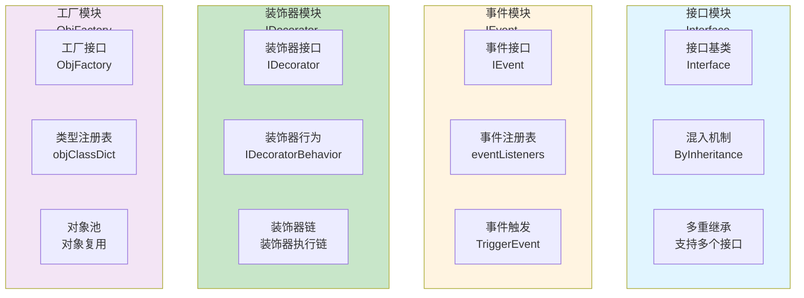
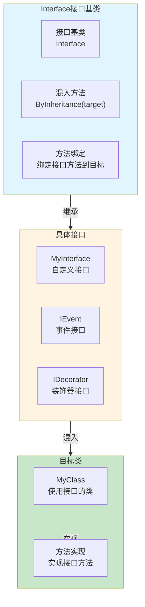
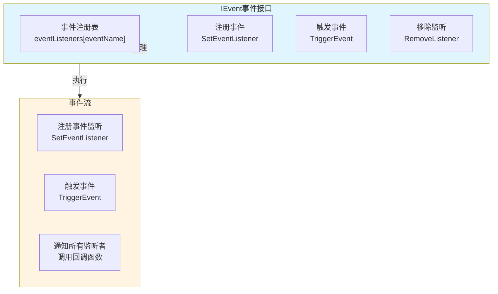
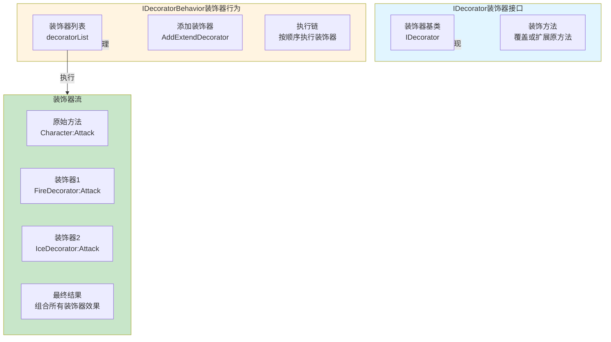
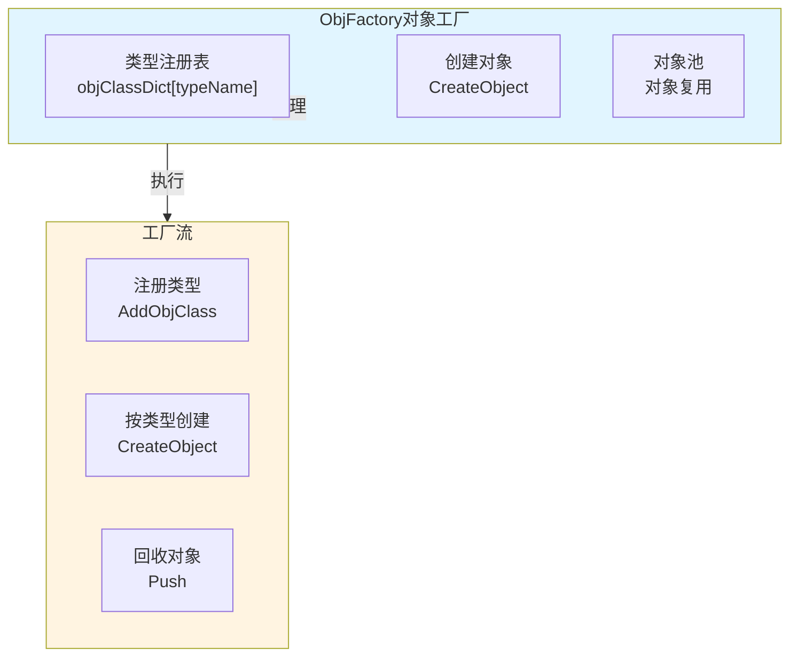
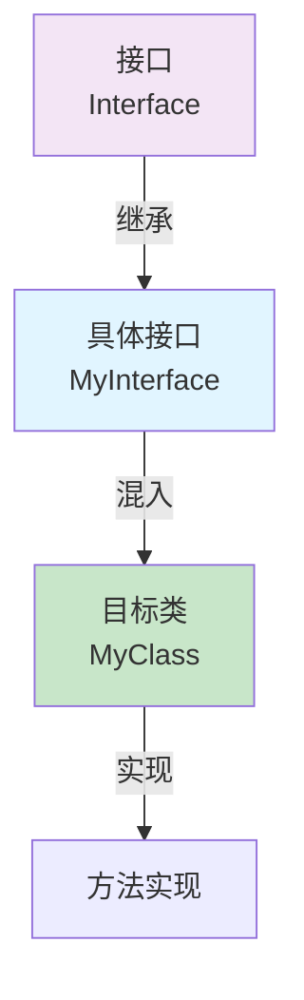
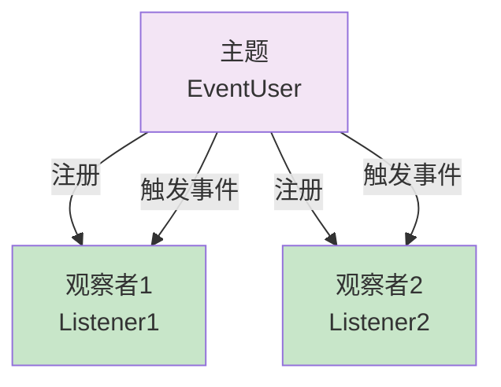
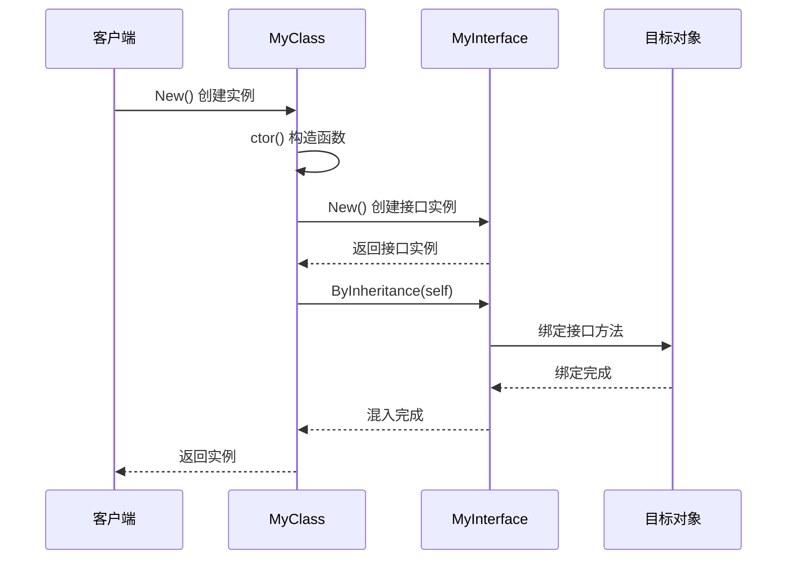
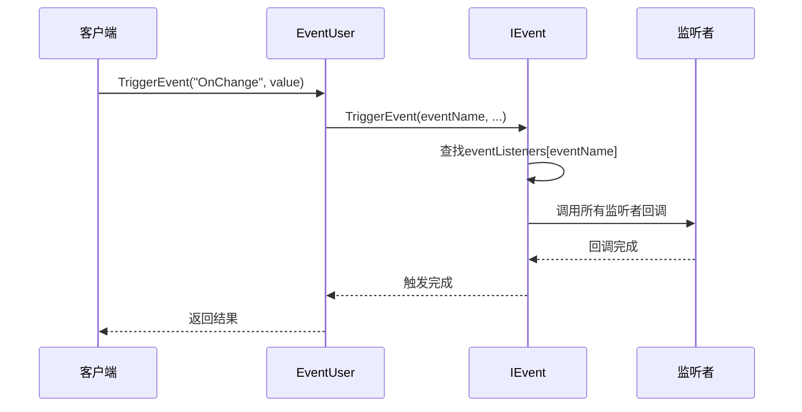

# OOP框架架构设计

## 设计目标

设计一套完整的Lua面向对象编程框架，支持接口机制、事件系统、装饰器模式、对象工厂，提供结构化、可维护的Lua代码编写方案，特别适合在Unity游戏中使用。

---

## 核心设计理念

### 1. 接口机制为核心

**本质**：OOP框架的核心是接口机制，解决Lua单继承的限制
- 接口定义 = 定义一组方法契约
- 多重继承 = 通过接口混入实现多重继承效果
- 接口混入 = 在类构造函数中混入接口
- 契约约束 = 通过接口明确定义类必须实现的方法

### 2. 设计模式组合

**本质**：通过组合多种设计模式提供完整的OOP支持
- 接口模式 = 解决Lua单继承限制
- 观察者模式 = 事件系统实现对象间松耦合通信
- 装饰器模式 = 动态扩展对象功能
- 工厂模式 = 简化对象创建和管理

### 3. 混入机制 + 链式调用

**本质**：通过混入机制实现接口继承，通过链式调用提供流畅API
- 混入机制 = ByInheritance方法实现接口混入
- 链式调用 = 流畅的API设计，易于使用
- 接口隔离 = 每个接口只定义相关的方法
- 组合复用 = 通过接口组合实现功能复用

---

## 整体架构设计

### 四模块架构 + 接口机制



### 接口混入数据流

```mermaid
graph LR
    Start[创建类实例] -->|1. 构造函数| Ctor[ctor方法<br/>初始化]
    Ctor -->|2. 创建接口实例| CreateInterface[接口实例<br/>MyInterface.New()]
    CreateInterface -->|3. 混入接口| Mixin[混入接口<br/>ByInheritance(self)]
    Mixin -->|4. 绑定方法| Bind[绑定方法<br/>self.method = interface.method]
    Bind -->|5. 完成| End[接口混入完成]
    
    style CreateInterface fill:#e1f5ff
    style Mixin fill:#fff4e1
    style Bind fill:#c8e6c9
```

**数据流特性**：
- ✅ **多重继承**：通过接口混入实现多重继承效果
- ✅ **契约约束**：通过接口明确定义类必须实现的方法
- ✅ **灵活组合**：可以混入多个接口，实现功能组合
- ✅ **运行时绑定**：接口方法在运行时绑定到类实例

---

## 接口模块架构设计

### 核心职责

接口定义 + 接口混入 + 多重继承支持

### 架构图



### 工作流程

```mermaid
flowchart TD
    Start[创建类实例<br/>MyClass.New()] --> Ctor[调用构造函数<br/>ctor]
    Ctor --> CreateInterface[创建接口实例<br/>MyInterface.New()]
    CreateInterface --> CallMixin[调用混入方法<br/>ByInheritance(self)]
    CallMixin --> BindMethods[绑定接口方法<br/>遍历接口方法]
    BindMethods --> CheckMethod{目标类<br/>是否已实现方法?}
    CheckMethod -->|是| Skip[跳过绑定<br/>使用类实现]
    CheckMethod -->|否| Bind[绑定接口方法<br/>self.method = interface.method]
    Bind --> Complete[混入完成]
    Skip --> Complete
    
    style CheckMethod fill:#fff4e1,stroke:#333,stroke-width:2px
    style Bind fill:#c8e6c9
    style Complete fill:#c8e6c9
```

---

## 事件模块架构设计

### 核心职责

事件注册 + 事件触发 + 事件管理

### 架构图



---

## 装饰器模块架构设计

### 核心职责

装饰器定义 + 装饰器安装 + 装饰器执行链

### 架构图



---

## 工厂模块架构设计

### 核心职责

类型注册 + 对象创建 + 对象池管理

### 架构图



---

## 架构模式分析

### 接口模式（Interface Pattern）

**核心思想**：通过接口定义契约，通过混入实现多重继承



**优势**：
- ✅ **多重继承**：解决Lua单继承的限制
- ✅ **契约约束**：通过接口明确定义类必须实现的方法
- ✅ **灵活组合**：可以混入多个接口，实现功能组合

### 观察者模式（Observer Pattern）

**核心思想**：事件系统实现对象间松耦合通信



---

## 数据流设计

### 接口混入数据流



### 事件触发数据流



---

## 架构验证

### 流程合理性验证

从架构可验证：
- ✅ **数据流完整**：接口混入 → 方法绑定 → 功能使用（完整流程）
- ✅ **职责清晰**：接口模块、事件模块、装饰器模块、工厂模块职责明确
- ✅ **解耦设计**：通过接口和事件系统实现模块间解耦
- ✅ **灵活扩展**：可以轻松添加新的接口和装饰器

### 扩展性验证

从架构可验证：
- ✅ **接口扩展**：新增接口只需继承Interface
- ✅ **装饰器扩展**：新增装饰器只需实现IDecorator
- ✅ **工厂扩展**：新增类型只需注册到工厂
- ✅ **组合复用**：通过接口组合实现功能复用

### 易用性验证

从架构可验证：
- ✅ **简单易用**：流畅的API设计，易于使用
- ✅ **多重继承**：通过接口混入实现多重继承效果
- ✅ **事件驱动**：事件系统实现对象间松耦合通信
- ✅ **装饰器模式**：动态扩展对象功能

---

## 开发指导原则

### 一、开发约束（什么能做，什么不能做）

#### ✅ 应该做的

1. **接口必须继承Interface**
   ```
   ✅ 正确：
   local MyInterface = BaseClass(Interface)
   
   ❌ 错误：
   不继承Interface的接口类
   ```

2. **接口混入必须在ctor中完成**
   ```
   ✅ 正确：
   function MyClass:ctor()
       MyInterface.New():ByInheritance(self)
   end
   
   ❌ 错误：
   在ctor外混入接口
   ```

3. **事件监听必须及时清理**
   ```
   ✅ 正确：
   object:RemoveAllEventListeners()
   
   ❌ 错误：
   不清理事件监听导致内存泄漏
   ```

#### ❌ 不应该做的

1. **禁止在接口方法中直接访问self**
   - 接口方法应该通过参数传递目标对象
   - 不能直接访问self

2. **禁止装饰器之间直接依赖**
   - 装饰器应该独立实现
   - 不能直接调用其他装饰器

3. **禁止工厂直接创建未注册类型**
   - 必须先在工厂中注册类型
   - 不能直接创建未注册的类型

### 二、开发流程（标准化开发步骤）

#### 使用接口的标准流程

```
1. 定义接口
   ↓
   local MyInterface = BaseClass(Interface)
   function MyInterface:Method1() end
   
2. 在类中使用接口
   ↓
   function MyClass:ctor()
       MyInterface.New():ByInheritance(self)
   end
   
3. 实现接口方法
   ↓
   function MyClass:Method1()
       -- 实现逻辑
   end
```

---

## 总结

### 架构设计价值

该架构设计文档的价值在于：
- ✅ **思路解构**：完整解构OOP框架系统的搭建思路
- ✅ **流程验证**：从架构层面验证流程合理性
- ✅ **模式分析**：分析接口模式、观察者模式、装饰器模式、工厂模式的应用
- ✅ **开发指导**：为后续详细设计和实现提供清晰指导

### 设计原则

- ✅ **接口机制为核心**：通过接口机制解决Lua单继承的限制
- ✅ **设计模式组合**：通过组合多种设计模式提供完整的OOP支持
- ✅ **混入机制 + 链式调用**：通过混入机制实现接口继承，通过链式调用提供流畅API
- ✅ **结构化编程**：帮助开发者以更加结构化、可维护的方式编写Lua代码

### 架构特点

- ✅ **多重继承**：通过接口混入实现多重继承效果
- ✅ **事件驱动**：事件系统实现对象间松耦合通信
- ✅ **装饰器模式**：动态扩展对象功能
- ✅ **工厂模式**：简化对象创建和管理

细节实现是后续开发阶段的工作，当前架构设计已足够指导整个OOP框架系统的开发。
