# Pathfinding寻路系统架构设计

## 设计目标

设计一套完整的高性能寻路系统，支持多种寻路算法（A*、BFS、Dijkstra、JPS、Flow Field、NavMesh），实现算法无关性、统一数据结构、委托模式架构、智能算法推荐，提供灵活、高性能的寻路解决方案。

---

## 核心设计理念

### 1. 委托模式为核心

**本质**：寻路系统的核心是委托模式的应用，彻底消除算法特定的硬编码逻辑
- 算法无关性 = 通过委托模式处理算法差异，避免硬编码
- 统一接口 = 所有算法通过统一的委托接口访问
- 动态选择 = 运行时动态选择最适合的算法
- 易于扩展 = 新增算法只需实现委托接口

### 2. 统一数据结构 + 高性能优化

**本质**：使用PathfindingNode统一所有算法的节点表示，通过值类型和位运算优化性能
- 统一节点 = PathfindingNode适配所有算法需求
- 值类型设计 = struct避免GC压力，零拆装箱
- 位运算优化 = 使用位标志进行高效状态管理
- 内存紧凑 = 结构体字段排列优化，提高缓存命中率

### 3. 门面模式 + 工厂模式

**本质**：通过门面模式提供统一API，通过工厂模式管理算法实例
- 门面模式 = PathfindingService提供统一的API接口
- 工厂模式 = PathfindingFactory管理算法实例创建和注册
- 智能推荐 = 基于网格特征的算法自动推荐
- 事件驱动 = 支持寻路生命周期事件

---

## 整体架构设计

### 四层架构 + 委托模式

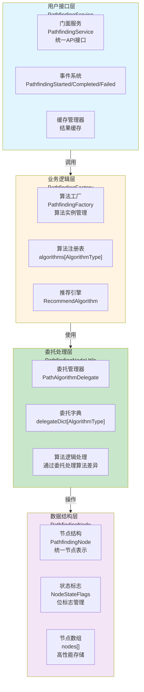

### 委托模式数据流

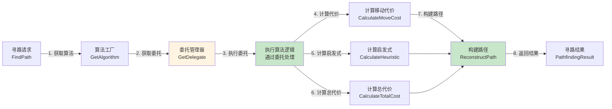

**数据流特性**：
- ✅ **算法无关性**：通过委托模式处理算法差异，避免硬编码
- ✅ **统一接口**：所有算法通过统一的委托接口访问
- ✅ **高性能**：值类型设计、位运算优化、零拆装箱
- ✅ **智能推荐**：基于网格特征自动推荐最适合的算法

---

## 用户接口层架构设计

### 核心职责

统一API接口 + 事件系统 + 缓存管理

### 架构图

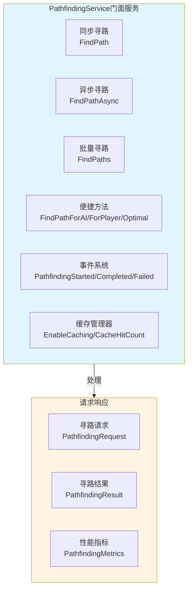

---

## 业务逻辑层架构设计

### 核心职责

算法管理 + 算法推荐 + 算法注册

### 架构图

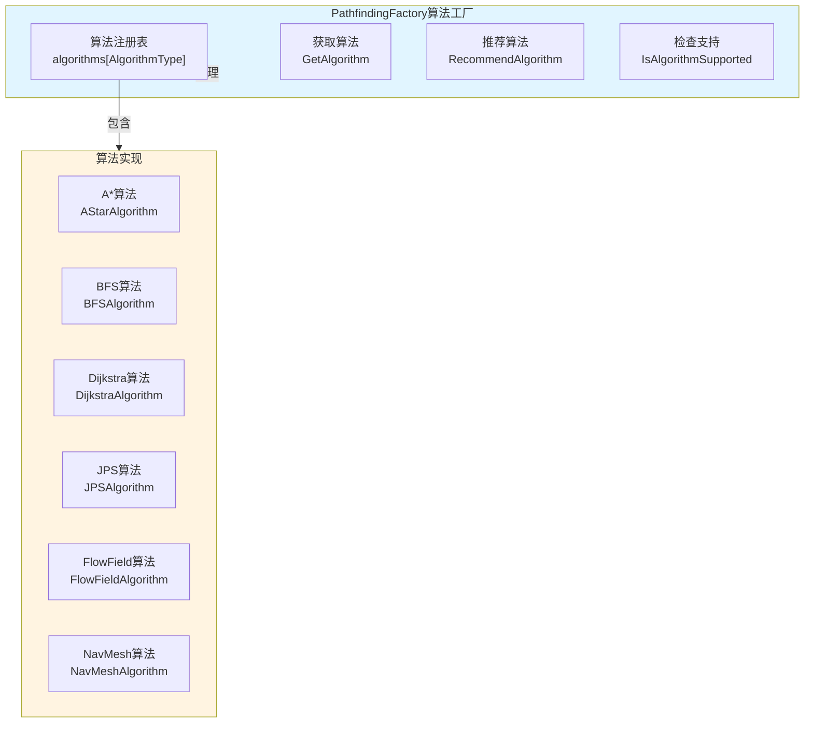

### 算法推荐流程

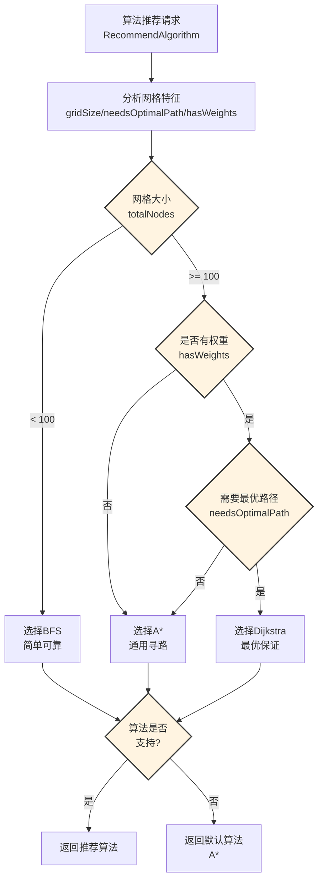

---

## 委托处理层架构设计

### 核心职责

委托管理 + 算法逻辑处理 + 算法差异处理

### 架构图

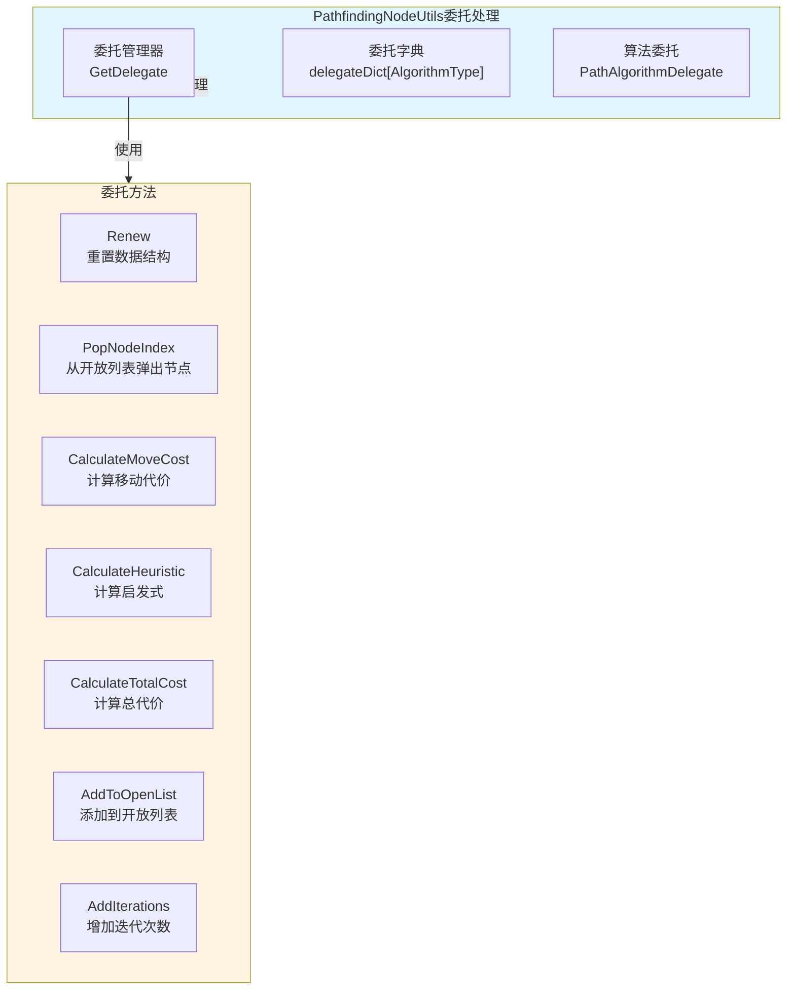

### 委托模式工作流程

```mermaid
flowchart TD
    Start[寻路请求<br/>FindPath] --> GetAlgorithm[获取算法<br/>GetAlgorithm]
    GetAlgorithm --> GetDelegate[获取委托<br/>GetDelegate(algorithmType)]
    GetDelegate --> CheckDict{委托字典<br/>是否已有?}
    CheckDict -->|是| ReturnDelegate[返回已有委托]
    CheckDict -->|否| CreateDelegate[创建委托<br/>根据算法类型]
    CreateDelegate --> RegisterDelegate[注册委托<br/>delegateDict[type] = delegate]
    RegisterDelegate --> ReturnDelegate
    ReturnDelegate --> ExecuteDelegate[执行委托<br/>通过委托处理算法逻辑]
    ExecuteDelegate --> Complete[寻路完成]
    
    style CheckDict fill:#fff4e1,stroke:#333,stroke-width:2px
    style CreateDelegate fill:#c8e6c9
    style ExecuteDelegate fill:#c8e6c9
```

---

## 数据结构层架构设计

### 核心职责

节点结构定义 + 状态标志管理 + 路径重建

### 架构图

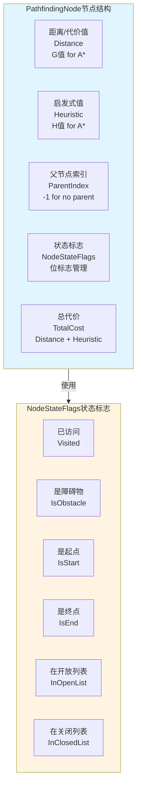

---

## 架构模式分析

### 委托模式（Delegate Pattern）

**核心思想**：通过委托处理算法差异，彻底消除硬编码

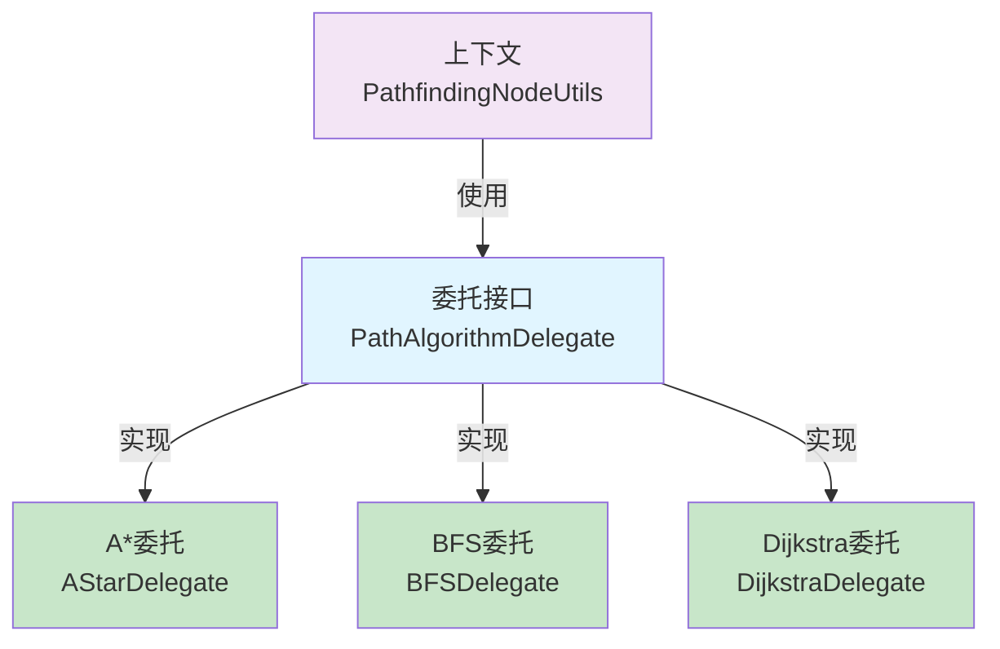

**优势**：
- ✅ **算法无关性**：彻底消除算法特定的硬编码逻辑
- ✅ **统一接口**：所有算法通过统一的委托接口访问
- ✅ **易于扩展**：新增算法只需实现委托接口
- ✅ **性能优化**：委托调用性能高，无额外开销

### 门面模式（Facade Pattern）

**核心思想**：PathfindingService提供统一的API接口，隐藏内部复杂性

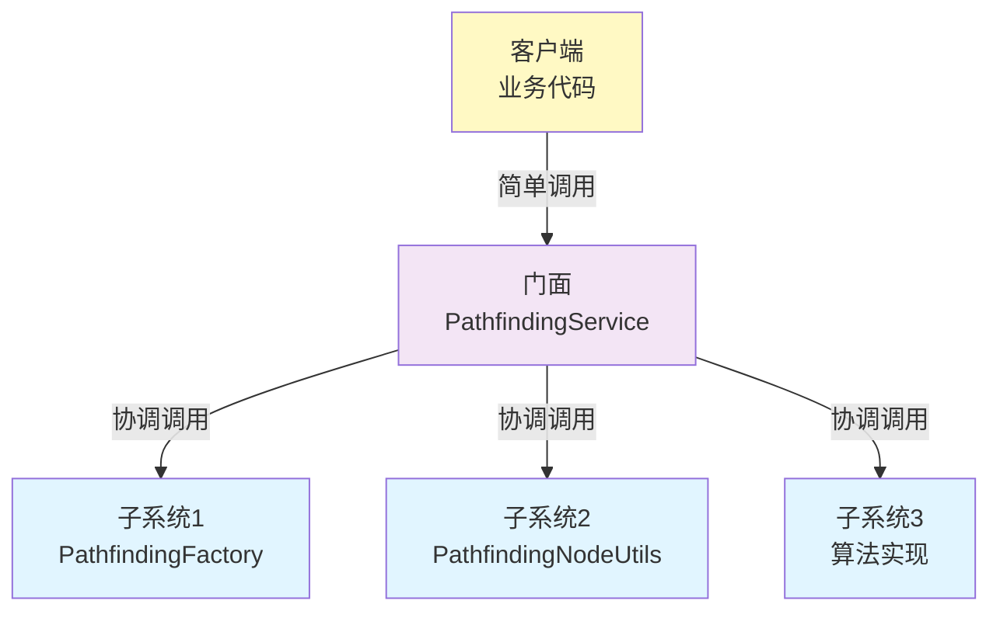

### 工厂模式（Factory Pattern）

**核心思想**：PathfindingFactory管理算法实例创建和注册

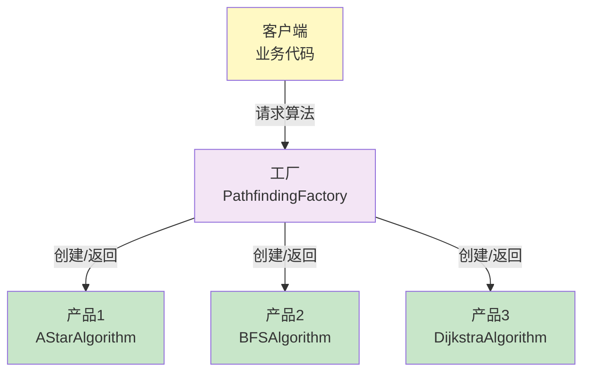

---

## 数据流设计

### 寻路执行数据流

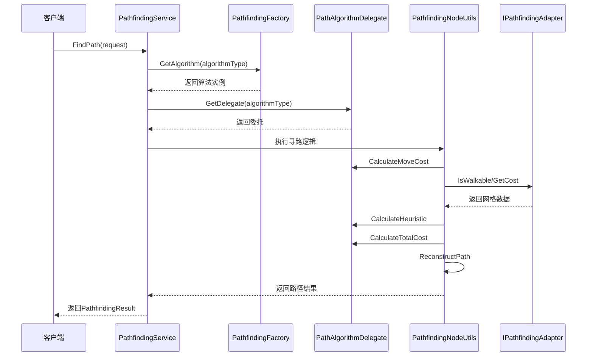

### 委托创建数据流

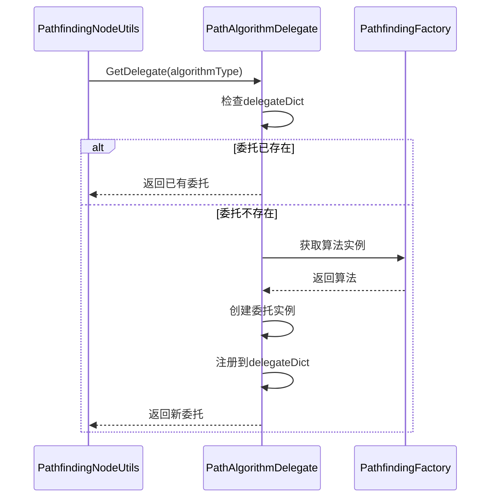

---

## 架构验证

### 流程合理性验证

从架构可验证：
- ✅ **数据流完整**：寻路请求 → 获取算法 → 获取委托 → 执行逻辑 → 返回结果（完整流程）
- ✅ **职责清晰**：用户接口层、业务逻辑层、委托处理层、数据结构层职责明确
- ✅ **解耦设计**：通过委托模式、门面模式、工厂模式实现解耦
- ✅ **算法无关性**：通过委托模式彻底消除硬编码

### 扩展性验证

从架构可验证：
- ✅ **委托模式**：新增算法只需实现委托接口
- ✅ **工厂模式**：新增算法只需注册到工厂
- ✅ **统一数据结构**：PathfindingNode适配所有算法
- ✅ **智能推荐**：基于网格特征自动推荐算法

### 性能验证

从架构可验证：
- ✅ **值类型设计**：PathfindingNode为struct，避免GC压力
- ✅ **位运算优化**：使用位标志进行高效状态管理
- ✅ **零拆装箱**：避免object[]参数，使用泛型和值类型
- ✅ **内存紧凑**：结构体字段排列优化，提高缓存命中率

---

## 开发指导原则

### 一、开发约束（什么能做，什么不能做）

#### ✅ 应该做的

1. **寻路必须通过PathfindingService**
   ```
   ✅ 正确：
   PathfindingService.Instance.FindPath(request)
   
   ❌ 错误：
   直接调用算法实例
   ```

2. **适配器必须实现IPathfindingAdapter**
   ```
   ✅ 正确：
   public class MyAdapter : IPathfindingAdapter
   
   ❌ 错误：
   不实现IPathfindingAdapter的适配器
   ```

3. **算法必须通过工厂注册**
   ```
   ✅ 正确：
   algorithms[AlgorithmType.CUSTOM] = new CustomAlgorithm()
   
   ❌ 错误：
   直接创建算法实例
   ```

#### ❌ 不应该做的

1. **禁止直接调用算法实例**
   - 必须通过PathfindingService统一接口
   - 不能直接调用算法的ExecuteAlgorithm方法

2. **禁止绕过委托模式**
   - 算法逻辑必须通过委托处理
   - 不能硬编码算法特定的逻辑

3. **禁止直接操作节点数组**
   - 必须通过PathfindingNodeUtils
   - 不能直接操作nodes数组

### 二、开发流程（标准化开发步骤）

#### 开发新算法的流程

```
1. 实现算法基类
   ↓
   public class CustomAlgorithm : PathfindingAlgorithmBase
   
2. 实现委托接口
   ↓
   创建PathAlgorithmDelegate实例
   实现所有委托方法
   
3. 注册算法
   ↓
   algorithms[AlgorithmType.CUSTOM] = new CustomAlgorithm()
   
4. 注册委托
   ↓
   delegateDict[AlgorithmType.CUSTOM] = customDelegate
   
5. 使用算法
   ↓
   PathfindingService.Instance.FindPath(request)
```

---

## 总结

### 架构设计价值

该架构设计文档的价值在于：
- ✅ **思路解构**：完整解构寻路系统的搭建思路
- ✅ **流程验证**：从架构层面验证流程合理性
- ✅ **模式分析**：分析委托模式、门面模式、工厂模式的应用
- ✅ **开发指导**：为后续详细设计和实现提供清晰指导

### 设计原则

- ✅ **委托模式为核心**：通过委托模式彻底消除算法特定的硬编码逻辑
- ✅ **统一数据结构 + 高性能优化**：使用PathfindingNode统一所有算法的节点表示
- ✅ **门面模式 + 工厂模式**：通过门面模式提供统一API，通过工厂模式管理算法实例
- ✅ **算法无关性**：所有算法通过统一的委托接口访问

### 架构特点

- ✅ **算法无关性**：通过委托模式彻底消除硬编码
- ✅ **高性能**：值类型设计、位运算优化、零拆装箱
- ✅ **智能推荐**：基于网格特征自动推荐最适合的算法
- ✅ **易于扩展**：新增算法只需实现委托接口和注册到工厂

**⚠️ 已知限制**：当前实现不支持并发寻路（多个请求共享静态数据结构），需要为每个请求创建独立的数据结构上下文。

细节实现是后续开发阶段的工作，当前架构设计已足够指导整个寻路系统的开发。
