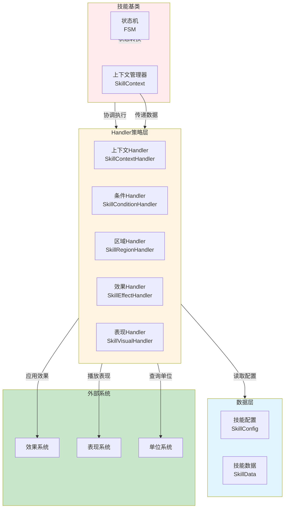
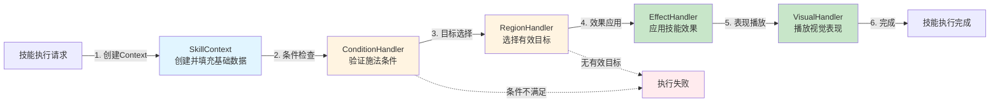
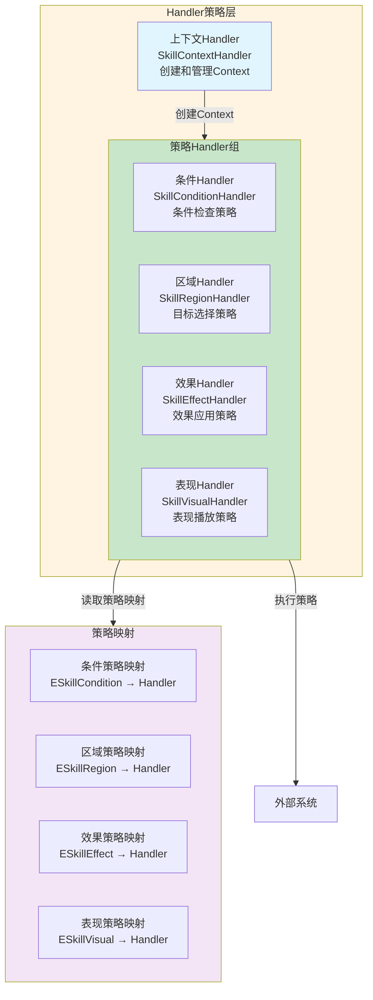
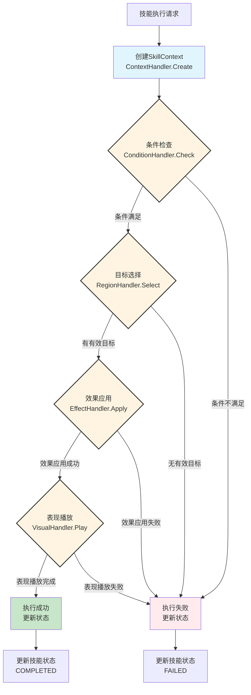
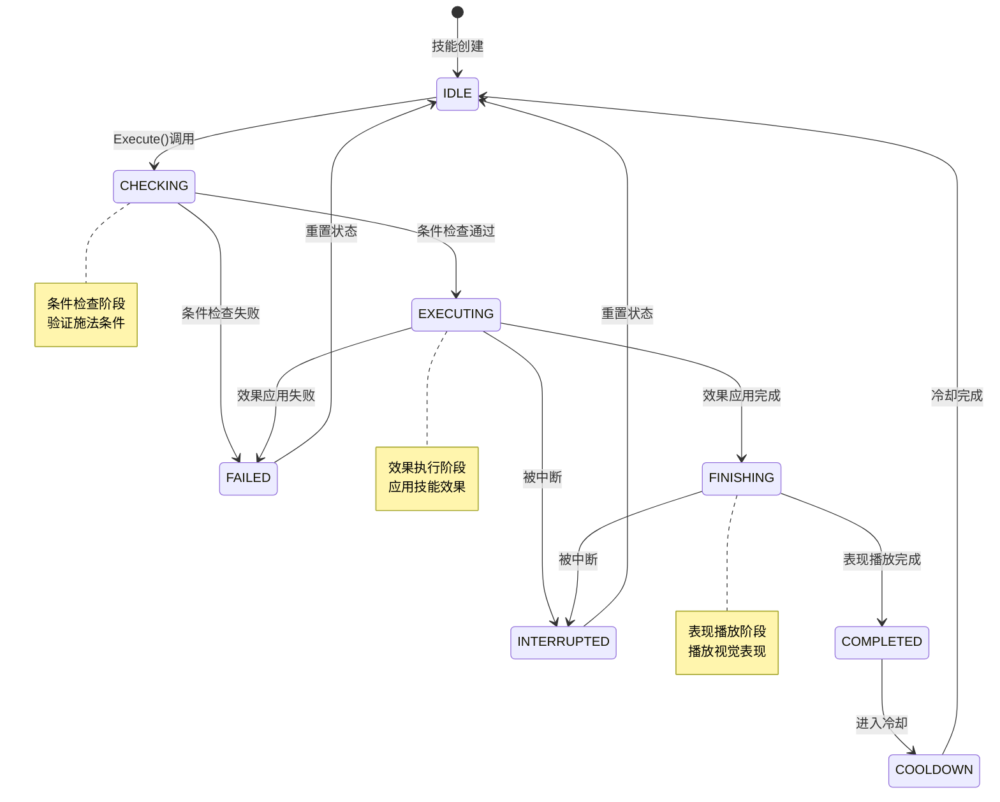
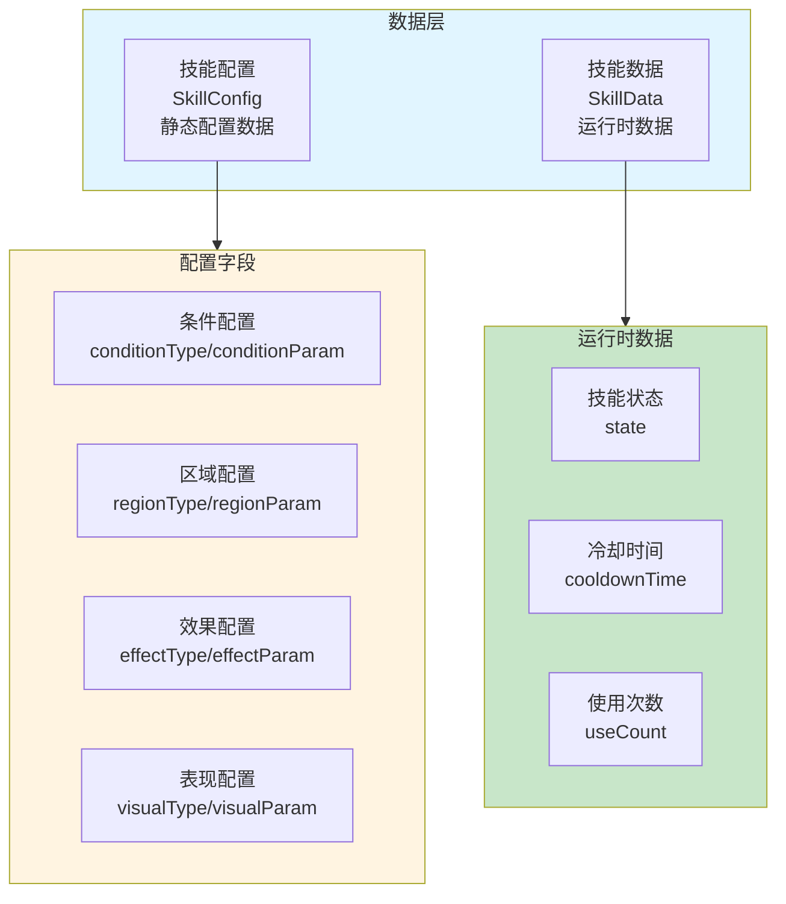
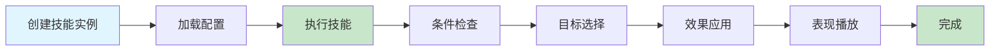

# 技能系统架构设计

## 设计目标

设计一套完整的技能系统架构，支持多种技能类型（攻击、治疗、辅助等），实现技能条件检查、目标选择、效果应用、表现播放的完整流程，提供基于Handler策略模式的灵活扩展机制。

---

## 核心设计理念

### 1. Handler策略模式为核心

**本质**：技能系统的核心是Handler策略的灵活组合
- 技能执行 = Handler组件的顺序执行
- 技能扩展 = 新增Handler策略
- 技能配置 = Handler类型和参数的配置
- 技能复用 = Handler组件的组合复用

### 2. 数据驱动架构

**本质**：技能特性通过配置数据实现，无需修改代码
- 技能类型、条件、区域、效果 → 通过配置数据定义
- 技能参数、数值、表现 → 通过配置数据调整
- 新增技能 → 扩展配置数据即可
- 技能平衡 → 调整配置数值即可

### 3. 管道过滤器模式

**本质**：技能执行流程作为管道，Handler作为过滤器
- 单Context设计：所有Handler使用统一的`SkillContext`
- 逐步增强：每个Handler在Context中添加自己的数据
- 数据流顺序：条件检查 → 目标选择 → 效果应用 → 表现播放

---

## 整体架构设计

### Handler策略架构 + 状态机控制



### 技能执行数据流



**数据流特性**：
- ✅ **单Context设计**：所有Handler使用统一的`SkillContext`，逐步增强
- ✅ **逐步增强机制**：每个Handler在Context中添加自己的数据
- ✅ **数据流顺序性**：条件检查 → 目标选择 → 效果应用 → 表现播放（严格顺序）
- ✅ **完整数据追踪**：Context包含从条件检查到表现播放的所有数据
- ✅ **Handler独立性**：每个Handler独立处理，可替换和扩展
- ✅ **解耦设计**：Handler通过Context通信，不直接依赖

---

## Handler策略层架构设计

### 核心职责
策略模式实现 + Handler组件组合 + Context数据传递

### 架构图



### 工作流程



### 核心组件

1. **上下文Handler（SkillContextHandler）**
   - 创建和管理SkillContext
   - 初始化Context基础数据（caster、targets、config等）
   - 管理Context生命周期

2. **条件Handler（SkillConditionHandler）**
   - **距离检查**：验证施法距离是否满足
   - **等级检查**：验证施法者等级是否满足
   - **消耗检查**：验证MP/HP等资源是否足够
   - **状态检查**：验证施法者状态是否允许
   - **其他条件**：可扩展的条件检查策略

3. **区域Handler（SkillRegionHandler）**
   - **单体目标**：选择单个目标
   - **多体目标**：选择多个目标
   - **范围目标**：选择范围内的目标
   - **自身目标**：选择自身
   - **其他区域**：可扩展的区域选择策略

4. **效果Handler（SkillEffectHandler）**
   - **直接伤害**：直接造成伤害
   - **治疗效果**：恢复生命值
   - **应用效果**：应用Effect系统中的效果
   - **属性修改**：修改目标属性
   - **其他效果**：可扩展的效果应用策略

5. **表现Handler（SkillVisualHandler）**
   - **简单表现**：基础视觉表现
   - **特效表现**：使用Visual系统播放特效
   - **动画表现**：播放技能动画
   - **音效表现**：播放技能音效
   - **其他表现**：可扩展的表现播放策略

---

## 状态机设计

### 核心职责
技能执行状态管理 + 状态转换控制

### 状态机图



### 状态说明

| 状态 | 说明 | 转换条件 |
|---|---|---|
| **IDLE** | 空闲状态 | 技能创建时、冷却完成后 |
| **CHECKING** | 条件检查中 | Execute()调用后 |
| **EXECUTING** | 效果执行中 | 条件检查通过后 |
| **FINISHING** | 表现播放中 | 效果应用完成后 |
| **COMPLETED** | 执行完成 | 表现播放完成后 |
| **FAILED** | 执行失败 | 条件检查失败、效果应用失败 |
| **INTERRUPTED** | 被中断 | 执行过程中被中断 |
| **COOLDOWN** | 冷却中 | 执行完成后 |

---

## 数据层设计

### 核心职责
技能配置管理 + 技能数据持久化

### 架构图



### 配置结构

**静态配置数据（SkillConfig）**：
```lua
-- SkillConfig中的配置（静态数据）
SkillConfig = {
    -- ... 其他字段
    
    -- 条件检查配置
    conditionType = ESkillCondition.DISTANCE_REQUIREMENT,
    conditionParam = {15},  -- 距离要求
    
    -- 区域选择配置
    regionType = ESkillRegion.SINGLE_TARGET,
    regionParam = {15, 1},  -- 范围、目标数
    
    -- 效果应用配置
    effectType = ESkillEffect.APPLY_EFFECT,
    effectParam = {effectIds = {1001, 1002}},
    
    -- 表现播放配置
    visualType = ESkillVisual.EFFECT_VISUAL,
    visualParam = {duration = 2.0}
}
```

**运行时数据（SkillData）**：
```lua
-- SkillData中的运行时数据
SkillData = {
    -- ... 其他字段
    
    -- 运行时状态
    state = ESkillState.IDLE,
    cooldownTime = 0,
    useCount = 0
}
```

**数据来源**：
- ✅ **静态配置**：从SkillConfig中读取（conditionType、regionType、effectType、visualType等）
- ✅ **运行时数据**：在SkillData中维护（state、cooldownTime、useCount）

---

## Context数据流增强过程

### 数据流增强

```
SkillContext（创建时）
  + caster（施法者）
  + targets（目标列表）
  + config（技能配置）
  ↓
  + conditionResult（条件检查结果）
  + validTargets（有效目标列表）
  ↓
  + effectResult（效果应用结果）
  + affectedTargets（受影响目标列表）
  ↓
  + visualResult（表现播放结果）
  ↓
SkillContext（完成时）
```

### Context字段设计

**基础字段（创建时填充）**：
- `caster`：施法者单位
- `targets`：初始目标列表
- `config`：技能配置数据

**条件检查阶段增强**：
- `conditionResult`：条件检查结果（true/false）
- `conditionMessage`：条件检查失败原因（可选）

**目标选择阶段增强**：
- `validTargets`：有效目标列表
- `regionResult`：区域选择结果

**效果应用阶段增强**：
- `effectResult`：效果应用结果
- `affectedTargets`：受影响目标列表
- `effectData`：效果数据（伤害值、治疗值等）

**表现播放阶段增强**：
- `visualResult`：表现播放结果
- `visualSequence`：表现序列（如果使用Visual系统）

---

## 使用方式

### 方式一：使用SkillBase（推荐）

**完整流程**：



**代码示例**：
```lua
-- 创建技能实例
local skill = SkillBase.New(1001, "skills/fireball")

-- 配置技能
local config = {
    conditionType = ESkillCondition.DISTANCE_REQUIREMENT,
    conditionParam = {15},
    regionType = ESkillRegion.SINGLE_TARGET,
    regionParam = {15, 1},
    effectType = ESkillEffect.APPLY_EFFECT,
    effectParam = {effectIds = {1001, 1002}},
    visualType = ESkillVisual.EFFECT_VISUAL,
    visualParam = {duration = 2.0}
}

-- 加载配置
skill:LoadConfiguration(config)

-- 执行技能
skill:Execute(caster, targets)
```

### 方式二：直接使用Handler（高级用法）

**适用场景**：需要自定义技能执行流程或组合多个Handler

**代码示例**：
```lua
-- 条件检查
local conditionHandler = SkillConditionHandler[ESkillCondition.DISTANCE_REQUIREMENT]
local canCast = conditionHandler.Check(config, caster, targets)

if not canCast then
    return false
end

-- 目标选择
local regionHandler = SkillRegionHandler[ESkillRegion.MULTI_TARGET]
local validTargets = regionHandler.Select(config, caster, targets)

if #validTargets == 0 then
    return false
end

-- 效果应用
local effectHandler = SkillEffectHandler[ESkillEffect.DIRECT_DAMAGE]
local success = effectHandler.Apply(config, caster, validTargets)

-- 表现播放
local visualHandler = SkillVisualHandler[ESkillVisual.SIMPLE_VISUAL]
visualHandler.Play(config, caster, validTargets)
```

---

## 架构验证

### 流程合理性验证

从架构可验证：
- ✅ **数据流完整**：条件检查 → 目标选择 → 效果应用 → 表现播放（完整流程）
- ✅ **职责清晰**：每个Handler职责明确，无重叠
- ✅ **解耦设计**：Handler通过Context通信，不直接依赖
- ✅ **状态管理**：状态机流程清晰，无循环依赖

### 扩展性验证

从架构可验证：
- ✅ **策略模式**：新增Handler策略即可扩展功能
- ✅ **配置驱动**：新技能通过配置数据扩展
- ✅ **Handler独立性**：每个Handler可独立替换和扩展
- ✅ **组合灵活**：Handler组件可灵活组合

### 完整性验证

从架构可验证：
- ✅ **完整流程**：覆盖技能执行全流程
- ✅ **状态管理**：完整的状态机设计
- ✅ **错误处理**：条件检查失败、目标选择失败等异常处理
- ✅ **数据驱动**：技能特性通过配置实现

---

## 总结

### 架构设计价值

该架构设计文档的价值在于：
- ✅ **思路解构**：完整解构技能系统的搭建思路
- ✅ **流程验证**：从架构层面验证流程合理性
- ✅ **扩展性验证**：验证Handler策略模式的扩展能力
- ✅ **开发指导**：为后续详细设计和实现提供清晰指导

### 设计原则

- ✅ **Handler策略模式为核心**：技能系统的核心是Handler策略的灵活组合
- ✅ **数据驱动架构**：技能特性通过配置数据实现，无需修改代码
- ✅ **管道过滤器模式**：技能执行流程作为管道，Handler作为过滤器
- ✅ **解耦设计**：Handler通过Context通信，不直接依赖

### 架构特点

- ✅ **单Context设计**：所有Handler使用统一的`SkillContext`，逐步增强
- ✅ **策略模式**：Handler策略映射，灵活扩展
- ✅ **状态机控制**：完整的状态机设计，状态转换清晰
- ✅ **配置驱动**：技能特性通过配置实现

细节实现是后续开发阶段的工作，当前架构设计已足够指导整个技能系统的开发。
