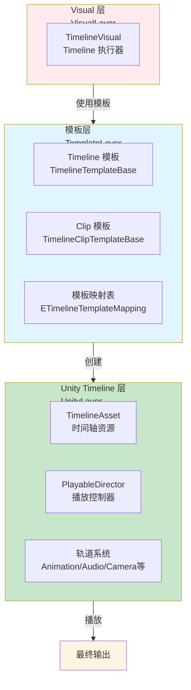
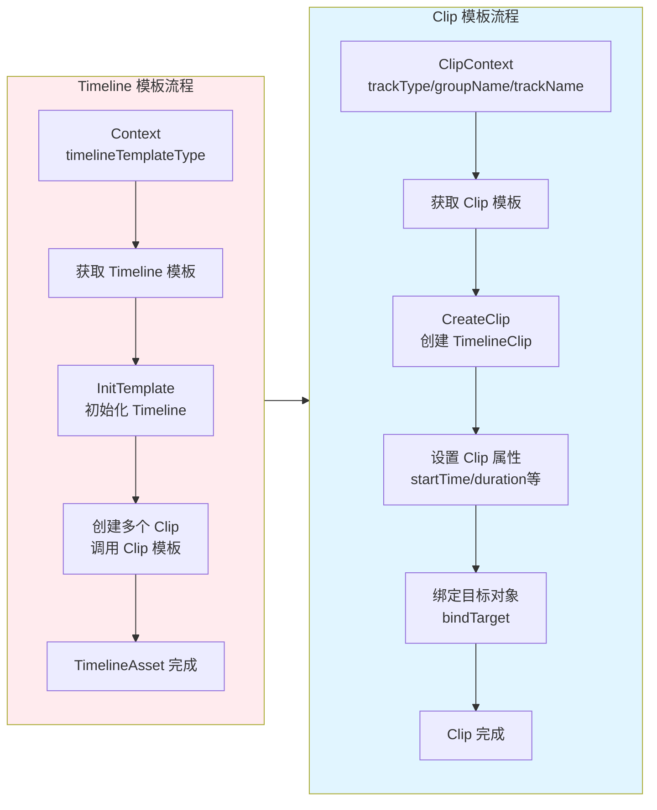
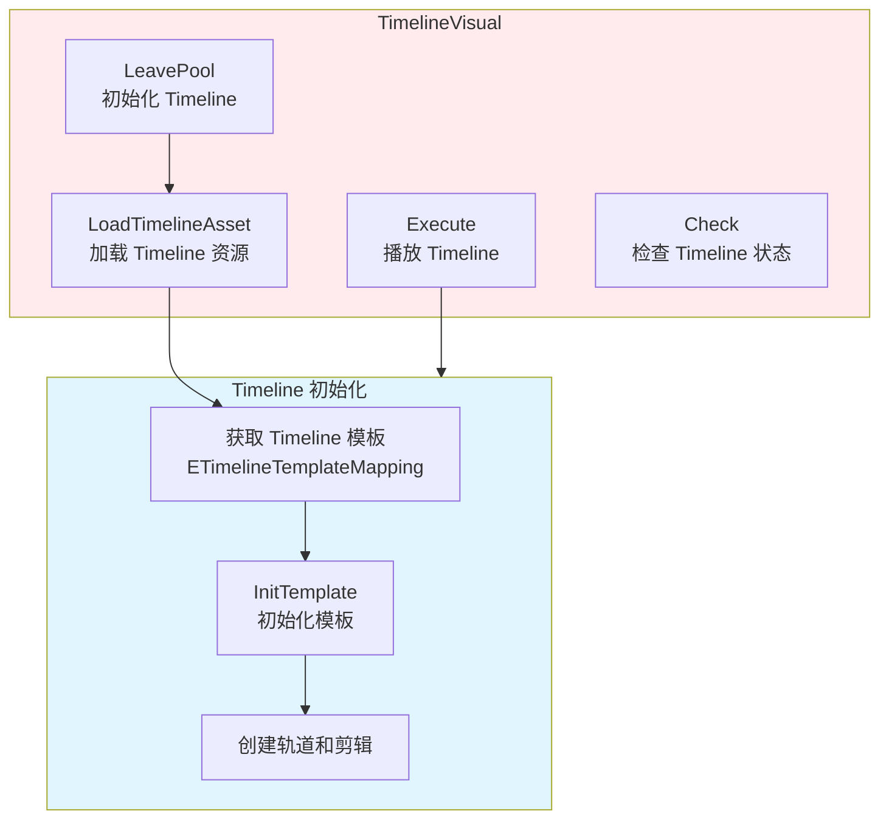
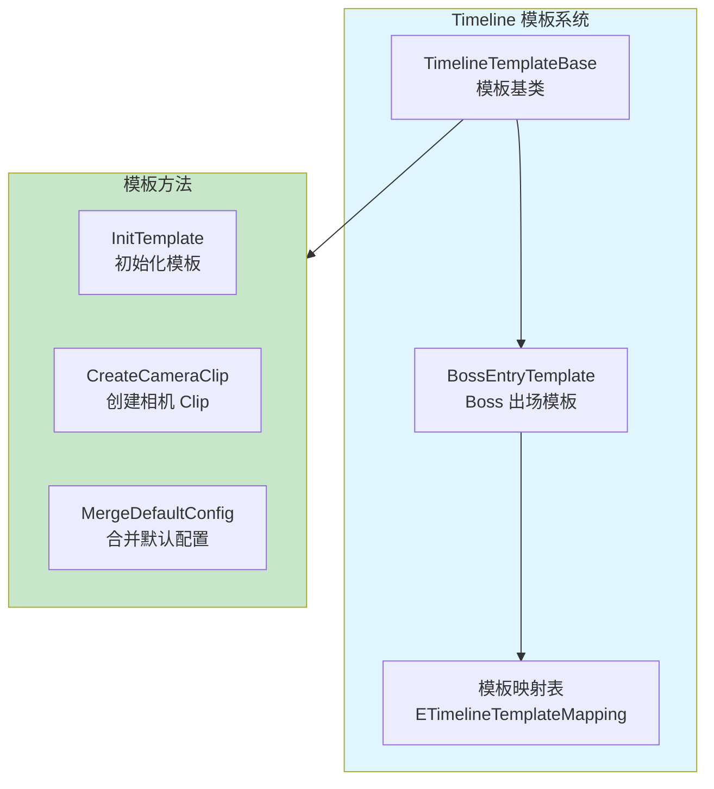
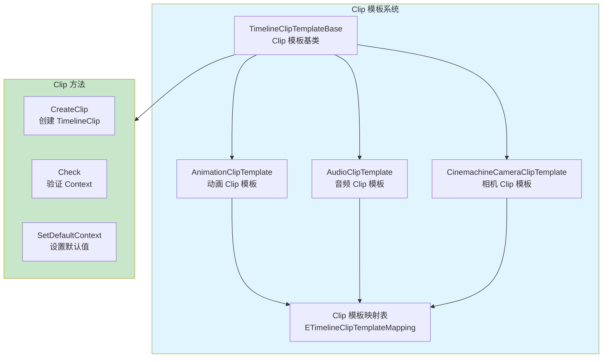
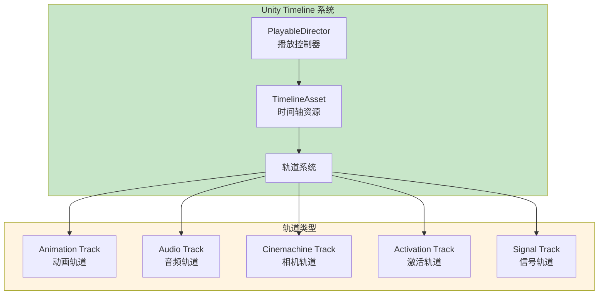
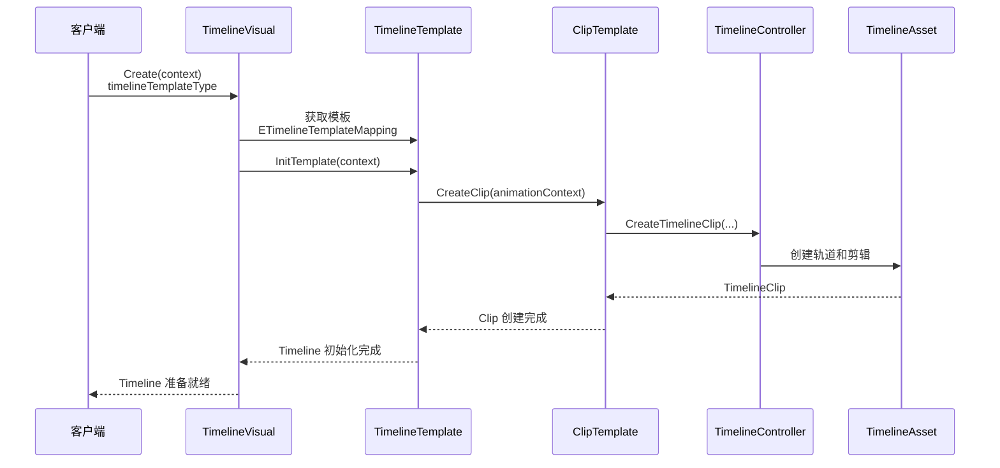
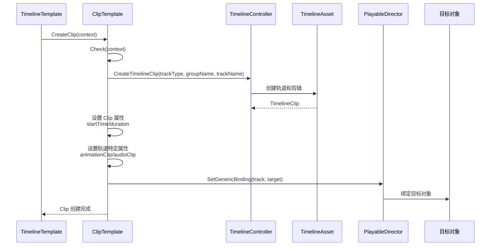
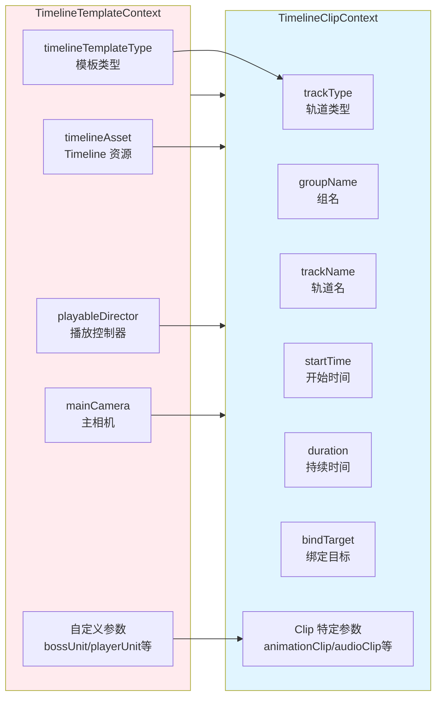

# Timeline 系统架构设计

## 设计目标

设计一套基于 Unity Timeline 的模板驱动时间轴系统，支持动态创建轨道和剪辑、模板化配置、多轨道类型（动画、音频、相机等），提供统一接口、高性能、易扩展的时间轴编排框架。

---

## 核心设计理念

### 1. 模板驱动架构为核心

**本质**：Timeline 系统的核心是模板驱动的动态创建机制
- 模板配置 = 所有 Timeline 配置通过模板类预定义
- 动态创建 = 运行时根据模板动态创建 TimelineAsset、轨道和剪辑
- 模板复用 = 同一模板可创建多个 Timeline 实例，支持参数覆盖
- 配置分离 = 模板配置与运行时数据分离，易于维护

### 2. 双层模板系统：Timeline 模板 + Clip 模板

**本质**：系统采用双层模板设计，分别管理 Timeline 整体和单个 Clip
- Timeline 模板 = 管理整个 Timeline 的配置（如 BossEntryTemplate）
- Clip 模板 = 管理单个轨道剪辑的创建（如 AnimationClipTemplate）
- 模板组合 = Timeline 模板通过组合多个 Clip 模板构建完整 Timeline
- 独立扩展 = 两种模板可独立扩展，互不干扰

### 3. 多轨道类型统一管理

**本质**：系统统一管理多种轨道类型，提供一致的创建接口
- 轨道类型 = Animation、Audio、Cinemachine、Activation、Signal 等
- 统一接口 = 所有轨道类型使用相同的 Clip 模板基类
- 类型映射 = 通过枚举和映射表管理轨道类型
- 易于扩展 = 新增轨道类型只需创建新的 Clip 模板

### 4. Context 模式统一参数

**本质**：所有模板使用统一的 Context 参数，接口稳定，参数灵活扩展
- 统一接口 = Timeline 模板和 Clip 模板都使用 Context 参数
- 参数扩展 = 支持任意扩展字段，无需修改函数签名
- 默认配置 = 支持默认配置和覆盖配置合并
- 向后兼容 = 新增字段不影响旧代码

---

## 整体架构设计

### 三层架构 + 双层模板系统



### 双层模板数据流



---

## 详细层级设计

### 1. Visual 层：TimelineVisual

#### 1.1 TimelineVisual 架构

**架构图**：



**工作流程**：

1. **初始化阶段**（LeavePool）：
   - 从 Context 获取 `timelineTemplateType`
   - 如果 `timelineAsset` 未提供，调用 `LoadTimelineAsset()` 加载
   - 从映射表获取对应的 Timeline 模板
   - 调用模板的 `InitTemplate()` 初始化 Timeline

2. **资源加载阶段**（LoadTimelineAsset）：
   - 根据 `timelineTemplateType` 获取资源路径
   - 加载 Timeline 预制体
   - 获取 `PlayableDirector` 组件
   - 将 `PlayableAsset` 转换为 `TimelineAsset`

3. **执行阶段**（Execute）：
   - 检查 Timeline 状态
   - 调用 `PlayableDirector:Play()` 播放 Timeline

4. **回收阶段**（EnterPool）：
   - 清理 Timeline 相关引用

**核心组件**：

- `TimelineVisual:LeavePool()` - 初始化 Timeline 和模板
- `TimelineVisual:LoadTimelineAsset()` - 加载 Timeline 资源
- `TimelineVisual:Execute()` - 播放 Timeline
- `TimelineVisual:Check()` - 检查 Timeline 状态

### 2. 模板层：双层模板系统

#### 2.1 Timeline 模板系统

**架构图**：



**工作流程**：

1. **模板定义**（编辑器/代码）：
   - 继承 `TimelineTemplateBase` 创建模板类
   - 定义默认配置（如 `DefaultEnterCameraContext`）
   - 实现 `InitTemplate()` 方法，创建所需的轨道和剪辑

2. **模板注册**（运行时）：
   - 在 `TimelineRule.lua` 中注册模板到映射表
   - 通过 `ETimelineTemplate` 枚举管理模板类型

3. **模板使用**（运行时）：
   - 通过 `timelineTemplateType` 获取模板
   - 调用 `InitTemplate()` 初始化 Timeline
   - 模板内部调用 Clip 模板创建各个轨道剪辑

**核心组件**：

- `TimelineTemplateBase` - Timeline 模板基类
- `TimelineTemplateBase:InitTemplate()` - 初始化模板
- `TimelineTemplateBase:CreateCameraClip()` - 创建相机 Clip（通用方法）
- `TimelineTemplateBase.MergeDefaultConfig()` - 合并默认配置（静态方法）

**示例：BossEntryTemplate**

```lua
-- Boss 出场 Timeline 模板
-- 包含4个阶段：入场相机 → 玩家相机 → Boss相机+动画 → 战斗相机
function TimelineTemplateBossEntry:InitTemplate(context)
    -- 1. 创建入场相机
    if context.enterCamera then
        self:CreateCameraClip(context, context.enterCamera, DefaultEnterCameraContext, followTarget, "enter")
    end
    
    -- 2. 创建玩家相机
    if context.playerUnit then
        self:CreateCameraClip(context, context.playerCamera, DefaultPlayerCameraContext, playerUnit.transform, "player")
    end
    
    -- 3. 创建 Boss 相机 + 动画
    if context.bossUnit then
        self:CreateCameraClip(context, context.bossCamera, DefaultBossCameraContext, bossUnit.transform, "boss")
        -- 创建动画轨道
        local animationClipTemplate = ETimelineClipTemplateMapping[ETimelineClipTemplate.Animation]
        animationClipTemplate:CreateClip(animationContext)
    end
    
    -- 4. 创建战斗相机
    if context.battleCamera then
        self:CreateCameraClip(context, context.battleCamera, DefaultBattleCameraContext, followTarget, "battle")
    end
end
```

#### 2.2 Clip 模板系统

**架构图**：



**工作流程**：

1. **Clip 创建流程**：
   - 从 Context 获取轨道类型、组名、轨道名等参数
   - 调用 `TimelineController.CreateTimelineClip()` 创建 Clip
   - 设置 Clip 的基础属性（startTime、duration、clipIn 等）
   - 根据轨道类型设置特定属性（如 AnimationClip、AudioClip 等）
   - 绑定目标对象（如 Animator、AudioSource 等）

2. **Clip 类型支持**：
   - **Animation Track**：绑定 Animator，播放动画片段
   - **Audio Track**：播放音频片段
   - **Cinemachine Track**：控制相机，支持虚拟相机
   - **Activation Track**：控制 GameObject 激活状态
   - **Signal Track**：发送信号，触发事件
   - **Playable Track**：自定义 Playable 行为
   - **Control Track**：控制其他 Timeline

**核心组件**：

- `TimelineClipTemplateBase` - Clip 模板基类
- `TimelineClipTemplateBase:CreateClip()` - 创建 TimelineClip
- `TimelineClipTemplateBase:Check()` - 验证 Context 参数
- `TimelineClipTemplateBase:SetDefaultContext()` - 设置默认值

**示例：AnimationClipTemplate**

```lua
function AnimationTimelineClipTemplate:CreateClip(context)
    -- 设置轨道类型
    context.trackType = LuaToma.Visual_TimelineClipType.Animation
    
    -- 调用基类创建 Clip
    local timelineClip = self.super.CreateClip(self, context)
    
    -- 设置 AnimationClip
    if context.animationClip then
        timelineClip.asset = context.animationClip
        if not context.duration then
            timelineClip.duration = context.animationClip.length
        end
    end
    
    -- 绑定 Animator
    if context.bindTarget then
        local animator = context.bindTarget:GetComponent(CS.UnityEngine.Animator)
        if animator then
            playableDirector:SetGenericBinding(track, animator)
        end
    end
    
    return timelineClip
end
```

### 3. Unity Timeline 层：TimelineAsset 和 PlayableDirector

**架构图**：



**工作流程**：

1. **TimelineAsset 创建**：
   - 通过 `TimelineController.CreateTimelineClip()` 创建 Clip
   - Clip 自动创建对应的轨道（Track）
   - 轨道自动添加到 TimelineAsset

2. **轨道绑定**：
   - 通过 `PlayableDirector:SetGenericBinding()` 绑定目标对象
   - Animation Track 绑定 Animator
   - Audio Track 绑定 AudioSource
   - Cinemachine Track 绑定 CinemachineBrain

3. **Timeline 播放**：
   - 调用 `PlayableDirector:Play()` 播放 Timeline
   - Timeline 自动管理所有轨道的播放
   - 支持暂停、恢复、停止、跳转等操作

**核心组件**：

- `UnityEngine.Timeline.TimelineAsset` - Timeline 资源
- `UnityEngine.Playables.PlayableDirector` - Timeline 播放控制器
- `TimelineController` - Timeline 控制器（C# 封装）
- `TimelineClip` - Timeline 剪辑

---

## 架构模式分析

### 1. 模板方法模式（Template Method）

**应用场景**：Timeline 模板和 Clip 模板的创建流程

**实现方式**：
- `TimelineTemplateBase` 定义模板创建流程
- 子类重写 `InitTemplate()` 实现具体配置
- `TimelineClipTemplateBase` 定义 Clip 创建流程
- 子类重写 `CreateClip()` 实现特定轨道类型

**优势**：
- 统一创建流程，易于维护
- 子类只需关注具体配置
- 支持模板复用和扩展

### 2. 工厂模式（Factory）

**应用场景**：Timeline 模板和 Clip 模板的创建

**实现方式**：
- `ETimelineTemplateMapping` 管理 Timeline 模板映射
- `ETimelineClipTemplateMapping` 管理 Clip 模板映射
- 通过枚举类型获取对应的模板实例
- 统一的创建接口，隐藏创建细节

**优势**：
- 统一创建逻辑
- 易于扩展新的模板类型
- 支持延迟加载和动态注册

### 3. 策略模式（Strategy）

**应用场景**：多种轨道类型的统一管理

**实现方式**：
- 每种轨道类型实现独立的 Clip 模板
- 都继承 `TimelineClipTemplateBase`，使用统一的接口
- 通过 `trackType` 选择使用哪种策略

**优势**：
- 轨道类型独立，互不干扰
- 易于扩展新的轨道类型
- 统一接口，降低使用复杂度

### 4. 建造者模式（Builder）

**应用场景**：Timeline 的复杂构建过程

**实现方式**：
- Timeline 模板通过组合多个 Clip 模板构建完整 Timeline
- 支持链式调用和分步构建
- Context 参数逐步填充

**优势**：
- 支持复杂 Timeline 的构建
- 构建过程清晰，易于理解
- 支持参数覆盖和默认配置

### 5. Context 模式

**应用场景**：统一参数传递

**实现方式**：
- Timeline 模板和 Clip 模板都使用 Context 参数
- 支持默认配置和覆盖配置合并
- 参数可灵活扩展，不影响接口

**优势**：
- 接口稳定，参数灵活
- 支持向后兼容
- 易于扩展新参数

---

## 数据流设计

### 1. Timeline 创建数据流



### 2. Clip 创建数据流



### 3. Context 数据流



---

## 架构验证

### 1. 性能验证

**验证点**：
- ✅ Timeline 资源预加载，避免运行时加载延迟
- ✅ 模板系统延迟加载，减少初始化开销
- ✅ Clip 创建使用 Unity API，性能稳定
- ✅ 支持批量创建 Clip，减少多次调用开销

**性能指标**：
- Timeline 模板初始化：< 50ms（包含多个 Clip 创建）
- Clip 创建：< 5ms（单个 Clip）
- Timeline 播放：Unity 原生性能

### 2. 扩展性验证

**验证点**：
- ✅ 新增 Timeline 模板只需创建新类并注册
- ✅ 新增 Clip 模板只需创建新类并注册
- ✅ 支持自定义轨道类型
- ✅ Context 模式支持参数扩展，向后兼容

**扩展场景**：
- 新增 Timeline 模板：创建模板类，注册到映射表
- 新增 Clip 模板：创建 Clip 模板类，注册到映射表
- 新增轨道类型：扩展 `ETimelineClipTemplate` 枚举，创建对应模板

### 3. 易用性验证

**验证点**：
- ✅ 统一的 Context 接口，参数清晰
- ✅ 模板化配置，减少代码编写
- ✅ 支持默认配置和覆盖配置
- ✅ 完整的错误检查和日志输出

**使用示例**：
```lua
-- 创建 Boss 出场 Timeline
local context = {
    timelineTemplateType = ETimelineTemplate.BossEntry,
    bossUnit = bossGameObject,
    playerUnit = playerGameObject,
    bossAnimationClip = bossAnimationClip,
    bossAudioClip = bossAudioClip,
    mainCamera = mainCameraGameObject,
    -- 可选：覆盖默认相机配置
    bossCamera = {
        startTime = 4.0,
        duration = 3.0,
        orthoSize = 2.0
    }
}
local visual = VisualFactory.Create(EVisual.Timeline, context)
visual:Execute()
```

### 4. 完整性验证

**验证点**：
- ✅ 支持多种轨道类型（Animation、Audio、Camera 等）
- ✅ 支持 Timeline 模板和 Clip 模板双层设计
- ✅ 支持默认配置和覆盖配置合并
- ✅ 完整的生命周期管理（创建、播放、回收）
- ✅ 支持目标对象绑定

---

## 开发指导原则

### 1. 模板设计原则

**原则**：Timeline 模板关注整体流程，Clip 模板关注单个轨道

**实践**：
- Timeline 模板：定义 Timeline 的整体结构（如 Boss 出场包含哪些阶段）
- Clip 模板：定义单个轨道的创建逻辑（如如何创建动画轨道）
- 模板职责分离，避免相互依赖

### 2. 配置合并原则

**原则**：支持默认配置和覆盖配置合并，提供灵活的参数控制

**实践**：
- 在模板中定义默认配置（如 `DefaultEnterCameraContext`）
- 支持通过 Context 传入覆盖配置
- 使用 `MergeDefaultConfig()` 合并配置
- 覆盖配置优先，默认配置作为后备

### 3. 轨道类型扩展原则

**原则**：新增轨道类型时，创建对应的 Clip 模板并注册

**实践**：
- 继承 `TimelineClipTemplateBase` 创建新模板
- 实现 `CreateClip()` 方法，处理特定轨道类型的创建
- 在 `TimelineRule.lua` 中注册到映射表
- 扩展 `ETimelineClipTemplate` 枚举

### 4. Context 设计原则

**原则**：Context 参数清晰，支持扩展，保持向后兼容

**实践**：
- 必需参数明确标注，提供清晰的错误提示
- 可选参数提供默认值
- 新增参数不影响旧代码
- 使用有意义的参数名称

### 5. 错误处理原则

**原则**：完整的错误检查和日志输出，便于调试

**实践**：
- 在 `Check()` 方法中验证必需参数
- 创建失败时输出详细的错误信息
- 使用 `LogError` 和 `LogWarning` 区分错误级别
- 提供有意义的错误消息，包含上下文信息

---

## 总结

### 架构设计价值

Timeline 系统通过模板驱动架构、双层模板设计、多轨道类型统一管理，实现了统一接口、高性能、易扩展的时间轴编排框架。系统核心是模板驱动的动态创建机制，通过预定义模板减少运行时配置，通过双层设计实现灵活的组合和扩展。

### 设计原则总结

1. **模板驱动**：所有 Timeline 配置通过模板预定义，运行时动态创建
2. **双层设计**：Timeline 模板和 Clip 模板分离，职责清晰
3. **统一管理**：多种轨道类型使用统一的接口和管理方式
4. **Context 模式**：统一参数传递，支持扩展和向后兼容
5. **配置合并**：支持默认配置和覆盖配置，提供灵活控制

### 未来扩展方向

1. **可视化编辑器**：Timeline 模板的可视化配置工具
2. **模板预设系统**：预定义常用 Timeline 组合，一键应用
3. **性能优化**：Timeline 资源的预加载和缓存机制
4. **事件系统**：Timeline 播放过程中的事件回调
5. **序列编排**：多个 Timeline 的顺序/并行播放支持
