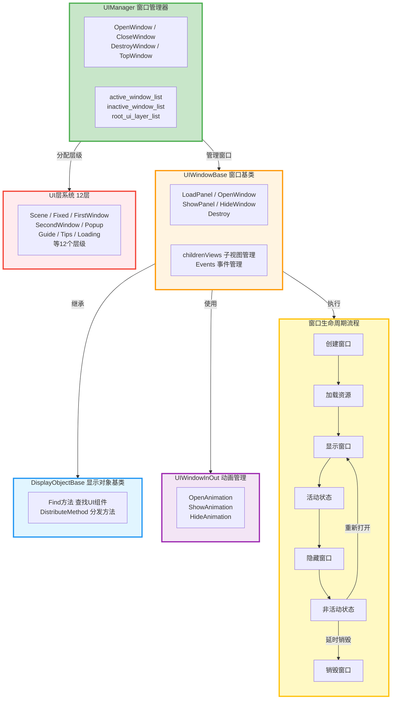
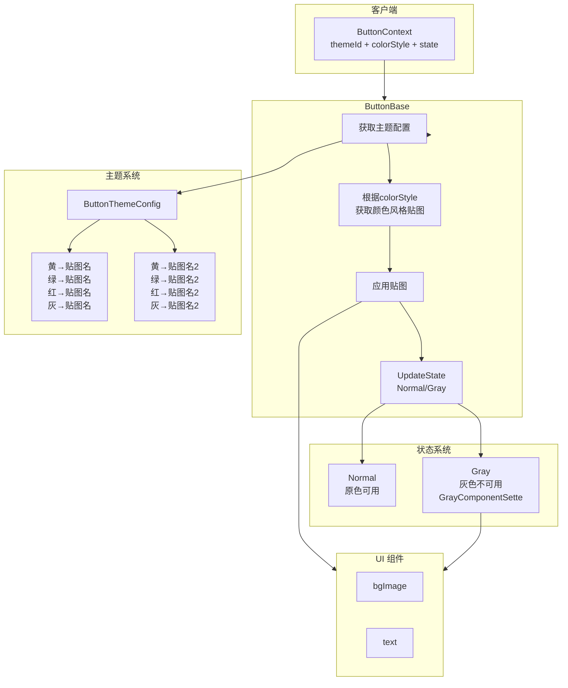
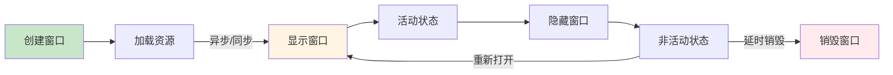

# UI 系统架构设计

## 窗口管理系统架构

---

## 按钮设计架构图

### 核心设计说明

**主题系统**：定义颜色风格贴图映射（黄/绿/红/灰 → 贴图名），通过 `themeId` 选择主题，通过 `colorStyle` 选择颜色风格。

**状态系统**：控制按钮可用性（Normal=原色可用，Gray=灰色不可用），独立于主题系统。

**ButtonBase**：统一基类，根据主题配置应用贴图，根据状态控制可用性。

---

## 窗口管理系统设计

### 核心组件

**UIManager**：窗口管理器，统一管理所有窗口的打开、关闭、销毁。
- **窗口列表管理**：`active_window_list`（活动窗口）、`inactive_window_list`（非活动窗口）
- **UI 层管理**：12 个 UI 层（Scene、Fixed、FirstWindow、SecondWindow、Popup、Guide 等）
- **自动销毁机制**：定时检查非活动窗口，延时销毁
- **场景状态管理**：检查是否回到主场景/主界面/主视图

**UIWindowBase**：所有 Panel 的基类，继承自 `DisplayObjectBase`。
- **生命周期管理**：LoadPanel → OpenWindow → ShowPanel → HideWindow → Destroy
- **异步加载支持**：支持异步加载窗口资源
- **背景模式**：None（无背景）、Black（黑色背景）、Blur（模糊背景）
- **窗口属性**：panelLayer（所属层）、panelBgMode（背景模式）、delayDestroyTime（延时销毁时间）

**DisplayObjectBase**：显示对象基类，提供 UI 组件查找方法。
- **Find 方法**：FindGameObject、FindImage、FindText、FindButton 等
- **组件查找**：封装 Unity UI 组件查找逻辑

**UIWindowInOut**：窗口动画管理。
- **打开动画**：OpenAnimation、ShowAnimation
- **关闭动画**：HideAnimation、CloseWindow
- **背景动画**：支持黑色背景和模糊背景动画

### UI 层系统

12 个 UI 层，按优先级从低到高：
1. **Scene**：场景层
2. **Fixed**：主界面固定 UI 层
3. **SceneWindow**：场景窗口层
4. **FirstWindow**：一级窗口层
5. **SecondWindow**：二级窗口层
6. **InterLayer**：中间层
7. **Popup**：弹窗层
8. **Guide**：引导层
9. **SceneLoad**：场景加载层
10. **Special**：特殊层
11. **Tips**：提示层
12. **Loading**：加载层

### 窗口生命周期

### 窗口缓存机制

- **活动窗口**：`active_window_list`，正在显示的窗口
- **非活动窗口**：`inactive_window_list`，已关闭但未销毁的窗口
- **自动销毁**：非活动窗口在 `delayDestroyTime` 秒后自动销毁
- **永久存在**：`permanenceExist = true` 的窗口永不销毁

### 窗口状态管理

- **isLoading**：是否正在加载资源
- **isActive**：是否处于激活状态（从开始加载到 HidePanel）
- **isShow**：是否在显示中（从 OpenWindow 到 HidePanel）
- **isDestroy**：是否已被销毁

### 场景状态检查

- **IsExceedScene**：检查是否可以看到场景
- **IsExceedMainUI**：检查是否可以看到主界面
- **IsExceedMainView**：检查是否在主视图（没有任何窗口遮挡）

### 核心设计特点

**分层管理**：12 个 UI 层，不同窗口放在不同层，自动管理层级关系。

**窗口缓存**：关闭的窗口不立即销毁，放入非活动列表，支持快速重新打开。

**自动销毁**：定时检查非活动窗口，延时自动销毁，平衡内存和性能。

**场景感知**：自动检测场景状态，管理主场景/主界面/主视图的显示。

**异步加载**：支持异步加载窗口资源，避免阻塞主线程。

**动画系统**：集成 DOTween 动画，支持打开/关闭动画和背景动画。

**子视图管理**：通过 `childrenViews` 列表统一管理子视图，使用 `DistributeMethod` 自动分发生命周期方法（OnInitPanel、OnShowPanel、OnHidePanel、OnDestroy 等），简化子视图管理。

**事件管理**：区分永久事件（PermanentRegisterEvent）和临时事件（RegisterEvent），永久事件在窗口销毁前一直有效，临时事件在每次打开时注册、关闭时注销。

**窗口层级管理**：自动管理同层窗口的激活/反激活，打开新窗口时自动反激活同层其他窗口（_Deactive），关闭时自动激活下层窗口（_Active）。
