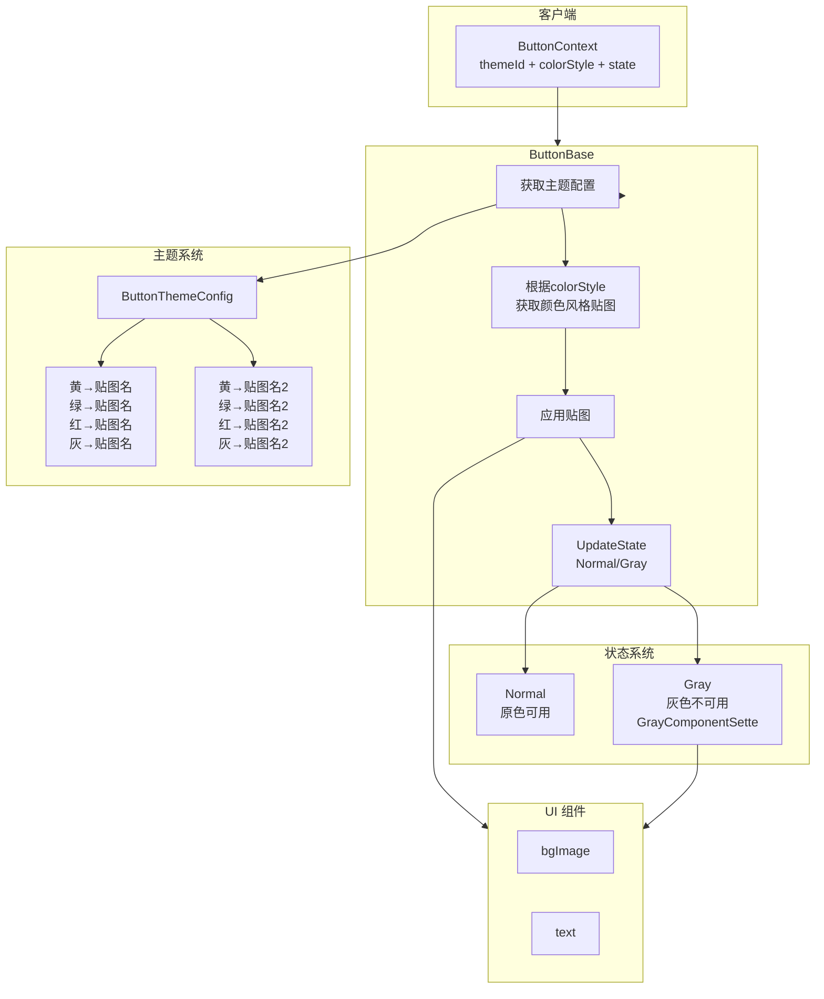

# UI 系统架构设计

## 按钮设计架构图

### 核心设计说明

**主题系统**：定义颜色风格贴图映射（黄/绿/红/灰 → 贴图名），通过 `themeId` 选择主题，通过 `colorStyle` 选择颜色风格。

**状态系统**：控制按钮可用性（Normal=原色可用，Gray=灰色不可用），独立于主题系统。

**ButtonBase**：统一基类，根据主题配置应用贴图，根据状态控制可用性。

