# Unit 角色数据系统架构设计

## 设计目标

设计一套完整的角色数据管理系统，支持多子系统协同（装备、技能、状态、专长等），实现实时属性计算、模块间解耦通信、C#-Lua生命周期同步，提供数据驱动的配置化角色管理系统。

---

## 核心设计理念

### 1. 实时获取为核心

**本质**：角色数据系统的核心是实时获取各子系统数据
- 属性计算 = 实时遍历所有子系统收集数据
- 数据一致性 = 每次获取都是最新数据，无需等待更新
- 零dirty标记 = 不依赖dirty标记机制，避免数据同步问题
- 按需计算 = 只计算需要的属性，避免不必要的全量更新

### 2. 数据驱动架构

**本质**：角色特性通过配置数据实现，无需修改代码
- 装备、技能、状态、专长 → 通过配置数据定义
- 属性加成、效果叠加 → 通过配置数据调整
- 新增子系统 → 扩展配置数据即可
- 属性平衡 → 调整配置数值即可

### 3. 分层架构 + 队列解耦

**本质**：分层架构实现职责分离，队列解耦实现模块独立
- 四层架构：基础层、管理层、计算层、通信层
- 队列通信：DataHandleQueue实现模块间解耦
- 组合模式：UnitData组合多个子系统
- 统一接口：所有子系统通过标准接口提供属性

---

## 整体架构设计

### 四层架构 + DataHandleQueue

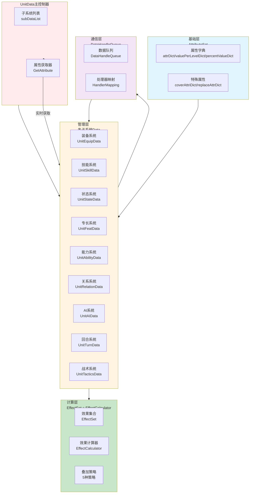

### 实时获取数据流

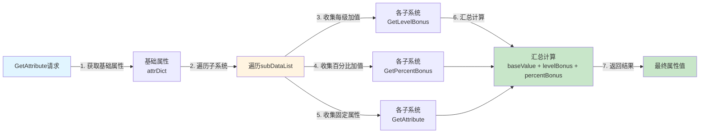

**数据流特性**：
- ✅ **实时获取**：每次获取属性时都实时收集各子系统最新数据
- ✅ **逐步汇总**：基础属性 → 每级加值 → 百分比加值 → 固定属性值
- ✅ **按需计算**：只计算需要的属性，其他属性不会被计算
- ✅ **数据一致性**：不依赖dirty标记，数据始终最新
- ✅ **子系统独立性**：每个子系统独立管理自己的数据
- ✅ **解耦设计**：通过DataHandleQueue实现模块间解耦

---

## 基础层架构设计

### 核心职责
三层属性结构 + 特殊属性处理 + 基础数据管理

### 架构图

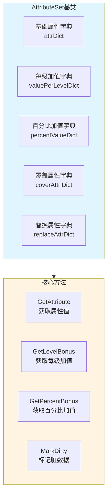

### 三层属性结构

**1. 基础属性值（attrDict）**
```lua
-- 基础属性值（来自配置、等级等）
self.attrDict = {
    [EAttribute.STRENGTH] = 16,
    [EAttribute.DEXTERITY] = 14,
    [EAttribute.CONSTITUTION] = 12
}
```

**2. 每级加值（valuePerLevelDict）**
```lua
-- 每级加值（来自装备、专长等）
self.valuePerLevelDict = {
    [EAttribute.STRENGTH] = 2,    -- 每级+2力量
    [EAttribute.DEXTERITY] = 1    -- 每级+1敏捷
}
```

**3. 百分比加值（percentValueDict）**
```lua
-- 百分比加值（来自法术、状态等）
self.percentValueDict = {
    [EAttribute.STRENGTH] = 0.2,  -- 力量+20%
    [EAttribute.CONSTITUTION] = 0.1 -- 体质+10%
}
```

### 特殊属性处理

**覆盖属性（coverAttriDict）**：
- 直接覆盖基础属性值
- 优先级最高

**替换属性（replaceAttrDict）**：
- 替换整个属性计算流程
- 用于特殊效果

---

## 管理层架构设计

### 核心职责
子系统数据管理 + 属性提供接口 + 数据变化通知

### 架构图

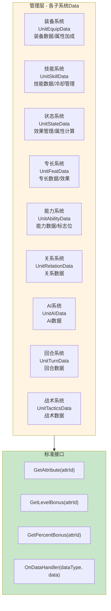

### 子系统职责详解

**1. UnitEquipData - 装备系统**
- **职责**：管理装备数据、快捷栏道具、装备属性计算
- **核心功能**：
  - 装备部位管理（`equipPartDict`）
  - 快捷栏道具管理（`quickSlotDict`）
  - 装备安装/卸载逻辑
  - 装备属性加成计算
  - 装备技能数据管理

**2. UnitSkillData - 技能系统**
- **职责**：管理角色技能、技能等级、冷却时间
- **核心功能**：
  - 自身技能管理（`baseSkills`）
  - 附加技能管理（`additionalSkills`）
  - 技能冷却管理（`skillCooldowns`）
  - 技能槽位管理（`skillSlots`）

**3. UnitStateData - 状态/效果系统**
- **职责**：统一管理所有效果，计算最终属性
- **核心功能**：
  - 使用EffectSet管理所有效果
  - 属性加成计算
  - 每级加值和百分比加值管理
  - 最终属性计算统一入口

**4. UnitFeatData - 专长系统**
- **职责**：管理角色专长数据和效果

**5. UnitAbilityData - 能力系统**
- **职责**：管理角色能力数据和标志位

**6. UnitRelationData - 关系系统**
- **职责**：管理角色关系数据

**7. UnitAIData - AI系统**
- **职责**：管理AI数据

**8. UnitTurnData - 回合系统**
- **职责**：管理回合数据

**9. UnitTacticsData - 战术系统**
- **职责**：管理战术数据

---

## 计算层架构设计

### 核心职责
效果集合管理 + 效果计算 + 叠加策略

### 架构图

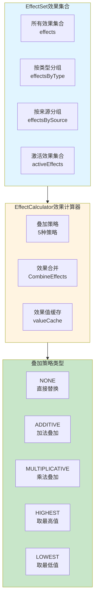

### 效果叠加策略

**5种叠加策略**：

| 策略 | 说明 | 公式 | 适用场景 |
|---|---|---|---|
| **NONE** | 直接替换 | `newValue` | 状态效果、覆盖属性 |
| **ADDITIVE** | 加法叠加 | `oldValue + newValue` | 属性加成、伤害加成 |
| **MULTIPLICATIVE** | 乘法叠加 | `oldValue * newValue` | 百分比加成、倍率效果 |
| **HIGHEST** | 取最高值 | `max(oldValue, newValue)` | 护甲等级、抗性上限 |
| **LOWEST** | 取最低值 | `min(oldValue, newValue)` | 负面效果、限制值 |

---

## 通信层架构设计

### 核心职责
模块间解耦通信 + 数据变化通知 + 批量处理

### 架构图

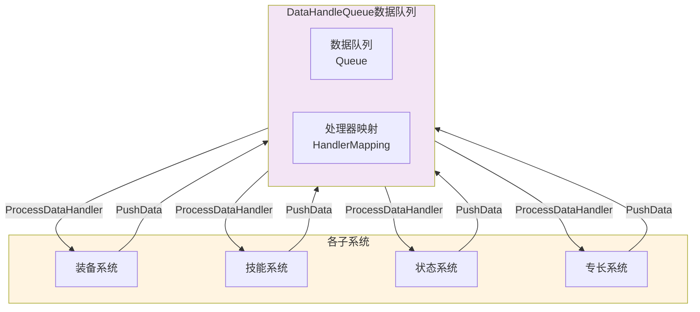

### 数据变化触发流程

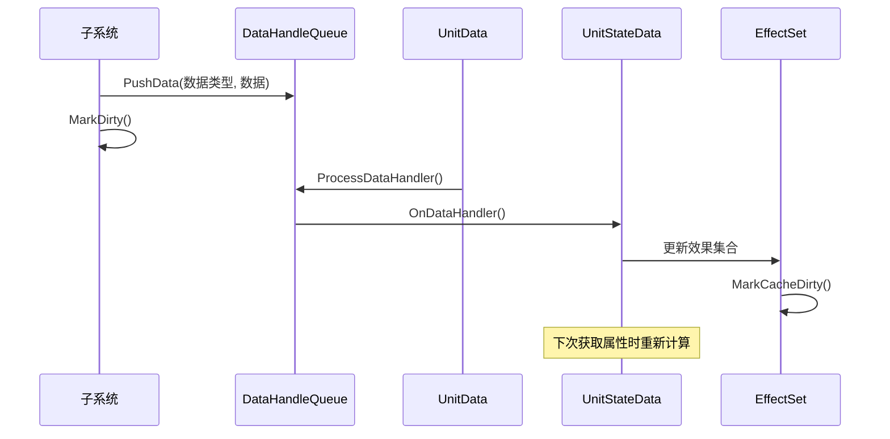

### 数据流架构

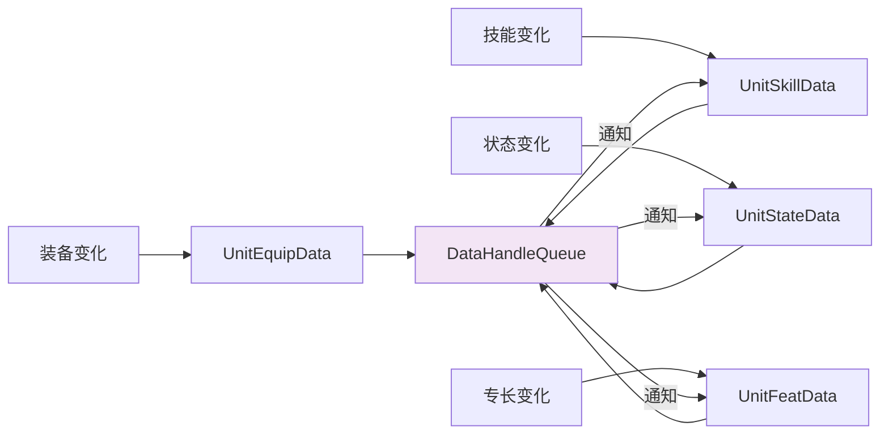

---

## 属性计算流程设计

### 核心职责
实时获取各子系统数据 + 汇总计算最终属性

### 工作流程

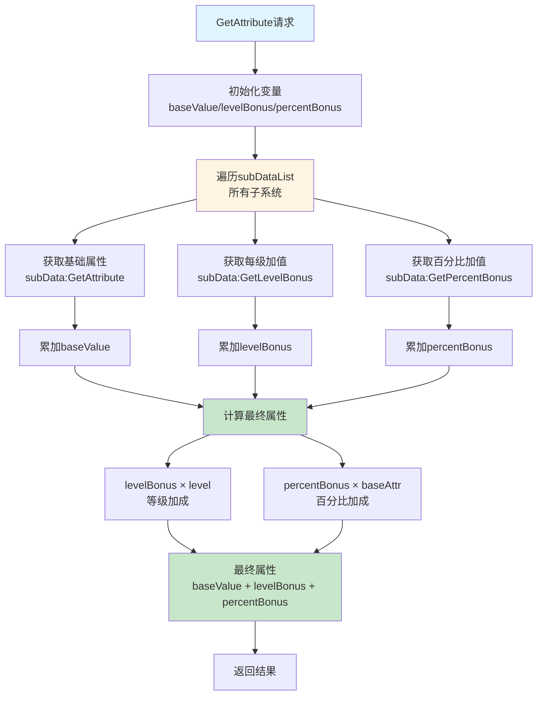

### 属性计算公式

**实时获取公式**：
```lua
-- 新的GetAttribute实现：实时获取各子系统数据
function UnitData:GetAttribute(attrId)
    local baseValue = self.attrDict[attrId] or 0
    local levelBonus = 0
    local percentBonus = 0
    
    -- ✅ 实时遍历所有子系统，收集最新数据
    for key, value in pairs(self.subDataList) do
        levelBonus = levelBonus + value:GetLevelBonus(attrId)      -- 收集每级加值
        percentBonus = percentBonus + value:GetPercentBonus(attrId) -- 收集百分比加值
        baseValue = baseValue + value:GetAttribute(attrId)         -- 收集固定属性值
    end
    
    -- ✅ 基于最新数据计算
    levelBonus = levelBonus * self.level                           -- 等级加成
    percentBonus = percentBonus * (self.baseAttrDict[attrId] or 0) -- 百分比加成（只对基础属性生效）
    return baseValue + levelBonus + percentBonus
end
```

**计算示例**：
```
基础力量: 16
每级加值: 2
当前等级: 5
装备加成: +20%

计算过程：
1. baseValue = 16
2. levelBonus = 2 × 5 = 10
3. percentBonus = 0.2 × 16 = 3.2
4. 最终力量 = 16 + 10 + 3.2 = 29.2
```

---

## 生命周期管理架构设计

### 核心职责
C#-Lua生命周期同步 + 单位创建销毁管理

### 架构图

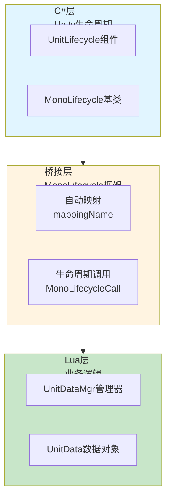

### 生命周期流程

**单位创建流程**：

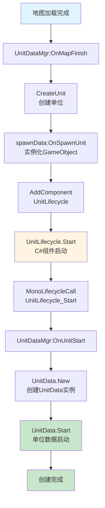

**单位销毁流程**：

```mermaid
flowchart TD
    Start[GameObject销毁] --> OnDestroy[UnitLifecycle.OnDestroy<br/>C#组件销毁]
    OnDestroy --> CallLua[MonoLifecycleCall<br/>UnitLifecycle_OnDestroy]
    CallLua --> OnUnitDestroy[UnitDataMgr:OnUnitDestroy]
    OnUnitDestroy --> DestroyLua[UnitData:OnDestroy<br/>单位数据销毁]
    DestroyLua --> Clear[清理映射<br/>unitDataMap[unitId] = nil]
    Clear --> Complete[销毁完成]
    
    style Start fill:#e1f5ff
    style OnDestroy fill:#fff4e1
    style DestroyLua fill:#c8e6c9
    style Complete fill:#c8e6c9
```

### 关键交互点

| Unity生命周期 | Lua对应函数 | 用途 |
|---|---|---|
| **Awake** | `UnitLifecycle_Awake` | 对象创建时调用 |
| **Start** | `UnitLifecycle_Start` | 对象启动时调用（主要业务逻辑入口） |
| **OnDestroy** | `UnitLifecycle_OnDestroy` | 对象销毁时调用（清理逻辑） |
| **OnEnable** | `UnitLifecycle_OnEnable` | 对象启用时调用 |
| **OnDisable** | `UnitLifecycle_OnDisable` | 对象禁用时调用 |

---

## 实时获取 vs 批量更新对比

### 设计对比

**旧设计（批量更新）的问题**：

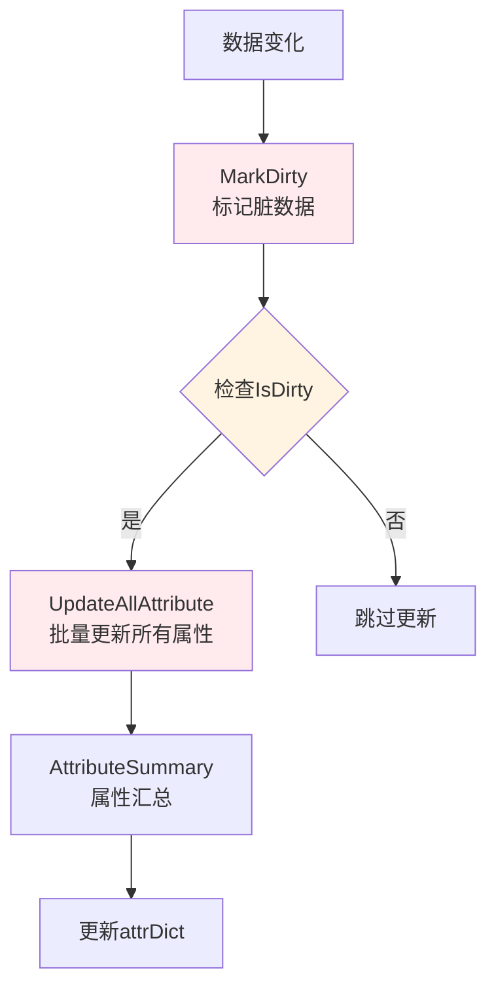

**问题**：
- ❌ 需要手动管理dirty状态
- ❌ 容易遗漏标记，数据同步复杂
- ❌ 批量更新所有属性，性能浪费
- ❌ 数据可能不同步

**新设计（实时获取）的优势**：

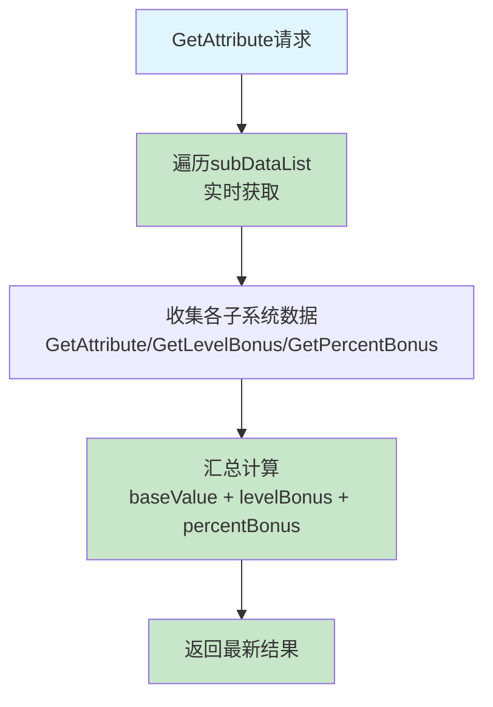

**优势**：
- ✅ 数据始终最新，无需等待更新
- ✅ 不依赖dirty标记机制，避免数据同步问题
- ✅ 按需计算，避免不必要的全量更新
- ✅ 逻辑更清晰，无需复杂的更新流程
- ✅ 新增模块自动参与计算，无需修改核心逻辑

### 性能对比

| 对比项 | 批量更新 | 实时获取 | 优势 |
|---|---|---|---|
| **数据一致性** | ⚠️ 依赖dirty标记 | ✅ 100%准确 | 实时获取 |
| **性能开销** | ⚠️ 全量更新 | ✅ 按需计算 | 实时获取 |
| **代码复杂度** | ❌ 复杂的状态管理 | ✅ 简单直接 | 实时获取 |
| **扩展性** | ⚠️ 需要修改更新逻辑 | ✅ 自动参与计算 | 实时获取 |
| **维护性** | ❌ 容易遗漏标记 | ✅ 无需状态管理 | 实时获取 |

---

## 架构验证

### 流程合理性验证

从架构可验证：
- ✅ **数据流完整**：数据变化 → DataHandleQueue → 子系统处理 → 属性计算（完整流程）
- ✅ **职责清晰**：基础层、管理层、计算层、通信层职责明确，无重叠
- ✅ **解耦设计**：通过DataHandleQueue实现模块间解耦
- ✅ **实时性保证**：实时获取确保数据始终最新

### 数据一致性验证

从架构可验证：
- ✅ **实时获取机制**：每次获取属性时都实时收集各子系统最新数据
- ✅ **零dirty标记**：不依赖dirty标记机制，避免数据同步问题
- ✅ **按需计算**：只计算需要的属性，避免不必要的全量更新
- ✅ **自动扩展**：新增模块自动参与计算，无需修改核心逻辑

### 扩展性验证

从架构可验证：
- ✅ **分层架构**：清晰的层次结构，易于扩展
- ✅ **标准接口**：所有子系统通过标准接口提供属性
- ✅ **队列解耦**：通过DataHandleQueue实现模块独立
- ✅ **组合模式**：UnitData组合多个子系统，易于添加新系统

### 性能验证

从架构可验证：
- ✅ **按需计算**：只计算需要的属性，避免全量更新
- ✅ **缓存机制**：EffectSet缓存计算结果
- ✅ **批量处理**：DataHandleQueue批量处理数据变化
- ✅ **对象池**：使用对象池减少内存分配

---

## 总结

### 架构设计价值

该架构设计文档的价值在于：
- ✅ **思路解构**：完整解构角色数据系统的搭建思路
- ✅ **流程验证**：从架构层面验证流程合理性
- ✅ **创新验证**：验证实时获取机制的优势
- ✅ **开发指导**：为后续详细设计和实现提供清晰指导

### 设计原则

- ✅ **实时获取为核心**：角色数据系统的核心是实时获取各子系统数据
- ✅ **数据驱动架构**：角色特性通过配置数据实现，无需修改代码
- ✅ **分层架构 + 队列解耦**：分层架构实现职责分离，队列解耦实现模块独立
- ✅ **零dirty标记**：不依赖dirty标记机制，确保数据一致性

### 架构特点

- ✅ **四层架构**：基础层、管理层、计算层、通信层清晰分离
- ✅ **实时获取**：每次获取属性都是最新数据，无需等待更新
- ✅ **按需计算**：只计算需要的属性，避免不必要的全量更新
- ✅ **队列解耦**：通过DataHandleQueue实现模块间解耦

### 核心创新

Unit系统采用了优秀的分层架构设计，**核心创新在于属性计算方式**：

- **基础层** - AttributeSet提供三层属性结构和基础数据管理
- **管理层** - 各子系统独立管理自己的数据，通过标准接口提供属性
- **计算层** - **实时获取各子系统数据，而非批量更新**，确保数据一致性
- **通信层** - DataHandleQueue实现模块间解耦通信

**新设计的核心优势**：
- ✅ **实时性** - 每次获取属性都是最新数据，无需等待更新
- ✅ **可靠性** - 不依赖dirty标记机制，避免数据同步问题
- ✅ **简单性** - 无需复杂的更新流程，逻辑更清晰
- ✅ **性能** - 按需计算，避免不必要的全量更新
- ✅ **维护性** - 新增模块自动参与计算，无需修改核心逻辑

细节实现是后续开发阶段的工作，当前架构设计已足够指导整个角色数据系统的开发。
