# Visual 系统架构设计

## 设计目标

设计一套完整的视觉表现框架架构，支持多种视觉类型（动画、特效、后处理、相机控制等），实现对象池管理、序列编排、工厂模式、Context 模式，提供统一接口、高性能、易扩展的视觉表现系统。

---

## 核心设计理念

### 1. 对象池 + 零 GC 设计为核心

**本质**：Visual 系统的核心是对象池管理和零 GC 压力
- 对象池管理 = 所有 Visual 对象通过对象池复用，避免频繁创建销毁
- 零 GC 压力 = 对象复用，不产生临时对象，减少内存分配
- 自动管理 = 系统自动处理对象池生命周期，无需手动管理
- 高性能 = 避免频繁的内存分配和回收，提升运行效率

### 2. Context 模式统一接口

**本质**：所有 Visual 创建使用统一的 Context 参数，接口稳定，参数灵活扩展
- 接口稳定 = 新增字段不破坏现有接口
- 参数灵活 = 支持任意扩展字段，无需修改函数签名
- 语义清晰 = 自解释的参数命名，易于理解和使用
- 向后兼容 = 新增字段不影响旧代码，保持兼容性

### 3. 序列编排 + 时间轴控制

**本质**：通过 VisualSequence 实现复杂的时间轴编排，支持顺序、并行、延迟、回调
- 复杂编排 = 支持任意复杂的时间轴组合
- 链式调用 = 流畅的 API 设计，易于使用
- 完整控制 = 播放、暂停、恢复、停止、跳转等完整控制
- 自动回收 = 序列完成后自动回收到对象池

### 4. 工厂模式 + 动态注册

**本质**：通过工厂模式统一创建 Visual 对象，支持动态注册新的 Visual 类型
- 统一创建 = 所有 Visual 通过统一接口创建
- 易于扩展 = 新增 Visual 类型只需注册，无需修改核心代码
- 类型安全 = 编译时检查继承关系，运行时类型验证

---

## 整体架构设计

### 四层架构 + 对象池管理

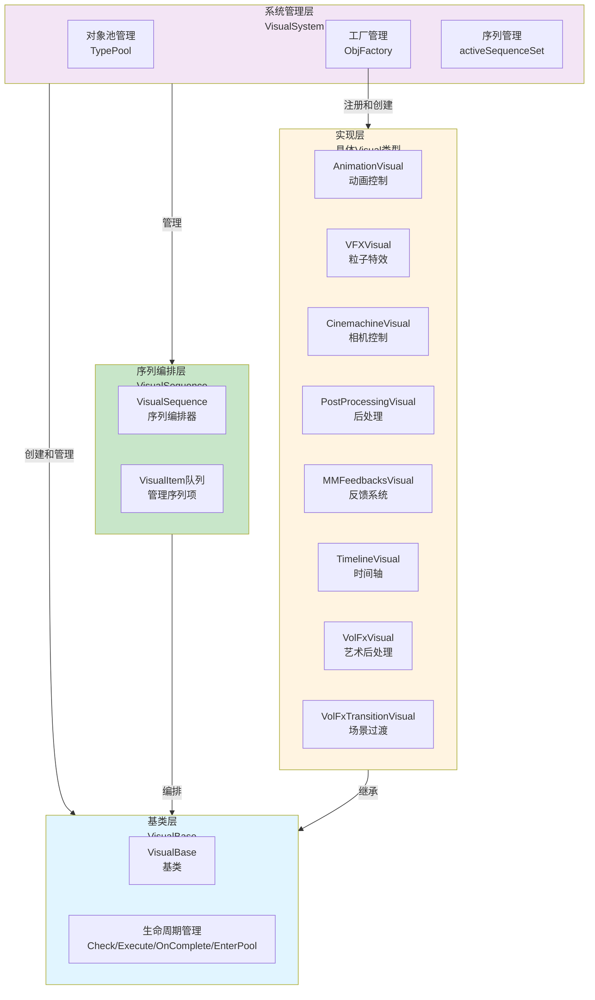

### 对象池数据流

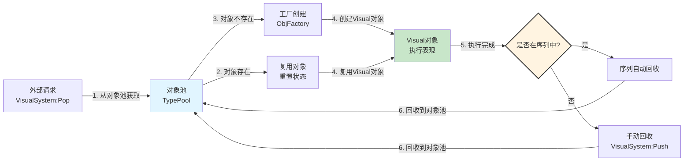

**数据流特性**：
- ✅ **对象池优先**：所有 Visual 对象从对象池获取，优先复用
- ✅ **自动管理**：序列中的 Visual 自动回收，单独使用需手动回收
- ✅ **零 GC 压力**：对象复用，不产生临时对象
- ✅ **工厂创建**：对象池为空时，通过工厂创建新对象
- ✅ **生命周期完整**：创建、执行、完成、回收全流程管理

---

## 详细层级设计

### 系统管理层架构设计

#### 核心职责
对象池管理 + 工厂管理 + 序列管理

#### 架构图

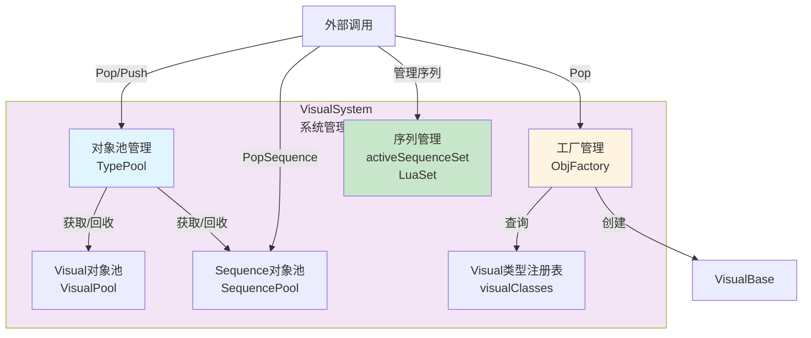

#### 工作流程

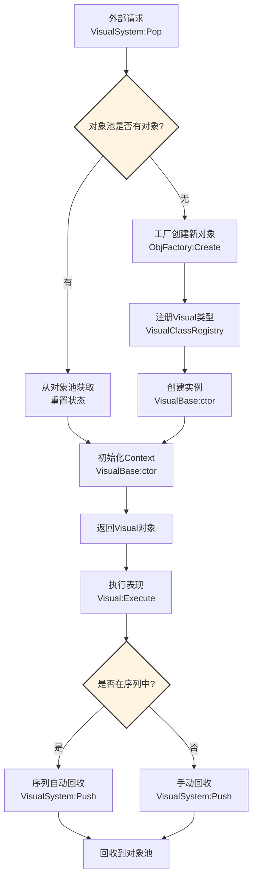

#### 核心组件

1. **对象池管理（TypePool）**
   - 管理 Visual 对象池和 Sequence 对象池
   - 提供 Pop/Push 接口，自动处理对象复用
   - 支持对象重置和清理

2. **工厂管理（ObjFactory）**
   - 维护 Visual 类型注册表
   - 根据 visualType 创建对应的 Visual 对象
   - 支持动态注册新的 Visual 类型

3. **序列管理（activeSequenceSet）**
   - 管理所有活跃的序列对象
   - 跟踪序列生命周期
   - 支持序列自动回收

---

### 基类层架构设计

#### 核心职责
统一接口 + 生命周期管理 + Context 模式

#### 架构图

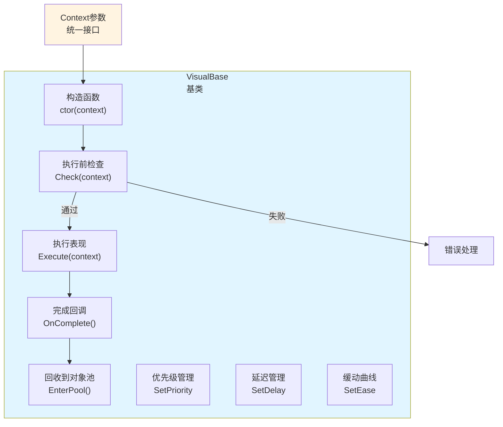

#### 生命周期流程

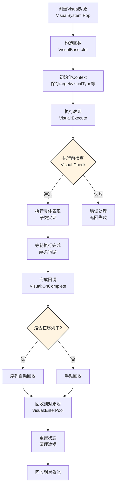

#### 核心组件

1. **构造函数（ctor）**
   - 使用 Context 模式初始化
   - 保存 target、visualType 等基础参数
   - 子类可重写进行自定义初始化

2. **执行前检查（Check）**
   - 验证 Context 参数有效性
   - 检查目标对象是否存在
   - 子类可重写添加自定义检查

3. **执行表现（Execute）**
   - 子类必须实现
   - 执行具体的视觉表现逻辑
   - 支持异步和同步执行

4. **完成回调（OnComplete）**
   - 表现完成时自动调用
   - 子类可重写进行自定义处理
   - 触发自动回收流程

5. **回收到对象池（EnterPool）**
   - 清理对象状态
   - 重置所有字段
   - 准备下次复用

---

### 实现层架构设计

#### 核心职责
具体视觉表现实现 + 类型特定逻辑

#### 架构图

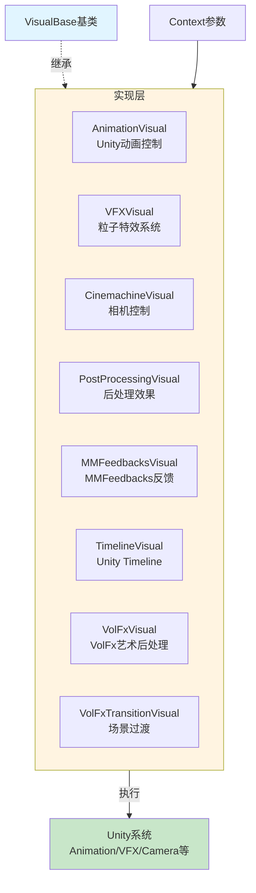

#### 工作流程

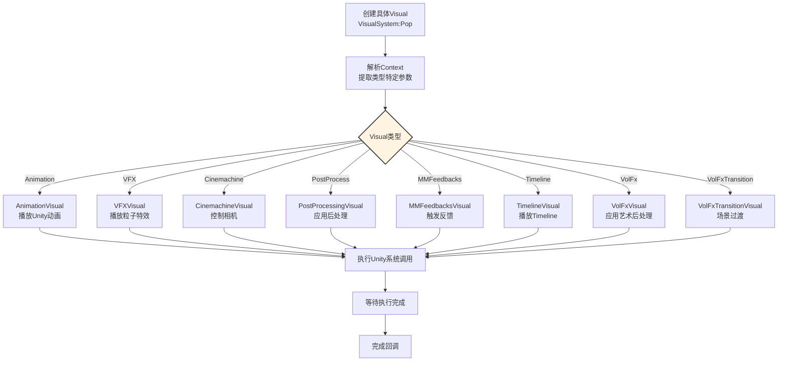

#### 支持的 Visual 类型

| 类型 | 枚举值 | 说明 | 文件 |
|-----|------|------|------|
| **Animation** | `EVisual.Animation` | Unity 动画控制 | `Visuals/AnimationVisual.lua` |
| **VFX** | `EVisual.VFX` | 粒子特效系统 | `Visuals/VFXVisual.lua` |
| **Cinemachine** | `EVisual.Cinemachine` | 相机控制 | `Visuals/CinemachineVisual.lua` |
| **PostProcessing** | `EVisual.PostProcess` | 后处理效果 | `Visuals/PostProcessingVisual.lua` |
| **MMFeedbacks** | `EVisual.MMFeedbacks` | MMFeedbacks 反馈系统 | `MMFeedbacks/MMFeedbacksVisual.lua` |
| **Timeline** | `EVisual.Timeline` | Unity Timeline 时间轴系统（模板驱动，支持动态创建） | `Timeline/TimelineVisual.lua` |
| **VolFx** | `EVisual.VolFx` | VolFx 艺术后处理效果 | `VolFx/VolFxVisual.lua` |
| **VolFxTransition** | `EVisual.VolFxTransition` | VolFx 场景过渡效果 | `VolFx/VolFxTransitionVisual.lua` |

---

### 序列编排层架构设计

#### 核心职责
时间轴编排 + 顺序/并行控制 + 延迟/回调管理

#### 架构图

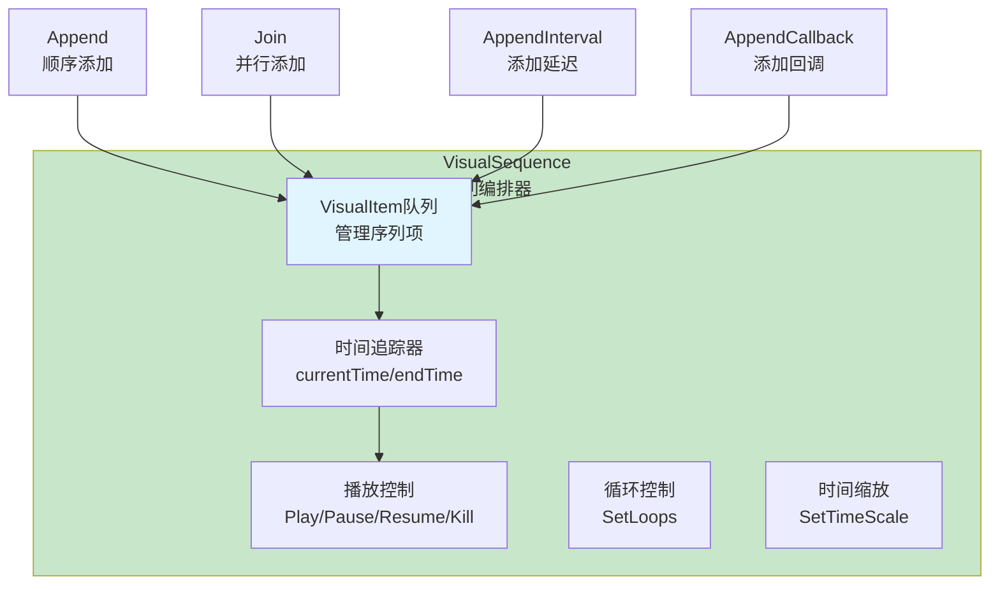

#### 工作流程

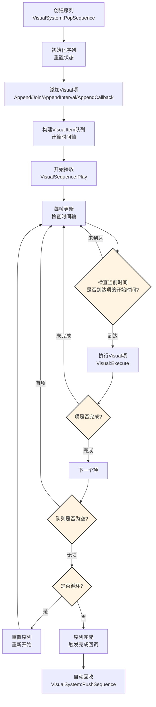

#### 编排模式

**1. 顺序执行**

```mermaid
gantt
    title 顺序执行时间轴
    dateFormat X
    axisFormat %Ls
    
    Visual1 :0, 1000
    Visual2 :1000, 1000
    Visual3 :2000, 1000
```

**2. 并行执行**

```mermaid
gantt
    title 并行执行时间轴
    dateFormat X
    axisFormat %Ls
    
    Visual1 :0, 1000
    Visual2 :500, 1000
    Visual3 :1000, 1000
```

**3. 混合编排**

```mermaid
gantt
    title 混合编排时间轴
    dateFormat X
    axisFormat %Ls
    
    Visual1 :0, 1000
    Visual2 :1000, 500
    Visual3 :1500, 500
    Visual4 :1500, 500
    Delay :2000, 500
    Visual5 :2500, 1000
    Callback :3500, 0
```

#### 核心组件

1. **VisualItem 队列**
   - 管理序列中的所有项（Visual、延迟、回调）
   - 按时间轴排序，支持顺序和并行
   - 跟踪每个项的执行状态

2. **时间追踪器**
   - 维护当前播放时间（currentTime）
   - 计算序列结束时间（endTime）
   - 支持时间缩放（timeScale）

3. **播放控制**
   - Play：开始播放序列
   - Pause：暂停播放
   - Resume：恢复播放
   - Kill：停止并清理序列
   - SeekTo：跳转到指定时间

4. **循环控制**
   - 支持设置循环次数
   - 支持无限循环
   - 循环完成后触发完成回调

---

## 架构模式分析

### 1. 对象池模式

**应用场景**：所有 Visual 对象和 Sequence 对象

**设计优势**：
- ✅ **零 GC 压力**：对象复用，不产生临时对象
- ✅ **高性能**：避免频繁的内存分配和回收
- ✅ **自动管理**：系统自动处理对象池生命周期

**实现方式**：
- 使用 TypePool 管理对象池
- Pop 时从对象池获取，Push 时回收到对象池
- 对象重置和清理在 EnterPool 中完成

### 2. Context 模式

**应用场景**：所有 Visual 创建接口

**设计优势**：
- ✅ **接口稳定**：新增字段不破坏现有接口
- ✅ **参数灵活**：支持任意扩展字段
- ✅ **语义清晰**：自解释的参数命名
- ✅ **向后兼容**：新增字段不影响旧代码

**实现方式**：
- 所有 Visual 创建使用统一的 Context 参数
- Context 包含必需字段（target、visualType）和可选字段
- 子类可扩展 Context 添加类型特定参数

### 3. 工厂模式

**应用场景**：Visual 对象创建

**设计优势**：
- ✅ **统一创建**：所有 Visual 通过统一接口创建
- ✅ **易于扩展**：新增 Visual 类型只需注册
- ✅ **类型安全**：编译时检查继承关系

**实现方式**：
- 使用 ObjFactory 管理 Visual 类型注册表
- 根据 visualType 创建对应的 Visual 对象
- 支持动态注册新的 Visual 类型

### 4. 模板方法模式

**应用场景**：VisualBase 生命周期管理

**设计优势**：
- ✅ **统一流程**：所有 Visual 遵循相同的生命周期
- ✅ **灵活扩展**：子类可重写特定方法
- ✅ **代码复用**：基类提供通用逻辑

**实现方式**：
- VisualBase 定义生命周期模板方法
- 子类重写 Execute、Check 等特定方法
- 基类控制整体流程

### 5. 策略模式

**应用场景**：不同 Visual 类型的执行策略

**设计优势**：
- ✅ **类型隔离**：每种 Visual 类型独立实现
- ✅ **易于扩展**：新增类型不影响现有类型
- ✅ **统一接口**：所有类型使用相同的接口

**实现方式**：
- 每种 Visual 类型实现独立的执行逻辑
- 通过工厂模式创建不同类型的实例
- 统一通过 VisualBase 接口调用

---

## 数据流设计

### Context 数据流

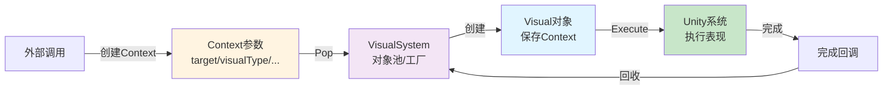

### 序列编排数据流

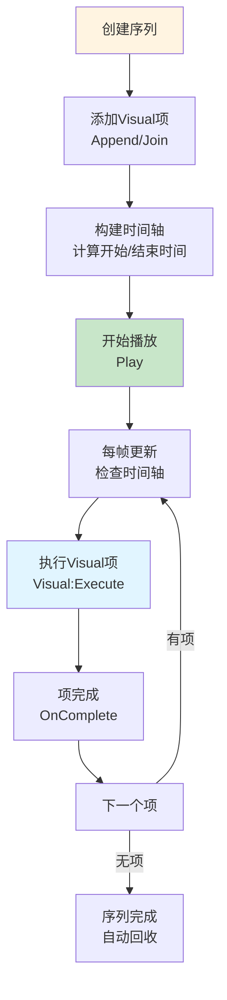

### 对象池数据流

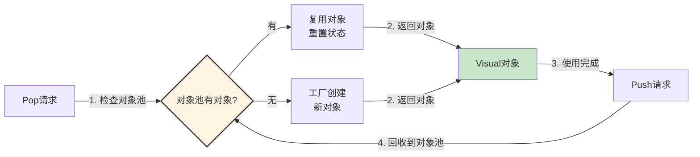

---

## 架构验证

### 性能验证

从架构可验证：
- ✅ **零 GC 压力**：对象池管理，对象复用，不产生临时对象
- ✅ **高性能**：避免频繁的内存分配和回收，提升运行效率
- ✅ **自动管理**：系统自动处理对象池生命周期，无需手动管理

### 扩展性验证

从架构可验证：
- ✅ **易于扩展**：新增 Visual 类型只需继承 VisualBase 并注册
- ✅ **接口稳定**：Context 模式保证接口稳定，新增字段不影响现有代码
- ✅ **类型安全**：工厂模式保证类型安全，编译时检查继承关系

### 易用性验证

从架构可验证：
- ✅ **统一接口**：所有 Visual 使用相同的创建和执行接口
- ✅ **链式调用**：序列编排支持链式调用，API 流畅易用
- ✅ **自动回收**：序列中的 Visual 自动回收，简化使用流程

### 完整性验证

从架构可验证：
- ✅ **四层架构**：系统层、基类层、实现层、序列层，覆盖全流程
- ✅ **生命周期完整**：创建、执行、完成、回收全流程管理
- ✅ **多类型支持**：8 种 Visual 类型，易于扩展
- ✅ **序列编排**：支持顺序、并行、延迟、回调的复杂时间轴

---

## 开发指导原则

### 1. Context 参数设计

**✅ 推荐**：使用 Context 模式，参数清晰明确

```lua
local context = {
    target = gameObject,
    visualType = EVisual.Animation,
    duration = 1.0,
    delay = 0.5,
    priority = EVisualPriority.High,
    values = {
        clipName = "Attack",
        speed = 1.5
    }
}
```

**❌ 不推荐**：参数过多，难以维护

```lua
-- 不推荐：参数过多
local visual = CreateVisual(gameObject, EVisual.Animation, 1.0, 0.5, EVisualPriority.High, "Attack", 1.5, ...)
```

### 2. 对象池使用

**✅ 推荐**：让系统自动管理对象池

```lua
-- 序列中自动回收
local sequence = VisualSystem:PopSequence()
sequence:Append(visual1, nil, 0, 1.0)
sequence:Append(visual2, nil, 1.0, 1.0)
sequence:Play()  -- 完成后自动回收
```

**⚠️ 注意**：单独使用时需要手动回收

```lua
local visual = VisualSystem:Pop(context)
visual:Execute(context)
-- 使用完毕后回收
VisualSystem:Push(visual)
```

### 3. 序列生命周期

**✅ 推荐**：使用自动回收

```lua
local sequence = VisualSystem:PopSequence()
sequence:SetAutoRecycle(true)  -- 默认开启
sequence:Append(...)
sequence:Play()  -- 完成后自动回收
```

**⚠️ 注意**：需要手动控制时关闭自动回收

```lua
local sequence = VisualSystem:PopSequence()
sequence:SetAutoRecycle(false)
sequence:Append(...)
sequence:Play()

-- 稍后手动回收
VisualSystem:PushSequence(sequence)
```

### 4. 错误处理

**✅ 推荐**：检查 Visual 创建是否成功

```lua
local visual = VisualSystem:Pop(context)
if not visual then
    LogError("创建 Visual 失败")
    return
end

visual:Execute(context)
```

### 5. 性能优化

**✅ 推荐**：复用 Visual 对象

```lua
-- 在序列中复用同一个 Visual
local visual = VisualSystem:Pop(context)
local sequence = VisualSystem:PopSequence()

sequence:Append(visual, nil, 0, 1.0)
sequence:Append(visual, nil, 1.0, 1.0)  -- 复用
sequence:Play()
```

**❌ 不推荐**：频繁创建销毁

```lua
-- 不推荐：每次都创建新的 Visual
for i = 1, 100 do
    local visual = VisualSystem:Pop(context)
    visual:Execute(context)
    VisualSystem:Push(visual)
end
```

---

## 高级特性

### Timeline 系统

Timeline 系统是 Visual 框架中的**模板驱动 Timeline 系统**，支持通过模板快速创建复杂的 Unity Timeline 时间轴，并支持动态创建轨道和剪辑。

**核心特性**：
- ✅ **模板驱动**：通过模板快速创建复杂 Timeline
- ✅ **配置化设计**：使用 Context 模式，参数灵活扩展
- ✅ **分层架构**：Template → ClipTemplate → TimelineAsset
- ✅ **动态创建**：运行时创建 Timeline 资源和轨道
- ✅ **8种轨道类型**：Animation、Audio、Cinemachine、Signal 等
- ✅ **10+ 模板类型**：BossEntry、CombatStart、Cutscene 等

**架构图**：

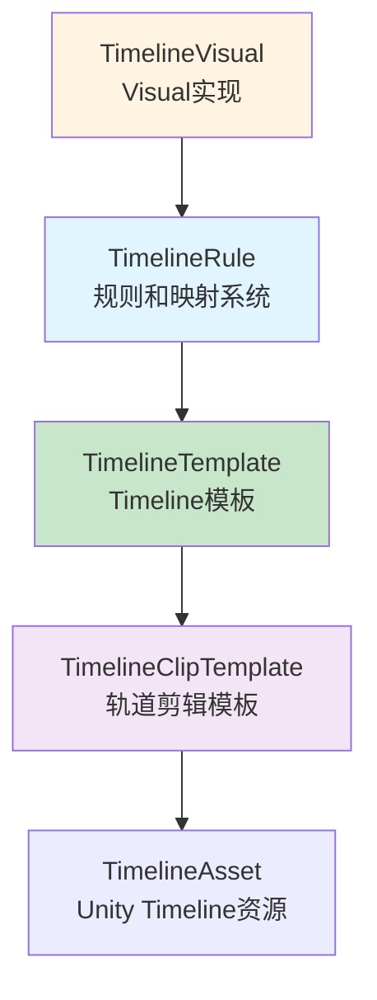

### VolFx 系统

VolFx 系统是 Visual 框架中的**艺术后处理效果系统**，基于 VolFx 插件提供丰富的后处理效果，支持动态效果管理、模板化配置和场景过渡。

**核心特性**：
- ✅ **Volume 管理**：自动管理 Volume 组件和 Profile
- ✅ **动态效果控制**：运行时激活/禁用效果
- ✅ **批量操作**：支持批量激活/禁用多个效果
- ✅ **模板系统**：快速应用预设效果组合
- ✅ **场景过渡**：支持场景切换过渡效果
- ✅ **33+ 效果类型**：Blur、Bloom、Glitch、Vhs、Watercolor 等
- ✅ **URP 集成**：完全支持 URP 渲染管线

**架构图**：

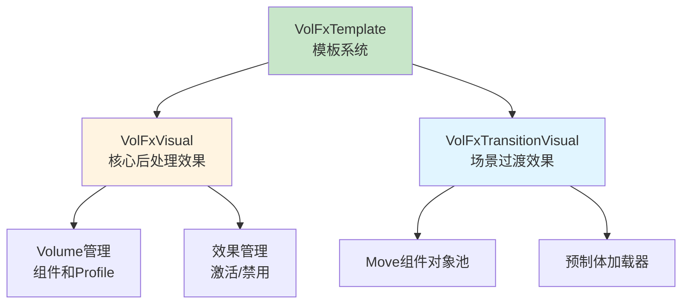

---

## 总结

### 架构设计价值

该架构设计文档的价值在于：
- ✅ **思路解构**：完整解构 Visual 系统的搭建思路
- ✅ **流程验证**：从架构层面验证流程合理性
- ✅ **性能优化**：对象池管理实现零 GC 压力和高性能
- ✅ **开发指导**：为后续详细设计和实现提供清晰指导

### 设计原则

- ✅ **对象池优先**：所有 Visual 对象通过对象池管理，零 GC 压力
- ✅ **Context 模式**：统一接口，参数灵活扩展
- ✅ **序列编排**：支持复杂时间轴，链式调用 API
- ✅ **工厂模式**：统一创建接口，支持动态注册
- ✅ **生命周期完整**：创建、执行、完成、回收全流程管理

### 架构特点

- ✅ **四层架构**：系统层、基类层、实现层、序列层，职责清晰
- ✅ **对象池管理**：零 GC 压力，高性能复用
- ✅ **统一接口**：Context 模式保证接口稳定和灵活扩展
- ✅ **序列编排**：支持顺序、并行、延迟、回调的复杂时间轴
- ✅ **易于扩展**：新增 Visual 类型只需继承并注册

细节实现是后续开发阶段的工作，当前架构设计已足够指导整个 Visual 系统的开发。
