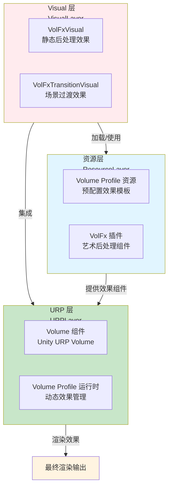
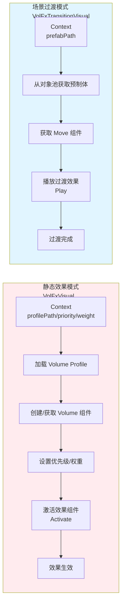
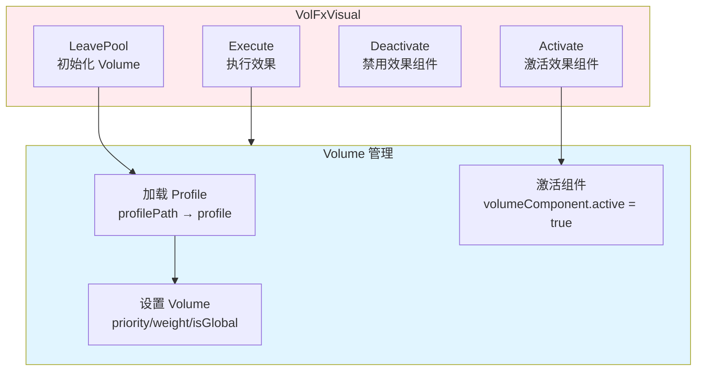
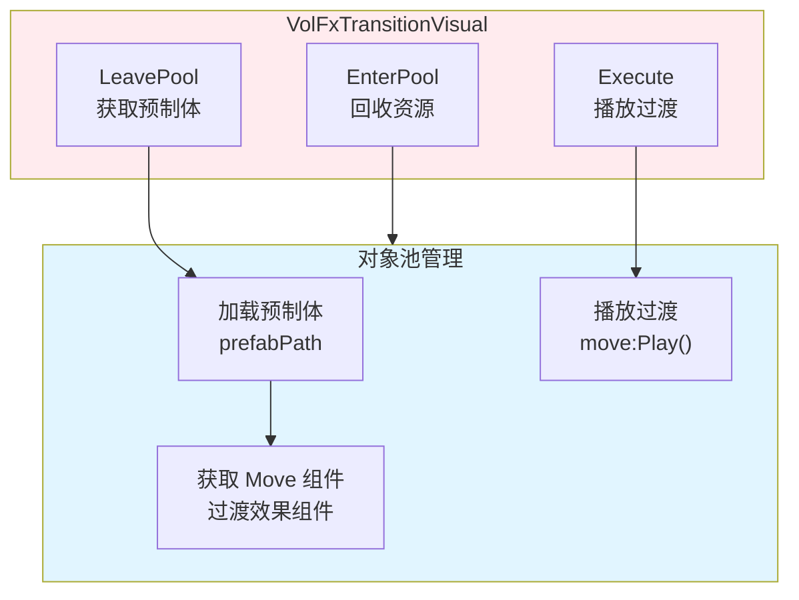
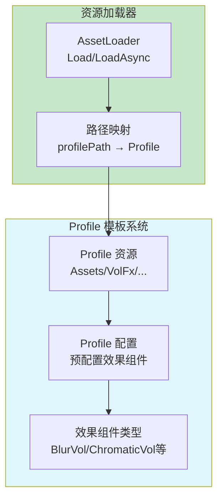
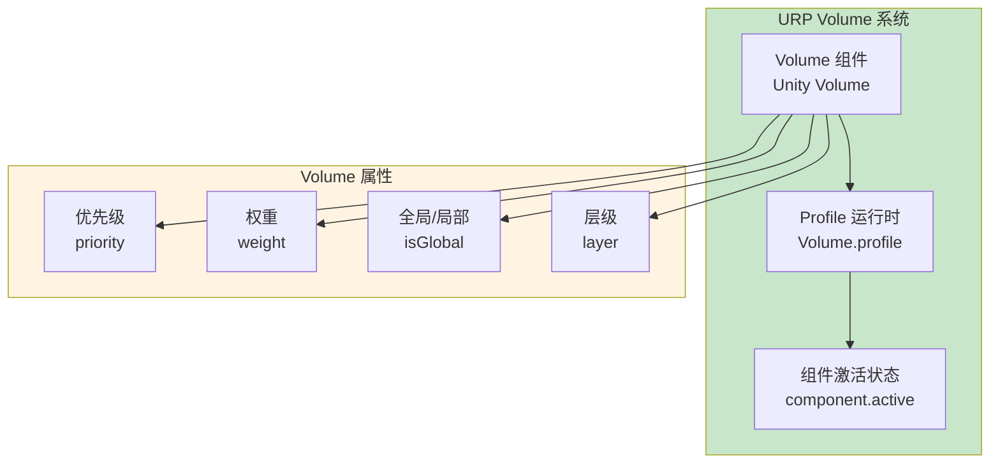
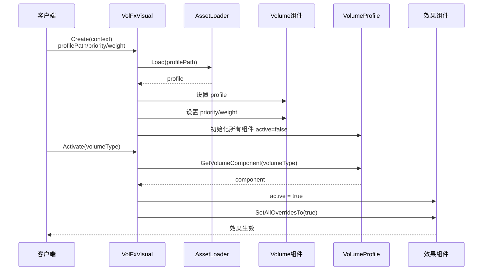
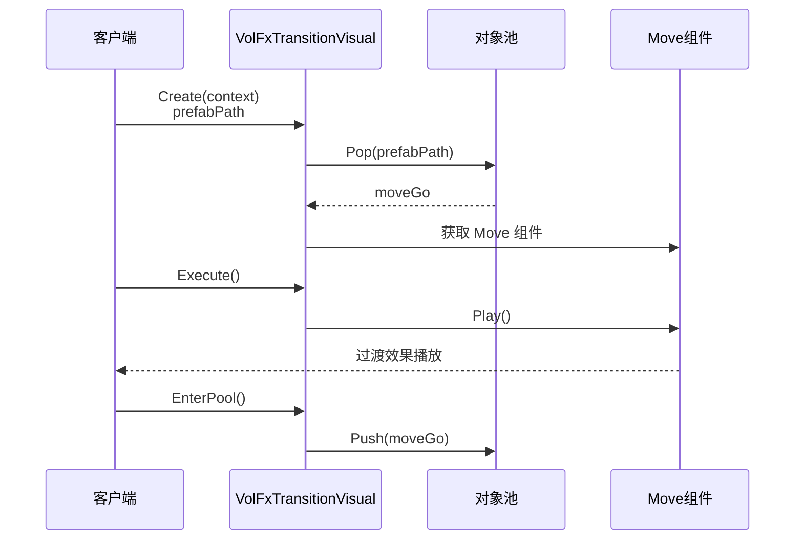
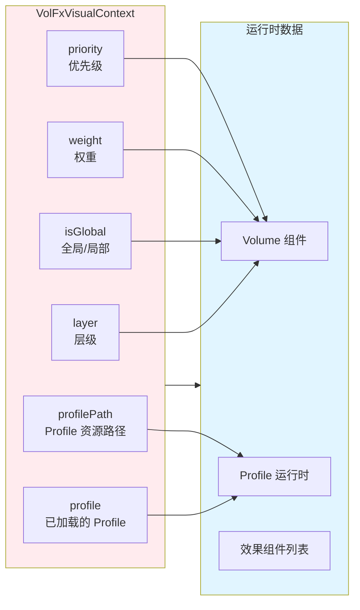

# VolFx 系统架构设计

## 设计目标

设计一套基于 VolFx 插件的艺术后处理效果系统，支持动态效果管理、模板化配置、场景过渡，提供统一接口、高性能、易扩展的后处理效果框架。

---

## 核心设计理念

### 1. Volume Profile 模板化配置为核心

**本质**：VolFx 系统的核心是 Volume Profile 的模板化配置和动态管理
- 模板配置 = 所有后处理效果通过 Volume Profile 资源预配置
- 动态激活 = 运行时动态激活/禁用 Volume Profile 中的效果组件
- 效果复用 = 同一 Profile 可配置多种效果，按需激活
- 资源管理 = Profile 资源统一管理，支持路径加载和直接传入

### 2. 双模式设计：静态效果 + 场景过渡

**本质**：系统支持两种使用模式，满足不同场景需求
- 静态效果模式 = VolFxVisual 用于场景中的静态后处理效果（如环境氛围）
- 场景过渡模式 = VolFxTransitionVisual 用于场景切换时的过渡效果（如淡入淡出）
- 模式分离 = 两种模式独立实现，互不干扰
- 统一接口 = 两种模式都继承 VisualBase，使用统一的 Context 接口

### 3. URP Volume 系统集成

**本质**：完全基于 Unity URP 的 Volume 系统，遵循 URP 规范
- Volume 组件 = 使用 Unity Volume 组件管理后处理效果
- 优先级管理 = 通过 Volume.priority 控制效果叠加顺序
- 权重控制 = 通过 Volume.weight 控制效果强度
- 全局/局部 = 支持 Global Volume 和 Local Volume（带碰撞体）

### 4. 零配置动态激活

**本质**：效果组件在 Profile 中预配置，运行时只需激活，无需重新创建
- 预配置 = 所有效果在 Volume Profile 中预先配置好
- 动态激活 = 运行时通过 Activate() 方法激活指定效果
- 批量管理 = 支持 ActivateList/DeactivateList 批量操作
- 自动管理 = 系统自动处理效果的激活状态

---

## 整体架构设计

### 三层架构 + 双模式设计



### 双模式数据流



---

## 详细层级设计

### 1. Visual 层：双模式实现

#### 1.1 VolFxVisual（静态效果模式）

**架构图**：



**工作流程**：

1. **初始化阶段**（LeavePool）：
   - 从 Context 获取 `profilePath` 或 `profile`
   - 如果只有 `profilePath`，通过 AssetLoader 加载 Volume Profile
   - 获取或创建 Volume 组件
   - 设置 Volume 的 `priority`、`weight`、`isGlobal` 属性
   - 初始化时将所有效果组件设为 `active = false`

2. **效果激活阶段**（Activate）：
   - 传入 VolFx 效果类型（如 `typeof(CS.VolFx.BlurVol)`）
   - 从 Profile 中获取或添加该效果组件
   - 设置 `active = true` 和 `SetAllOverridesTo(true)`
   - 返回效果组件供外部管理

3. **效果执行阶段**（Execute）：
   - 确保 Volume Profile 已设置到 Volume 组件
   - 返回 Volume 组件供外部管理

4. **回收阶段**（EnterPool）：
   - 清理 Volume 和 Profile 引用

**核心组件**：

- `VolFxVisual:LeavePool()` - 初始化 Volume 和 Profile
- `VolFxVisual:Activate(volumeType)` - 激活指定效果组件
- `VolFxVisual:Deactivate(volumeType)` - 禁用指定效果组件
- `VolFxVisual:ActivateList(volumeTypes)` - 批量激活效果
- `VolFxVisual:DeactivateList(volumeTypes)` - 批量禁用效果

#### 1.2 VolFxTransitionVisual（场景过渡模式）

**架构图**：



**工作流程**：

1. **初始化阶段**（LeavePool）：
   - 从 Context 获取 `prefabPath`
   - 从对象池获取预制体实例
   - 获取 Move 组件（VolFx 过渡效果组件）

2. **执行阶段**（Execute）：
   - 调用 `move:Play()` 播放过渡效果
   - 返回 Move 组件供外部管理

3. **回收阶段**（EnterPool）：
   - 将 Move GameObject 回收到对象池
   - 如果是实例化的 GameObject，自动销毁

**核心组件**：

- `VolFxTransitionVisual:LeavePool()` - 从对象池获取预制体
- `VolFxTransitionVisual:Execute()` - 播放过渡效果
- `VolFxTransitionVisual:EnterPool()` - 回收资源

### 2. 资源层：Volume Profile 模板系统

**架构图**：



**工作流程**：

1. **Profile 创建**（编辑器）：
   - 在 Unity 编辑器中创建 Volume Profile 资源
   - 预配置所有需要的后处理效果组件
   - 设置效果的默认参数

2. **Profile 加载**（运行时）：
   - 通过 `profilePath` 路径加载 Profile 资源
   - 或直接传入已加载的 `profile` 对象
   - 支持同步和异步加载

3. **效果组件管理**：
   - Profile 中包含多个效果组件（如 BlurVol、ChromaticVol 等）
   - 运行时动态激活/禁用组件
   - 组件参数可在 Profile 中预配置，也可运行时修改

**核心组件**：

- `VolumeProfile` - Unity Volume Profile 资源
- `URPUtility.GetVolumeComponent()` - 获取 Profile 中的效果组件
- `VolumeProfile.Add()` - 动态添加效果组件

### 3. URP 层：Volume 系统集成

**架构图**：



**工作流程**：

1. **Volume 创建**：
   - 在 GameObject 上添加 Volume 组件
   - 设置 Volume 的 Profile

2. **优先级管理**：
   - 通过 `Volume.priority` 控制效果叠加顺序
   - 优先级高的效果会覆盖优先级低的效果

3. **权重控制**：
   - 通过 `Volume.weight` 控制效果强度（0-1）
   - 可用于效果的淡入淡出

4. **全局/局部模式**：
   - `isGlobal = true`：全局效果，影响整个场景
   - `isGlobal = false`：局部效果，需要碰撞体触发

**核心组件**：

- `UnityEngine.Rendering.Volume` - URP Volume 组件
- `VolumeProfile.components` - Profile 中的效果组件列表
- `VolumeComponent.active` - 组件激活状态
- `VolumeComponent.SetAllOverridesTo()` - 设置所有覆盖参数

---

## 架构模式分析

### 1. 模板方法模式（Template Method）

**应用场景**：Volume Profile 模板化配置

**实现方式**：
- Profile 作为模板，预配置所有效果组件
- 运行时通过 `Activate()` 方法激活指定效果
- 子类可重写 `Activate()` 扩展激活逻辑

**优势**：
- 配置与代码分离，易于维护
- 支持多种效果组合，灵活扩展
- 减少运行时创建开销

### 2. 策略模式（Strategy）

**应用场景**：双模式设计（静态效果 vs 场景过渡）

**实现方式**：
- `VolFxVisual` 和 `VolFxTransitionVisual` 实现不同的策略
- 都继承 `VisualBase`，使用统一的 Context 接口
- 外部通过 `visualType` 选择使用哪种策略

**优势**：
- 模式独立，互不干扰
- 易于扩展新的使用模式
- 统一接口，降低使用复杂度

### 3. 对象池模式（Object Pool）

**应用场景**：VolFxTransitionVisual 的预制体管理

**实现方式**：
- 使用 `PureGameObjectPool` 管理过渡效果预制体
- `LeavePool()` 时从池中获取，`EnterPool()` 时回收到池中
- 减少 GameObject 的创建和销毁开销

**优势**：
- 减少 GC 压力
- 提升性能
- 资源复用

### 4. 工厂模式（Factory）

**应用场景**：Volume 组件和效果组件的创建

**实现方式**：
- `URPUtility.GetVolumeComponent()` 获取现有组件
- `VolumeProfile.Add()` 动态创建新组件
- 统一的创建接口，隐藏创建细节

**优势**：
- 统一创建逻辑
- 易于扩展新的效果类型
- 封装创建复杂度

---

## 数据流设计

### 1. 静态效果模式数据流



### 2. 场景过渡模式数据流



### 3. Context 数据流



---

## 架构验证

### 1. 性能验证

**验证点**：
- ✅ Profile 资源预加载，避免运行时加载延迟
- ✅ 效果组件预配置，运行时只需激活，无需创建
- ✅ 对象池管理过渡效果，减少 GameObject 创建销毁
- ✅ 批量操作支持，减少多次调用开销

**性能指标**：
- Profile 加载：< 10ms（已加载资源）
- 效果激活：< 1ms（无需创建组件）
- 过渡效果创建：< 5ms（对象池复用）

### 2. 扩展性验证

**验证点**：
- ✅ 新增效果类型只需在 Profile 中配置，无需修改代码
- ✅ 支持动态添加效果组件到 Profile
- ✅ 双模式设计，易于扩展新的使用模式
- ✅ Context 模式支持参数扩展，向后兼容

**扩展场景**：
- 新增 VolFx 效果类型：在 Profile 中配置即可
- 新增使用模式：创建新的 Visual 子类
- 新增 Context 参数：扩展 Context 字段，不影响旧代码

### 3. 易用性验证

**验证点**：
- ✅ 统一的 Context 接口，参数清晰
- ✅ 模板化配置，减少代码编写
- ✅ 自动管理效果激活状态
- ✅ 支持路径加载和直接传入两种方式

**使用示例**：
```lua
-- 静态效果模式
local context = {
    profilePath = "VolFx/Samples/Art_Vol_A",
    priority = 10,
    weight = 1.0,
    isGlobal = true
}
local visual = VisualFactory.Create(EVisual.VolFx, context)
visual:Activate(typeof(CS.VolFx.BlurVol))

-- 场景过渡模式
local context = {
    prefabPath = "VolFx/Transition/FadeInOut"
}
local visual = VisualFactory.Create(EVisual.VolFxTransition, context)
visual:Execute()
```

### 4. 完整性验证

**验证点**：
- ✅ 支持静态后处理效果（环境氛围）
- ✅ 支持场景过渡效果（转场动画）
- ✅ 支持优先级和权重控制
- ✅ 支持全局和局部效果
- ✅ 完整的生命周期管理（创建、激活、回收）

---

## 开发指导原则

### 1. Profile 配置原则

**原则**：所有效果在 Profile 中预配置，运行时只激活

**实践**：
- 在 Unity 编辑器中创建 Volume Profile 资源
- 预配置所有可能用到的效果组件
- 设置效果的默认参数
- 运行时通过 `Activate()` 激活，不要动态创建组件

### 2. 优先级设计原则

**原则**：合理设置 Volume 优先级，避免效果冲突

**实践**：
- 环境效果：priority = 0-10
- 战斗效果：priority = 11-20
- UI 效果：priority = 21-30
- 过渡效果：priority = 31-40

### 3. 资源管理原则

**原则**：Profile 资源统一管理，支持路径加载

**实践**：
- 所有 Profile 资源放在 `Assets/VolFx/` 目录下
- 使用路径加载，便于资源管理
- 支持异步加载，避免卡顿
- 过渡效果使用对象池，减少资源创建

### 4. 模式选择原则

**原则**：根据使用场景选择合适的模式

**实践**：
- 静态后处理效果（环境氛围、战斗特效）→ 使用 `VolFxVisual`
- 场景过渡效果（转场动画）→ 使用 `VolFxTransitionVisual`
- 需要精确时间控制 → 使用 Timeline 系统集成

### 5. 效果激活原则

**原则**：按需激活效果，及时禁用不需要的效果

**实践**：
- 只在需要时激活效果组件
- 效果使用完毕后及时禁用
- 使用 `ActivateList/DeactivateList` 批量操作
- 避免同时激活过多效果，影响性能

---

## 总结

### 架构设计价值

VolFx 系统通过模板化配置、双模式设计、URP 集成，实现了统一接口、高性能、易扩展的后处理效果框架。系统核心是 Volume Profile 的模板化配置和动态激活，通过预配置减少运行时开销，通过双模式设计满足不同场景需求。

### 设计原则总结

1. **模板化配置**：所有效果在 Profile 中预配置，运行时只激活
2. **双模式设计**：静态效果和场景过渡分离，互不干扰
3. **URP 规范**：完全遵循 Unity URP Volume 系统规范
4. **零配置激活**：效果组件预配置，运行时只需激活
5. **资源复用**：对象池管理过渡效果，减少资源创建

### 未来扩展方向

1. **效果参数动态调整**：支持运行时修改效果参数
2. **效果序列编排**：支持多个效果的顺序/并行播放
3. **效果预设系统**：预定义常用效果组合，一键应用
4. **性能优化**：效果 LOD 系统，根据设备性能动态调整
5. **编辑器工具**：可视化 Profile 配置工具，提升开发效率
