# CommunicationBus 通讯总线

## 设计核心

CommunicationBus 是一个统一的通讯总线系统，通过多频道架构提供四种不同的通信模式，满足游戏开发中各种场景的通信需求。

### 整体数据流图

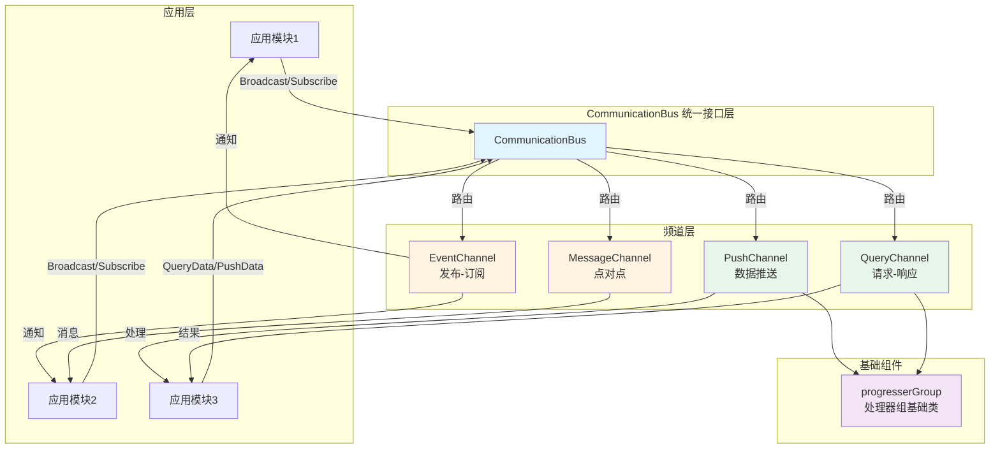

## 系统架构

### 架构图

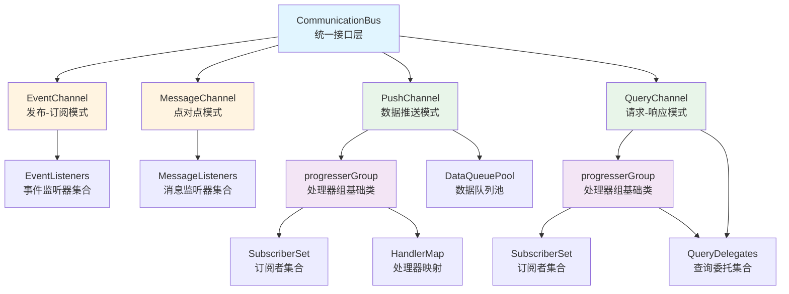

### 组件关系

```text
CommunicationBus (统一接口层)
    ├── EventChannel (发布-订阅模式)
    ├── MessageChannel (点对点模式)
    ├── PushChannel (数据推送模式)
    │   └── progresserGroup (处理器组基础类)
    └── QueryChannel (请求-响应模式)
        └── progresserGroup (处理器组基础类)
```

## 四种通信模式

### 1. EventChannel - 发布-订阅模式

**设计理念**: 一对多事件通知，支持多个订阅者同时接收同一事件。

**特点**:

- 支持多个订阅者订阅同一事件
- 支持作用域过滤（Global/Local/Group/Range）
- 事件广播时所有匹配的订阅者都会收到通知

**流程图**:

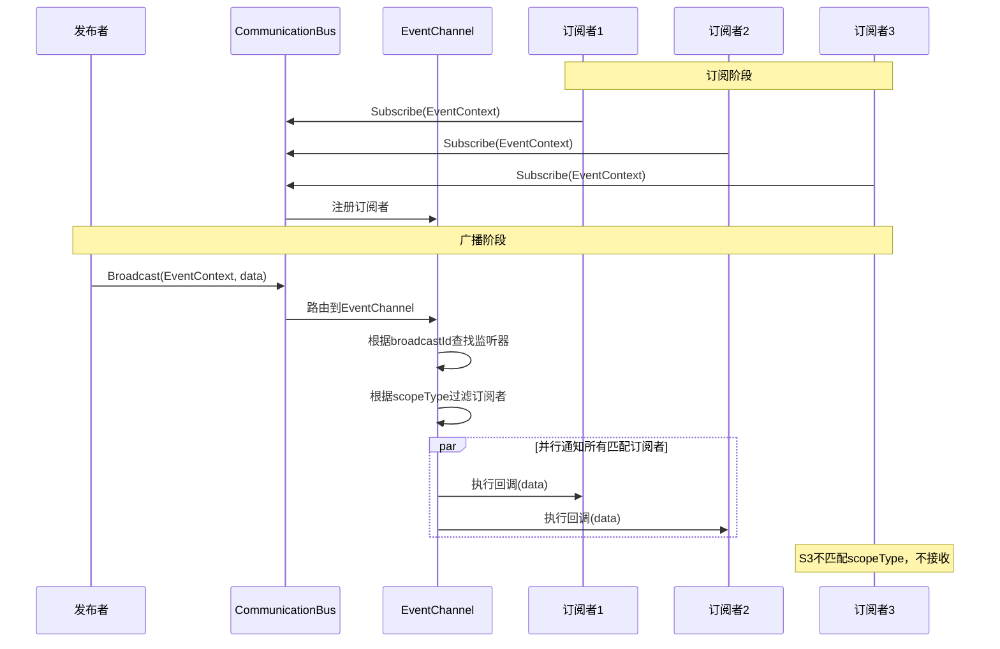

**流程**:

```text
发布者 → Broadcast(EventContext) → EventChannel → 匹配订阅者 → 执行回调
```

### 2. MessageChannel - 点对点模式

**设计理念**: 一对一消息传递，后订阅覆盖前订阅。

**特点**:

- 每个消息ID只能有一个订阅者
- 新订阅会覆盖旧订阅
- 适用于需要唯一接收者的场景

**流程图**:

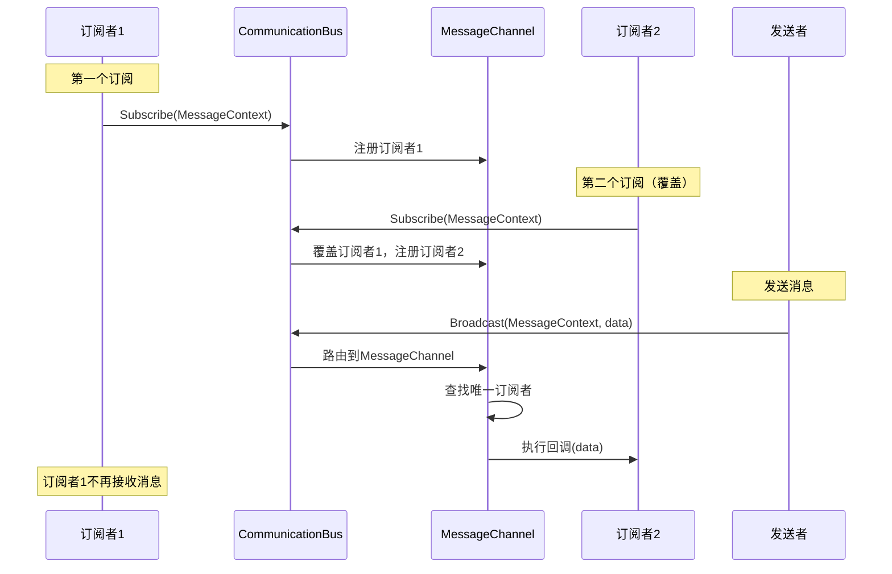

### 3. PushChannel - 数据推送模式

**设计理念**: 数据驱动模式，支持批量数据处理和延迟处理。

**特点**:

- 数据先推送到队列，按需处理
- 支持 IsDirty 机制控制处理时机
- 支持多种数据类型独立处理
- 每个订阅者拥有独立的数据队列

**流程图**:

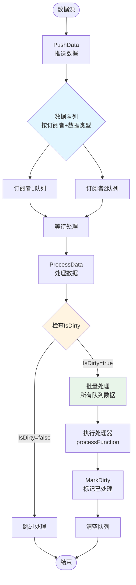

**关键机制**:

- **数据队列**: 按订阅者和数据类型组织，使用 LuaSet 去重
- **IsDirty**: 处理器可控制是否处理数据（默认处理）
- **批量处理**: 一次性处理队列中所有数据
- **推送链**: 处理一个数据类型时，可以触发下一个数据类型的推送，形成链式处理

### 推送链机制

PushChannel 支持推送链模式，即处理一个数据类型时，可以在处理器中触发下一个数据类型的推送，形成链式数据流。

**推送链流程图**:

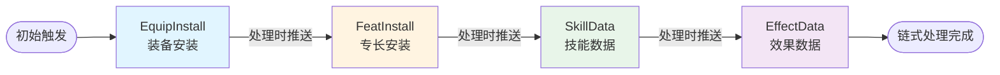

**推送链序列图**:

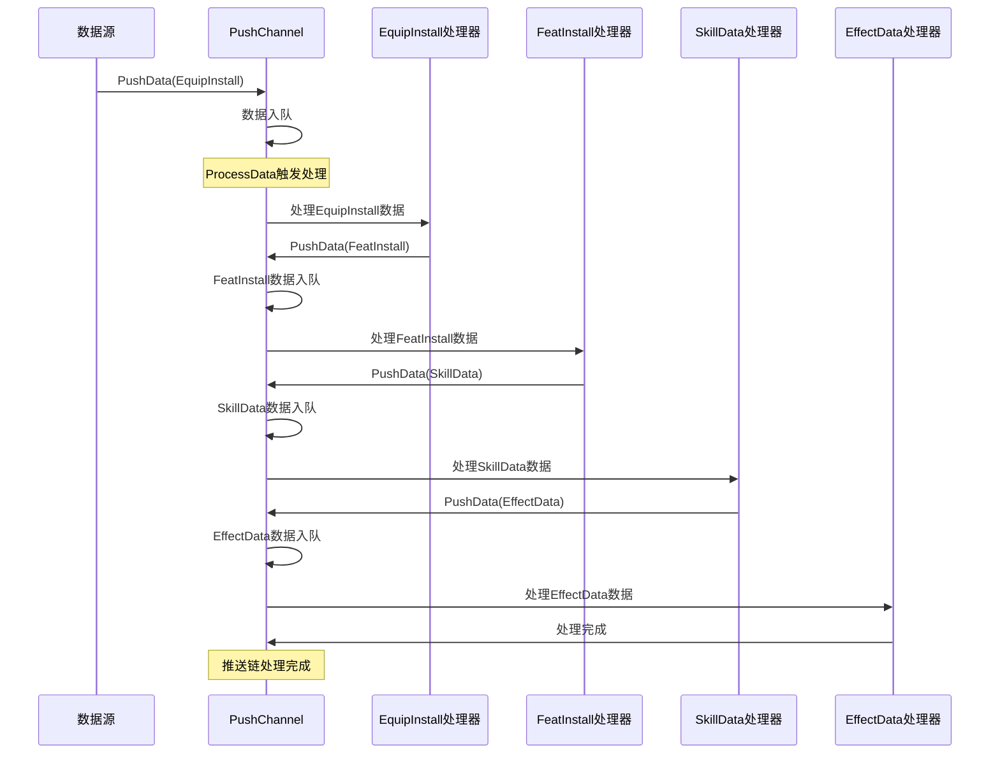

**推送链特点**:

- **链式触发**: 每个处理器的处理过程可以触发下一个数据类型的推送
- **自动流转**: 数据按照定义的链式关系自动流转处理
- **解耦设计**: 每个环节独立处理，降低模块间耦合
- **灵活扩展**: 可以轻松添加或修改链式环节

**设计模式**:

推送链采用了 **管道-过滤器模式（Pipeline-Filter Pattern）** 和 **责任链模式（Chain of Responsibility）** 的混合设计：

- **管道-过滤器模式**：数据在 PushChannel 管道中流动，每个 Handler 作为过滤器处理数据，处理完后可以产生新的数据推送到管道中继续流动
- **责任链模式变种**：每个 Handler 处理完自己的数据类型后，主动触发下一个环节的数据推送，形成责任链式的处理流程

**模式优势**:

- ✅ **解耦**: 每个 Handler 独立，不直接依赖其他 Handler
- ✅ **灵活**: 可以动态添加、移除或调整链式环节
- ✅ **可扩展**: 新的数据类型可以轻松插入到链中
- ✅ **可测试**: 每个环节可以独立测试

### 4. QueryChannel - 请求-响应模式

**设计理念**: 同步查询模式，立即返回结果。

**特点**:

- 同步调用，立即返回结果
- 支持带参数的查询
- 查询不存在的委托返回 false

**流程图**:

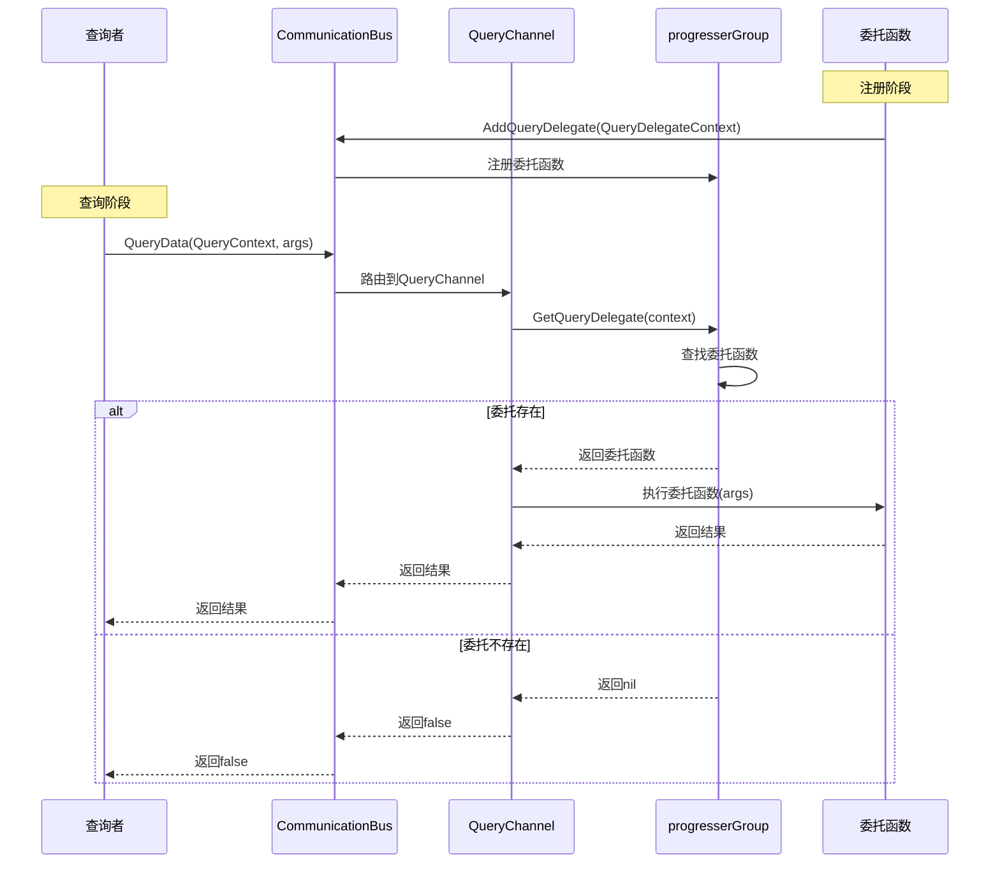

## 统一接口设计

CommunicationBus 提供统一的接口层，根据 Context 中的 `channelType` 自动路由到对应的频道：

### 接口路由图

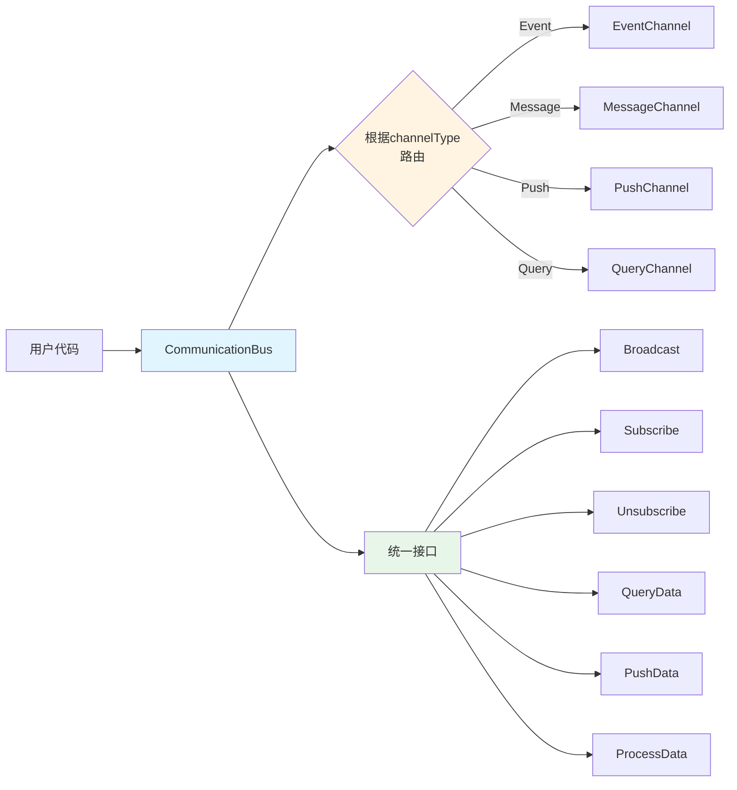

### 接口列表

- `Broadcast(context, ...)`: 统一发送接口
- `Subscribe(context)`: 统一订阅接口
- `Unsubscribe(context)`: 统一取消订阅接口
- `QueryData(context, ...)`: 查询接口（仅 Query 频道）
- `PushData(context)`: 数据推送接口（仅 Push 频道）
- `ProcessData(subscriber)`: 数据处理接口（仅 Push 频道）

## 作用域机制

系统支持四种作用域类型，用于过滤消息接收者：

### 作用域过滤图

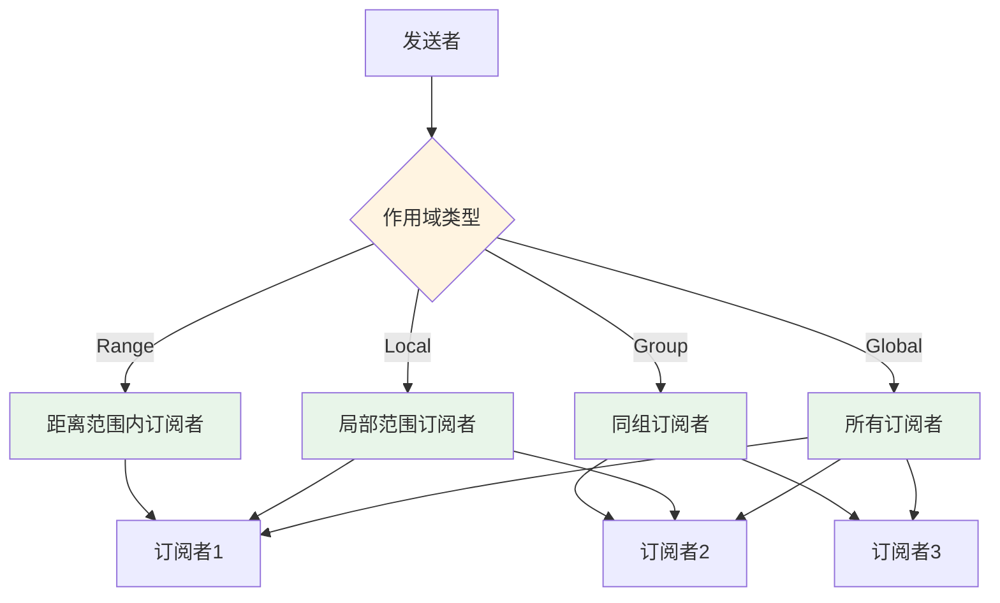

### 作用域类型

- **Global**: 全局作用域，所有订阅者都能收到
- **Local**: 局部作用域，只有指定范围内的订阅者能收到
- **Group**: 组作用域，只有同组的订阅者能收到
- **Range**: 距离作用域，只有距离范围内的订阅者能收到

## 核心组件

### ProgresserGroup（处理器组基础类）

**命名说明**：

- **类名**：`ProgresserGroup`（大写开头，表示类）
- **变量名**：`progresserGroup`（小写开头，表示实例）

ProgresserGroup 是 PushChannel 和 QueryChannel 的基础组件，提供：

**组件结构图**:

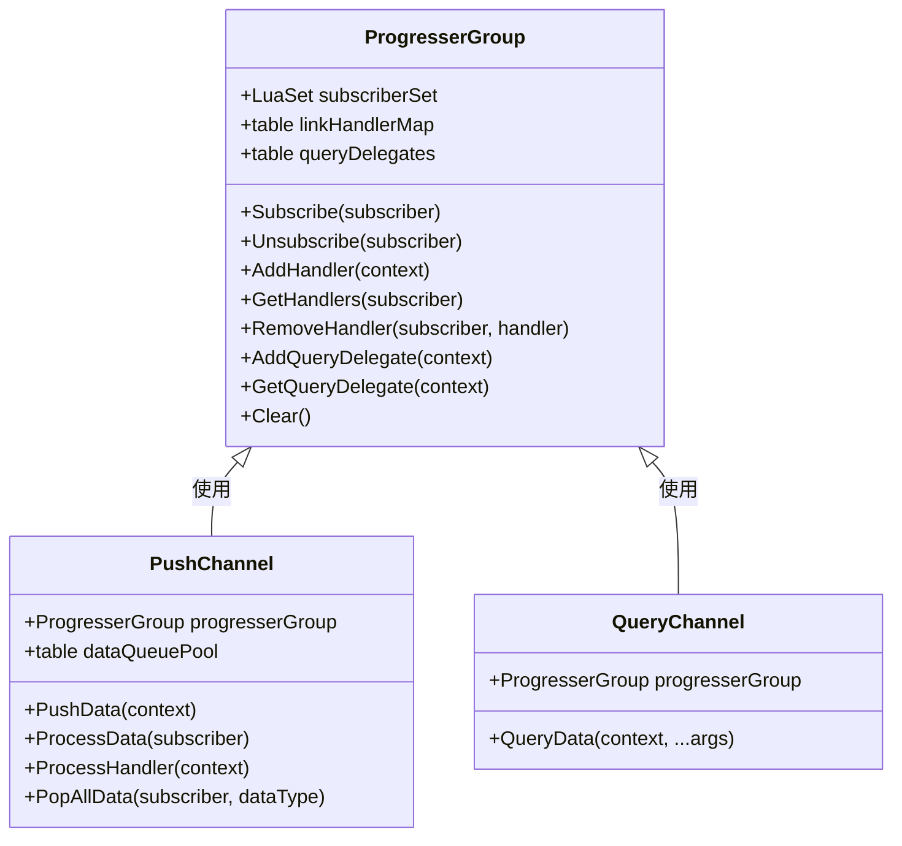

**功能**:

- **订阅管理**: 管理订阅者集合
- **处理器管理**: 管理每个订阅者的处理器列表
- **委托管理**: 管理查询委托（Query 专用）

### 数据上下文类型

系统使用类型化的上下文对象来传递参数：

- `BroadcastContext`: 广播上下文
- `BroadcastSubscribeContext`: 订阅上下文
- `PushDataContext`: 推送数据上下文
- `ProgressHandlerContext`: 处理器上下文
- `QueryDelegateContext`: 查询委托上下文

## 使用场景

- **EventChannel**: UI事件、游戏事件、系统通知
- **MessageChannel**: 命令传递、状态同步、唯一接收者场景
- **PushChannel**: 属性变更、批量数据更新、延迟处理场景
- **QueryChannel**: 数据查询、状态获取、同步调用场景

## 设计优势

1. **统一接口**: 所有通信模式通过统一接口访问，降低使用复杂度
2. **类型安全**: 使用类型化的上下文对象，减少参数错误
3. **灵活扩展**: 频道架构易于扩展新的通信模式
4. **性能优化**: PushChannel 支持批量处理和延迟处理，减少频繁调用
5. **错误处理**: 所有频道都包含错误捕获机制，避免回调错误影响系统稳定性
