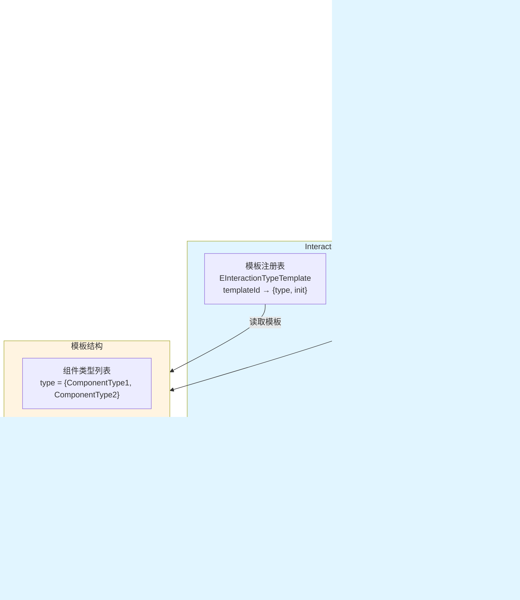

# 交互系统架构设计

## 设计目标

设计一套完整的交互系统架构，支持多种交互类型（物品拾取、门、宝箱、传送门等），实现模板化配置、组件自动初始化、参数化配置，提供数据驱动的配置化交互系统。

---

## 核心设计理念

### 1. 模板化配置为核心

**本质**：交互系统的核心是模板化配置机制
- 交互配置 = 一个模板ID即可完成完整配置
- 组件初始化 = 模板自动查找组件并初始化
- 参数化配置 = 同一个模板可以有不同的参数配置
- 统一管理 = 所有交互类型通过统一的模板系统管理

### 2. 数据驱动架构

**本质**：交互特性通过配置数据实现，无需修改代码
- 交互类型、组件类型 → 通过模板配置定义
- 初始化参数、反馈效果 → 通过参数配置调整
- 新增交互类型 → 扩展模板配置即可
- 交互平衡 → 调整配置参数即可

### 3. 策略模式 + 外观模式

**本质**：模板方法模式实现标准化流程，外观模式隐藏复杂逻辑
- 模板方法模式：定义交互初始化的标准流程
- 策略模式：每个模板就是一种交互策略
- 外观模式：隐藏复杂的初始化逻辑，提供简单的配置接口
- 工厂模式：模板工厂创建交互组件

---

## 整体架构设计

### 三层架构 + 模板方法模式


### 模板方法数据流

```mermaid
graph LR
    Start[Unity Inspector<br/>配置interactionTemplateId] -->|1. 读取模板ID| Template[模板层<br/>查找EInteractionTypeTemplate]
    Template -->|2. 获取组件类型| Component[组件查找器<br/>自动查找所需组件]
    Component -->|3. 获取组件列表| Orchestrator[初始化编排器<br/>统一初始化流程]
    Orchestrator -->|4. 调用初始化策略| Init[初始化层<br/>InterationInit[ComponentType]]
    Init -->|5. 配置组件参数| Unity[Unity组件层<br/>完成配置]
    
    style Template fill:#e1f5ff
    style Component fill:#fff4e1
    style Init fill:#c8e6c9
    style Unity fill:#c8e6c9
```

**数据流特性**：
- ✅ **模板驱动**：一个模板ID即可完成完整配置
- ✅ **自动查找**：系统自动查找所需组件，无需手动添加
- ✅ **统一流程**：所有交互类型使用统一的初始化流程
- ✅ **参数化配置**：同一个模板可以有不同的参数配置
- ✅ **策略模式**：每个组件类型对应一个初始化策略
- ✅ **外观模式**：隐藏复杂的初始化逻辑，提供简单的配置接口

---

## 模板层架构设计

### 核心职责

模板注册管理 + 组件自动查找 + 初始化流程编排

### 架构图



### 工作流程

```mermaid
flowchart TD
    Start[Unity Inspector<br/>配置interactionTemplateId] --> ReadTemplate[读取模板ID<br/>itemLifecycle.interactionTemplateId]
    ReadTemplate --> FindTemplate[查找模板<br/>EInteractionTypeTemplate[templateId]]
    FindTemplate -->|找到模板| GetTypeList[获取组件类型列表<br/>template.type]
    FindTemplate -->|未找到| Error[错误：模板不存在]
    
    GetTypeList --> FindComponents[组件查找器<br/>遍历type列表，查找组件]
    FindComponents --> CheckComponents{所有组件<br/>是否找到?}
    CheckComponents -->|是| CreateComponentList[创建组件列表<br/>comps = {comp1, comp2, ...}]
    CheckComponents -->|否| Error2[错误：组件未找到]
    
    CreateComponentList --> CallInit[调用初始化函数<br/>template.init(comps)]
    CallInit --> InitStrategy[初始化策略<br/>InterationInit[ComponentType]"]
    InitStrategy --> ConfigComponent[配置组件参数<br/>完成初始化]
    ConfigComponent --> Success[初始化完成]
    
    style CheckComponents fill:#fff4e1,stroke:#333,stroke-width:2px
    style FindTemplate fill:#e1f5ff
    style InitStrategy fill:#c8e6c9
    style Success fill:#c8e6c9
```

### 核心组件

1. **模板注册表（EInteractionTypeTemplate）**
   - 存储所有交互模板配置
   - 模板结构：`{type = {ComponentType1, ...}, init = function(comps) end}`
   - 支持动态注册新模板

2. **组件查找器（ComponentFinder）**
   - 根据模板的type列表自动查找组件
   - 支持多种组件类型（PickableItem、KeyOperatedZone等）
   - 自动处理组件查找失败的情况

3. **初始化编排器（InitOrchestrator）**
   - 统一管理初始化流程
   - 调用模板的init函数
   - 传递组件列表给初始化策略

---

## 初始化层架构设计

### 核心职责

组件初始化策略 + 参数化配置 + 组件参数设置

### 架构图


### 工作流程

```mermaid
flowchart TD
    Start[接收组件列表<br/>comps = {comp1, comp2, ...}] --> ExtractComponent[提取组件<br/>local comp = table.remove(comps, 1)]
    ExtractComponent --> SelectStrategy{选择初始化策略<br/>InterationInit[ComponentType]}
    
    SelectStrategy --> PickableItemStrategy[PickableItem策略<br/>配置拾取效果/音效]
    SelectStrategy --> KeyOperatedZoneStrategy[KeyOperatedZone策略<br/>配置碰撞体/提示UI]
    SelectStrategy --> MovingPlatformStrategy[MovingPlatform策略<br/>配置路径点/速度]
    SelectStrategy --> OtherStrategy[其他策略<br/>...]
    
    PickableItemStrategy --> ReadParams[读取参数配置<br/>param = param or {}]
    KeyOperatedZoneStrategy --> ReadParams
    MovingPlatformStrategy --> ReadParams
    OtherStrategy --> ReadParams
    
    ReadParams --> ApplyDefault[应用默认值<br/>param.value or defaultValue]
    ApplyDefault --> ConfigComponent[配置组件<br/>comp.property = param.value]
    ConfigComponent --> ConfigFeedback[配置反馈效果<br/>MMFeedbacks/粒子系统]
    ConfigFeedback --> Success[初始化完成]
    
    style SelectStrategy fill:#fff4e1,stroke:#333,stroke-width:2px
    style ReadParams fill:#e1f5ff
    style ConfigComponent fill:#c8e6c9
    style Success fill:#c8e6c9
```

### 核心组件

1. **初始化策略组（InteractionInit）**
   - 每个组件类型对应一个初始化策略
   - 策略函数签名：`InterationInit[ComponentType](component, param)`
   - 支持参数化配置，提供默认值

2. **参数配置系统（ParamConfig）**
   - 支持默认参数和自定义参数
   - 参数验证和类型检查
   - 参数合并机制（自定义参数覆盖默认参数）

---

## 架构模式分析

### 模板方法模式（Template Method Pattern）

**核心思想**：定义交互初始化的标准流程，子步骤由具体策略实现


**优势**：
- ✅ **标准化流程**：所有交互类型使用统一的初始化流程
- ✅ **灵活扩展**：可以轻松添加新的初始化步骤
- ✅ **代码复用**：公共流程在模板方法中实现

### 策略模式（Strategy Pattern）

**核心思想**：每个组件类型对应一个初始化策略

```mermaid
graph TB
    Context[上下文<br/>InteractionUtil]
    StrategyInterface[策略接口<br/>InterationInit[ComponentType]]
    
    Strategy1[策略1<br/>PickableItem初始化]
    Strategy2[策略2<br/>KeyOperatedZone初始化]
    Strategy3[策略3<br/>MovingPlatform初始化]
    
    Context -->|选择策略| StrategyInterface
    StrategyInterface --> Strategy1
    StrategyInterface --> Strategy2
    StrategyInterface --> Strategy3
    
    style Context fill:#f3e5f5
    style StrategyInterface fill:#e1f5ff
    style Strategy1 fill:#c8e6c9
    style Strategy2 fill:#c8e6c9
    style Strategy3 fill:#c8e6c9
```

**优势**：
- ✅ **策略替换**：可以动态替换初始化策略
- ✅ **扩展性强**：新增组件类型只需添加新策略
- ✅ **解耦设计**：上下文和策略解耦

### 外观模式（Facade Pattern）

**核心思想**：隐藏复杂的初始化逻辑，提供简单的配置接口


**优势**：
- ✅ **简化接口**：客户端只需配置templateId，无需了解内部实现
- ✅ **隐藏复杂性**：复杂的初始化逻辑被隐藏在外观内部
- ✅ **易于使用**：降低使用门槛，提高开发效率

---

## 数据流设计

### 初始化数据流


### 模板注册数据流


---

## 架构验证

### 流程合理性验证

从架构可验证：
- ✅ **数据流完整**：配置模板ID → 查找模板 → 查找组件 → 初始化 → 完成（完整流程）
- ✅ **职责清晰**：模板层、初始化层职责明确，无重叠
- ✅ **解耦设计**：通过策略模式实现组件类型和初始化逻辑解耦
- ✅ **扩展性强**：新增交互类型只需注册模板和实现策略

### 扩展性验证

从架构可验证：
- ✅ **模板方法模式**：新增初始化步骤只需扩展模板方法
- ✅ **策略模式**：新增组件类型只需添加新策略
- ✅ **外观模式**：客户端接口稳定，内部实现可自由扩展
- ✅ **配置驱动**：新交互类型通过配置数据扩展

### 易用性验证

从架构可验证：
- ✅ **简单配置**：只需配置一个templateId即可完成初始化
- ✅ **自动处理**：系统自动查找组件和执行初始化
- ✅ **参数化**：支持参数化配置，灵活调整
- ✅ **统一接口**：所有交互类型使用统一的配置方式

---

## 开发指导原则

### 一、开发约束（什么能做，什么不能做）

#### ✅ 应该做的

1. **交互配置必须通过模板**
   ```
   ✅ 正确：
   Unity Inspector → 配置interactionTemplateId → 系统自动初始化
   
   ❌ 错误：
   手动添加组件、手动配置参数
   ```

2. **初始化策略必须注册**
   ```
   ✅ 正确：
   实现 InterationInit[ComponentType] = function(component, param) end
   
   ❌ 错误：
   直接操作组件，不通过初始化策略
   ```

3. **模板必须包含type和init**
   ```
   ✅ 正确：
   EInteractionTypeTemplate[id] = {
       type = {ComponentType1, ComponentType2},
       init = function(comps) end
   }
   
   ❌ 错误：
   模板结构不完整
   ```

#### ❌ 不应该做的

1. **禁止绕过模板系统**
   - 不能手动添加和配置组件
   - 必须通过模板系统统一管理

2. **禁止硬编码组件类型**
   - 组件类型必须在模板的type列表中定义
   - 不能硬编码组件查找逻辑

3. **禁止直接操作Unity组件**
   - 必须通过初始化策略配置组件
   - 不能直接修改组件属性

### 二、开发流程（标准化开发步骤）

#### 开发新交互类型的标准流程

```
1. 确定组件类型
   ↓
   需要哪些Unity组件？（PickableItem、KeyOperatedZone等）
   
2. 实现初始化策略
   ↓
   在InteractionInit中实现 InterationInit[ComponentType]
   
3. 注册模板
   ↓
   在EInteractionTypeTemplate中注册新模板
   
4. 配置参数（可选）
   ↓
   定义参数结构，提供默认值
   
5. 在Unity中使用
   ↓
   在ItemLifecycle中配置interactionTemplateId
```

---

## 总结

### 架构设计价值

该架构设计文档的价值在于：
- ✅ **思路解构**：完整解构交互系统的搭建思路
- ✅ **流程验证**：从架构层面验证流程合理性
- ✅ **模式分析**：分析模板方法、策略、外观模式的应用
- ✅ **开发指导**：为后续详细设计和实现提供清晰指导

### 设计原则

- ✅ **模板化配置为核心**：一个模板ID即可完成完整配置
- ✅ **数据驱动架构**：交互特性通过配置数据实现
- ✅ **策略模式 + 外观模式**：实现灵活扩展和简单接口
- ✅ **自动处理**：系统自动查找组件和执行初始化

### 架构特点

- ✅ **简单易用**：只需配置一个templateId，系统自动处理
- ✅ **灵活扩展**：新增交互类型只需注册模板和实现策略
- ✅ **统一管理**：所有交互类型通过统一的模板系统管理
- ✅ **参数化配置**：同一个模板可以有不同的参数配置

细节实现是后续开发阶段的工作，当前架构设计已足够指导整个交互系统的开发。
