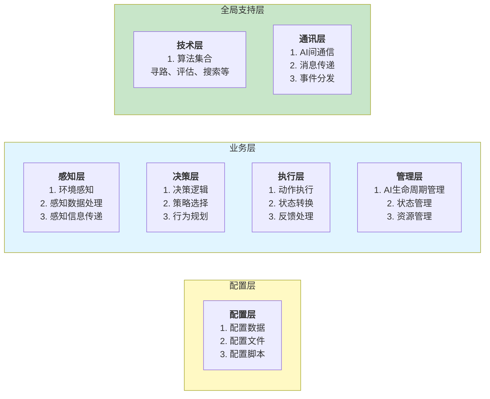
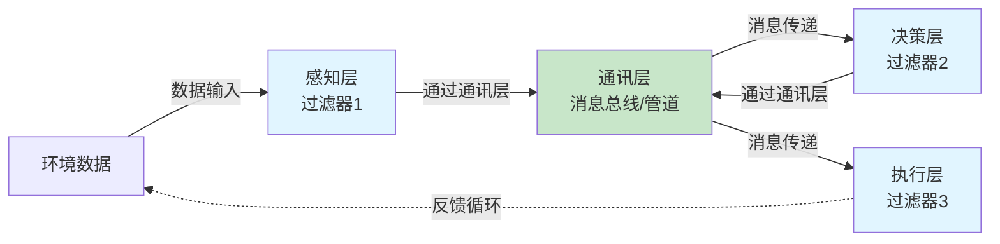
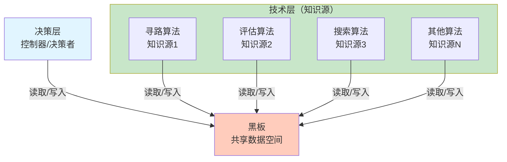
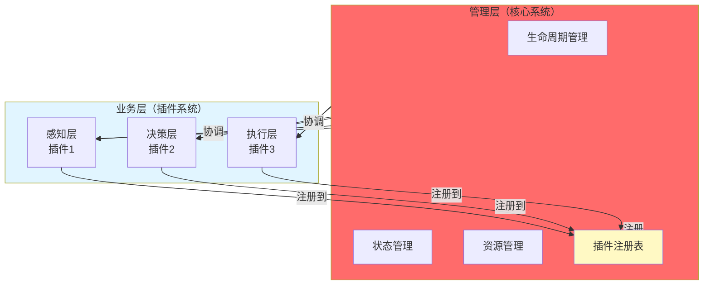
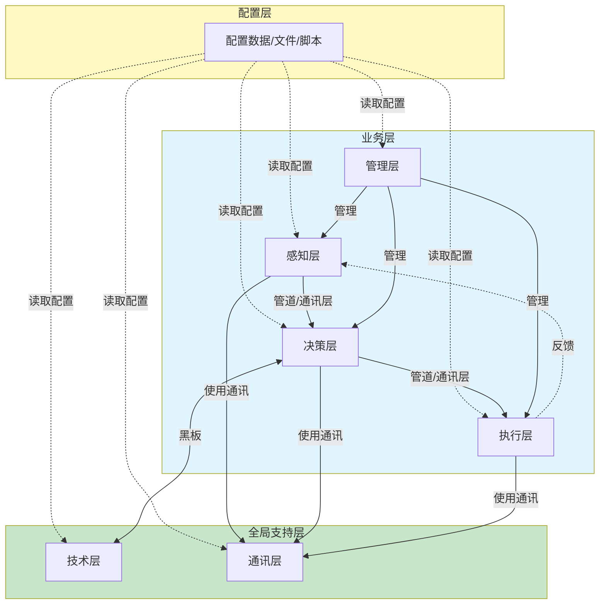

# 人工智能架构设计

> 本文档系统梳理游戏AI开发所需的核心机制，从基础概念到高级架构，为AI系统设计提供完整指导。

> **⚠️ 重要说明**：本文档主要关注**架构设计思想**，而非具体实现细节。实际开发中应该结合Unity特性和项目需求，灵活应用这些架构模式。前面的1-17个机制（事件驱动、消息、状态机等）是架构的基础组件，已在项目中实现；第18个是整体架构设计分析。

## 📋 与Unity/项目的对应关系

| 架构组件 | Unity对应 | 项目实现 |
|---------|----------|---------|
| **事件驱动** | EventSystem、UnityEvent | CommunicationBus（通讯总线） |
| **消息系统** | 无直接对应 | CommunicationBus（Event/Message/Push/Query） |
| **状态机** | Animator（有限状态机） | FSM系统（基础/下推/并发/层次） |
| **通讯层** | EventSystem | CommunicationBus |
| **技术层** | NavMesh、Physics | 寻路系统、算法集合 |
| **配置层** | ScriptableObject | Lua配置系统 |

## 🎯 与优化策略的关联

**参考**：`2/3.游戏AI优化.md` 中的11种优化策略

| 优化策略 | 架构实现 |
|---------|---------|
| **事件驱动而非轮询** | 通讯层（CommunicationBus）实现事件驱动 |
| **减少重复计算** | 技术层算法结果缓存 |
| **集中协调** | 管理层统一管理 |
| **分帧处理** | 状态机队列、分帧更新 |
| **LOD系统** | 细节级AI（管理层控制） |

---

## 📋 AI系统需要构建的核心机制

### 基础机制篇

1. [事件驱动与轮询的对比](#1事件驱动与轮询的对比)
   - 事件驱动（Event-Driven）的核心思想与应用
   - 轮询（Polling）的工作原理与场景
   - 两种模式的对比与混合使用建议

2. [消息概念](#2消息概念)
   - 消息作为事件驱动编程的核心概念
   - 消息传递机制

3. [状态机](#3状态机)
   - 状态机的核心概念（状态、转换、事件）
   - 项目中的FSM系统（基础、下推、并发、层次状态机）
   - 状态机的优势与应用

### 消息驱动状态机篇

4. [一个使用消息的事件驱动的状态机](#4一个使用消息的事件驱动的状态机)
   - 消息驱动状态转换的核心思想
   - 实现方式与优势

5. [交待时间](#5交待时间)
   - 状态转换的过渡时间处理
   - 延迟消息传递
   - 状态过渡动画时间

6. [另一个小交待](#6另一个小交待)
   - 边界情况处理（无效状态转换、转换失败、消息丢失）

### 状态机构建篇

7. [状态机构建单元](#7状态机构建单元)
   - 状态类（State Class）设计
   - 转换规则（Transition Rules）定义
   - 消息处理器（Message Handler）实现

8. [状态机消息路由选择](#8状态机消息路由选择)
   - 直接路由、类型路由、标签路由、范围路由
   - 路由选择器实现

### 消息系统篇

9. [发送消息](#9发送消息)
   - 基本消息发送（同步/异步）
   - 消息结构定义
   - 批量发送消息

10. [发送延迟消息](#10发送延迟消息)
    - 延迟消息实现
    - 延迟消息队列管理
    - 应用场景

11. [定义消息范围](#11定义消息范围)
    - 全局、局部、组、距离范围
    - 范围定义与路由

12. [记录所有消息活动和状态变迁](#12记录所有消息活动和状态变迁)
    - 日志记录系统
    - 状态变迁追踪
    - 消息活动追踪
    - 分析工具

### 高级机制篇

13. [交换状态机](#13交换状态机)
    - 临时替换状态机
    - 状态机升级/降级
    - 状态机模板切换

14. [多状态机](#14多状态机)
    - 并发状态机（Parallel FSM）
    - 分层状态管理
    - 独立系统状态机
    - 状态机通信

15. [消息系统实现](#15消息系统实现)
    - 消息系统架构
    - 消息优先级
    - 消息队列管理

16. [一个状态机队列](#16一个状态机队列)
    - 状态机队列管理器
    - 更新顺序与优先级调度
    - 应用场景

17. [代码外部脚本化行为](#17代码外部脚本化行为)
    - 配置化决策规则
    - Lua脚本化行为
    - 动态加载行为脚本
    - 热更新支持

### 架构设计篇

18. [AI 分层架构设计分析](#ai-分层架构设计分析)
    - 业务层（感知层、决策层、执行层、管理层）
    - 全局支持层（技术层、通讯层）
    - 配置层

---

# AI 分层架构设计分析



## 感知-决策-执行：管道-过滤器架构

业务层的**感知层 → 决策层 → 执行层**采用**管道-过滤器架构模式**：



### 管道实现：通讯层

**通讯层扮演管道的角色**，实现感知-决策-执行之间的数据传递：

1. **消息总线**：通讯层作为消息总线，连接各个过滤器
2. **解耦通信**：层之间通过消息传递，而非直接调用
3. **事件分发**：感知层产生事件，通过通讯层分发给决策层
4. **消息传递**：决策层产生决策消息，通过通讯层传递给执行层

### 管道-过滤器架构特点

1. **数据流处理**：数据在管道（通讯层）中流动，经过各个过滤器处理
2. **过滤器独立**：每个层（感知、决策、执行）是独立的处理单元
3. **管道连接**：通讯层作为管道，连接各个过滤器
4. **解耦设计**：层之间通过消息传递，实现解耦
5. **可组合性**：可以灵活组合不同的过滤器
6. **反馈循环**：执行层可以产生反馈，影响环境数据

### 数据流

```
环境数据 
  ↓
[感知层] → 感知消息 → [通讯层/管道] → 感知消息 → [决策层] → 决策消息 → [通讯层/管道] → 决策消息 → [执行层] → 动作执行 → 环境变化
                                                                                                    ↓
                                                                                              反馈循环
```

**通讯层作为管道**：
- 感知层 → 通讯层：发送感知消息（环境数据、感知结果）
- 通讯层 → 决策层：传递感知消息，触发决策
- 决策层 → 通讯层：发送决策消息（决策结果、行为规划）
- 通讯层 → 执行层：传递决策消息，触发执行

### 优势

- ✅ **模块化**：每个层职责单一，易于维护
- ✅ **可复用**：过滤器可以在不同AI中复用
- ✅ **可测试**：每个过滤器可以独立测试
- ✅ **可扩展**：可以轻松添加新的过滤器（如记忆层、学习层）

---

## 决策层-技术层：黑板架构模式

**决策层**和**技术层**之间采用**黑板架构模式（Blackboard Architecture Pattern）**：



### 黑板架构模式特点

1. **黑板（Blackboard）**：共享数据空间，存储问题状态、中间结果、最终解
2. **知识源（Knowledge Sources）**：技术层的各种算法（寻路、评估、搜索等）
3. **控制器（Controller）**：决策层决定使用哪些知识源，何时调用
4. **协作求解**：多个知识源通过黑板协作，逐步解决问题

### 工作流程

```
1. 决策层将问题/需求写入黑板
   ↓
2. 决策层选择合适的技术层算法（知识源）
   ↓
3. 算法读取黑板数据，处理并写入结果
   ↓
4. 决策层读取黑板结果，继续决策或选择其他算法
   ↓
5. 重复步骤2-4，直到问题解决
```

### 示例

**决策场景**：AI需要移动到目标位置

```
1. 决策层写入黑板：{目标位置: (10, 5), 当前位置: (0, 0)}
   ↓
2. 决策层调用：技术层.寻路算法
   ↓
3. 寻路算法读取黑板，计算路径，写入：{路径: [(1,1), (2,2), ...]}
   ↓
4. 决策层读取路径，调用：技术层.评估算法（评估路径安全性）
   ↓
5. 评估算法读取黑板，评估路径，写入：{路径安全: true}
   ↓
6. 决策层基于黑板数据做出最终决策
```

### 优势

- ✅ **解耦**：决策层和技术层通过黑板解耦
- ✅ **灵活**：可以动态选择使用哪些算法
- ✅ **协作**：多个算法可以协作解决复杂问题
- ✅ **可扩展**：可以轻松添加新的算法（知识源）
- ✅ **可测试**：每个知识源可以独立测试

---

## 管理层-其他层：微核心架构模式

**管理层**和其他层（感知层、决策层、执行层）之间采用**微核心架构模式（Microkernel Architecture Pattern）**：



### 微核心架构模式特点

1. **核心系统（管理层）**：
   - 提供最小功能集：生命周期管理、状态管理、资源管理
   - 插件注册表：管理所有插件的注册和发现
   - 协调机制：协调插件之间的交互

2. **插件系统（业务层）**：
   - 感知层插件：环境感知功能
   - 决策层插件：决策逻辑功能
   - 执行层插件：动作执行功能

3. **插件注册**：
   - 插件向核心系统注册
   - 核心系统管理插件的生命周期
   - 插件可以动态添加、移除


---

## 整体架构依赖关系



### 依赖关系说明

1. **配置层 → 所有层**：
   - 所有层都依赖配置层读取配置数据
   - 虚线表示配置读取，非运行时依赖

2. **业务层内部**：
   - 感知层 → 决策层 → 执行层（管道-过滤器模式，通过通讯层）
   - 执行层 → 感知层（反馈循环）

3. **管理层 → 业务层**：
   - 管理层管理感知层、决策层、执行层的生命周期（微核心架构）

4. **决策层 ↔ 技术层**：
   - 通过黑板架构模式协作

5. **业务层 → 支持层**：
   - 业务层使用通讯层进行消息传递
   - 决策层使用技术层进行算法计算

---

### 工作流程

```
1. 系统启动
   ↓
2. 管理层（核心）初始化
   ↓
3. 感知层、决策层、执行层（插件）向管理层注册
   ↓
4. 管理层管理插件的生命周期（Start、Update、Stop）
   ↓
5. 管理层协调插件之间的交互
   ↓
6. 可以动态添加/移除插件（如学习层、记忆层）
```

### 优势

- ✅ **核心稳定**：管理层提供稳定的核心功能
- ✅ **插件灵活**：可以动态添加、移除、替换插件
- ✅ **解耦设计**：插件之间通过管理层协调，不直接依赖
- ✅ **可扩展**：可以轻松添加新功能（新插件）
- ✅ **可维护**：插件可以独立开发、测试、部署
- ✅ **符合开闭原则**：对扩展开放，对修改关闭

### 架构模式总结

架构采用了**复合型架构设计**，结合了多种架构模式：

1. **分层架构**：整体结构（配置层、业务层、支持层）
2. **管道-过滤器模式**：感知-决策-执行流程（通讯层作为管道）
3. **黑板架构模式**：决策层-技术层协作
4. **微核心架构模式**：管理层-其他层管理

这是一个**成熟、灵活、可扩展**的AI架构设计！

---

## 开发指导原则

> **架构的价值在于消灭代码、提高开发效率、指导开发思想**

### 一、开发约束（什么能做，什么不能做）

#### ✅ 应该做的

1. **层间通信必须通过通讯层**
   ```
   ✅ 正确：
   感知层 → 通讯层 → 决策层
   决策层 → 通讯层 → 执行层
   
   ❌ 错误：
   感知层 → 直接调用 → 决策层
   ```

2. **算法调用必须通过黑板**
   ```
   ✅ 正确：
   决策层 → 写入黑板 → 技术层算法读取 → 写入结果 → 决策层读取
   
   ❌ 错误：
   决策层 → 直接调用 → 技术层算法
   ```

3. **插件必须向管理层注册**
   ```
   ✅ 正确：
   新插件 → 向管理层注册 → 管理层管理生命周期
   
   ❌ 错误：
   新插件 → 直接创建使用
   ```

4. **配置必须从配置层读取**
   ```
   ✅ 正确：
   所有层 → 从配置层读取配置
   
   ❌ 错误：
   硬编码配置值
   ```

#### ❌ 不应该做的

1. **禁止跨层直接调用**
   - 感知层不能直接调用决策层
   - 决策层不能直接调用执行层
   - 各层之间必须通过通讯层通信

2. **禁止直接依赖算法**
   - 决策层不能直接依赖技术层的具体算法
   - 必须通过黑板架构模式协作

3. **禁止绕过管理层**
   - 新功能不能绕过管理层直接实现
   - 必须作为插件向管理层注册

4. **禁止硬编码配置**
   - 所有配置必须从配置层读取
   - 支持配置热更新

### 二、开发流程（标准化开发步骤）

#### 开发新AI功能的标准流程

```
1. 确定功能归属
   ↓
   属于哪一层？（感知层/决策层/执行层）
   需要哪些算法？（技术层）
   需要哪些配置？（配置层）
   
2. 实现功能模块
   ↓
   如果是新层：实现插件接口，向管理层注册
   如果是新算法：实现知识源接口，向黑板注册
   如果是新配置：添加到配置层
   
3. 建立通信机制
   ↓
   通过通讯层发送/接收消息
   通过黑板读取/写入数据
   
4. 测试和验证
   ↓
   独立测试插件/算法
   集成测试通信机制
   验证配置读取
```

#### 具体示例：开发"记忆层"功能

```
步骤1：确定归属
- 属于业务层，作为新插件

步骤2：实现插件
- 实现IPlugin接口
- 实现感知、决策、执行相关方法
- 向管理层注册

步骤3：建立通信
- 通过通讯层接收感知消息
- 通过通讯层发送记忆消息给决策层
- 通过黑板存储/读取记忆数据

步骤4：配置支持
- 在配置层添加记忆相关配置
- 支持记忆容量、遗忘速度等配置

步骤5：测试验证
- 测试记忆存储和读取
- 测试与其他层的通信
- 验证配置生效
```

### 三、代码规范（统一的代码组织方式）

#### 1. 目录结构规范

```
AI系统/
├── Config/              # 配置层
│   ├── AIConfig.lua    # AI配置
│   └── BehaviorConfig.lua  # 行为配置
│
├── Business/           # 业务层
│   ├── Perception/      # 感知层插件
│   ├── Decision/        # 决策层插件
│   ├── Execution/       # 执行层插件
│   └── Management/     # 管理层核心
│
├── Support/            # 支持层
│   ├── Technical/      # 技术层（算法）
│   │   ├── Pathfinding.lua
│   │   ├── Evaluation.lua
│   │   └── Search.lua
│   └── Communication/  # 通讯层
│       ├── MessageBus.lua
│       └── EventDispatch.lua
│
└── Blackboard/         # 黑板
    └── Blackboard.lua
```

#### 2. 接口规范

**插件接口（IPlugin）**
```lua
-- 所有业务层插件必须实现此接口
IPlugin = {
    OnRegister = function(self, manager) end,  -- 注册时调用
    OnStart = function(self) end,                -- 启动时调用
    OnUpdate = function(self, dt) end,          -- 更新时调用
    OnStop = function(self) end,                 -- 停止时调用
    OnUnregister = function(self) end,          -- 注销时调用
}
```

**知识源接口（IKnowledgeSource）**
```lua
-- 所有技术层算法必须实现此接口
IKnowledgeSource = {
    CanProcess = function(self, blackboard) end,  -- 是否可以处理
    Process = function(self, blackboard) end,     -- 处理逻辑
    GetPriority = function(self) end,             -- 优先级
}
```

#### 3. 命名规范

- **插件命名**：`XXXLayer`（如：`PerceptionLayer`、`DecisionLayer`）
- **算法命名**：`XXXAlgorithm`（如：`PathfindingAlgorithm`、`EvaluationAlgorithm`）
- **消息命名**：`EMessageType.XXX`（如：`EMessageType.PerceptionData`）
- **配置命名**：`Config.XXX`（如：`Config.AIBehavior`）

### 四、架构优势总结

通过遵循这些开发指导原则，架构设计实现了：

1. **消灭代码**：
   - 通过插件机制复用代码
   - 通过通讯层统一通信，避免重复实现
   - 通过配置化减少硬编码

2. **提高效率**：
   - 清晰的开发流程，减少决策成本
   - 统一的代码规范，减少理解成本
   - 明确的约束规则，减少错误和返工

3. **指导思想**：
   - 分层架构指导代码组织
   - 架构模式指导设计思路
   - 开发原则指导具体实现

**这就是好架构的价值：不是增加代码，而是消灭代码；不是增加复杂度，而是降低复杂度；不是增加约束，而是提供清晰的指导！**

---

## 📌 实际应用建议

### Unity/C#开发建议

**✅ 已实现的部分**（项目中已有）：
- ✅ **通讯层**：CommunicationBus（Event/Message/Push/Query）
- ✅ **状态机**：FSM系统（基础/下推/并发/层次）
- ✅ **配置层**：Lua配置系统
- ✅ **技术层**：寻路系统、算法集合

**⚠️ 需要结合Unity特性**：
- ✅ **事件驱动**：Unity的EventSystem、UnityEvent
- ✅ **分帧处理**：Unity协程（Coroutine）、Job System
- ✅ **生命周期**：Unity的MonoBehaviour生命周期
- ✅ **对象管理**：Unity的GameObject、Component系统

**学习价值**：
- ✅ **理解架构思想**：知道如何组织AI系统
- ✅ **理解设计模式**：管道-过滤器、黑板、微核心等
- ✅ **指导实际开发**：按照架构原则组织代码

**核心原则**：架构是指导思想的框架，实际实现要结合Unity特性和项目需求灵活应用。
