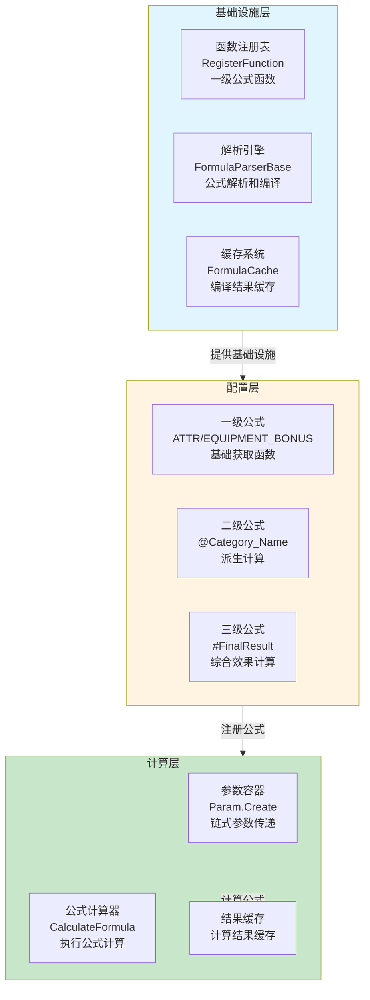
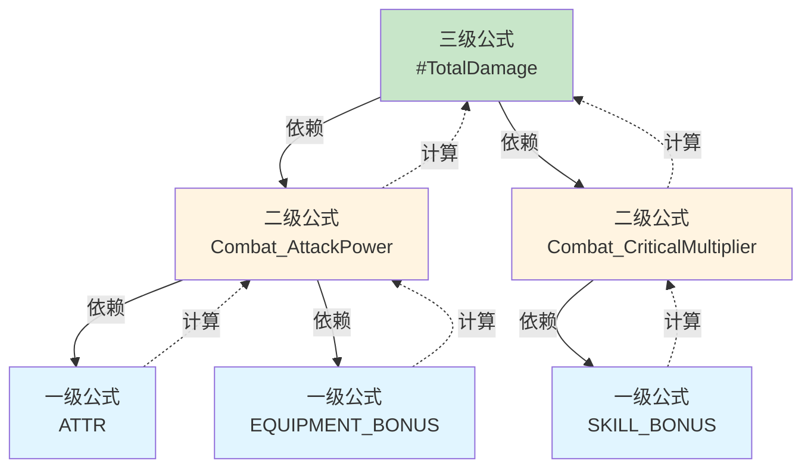
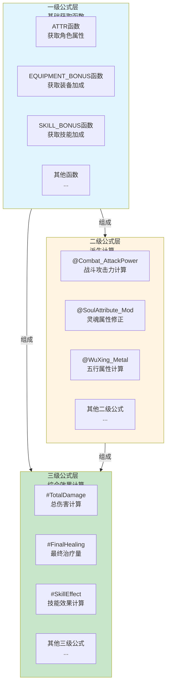
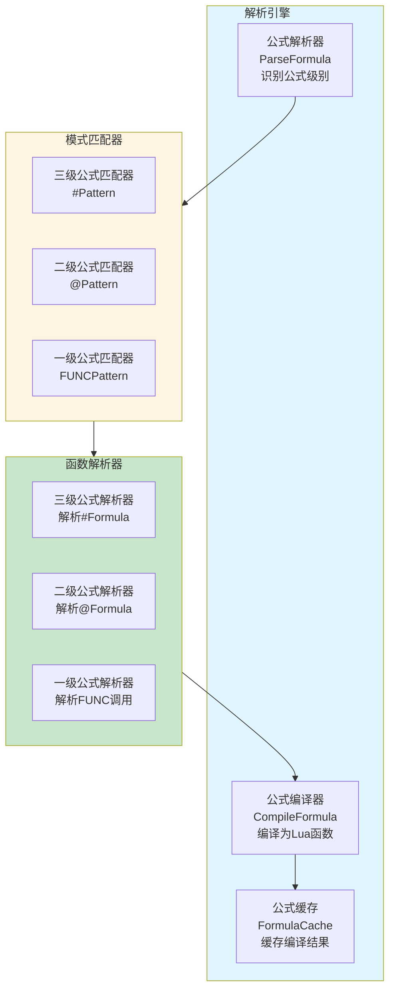
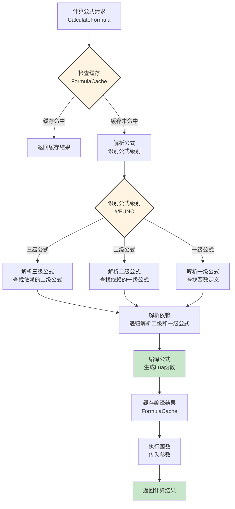
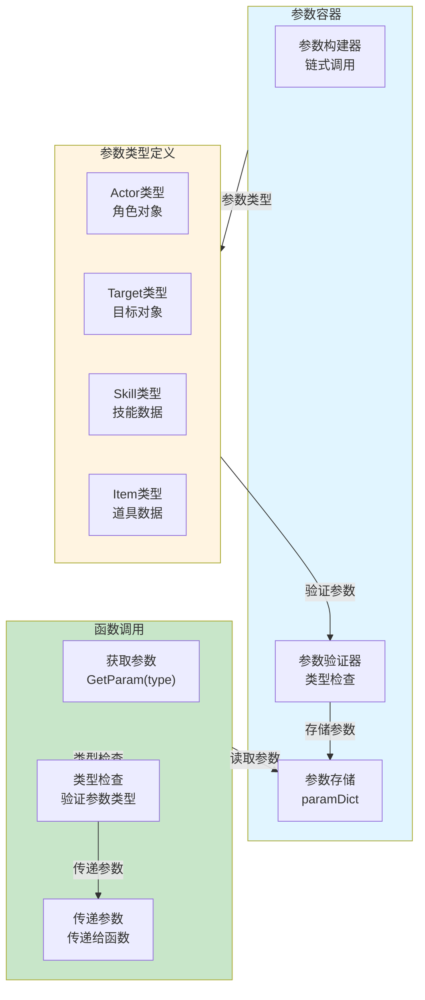
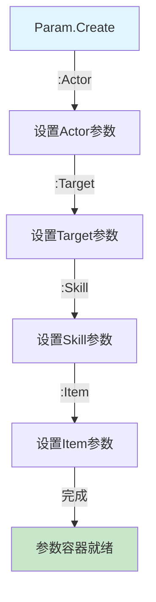
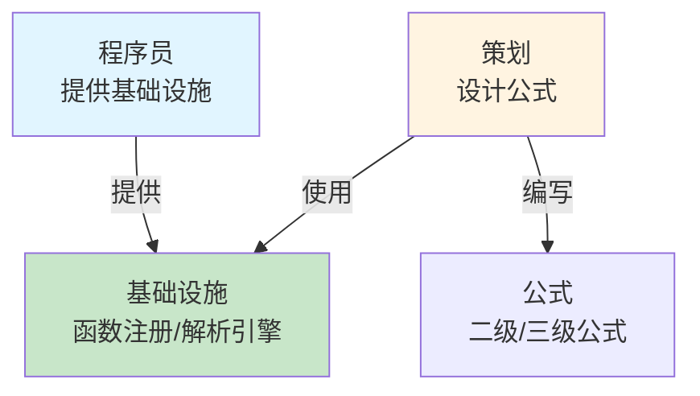
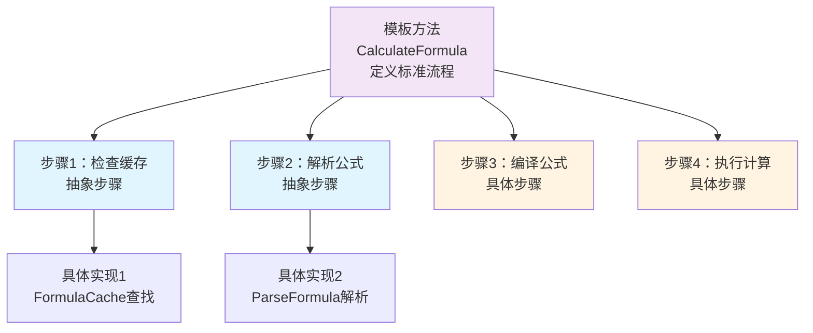
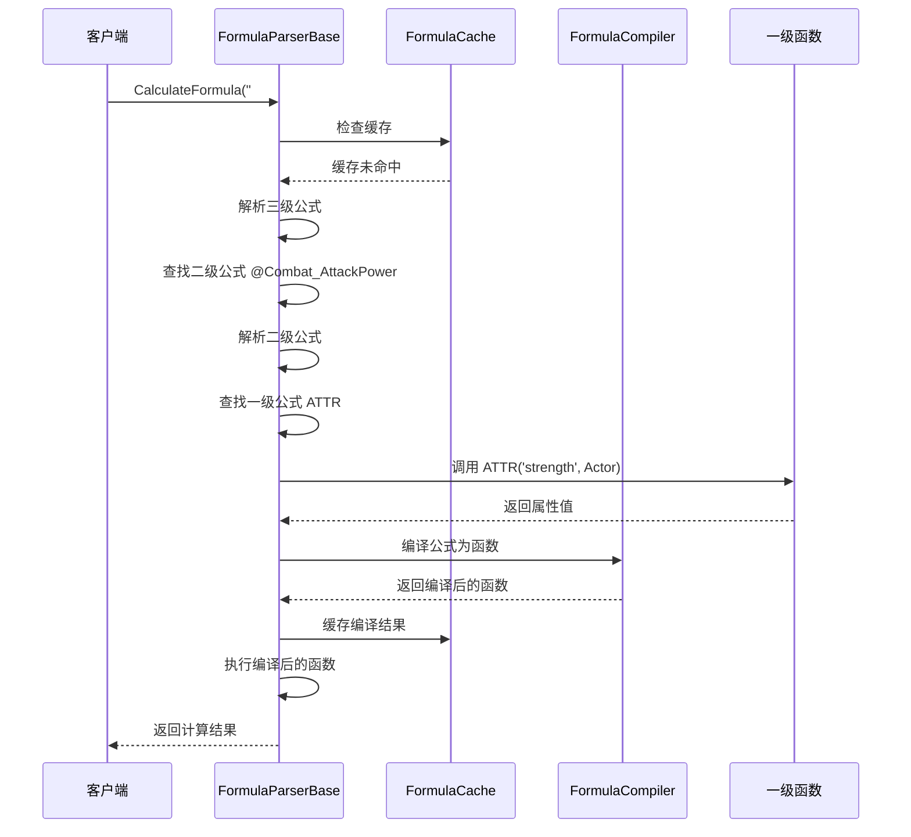

# 公式系统架构设计

## 设计目标

设计一套完整的公式解析系统，支持三级公式架构（一级基础函数、二级派生计算、三级综合效果），实现职责分离、策划友好、类型安全，提供数据驱动的配置化公式系统。

---

## 核心设计理念

### 1. 三级公式架构为核心

**本质**：公式系统的核心是三级公式的分层架构
- 一级公式 = 基础获取函数（程序员提供，不运算，只传参）
- 二级公式 = 派生计算（策划编写，基于一级公式）
- 三级公式 = 综合效果计算（策划编写，基于一级和二级公式）
- 职责分离 = 程序员提供基础设施，策划负责公式设计和测试

### 2. 字符匹配规则 + 类型安全

**本质**：通过严格的字符匹配规则实现类型安全和职责分离
- 字符匹配规则 = 三级公式以`#`开头，二级公式以`@`开头且包含下划线
- 类型安全 = 通过预定义参数类型避免运行时错误
- 策划友好 = 策划只需严格按照字符匹配规则编写公式
- 即时反馈 = 策划可以独立测试和调整公式，无需程序员参与

### 3. 数据驱动架构

**本质**：公式特性通过配置数据实现，无需修改代码
- 公式注册、公式计算 → 通过配置数据定义
- 函数注册、参数传递 → 通过配置数据调整
- 新增公式 → 扩展配置数据即可
- 公式平衡 → 调整配置数值即可

---

## 整体架构设计

### 三级公式架构 + 职责分离



### 三级公式数据流




**数据流特性**：
- ✅ **三级分层**：一级 → 二级 → 三级，逐层计算
- ✅ **职责分离**：程序员提供一级函数，策划编写二级和三级公式
- ✅ **字符匹配**：通过字符匹配规则识别公式级别
- ✅ **自动缓存**：编译结果自动缓存，提升性能
- ✅ **类型安全**：通过预定义参数类型避免运行时错误

---

## 三级公式架构设计

### 核心职责

一级基础函数 + 二级派生计算 + 三级综合效果

### 架构图



### 字符匹配规则

**三级公式识别规则**：
```lua
-- 三级公式：以 # 开头
local lv3Pattern = "%#[%w_]+"  -- #TotalDamage
```

**二级公式识别规则**：
```lua
-- 二级公式：以 @ 开头，包含下划线
local lv2Pattern = "%@[%w_]+%_[%w_]+"  -- @Combat_AttackPower
```

**一级公式识别规则**：
```lua
-- 一级公式：三种模式
local lv1_1Pattern = "([A-Z_]+%([^%)]*%))"  -- FUNC(args)
local lv1_2Pattern = "([A-Z_]+%[[^%]]*%]"   -- FUNC[index]
local lv1_3Pattern = "\\b([A-Z_]+)\\b"      -- FUNC
```


---

## 解析引擎架构设计

### 核心职责

公式解析 + 公式编译 + 结果缓存

### 架构图



### 工作流程



---

## 参数传递系统架构设计

### 核心职责

链式参数传递 + 类型安全 + 参数验证

### 架构图



### 链式调用设计



**设计优势**：
- ✅ **链式调用**：流畅的API设计，易于使用
- ✅ **类型安全**：参数类型预定义，避免运行时错误
- ✅ **参数验证**：自动验证参数类型和完整性
- ✅ **灵活扩展**：可以轻松添加新的参数类型

---

## 架构模式分析

### 职责分离模式（Separation of Concerns）

**核心思想**：程序员和策划职责分离



**优势**：
- ✅ **职责清晰**：程序员负责基础设施，策划负责公式设计
- ✅ **独立工作**：策划可以独立测试和调整公式
- ✅ **减少沟通**：减少程序员和策划之间的沟通成本

### 模板方法模式（Template Method Pattern）

**核心思想**：定义公式解析的标准流程



---

## 数据流设计

### 公式计算数据流



---
## 总结

### 架构设计价值

该架构设计文档的价值在于：
- ✅ **思路解构**：完整解构公式系统的搭建思路
- ✅ **流程验证**：从架构层面验证流程合理性
- ✅ **模式分析**：分析职责分离、模板方法模式的应用
- ✅ **开发指导**：为后续详细设计和实现提供清晰指导

### 设计原则

- ✅ **三级公式架构为核心**：一级基础函数、二级派生计算、三级综合效果
- ✅ **字符匹配规则 + 类型安全**：通过严格的字符匹配规则实现类型安全
- ✅ **数据驱动架构**：公式特性通过配置数据实现
- ✅ **职责分离**：程序员提供基础设施，策划负责公式设计

### 架构特点

- ✅ **策划友好**：策划只需按照字符匹配规则编写公式
- ✅ **类型安全**：通过预定义参数类型避免运行时错误
- ✅ **自动缓存**：编译结果自动缓存，提升性能
- ✅ **灵活扩展**：新增公式只需在对应级别注册

细节实现是后续开发阶段的工作，当前架构设计已足够指导整个公式系统的开发。
