# 剧情演出架构设计

## 📋 概述

剧情演出系统是游戏叙事体验的核心系统，负责管理剧情脚本的解析、执行、表现和状态管理。系统采用分层架构设计，通过数据驱动的方式实现剧情演出的完整流程。

---

## 🏗️ 整体架构图

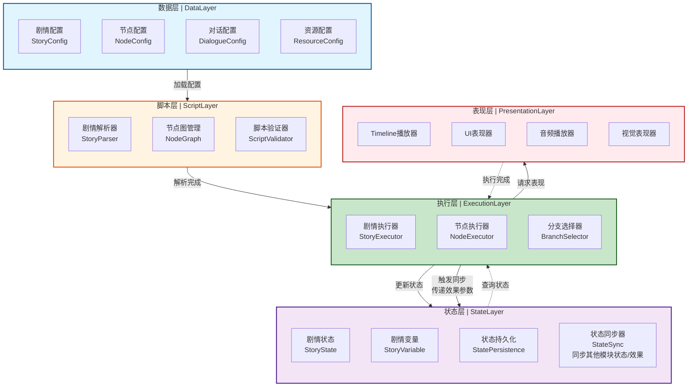
```mermaid
flowchart TB
    subgraph DataLayer["数据层 | DataLayer"]
        direction TB
        StoryConfig["剧情配置<br/>StoryConfig"]
        NodeConfig["节点配置<br/>NodeConfig"]
        DialogueConfig["对话配置<br/>DialogueConfig"]
        ResourceConfig["资源配置<br/>ResourceConfig"]
    end
    
    subgraph ScriptLayer["脚本层 | ScriptLayer"]
        direction TB
        StoryParser["剧情解析器<br/>StoryParser"]
        NodeGraph["节点图管理<br/>NodeGraph"]
        ScriptValidator["脚本验证器<br/>ScriptValidator"]
    end
    
    subgraph ExecutionLayer["执行层 | ExecutionLayer"]
        direction TB
        StoryExecutor["剧情执行器<br/>StoryExecutor"]
        NodeExecutor["节点执行器<br/>NodeExecutor"]
        BranchSelector["分支选择器<br/>BranchSelector"]
    end
    
    subgraph StateLayer["状态层 | StateLayer"]
        direction TB
        StoryState["剧情状态<br/>StoryState"]
        StoryVariable["剧情变量<br/>StoryVariable"]
        StatePersistence["状态持久化<br/>StatePersistence"]
        StateSync["状态同步器<br/>StateSync<br/>同步其他模块状态/效果"]
    end
    
    subgraph PresentationLayer["表现层 | PresentationLayer"]
        direction TB
        TimelinePlayer["Timeline播放器"]
        UIPresenter["UI表现器"]
        AudioPlayer["音频播放器"]
        VisualPlayer["视觉表现器"]
    end
    
    DataLayer -->|加载配置| ScriptLayer
    ScriptLayer -->|解析完成| ExecutionLayer
    ExecutionLayer -->|更新状态| StateLayer
    ExecutionLayer -->|请求表现| PresentationLayer
    ExecutionLayer -->|触发同步<br/>传递效果参数| StateLayer
    StateLayer -.->|查询状态| ExecutionLayer
    PresentationLayer -.->|执行完成| ExecutionLayer
    
    style DataLayer fill:#e1f5ff,stroke:#01579b,stroke-width:2px
    style ScriptLayer fill:#fff4e1,stroke:#e65100,stroke-width:2px
    style ExecutionLayer fill:#c8e6c9,stroke:#1b5e20,stroke-width:2px
    style StateLayer fill:#f3e5f5,stroke:#4a148c,stroke-width:2px
    style PresentationLayer fill:#ffebee,stroke:#b71c1c,stroke-width:2px
```

---

## 🎯 核心设计理念

### 1. 分层架构
- **数据层**：静态配置数据，来自配置表（包括效果参数配置）
- **脚本层**：解析和验证剧情脚本
- **执行层**：执行剧情逻辑，管理节点流转
- **状态层**：管理剧情状态和变量，同步其他模块状态或效果
- **表现层**：与外部系统交互，负责视觉和听觉表现

### 2. 数据驱动
- 剧情逻辑通过配置数据定义，无需硬编码
- 节点类型可扩展，通过配置实现不同行为
- 分支、条件、效果都通过配置实现
- 效果参数配置用于同步其他模块的状态或效果类

### 3. 系统解耦
- 表现层与执行层解耦，通过回调通信
- 状态层独立管理，支持保存和恢复
- 状态同步器通过配置的效果参数，与其他模块（效果系统、状态系统等）解耦交互
  - 执行层触发同步时，传递节点配置中的效果参数
  - 状态同步器根据效果参数，调用外部模块接口同步状态/效果
  - 无需状态同步器回传结果，实现单向数据流
- 与现有系统（Timeline、UI、Audio）通过接口交互

---

## 核心设计理念

### 1. 脚本层为核心 + 节点编排

**本质**：剧情演出系统的核心是脚本解析和执行，通过节点编排实现灵活流程控制
- 剧情脚本 = 对话树、节点图等结构化数据
- 节点连接 = 通过 nextNodeId、branchList 等字段定义连接关系
- 条件分支 = 通过 conditions 字段实现条件判断和分支选择
- 脚本解析 = 将配置数据解析为可执行的节点图结构
- 节点编排 = 节点编排器根据配置动态组织节点执行
- 流程控制 = 节点编排器根据节点执行结果决定下一个节点
- 节点分类 = 输入节点、条件节点、执行节点、可视化节点四类，职责单一、可复用

### 2. 数据驱动架构

**本质**：剧情特性通过配置数据实现，无需修改代码
- 节点类型、分支条件、效果触发 → 通过配置数据定义
- 剧情流程、分支选择、状态保存 → 通过配置数据控制
- 新增节点类型 → 扩展配置数据即可
- 剧情调整 → 修改配置数据即可

### 3. 五层架构 + 管道过滤器

**本质**：分层架构实现职责分离，管道过滤器实现数据流转
- 五层架构：脚本层、执行层、表现层、状态层、数据层
- 管道过滤器：Context 在层间流转并逐步增强
- 统一接口：所有层使用统一的 StoryContext
- 解耦设计：层间通过 Context 和 CommunicationBus 通信

### 4. 表现层解耦

**本质**：表现层与执行层解耦，通过 Visual 系统统一管理
- 表现类型 = Timeline、UI、Audio、Animation、VFX 等
- 统一接口 = 通过 Visual 系统统一调用
- 资源管理 = Visual 系统负责资源加载和生命周期
- 性能优化 = Visual 系统负责对象池和性能优化

---

## 管道过滤器数据流

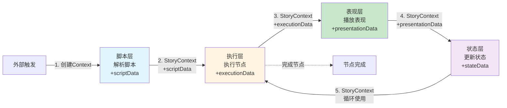
```mermaid
graph LR
    Start[外部触发] -->|1. 创建Context| ScriptL[脚本层<br/>解析脚本<br/>+scriptData]
    ScriptL -->|2. StoryContext<br/>+scriptData| ExecL[执行层<br/>执行节点<br/>+executionData]
    ExecL -->|3. StoryContext<br/>+executionData| PresL[表现层<br/>播放表现<br/>+presentationData]
    PresL -->|4. StoryContext<br/>+presentationData| StateL[状态层<br/>更新状态<br/>+stateData]
    StateL -->|5. StoryContext<br/>循环使用| ExecL
    ExecL -.完成节点.-> End[节点完成]
    
    style ScriptL fill:#e1f5ff
    style ExecL fill:#fff4e1
    style PresL fill:#c8e6c9
    style StateL fill:#f3e5f5
```

---

## 脚本层架构设计

### 核心职责

解析剧情脚本配置 → 构建节点图 → 注册节点类型

### 架构图

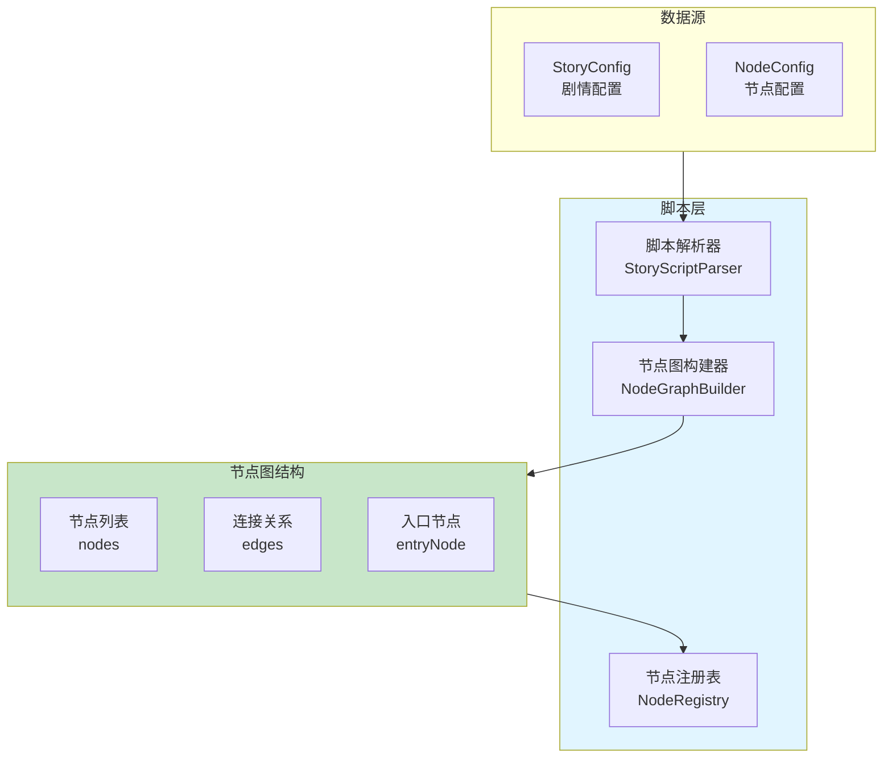
```mermaid
graph TB
    subgraph ScriptLayer["脚本层"]
        direction LR
        ScriptParser["脚本解析器<br/>StoryScriptParser"]
        NodeGraphBuilder["节点图构建器<br/>NodeGraphBuilder"]
        NodeRegistry["节点注册表<br/>NodeRegistry"]
    end
    
    subgraph DataSource["数据源"]
        direction TB
        StoryConfig["StoryConfig<br/>剧情配置"]
        NodeConfig["NodeConfig<br/>节点配置"]
    end
    
    subgraph NodeGraph["节点图结构"]
        direction TB
        Nodes["节点列表<br/>nodes"]
        Edges["连接关系<br/>edges"]
        EntryNode["入口节点<br/>entryNode"]
    end
    
    DataSource --> ScriptParser
    ScriptParser --> NodeGraphBuilder
    NodeGraphBuilder --> NodeGraph
    NodeGraph --> NodeRegistry
    
    style ScriptLayer fill:#e1f5ff
    style NodeGraph fill:#c8e6c9
```

### 核心组件

1. **脚本解析器（StoryScriptParser）**
   - 解析 StoryConfig 配置数据
   - 解析 NodeConfig 节点配置
   - 构建节点图数据结构
   - 验证节点连接关系

2. **节点图构建器（NodeGraphBuilder）**
   - 构建节点图结构（nodes、edges）
   - 识别入口节点
   - 验证节点图完整性
   - 优化节点图结构

3. **节点注册表（NodeRegistry）**
   - 注册节点类型（对话节点、动作节点、分支节点等）
   - 节点类型映射（nodeType → NodeExecutor）
   - 节点工厂模式（创建节点执行器）

### 节点类型定义

**设计理念**：参考战斗架构设计，节点按职责分为四类，每类节点职责单一、可复用

#### 节点分类

- **输入节点（Input Node）**：负责接收玩家输入（如：接收分支选择、接收对话确认、接收跳过操作等）
- **条件节点（Condition Node）**：负责验证、检查、判断，返回判断结果和流程控制建议（如：检查剧情变量、验证分支条件、检查前置条件等）
- **执行节点（Execution Node）**：负责实际执行操作，修改数据（如：执行对话逻辑、执行动作逻辑、更新剧情变量、触发效果同步等）
- **可视化节点（Visual Node）**：负责表现播放（如：播放对话UI、播放Timeline、播放音频、播放动画/特效等）

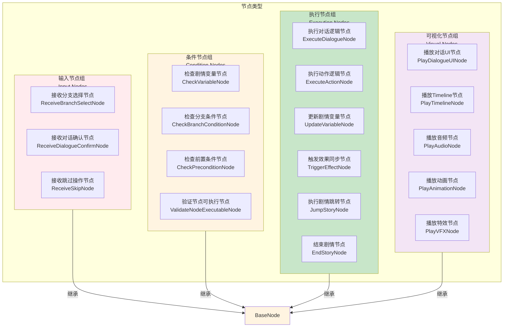
```mermaid
graph TB
    subgraph NodeTypes["节点类型"]
        subgraph InputNodes["输入节点组<br/>Input Nodes"]
            ReceiveBranchSelectNode["接收分支选择节点<br/>ReceiveBranchSelectNode"]
            ReceiveDialogueConfirmNode["接收对话确认节点<br/>ReceiveDialogueConfirmNode"]
            ReceiveSkipNode["接收跳过操作节点<br/>ReceiveSkipNode"]
        end
        
        subgraph ConditionNodes["条件节点组<br/>Condition Nodes"]
            CheckVariableNode["检查剧情变量节点<br/>CheckVariableNode"]
            CheckBranchConditionNode["检查分支条件节点<br/>CheckBranchConditionNode"]
            CheckPreconditionNode["检查前置条件节点<br/>CheckPreconditionNode"]
            ValidateNodeExecutableNode["验证节点可执行节点<br/>ValidateNodeExecutableNode"]
        end
        
        subgraph ExecutionNodes["执行节点组<br/>Execution Nodes"]
            ExecuteDialogueNode["执行对话逻辑节点<br/>ExecuteDialogueNode"]
            ExecuteActionNode["执行动作逻辑节点<br/>ExecuteActionNode"]
            UpdateVariableNode["更新剧情变量节点<br/>UpdateVariableNode"]
            TriggerEffectNode["触发效果同步节点<br/>TriggerEffectNode"]
            JumpStoryNode["执行剧情跳转节点<br/>JumpStoryNode"]
            EndStoryNode["结束剧情节点<br/>EndStoryNode"]
        end
        
        subgraph VisualNodes["可视化节点组<br/>Visual Nodes"]
            PlayDialogueUINode["播放对话UI节点<br/>PlayDialogueUINode"]
            PlayTimelineNode["播放Timeline节点<br/>PlayTimelineNode"]
            PlayAudioNode["播放音频节点<br/>PlayAudioNode"]
            PlayAnimationNode["播放动画节点<br/>PlayAnimationNode"]
            PlayVFXNode["播放特效节点<br/>PlayVFXNode"]
        end
    end
    
    InputNodes -->|继承| BaseNode
    ConditionNodes -->|继承| BaseNode
    ExecutionNodes -->|继承| BaseNode
    VisualNodes -->|继承| BaseNode
    
    style BaseNode fill:#fff4e1
    style InputNodes fill:#ffebee
    style ConditionNodes fill:#fff4e1
    style ExecutionNodes fill:#c8e6c9
    style VisualNodes fill:#f3e5f5
```

---

## 执行层架构设计

### 核心职责

管理当前节点 → 执行节点逻辑 → 选择分支 → 更新状态

### 架构图

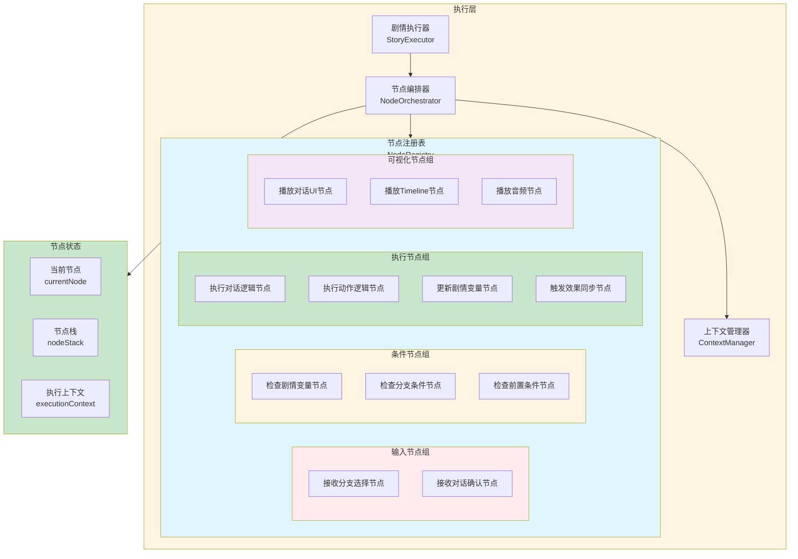
```mermaid
graph TB
    subgraph ExecutionLayer["执行层"]
        StoryExecutor["剧情执行器<br/>StoryExecutor"]
        NodeOrchestrator["节点编排器<br/>NodeOrchestrator"]
        
        subgraph NodeRegistry["节点注册表<br/>NodeRegistry"]
            subgraph InputNodes["输入节点组"]
                ReceiveBranchSelectNode["接收分支选择节点"]
                ReceiveDialogueConfirmNode["接收对话确认节点"]
            end
            
            subgraph ConditionNodes["条件节点组"]
                CheckVariableNode["检查剧情变量节点"]
                CheckBranchConditionNode["检查分支条件节点"]
                CheckPreconditionNode["检查前置条件节点"]
            end
            
            subgraph ExecutionNodes["执行节点组"]
                ExecuteDialogueNode["执行对话逻辑节点"]
                ExecuteActionNode["执行动作逻辑节点"]
                UpdateVariableNode["更新剧情变量节点"]
                TriggerEffectNode["触发效果同步节点"]
            end
            
            subgraph VisualNodes["可视化节点组"]
                PlayDialogueUINode["播放对话UI节点"]
                PlayTimelineNode["播放Timeline节点"]
                PlayAudioNode["播放音频节点"]
            end
        end
        
        ContextManager["上下文管理器<br/>ContextManager"]
    end
    
    subgraph NodeState["节点状态"]
        CurrentNode["当前节点<br/>currentNode"]
        NodeStack["节点栈<br/>nodeStack"]
        ExecutionContext["执行上下文<br/>executionContext"]
    end
    
    StoryExecutor --> NodeOrchestrator
    NodeOrchestrator --> NodeRegistry
    NodeOrchestrator --> ContextManager
    NodeOrchestrator --> NodeState
    
    style ExecutionLayer fill:#fff4e1
    style NodeRegistry fill:#e1f5ff
    style NodeState fill:#c8e6c9
    style InputNodes fill:#ffebee
    style ConditionNodes fill:#fff4e1
    style ExecutionNodes fill:#c8e6c9
    style VisualNodes fill:#f3e5f5
```

### 工作流程

**设计理念**：节点编排器根据配置动态组织节点执行，流程控制根据节点执行结果决定下一个节点

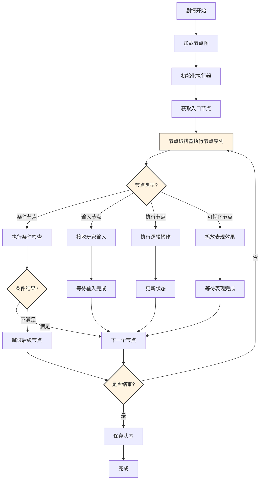
```mermaid
flowchart TD
    Start[剧情开始] --> Load[加载节点图]
    Load --> Init[初始化执行器]
    Init --> GetEntry[获取入口节点]
    GetEntry --> Orchestrate[节点编排器执行节点序列]
    
    Orchestrate --> CheckNodeType{节点类型?}
    
    CheckNodeType -->|条件节点| Condition[执行条件检查]
    CheckNodeType -->|输入节点| Input[接收玩家输入]
    CheckNodeType -->|执行节点| Execution[执行逻辑操作]
    CheckNodeType -->|可视化节点| Visual[播放表现效果]
    
    Condition --> CheckResult{条件结果?}
    CheckResult -->|满足| NextNode[下一个节点]
    CheckResult -->|不满足| SkipNode[跳过后续节点]
    
    Input --> WaitInput[等待输入完成]
    WaitInput --> NextNode
    
    Execution --> UpdateState[更新状态]
    UpdateState --> NextNode
    
    Visual --> WaitVisual[等待表现完成]
    WaitVisual --> NextNode
    
    NextNode --> CheckEnd{是否结束?}
    CheckEnd -->|否| Orchestrate
    CheckEnd -->|是| Save[保存状态]
    Save --> Finish[完成]
    
    SkipNode --> CheckEnd
    
    style Orchestrate fill:#fff4e1,stroke:#333,stroke-width:2px
    style CheckNodeType fill:#fff4e1,stroke:#333,stroke-width:2px
    style CheckResult fill:#fff4e1,stroke:#333,stroke-width:2px
    style CheckEnd fill:#fff4e1,stroke:#333,stroke-width:2px
```

### 核心组件

1. **剧情执行器（StoryExecutor）**
   - 管理当前节点状态
   - 控制节点执行流程
   - 处理节点跳转
   - 管理节点栈（支持嵌套剧情）

2. **节点编排器（NodeOrchestrator）**
   - 管理节点注册表（NodeRegistry）
   - 根据配置动态组织节点执行
   - 根据节点执行结果决定下一个节点
   - 管理执行上下文（Context）
   - 支持节点序列编排（条件节点 → 执行节点 → 可视化节点）

3. **节点注册表（NodeRegistry）**
   - 注册四类节点（输入节点、条件节点、执行节点、可视化节点）
   - 节点类型映射（nodeType → NodeExecutor）
   - 节点工厂模式（创建节点执行器）
   - 支持动态注册新节点类型

4. **节点执行器（NodeExecutor）**
   - 统一的节点执行接口
   - 输入节点：接收玩家输入，等待输入完成
   - 条件节点：执行条件检查，返回判断结果
   - 执行节点：执行逻辑操作，修改数据状态
   - 可视化节点：调用表现层播放表现，等待表现完成

5. **上下文管理器（ContextManager）**
   - 管理执行上下文（StoryContext）
   - 在节点间传递数据
   - 支持上下文增强（管道过滤器模式）

---

## 表现层架构设计

### 核心职责

接收执行请求 → 调用 Visual 系统 → 播放表现效果 → 通知完成

### 架构图

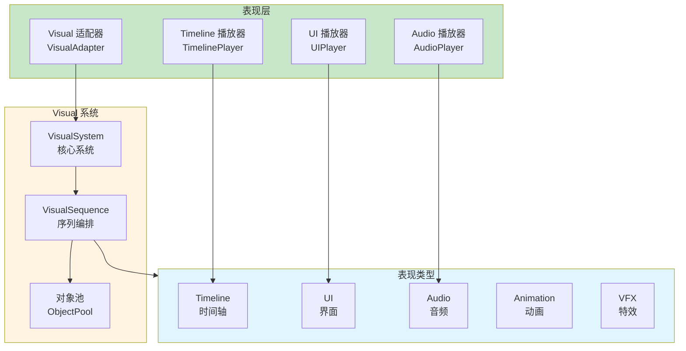
```mermaid
graph TB
    subgraph PresentationLayer["表现层"]
        VisualAdapter["Visual 适配器<br/>VisualAdapter"]
        TimelinePlayer["Timeline 播放器<br/>TimelinePlayer"]
        UIPlayer["UI 播放器<br/>UIPlayer"]
        AudioPlayer["Audio 播放器<br/>AudioPlayer"]
    end
    
    subgraph VisualSystem["Visual 系统"]
        VisualSystemCore["VisualSystem<br/>核心系统"]
        VisualSequence["VisualSequence<br/>序列编排"]
        VisualPool["对象池<br/>ObjectPool"]
    end
    
    subgraph PresentationTypes["表现类型"]
        Timeline["Timeline<br/>时间轴"]
        UI["UI<br/>界面"]
        Audio["Audio<br/>音频"]
        Animation["Animation<br/>动画"]
        VFX["VFX<br/>特效"]
    end
    
    VisualAdapter --> VisualSystemCore
    TimelinePlayer --> Timeline
    UIPlayer --> UI
    AudioPlayer --> Audio
    
    VisualSystemCore --> VisualSequence
    VisualSequence --> VisualPool
    VisualSequence --> PresentationTypes
    
    style PresentationLayer fill:#c8e6c9
    style VisualSystem fill:#fff4e1
    style PresentationTypes fill:#e1f5ff
```

### 工作流程

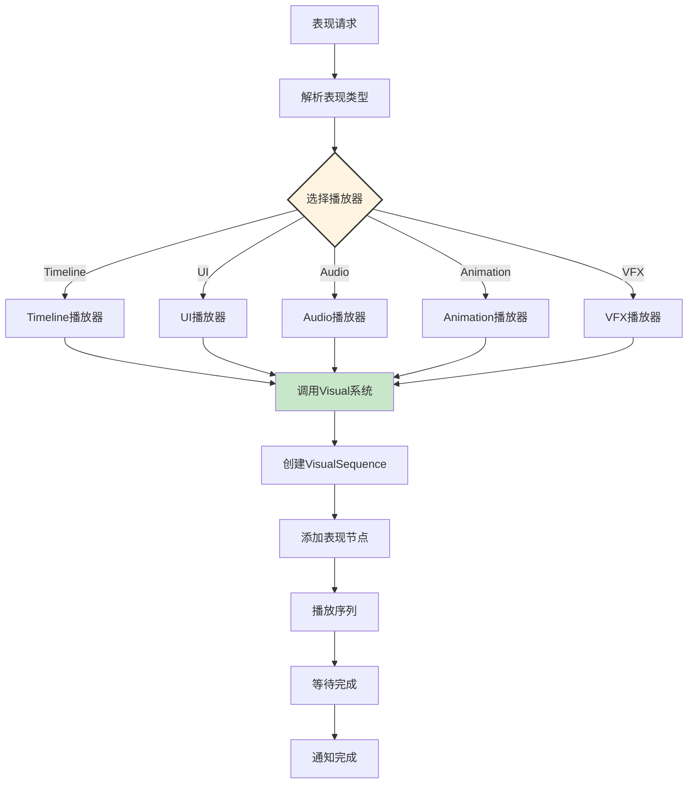
```mermaid
flowchart TD
    Request[表现请求] --> Parse[解析表现类型]
    Parse --> Select{选择播放器}
    
    Select -->|Timeline| Timeline[Timeline播放器]
    Select -->|UI| UI[UI播放器]
    Select -->|Audio| Audio[Audio播放器]
    Select -->|Animation| Animation[Animation播放器]
    Select -->|VFX| VFX[VFX播放器]
    
    Timeline --> Visual[调用Visual系统]
    UI --> Visual
    Audio --> Visual
    Animation --> Visual
    VFX --> Visual
    
    Visual --> Create[创建VisualSequence]
    Create --> Append[添加表现节点]
    Append --> Play[播放序列]
    Play --> Wait[等待完成]
    Wait --> Notify[通知完成]
    
    style Select fill:#fff4e1,stroke:#333,stroke-width:2px
    style Visual fill:#c8e6c9
```

### 核心组件

1. **Visual 适配器（VisualAdapter）**
   - 统一接口封装
   - 表现类型映射
   - 参数转换（StoryContext → VisualContext）
   - 完成回调处理

2. **Timeline 播放器（TimelinePlayer）**
   - 创建 TimelineVisual
   - 配置 Timeline 参数
   - 播放 Timeline
   - 监听播放完成

3. **UI 播放器（UIPlayer）**
   - 打开对话 UI
   - 显示对话内容
   - 等待玩家操作
   - 关闭对话 UI

4. **Audio 播放器（AudioPlayer）**
   - 播放背景音乐
   - 播放音效
   - 音量控制
   - 音频淡入淡出

---

## 状态层架构设计

### 核心职责

管理剧情状态 → 追踪进度 → 保存/恢复 → 持久化

### 架构图

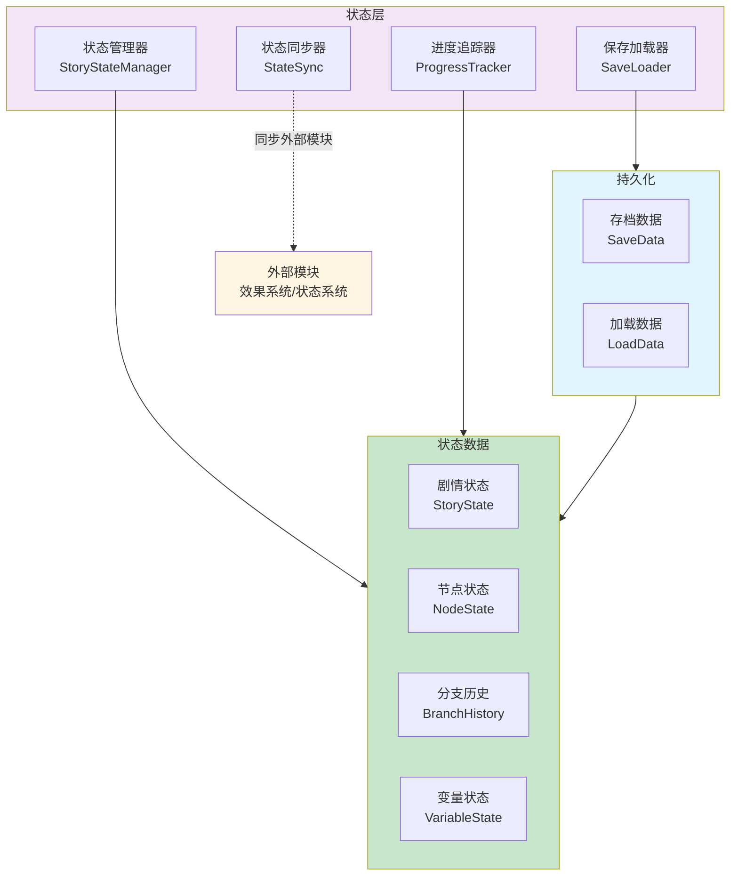
```mermaid
graph TB
    subgraph StateLayer["状态层"]
        StateManager["状态管理器<br/>StoryStateManager"]
        ProgressTracker["进度追踪器<br/>ProgressTracker"]
        SaveLoader["保存加载器<br/>SaveLoader"]
        StateSync["状态同步器<br/>StateSync"]
    end
    
    subgraph StateData["状态数据"]
        StoryState["剧情状态<br/>StoryState"]
        NodeState["节点状态<br/>NodeState"]
        BranchHistory["分支历史<br/>BranchHistory"]
        VariableState["变量状态<br/>VariableState"]
    end
    
    subgraph Persistence["持久化"]
        SaveData["存档数据<br/>SaveData"]
        LoadData["加载数据<br/>LoadData"]
    end
    
    StateManager --> StateData
    ProgressTracker --> StateData
    SaveLoader --> Persistence
    Persistence --> StateData
    StateSync -.->|同步外部模块| ExternalModules["外部模块<br/>效果系统/状态系统"]
    
    style StateLayer fill:#f3e5f5
    style StateData fill:#c8e6c9
    style Persistence fill:#e1f5ff
    style ExternalModules fill:#fff4e1
```

### 状态管理流程

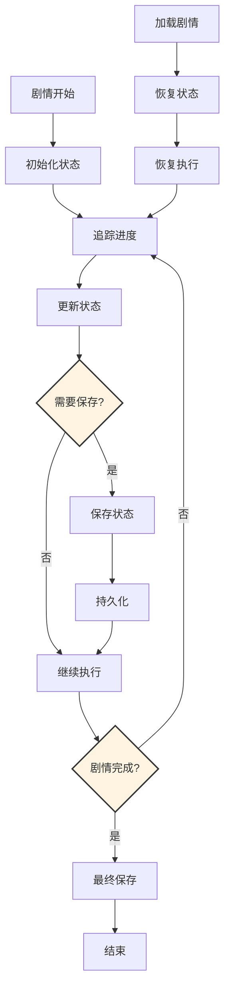
```mermaid
flowchart TD
    Start[剧情开始] --> Init[初始化状态]
    Init --> Track[追踪进度]
    
    Track --> Update[更新状态]
    Update --> Check{需要保存?}
    Check -->|是| Save[保存状态]
    Check -->|否| Continue[继续执行]
    
    Save --> Persist[持久化]
    Persist --> Continue
    
    Continue --> Complete{剧情完成?}
    Complete -->|否| Track
    Complete -->|是| FinalSave[最终保存]
    FinalSave --> End[结束]
    
    Load[加载剧情] --> Restore[恢复状态]
    Restore --> Resume[恢复执行]
    Resume --> Track
    
    style Check fill:#fff4e1,stroke:#333,stroke-width:2px
    style Complete fill:#fff4e1,stroke:#333,stroke-width:2px
```

### 核心组件

1. **状态管理器（StoryStateManager）**
   - 管理剧情状态（未开始/进行中/已完成/已跳过）
   - 管理节点状态（未执行/执行中/已完成）
   - 管理分支历史（记录玩家选择）
   - 管理变量状态（剧情变量、全局变量）

2. **进度追踪器（ProgressTracker）**
   - 追踪剧情进度（当前节点、已完成节点）
   - 追踪分支进度（已选择分支、未选择分支）
   - 追踪完成度（百分比、里程碑）

3. **保存加载器（SaveLoader）**
   - 保存剧情状态到存档
   - 从存档加载剧情状态
   - 支持增量保存（只保存变更）
   - 支持版本兼容（旧存档兼容）

4. **状态同步器（StateSync）**
   - 接收执行层的同步请求和效果参数
   - 根据效果参数配置，调用外部模块接口同步状态/效果
   - 支持同步效果系统、状态系统等其他模块
   - 实现单向数据流，无需回传结果给执行层

---

## 数据层架构设计

### 核心职责

提供配置数据 → 管理资源路径 → 支持数据查询

### 架构图

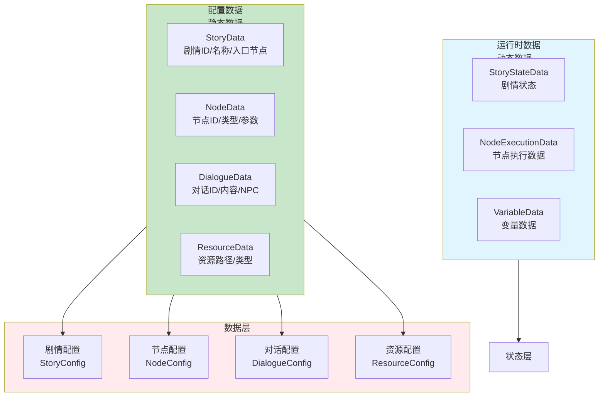
```mermaid
graph TB
    subgraph DataLayer["数据层"]
        StoryConfig["剧情配置<br/>StoryConfig"]
        NodeConfig["节点配置<br/>NodeConfig"]
        DialogueConfig["对话配置<br/>DialogueConfig"]
        ResourceConfig["资源配置<br/>ResourceConfig"]
    end
    
    subgraph ConfigData["配置数据<br/>静态数据"]
        StoryData["StoryData<br/>剧情ID/名称/入口节点"]
        NodeData["NodeData<br/>节点ID/类型/参数"]
        DialogueData["DialogueData<br/>对话ID/内容/NPC"]
        ResourceData["ResourceData<br/>资源路径/类型"]
    end
    
    subgraph RuntimeData["运行时数据<br/>动态数据"]
        StoryStateData["StoryStateData<br/>剧情状态"]
        NodeExecutionData["NodeExecutionData<br/>节点执行数据"]
        VariableData["VariableData<br/>变量数据"]
    end
    
    ConfigData --> StoryConfig
    ConfigData --> NodeConfig
    ConfigData --> DialogueConfig
    ConfigData --> ResourceConfig
    
    RuntimeData --> StateLayer[状态层]
    
    style DataLayer fill:#ffebee
    style ConfigData fill:#c8e6c9
    style RuntimeData fill:#e1f5ff
```

---

## 数据流设计

### 完整数据流

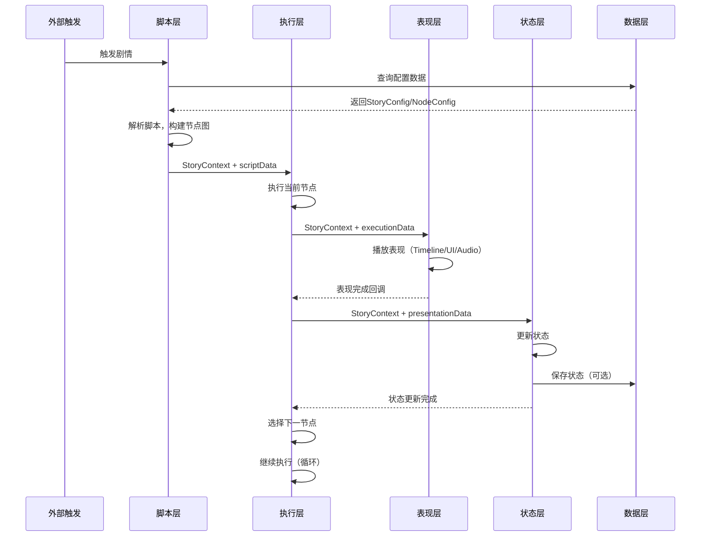
```mermaid
sequenceDiagram
    participant Trigger as 外部触发
    participant Script as 脚本层
    participant Exec as 执行层
    participant Pres as 表现层
    participant State as 状态层
    participant Data as 数据层
    
    Trigger->>Script: 触发剧情
    Script->>Data: 查询配置数据
    Data-->>Script: 返回StoryConfig/NodeConfig
    Script->>Script: 解析脚本，构建节点图
    Script->>Exec: StoryContext + scriptData
    
    Exec->>Exec: 执行当前节点
    Exec->>Pres: StoryContext + executionData
    Pres->>Pres: 播放表现（Timeline/UI/Audio）
    Pres-->>Exec: 表现完成回调
    Exec->>State: StoryContext + presentationData
    
    State->>State: 更新状态
    State->>Data: 保存状态（可选）
    State-->>Exec: 状态更新完成
    Exec->>Exec: 选择下一节点
    Exec->>Exec: 继续执行（循环）
```

### Context 增强过程

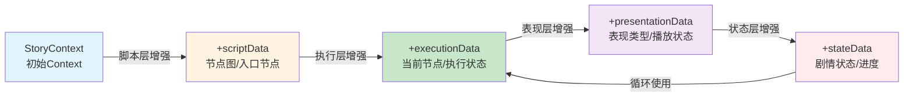
```mermaid
graph LR
    A[StoryContext<br/>初始Context] -->|脚本层增强| B[+scriptData<br/>节点图/入口节点]
    B -->|执行层增强| C[+executionData<br/>当前节点/执行状态]
    C -->|表现层增强| D[+presentationData<br/>表现类型/播放状态]
    D -->|状态层增强| E[+stateData<br/>剧情状态/进度]
    E -->|循环使用| C
    
    style A fill:#e1f5ff
    style B fill:#fff4e1
    style C fill:#c8e6c9
    style D fill:#f3e5f5
    style E fill:#ffebee
```

---

## 与现有系统集成

### Visual 系统集成

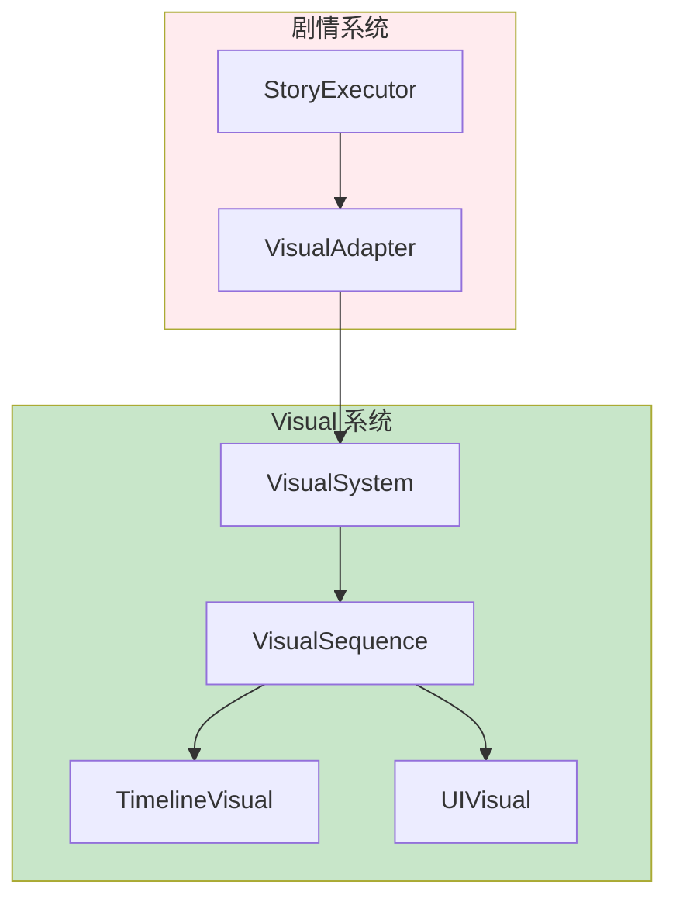
```mermaid
graph TB
    subgraph StorySystem["剧情系统"]
        StoryExecutor["StoryExecutor"]
        VisualAdapter["VisualAdapter"]
    end
    
    subgraph VisualSystem["Visual 系统"]
        VisualSystemCore["VisualSystem"]
        VisualSequence["VisualSequence"]
        TimelineVisual["TimelineVisual"]
        UIVisual["UIVisual"]
    end
    
    StoryExecutor --> VisualAdapter
    VisualAdapter --> VisualSystemCore
    VisualSystemCore --> VisualSequence
    VisualSequence --> TimelineVisual
    VisualSequence --> UIVisual
    
    style StorySystem fill:#ffebee
    style VisualSystem fill:#c8e6c9
```

### Dialogue 系统集成

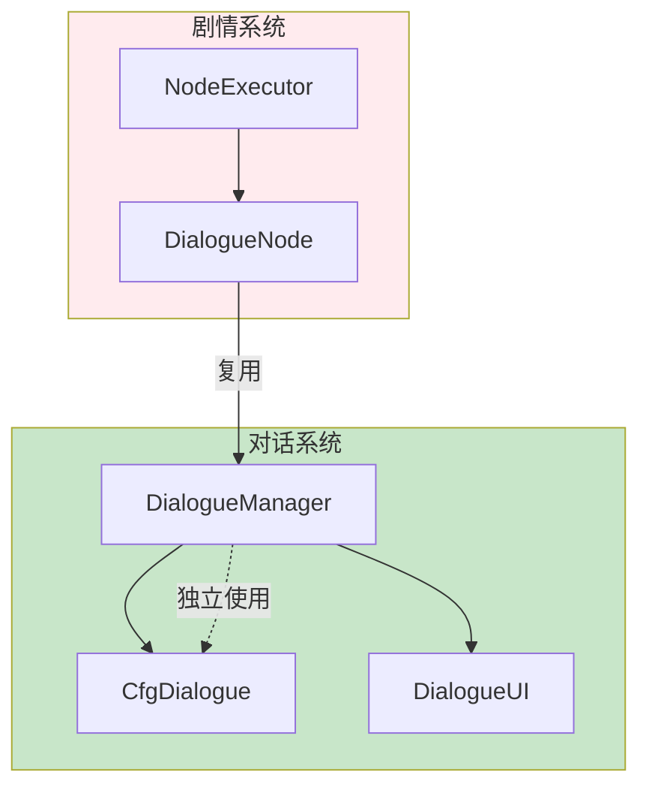
```mermaid
graph TB
    subgraph StorySystem["剧情系统"]
        NodeExecutor["NodeExecutor"]
        DialogueNode["DialogueNode"]
    end
    
    subgraph DialogueSystem["对话系统<br/>（独立使用）"]
        DialogueManager["DialogueManager"]
        CfgDialogue["CfgDialogue"]
        DialogueUI["DialogueUI"]
    end
    
    NodeExecutor --> DialogueNode
    DialogueNode -->|复用| DialogueManager
    DialogueManager --> CfgDialogue
    DialogueManager --> DialogueUI
    
    DialogueManager -.独立使用.-> CfgDialogue
    
    style StorySystem fill:#ffebee
    style DialogueSystem fill:#c8e6c9
```

### Condition 系统集成

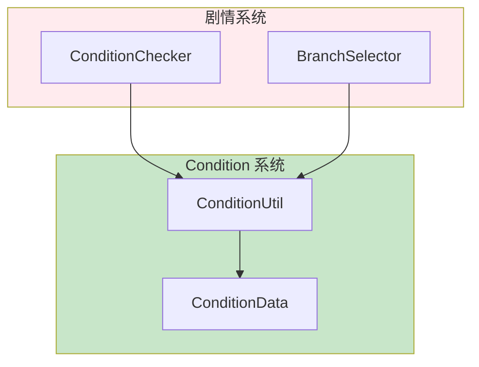
```mermaid
graph TB
    subgraph StorySystem["剧情系统"]
        ConditionChecker["ConditionChecker"]
        BranchSelector["BranchSelector"]
    end
    
    subgraph ConditionSystem["Condition 系统"]
        ConditionUtil["ConditionUtil"]
        ConditionData["ConditionData"]
    end
    
    ConditionChecker --> ConditionUtil
    BranchSelector --> ConditionUtil
    ConditionUtil --> ConditionData
    
    style StorySystem fill:#ffebee
    style ConditionSystem fill:#c8e6c9
```

### DataHandleQueue 集成

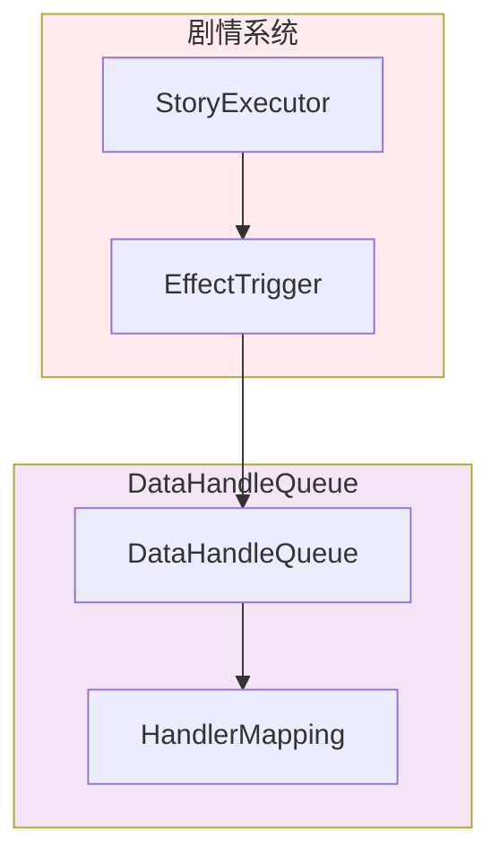
```mermaid
graph TB
    subgraph StorySystem["剧情系统"]
        StoryExecutor["StoryExecutor"]
        EffectTrigger["EffectTrigger"]
    end
    
    subgraph DataQueue["DataHandleQueue"]
        Queue["DataHandleQueue"]
        Handler["HandlerMapping"]
    end
    
    StoryExecutor --> EffectTrigger
    EffectTrigger --> Queue
    Queue --> Handler
    
    style StorySystem fill:#ffebee
    style DataQueue fill:#f3e5f5
```

---

## 高级特性

### 1. 剧情中断与恢复

**设计理念**：通过节点栈实现剧情中断和恢复

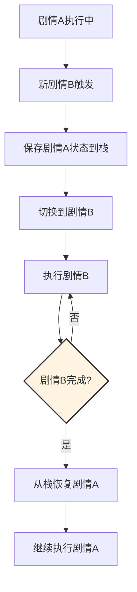
```mermaid
flowchart TD
    StoryA[剧情A执行中] --> Trigger[新剧情B触发]
    Trigger --> Save[保存剧情A状态到栈]
    Save --> Switch[切换到剧情B]
    Switch --> Execute[执行剧情B]
    Execute --> Complete{剧情B完成?}
    Complete -->|是| Restore[从栈恢复剧情A]
    Complete -->|否| Execute
    Restore --> Resume[继续执行剧情A]
    
    style Complete fill:#fff4e1,stroke:#333,stroke-width:2px
```

### 2. 条件分支系统

**设计理念**：通过 Condition 系统实现条件判断

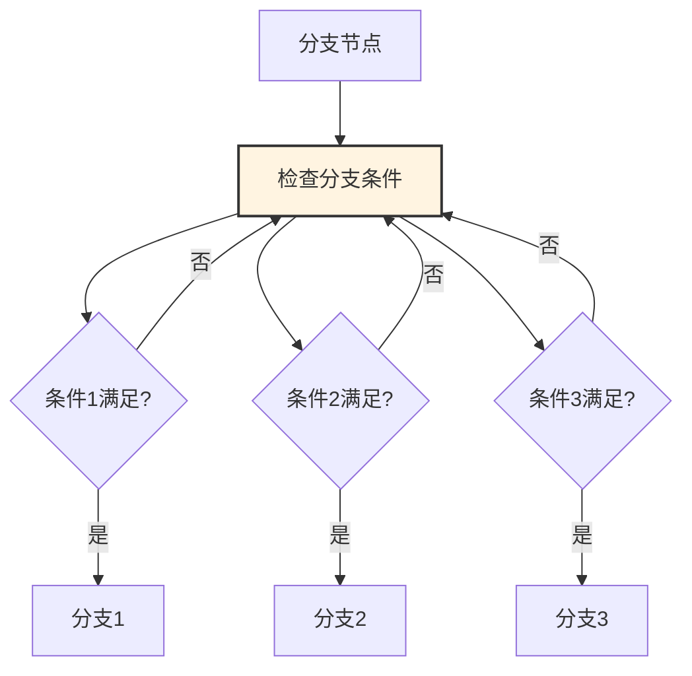
```mermaid
flowchart TD
    BranchNode[分支节点] --> Check[检查分支条件]
    Check --> Condition1{条件1满足?}
    Check --> Condition2{条件2满足?}
    Check --> Condition3{条件3满足?}
    
    Condition1 -->|是| Branch1[分支1]
    Condition2 -->|是| Branch2[分支2]
    Condition3 -->|是| Branch3[分支3]
    
    Condition1 -->|否| Check
    Condition2 -->|否| Check
    Condition3 -->|否| Check
    
    style Check fill:#fff4e1,stroke:#333,stroke-width:2px
```

### 3. 玩家选择分支

**设计理念**：通过 UI 系统实现玩家选择

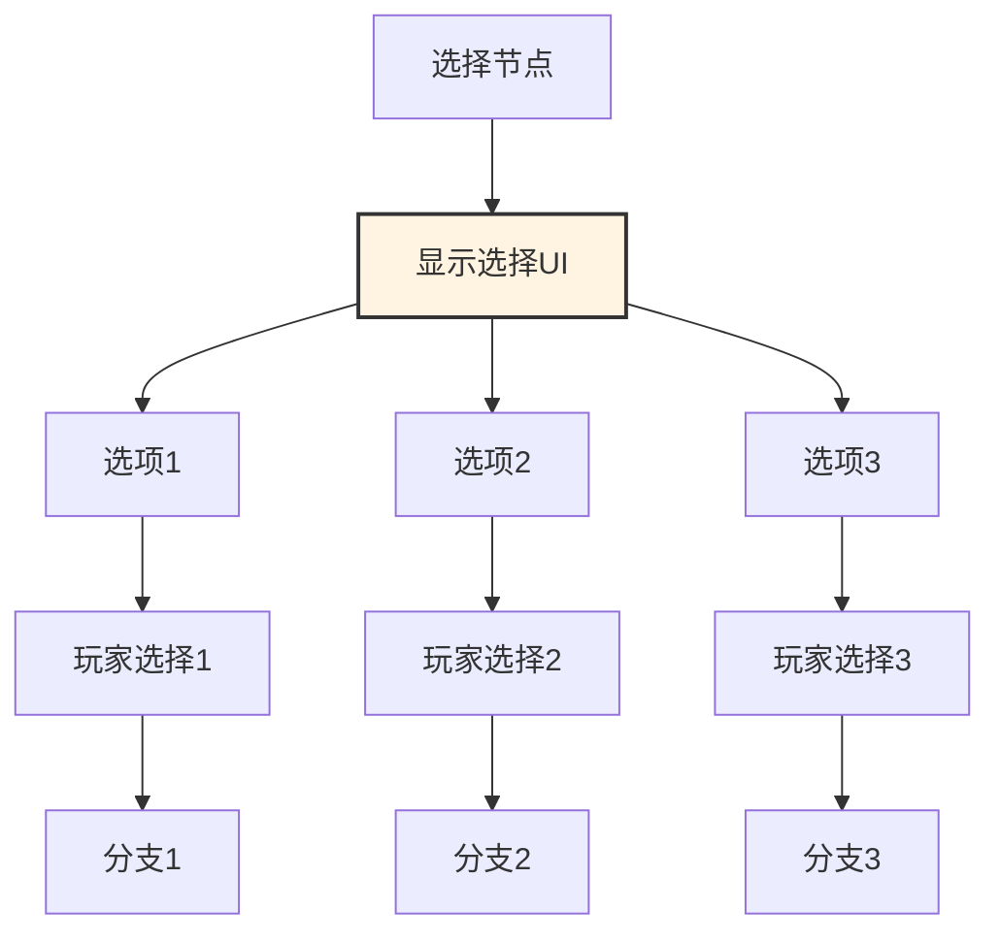
```mermaid
flowchart TD
    ChoiceNode[选择节点] --> Show[显示选择UI]
    Show --> Option1[选项1]
    Show --> Option2[选项2]
    Show --> Option3[选项3]
    
    Option1 --> Select1[玩家选择1]
    Option2 --> Select2[玩家选择2]
    Option3 --> Select3[玩家选择3]
    
    Select1 --> Branch1[分支1]
    Select2 --> Branch2[分支2]
    Select3 --> Branch3[分支3]
    
    style Show fill:#fff4e1,stroke:#333,stroke-width:2px
```

### 4. 剧情变量系统

**设计理念**：通过变量系统实现剧情状态管理

```mermaid
graph LR
    VariableSystem[变量系统] --> GlobalVar[全局变量]
    VariableSystem --> StoryVar[剧情变量]
    VariableSystem --> LocalVar[局部变量]
    
    GlobalVar -->|跨剧情共享| StoryA[剧情A]
    GlobalVar -->|跨剧情共享| StoryB[剧情B]
    
    StoryVar -->|剧情内共享| Node1[节点1]
    StoryVar -->|剧情内共享| Node2[节点2]
    
    LocalVar -->|节点内使用| Node3[节点3]
    
    style VariableSystem fill:#c8e6c9
```

---

## 与对话系统的关系

### 对话系统作为子集

```mermaid
graph TB
    subgraph StorySystem["剧情演出系统"]
        StoryExecutor["StoryExecutor"]
        DialogueNode["DialogueNode<br/>对话节点"]
    end
    
    subgraph DialogueSystem["对话系统<br/>（独立使用）"]
        DialogueManager["DialogueManager"]
        CfgDialogue["CfgDialogue"]
    end
    
    StoryExecutor --> DialogueNode
    DialogueNode -->|复用| DialogueManager
    DialogueManager --> CfgDialogue
    
    DialogueManager -.独立使用.-> CfgDialogue
    
    style StorySystem fill:#ffebee
    style DialogueSystem fill:#c8e6c9
```

**关系说明**：
- ✅ **对话系统独立**：对话系统可以独立使用（NPC对话、任务对话等）
- ✅ **剧情系统复用**：剧情系统通过 DialogueNode 复用对话系统
- ✅ **配置共享**：两者共享 CfgDialogue 配置数据
- ✅ **功能扩展**：剧情系统在对话系统基础上扩展（分支、条件、状态等）

---

## 核心设计特点

### 1. 脚本层：对话树/节点图

**设计特点**：
- ✅ **结构化脚本**：支持对话树、节点图等结构化数据
- ✅ **节点分类清晰**：按职责分为输入节点、条件节点、执行节点、可视化节点四类
- ✅ **节点类型丰富**：每类节点下有多个具体节点类型（如：接收分支选择、检查剧情变量、执行对话逻辑、播放对话UI等）
- ✅ **灵活连接**：支持线性、分支、循环等多种连接方式
- ✅ **配置驱动**：所有节点配置通过数据层管理

### 2. 执行层：节点编排与流程控制

**设计特点**：
- ✅ **节点编排器**：节点编排器根据配置动态组织节点执行
- ✅ **节点分类**：输入节点、条件节点、执行节点、可视化节点四类，职责单一、可复用
- ✅ **统一执行接口**：所有节点类型使用统一的执行接口
- ✅ **流程控制**：节点编排器根据节点执行结果决定下一个节点
- ✅ **分支选择**：支持条件分支和玩家选择分支
- ✅ **节点栈管理**：支持嵌套剧情（剧情A → 剧情B → 返回剧情A）
- ✅ **状态驱动**：通过状态管理控制执行流程

### 3. 表现层：与现有系统解耦

**设计特点**：
- ✅ **Visual 系统集成**：通过 Visual 系统统一管理表现
- ✅ **多类型支持**：Timeline、UI、Audio、Animation、VFX 等
- ✅ **资源管理**：Visual 系统负责资源加载和生命周期
- ✅ **性能优化**：Visual 系统负责对象池和性能优化

### 4. 状态层：保存/恢复与进度追踪

**设计特点**：
- ✅ **完整状态管理**：剧情状态、节点状态、分支历史、变量状态
- ✅ **进度追踪**：追踪剧情进度、分支进度、完成度
- ✅ **保存/恢复**：支持存档系统集成，支持增量保存
- ✅ **版本兼容**：支持旧存档兼容

### 5. 数据层：配置数据管理

**设计特点**：
- ✅ **分层数据**：配置数据（静态）和运行时数据（动态）分离
- ✅ **资源管理**：统一管理 Timeline、音频、动画等资源路径
- ✅ **数据查询**：提供高效的数据查询接口
- ✅ **扩展性**：支持新增节点类型和配置字段

---

## 总结

### 架构设计价值

该架构设计文档的价值在于：
- ✅ **完整解构**：完整解构剧情演出系统的搭建思路
- ✅ **五层架构**：脚本层、执行层、表现层、状态层、数据层清晰分离
- ✅ **系统集成**：与 Visual、Dialogue、Condition、DataHandleQueue 等系统无缝集成
- ✅ **扩展性**：支持新增节点类型、表现类型、分支类型等

### 设计原则

- ✅ **脚本层为核心 + 节点编排**：剧情脚本解析和执行是系统核心，通过节点编排实现灵活流程控制
- ✅ **数据驱动架构**：剧情特性通过配置数据实现
- ✅ **五层架构 + 管道过滤器**：分层架构实现职责分离
- ✅ **表现层解耦**：通过 Visual 系统统一管理表现
- ✅ **节点分类设计**：按职责分为输入节点、条件节点、执行节点、可视化节点四类

### 架构特点

- ✅ **对话树/节点图**：支持结构化脚本数据
- ✅ **节点编排器**：节点编排器根据配置动态组织节点执行
- ✅ **节点分类清晰**：输入节点、条件节点、执行节点、可视化节点四类，职责单一、可复用
- ✅ **统一执行接口**：所有节点类型使用统一接口
- ✅ **Visual 系统集成**：表现层与执行层解耦
- ✅ **完整状态管理**：支持保存/恢复和进度追踪
- ✅ **配置驱动**：所有特性通过配置数据实现

细节实现是后续开发阶段的工作，当前架构设计已足够指导整个剧情演出系统的开发。
