# 🎯 原创设计模式

## 📋 概述

本文档记录项目中原创或创新的设计模式，这些模式在传统设计模式库中不存在，或是对传统模式的创新组合和扩展。这些模式经过实际项目验证，具有独特的价值和适用场景。

---

## 🆕 原创设计模式列表

### 1. Context (上下文模式) ⭐ **原创模式：接口参数归一化**

**核心定义：**
- **接口参数归一化**：所有系统统一使用 `context` 作为函数参数，实现接口稳定性
- **防呆设计**：通过统一的 Context 参数，避免参数顺序错误、参数遗漏等问题
- **简单一致 > 复杂优化**：直接创建 Context，利用 Lua 5.4 分代 GC 自动优化，零心智负担
- **向后兼容**：Context 内部可任意扩展，新增字段不破坏接口，不影响旧代码

**核心价值：**
- **接口稳定**：新增字段不破坏接口，向后兼容，接口长期稳定
- **语义清晰**：自解释的参数命名（如 `context.source`、`context.target`），易于理解
- **跨系统传递**：Context 在调用链中传递，零成本集成，信息逐步累积
- **信息累积**：逐步积累流程数据，完整追踪整个调用链的信息

**核心特点：**
- **接口归一化**：所有系统统一使用 `context` 作为函数参数，接口一致
- **参数灵活性**：Context 内部可任意扩展，不破坏接口
- **零心智负担**：统一标准，直接创建 table，Lua 5.4 自动优化 GC
- **防呆设计**：避免参数顺序错误、参数遗漏、参数类型错误等问题
- **渐进式增强**：功能可以逐步添加到 Context 中，不影响现有代码

**使用规则：**
- ✅ **使用 Context**：参数>3个、可能扩展、需长期稳定、跨系统传递
- ❌ **直接传参**：数学函数、参数固定、局部工具函数、简单计算

**适用场景：**
- 需要统一接口的系统（如 CommunicationBus、Skill、Effect 等）
- 需要跨系统传递数据的场景
- 需要长期稳定接口的系统
- 参数可能扩展的函数
- 需要完整追踪调用链信息的场景

**流程图：**
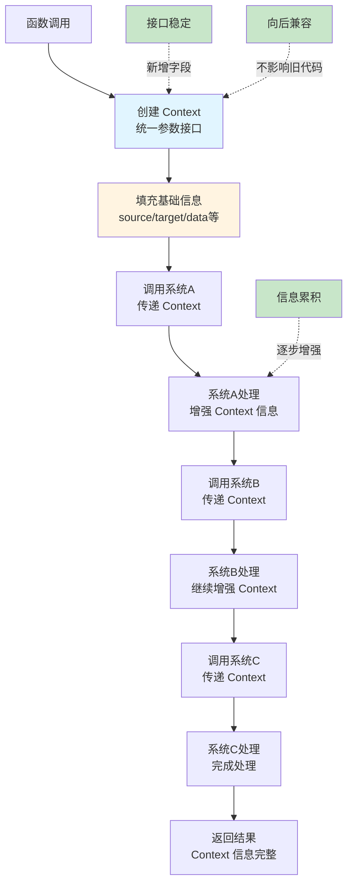

---

### 2. Pipeline-Filter (管道-过滤器模式)

**核心定义：**
- 将复杂处理流程分解为多个独立的过滤器
- 通过管道连接过滤器，数据在管道中流动
- 每个过滤器专注于单一职责

**核心特点：**
- **数据流处理**：数据在管道中单向流动
- **过滤器独立**：每个过滤器可独立开发、测试、替换
- **组合灵活**：通过组合不同过滤器实现复杂流程
- **易于扩展**：新增过滤器不影响现有流程

**适用场景：**
- 数据处理流水线
- 数据转换流程
- 多步骤验证流程
- 日志处理系统

**流程图：**
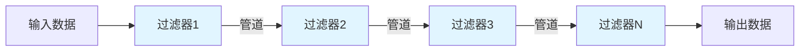

---

### 3. Domain Controls Loop (领域控制循环模式)

**核心定义：**
- **Domain控制循环**：Domain是领域核心，拥有循环机制来推进业务流程
- **循环是Domain的工具**：循环不是主导，Domain才是主导，循环服务于Domain
- **协调器推动循环**：Domain管理通过协调器控制循环状态转换，协调器执行完业务后，主动推动循环进入下一个状态
- **多层循环架构**：支持多层Domain循环（如战斗循环→回合循环→单位循环），每层Domain独立管理自己的循环

**核心特点：**
- **Domain主导**：Domain是领域核心，拥有循环机制，循环是Domain的工具
- **协调器控制**：Domain管理通过协调器控制循环状态转换
- **主动推动**：协调器执行完业务后，主动推动循环进入下一个状态（反向推动）
- **多层嵌套**：支持多层Domain循环，父Domain调用子Domain，子Domain完成业务后返回
- **状态维护**：每层循环维护自己的状态，驱动下层循环

**适用场景：**
- 领域驱动设计
- 业务逻辑复杂的系统（如战斗系统、回合制游戏）
- 需要多层循环管理的场景
- 需要领域层独立测试的场景

**流程图：**

#### Domain与循环的关系
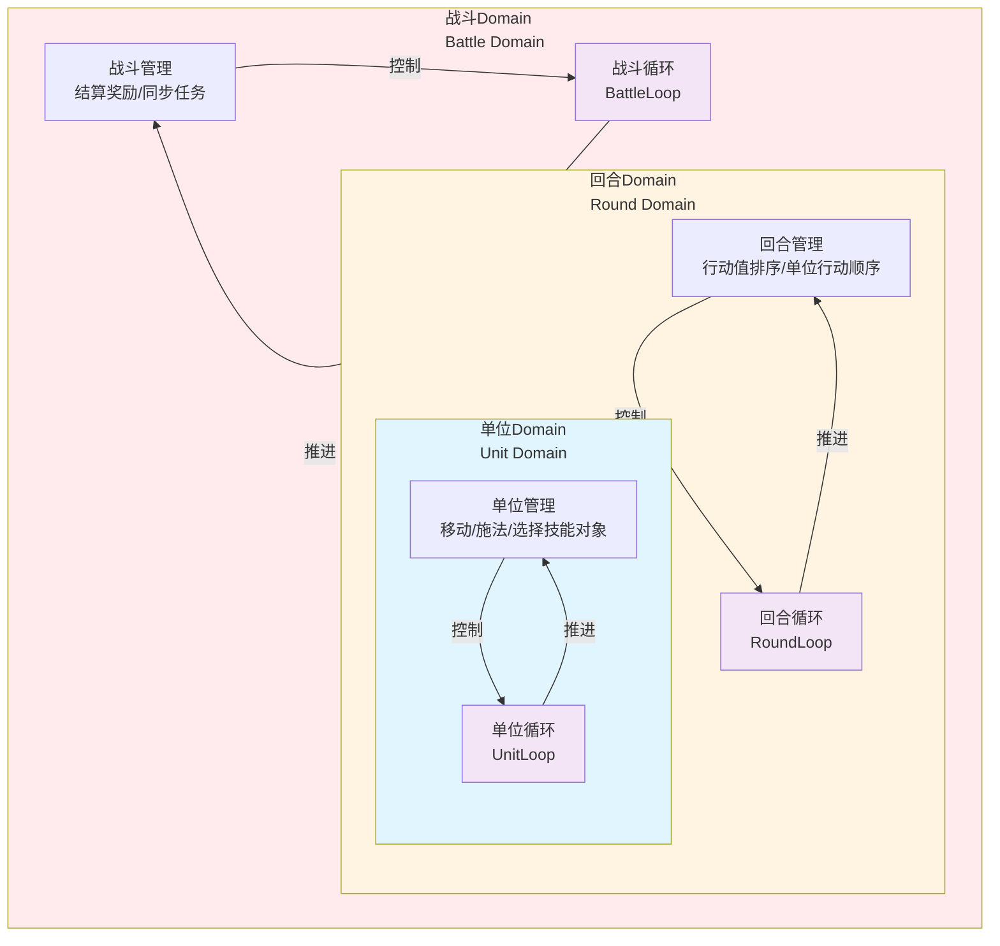


#### 协调器推动循环流程
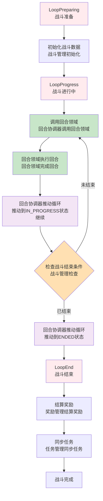

---

### 4. Microkernel (微内核模式)

**核心定义：**
- 核心系统提供最小功能集
- 通过插件机制扩展功能
- 核心与插件解耦，支持动态加载

**核心特点：**
- **最小核心**：核心只提供基础功能
- **插件扩展**：功能通过插件动态添加
- **热插拔**：支持运行时加载/卸载插件
- **松耦合**：插件之间相互独立

**适用场景：**
- 需要动态扩展的系统
- 插件化架构
- 可配置的系统
- 框架设计

**流程图：**
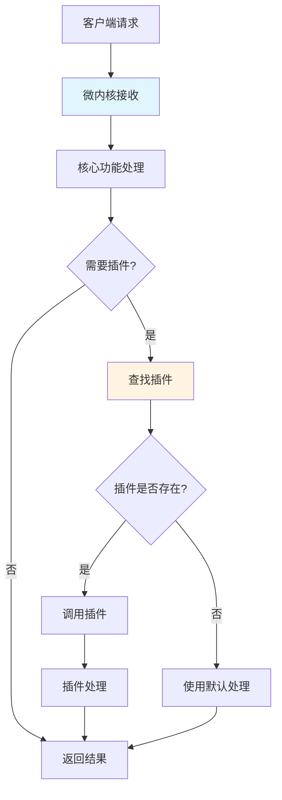

---

### 5. Formula System (公式系统)

**核心定义：**
- 三层架构：字符串解析 → Lua函数编译 → 执行
- 支持动态公式计算
- 通过编译优化性能

**核心特点：**
- **三层架构**：解析层、编译层、执行层
- **动态编译**：字符串公式编译为 Lua 函数
- **性能优化**：编译后执行，避免重复解析
- **缓存机制**：编译结果缓存，提高效率

**适用场景：**
- 动态公式计算
- 规则引擎
- 配置驱动的计算
- 技能系统

**流程图：**

#### 三级公式架构 + 职责分离
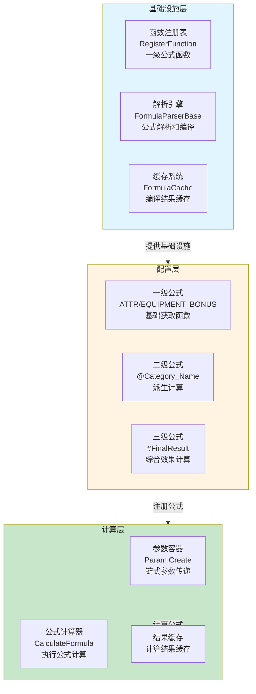

#### 三级公式数据流（计算合成）
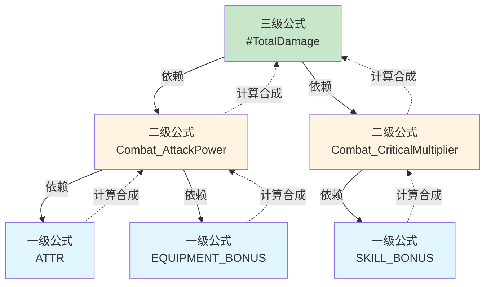

#### 三层解析和执行流程
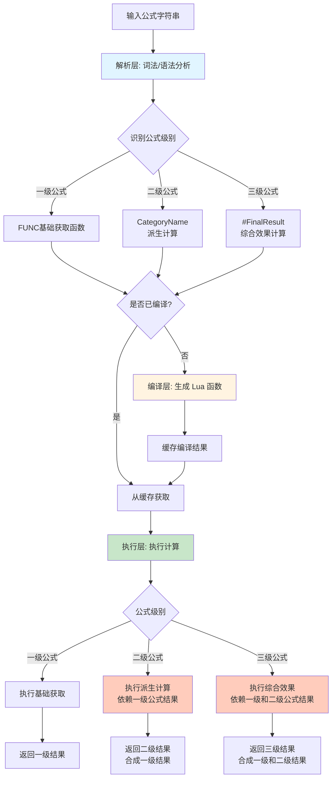

**三级公式核心特性：**
- ✅ **三级分层**：一级 → 二级 → 三级，逐层计算合成
- ✅ **职责分离**：程序员提供一级函数，策划编写二级和三级公式
- ✅ **字符匹配**：通过字符匹配规则识别公式级别（#三级、@二级、FUNC一级）
- ✅ **计算合成**：一级公式结果合成二级公式，二级公式结果合成三级公式
- ✅ **自动缓存**：编译结果自动缓存，提升性能

---

### 6. CommunicationBus (通讯总线) ⭐ **原创：多频道架构**

**核心定义：**
- 统一的通讯总线系统，通过多频道架构提供多种通信模式
- 四种频道：发布-订阅、点对点、数据推送、请求-响应
- 统一接口层路由到不同频道

**核心特点：**
- **多频道架构**：EventChannel、MessageChannel、PushChannel、QueryChannel
- **统一接口**：CommunicationBus 提供统一入口
- **路由机制**：根据通信类型自动路由到对应频道
- **解耦设计**：应用层不直接依赖具体频道实现

**适用场景：**
- 需要多种通信模式的系统
- 事件驱动架构
- 模块间解耦通信
- 游戏开发中的各种通信需求

**流程图：**
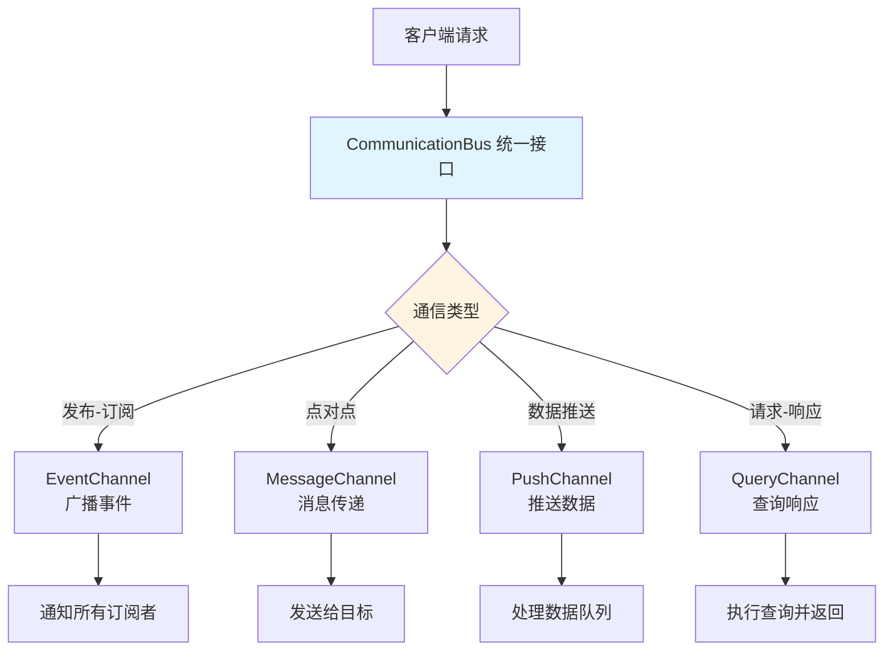

---

### 7. Template Configuration (模板化配置模式)

**核心定义：**
- 通过模板ID完成完整配置
- 模板自动查找组件并初始化
- 同一个模板支持不同的参数配置

**核心特点：**
- **模板驱动**：一个模板ID即可完成完整配置
- **自动查找**：系统自动查找所需组件，无需手动添加
- **参数化配置**：同一个模板可以有不同的参数配置
- **统一流程**：所有类型使用统一的初始化流程

**适用场景：**
- 需要快速配置相似对象的系统
- 数据驱动的配置系统
- 组件自动初始化场景
- 交互系统、技能系统等

**流程图：**

#### 三层架构 + 模板方法模式
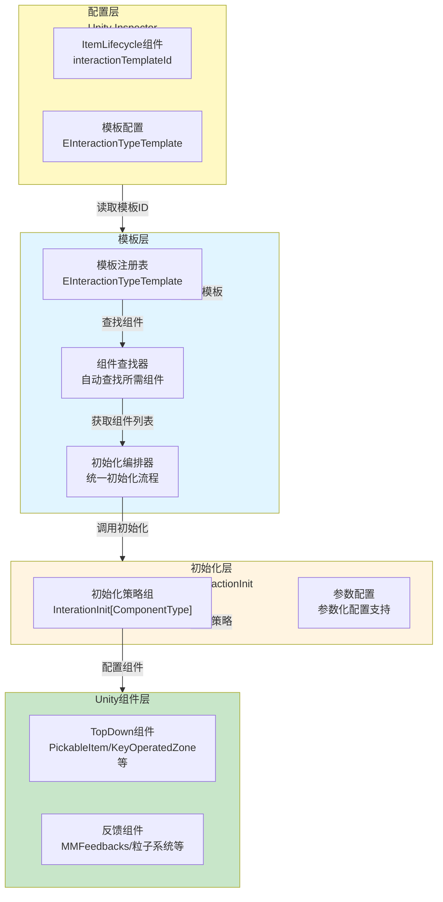

#### 模板方法数据流
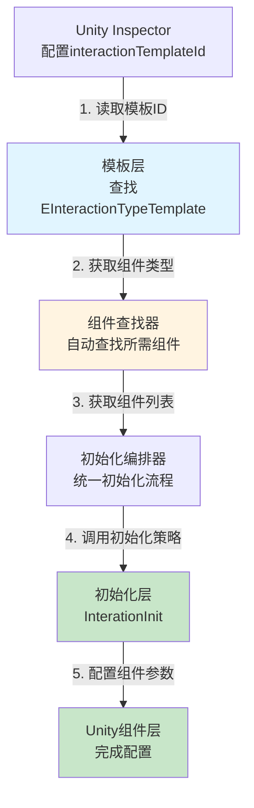

**模板化核心特性：**
- ✅ **模板驱动**：一个模板ID即可完成完整配置
- ✅ **自动查找**：系统自动查找所需组件，无需手动添加
- ✅ **统一流程**：所有交互类型使用统一的初始化流程
- ✅ **参数化配置**：同一个模板可以有不同的参数配置
- ✅ **策略模式**：每个组件类型对应一个初始化策略
- ✅ **外观模式**：隐藏复杂的初始化逻辑，提供简单的配置接口

---

### 8. Condition-Action Decoupling (条件-动作解耦模式)

**核心定义：**
- 条件与动作完全解耦
- 通过枚举ID建立映射关系
- 支持1对多、多对1、多对多的灵活绑定

**核心特点：**
- **完全解耦**：条件检查和动作执行独立
- **灵活绑定**：支持多种绑定关系（1对1、1对多、多对1、多对多）
- **映射表管理**：通过映射表管理条件-动作关系
- **易于扩展**：新增条件或动作不影响现有逻辑

**适用场景：**
- 触发器系统
- 规则引擎
- 事件响应系统
- 条件驱动的行为系统

**流程图：**
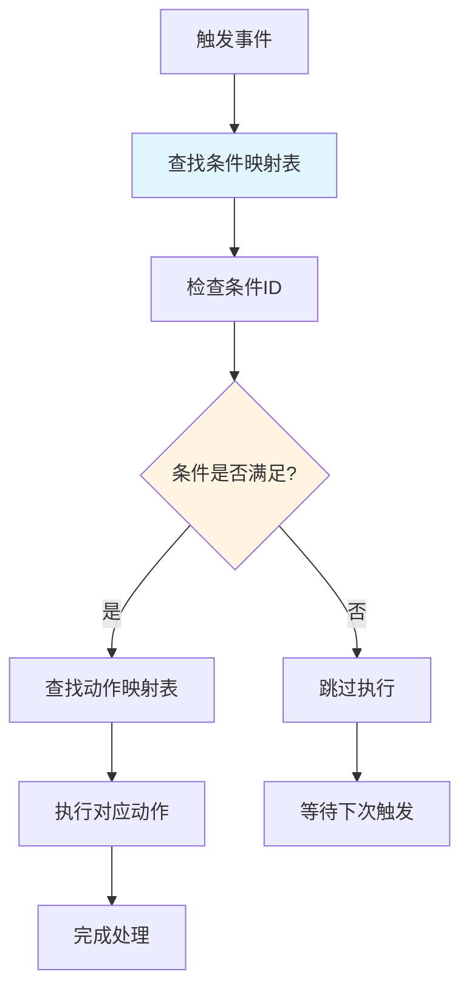

---

### 9. Handler Strategy (Handler策略模式)

**核心定义：**
- 通过Handler组件的顺序执行实现复杂流程
- 每个Handler专注单一职责
- 使用统一的Context传递数据

**核心特点：**
- **策略组合**：Handler组件灵活组合
- **管道执行**：Handler按顺序执行，逐步增强Context
- **单一职责**：每个Handler专注单一功能
- **易于扩展**：新增Handler不影响现有流程

**适用场景：**
- 技能系统
- 效果系统
- 多步骤处理流程
- 需要灵活组合的处理系统

**流程图：**
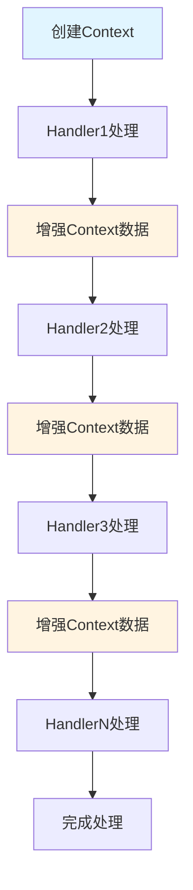

---

### 10. Real-time Fetch (实时获取模式)

**核心定义：**
- 每次获取数据时实时计算，不依赖缓存
- 遍历所有子系统收集最新数据
- 零dirty标记，避免数据同步问题

**核心特点：**
- **实时计算**：每次获取都是最新数据
- **零dirty标记**：不依赖dirty标记机制
- **按需计算**：只计算需要的属性
- **数据一致性**：保证数据始终是最新的

**适用场景：**
- 属性计算系统
- 多子系统数据汇总
- 需要实时准确数据的场景
- 避免数据同步问题的系统

**流程图：**
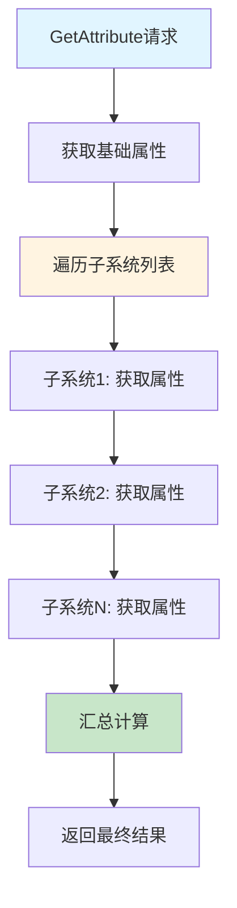

---

### 11. DataHandleQueue (数据队列解耦模式) ⭐ **原创：责任链 + 队列解耦 + 推送链**

**核心定义：**
- 通过队列实现模块间解耦通信，支持数据推送和查询委托两种机制
- **责任链特性**：多个处理器按顺序处理数据，每个处理器检查是否有自己需要处理的数据类型
- **推送链特性**：处理一个数据类型时可以触发下一个数据类型的推送，形成链式数据流
- 模块通过队列发送和接收数据，不直接相互调用
- 处理器映射表管理不同类型的处理，查询委托表管理查询接口

**核心特点：**
- **双重机制**：
  - **数据推送机制**：PushData + ProcessDataHandler，用于数据变化通知
  - **查询委托机制**：SetQueryDelegate，用于统一查询接口
- **责任链处理**：
  - 多个处理器（handlers）按顺序排列
  - 每个处理器检查是否有自己需要处理的数据类型
  - 如果有数据，就处理并可能提前返回
  - 如果没有，就继续传递给下一个处理器（通过遍历机制）
- **推送链机制**：
  - 处理数据类型A时，可以推送数据类型B，形成链式处理
  - 支持复杂的数据依赖关系，实现数据驱动的级联处理
  - 推送链中的每个环节相互独立，解耦设计
  - 典型应用：装备安装 → 专长安装 → 技能数据 → 效果数据
- **队列解耦**：模块间通过队列通信，不直接依赖
- **处理器映射**：通过 SetProcessHandleMapping 注册处理器映射表
- **查询统一**：通过 SetQueryDelegate 统一管理查询接口
- **模块独立**：模块可以独立开发、测试，通过队列解耦

**使用方式（以 UnitData 为例）：**
1. **初始化**：创建 DataHandleQueue，将所有子系统添加为 Handler
2. **注册处理器**：各子系统通过 `SetProcessHandleMapping()` 注册数据处理器
3. **注册查询**：通过 `SetQueryDelegate(queryId, function)` 注册查询函数
4. **数据推送**：外部系统通过 `PushData(dataType, data)` 推送数据变化
5. **处理数据**：调用 `ProcessDataHandler()` 批量处理队列中的数据

**适用场景：**
- 多子系统协同的系统（如 UnitData 管理装备、技能、状态等子系统）
- 模块间解耦通信
- 需要统一查询接口的系统
- 数据变化需要通知多个模块的场景
- 复杂的数据依赖关系（通过推送链实现级联处理）
- 数据驱动的业务逻辑（装备→专长→技能→效果的链式处理）

**流程图：**
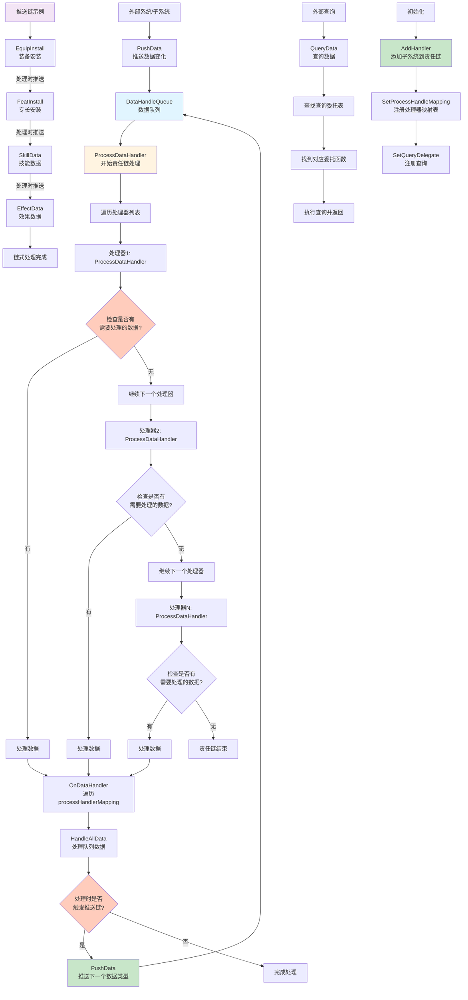

---

### 12. Effective Range (有效范围优化模式) ⭐ **原创：智能范围限制**

**核心定义：**
- 只处理玩家周围有效范围内的数据，大幅降低计算和内存开销
- 通过智能范围限制，实现2268倍性能提升
- 结合位图优化和Shader可视化，实现高性能网格系统

**核心特点：**
- **智能范围**：只处理有效范围内的数据，忽略无效区域
- **性能提升**：内存占用从1000000降低到441，2268倍提升
- **位图优化**：O(1)复杂度查询，85%性能提升
- **Shader可视化**：单DrawCall渲染，极低开销

**适用场景：**
- 大型网格系统
- 空间查询系统
- 碰撞检测系统
- 需要处理大量空间数据的场景

**流程图：**
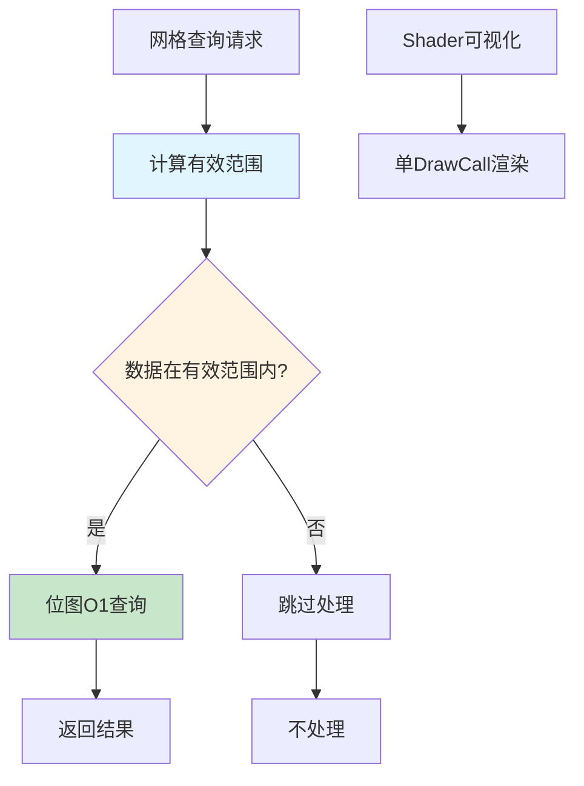

---

### 13. Delegate Pattern Pathfinding (委托模式寻路) ⭐ **原创：算法无关性设计**

**核心定义：**
- 通过委托模式消除硬编码，实现算法无关性设计
- 支持6种寻路算法，智能推荐最优算法
- 统一数据结构，零拆装箱，高性能

**核心特点：**
- **算法无关**：通过委托模式消除硬编码，算法可替换
- **智能推荐**：根据网格大小、权重情况、精度要求自动推荐最优算法
- **零拆装箱**：统一数据结构，避免性能损耗
- **灵活扩展**：新增算法不影响现有代码

**适用场景：**
- 寻路系统
- 路径规划系统
- 需要多种算法选择的场景
- 算法性能对比和优化

**流程图：**
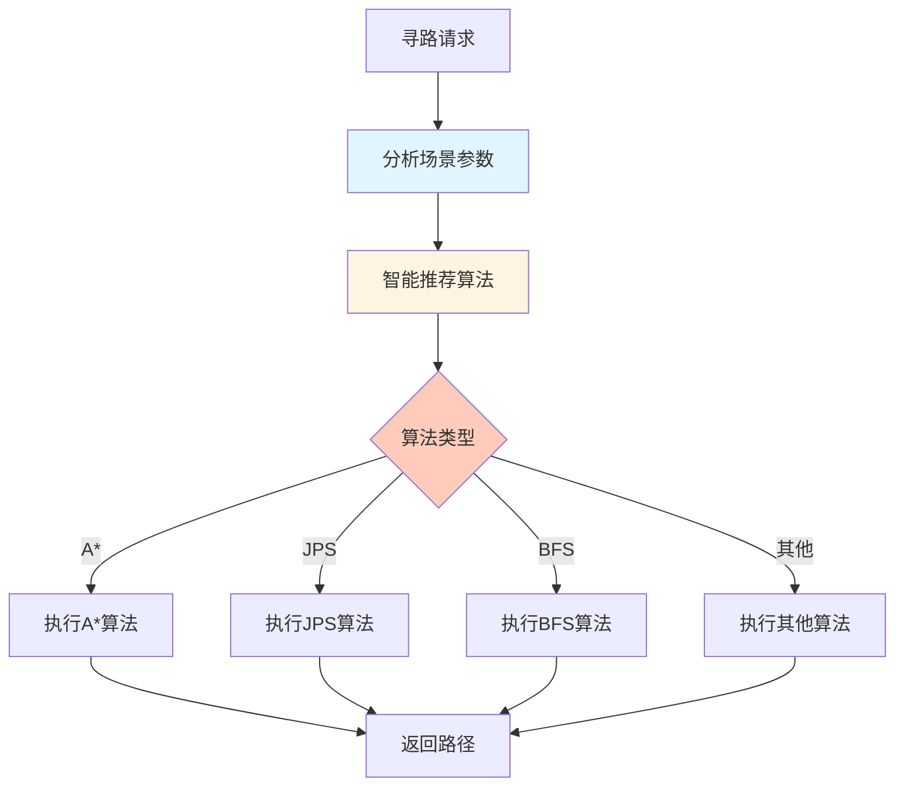

---

### 14. Scope Mechanism (作用域机制) ⭐ **原创：多维度消息过滤**

**核心定义：**
- 通过四种作用域类型过滤消息接收者
- 实现精确的消息路由，避免不必要的消息传递
- 支持全局、局部、组、距离等多种作用域

**核心特点：**
- **四种作用域**：Global、Local、Group、Range
- **精确过滤**：根据作用域类型精确过滤接收者
- **性能优化**：避免不必要的消息传递和处理
- **灵活配置**：支持多种作用域组合使用

**适用场景：**
- 事件系统
- 消息系统
- 需要精确消息路由的场景
- 多人游戏中的消息分发

**流程图：**
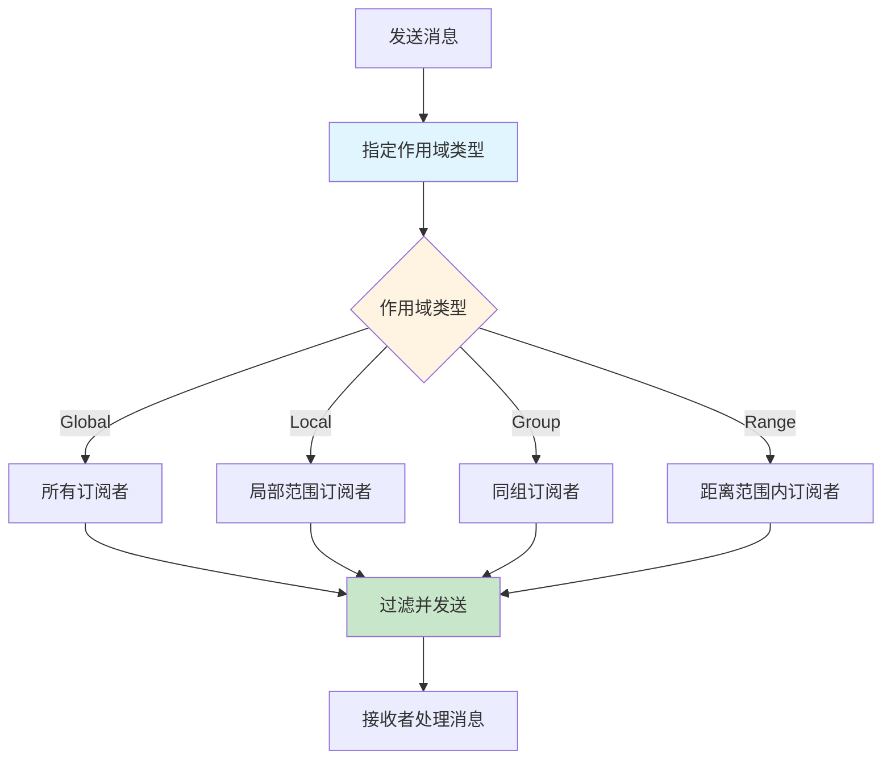

---

### 15. Lifecycle Bridge (生命周期桥接模式) ⭐ **原创：C#-Lua自动映射**

**核心定义：**
- 通过自动映射机制实现C#和Lua之间的生命周期桥接
- 统一生命周期管理，支持所有Unity生命周期事件
- 通过mappingName自动映射Lua函数，零配置

**核心特点：**
- **自动映射**：通过mappingName自动映射Lua函数
- **完整生命周期**：支持所有Unity生命周期事件
- **零配置**：无需手动配置映射关系
- **编辑器工具**：自动生成对应的Lua函数文件

**适用场景：**
- C#-Lua混合架构
- Unity生命周期管理
- 需要C#和Lua交互的场景
- 快速开发原型

**流程图：**
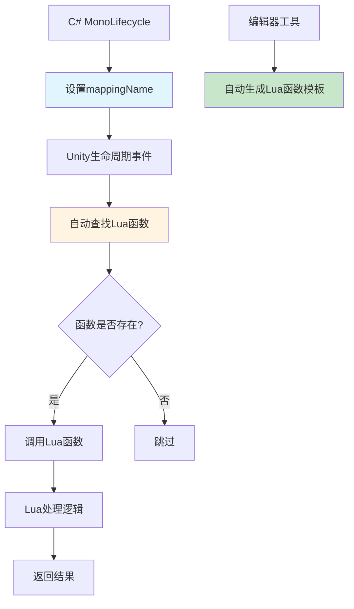

---

## 📊 原创模式分类

### 原创设计模式分类

```
原创设计模式 (Original Design Patterns)
├── Context (上下文模式) ⭐ - 接口参数归一化，防呆设计，向后兼容，利用 Lua 5.4 分代 GC（完全原创）
├── CommunicationBus (通讯总线模式) ⭐ - 多频道架构，统一路由（原创组合）
├── DataHandleQueue (数据队列解耦模式) ⭐ - 责任链 + 队列解耦 + 推送链，三重机制（原创组合）
├── EffectiveRange (有效范围优化模式) ⭐ - 智能范围限制，2268倍性能提升（原创优化）
├── DelegatePatternPathfinding (委托模式寻路) ⭐ - 算法无关性设计，智能推荐（原创设计）
├── ScopeMechanism (作用域机制) ⭐ - 多维度消息过滤，精确路由（原创机制）
├── LifecycleBridge (生命周期桥接模式) ⭐ - C#-Lua自动映射，零配置（原创桥接）
├── TemplateConfiguration (模板化配置模式) - 模板驱动，自动初始化（创新应用）
├── HandlerStrategy (Handler策略模式) - Handler组合，管道执行（创新应用）
├── RealTimeFetch (实时获取模式) - 实时计算，零dirty标记（创新思路）
└── ConditionActionDecoupling (条件-动作解耦模式) - 条件动作分离，灵活绑定（创新应用）

传统模式创新应用 (Innovative Applications of Traditional Patterns)
├── PipelineFilter (管道-过滤器模式) - 数据流处理，过滤器组合
├── DomainControlsLoop (领域控制循环模式) - 领域驱动，循环处理
├── Microkernel (微内核模式) - 最小核心，插件扩展
└── FormulaSystem (公式系统模式) - 三层架构，动态编译
```

---

## 🎯 原创模式价值评估

### 完全原创模式 ⭐⭐⭐
1. **Context (上下文模式)** - 完全原创，接口参数归一化+防呆设计+向后兼容，利用 Lua 5.4 分代 GC 支持其设计价值
2. **CommunicationBus (通讯总线模式)** - 原创多频道架构设计
3. **DataHandleQueue (数据队列解耦模式)** - 原创组合：责任链+队列解耦+推送链，三重机制
4. **Effective Range (有效范围优化模式)** - 原创智能范围限制，2268倍性能提升
5. **Delegate Pattern Pathfinding (委托模式寻路)** - 原创算法无关性设计
6. **Scope Mechanism (作用域机制)** - 原创多维度消息过滤
7. **Lifecycle Bridge (生命周期桥接模式)** - 原创C#-Lua自动映射

### 创新应用模式 ⭐⭐
4. **Template Configuration (模板化配置模式)** - 模板驱动的创新应用
5. **Handler Strategy (Handler策略模式)** - Handler组合的创新应用
6. **Real-time Fetch (实时获取模式)** - 零dirty标记的创新思路
7. **Condition-Action Decoupling (条件-动作解耦模式)** - 条件动作分离的创新应用

### 传统模式创新应用 ⭐
8. **Pipeline-Filter (管道-过滤器模式)** - 传统模式的项目应用
9. **Domain Controls Loop (领域控制循环模式)** - DDD模式的项目应用
10. **Microkernel (微内核模式)** - 传统模式的项目应用
11. **Formula System (公式系统模式)** - 编译模式的创新应用

---

## 💡 设计思路总结

### 核心设计理念
1. **解构结构** - 将复杂系统分解为简单组件
2. **统一接口** - 通过统一入口简化调用
3. **渐进式增强** - 功能可逐步添加，不破坏现有结构
4. **数据驱动** - 通过配置数据驱动行为
5. **状态管理** - 统一管理状态，避免分散

### 设计原则
- **单一职责** - 每个组件专注单一功能
- **开闭原则** - 对扩展开放，对修改关闭
- **依赖倒置** - 依赖抽象而非具体实现
- **接口隔离** - 提供最小必要接口
- **里氏替换** - 子类可替换父类

---

## 📝 原创模式的价值

### 核心价值
1. **解决实际问题** - 这些模式都来自实际项目需求，解决了传统模式无法很好解决的问题
2. **经过验证** - 所有模式都在项目中实际使用，经过验证
3. **可复用** - 模式设计通用，可在其他项目中复用
4. **创新组合** - 通过组合传统模式，创造出新的解决方案

### 与传统模式的区别
- **Context模式**：传统模式中没有接口参数归一化的设计理念，Context 模式通过统一使用 context 参数实现接口稳定性、防呆设计、向后兼容，并利用 Lua 5.4 分代 GC 支持其设计价值
- **CommunicationBus**：传统事件总线只有发布-订阅，这里创新性地组合了4种通信模式，并增加了作用域机制和推送链
- **DataHandleQueue**：责任链+队列解耦+推送链的三重组合，解决了多子系统协同和级联处理的问题
- **Effective Range**：传统网格系统处理全量数据，这里通过智能范围限制实现2268倍性能提升
- **Delegate Pattern Pathfinding**：传统寻路系统硬编码算法，这里通过委托模式实现算法无关性，支持智能推荐
- **Scope Mechanism**：传统消息系统只有全局广播，这里创新性地实现了4种作用域类型，精确过滤消息
- **Lifecycle Bridge**：传统C#-Lua桥接需要手动配置，这里通过自动映射实现零配置桥接

### 应用建议
1. 在项目初期考虑使用这些原创模式
2. 根据项目需求选择合适的模式组合
3. 理解模式的核心思想，而非照搬实现
4. 根据实际情况调整和优化模式实现
