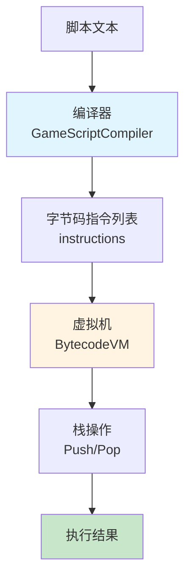
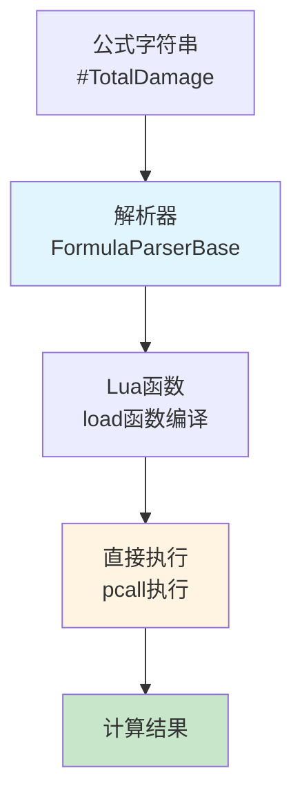

# 字节码模式与公式系统对比分析

## 核心结论

**是的，非常像！** 两者都是**"编译-执行"模式**，但实现层次不同：

- **字节码模式**：高级语言 → **字节码** → 虚拟机执行
- **公式系统**：公式字符串 → **Lua函数** → 直接执行

### 💡 直观理解：字节码 = 翻译字典

**字节码模式的核心就是创建一套"翻译字典"**：

```lua
-- 翻译字典（OPCODES）
OPCODES = {
    ["ADD"] = function() ... end,      -- 加法翻译规则
    ["SUB"] = function() ... end,      -- 减法翻译规则
    ["MUL"] = function() ... end,      -- 乘法翻译规则
    ["JUMP"] = function() ... end,     -- 跳转翻译规则
    -- ... 更多翻译规则
}

-- 使用方式
指令 = "ADD"  -- 高级语言
↓ 查字典
OPCODES["ADD"].execute()  -- 执行翻译后的操作
```

**工作流程**：
1. **编译器**：将高级语言翻译成字节码指令（查字典）
2. **虚拟机**：根据指令查字典，执行对应操作（执行翻译）

---

## 相似点对比

### 1. 核心架构：编译-执行模式

| 维度 | 字节码模式 | 公式系统 | 相似度 |
|------|-----------|---------|--------|
| **编译阶段** | 脚本 → 字节码指令列表 | 公式字符串 → Lua函数 | ⭐⭐⭐⭐⭐ **高度相似** |
| **执行阶段** | 虚拟机执行字节码 | 直接执行Lua函数 | ⭐⭐⭐⭐ **相似** |
| **缓存机制** | 可缓存编译结果 | 缓存编译后的函数 | ⭐⭐⭐⭐⭐ **高度相似** |
| **解析过程** | 词法分析 + 语法分析 | 模式匹配 + 字符串替换 | ⭐⭐⭐ **相似** |

### 2. 工作流程对比

**字节码模式流程**：


**公式系统流程**：


### 3. 核心组件对比

| 组件 | 字节码模式 | 公式系统 | 功能相似度 |
|------|-----------|---------|----------|
| **编译器** | `BytecodeCompiler` | `FormulaParserBase` | ⭐⭐⭐⭐⭐ **高度相似** |
| **执行器** | `BytecodeVM`（虚拟机） | `ExecuteFormula`（直接执行） | ⭐⭐⭐⭐ **相似** |
| **指令集/字典** | `OPCODES`（操作码表 = 翻译字典） | `formulaLv1Mapping`（函数映射表 = 翻译字典） | ⭐⭐⭐⭐⭐ **高度相似** |
| **缓存系统** | 可缓存指令列表 | `FormulaFuncCache` | ⭐⭐⭐⭐⭐ **高度相似** |

---

## 核心区别

### 1. 执行层次不同

**字节码模式**：
- **中间层**：字节码指令（抽象指令）
- **执行器**：虚拟机（栈机）
- **优势**：跨平台、可优化、可调试
- **劣势**：性能开销（虚拟机层）

```lua
-- 字节码模式：高级语言 → 字节码 → 虚拟机执行
script = "x = 10 + 20"
  ↓ 编译
instructions = {
    {opcode = "LITERAL", operand = 10},
    {opcode = "LITERAL", operand = 20},
    {opcode = "ADD"},
    {opcode = "STORE", operand = "x"}
}
  ↓ 虚拟机执行
vm:Load(instructions)
vm:Run()  -- 通过栈操作执行
```

**公式系统**：
- **中间层**：Lua函数（原生代码）
- **执行器**：Lua虚拟机（原生）
- **优势**：性能最优、直接执行
- **劣势**：依赖Lua环境

```lua
-- 公式系统：公式字符串 → Lua函数 → 直接执行
formula = "#TotalDamage"
  ↓ 解析和编译
func = load([[
    return function(params)
        return ATTR('strength', params) * 2
    end
]], "formula", "t", env)()
  ↓ 直接执行
result = func(params)  -- 直接调用Lua函数
```

### 2. 指令抽象层次

| 维度 | 字节码模式 | 公式系统 |
|------|-----------|---------|
| **指令抽象** | 底层操作码（ADD、SUB、JUMP） | 高级函数调用（ATTR、EQUIPMENT_BONUS） |
| **指令粒度** | 细粒度（算术运算、跳转） | 粗粒度（业务函数） |
| **扩展性** | 需要新增操作码 | 只需注册新函数 |
| **灵活性** | 可自定义指令集 | 受限于Lua语法 |

### 3. 数据管理方式

**字节码模式**：
- **栈管理**：使用栈来管理临时数据
- **变量存储**：独立的变量表
- **程序计数器**：跟踪执行位置

```lua
-- 字节码模式：栈操作
vm:Push(10)      -- 压栈
vm:Push(20)      -- 压栈
vm:Pop() + vm:Pop()  -- 弹栈计算
vm.variables["x"] = result  -- 存储变量
```

**公式系统**：
- **参数传递**：通过参数容器传递
- **函数调用**：直接调用Lua函数
- **结果返回**：直接返回计算结果

```lua
-- 公式系统：参数传递
params = Param.Create():Actor(character):Target(target)
result = ATTR('strength', params)  -- 直接调用函数
```

---

## 适用场景对比

### 字节码模式适用场景

✅ **适合**：
- 需要跨平台执行（不同语言实现）
- 需要运行时优化（JIT编译）
- 需要调试和追踪（指令级调试）
- 需要自定义指令集（游戏脚本系统）
- **游戏引导系统**（如代码注释所示）

❌ **不适合**：
- 性能要求极高的场景
- 简单的表达式计算
- 不需要跨平台

### 公式系统适用场景

✅ **适合**：
- 性能要求高（直接执行Lua函数）
- 业务逻辑复杂（三级公式架构）
- 需要策划友好（字符串配置）
- **游戏属性计算**（当前应用场景）

❌ **不适合**：
- 需要跨平台执行
- 需要自定义指令集
- 需要指令级调试

---

## 本质理解

### 字节码模式本质

> **将高级语言编译为中间指令，通过虚拟机执行**

**更直观的理解**：
> **创建一套"翻译字典"（OPCODES），将高级语言翻译成字典中的操作，然后执行**

**核心价值**：
- **翻译字典**：OPCODES 就是翻译字典，定义了所有可执行的操作
- **跨平台执行**：不同平台实现相同的字典即可
- **可优化和调试**：可以在字典层面优化和调试
- **自定义指令集**：可以自定义字典内容，扩展新操作

### 公式系统本质

> **将公式字符串编译为Lua函数，直接执行**

**核心价值**：
- 性能最优
- 策划友好
- 类型安全

---

## 项目中的实际应用

### 字节码模式在项目中的应用

**当前状态**：
- ✅ 已实现字节码模式框架
- ✅ 支持游戏脚本编译
- ⚠️ **可用于游戏引导系统**（代码注释提到）

**建议应用场景**：
1. **游戏引导系统**：将引导步骤编译为字节码，通过虚拟机执行
2. **AI行为树**：将行为树节点编译为字节码，支持动态调整
3. **任务系统**：将任务步骤编译为字节码，支持复杂任务流程

### 公式系统在项目中的应用

**当前状态**：
- ✅ 已实现三级公式架构
- ✅ 支持策划配置公式
- ✅ 已用于游戏属性计算

**实际应用**：
- 战斗属性计算（攻击力、防御力等）
- 技能效果计算（伤害、治疗等）
- 装备属性计算（加成、修正等）

---

## 总结

### 相似点总结

1. ✅ **都是编译-执行模式**：将高级语言/表达式转换为可执行代码
2. ✅ **都有缓存机制**：避免重复编译
3. ✅ **都支持动态扩展**：可以新增指令/函数
4. ✅ **都适合游戏开发**：支持配置化、数据驱动

### 区别总结

1. 🔴 **执行层次**：字节码模式有虚拟机层，公式系统直接执行
2. 🔴 **指令抽象**：字节码模式是底层操作码，公式系统是高级函数
3. 🔴 **性能开销**：字节码模式有虚拟机开销，公式系统性能最优
4. 🔴 **适用场景**：字节码模式适合跨平台和调试，公式系统适合高性能计算

### 建议

1. **公式系统**：继续用于游戏属性计算（当前应用场景）
2. **字节码模式**：考虑用于游戏引导系统（代码注释提到）
3. **两者结合**：如果引导系统需要计算属性，可以调用公式系统

---

**评估日期**：2025年1月
**评估结论**：两者**高度相似**，都是编译-执行模式，但实现层次和适用场景不同
