# 对象池系统架构设计

## 设计目标

设计一套完整的对象池系统，支持多种对象类型（游戏对象、Lua对象等），实现对象复用、性能监控、智能扩容、预热机制，提供高性能的对象生命周期管理系统。

---

## 核心设计理念

### 1. 对象复用为核心

**本质**：对象池系统的核心是对象复用机制
- 对象获取 = 从池中获取，而非创建新对象
- 对象释放 = 归还到池中，而非销毁对象
- 性能优化 = 减少对象创建和销毁的开销
- GC优化 = 减少垃圾回收压力

### 2. 分层架构 + 策略模式

**本质**：分层架构实现职责分离，策略模式实现灵活扩展
- 三层架构：基础层、类型层、应用层
- 策略模式：不同类型的对象池使用不同的策略
- 接口统一：所有对象池通过统一接口管理
- 可扩展性：可以轻松添加新的对象池类型

### 3. 数据驱动架构

**本质**：对象池特性通过配置数据实现，无需修改代码
- 容量控制、扩容策略 → 通过配置数据定义
- 预热机制、清理策略 → 通过配置数据调整
- 新增对象类型 → 扩展配置数据即可
- 性能调优 → 调整配置参数即可

---

## 整体架构设计

### 三层架构 + 策略模式

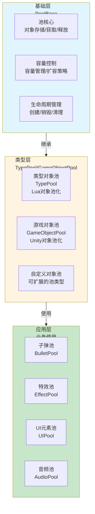

### 对象复用数据流

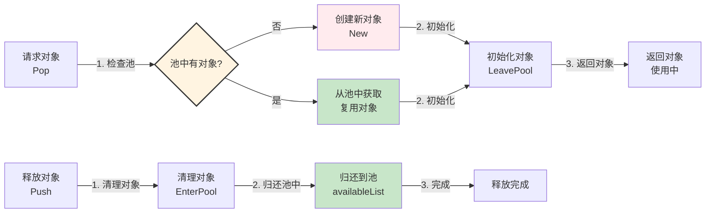

**数据流特性**：
- ✅ **对象复用**：优先从池中获取，减少创建开销
- ✅ **自动创建**：池为空时自动创建新对象
- ✅ **生命周期管理**：对象进入/离开池时自动调用生命周期方法
- ✅ **容量控制**：支持容量限制和自动扩容
- ✅ **性能优化**：减少GC压力，提高响应速度

---

## 基础层架构设计

### 核心职责

对象存储管理 + 容量控制 + 生命周期管理

### 架构图

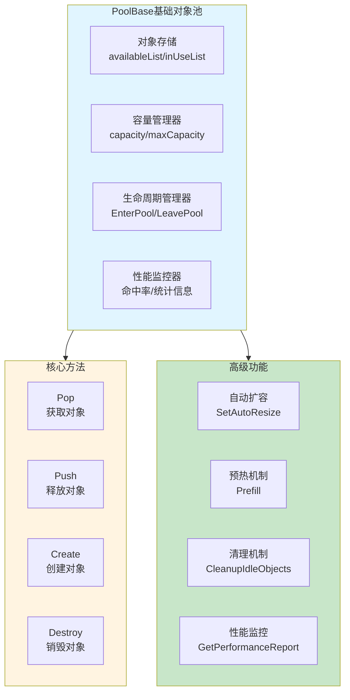

### 核心组件

1. **对象存储（ObjectStorage）**
   - `availableList`：可用对象列表（池中空闲对象）
   - `inUseList`：使用中对象列表（正在使用的对象）
   - 支持快速获取和释放

2. **容量管理器（CapacityManager）**
   - `capacity`：当前容量
   - `maxCapacity`：最大容量限制
   - 支持自动扩容和容量调整

3. **生命周期管理器（LifecycleManager）**
   - `EnterPool()`：对象进入池时的清理逻辑
   - `LeavePool()`：对象离开池时的初始化逻辑
   - 自动调用对象的生命周期方法

---

## 类型层架构设计

### 核心职责

类型化对象池 + 特殊对象处理

### 架构图

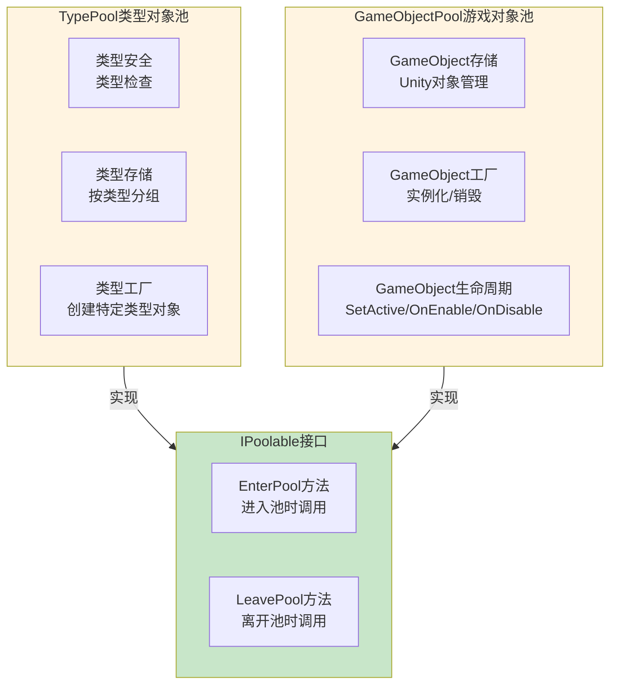

### 工作流程

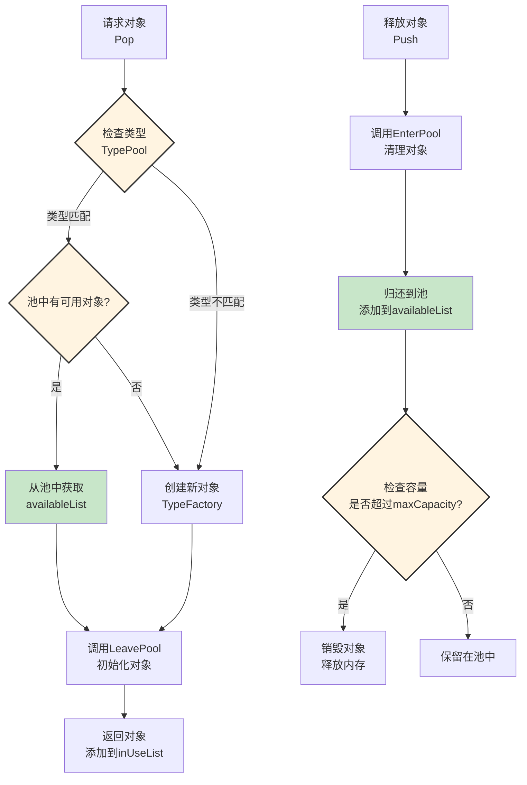

---

## 高级功能架构设计

### 智能扩容机制

**核心思想**：根据使用情况自动调整池大小

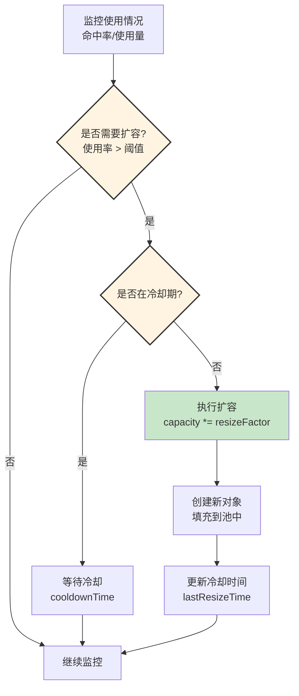

### 预热机制

**核心思想**：提前创建对象，减少首次使用延迟

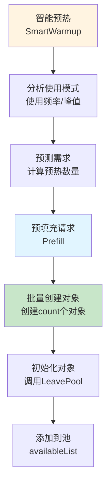

### 性能监控系统

**核心思想**：实时监控对象池使用情况，提供性能报告

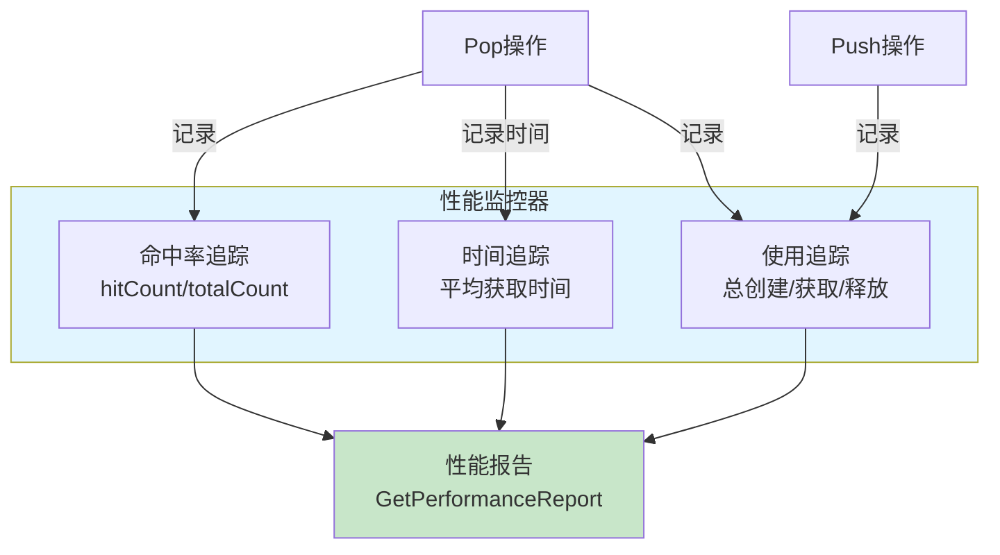

---

## 架构模式分析

### 对象池模式（Object Pool Pattern）

**核心思想**：复用对象而非创建新对象

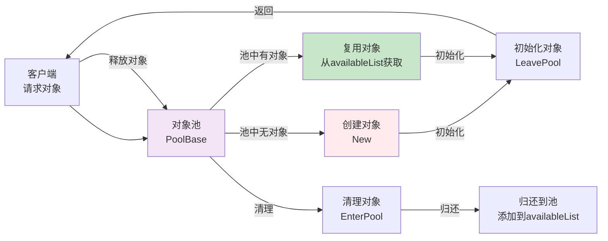

**优势**：
- ✅ **性能优化**：减少对象创建和销毁开销
- ✅ **GC优化**：减少垃圾回收压力
- ✅ **响应速度**：从池中获取比创建新对象更快
- ✅ **内存控制**：通过容量控制管理内存使用

### 工厂模式（Factory Pattern）

**核心思想**：对象池作为工厂创建和管理对象

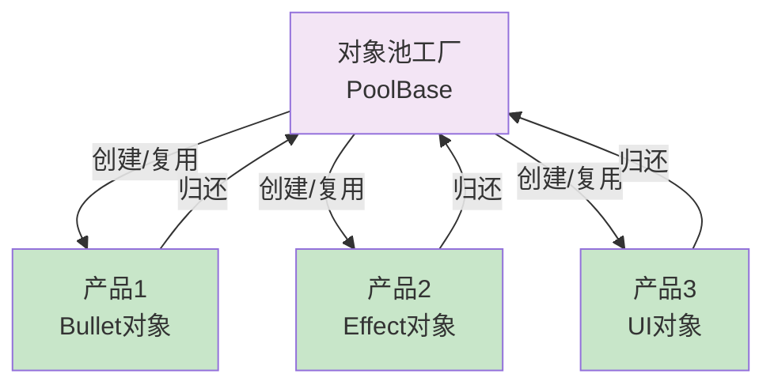

---

## 数据流设计

### 对象获取流程

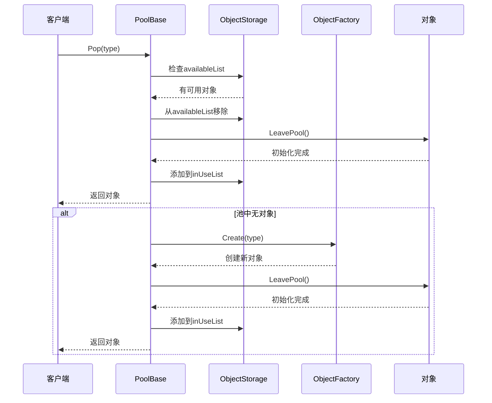

### 对象释放流程

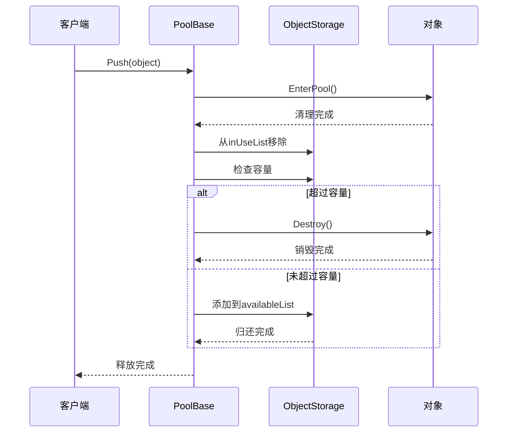

---

## 架构验证

### 流程合理性验证

从架构可验证：
- ✅ **数据流完整**：获取对象 → 使用 → 释放 → 归还（完整流程）
- ✅ **职责清晰**：基础层、类型层、应用层职责明确，无重叠
- ✅ **解耦设计**：通过接口和继承实现层间解耦
- ✅ **生命周期管理**：对象进入/离开池时自动调用生命周期方法

### 扩展性验证

从架构可验证：
- ✅ **策略模式**：新增对象池类型只需继承PoolBase
- ✅ **接口统一**：所有对象池通过统一接口管理
- ✅ **配置驱动**：对象池特性通过配置数据扩展
- ✅ **灵活扩展**：可以轻松添加新的高级功能

### 性能验证

从架构可验证：
- ✅ **对象复用**：优先从池中获取，减少创建开销
- ✅ **自动扩容**：根据使用情况自动调整池大小
- ✅ **预热机制**：提前创建对象，减少首次使用延迟
- ✅ **性能监控**：实时监控使用情况，优化性能

---

## 开发指导原则

### 一、开发约束（什么能做，什么不能做）

#### ✅ 应该做的

1. **对象必须实现IPoolable接口**
   ```
   ✅ 正确：
   对象类实现 EnterPool() 和 LeavePool() 方法
   
   ❌ 错误：
   对象不实现IPoolable接口
   ```

2. **对象获取必须通过Pop**
   ```
   ✅ 正确：
   local obj = pool:Pop(type)
   
   ❌ 错误：
   直接创建对象，不通过池
   ```

3. **对象释放必须通过Push**
   ```
   ✅ 正确：
   pool:Push(obj)
   
   ❌ 错误：
   直接销毁对象，不归还到池
   ```

#### ❌ 不应该做的

1. **禁止直接创建对象**
   - 必须通过对象池获取对象
   - 不能绕过对象池直接创建

2. **禁止直接销毁对象**
   - 必须通过对象池释放对象
   - 不能绕过对象池直接销毁

3. **禁止修改池内部状态**
   - 不能直接操作availableList和inUseList
   - 必须通过Pop和Push接口操作

### 二、开发流程（标准化开发步骤）

#### 使用对象池的标准流程

```
1. 创建对象池
   ↓
   local pool = TypePool.New(ObjectType, initialCapacity)
   
2. 配置对象池（可选）
   ↓
   pool:SetAutoResize(true)
   pool:Prefill(10)
   
3. 获取对象
   ↓
   local obj = pool:Pop(type)
   
4. 使用对象
   ↓
   -- 使用对象...
   
5. 释放对象
   ↓
   pool:Push(obj)
```

---

## 总结

### 架构设计价值

该架构设计文档的价值在于：
- ✅ **思路解构**：完整解构对象池系统的搭建思路
- ✅ **流程验证**：从架构层面验证流程合理性
- ✅ **模式分析**：分析对象池模式、工厂模式的应用
- ✅ **开发指导**：为后续详细设计和实现提供清晰指导

### 设计原则

- ✅ **对象复用为核心**：减少对象创建和销毁开销
- ✅ **分层架构 + 策略模式**：实现职责分离和灵活扩展
- ✅ **数据驱动架构**：对象池特性通过配置数据实现
- ✅ **性能优化**：智能扩容、预热机制、性能监控

### 架构特点

- ✅ **高性能**：对象复用减少创建开销，提升性能
- ✅ **GC优化**：减少垃圾回收压力
- ✅ **智能管理**：自动扩容、预热机制、容量控制
- ✅ **灵活扩展**：可以轻松添加新的对象池类型和高级功能

细节实现是后续开发阶段的工作，当前架构设计已足够指导整个对象池系统的开发。
