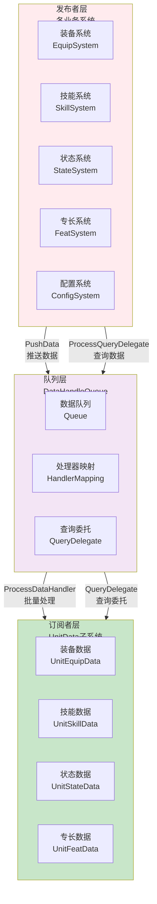
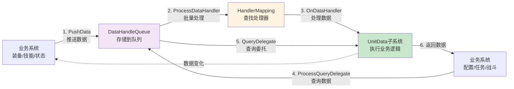
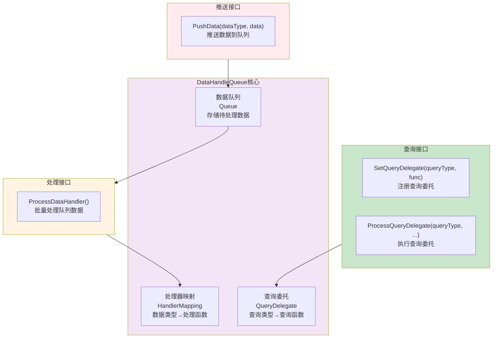
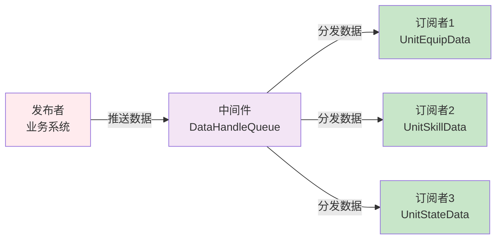
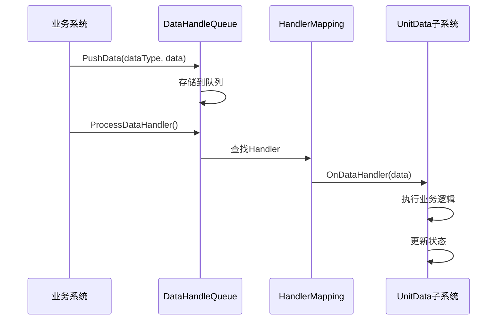
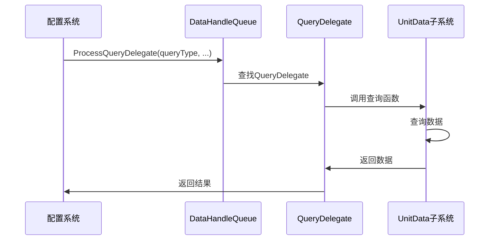

# 数据处理队列架构设计

## 设计目标

设计一套完整的数据处理队列系统，支持多系统协同（装备、技能、状态、专长等），实现模块间完全解耦、批量处理优化、统一数据访问接口，提供数据驱动的配置化数据处理系统。

---

## 核心设计理念

### 1. 统一数据访问接口为核心

**本质**：数据处理队列系统的核心是提供统一的数据访问接口
- 数据推送 = 所有系统通过Queue推送数据，不直接操作目标对象
- 数据查询 = 所有系统通过Queue查询数据，不直接访问UnitData内部结构
- 完全解耦 = 各系统与UnitData无直接依赖，通过Queue通信
- 统一接口 = 任务、战斗、剧情、装备系统都通过同一个Queue访问数据

### 2. 发布-订阅模式 + 观察者模式

**本质**：数据处理队列采用发布-订阅模式实现模块间解耦
- 数据推送 = 发布者推送数据到队列
- 数据订阅 = 订阅者注册Handler处理数据
- 批量处理 = 队列延迟批量处理，性能优化
- 解耦设计 = 发布者和订阅者不直接依赖

### 3. 数据驱动架构

**本质**：数据处理特性通过配置数据实现，无需修改代码
- 数据推送、数据查询 → 通过配置数据定义
- Handler映射、查询委托 → 通过配置数据调整
- 新增数据类型 → 扩展配置数据即可
- 数据处理流程 → 调整配置数据即可

---

## 整体架构设计

### 三层架构 + 发布-订阅模式



### 发布-订阅数据流



**数据流特性**：
- ✅ **统一接口**：所有系统通过Queue推送和查询数据
- ✅ **批量处理**：先推送后处理，100个装备变更只处理1次
- ✅ **完全解耦**：各系统与UnitData无直接依赖
- ✅ **配置驱动**：配置层通过QueryDelegate查询数据，无需知道UnitData结构
- ✅ **扩展性强**：新增数据类型只需扩展HandlerMapping和QueryDelegate

---

## 队列层架构设计

### 核心职责

数据队列管理 + Handler映射 + 查询委托管理

### 架构图



### 核心组件

1. **数据队列（Queue）**
   - 存储待处理的数据（dataType + data）
   - 支持批量推送，延迟处理
   - 队列结构：`{dataType, data}` 数组

2. **处理器映射（HandlerMapping）**
   - 数据类型 → 处理函数的映射
   - 子类定义处理函数：`handlerMapping[dataType] = function(data) end`
   - 支持动态注册和查找

3. **查询委托（QueryDelegate）**
   - 查询类型 → 查询函数的映射
   - 配置层查询单位信息，无需知道UnitData结构
   - 支持参数传递和返回值

---

## 发布者层架构设计

### 核心职责

推送数据到队列 + 查询数据

### 工作流程

```mermaid
flowchart TD
    BusinessSystem[业务系统<br/>装备/技能/状态] --> CheckCondition{检查条件<br/>是否需要推送数据?}
    CheckCondition -->|需要| PushData[PushData(dataType, data)<br/>推送数据到队列]
    CheckCondition -->|不需要| End1[结束]
    
    PushData --> Queue[DataHandleQueue<br/>存储到队列]
    Queue --> BatchProcess[批量处理<br/>ProcessDataHandler]
    
    ConfigSystem[配置系统<br/>CfgEquip/CfgSkill] --> QueryData[ProcessQueryDelegate<br/>查询单位信息]
    QueryData --> Queue
    Queue --> QueryDelegate[QueryDelegate<br/>执行查询]
    QueryDelegate --> ReturnData[返回数据<br/>等级/属性/装备等]
    ReturnData --> ConfigSystem
    
    style CheckCondition fill:#fff4e1,stroke:#333,stroke-width:2px
    style PushData fill:#c8e6c9
    style QueryData fill:#e1f5ff
```

### 发布者类型

1. **装备系统（EquipSystem）**
   - 推送装备安装/卸载数据
   - 查询单位等级、属性等

2. **技能系统（SkillSystem）**
   - 推送技能学习/遗忘数据
   - 查询单位技能列表

3. **状态系统（StateSystem）**
   - 推送状态添加/移除数据
   - 查询单位状态列表

4. **配置系统（ConfigSystem）**
   - 查询单位信息（等级、属性、装备等）
   - 不推送数据，只查询数据

---

## 订阅者层架构设计

### 核心职责

注册Handler处理数据 + 注册QueryDelegate提供查询

### 工作流程

```mermaid
flowchart TD
    Queue[DataHandleQueue<br/>批量处理] --> ProcessHandler[ProcessDataHandler<br/>遍历HandlerMapping]
    ProcessHandler --> FindHandler{查找Handler<br/>handlerMapping[dataType]}
    FindHandler -->|找到| CallHandler[调用Handler<br/>OnDataHandler(data)]
    FindHandler -->|未找到| Ignore[忽略数据]
    
    CallHandler --> BusinessLogic[执行业务逻辑<br/>装备安装/技能学习等]
    BusinessLogic --> UpdateState[更新状态<br/>标记数据变化]
    
    QueryRequest[查询请求<br/>ProcessQueryDelegate] --> FindDelegate{查找QueryDelegate<br/>queryDelegate[queryType]}
    FindDelegate -->|找到| CallDelegate[调用QueryDelegate<br/>返回数据]
    FindDelegate -->|未找到| ReturnNil[返回nil]
    
    CallDelegate --> ReturnData[返回数据<br/>等级/属性/装备等]
    
    style FindHandler fill:#fff4e1,stroke:#333,stroke-width:2px
    style FindDelegate fill:#fff4e1,stroke:#333,stroke-width:2px
    style BusinessLogic fill:#c8e6c9
```

### 订阅者类型

1. **UnitEquipData（装备数据）**
   - 注册Handler：处理装备安装/卸载
   - 注册QueryDelegate：查询装备列表、是否有装备

2. **UnitSkillData（技能数据）**
   - 注册Handler：处理技能学习/遗忘
   - 注册QueryDelegate：查询技能列表、技能等级

3. **UnitStateData（状态数据）**
   - 注册Handler：处理状态添加/移除
   - 注册QueryDelegate：查询状态列表、是否有状态

---

## 架构模式分析

### 发布-订阅模式（Publish-Subscribe Pattern）

**核心思想**：发布者和订阅者通过中间件（Queue）解耦



**优势**：
- ✅ **完全解耦**：发布者和订阅者不直接依赖
- ✅ **动态订阅**：可以动态添加/移除订阅者
- ✅ **批量处理**：队列延迟批量处理，性能优化
- ✅ **统一接口**：所有系统通过同一个Queue通信

### 观察者模式（Observer Pattern）

**核心思想**：HandlerMapping实现观察者模式

```mermaid
graph TB
    Subject[Subject<br/>DataHandleQueue] -->|通知| Observer1[Observer1<br/>handlerMapping[Type1]]
    Subject -->|通知| Observer2[Observer2<br/>handlerMapping[Type2]]
    Subject -->|通知| Observer3[Observer3<br/>handlerMapping[Type3]]
    
    style Subject fill:#f3e5f5
    style Observer1 fill:#c8e6c9
    style Observer2 fill:#c8e6c9
    style Observer3 fill:#c8e6c9
```

**优势**：
- ✅ **一对多通知**：一个数据变化可以通知多个Handler
- ✅ **动态注册**：可以动态添加/移除Observer
- ✅ **解耦设计**：Subject和Observer不直接依赖

---

## 数据流设计

### 数据推送流程



### 数据查询流程



---

## 架构验证

### 流程合理性验证

从架构可验证：
- ✅ **数据流完整**：推送数据 → 队列存储 → 批量处理 → Handler处理（完整流程）
- ✅ **查询流完整**：查询请求 → QueryDelegate → 返回数据（完整流程）
- ✅ **职责清晰**：发布者、队列、订阅者职责明确，无重叠
- ✅ **解耦设计**：通过Queue实现模块间完全解耦

### 扩展性验证

从架构可验证：
- ✅ **发布-订阅模式**：新增发布者/订阅者无需修改Queue
- ✅ **Handler映射**：新增数据类型只需扩展HandlerMapping
- ✅ **QueryDelegate**：新增查询类型只需扩展QueryDelegate
- ✅ **配置驱动**：配置层通过QueryDelegate查询，无需知道UnitData结构

### 性能验证

从架构可验证：
- ✅ **批量处理**：队列延迟批量处理，100个装备变更只处理1次
- ✅ **按需查询**：只查询需要的数据，避免全量查询
- ✅ **统一接口**：所有系统通过同一个Queue，减少重复代码

---

## 开发指导原则

### 一、开发约束（什么能做，什么不能做）

#### ✅ 应该做的

1. **数据推送必须通过Queue**
   ```
   ✅ 正确：
   业务系统 → Queue.PushData() → Queue.ProcessDataHandler()
   
   ❌ 错误：
   业务系统 → 直接操作 → UnitData
   ```

2. **数据查询必须通过QueryDelegate**
   ```
   ✅ 正确：
   配置系统 → Queue.ProcessQueryDelegate() → QueryDelegate → 返回数据
   
   ❌ 错误：
   配置系统 → 直接访问 → UnitData内部结构
   ```

3. **Handler必须注册到HandlerMapping**
   ```
   ✅ 正确：
   UnitData子系统 → handlerMapping[dataType] = function(data) end
   
   ❌ 错误：
   直接处理数据，不注册Handler
   ```

#### ❌ 不应该做的

1. **禁止直接操作UnitData**
   - 业务系统不能直接访问UnitData内部结构
   - 必须通过Queue推送和查询数据

2. **禁止绕过Queue**
   - 所有数据操作必须通过Queue
   - 不能直接调用UnitData的方法

3. **禁止硬编码数据访问**
   - 配置层不能硬编码UnitData的访问方式
   - 必须通过QueryDelegate查询

### 二、开发流程（标准化开发步骤）

#### 开发新数据类型的标准流程

```
1. 定义数据类型
   ↓
   在DataHandleRule中定义新的dataType枚举
   
2. 实现Handler
   ↓
   在UnitData子类中实现handlerMapping[dataType]
   
3. 注册QueryDelegate（如果需要）
   ↓
   在UnitData中注册queryDelegate[queryType]
   
4. 使用Queue
   ↓
   业务系统通过Queue.PushData()推送数据
   配置系统通过Queue.ProcessQueryDelegate()查询数据
```

---

## 总结

### 架构设计价值

该架构设计文档的价值在于：
- ✅ **思路解构**：完整解构数据处理队列系统的搭建思路
- ✅ **流程验证**：从架构层面验证流程合理性
- ✅ **模式分析**：分析发布-订阅模式和观察者模式的应用
- ✅ **开发指导**：为后续详细设计和实现提供清晰指导

### 设计原则

- ✅ **统一数据访问接口为核心**：所有系统通过Queue访问数据
- ✅ **发布-订阅模式**：实现模块间完全解耦
- ✅ **数据驱动架构**：数据处理特性通过配置数据实现
- ✅ **批量处理优化**：队列延迟批量处理，性能优化

### 架构特点

- ✅ **完全解耦**：各系统与UnitData无直接依赖
- ✅ **统一接口**：任务、战斗、剧情系统都通过同一个Queue访问数据
- ✅ **配置驱动**：配置层通过QueryDelegate查询，无需知道UnitData结构
- ✅ **批量处理**：100个装备变更只处理1次，性能优化

细节实现是后续开发阶段的工作，当前架构设计已足够指导整个数据处理队列系统的开发。
