# 触发器系统架构设计

## 设计目标

设计一套完整的事件触发和响应系统，支持条件-动作绑定、事件驱动机制、对象池管理，实现高性能、可扩展的触发器框架，提供装饰器模式和子类扩展能力。

---

## 核心设计理念

### 1. 条件-动作解耦为核心

**本质**：触发器系统的核心是条件与动作的解耦设计
- 条件检查 = 独立的函数，返回布尔值
- 动作执行 = 独立的函数，执行具体操作
- 条件-动作绑定 = 通过枚举ID建立映射关系
- 灵活组合 = 支持1对多、多对1、多对多的绑定关系

### 2. 对象池 + 工厂模式

**本质**：通过对象池技术提升性能，通过工厂模式实现类型管理
- 对象池管理 = 触发器实例的复用和缓存
- 工厂模式 = TriggerKitFactory统一管理触发器创建
- 类型注册 = 通过枚举定义触发器类型，自动初始化
- 性能优化 = 减少内存分配和GC压力

### 3. 装饰器模式 + 观察者模式

**本质**：通过装饰器模式扩展功能，通过观察者模式实现事件驱动
- 装饰器模式 = 覆盖装饰器和扩展装饰器两种模式
- 观察者模式 = 事件监听和广播机制
- 功能扩展 = 不修改原有代码即可扩展功能
- 事件驱动 = 触发器可以订阅和响应游戏事件

---

## 整体架构设计

### 核心组件架构

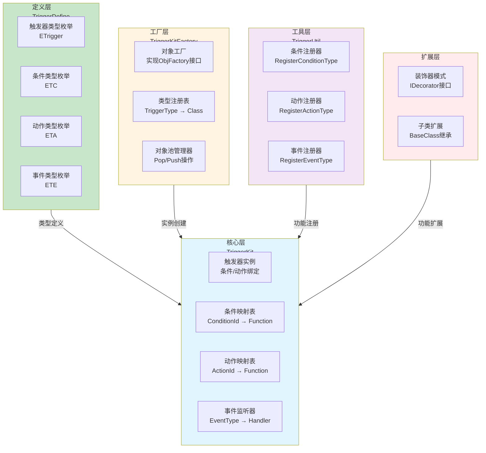

### 条件-动作绑定架构

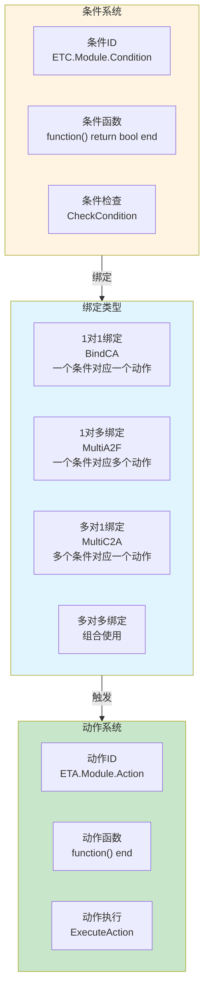

---

## 详细层级设计

### 核心层：TriggerKit

**核心职责**：触发器实例管理、条件-动作绑定、事件监听

#### 架构图

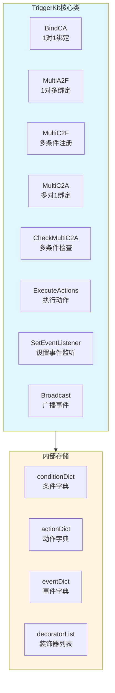

**关键方法**：
- `BindCA(conditionId, conditionFunc, actionId, actionFunc)` - 1对1绑定
- `MultiA2F(conditionId, actionIds, actions)` - 1对多绑定
- `MultiC2F(conditionIds, conditions)` - 多条件注册
- `MultiC2A(conditionIds, actionId, action)` - 多对1绑定
- `CheckMultiC2A(actionId)` - 检查多条件并执行动作
- `ExecuteActions(conditionId, actionId)` - 执行指定动作
- `SetEventListener(eventType, handler)` - 设置事件监听
- `Broadcast(eventType)` - 广播事件

### 工厂层：TriggerKitFactory

**核心职责**：触发器实例创建、对象池管理、类型注册

#### 架构图

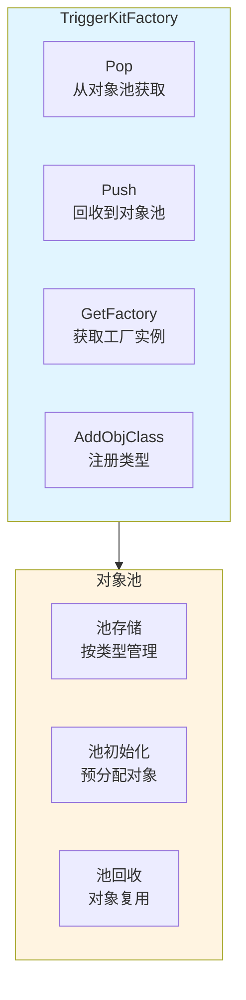

**工作流程**：
1. 系统初始化时，工厂自动注册所有触发器类型
2. 调用`Pop(triggerType)`从对象池获取触发器实例
3. 使用完毕后调用`Push(triggerType)`回收实例
4. 支持动态注册新的触发器类型

### 定义层：TriggerDefine

**核心职责**：枚举定义、类型声明

#### 枚举结构

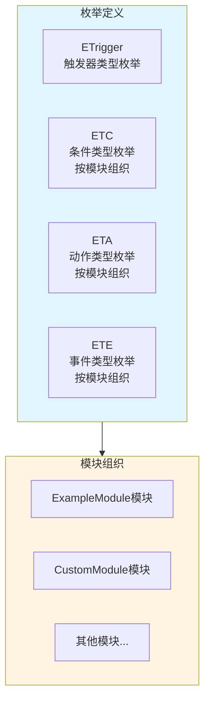

**枚举设计原则**：
- 触发器类型：`ETrigger.ModuleName`
- 条件类型：`ETC.ModuleName.ConditionName`
- 动作类型：`ETA.ModuleName.ActionName`
- 事件类型：`ETE.ModuleName.EventName`

### 工具层：TriggerUtil

**核心职责**：条件/动作/事件注册、工具方法

**关键方法**：
- `RegisterConditionType(conditionType, handler)` - 注册条件类型
- `RegisterActionType(actionType, handler)` - 注册动作类型
- `RegisterEventType(eventType, handler)` - 注册事件类型

---

## 架构模式分析

### 观察者模式（Observer Pattern）

**核心思想**：触发器订阅事件，当事件发生时自动响应

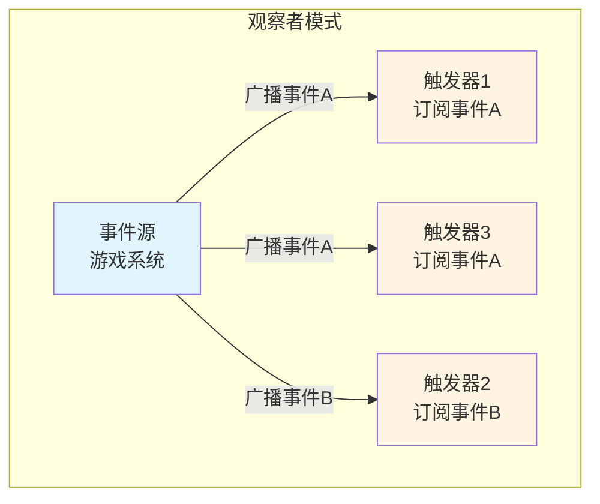

**优势**：
- ✅ **解耦设计**：事件源和触发器解耦
- ✅ **灵活扩展**：可以动态添加和移除观察者
- ✅ **事件驱动**：基于事件而非轮询

### 工厂模式（Factory Pattern）

**核心思想**：通过工厂统一管理触发器创建，支持对象池

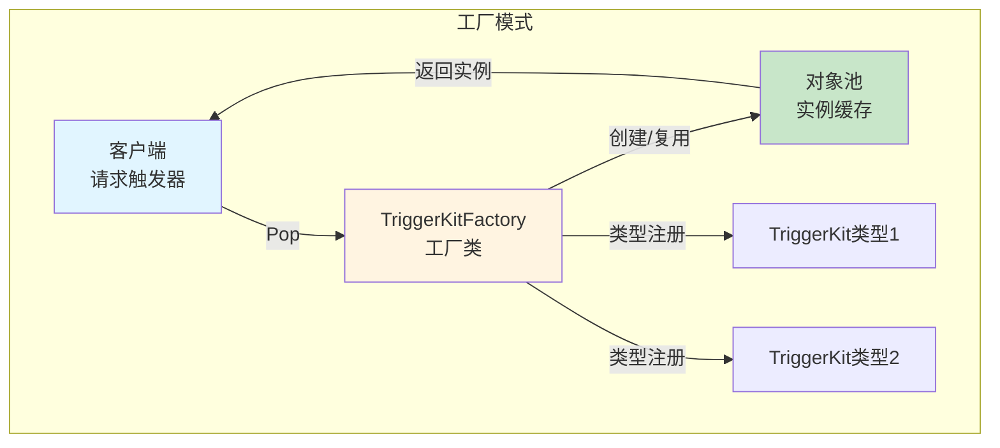

**优势**：
- ✅ **统一管理**：所有触发器创建通过工厂
- ✅ **对象池优化**：减少内存分配
- ✅ **类型扩展**：支持动态注册新类型

### 装饰器模式（Decorator Pattern）

**核心思想**：通过装饰器动态扩展触发器功能，不修改原有代码

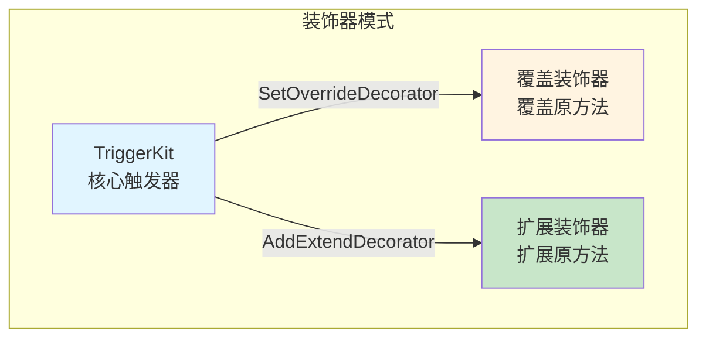

**两种装饰器模式**：
- **覆盖装饰器**：完全覆盖原方法，只执行装饰器逻辑
- **扩展装饰器**：在原方法前后执行装饰器逻辑

**优势**：
- ✅ **功能扩展**：不修改原有代码即可扩展功能
- ✅ **灵活组合**：可以同时使用多个装饰器
- ✅ **职责分离**：装饰器专注于特定功能增强

### 策略模式（Strategy Pattern）

**核心思想**：条件和动作作为策略，可以灵活替换

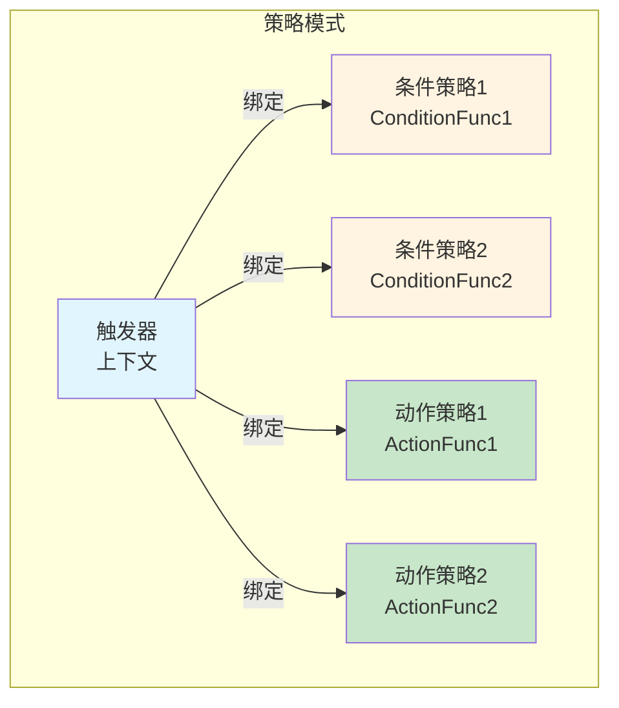

**优势**：
- ✅ **灵活替换**：条件和动作可以动态替换
- ✅ **易于测试**：每个策略可以独立测试
- ✅ **扩展性强**：新增策略只需实现接口

---

## 数据流设计

### 触发器执行流程

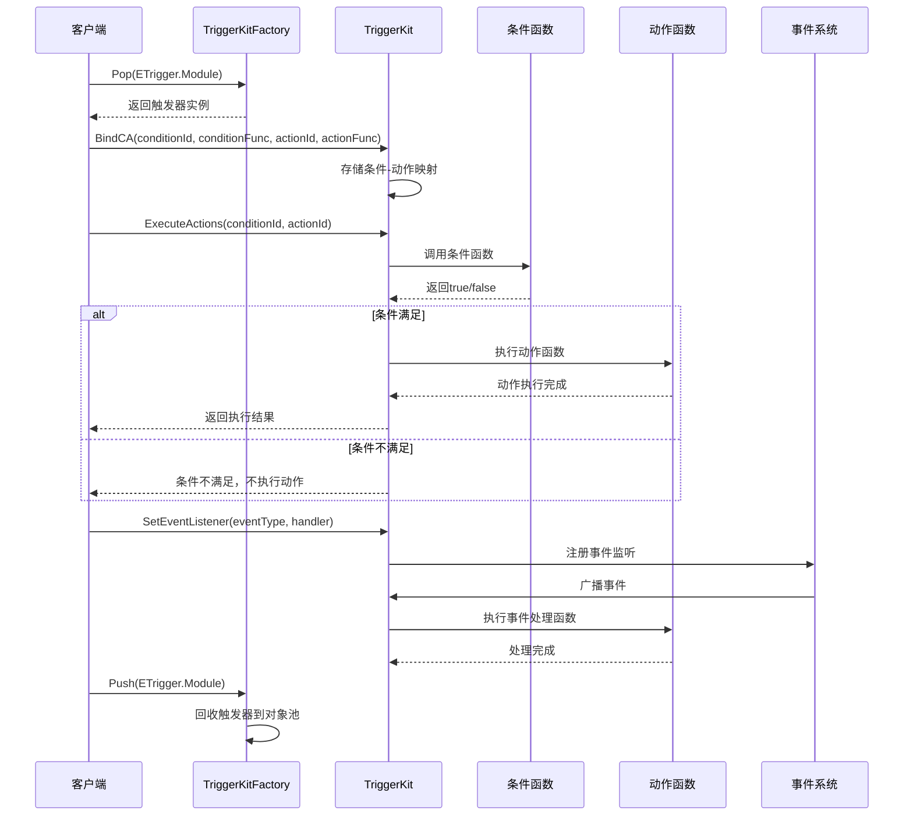

### 多条件多动作流程

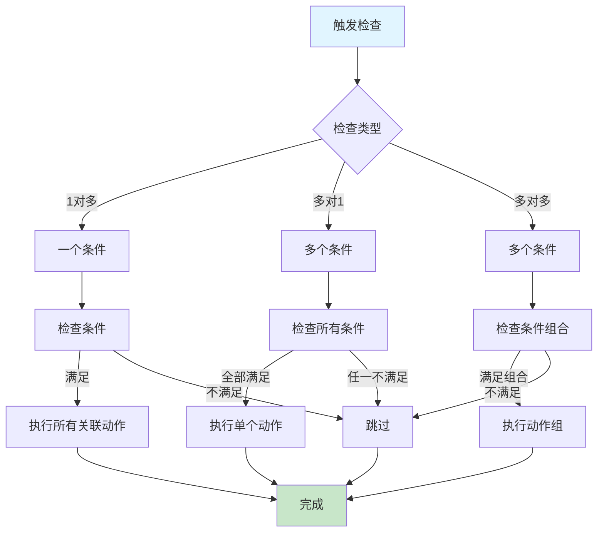

---

## 架构验证

### 流程合理性验证

从架构可验证：
- ✅ **条件-动作解耦**：条件检查和动作执行完全分离
- ✅ **灵活绑定**：支持1对1、1对多、多对1、多对多绑定
- ✅ **对象池优化**：通过对象池减少内存分配
- ✅ **事件驱动**：支持观察者模式，实现事件驱动

### 扩展性验证

从架构可验证：
- ✅ **类型扩展**：新增触发器类型只需注册枚举
- ✅ **条件扩展**：新增条件类型只需注册到ETC
- ✅ **动作扩展**：新增动作类型只需注册到ETA
- ✅ **事件扩展**：新增事件类型只需注册到ETE
- ✅ **功能扩展**：通过装饰器模式和子类扩展

### 性能验证

从架构可验证：
- ✅ **对象池**：减少内存分配和GC压力
- ✅ **函数缓存**：条件和动作函数直接存储，无需查找
- ✅ **事件优化**：事件监听通过字典快速查找
- ✅ **轻量设计**：条件和动作函数应保持轻量

---

## 开发指导原则

### 一、开发约束（什么能做，什么不能做）

#### ✅ 应该做的

1. **使用对象池管理触发器**
   ```
   ✅ 正确：
   local trigger = TriggerKit.Pop(ETrigger.Module)
   -- 使用触发器
   TriggerKit.Push(ETrigger.Module)
   
   ❌ 错误：
   直接创建触发器实例，不使用对象池
   ```

2. **条件和动作函数保持轻量**
   ```
   ✅ 正确：
   local condition = function() return player.hp < 50 end
   local action = function() player:Heal(100) end
   
   ❌ 错误：
   在条件或动作函数中执行耗时操作
   ```

3. **使用枚举定义类型**
   ```
   ✅ 正确：
   ETC.Module.Condition1
   ETA.Module.Action1
   ETE.Module.Event1
   
   ❌ 错误：
   使用字符串或数字直接定义类型
   ```

#### ❌ 不应该做的

1. **禁止忘记回收触发器**
   - 所有从对象池获取的触发器必须回收
   - 不能长时间持有触发器实例

2. **禁止在条件/动作中执行耗时操作**
   - 条件和动作函数应快速执行
   - 耗时操作应在外部处理

3. **禁止直接修改触发器内部状态**
   - 应通过提供的API操作触发器
   - 不能直接访问内部字典

### 二、开发流程（标准化开发步骤）

#### 定义触发器类型的流程

```
1. 定义枚举
   ↓
   在TriggerDefine.lua中定义ETrigger、ETC、ETA、ETE
   
2. 注册类型
   ↓
   系统初始化时自动注册
   
3. 使用触发器
   ↓
   local trigger = TriggerKit.Pop(ETrigger.Module)
   trigger:BindCA(...)
   TriggerKit.Push(ETrigger.Module)
```

#### 扩展触发器的流程

```
1. 选择扩展方式
   ↓
   装饰器模式 / 子类扩展
   
2. 实现扩展
   ↓
   装饰器：实现IDecorator接口
   子类：继承TriggerKit
   
3. 注册扩展
   ↓
   装饰器：SetOverrideDecorator / AddExtendDecorator
   子类：重写Pop方法注册到工厂
```

---

## 总结

### 架构设计价值

该架构设计文档的价值在于：
- ✅ **思路解构**：完整解构触发器系统的搭建思路
- ✅ **模式分析**：分析观察者、工厂、装饰器、策略模式的应用
- ✅ **流程验证**：从架构层面验证流程合理性
- ✅ **开发指导**：为后续详细设计和实现提供清晰指导

### 设计原则

- ✅ **条件-动作解耦为核心**：条件检查和动作执行完全分离
- ✅ **对象池 + 工厂模式**：通过对象池提升性能，通过工厂统一管理
- ✅ **装饰器模式 + 观察者模式**：通过装饰器扩展功能，通过观察者实现事件驱动
- ✅ **灵活绑定**：支持多种绑定关系，满足不同场景需求

### 架构特点

- ✅ **高性能**：对象池管理，减少内存分配
- ✅ **可扩展**：支持装饰器模式和子类扩展
- ✅ **事件驱动**：支持观察者模式，实现事件驱动
- ✅ **灵活组合**：支持1对1、1对多、多对1、多对多绑定

细节实现是后续开发阶段的工作，当前架构设计已足够指导整个触发器系统的开发。
