# 🎯 Lua设计模式库 - 完整指南

## 📋 概述

这是一个功能完整的Lua设计模式库，涵盖了从基础到高级的各种设计模式实现。每个模式都经过精心设计，确保易用性、可扩展性和高性能。

**🎯 设计理念：** 将复杂的设计模式封装成简单易用的工具，让开发者专注于业务逻辑，而不是架构细节。

---

## 🏗️ 设计模式分类

```
Pattern Library (设计模式库)
├── Creational (创建型模式) - 对象创建的艺术
│   ├── Singleton (单例模式) - 唯一的范围接口，不能继承，无法限制作用域
│   ├── Factory (工厂模式) - 对象的创建工厂，可以根据条件创建不同类型的对象(策略工厂)
│   ├── AbstractFactory (抽象工厂模式) - 创建一系列相关对象，确保它们相互兼容
│   ├── Builder (建造者模式) - 分层分步骤构建复杂对象，避免构造函数参数过多导致难以维护
│   └── Prototype (原型模式) - 通过克隆现有对象来创建新对象，减少初始化开销，避免重复赋值
├── Structural (结构型模式) - 对象组合的艺术
│   ├── Adapter (适配器模式) - 在构建项目时，为了让其他模块可以使用开发时的系统，抽象出公共接口的类来适配不同的环境/模块
│   ├── Bridge (桥接模式) - 通过反向依赖（依赖注入），让同一个抽象类可以使用不同的实现，从而产生不同的表达结果，里氏替换可以拓展抽象和实现表达方式
│   ├── Composite (组合模式) - 利用里氏替换原则，将复杂对象拆分为多个可递归节点组件，实现统一生命周期管理
│   ├── Decorator (装饰器模式) - 使用数据驱动模式加执行字典迭代效果，比装饰器更加灵活，动态增强功能而不修改原对象
│   ├── Facade (外观模式) - 对外提供一个统一的接口，隐藏内部的复杂实现，简化客户端使用
│   ├── Flyweight (享元模式) - 享元工厂缓存相同依赖的对象，请求时检查缓存，存在则复用，不存在则创建并缓存，多个客户端共享同一对象减少内存占用。
│   └── Proxy (代理模式) - 可用钩子方法+策略模式替代，避免代理模式滥用
├── Behavioral (行为型模式) - 对象交互的艺术
│   ├── ChainOfResponsibility (责任链模式) - 链式请求处理，每个节点可以决定是否处理请求，或者将请求传递给下一个节点
│   ├── Command (命令模式) - 将请求封装成对象(指令类)，使得指令类可以传递，存储，重做，撤销等操作
│   ├── Interpreter (解释器模式) - 使用组合模式+策略模式，将复杂表达式分解为简单表达式，每个表达式可以独立计算，最终组合成复杂表达式。（公式计算，表达式解析，脚本系统，虚拟机等）
│   ├── Iterator (迭代器模式) - 提供一种方法顺序访问聚合对象中的元素，而不暴露对象的内部表示
│   ├── Mediator (中介者模式) - 微内核架构思维，让多个对象之间通过中介者进行交互，而不是直接交互，减少对象间的直接依赖，提高系统的灵活性和可维护性。
│   ├── Memento (备忘录模式) - 监控对象状态，当对象状态发生变化时，备忘录模式可以记录对象的当前状态，并在需要时恢复到该状态。
│   ├── Observer (观察者模式) - 事件分发系统是其运用
│   ├── State (状态模式) - 关注状态变化后, 但是状态机可以兼顾切换时机和状态变化后处理。
│   ├── Strategy (策略模式) - 解决一类问题的不同解决方案，可通过变量选择不同的策略来解决问题。
│   ├── TemplateMethod (模板方法模式) - 稳定的执行流，通过钩子方法来实现灵活的扩展。
│   └── Visitor (访问者模式) - 可用策略模式+表驱动模式替代, 其原生原理实现及其复杂且不易理解，不推荐使用。
└── Advanced (高级模式) - 游戏开发专用模式
    ├── Component (组件模式)  - Unity 的 GameObject 组件系统是其最好的理解了
    ├── EventDriven (事件驱动模式) - 事件分发系统是其运用，但是有更高维度的方案 通讯总线
    ├── StateMachine (状态机模式) - 关注控制状态切换时机，具有流动性，可传递性，可组合性。
    ├── ServiceLocator (服务定位器模式) - 服务定位器模式是一种服务注册和获取的解决方案，通过服务定位器模式，可以实现服务的高效注册和获取，避免服务注册和获取的重复代码。
    ├── ObjectPool (对象池模式) - 减少创建对象，减少内存碎片 与 避免GC。
    ├── DataDriven (数据驱动模式) - 通过数据驱动业务逻辑，避免硬编码。
    ├── ReactiveProgramming (响应式编程模式) - 基于数据流和变化传播的编程范式，数据变化自动触发相关计算和更新
    ├── DependencyInjection (依赖注入模式) - 控制反转的一种实现方式，通过外部注入依赖而不是内部创建，降低耦合度 
    ├── DirtyFlag (脏标记模式) - 通过标记避免不必要的计算。
    ├── DoubleBuffer (双缓冲模式) - 使用两个缓冲区避免渲染冲突。
    ├── DataLocality (数据局部性模式) - 通过组织数据布局提高缓存效率。
    └── Bytecode (字节码模式) - 创建一套"翻译字典"（OPCODES），将高级语言翻译成字典中的操作，然后执行。编译器负责翻译，虚拟机负责查字典执行
```

---

## 📊 设计模式流程图

### 🏭 创建型模式 (Creational Patterns)

#### Singleton (单例模式)
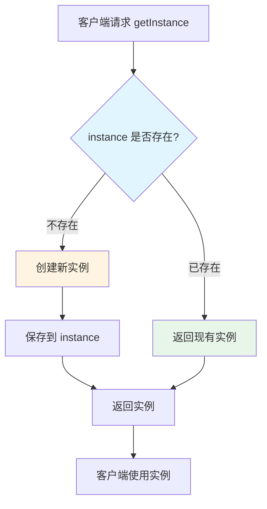
```mermaid
flowchart TD
    A[客户端请求 getInstance] --> B{instance 是否存在?}
    B -->|不存在| C[创建新实例]
    B -->|已存在| D[返回现有实例]
    C --> E[保存到 instance]
    E --> F[返回实例]
    D --> F
    F --> G[客户端使用实例]
    style B fill:#e1f5ff
    style C fill:#fff4e1
    style D fill:#e8f5e9
```

#### Factory (工厂模式)
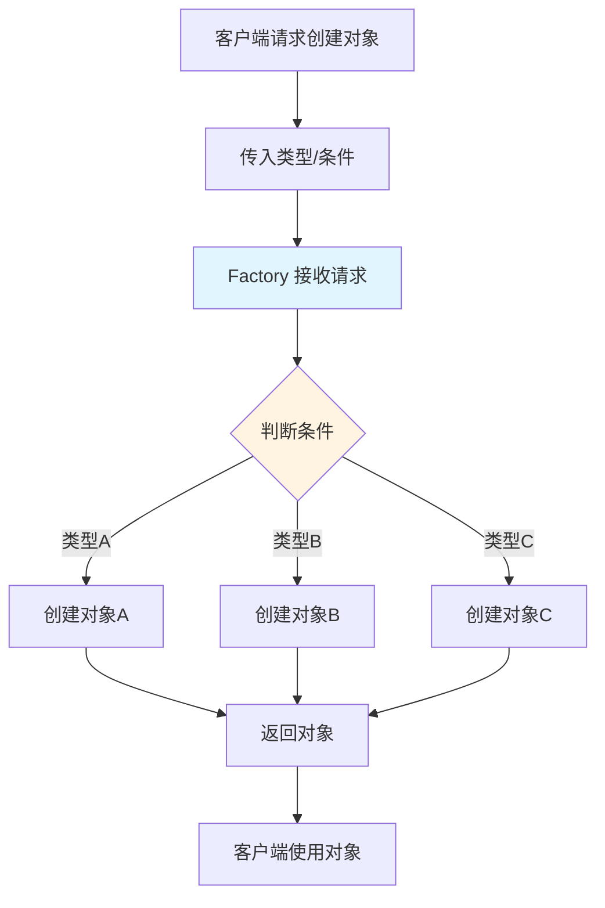
```mermaid
flowchart TD
    A[客户端请求创建对象] --> B[传入类型/条件]
    B --> C[Factory 接收请求]
    C --> D{判断条件}
    D -->|类型A| E[创建对象A]
    D -->|类型B| F[创建对象B]
    D -->|类型C| G[创建对象C]
    E --> H[返回对象]
    F --> H
    G --> H
    H --> I[客户端使用对象]
    style C fill:#e1f5ff
    style D fill:#fff4e1
```

#### AbstractFactory (抽象工厂模式)
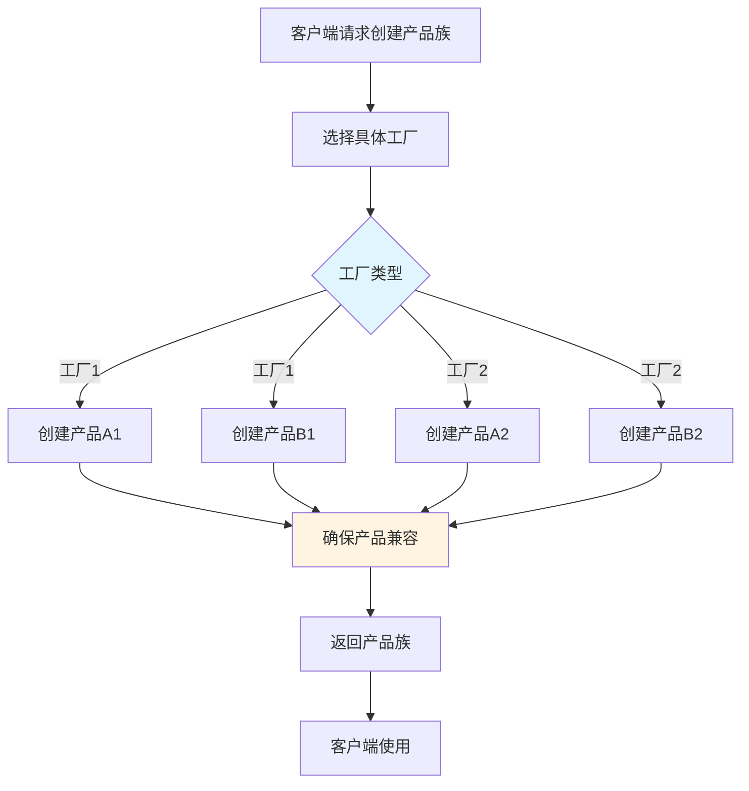
```mermaid
flowchart TD
    A[客户端请求创建产品族] --> B[选择具体工厂]
    B --> C{工厂类型}
    C -->|工厂1| D[创建产品A1]
    C -->|工厂1| E[创建产品B1]
    C -->|工厂2| F[创建产品A2]
    C -->|工厂2| G[创建产品B2]
    D --> H[确保产品兼容]
    E --> H
    F --> H
    G --> H
    H --> I[返回产品族]
    I --> J[客户端使用]
    style C fill:#e1f5ff
    style H fill:#fff4e1
```

#### Builder (建造者模式)
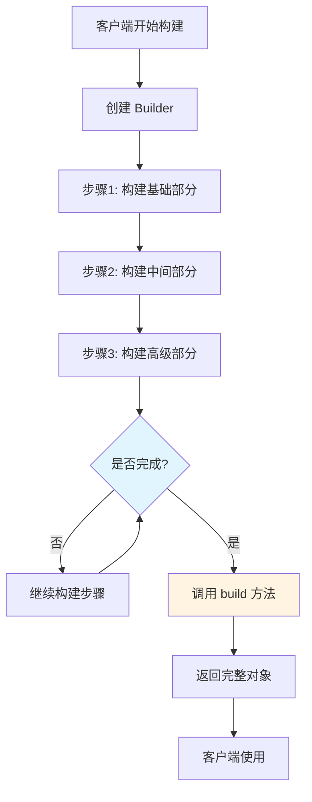
```mermaid
flowchart TD
    A[客户端开始构建] --> B[创建 Builder]
    B --> C[步骤1: 构建基础部分]
    C --> D[步骤2: 构建中间部分]
    D --> E[步骤3: 构建高级部分]
    E --> F{是否完成?}
    F -->|否| G[继续构建步骤]
    G --> F
    F -->|是| H[调用 build 方法]
    H --> I[返回完整对象]
    I --> J[客户端使用]
    style F fill:#e1f5ff
    style H fill:#fff4e1
```

#### Prototype (原型模式)
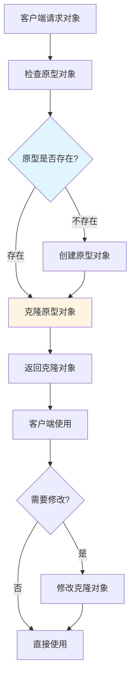
```mermaid
flowchart TD
    A[客户端请求对象] --> B[检查原型对象]
    B --> C{原型是否存在?}
    C -->|不存在| D[创建原型对象]
    C -->|存在| E[克隆原型对象]
    D --> E
    E --> F[返回克隆对象]
    F --> G[客户端使用]
    G --> H{需要修改?}
    H -->|是| I[修改克隆对象]
    H -->|否| J[直接使用]
    I --> J
    style C fill:#e1f5ff
    style E fill:#fff4e1
```

### 🏗️ 结构型模式 (Structural Patterns)

#### Adapter (适配器模式)
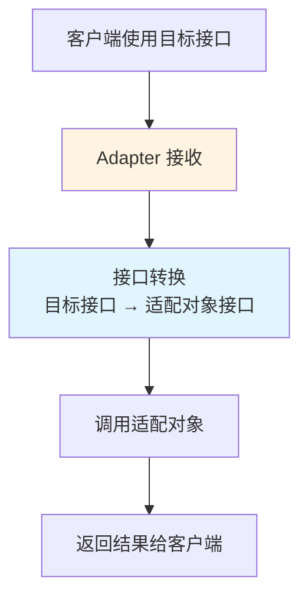
```mermaid
flowchart TD
    A[客户端使用目标接口] --> B[Adapter 接收]
    B --> C[接口转换<br/>目标接口 → 适配对象接口]
    C --> D[调用适配对象]
    D --> E[返回结果给客户端]
    
    style C fill:#e1f5ff
    style B fill:#fff4e1
```

#### Bridge (桥接模式)
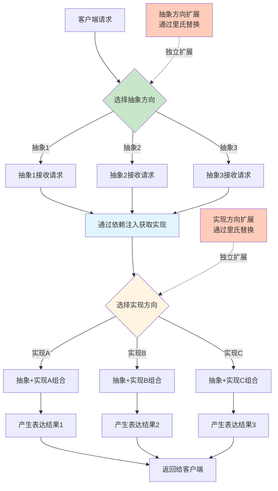
```mermaid
flowchart TD
    A[客户端请求] --> B{选择抽象方向}
    B -->|抽象1| C1[抽象1接收请求]
    B -->|抽象2| C2[抽象2接收请求]
    B -->|抽象3| C3[抽象3接收请求]
    
    C1 --> D[通过依赖注入获取实现]
    C2 --> D
    C3 --> D
    
    D --> E{选择实现方向}
    E -->|实现A| F1[抽象+实现A组合]
    E -->|实现B| F2[抽象+实现B组合]
    E -->|实现C| F3[抽象+实现C组合]
    
    F1 --> G1[产生表达结果1]
    F2 --> G2[产生表达结果2]
    F3 --> G3[产生表达结果3]
    
    G1 --> H[返回给客户端]
    G2 --> H
    G3 --> H
    
    I[抽象方向扩展<br/>通过里氏替换] -.->|独立扩展| B
    J[实现方向扩展<br/>通过里氏替换] -.->|独立扩展| E
    
    style D fill:#e1f5ff
    style E fill:#fff4e1
    style B fill:#c8e6c9
    style I fill:#ffccbc
    style J fill:#ffccbc
```

#### Composite (组合模式)
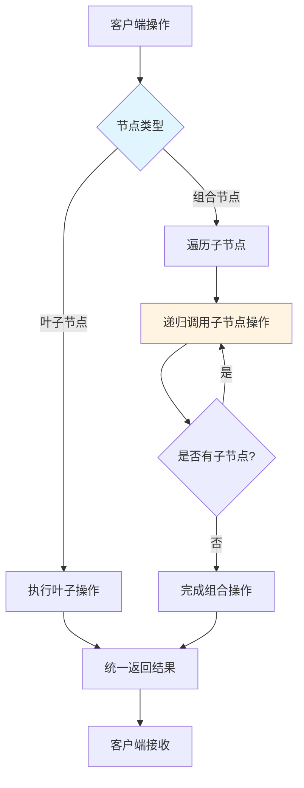
```mermaid
flowchart TD
    A[客户端操作] --> B{节点类型}
    B -->|叶子节点| C[执行叶子操作]
    B -->|组合节点| D[遍历子节点]
    D --> E[递归调用子节点操作]
    E --> F{是否有子节点?}
    F -->|是| E
    F -->|否| G[完成组合操作]
    C --> H[统一返回结果]
    G --> H
    H --> I[客户端接收]
    style B fill:#e1f5ff
    style E fill:#fff4e1
```

#### Decorator (装饰器模式)
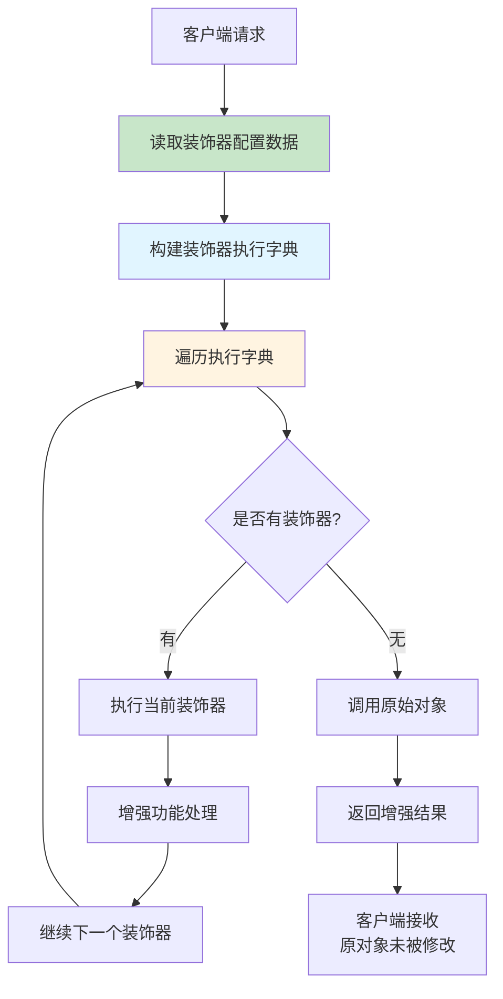
```mermaid
flowchart TD
    A[客户端请求] --> B[读取装饰器配置数据]
    B --> C[构建装饰器执行字典]
    C --> D[遍历执行字典]
    D --> E{是否有装饰器?}
    E -->|有| F[执行当前装饰器]
    E -->|无| G[调用原始对象]
    F --> H[增强功能处理]
    H --> I[继续下一个装饰器]
    I --> D
    G --> J[返回增强结果]
    J --> K[客户端接收<br/>原对象未被修改]
    
    style C fill:#e1f5ff
    style D fill:#fff4e1
    style B fill:#c8e6c9
```

#### Facade (外观模式)
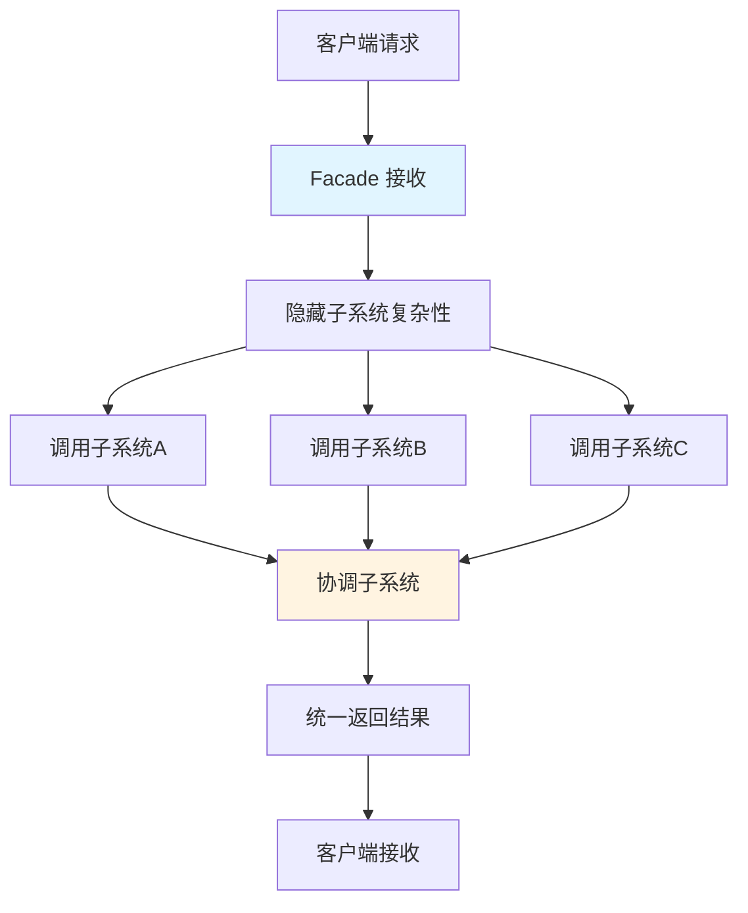
```mermaid
flowchart TD
    A[客户端请求] --> B[Facade 接收]
    B --> C[隐藏子系统复杂性]
    C --> D[调用子系统A]
    C --> E[调用子系统B]
    C --> F[调用子系统C]
    D --> G[协调子系统]
    E --> G
    F --> G
    G --> H[统一返回结果]
    H --> I[客户端接收]
    style B fill:#e1f5ff
    style G fill:#fff4e1
```

#### Flyweight (享元模式)
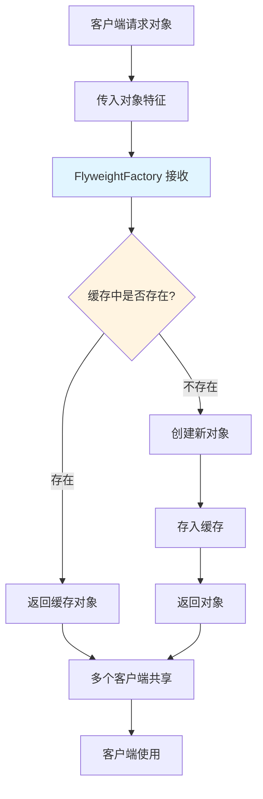
```mermaid
flowchart TD
    A[客户端请求对象] --> B[传入对象特征]
    B --> C[FlyweightFactory 接收]
    C --> D{缓存中是否存在?}
    D -->|存在| E[返回缓存对象]
    D -->|不存在| F[创建新对象]
    F --> G[存入缓存]
    G --> H[返回对象]
    E --> I[多个客户端共享]
    H --> I
    I --> J[客户端使用]
    style C fill:#e1f5ff
    style D fill:#fff4e1
```

#### Proxy (代理模式)
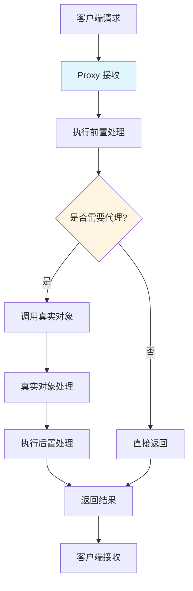
```mermaid
flowchart TD
    A[客户端请求] --> B[Proxy 接收]
    B --> C[执行前置处理]
    C --> D{是否需要代理?}
    D -->|是| E[调用真实对象]
    D -->|否| F[直接返回]
    E --> G[真实对象处理]
    G --> H[执行后置处理]
    H --> I[返回结果]
    F --> I
    I --> J[客户端接收]
    style B fill:#e1f5ff
    style D fill:#fff4e1
```

### 🎭 行为型模式 (Behavioral Patterns)

#### ChainOfResponsibility (责任链模式)
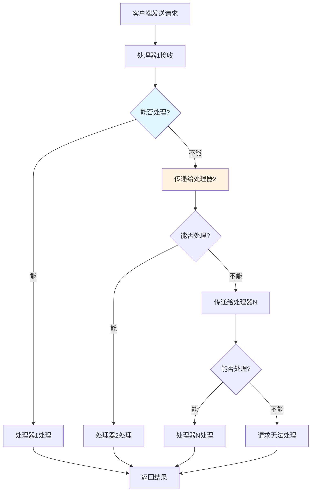
```mermaid
flowchart TD
    A[客户端发送请求] --> B[处理器1接收]
    B --> C{能否处理?}
    C -->|能| D[处理器1处理]
    C -->|不能| E[传递给处理器2]
    E --> F{能否处理?}
    F -->|能| G[处理器2处理]
    F -->|不能| H[传递给处理器N]
    H --> I{能否处理?}
    I -->|能| J[处理器N处理]
    I -->|不能| K[请求无法处理]
    D --> L[返回结果]
    G --> L
    J --> L
    K --> L
    style C fill:#e1f5ff
    style E fill:#fff4e1
```

#### Command (命令模式)
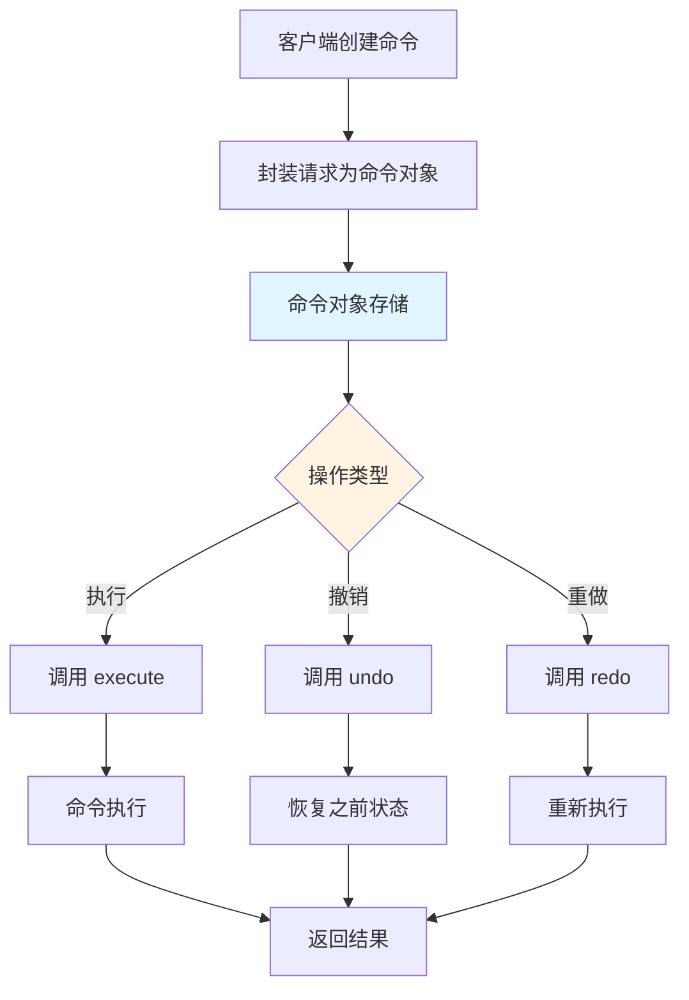
```mermaid
flowchart TD
    A[客户端创建命令] --> B[封装请求为命令对象]
    B --> C[命令对象存储]
    C --> D{操作类型}
    D -->|执行| E[调用 execute]
    D -->|撤销| F[调用 undo]
    D -->|重做| G[调用 redo]
    E --> H[命令执行]
    F --> I[恢复之前状态]
    G --> J[重新执行]
    H --> K[返回结果]
    I --> K
    J --> K
    style C fill:#e1f5ff
    style D fill:#fff4e1
```

#### Interpreter (解释器模式)
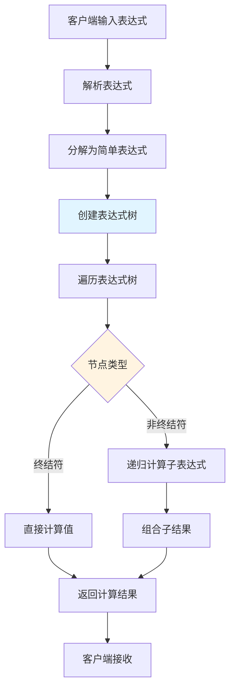
```mermaid
flowchart TD
    A[客户端输入表达式] --> B[解析表达式]
    B --> C[分解为简单表达式]
    C --> D[创建表达式树]
    D --> E[遍历表达式树]
    E --> F{节点类型}
    F -->|终结符| G[直接计算值]
    F -->|非终结符| H[递归计算子表达式]
    H --> I[组合子结果]
    G --> J[返回计算结果]
    I --> J
    J --> K[客户端接收]
    style D fill:#e1f5ff
    style F fill:#fff4e1
```

#### Iterator (迭代器模式)
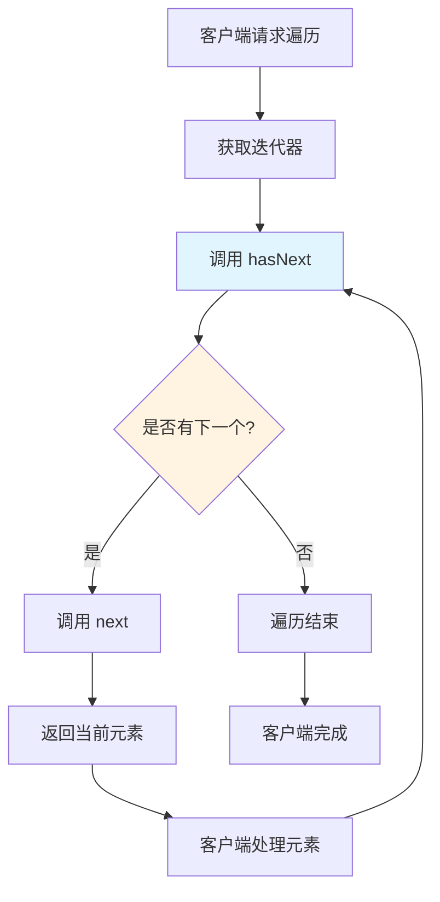
```mermaid
flowchart TD
    A[客户端请求遍历] --> B[获取迭代器]
    B --> C[调用 hasNext]
    C --> D{是否有下一个?}
    D -->|是| E[调用 next]
    D -->|否| F[遍历结束]
    E --> G[返回当前元素]
    G --> H[客户端处理元素]
    H --> C
    F --> I[客户端完成]
    style C fill:#e1f5ff
    style D fill:#fff4e1
```

#### Mediator (中介者模式)
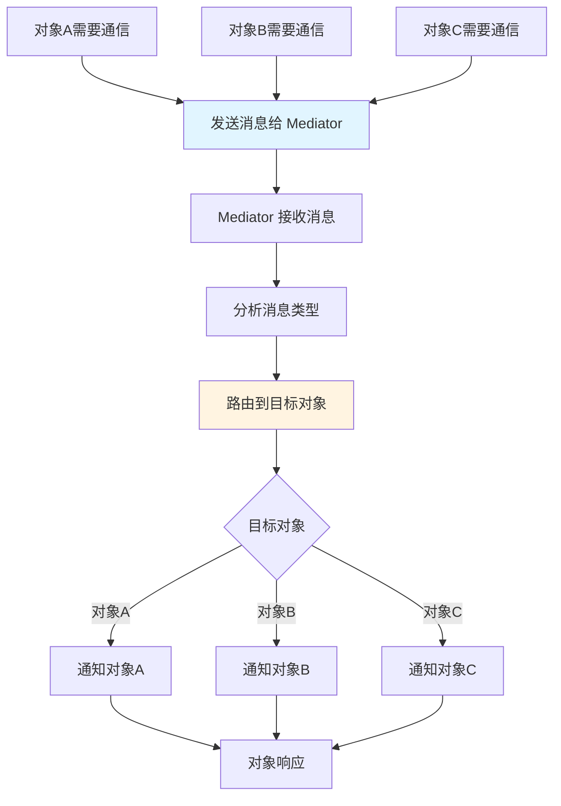
```mermaid
flowchart TD
    A[对象A需要通信] --> B[发送消息给 Mediator]
    C[对象B需要通信] --> B
    D[对象C需要通信] --> B
    B --> E[Mediator 接收消息]
    E --> F[分析消息类型]
    F --> G[路由到目标对象]
    G --> H{目标对象}
    H -->|对象A| I[通知对象A]
    H -->|对象B| J[通知对象B]
    H -->|对象C| K[通知对象C]
    I --> L[对象响应]
    J --> L
    K --> L
    style B fill:#e1f5ff
    style G fill:#fff4e1
```

#### Memento (备忘录模式)
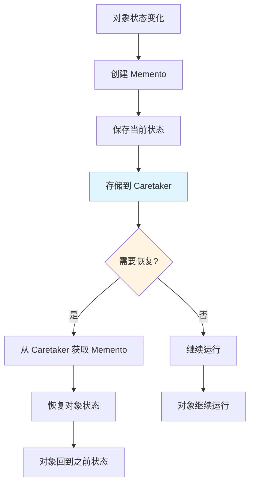
```mermaid
flowchart TD
    A[对象状态变化] --> B[创建 Memento]
    B --> C[保存当前状态]
    C --> D[存储到 Caretaker]
    D --> E{需要恢复?}
    E -->|是| F[从 Caretaker 获取 Memento]
    E -->|否| G[继续运行]
    F --> H[恢复对象状态]
    H --> I[对象回到之前状态]
    G --> J[对象继续运行]
    style D fill:#e1f5ff
    style E fill:#fff4e1
```

#### Observer (观察者模式)
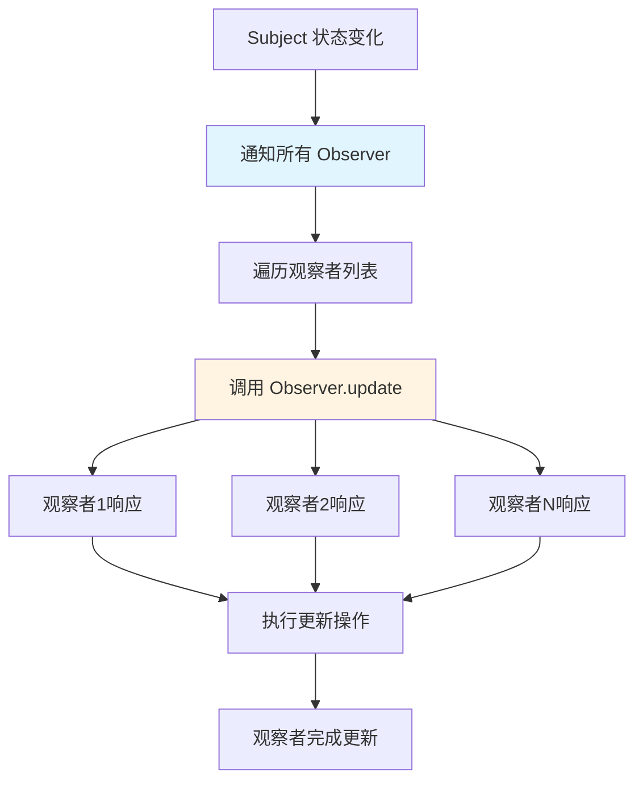
```mermaid
flowchart TD
    A[Subject 状态变化] --> B[通知所有 Observer]
    B --> C[遍历观察者列表]
    C --> D[调用 Observer.update]
    D --> E[观察者1响应]
    D --> F[观察者2响应]
    D --> G[观察者N响应]
    E --> H[执行更新操作]
    F --> H
    G --> H
    H --> I[观察者完成更新]
    style B fill:#e1f5ff
    style D fill:#fff4e1
```

#### State (状态模式)
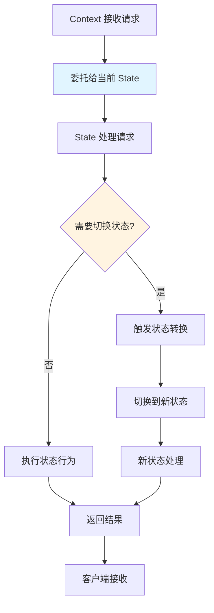
```mermaid
flowchart TD
    A[Context 接收请求] --> B[委托给当前 State]
    B --> C[State 处理请求]
    C --> D{需要切换状态?}
    D -->|是| E[触发状态转换]
    D -->|否| F[执行状态行为]
    E --> G[切换到新状态]
    G --> H[新状态处理]
    F --> I[返回结果]
    H --> I
    I --> J[客户端接收]
    style B fill:#e1f5ff
    style D fill:#fff4e1
```

#### Strategy (策略模式)
```mermaid
flowchart TD
    A[客户端请求] --> B[Context 接收]
    B --> C[根据条件选择策略]
    C --> D{策略类型}
    D -->|策略A| E[使用策略A]
    D -->|策略B| F[使用策略B]
    D -->|策略C| G[使用策略C]
    E --> H[执行策略算法]
    F --> H
    G --> H
    H --> I[返回结果]
    I --> J[客户端接收]
    style C fill:#e1f5ff
    style D fill:#fff4e1
```

#### TemplateMethod (模板方法模式)
```mermaid
flowchart TD
    A[客户端调用模板方法] --> B[模板方法: 定义算法骨架]
    B --> C[步骤1: 固定流程<br/>所有子类共享]
    C --> D{钩子方法1<br/>子类可重写}
    D -->|子类重写| E[执行子类实现]
    D -->|未重写| F[执行默认实现]
    E --> G[步骤2: 固定流程<br/>所有子类共享]
    F --> G
    G --> H{钩子方法2<br/>子类可重写}
    H -->|子类重写| I[执行子类实现]
    H -->|未重写| J[执行默认实现]
    I --> K[步骤3: 固定流程<br/>所有子类共享]
    J --> K
    K --> L[完成模板流程]
    L --> M[返回结果]
    M --> N[客户端接收]
    
    style B fill:#e1f5ff
    style C fill:#c8e6c9
    style G fill:#c8e6c9
    style K fill:#c8e6c9
    style D fill:#fff4e1
    style H fill:#fff4e1
    style E fill:#ffccbc
    style I fill:#ffccbc
```

#### Visitor (访问者模式)
```mermaid
flowchart TD
    A[客户端调用 accept] --> B[元素接收 Visitor]
    B --> C[元素调用 Visitor.visit]
    C --> D{元素类型}
    D -->|类型A| E[Visitor.visitElementA]
    D -->|类型B| F[Visitor.visitElementB]
    E --> G[执行访问操作]
    F --> G
    G --> H[返回结果]
    H --> I[客户端接收]
    style B fill:#e1f5ff
    style D fill:#fff4e1
```

### 🚀 高级模式 (Advanced Patterns)

#### Component (组件模式)
```mermaid
flowchart TD
    A[Entity 接收操作] --> B[遍历组件列表]
    B --> C{组件类型}
    C -->|组件A| D[调用组件A方法]
    C -->|组件B| E[调用组件B方法]
    C -->|组件C| F[调用组件C方法]
    D --> G[组件处理]
    E --> G
    F --> G
    G --> H[组合结果]
    H --> I[返回给 Entity]
    I --> J[客户端接收]
    style B fill:#e1f5ff
    style C fill:#fff4e1
```

#### EventDriven (事件驱动模式)
```mermaid
flowchart TD
    A[事件源触发事件] --> B[发布事件]
    B --> C[事件总线接收]
    C --> D[查找事件监听器]
    D --> E[遍历监听器列表]
    E --> F[调用监听器1]
    E --> G[调用监听器2]
    E --> H[调用监听器N]
    F --> I[执行事件处理]
    G --> I
    H --> I
    I --> J[事件处理完成]
    style C fill:#e1f5ff
    style E fill:#fff4e1
```

#### StateMachine (状态机模式)
```mermaid
flowchart TD
    A[接收事件] --> B[当前状态处理]
    B --> C{检查转换条件}
    C -->|条件满足| D[触发状态转换]
    C -->|条件不满足| E[保持当前状态]
    D --> F[执行退出动作]
    F --> G[切换到新状态]
    G --> H[执行进入动作]
    H --> I[执行状态行为]
    E --> I
    I --> J[等待下一个事件]
    style C fill:#e1f5ff
    style D fill:#fff4e1
```

#### ServiceLocator (服务定位器模式)
```mermaid
flowchart TD
    A[客户端请求服务] --> B[ServiceLocator 接收]
    B --> C{服务是否已注册?}
    C -->|是| D[从注册表获取服务]
    C -->|否| E[注册新服务]
    E --> F[存入注册表]
    F --> D
    D --> G[返回服务实例]
    G --> H[客户端使用服务]
    style B fill:#e1f5ff
    style C fill:#fff4e1
```

#### ObjectPool (对象池模式)
```mermaid
flowchart TD
    A[客户端请求对象] --> B[ObjectPool 接收]
    B --> C{池中有可用对象?}
    C -->|有| D[从池中取出对象]
    C -->|无| E[创建新对象]
    D --> F[重置对象状态]
    F --> G[返回对象给客户端]
    E --> G
    G --> H[客户端使用对象]
    H --> I[使用完毕]
    I --> J[归还对象到池]
    J --> K[对象重新可用]
    style B fill:#e1f5ff
    style C fill:#fff4e1
```

#### DataDriven (数据驱动模式)
```mermaid
flowchart TD
    A[客户端请求操作] --> B[读取配置数据]
    B --> C[解析数据]
    C --> D[根据数据选择逻辑]
    D --> E{数据类型}
    E -->|类型A| F[执行逻辑A]
    E -->|类型B| G[执行逻辑B]
    F --> H[返回结果]
    G --> H
    H --> I[客户端接收]
    style B fill:#e1f5ff
    style D fill:#fff4e1
```

#### ReactiveProgramming (响应式编程模式)
```mermaid
flowchart TD
    A[数据源变化] --> B[Observable 检测变化]
    B --> C[通知所有 Observer]
    C --> D[Observer1 响应]
    C --> E[Observer2 响应]
    D --> F[自动重新计算]
    E --> F
    F --> G[更新依赖数据]
    G --> H{是否有依赖链?}
    H -->|是| I[触发下游更新]
    H -->|否| J[更新完成]
    I --> K[继续传播变化]
    K --> H
    style B fill:#e1f5ff
    style H fill:#fff4e1
```

#### DependencyInjection (依赖注入模式)
```mermaid
flowchart TD
    A[客户端需要依赖] --> B[不直接创建依赖]
    B --> C[通过构造函数/方法注入]
    C --> D[注入器提供依赖]
    D --> E{依赖类型}
    E -->|依赖A| F[注入实现A]
    E -->|依赖B| G[注入实现B]
    F --> H[客户端使用依赖]
    G --> H
    H --> I[降低耦合度]
    style C fill:#e1f5ff
    style D fill:#fff4e1
```

#### DirtyFlag (脏标记模式)
```mermaid
flowchart TD
    A[数据发生变化] --> B[设置脏标记]
    B --> C[客户端请求数据]
    C --> D{检查脏标记}
    D -->|标记为脏| E[重新计算数据]
    D -->|标记为干净| F[返回缓存数据]
    E --> G[清除脏标记]
    G --> H[更新缓存]
    H --> I[返回数据]
    F --> I
    I --> J[客户端接收]
    style C fill:#e1f5ff
    style D fill:#fff4e1
```

#### DoubleBuffer (双缓冲模式)
```mermaid
flowchart TD
    A[开始渲染帧] --> B[使用后台缓冲区]
    B --> C[渲染到后台缓冲区]
    C --> D[渲染完成]
    D --> E[交换缓冲区]
    E --> F[前台缓冲区显示]
    F --> G[后台缓冲区清空]
    G --> H[准备下一帧]
    H --> B
    style E fill:#e1f5ff
    style B fill:#fff4e1
```

#### DataLocality (数据局部性模式)
```mermaid
flowchart TD
    A[处理数据请求] --> B[检查缓存局部性]
    B --> C{数据是否在缓存?}
    C -->|是| D[从缓存读取]
    C -->|否| E[从内存读取]
    E --> F[组织数据布局]
    F --> G[将相关数据聚集]
    G --> H[存入缓存]
    D --> I[返回数据]
    H --> I
    I --> J[提高缓存命中率]
    style B fill:#e1f5ff
    style C fill:#fff4e1
```

#### Bytecode (字节码模式)
```mermaid
flowchart TD
    A[输入高级语言代码] --> B[编译器解析]
    B --> C[词法分析]
    C --> D[语法分析]
    D --> E[生成字节码指令]
    E --> F[虚拟机接收字节码]
    F --> G[查找 OPCODES 字典]
    G --> H[执行对应操作]
    H --> I{是否有下一条指令?}
    I -->|是| G
    I -->|否| J[返回执行结果]
    J --> K[客户端接收]
    style F fill:#e1f5ff
    style G fill:#fff4e1
```


