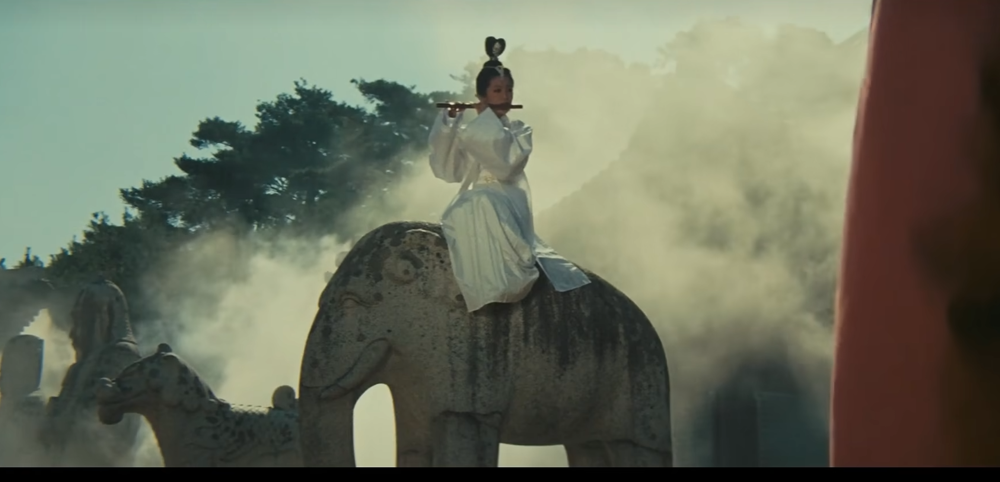
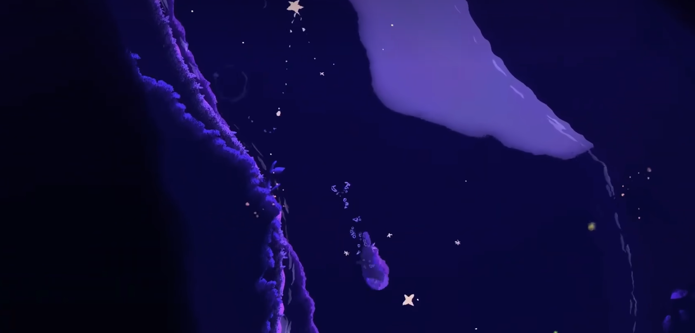

# 环境表现设计理念分析

## 一句话结论

**环境表现不是“堆美术”，而是用一套可复用的元素（光 / 动效 / 烟雾粒子 / 音 / 场景结构）去完成：引导、反馈、氛围，并尽量与玩法规则绑定。**

---

## 核心原理（最重要的 3 件事）

- **引导**：玩家不用 UI 也知道“往哪走、哪里重要、哪里危险”。（明暗对比 / 色温 / 方向性音效 / 动态吸引点）
- **反馈**：玩家的行为会被环境回应，让世界“活”。（脚步/草动/水波/火光变化/粒子散射）
- **氛围**：玩家能感受到“这里是什么地方、此刻是什么情绪”。（冷暖、留白、空气感、音景层次）

> 判断标准：**不看 UI、不读字，玩家能否靠环境完成“导航 + 理解 + 感受”。**

---

## 环境叙事-公式

### 氛围公式（胡金铨）

#### 美的氛围 = 光 + 烟雾 + 景 + 运镜 + 人 + 音

- **光**：明暗 / 色温 / 聚焦 / 位置 / 光斑 / 光晕 / 光影 → 定调 + 引导 + 规则提示
  - **安全/存档/恢复（示例）**：暖光/稳定光源/聚光范围 = “安全锚点”（篝火、灯笼、神龛、阵法、营地）
  - **危险/禁入（示例）**：偏红/闪烁/逆光剪影/强对比 = “风险提示”（敌巢、陷阱区、Boss场）
  - **探索引导（示例）**：远处一束光/窗缝漏光/光斑落点 = “目标方向”（少用箭头）
- **烟雾**：雾 / 尘 / 雨雪 / 飘絮粒子/ 虫群/ 鸟群 / 云雾 / 烟雾 / 雾霾 → 空气感 + 深度层次
- **景**：形体 / 留白 / 层次 / 遮挡 / 景深 / 远景雾化 / 景深 / 远景雾化 → 可读性 + 叙事证据
- **运镜**：镜头节奏 / 构图变化 / 镜头移动 / 镜头切换 / 镜头抖动 / 镜头旋转 / 镜头拉近 / 镜头拉远 → 信息投放顺序（游戏里对应：视角/镜头/玩家路径节奏）
- **人**：动作 / 停顿 / 剪影 / 表情 / 姿态 / 动作 / 停顿 / 剪影 / 表情 / 姿态 → 情绪锚点（游戏里对应：玩家行为反馈/敌我态势）
- **音**：底噪 + 事件 + 反馈 / 音效 / 音效设计 / 音效 / 音效设计 → 氛围 + 提示 + 叙事补全

### 从胡金铨画面迁移到游戏的 5 个高性价比细节

1. **明暗大块面优先**：2–3 个明暗层次先定情绪与空间，细节可以少。
2. **留白就是内容**：雾/天空/空地/远山的“空”＝寂静、距离、未知。
3. **剪影可读性**：先看“形”，再看“细”；战斗和夜景尤其重要。
4. **光束 + 烟雾**：空气结构可见化，同时天然形成引导线（无 UI 导航）。
5. **遮挡 + 远景雾化**：前景遮挡 + 中景主体 + 远景降饱和/雾化 = 低成本纵深。

---

## 环境叙事-落地

> 每做一个新场景，至少交付下面 5 条；做不到就先别加“精细材质”。

- **静态基底**：形体清晰、可读（不追求精细）。
- **动态一层**：树/草/旗/水面任一“活的动效”。
- **音效一层**：底噪（风/虫/水/城镇）+ 一条机制反馈（脚步/草/水/火）。
- **光照一层**：主光 + 明暗对比（至少能引导一处重点）。
- **后处理一层**：统一色调（冷/暖/压暗/对比度）让风格收敛。

---

## 环境叙事-交互反馈

###   "水"  

**注重水的物理，而不是水的表现，保证玩家能读懂水的状态，水物理是拓展玩法基础**

**核心思维**：水的价值来自“玩法机制”，视觉只需“能读懂”。

- **区域**：浅水/深水/危险/安全（颜色/纹理即可区分）
- **状态**：平静/波浪/结冰/污染/魔法（用动效或贴图变化表达）
- **交互反馈**：
  - **移动**：减速/阻尼/额外行动点消耗/滑行（冰）/打滑（泥）/无法通行（深水）
  - **战斗/元素联动**：导电（雷范围/伤害变化）/冻结（冰封地形）/蒸汽（火+水：遮挡视野/灼伤）/污染（持续DOT/减益）/净化（解除负面）
  - **物理/环境**：浮力（漂浮物/尸体）/冲刷（河流推力）/沉没（重量阈值）/落水（摔落/眩晕）/溺水（窒息计时）
  - **探索/交互**：涉水声暴露/潜行加成（浅水草丛）/可采集（水草/鱼/药）/隐藏通道（浅滩/暗流）/机关（水位/闸门）
  - **表现层**：踩水声/波纹/水花/泡沫/水迹（湿身、脚印）、水面反光（够用即可）
  - **生存/代价（可选）**：体温流失（寒水）/疲劳消耗（逆流）/疾病或感染（污水）/装备受潮（易燃/失灵）/视野折射（误判距离）
- **机制绑定（示例）**：
  - 移动：行动点消耗、路径限制
  - 战斗：水 + 雷/冰/火（范围/状态/遮挡）
  - 探索：隐藏/资源/机关

---

###   "音"  

**核心思维**：音效要支持玩法（提示/反馈/引导）及氛围营造，其次才是“好听”。

- **底噪（氛围）**：风/虫/水/城镇人声（让场景“活”）
- **事件提示（引导）**：远处怪、机关、目标区域（方向性/距离衰减）
- **交互反馈**：
  - **脚步材质**：木/石/泥/草/雪/金属/沙（可读“地形”）
  - **水相关**：踩水/涉水/落水/游泳（可读“水位与风险”）
  - **植被/布料**：草动/树叶摩擦/旗帜拍打（可读“风与动向”）
  - **火与能量**：火焰噼啪/熄灭/爆燃、法术嗡鸣（可读“状态变化”）
  - **交互与UI替代**：开门/拾取/机关启动/宝箱（确认反馈）
  - **危险提示**：远处吼叫/脚步逼近/低频轰鸣（提前预警与引导）
  - **状态提示**：湿/冻/燃/毒/流血/诅咒（用“音色差异”让玩家听出状态）
  - **地形危险**：塌陷/碎石滚落/冰裂/泥陷（用预警音提示“将要发生”）
---

###   "光"  

**核心思维**：光源的三个作用——**玩法机制、氛围营造、地图引导**。

#### 光源的地图引导（最重要）

- **明暗**：亮=重要/安全，暗=隐藏/危险（按你游戏规则定义）
- **颜色**：暖=安全/人类活动；冷=神秘/异界；红=危险/战斗
- **动态**：闪烁/移动/渐变＝吸引注意力、指示方向

#### 光源的“规则提示”（不涉及实现）

- **安全/可停留**：暖色/稳定/柔和衰减（营地、神龛、旅店、路灯聚光）
- **存档/重生/恢复**：更强的“仪式感光”（符文、光晕、聚光、点亮音）让玩家无需UI也能理解
- **危险/警戒**：红光/逆光剪影/闪烁/强对比（敌巢、Boss、陷阱区）
- **禁入/损伤**：黑光/低饱和/异常闪烁（诅咒区、污染区、精神压迫区）

#### 光源系统的分类

1. **自然光源（环境光源）**
   - 白天：太阳光、天空光、云层遮挡、轻反射
   - 黑夜：月光、星光、弱环境光
2. **人工光源（交互光源）**
   - 火把（玩家）、灯笼/火堆（场景）、魔法光（技能）
3. **玩法光源（机制光源）**
   - 视野/隐藏/战斗/探索（与规则绑定，优先级最高）

#### 技术实现（够用即可）

- **基础**：Directional Light + 阴影 + 简单后处理调色
- **可选增强**：动态时间、引导光源标记、少量光晕/粒子

