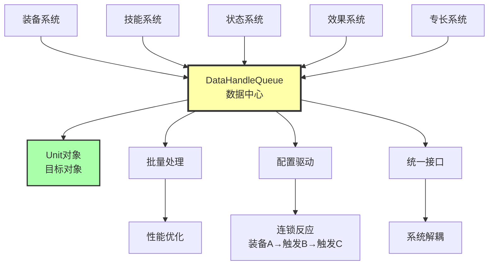
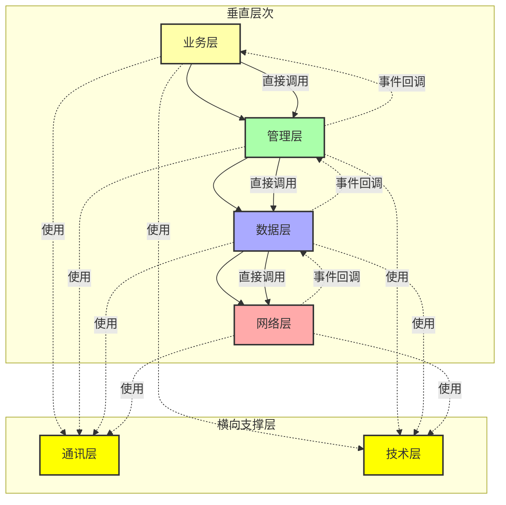

# 编程技术核心观点

## 1. 杜绝硬编码
避免在代码中直接写入固定值，使用配置或常量管理。

## 2. 数据驱动核心思想
将逻辑和数据分离：复杂逻辑在代码中实现，数据存储在外部配置文件中。通过修改数据而非代码来调整游戏行为。

## 3. 将控制流写成脚本
使用脚本语言实现控制流程，提高灵活性和可维护性。

## 4. 合理评估任务实现方式
在开发前梳理任务需求，判断是否真的需要使用代码实现，避免过度工程化。

## 5. 避免重复数据
消除数据冗余，保持数据源单一，确保数据一致性。

## 6. 使用开发工具生成数据
利用工具自动生成数据，减少手工输入错误，提高开发效率。

# 个人开发观点

## 7. 模板化
将常用的交互类型和表现抽象为可复用的模板，通过配置ID而非代码实现来减少开发成本。核心思路是：将重复的初始化逻辑封装为模板，通过模板映射表统一管理，使用时只需配置模板ID，系统自动完成组件查找和初始化，支持参数化配置以适应不同场景。

## 8. 归一化接口思路
使用统一的 Context 参数对象替代多参数函数，实现接口归一化。核心思路是：所有功能通过统一的 Context 表结构传递参数，接口保持稳定，新增字段不破坏现有接口，支持参数灵活扩展，实现向后兼容。这样既避免了参数过多导致的函数签名臃肿，又保证了接口的稳定性和扩展性。

## 9. 数据驱动 + 队列管理
通过数据中心（DataHandleQueue）实现系统完全解耦，所有系统通过统一的数据访问接口进行通信。核心思路是：各系统不直接依赖，而是通过队列推送数据和查询数据，实现批量处理优化性能，支持配置驱动的连锁反应（装备A → 触发B → 触发C），形成统一的数据流管理。

## 10. 实时属性计算 vs 批量更新
采用实时获取机制替代传统的批量更新模式。核心思路是：属性计算时实时从各子系统获取最新数据并汇总，而非维护dirty标记和批量更新。这样实现数据一致性100%，无需管理复杂的状态同步，新增模块自动参与计算，按需计算避免不必要的全量更新。

## 11. 职责分离的公式系统
将公式系统分为三级：一级为基础获取函数（程序员提供），二级为派生计算（策划编写），三级为综合效果计算（策划编写）。核心思路是：程序员提供基础设施和类型安全保证，策划独立编写和测试公式，实现职责清晰分离，提高开发效率和可维护性。

## 12. 分层架构设计
将项目业务划分为多个层次：业务层、管理层、数据层、网络层从上往下调用，通讯层和技术层作为横向支撑层供所有层使用。核心思路是：高层直接调用底层接口，底层通过事件回调通知高层，形成清晰的依赖关系和通信机制。这样既保证了层次职责分明，又实现了松耦合的架构设计。

## 13. 生命周期一致性
通过统一的生命周期管理系统实现 C# 和 Lua 之间的生命周期桥接，支持自动映射机制。核心思路是：C# 端通过 mappingName 自动映射到对应的 Lua 函数，支持所有 Unity 生命周期事件（Awake、Start、Update、OnDestroy等），提供自定义参数字典（valueTypeDict、objectDict）实现灵活传参。这样既保证了 C# 和 Lua 生命周期的一致性，又实现了自动化的函数映射，减少了手动绑定的工作量。

## 14. 对象池模式优化
通过对象池管理频繁创建和销毁的对象，减少GC压力和内存分配开销。核心思路是：预创建对象池，使用时从池中获取，使用完毕后归还到池中，支持智能扩容、预热机制和容量控制。这样既避免了频繁的内存分配和回收，又保证了性能的稳定性，特别适用于粒子特效、子弹、UI元素等高频创建的对象。

## 15. 策略模式解耦
通过策略模式实现算法的可替换性，消除硬编码依赖。核心思路是：将算法封装为独立的策略类，通过工厂或配置选择具体策略，支持运行时动态切换。这样既保证了算法的可扩展性，又实现了代码的解耦，特别适用于资源加载、寻路算法、状态机等需要多种实现方式的场景。

## 16. 性能优化思路
通过有效范围限制、位图优化、缓存机制等策略实现性能提升。核心思路是：识别性能瓶颈，采用空间分割（有效范围）、数据结构优化（位图查询）、结果缓存等方式，避免不必要的全量计算。这样既保证了功能的完整性，又实现了性能的大幅提升（如网格系统有效范围优化实现2268倍性能提升）。