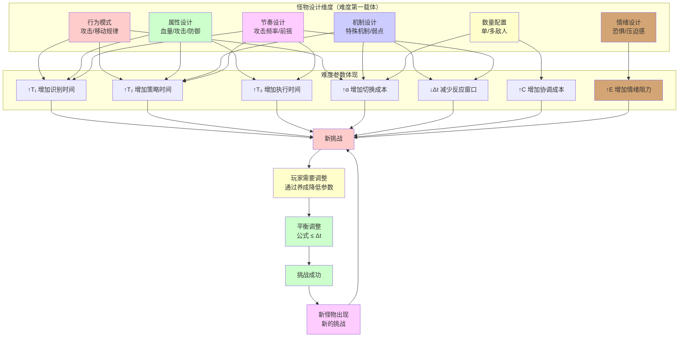

# 怪物之道

## 一、根本定义：怪物即难度的第一载体

> **怪物 = 游戏难度的第一载体，通过怪物的行为、属性、机制，体现难度公式参数，给玩家提供新的挑战**
>
> - **难度公式**：**(T₁ + T₂ + T₃) × (1 + α) × E > Δt**
> - **怪物定位**：作为难度的第一载体，通过影响公式中的参数，给玩家提供新的挑战
> - **核心原理**：怪物不是"数值堆叠"，而是"难度的直接体现者"，给玩家提供需要调整应对的新挑战

| 怪物设计维度 | 影响的参数 | 作用机制 | 典型案例 |
|------------|-----------|---------|---------|
| **行为模式** | ↑T₁、↑T₂、↑α | 攻击模式、移动规律影响识别和策略时间 | 《只狼》的敌人攻击模式、《黑魂》的Boss行为 |
| **属性设计** | ↑T₁、↑T₂、↑T₃ | 血量、攻击力、防御力影响战斗时间 | 《暗黑破坏神》的精英怪、《怪物猎人》的怪物属性 |
| **机制设计** | ↑T₂、↑α、↓Δt | 特殊机制、弱点系统影响策略和反应窗口 | 《怪物猎人》的肉质系统、《原神》的元素反应 |
| **数量配置** | ↑α、↑C | 多敌人配置增加切换和协调成本 | 《黑魂》的多敌人战斗、《DOTA2》的团战 |
| **节奏设计** | ↓Δt、↑T₁、↑T₂、↑T₃ | 攻击频率、前摇时间影响反应窗口和时间参数 | 《只狼》的完美格挡、《鬼泣》的连击节奏 |
| **情绪设计** | ↑E | 视觉/音效/机制造成恐惧、压迫感，影响主观难度 | 《黑魂》的咒蛙：心理阴影导致节奏混乱 |

> ✅ **关键突破**：怪物是**游戏难度的第一载体**，通过体现难度公式参数，给玩家提供新的挑战。玩家需要通过养成来调整应对这些挑战，形成"挑战→调整→新挑战"的循环。

### 怪物与难度平衡关系图

## 二、怪物设计维度详解

### 行为模式

**作用**：影响 T₁（识别时间）、T₂（策略时间）、α（上下文切换成本）

| 行为类型 | 影响参数 | 作用机制 | 典型案例 |
|---------|---------|---------|---------|
| **攻击模式** | ↑T₁、↑T₂ | 攻击前摇、攻击范围影响识别和策略时间 | 《只狼》的完美格挡、《黑魂》的Boss攻击 |
| **移动规律** | ↑T₁、↑α | 移动模式、位置变化影响识别和切换成本 | 《怪物猎人》的怪物移动、《原神》的敌人走位 |
| **行为组合** | ↑T₂、↑α | 多种行为组合增加策略和切换成本 | 《黑魂》的Boss连招、《只狼》的敌人组合技 |
| **行为变化** | ↑α | 阶段变化、状态切换增加切换成本 | 《怪物猎人》的愤怒状态、《原神》的Boss阶段 |

> **设计要点**：行为模式应提供**可学习的规律**，而非随机不可预测。

### 属性设计

**作用**：影响 T₁、T₂、T₃（所有时间参数）

| 属性类型 | 影响参数 | 作用机制 | 典型案例 |
|---------|---------|---------|---------|
| **血量** | ↑T₃ | 血量影响战斗持续时间 | 《暗黑破坏神》的精英怪血量 |
| **攻击力** | ↑T₁ | 攻击力影响容错率，增加识别需求 | 《黑魂》的Boss攻击力 |
| **防御力** | ↑T₃ | 防御力影响输出效率，增加执行时间 | 《怪物猎人》的怪物防御 |
| **属性抗性** | ↑T₂ | 抗性影响策略选择时间 | 《原神》的元素抗性 |

> **设计要点**：属性应服务于**时间参数的调节**，而非单纯的数值堆叠。

### 机制设计

**作用**：影响 T₂（策略时间）、α（上下文切换成本）、Δt（反应窗口）

| 机制类型 | 影响参数 | 作用机制 | 典型案例 |
|---------|---------|---------|---------|
| **弱点系统** | ↓T₂、↓T₃ | 弱点降低策略和执行时间 | 《怪物猎人》的肉质系统、《原神》的元素反应 |
| **特殊机制** | ↑T₂、↑α | 特殊机制增加策略和切换成本 | 《黑魂》的Boss机制、《只狼》的危字攻击 |
| **状态系统** | ↑α | 状态变化增加切换成本 | 《原神》的Boss阶段、《怪物猎人》的异常状态 |
| **机制破解** | ↓T₂、↓α | 机制破解降低策略和切换成本 | 《原神》的护盾机制、《黑魂》的弱点攻击 |

> **设计要点**：机制应提供**有意义的策略选择**，而非单纯的难度增加。

### 数量配置

**作用**：影响 α（上下文切换成本）、C（协同协调成本）

| 配置类型 | 影响参数 | 作用机制 | 典型案例 |
|---------|---------|---------|---------|
| **单敌人** | ↑T₁、↑T₂、↑T₃ | 单个强敌增加所有时间参数 | 《只狼》的Boss战、《黑魂》的单体Boss |
| **多敌人** | ↑α、↑C | 多个敌人增加切换和协调成本 | 《黑魂》的多敌人战斗、《DOTA2》的团战 |
| **混合配置** | ↑α、↑T₂ | 强弱敌人混合增加切换和策略成本 | 《黑魂》的精英+小兵、《原神》的混合敌人 |
| **数量变化** | ↑α | 动态数量变化增加切换成本 | 《黑魂》的召唤机制、《原神》的刷新机制 |

> **设计要点**：数量配置应服务于**切换成本的调节**，而非单纯的难度堆叠。

### 节奏设计

**作用**：影响 Δt（反应窗口）和所有时间参数（T₁、T₂、T₃）

| 节奏类型 | 影响参数 | 作用机制 | 典型案例 |
|---------|---------|---------|---------|
| **攻击频率** | ↓Δt | 高频攻击减少反应窗口 | 《只狼》的快速攻击、《鬼泣》的连击 |
| **前摇时间** | ↑Δt、↓Δt | 前摇时间影响反应窗口 | 《只狼》的完美格挡、《黑魂》的Boss前摇 |
| **节奏变化** | ↑α | 节奏变化增加切换成本 | 《只狼》的快慢结合、《黑魂》的节奏变化 |
| **节奏规律** | ↓T₁、↓T₂ | 规律节奏降低识别和策略时间 | 《只狼》的可学习节奏、《音游》的节拍 |

> **设计要点**：节奏应提供**可学习的规律**，让玩家能够通过练习降低时间参数。

### 情绪设计

**作用**：影响 E（情绪调节因子），进而影响主观难度和实际时间参数

| 情绪类型 | 影响参数 | 作用机制 | 典型案例 |
|---------|---------|---------|---------|
| **恐惧感** | ↑E | 视觉/音效/机制造成恐惧，导致心理阴影 | 《黑魂》的咒蛙：造成心理阴影，导致节奏混乱 |
| **压迫感** | ↑E | 巨大体型、强大气场造成压迫感 | 《黑魂》的Boss：巨大体型造成心理压力 |
| **挫败感** | ↑E | 失败惩罚严重，导致害怕失败 | 《黑魂》的死亡惩罚：害怕死亡导致操作保守 |
| **不公平感** | ↑E | 机制不公平，导致愤怒和挫败 | 设计不当的Boss：机制不公平导致E值增大 |
| **掌控感** | ↓E | 可预测、可学习，增强掌控感 | 《只狼》的可学习Boss：增强掌控感，降低E值 |

> **典型案例**：《黑暗之魂》的咒蛙
> - **视觉设计**：丑陋的外形、诡异的动作
> - **机制设计**：诅咒机制（失败惩罚严重）
> - **心理影响**：造成心理阴影，导致玩家看到咒蛙时E值增大
> - **实际效果**：E值增大 → 主观难度被放大 → 节奏混乱 → 实际T₂/T₃恶化 → 更容易失败
>
> **设计要点**：情绪设计应服务于**创造挑战氛围**，但需避免过度恐惧导致E值过高，进入恶性循环。

## 三、怪物的难度倾向类型

> **难度倾向**：怪物通过不同的参数组合，体现不同的难度类型，给玩家提供不同类型的挑战

### 五大难度倾向类型

| 类型 | 参数特征 | 核心挑战 | 设计要点 | 典型案例 |
|------|---------|---------|---------|---------|
| **1. 操作压迫型** | ↑T₃，↓Δt | "看到了，但手没跟上" | 高攻击频率、短前摇、精确时机要求 | 《只狼》的完美格挡敌人、《鬼泣》的高速敌人、《Celeste》的移动平台 |
| **2. 策略压迫型** | ↑T₂，信息强耦合 | "本可以，但选错了" | 复杂机制、多选择、后果严重 | 《黑魂》的机制Boss、《原神》的元素反应Boss、《XCOM》的策略敌人 |
| **3. 节奏超载型** | ↓T₁、↓T₂、↓T₃ 同时高压 | "脑子手全炸，呼吸乱了" | 高频攻击、多目标、快速决策 | 《节奏地牢》的节拍敌人、《Furi》的弹幕Boss、《音游》的高难度敌人 |
| **4. 上下文切换型** | ↑α，多节奏异构 | "节奏全乱，不知盯谁" | 多敌人、多机制、多阶段 | 《黑魂》的多敌人战斗、《怪物猎人》的多怪物狩猎、《DOTA2》的团战 |
| **5. 协同同步型** | ↑C，个体能力总和 × (1+C) | "我们各自都会，但合不来" | 多人配合、角色定位、协调需求 | 《怪物猎人》的多人狩猎、《原神》的多人Boss、《Left 4 Dead》的团队敌人 |

### 操作压迫型怪物

**特征**：↑T₃（执行时间），↓Δt（反应窗口）

| 怪物设计 | 参数调节 | 典型例子 |
|---------|---------|---------|
| **高速攻击** | ↓Δt，↑T₃ | 《只狼》的居合斩敌人：极短前摇，需要完美格挡 |
| **精确时机** | ↓Δt，↑T₃ | 《鬼泣》的完美闪避敌人：需要帧级精度 |
| **连击攻击** | ↓Δt，↑T₃ | 《只狼》的连击敌人：连续攻击，需要连续格挡 |
| **快速移动** | ↓Δt，↑T₃ | 《Celeste》的移动平台：快速移动，需要精确跳跃 |

**设计要点**：通过**缩短反应窗口**和**增加执行精度要求**，训练玩家的操作能力。

### 策略压迫型怪物

**特征**：↑T₂（策略时间），信息强耦合

| 怪物设计 | 参数调节 | 典型例子 |
|---------|---------|---------|
| **机制Boss** | ↑T₂ | 《黑魂》的机制Boss：需要理解机制才能应对 |
| **元素反应** | ↑T₂ | 《原神》的元素反应Boss：需要策略性元素搭配 |
| **弱点系统** | ↑T₂ | 《怪物猎人》的肉质系统：需要策略性攻击部位 |
| **状态变化** | ↑T₂ | 《黑魂》的阶段Boss：不同阶段需要不同策略 |

**设计要点**：通过**复杂机制**和**策略选择**，考验玩家的推理和决策能力。

### 节奏超载型怪物

**特征**：↓T₁、↓T₂、↓T₃ 同时高压

| 怪物设计 | 参数调节 | 典型例子 |
|---------|---------|---------|
| **弹幕Boss** | ↓T₁、↓T₂、↓T₃ | 《Furi》的弹幕Boss：同时处理弹幕和近战 |
| **节拍敌人** | ↓T₁、↓T₂、↓T₃ | 《节奏地牢》的节拍敌人：需要跟随节拍战斗 |
| **多目标攻击** | ↓T₁、↓T₂、↓T₃ | 《音游》的高难度敌人：同时处理多个目标 |
| **快速决策** | ↓T₁、↓T₂、↓T₃ | 《鬼泣》的连击敌人：需要快速决策和操作 |

**设计要点**：通过**同时压缩所有时间参数**，逼近玩家的身心协同极限。

### 上下文切换型怪物

**特征**：↑α（上下文切换成本），多节奏异构

| 怪物设计 | 参数调节 | 典型例子 |
|---------|---------|---------|
| **多敌人战斗** | ↑α | 《黑魂》的多敌人围攻：需要切换目标，节奏混乱 |
| **多机制Boss** | ↑α | 《原神》的多机制Boss：需要同时处理多个机制 |
| **多阶段Boss** | ↑α | 《怪物猎人》的多阶段Boss：阶段切换需要思维转换 |
| **混合敌人** | ↑α | 《黑魂》的精英+小兵：强弱敌人混合，需要切换策略 |

**设计要点**：通过**多节奏异构**和**频繁切换**，增加玩家的认知并发冲突。

### 协同同步型怪物

**特征**：↑C（协同协调成本），个体能力总和 × (1+C)

| 怪物设计 | 参数调节 | 典型例子 |
|---------|---------|---------|
| **多人Boss** | ↑C | 《怪物猎人》的多人狩猎：需要团队配合 |
| **分工Boss** | ↑C | 《原神》的多人Boss：需要角色分工和配合 |
| **连锁机制** | ↑C | 《Left 4 Dead》的团队敌人：需要团队协调应对 |
| **信息不对称** | ↑C | 《Among Us》的推理游戏：需要信息共享和协调 |

**设计要点**：通过**多人协调需求**，将社交张力转化为游戏张力。

### 混合类型怪物

> **混合类型**：怪物可以同时体现多种难度倾向，创造更复杂的挑战

| 混合类型 | 组合方式 | 典型例子 |
|---------|---------|---------|
| **操作+策略** | ↑T₃、↑T₂ | 《只狼》的机制Boss：需要操作和策略结合 |
| **节奏+切换** | ↓T₁/T₂/T₃、↑α | 《黑魂》的多敌人快速战斗：节奏高压+频繁切换 |
| **策略+切换** | ↑T₂、↑α | 《原神》的多机制Boss：复杂策略+频繁切换 |
| **操作+节奏** | ↑T₃、↓T₁/T₂/T₃ | 《鬼泣》的连击Boss：操作精度+节奏高压 |
| **操作+情绪** | ↑T₃、↑E | 《黑魂》的咒蛙：操作要求+心理阴影，导致节奏混乱 |
| **策略+情绪** | ↑T₂、↑E | 《黑魂》的机制Boss+死亡惩罚：策略要求+挫败感 |
| **节奏+情绪** | ↓T₁/T₂/T₃、↑E | 《黑魂》的快速Boss+恐惧感：节奏高压+心理压力 |

> **设计要点**：混合类型可以创造**更丰富的挑战体验**，但需要平衡，避免过度复杂。**特别注意E值的影响**：E值过高会导致实际T₂/T₃恶化，形成恶性循环。

## 四、怪物与养成的平衡

### 新挑战 vs 玩家调整

> **平衡公式**：**怪物难度参数 ≤ 玩家养成调整后的能力参数**
>
> **核心循环**：**怪物提供新挑战 → 玩家需要调整 → 通过养成调整参数 → 应对新挑战 → 新怪物提供新挑战**

| 平衡状态 | 怪物难度 | 玩家养成 | 玩家体验 | 典型案例 |
|---------|---------|---------|---------|---------|
| **平衡** | = 玩家能力 | 适度养成 | 有挑战感，有成长感 | 《暗黑破坏神》的难度曲线 |
| **失衡（过强）** | > 玩家能力 | 养成不足 | 挫败感强，可能弃游 | 难度曲线设计不当 |
| **失衡（过弱）** | < 玩家能力 | 养成过度 | 挑战不足，缺乏成就感 | 数值膨胀的游戏 |

> **设计要点**：保持**动态平衡**，让怪物难度与玩家养成能力相匹配。

### 怪物的边际效应

> **边际效应**：随着怪物难度增加，对玩家时间参数的提升效果递减

| 难度阶段 | 参数提升效果 | 玩家感受 | 设计策略 |
|---------|------------|---------|---------|
| **初期** | 高（显著提升参数） | 挑战感强 | 基础行为模式 |
| **中期** | 中（适度提升参数） | 挑战感稳定 | 机制组合 |
| **后期** | 低（小幅提升参数） | 挑战感减弱 | 新机制、新维度 |

> **设计要点**：通过**新的设计维度**（如新机制、新行为）来突破边际效应，给玩家提供新的挑战，需要新的调整。

### 怪物的生态关系

> **生态关系**：不同怪物之间的搭配、克制、组合关系，通过生态关系创造更丰富的挑战体验

| 生态关系类型 | 作用机制 | 参数影响 | 典型案例 |
|------------|---------|---------|---------|
| **互补组合** | 不同难度倾向的怪物组合 | ↑α、↑T₂ | 《黑魂》的远程+近战组合：需要切换策略 |
| **克制关系** | 不同怪物克制不同玩法 | ↑T₂、↑α | 《原神》的元素克制：需要策略性选择 |
| **层次关系** | 强弱怪物形成层次 | ↑α、↑T₂ | 《黑魂》的精英+小兵：需要优先处理 |
| **协同关系** | 怪物之间相互配合 | ↑C、↑α | 《怪物猎人》的多怪物狩猎：需要协调应对 |
| **生态循环** | 怪物之间的动态关系 | ↑α、↑T₂ | 《原神》的元素反应：需要理解生态关系 |

> **典型案例**：
> - **《黑暗之魂》的怪物组合**：远程弓箭手+近战敌人，需要玩家在躲避远程攻击和应对近战之间切换，增加α值
> - **《原神》的元素反应**：不同元素怪物之间形成克制关系，需要玩家理解生态关系，增加T₂值
> - **《怪物猎人》的多怪物狩猎**：多个怪物同时出现，需要玩家协调应对，增加C值

> **设计要点**：通过**生态关系**创造更丰富的挑战，让玩家需要理解怪物之间的关系，而非单纯应对单个怪物。

## 五、设计原则

### 核心原则

1. **难度第一载体**  
   怪物是游戏难度的第一载体，通过体现难度公式参数，给玩家提供新的挑战，需要玩家通过养成来调整应对。

2. **可学习的规律**  
   怪物行为应提供可学习的规律，让玩家能够通过练习降低时间参数。

3. **有意义的机制**  
   怪物机制应提供有意义的策略选择，而非单纯的难度增加。

4. **动态平衡**  
   怪物难度应与玩家养成能力保持平衡，避免过度挑战或挑战不足。

5. **怪物即挑战**（统领性原则）  
   **怪物是游戏难度的第一载体，给玩家提供新的挑战。玩家需要通过养成来调整应对，形成"挑战→调整→新挑战"的循环。**

### 设计哲学：怪物即挑战

> **高明的怪物设计，是玩家与游戏挑战之间的一场动态平衡**：
> - 怪物说："我带来了新的挑战。"
> - 玩家答："我需要通过养成来调整，让它变得可应对。"
>
> 每一次新挑战，都是新的调整需求；每一次调整，都是新的成长验证。

> **真正的怪物设计，从不问"你能打过吗？"，而问"你如何调整应对这个新挑战？"**  
> ——而答案，藏在可学习的规律、有意义的机制、动态的平衡之中。

## ✅ 总结

| 层级 | 核心内容 | 解决的问题 |
|------|---------|-----------|
| **机制层** | 作为难度第一载体，体现 (T₁+T₂+T₃)×(1+α)×E 和 Δt | "怪物如何工作？"（可量化） |
| **维度层** | 六大设计维度（行为、属性、机制、数量、节奏、情绪） | "怪物有哪些设计方式？"（可分类） |
| **平衡层** | 怪物难度 vs 玩家养成能力，挑战→调整循环 | "如何保持平衡？"（可控制） |
| **设计原则** | 五大核心原则 + 怪物即挑战的哲学 | "如何设计好怪物？"（可指导） |

**这不是一个怪物设计模型，而是一套关于"怪物作为难度第一载体，给玩家提供新挑战"的完整设计哲学。**

