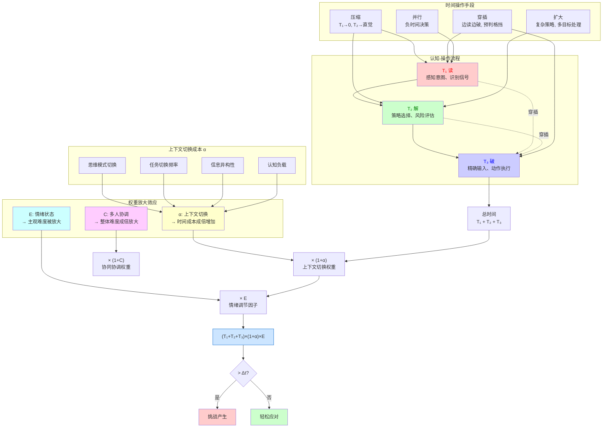

# 游戏难度之道

## 一、根本定义：难度即时间张力

> **游戏难度 = 玩家完成有效交互所需的认知-操作总时间 > 系统给予的时间窗口**
>
> - **单人游戏**：当 **(T₁ + T₂ + T₃) × (1 + α) × E > Δt** 时，挑战产生。
> - **多人游戏**：当 **∑[(T₁ + T₂ + T₃) × (1 + α)]_i × (1 + C) × E > Δt** 时，挑战产生。
>   - 即：**个体认知负荷总和 × 协同协调权重 × 情绪调节因子 > 系统时间窗口**

| 阶段/参数 | 符号 | 定义 |
|---------|------|------|
| **读（Read）** | T₁ | 感知意图、识别信号（视觉/听觉/节奏提示） |
| **解（Interpret）** | T₂ | 策略选择、风险评估、资源分配 |
| **破（Execute）** | T₃ | 精确输入、动作执行、时机把控 |
| **上下文切换权重** | α | 思维上下文切换成本因子（从一种思维模式切换到另一种的认知开销，类似神经网络的权重调节） |
| **协同协调权重** | C | 多人游戏中的协同协调成本因子（角色异构性、信息不对称、失败连锁性、沟通带宽等导致的协调开销，作为权重放大整体难度） |
| **情绪调节因子** | E | 情绪-认知耦合因子（受挫败感、掌控感、公平感影响，体现主观难度与客观难度的差异） |
| **反应窗口** | Δt | 系统提供的反应窗口（前摇、间隙、硬直等） |

> ✅ **关键突破**：难度的本质是**玩家所需时间与反应窗口的对比关系**，而非单纯的数值堆叠。

### 游戏难度解构图

### 权重因子详解

#### 上下文切换权重 α

**α = f(思维模式差异度, 任务切换频率, 信息异构性, 认知负载)**

| α 值范围 | 切换程度 | 典型场景 | 时间成本影响 |
|---------|---------|---------|------------|
| **α ≈ 0** | 无需切换 | 单一节奏，纯操作挑战 | 无额外成本 |
| **α ≈ 0.2~0.5** | 轻度切换 | 战斗中的技能切换、单一策略调整 | 时间成本增加 20%~50% |
| **α > 1.0** | 重度切换 | 多目标、多节奏同时处理，复杂策略重构 | 时间成本成倍增加 |

#### 协同协调权重 C

**C = f(角色异构性, 信息不对称, 失败连锁性, 沟通带宽)**

| C 值范围 | 协调程度 | 典型场景 | 难度放大影响 |
|---------|---------|---------|------------|
| **C ≈ 0** | 无需协调 | 单人游戏，或完全独立的多玩家任务 | 无额外难度 |
| **C ≈ 0.1~0.3** | 轻度协调 | 简单配合（如标记、语音沟通），角色职责清晰 | 难度增加 10%~30% |
| **C ≈ 0.5~1.0** | 中度协调 | 需要策略配合、时机同步，信息共享有限 | 难度增加 50%~100%（难度翻倍） |
| **C > 1.0** | 重度协调 | 复杂团队配合、高度信息不对称、失败连锁反应 | 难度成倍放大，可能远超个体操作难度 |

#### 情绪调节因子 E

**E = f(挫败感, 掌控感, 公平感)**

> **E 的双重属性**：设计层面的 E（开发者可控）vs 玩家主观感受的 E（开发者不可控，受文化背景、经验、价值观影响）。  
> **案例**：《最后生还者》（个人主义）vs《地铁》（集体主义）在不同文化背景下的主观 E 差异。

- **E 受挫败感、掌控感、公平感影响**：
  - 高掌控感 → E < 1（难而爽）
  - 低公平感 → E > 2（难而怒）

| E 值范围 | 情绪状态 | 主观体验 | 行为表现 |
|---------|---------|---------|---------|
| **E ≈ 0.6~0.8** | 掌控感强 + 节奏流畅 | "虽然快，但我能跟上！" → 难度感觉降低 | 专注、流畅、享受挑战 |
| **E = 1.0** | 中性专注 | 客观难度 = 主观难度 | 理性分析，按部就班 |
| **E ≈ 1.5~2.5** | 挫败累积 + 不公平感 | "这根本反应不过来！" → 难度被放大 | 焦虑、急躁、怀疑设计 |
| **E > 3.0** | 愤怒/绝望 | 放弃思考，乱按 → 实际 T₂/T₃ 恶化 | 形成恶性循环，可能弃游 |

## 二、底层机制：动态穿插与伸缩

> **"读→解→破"并非线性流程，而是可穿插、可压缩、可延后、可并行、可迭代的认知弹性结构**：

- **阶段并行**：高手边读边破（如预判格挡），甚至"负时间决策"
- **时间压缩**：熟练后 T₁→0（模式识别自动化），T₂→直觉
- **权重优化**：通过模式识别和预判，不仅能压缩 T₁、T₂、T₃，还能降低权重因子 α（上下文切换）和 E（情绪调节）
- **失败重校**：死亡触发认知更新，重构时间分配策略

> 🔁 **此即玩家内生的动态难度适应（DDA）**：通过学习**主动压缩所需时间**，使 **(T₁+T₂+T₃)×(1+α)×E ≤ Δt**（单人）或 **∑[(T₁+T₂+T₃)×(1+α)]_i × (1+C)×E ≤ Δt**（多人）。玩家通过认知优化，压缩基础时间并降低权重因子。

## 三、五大难度结构（时间分配的五种策略）

| 类型 | 时间特征 | 核心体验 | 设计本质 | 典型案例 |
|------|--------|--------|--------|---------|
| **1. 操作压迫型** | ↑T₃，↓Δt | "看到了，但手没跟上" | 训练帧级精度与肌肉记忆 | 《只狼：影逝二度》的完美格挡、《鬼泣5》的连招、《Celeste》的像素级跳跃 |
| **2. 策略压迫型** | ↑T₂，信息强耦合 | "本可以，但选错了" | 考验推理深度与后果预见 | 《XCOM 2》的回合制策略、《文明6》的外交决策、《Into the Breach》的连锁反应计算 |
| **3. 节奏超载型** | ↓T₁、↓T₂、↓T₃ 同时高压 | "脑子手全炸，呼吸乱了" | 逼近身心协同极限 | 《节奏地牢》的节拍战斗、《Furi》的弹幕+近战、《音游（Osu!）》的高难度谱面 |
| **4. 上下文切换型** | ↑α（切换权重），多节奏异构 → 切换成本成倍放大 | "节奏全乱，不知盯谁" | 通过权重因子 α 放大时间成本，制造认知并发冲突 | 《DOTA2》/《英雄联盟》的多目标团战、《黑魂》的多敌人围攻、《怪物猎人》的多人狩猎 |
| **5. 协同同步型** | ↑C（协同协调权重），个体能力总和 × (1+C) | "我们各自都会，但合不来" | 通过权重因子 C 成倍放大整体难度，将社交张力转化为游戏张力 | 《Overcooked》的厨房协作、《Among Us》的团队推理、《Left 4 Dead》的团队生存 |

## 四、设计原则

### 核心原则

1. **原理先行**  
   用**时间参数**（前摇、速度、硬直、Δt）和**权重因子**（α、C、E）调控难度，而非堆血量/伤害。

2. **规则透明**  
   所有机制必须**可观测、可推理、可归因**；失败应指向时间管理（T₁+T₂+T₃）或权重因子（α、C、E），而非信息黑箱。

3. **节奏即语言**  
   高难度需有**韵律、公平与可学习性**，让突破带来顿悟快感。

4. **难度服务成长**  
   匹配玩家从"串行思考"到"并行直觉"的认知进化。

5. **难度即引导**（统领性原则）  
   **所有挑战必须服务于玩家的认知成长、操作精进或情感共鸣，而非刁难或惩罚。** 保持 E 值在 0.6~1.5 区间。

### 设计哲学：难度即对话

> **高明的难度设计，是设计师与玩家之间的一场无声对话**：
> - 系统说："这个窗口很小。"
> - 玩家答："但我能学会看懂它、应对它、超越它。"
>
> 每一次失败，都是认知校准；每一次成功，都是时间掌控的胜利。

> **真正的高难度，从不问"你能过吗？"，而问"你是否愿意再试一次？"**  
> ——而答案，藏在清晰的规则、公平的节奏、可感的成长之中。

## ✅ 总结

| 层级 | 核心内容 | 解决的问题 |
|------|---------|-----------|
| **机制层** | (T₁+T₂+T₃)×(1+α)×E vs Δt | "难在哪里？"（可量化） |
| **运行层** | 动态穿插与伸缩 | "难为何可被征服？"（可学习） |
| **结构层** | 五大难度类型 | "难有几种？"（可分类） |
| **设计原则** | 五大核心原则 + 难度即对话 | "如何设计好难？"（可指导） |

**这不是一个难度模型，而是一套关于"人如何在游戏中变强"的完整认知诗学。**