# 系统闭环之道

> **目的**：以《道德经》"周行而不殆"的循环思想，梳理现有设计，识别未形成闭环的系统，提出闭环方案
>
> **《道德经》思想**："反者道之动"——道的运动是循环往复的；"周行而不殆"——循环运行而不停止。在游戏设计中，系统闭环体现了道的循环特性，让游戏世界自然运行，形成有机的整体。

---

## 一、已形成闭环的系统（道之循环已显）

> **《道德经》思想**："周行而不殆"——系统形成闭环后，能够循环运行而不停止，这是道的自然状态。

### 1.1 战斗成长闭环 ✅

**闭环流程：**

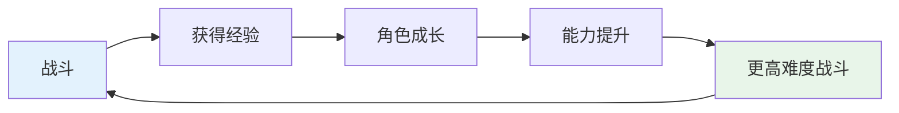

**驱动力强度**：⭐⭐⭐⭐⭐ (5/5) | **状态**：✅ 闭环完整

**核心机制**：基于DND战斗机制，战斗立即获得经验，等级提升解锁新技能/装备，能力提升解锁更高难度战斗，形成完整循环。

### 1.2 五行生克制化闭环 ✅

**闭环流程：**

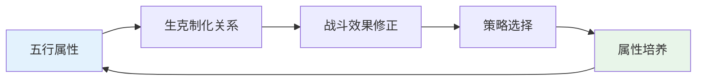

**驱动力强度**：⭐⭐⭐⭐ (4/5) | **状态**：✅ 闭环完整

**核心机制**：基于中国传统五行理论，五行关系直接影响战斗效果，战斗反馈影响属性培养策略，提供策略深度和文化特色。

---

## 二、部分闭环的系统（需要补充，完善道之循环）

> **《道德经》思想**："反者道之动"——道的运动是循环往复的，系统需要形成完整的循环才能自然运行。部分闭环的系统需要补充缺失的环节，让道之循环完整。

### 2.1 动态世界系统（混沌世界系统）✅

**闭环流程：**

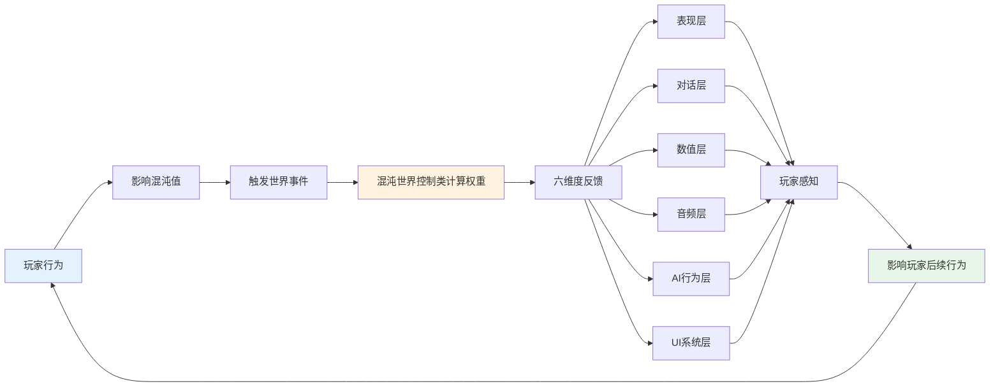

**驱动力强度**：⭐⭐⭐⭐ (4/5) | **状态**：✅ 闭环设计完整（需实现验证）

**核心机制**：

- **混沌世界控制类**：作为权重系统，统一计算各维度权重（0.0-1.0），影响六维度反馈
- **六维度反馈**：表现层（Shader、天气、环境）、对话层、数值层、音频层、AI行为层、UI系统层
- **核心功能**：引导（无UI导航）、反馈（让世界"活"）、氛围（情绪锚点）
- **玩法绑定**：环境变化与玩法规则绑定，影响战斗难度、任务难度、NPC行为、资源分布

---

### 2.2 信仰-混沌值-世界影响闭环 ✅

**闭环流程：**

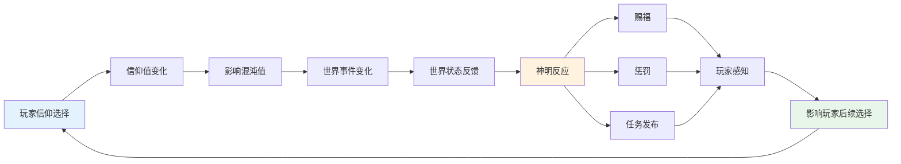

**驱动力强度**：⭐⭐⭐⭐ (4/5) | **状态**：✅ 闭环设计完整（需实现验证）

**核心机制**：

- **信仰值反馈**：信仰值影响神明buff/debuff（属性加成、技能强化、特殊能力）
- **混沌值量化**：混沌值 = 鬼怪精数量，影响区域刷新频率和难度
- **大煞气事件**：混沌值>80触发，视觉反馈（红色后处理、环境变冷、天气变化），游戏性影响（驱魔难度增加、NPC行为变化）
- **神明反应**：信仰值高时神明主动发布任务、给予赐福；信仰值低时冷淡、任务减少

### 2.3 功德-业报-玩家行为闭环 ✅

**系统设计**：

- **功德系统**：一维（道德轴：善良-邪恶），-100~+100，影响天道反馈、NPC态度、任务难度
- **秩序系统**：一维（秩序轴：秩序-混沌），-100~+100，影响混沌值、世界事件、NPC态度
- **阵营系统**：二维（秩序轴+道德轴），9个阵营，综合影响任务解锁、NPC态度、剧情分支、结局

**闭环流程：**

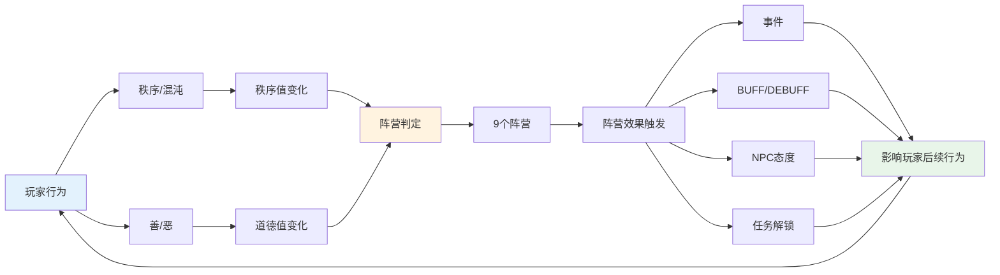

**驱动力强度**：⭐⭐⭐⭐ (4/5) | **状态**：✅ 闭环设计完整（需实现验证）

**核心机制**：基于DND阵营系统，玩家行为影响秩序值和道德值，判定9个阵营，触发相应效果，形成角色塑造和道德选择的游戏深度。

---

### 2.4 神明互动-玩家影响闭环 ✅

**闭环流程：**

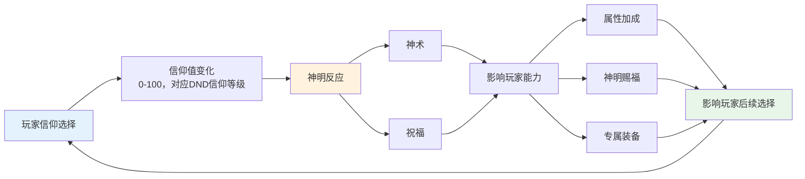

**驱动力强度**：⭐⭐⭐⭐ (4/5) | **状态**：✅ 闭环设计完整（需实现验证）

**核心机制**：

- **信仰值等级**：0-30（冷淡）、31-70（虔诚）、71-100（狂热），影响神明反应强度
- **神明反应**：信仰值高时给予赐福（BUFF/技能/装备），信仰值低时冷淡、减少赐福
- **能力影响**：属性加成、神明赐福、专属装备，直接影响战斗表现

---

### 2.5 任务-奖励-成长闭环 ✅

**闭环流程：**

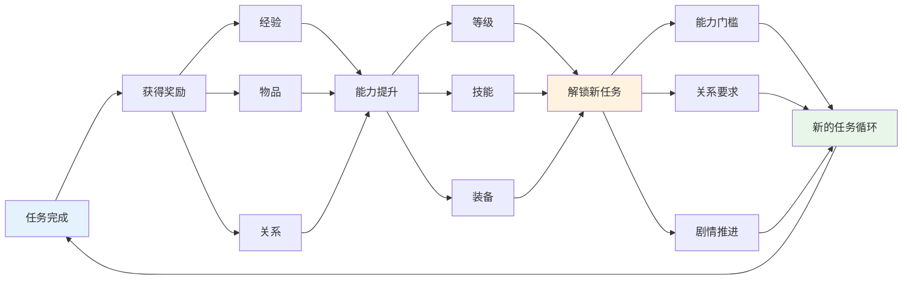

**驱动力强度**：⭐⭐⭐⭐ (4/5) | **状态**：✅ 闭环设计完整（需实现验证）

**核心机制**：基于DND任务系统，任务解锁（能力/关系/剧情）、任务分支（选择影响后续）、任务链（主线/支线/隐藏），提供目标驱动和内容引导。

### 2.6 冒险-探索-发现闭环 ✅

**闭环流程：**

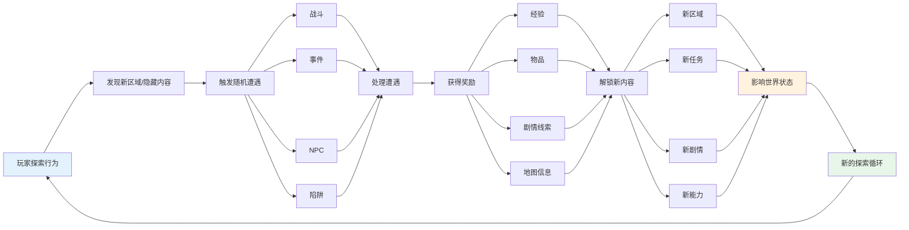

**驱动力强度**：⭐⭐⭐⭐ (4/5) | **状态**：✅ 闭环设计完整（需实现验证）

**核心机制**：

- **地图探索**：发现新地图、新区域、隐藏区域（通过技能/道具/选择解锁）
- **随机遭遇**：基于区域状态、混沌值、玩家行为触发，难度动态调整
- **隐藏内容**：隐藏道具、隐藏任务、隐藏剧情、隐藏区域
- **风险平衡**：高风险区域提供高奖励，玩家可选择探索深度

### 2.7 社交-对话-关系闭环 ✅

**闭环流程：**

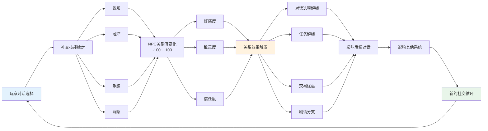

**驱动力强度**：⭐⭐⭐⭐ (4/5) | **状态**：✅ 闭环设计完整（需实现验证）

**核心机制**：

- **对话系统**：对话选择影响NPC态度，对话分支、内容变化、选项解锁
- **关系系统**：关系值影响对话选项、任务解锁、交易价格、剧情分支
- **社交技能**：说服、威吓、欺骗、洞察等，技能检定影响对话结果
- **剧情分支**：对话选择影响剧情走向和结局，关系值影响结局分支

---

## 三、系统间闭环设计与分析（道之循环网络）

> **目的**：设计各系统之间的交互关系，分析核心理念、技术实现和主要挑战
>
> **《道德经》思想**："道生一，一生二，二生三，三生万物"——系统间的闭环关系体现了道的生成逻辑，各系统相互影响，形成复杂的循环网络，让游戏世界成为有机的整体。

### 3.1 设计核心理念

**系统定位：**

- **核心玩法系统**：战斗系统、任务系统、探索系统、社交系统（DND玩法基础）
- **辅助系统**：混沌世界系统（辅助环境叙事的表达手法）
- **其他系统**：信仰、功德、神明系统（DND机制变种，支持核心玩法）
- 大部分是DND已有机制或变种，玩家上手难度不高
- **混沌世界系统**（原"动态世界系统"）作为核心枢纽，使用模糊逻辑计算权重

**核心设计：**

- **混沌世界系统**是核心枢纽系统，相当于"后处理"层
- **混沌值**是一类控制混沌世界（动态世界计算）的数值，不是单一数值
- 各个系统的**决策**影响混沌值，进而控制混沌世界的计算
- 不同系统影响不同的混沌值，每个混沌值在系统设计中有权重影响

### 3.2 系统间闭环网络流程图

> **这张图完美体现了RPG的"系统之道"和"闭环之道"两个核心设计理念**

**读图方式（少量说明）**：

- **从上到下**：玩家决策 → 道之魂（六大系统）→ 混沌世界系统（权重计算）→ 道之体（内容载体）→ 道之术（应用机制）→ 玩家感知
- **看关键点**：所有反馈最终汇入“混沌世界控制类”，以统一口径驱动六维度变化（环境叙事）

> 详见：[系统层次设计](./系统层次设计.md)

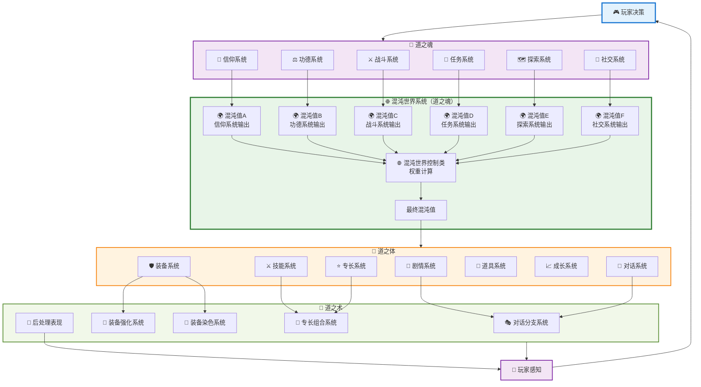

> **设计说明**：
>
> - **道之魂**：核心玩法系统（战斗、任务、探索、社交、信仰、功德），直接与玩家交互，产生混沌值
> - **混沌世界系统（道之魂）**：核心枢纽，统一计算各系统的混沌值，生成最终混沌值
> - **道之体**：内容支撑系统（剧情、对话、技能、装备、道具、成长、专长），为道之魂提供基础内容
> - **道之术**：应用机制系统（对话分支、装备强化/染色、专长组合、后处理），基于道之体，将内容转化为具体玩法
> - **闭环流程**：玩家决策 → 道之魂 → 混沌世界系统 → 道之体 → 道之术 → 玩家感知 → 玩家决策
>

### 3.2.1 系统分割合理性分析

**分割原理（道→魂→体→术）**：本段的目标是让读者用一套稳定标准，判断“这个系统应该归到魂/体/术哪一层”。  

- **道之魂（做什么）**：直接驱动玩家决策的**核心玩法闭环**。特点是“玩家输入→系统处理→影响玩家下一步策略/目标”。  
- **道之体（用什么）**：支撑道之魂运行的**可复用内容与数据载体**（资源/配置/状态）。特点是“被多个玩法复用、相对稳定、偏内容与数据”。  
- **道之术（怎么用）**：基于道之体，对内容进行**加工/组合/应用**的机制（规则、分支、强化、组合、表现手段）。特点是“把体用起来，让玩家产生具体操作与体验差异”。  

**快速判定问题（够用就好）**：  

- 这是不是玩家每天在“玩”的主循环？是 → **魂**  
- 这是不是给玩法提供“内容/数据/资源/状态”的底座？是 → **体**  
- 这是不是对内容进行“加工/组合/应用/表现”的方法？是 → **术**  

**本项目归类（简表）**：  

- **道之魂**：战斗、任务、探索、社交、信仰、功德、混沌世界系统（作为世界响应枢纽，仍属于魂层的核心机制）  
- **道之体**：剧情、对话、技能、装备、道具、成长、专长（为魂层提供内容与数据支撑）  
- **道之术**：对话分支、装备强化、装备染色、专长组合、后处理表现（把“体”加工成玩家可感知的玩法差异）  

### 3.2.2 成长系统的特殊定位（一句话）

**成长**是魂层闭环的产物（战斗/任务/探索带来经验与提升），而**成长系统**是体层的“数据仓库与规则管理器”，负责承接与提供等级/属性/技能点等成长数据。

### 3.3 系统关系与计算流程（文字版）

**核心链路**：  

- **输入**：道之魂六大系统（信仰/功德/战斗/任务/探索/社交）的关键决策 → 各自产生/改变对应混沌值（A-F）  
- **枢纽**：混沌世界控制类统一接收混沌值（A-F），用模糊逻辑做权重计算 → 得到最终混沌值/权重  
- **输出**：最终混沌值驱动六维度反馈（表现/对话/数值/音频/AI/UI） → 玩家感知 → 回流到下一次玩家决策（形成闭环）  

**系统间闭环索引（精简列举）**：  

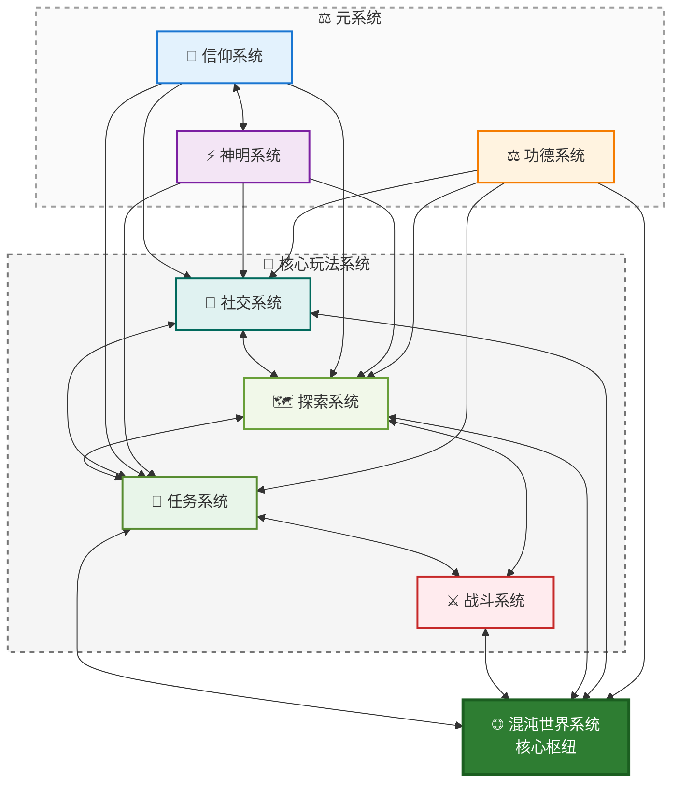

**这一套设计的核心收益（少量要点）**：  

- **无冲突**：不同系统对不同混沌值负责，避免多系统抢同一根“控制杆”  
- **统一反馈口径**：都走“混沌世界控制类 → 六维度反馈”，玩家更容易感知因果  
- **可扩展**：新增系统 = 新增混沌值/映射/权重，不破坏既有系统

### 3.4 反馈延迟的设计意图

**核心理念**：反馈延迟是环境叙事的一环，用于加强剧情张力；链条较长是有意设计，而非问题。

| 反馈层级 | 目的 | 常见载体（例） | 玩家感知要点 |
|---|---|---|---|
| **即时反馈** | 让玩家确认“我影响了系统” | UI提示（如“混沌值+5”） | 清晰、低成本、可重复 |
| **短期反馈** | 保持关注与连续决策 | 1-5分钟内数值/对话变化 | 让玩家把“因”与“果”对上 |
| **中期反馈** | 展开环境叙事与氛围变化 | 六维度反馈（表现/对话/数值/音频/AI/UI） | 让世界“活起来” |
| **长期反馈** | 形成累积效应与高潮 | 阈值事件、局势演化、持续状态 | 悬念与期待来自“不确定的后果” |

**叙事作用**：让玩家感受到“选择的影响需要时间显现”，并通过环境变化讲述故事，而非直接告知。

---

## 四、道之循环的哲学表达

> **《道德经》核心思想在系统闭环设计中的体现**

| 思想 | 原文 | 对应到系统设计的落点 |
|---|---|---|
| **反者道之动** | “反者道之动”（第四十章） | 玩家行为→系统反馈→改变后续行为，形成循环往复 |
| **周行而不殆** | “周行而不殆”（第二十五章） | 闭环能持续运转，减少强制触发与人为干预 |
| **道生一…** | “道生一，一生二，二生三，三生万物”（第四十二章） | 道→魂→体→术：由核心玩法生成内容与应用，逐层落地 |
| **道法自然** | “道法自然”（第二十五章） | 反馈机制顺势而为：用规则与权重引导，而非硬控玩家 |
| **柔弱胜刚强** | “柔弱胜刚强”（第三十六章） | 用环境叙事/氛围/细反馈替代强制提示与硬限制 |
| **上善若水** | “上善若水…”（第八章） | 系统可适应不同玩家路径，反馈“顺选择而动” |

## 七、总结

### 7.1 闭环设计的核心思想

**《道德经》的核心思想在闭环设计中的体现**：

1. **"反者道之动"**：系统运行是循环往复的，闭环体现了道的运动特性
2. **"周行而不殆"**：系统形成闭环后，能够循环运行而不停止
3. **"道生一，一生二，二生三，三生万物"**：系统间的闭环关系体现了道的生成逻辑
4. **"道法自然"**：系统闭环应顺应自然规律，不强求
5. **"柔弱胜刚强"**：系统反馈应具有柔韧性，而非刚硬
6. **"上善若水"**：系统应如水般适应性强，能够适应不同的玩家行为

### 7.2 闭环设计的关键原则

1. **完整性**：闭环必须完整，每个环节都要明确
2. **自然性**：闭环应能够自然运行，不需要人为干预
3. **适应性**：闭环应具有强适应性，能够适应不同的玩家行为
4. **联动性**：系统间应相互影响，形成循环网络
5. **简洁性**：闭环应保持简洁，避免过度复杂

### 7.3 闭环设计的实践要点

1. **设计分层反馈**：即时/短期/中期/长期（见 3.4）
2. **简化设计**：遵循“少则得，多则惑”，优先让核心闭环跑起来
3. **增强联动**：让系统通过混沌值/权重联动，而不是点对点硬耦合

### 7.4 闭环设计的最终目标

**目标**：让游戏世界成为有机的整体，系统自然运行，玩家感受到"活"的世界

**实现方式**：

- ✅ 每个系统都形成完整的闭环
- ✅ 系统间相互影响，形成循环网络
- ✅ 系统自然运行，不需要人为干预
- ✅ 玩家行为得到环境的自然回应
- ✅ 游戏世界"活"起来，形成有机的整体

---

**文档版本**：v3.0  
**最后更新**：精简结构、去除图文重复、统一“道→魂→体→术”分割说明  
**维护说明**：根据设计实践情况持续更新和完善
