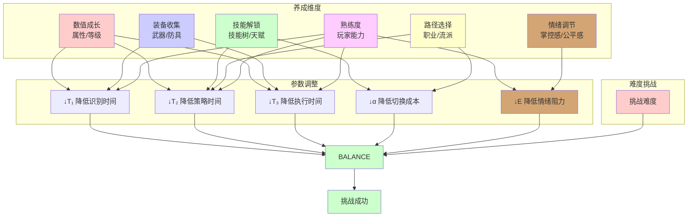

# 角色养成之道

## 一、根本定义：养成即难度平衡调整

> **角色养成 = 玩家通过选择与投入，调整难度公式参数，实现与游戏难度的动态平衡**
>
> - **难度公式**：**(T₁ + T₂ + T₃) × (1 + α) × E > Δt**
> - **养成目标**：通过降低公式左侧参数，使 **≤ Δt**，能够应对更高难度的挑战
> - **核心原理**：养成不是"让角色变强"，而是"通过调整参数，使原本的挑战变得可应对"

| 养成维度 | 调整的参数 | 作用机制 | 典型案例 |
|---------|-----------|---------|---------|
| **数值成长** | ↓T₁、↓T₂、↓T₃ | 属性提升降低认知-操作时间 | 《暗黑破坏神》的等级提升、《原神》的角色突破 |
| **技能解锁** | ↓T₂、↓α | 新技能优化策略选择，降低切换成本 | 《最终幻想》的技能树、《魔兽世界》的天赋系统 |
| **装备收集** | ↓T₁、↓T₃ | 装备特效降低识别和执行时间 | 《怪物猎人》的装备系统、《塞尔达传说》的装备升级 |
| **路径选择** | ↓α、↓C | 职业/流派优化，降低切换和协调成本 | 《暗黑破坏神》的BD构建、《原神》的元素反应 |
| **熟练度提升** | ↓T₁、↓T₂、↓T₃、↓E | 玩家自身能力提升，降低所有时间参数 | 所有RPG的隐性成长 |
| **情绪调节** | ↓E | 通过成长感、掌控感、公平感降低情绪阻力 | 《只狼》的熟练后E值降低、《黑魂》的咒蛙理解机制后E值降低 |

> ✅ **关键突破**：养成的本质是**调整难度平衡**，而非单纯的数值增长。所有养成内容都应服务于降低难度公式中的参数。

### 养成与难度平衡关系图

## 二、养成维度详解

### 数值成长

**作用**：直接降低 T₁、T₂、T₃

| 成长类型 | 调整参数 | 影响机制 | 典型案例 |
|---------|---------|---------|---------|
| **属性提升** | ↓T₁、↓T₂、↓T₃ | 攻击力/防御力影响战斗时间 | 《暗黑破坏神》的等级系统 |
| **等级提升** | ↓T₁、↓T₂ | 解锁新内容，降低识别和策略时间 | 《原神》的角色突破 |
| **战力提升** | ↓T₁、↓T₂、↓T₃ | 综合数值影响整体时间 | 《FGO》的从者强化 |

> **设计要点**：数值成长应提供**可感知的平衡调整**，而非单纯的数字增长。

### 技能解锁

**作用**：降低 T₂（策略选择时间）和 α（上下文切换成本）

| 技能类型 | 调整参数 | 影响机制 | 典型案例 |
|---------|---------|---------|---------|
| **主动技能** | ↓T₂ | 提供新策略选项，优化决策时间 | 《最终幻想》的技能系统 |
| **被动技能** | ↓T₁、↓T₃ | 自动触发效果，降低识别和执行时间 | 《魔兽世界》的天赋系统 |
| **技能组合** | ↓α | 技能连招降低切换成本 | 《鬼泣》的连招系统 |
| **技能树** | ↓T₂、↓α | 路径选择优化策略和切换 | 《暗黑破坏神》的技能树 |

> **设计要点**：技能应提供**有意义的策略差异**，而非简单的数值提升。

### 装备收集

**作用**：降低 T₁（识别时间）和 T₃（执行时间）

| 装备类型 | 调整参数 | 影响机制 | 典型案例 |
|---------|---------|---------|---------|
| **武器** | ↓T₃ | 攻击力/攻击速度影响执行时间 | 《怪物猎人》的武器系统 |
| **防具** | ↓T₁ | 防御力影响识别需求（容错率） | 《暗黑破坏神》的装备系统 |
| **饰品** | ↓T₁、↓T₂、↓T₃ | 特殊效果影响多个时间参数 | 《原神》的圣遗物系统 |
| **装备强化** | ↓T₁、↓T₃ | 升级提升装备效果 | 《塞尔达传说》的装备升级 |

> **设计要点**：装备应提供**可感知的性能差异**，而非单纯的数值堆叠。

### 路径选择

**作用**：降低 α（上下文切换成本）和 C（协同协调成本）

| 路径类型 | 调整参数 | 影响机制 | 典型案例 |
|---------|---------|---------|---------|
| **职业选择** | ↓α | 职业特性优化技能切换 | 《暗黑破坏神》的职业系统 |
| **流派构建** | ↓α、↓T₂ | BD优化策略和切换 | 《原神》的元素反应 |
| **角色定位** | ↓C | 团队中角色职责清晰 | 《魔兽世界》的专精系统 |
| **玩法风格** | ↓α、↓E | 选择符合玩家习惯的玩法 | 《最终幻想14》的职业系统 |

> **设计要点**：路径应提供**真实的选择差异**，而非虚假的选项。

### 情绪调节

**作用**：降低 E（情绪调节因子），改善玩家的心理状态和主观难度感受

| 调节类型 | 调整参数 | 影响机制 | 典型案例 |
|---------|---------|---------|---------|
| **掌控感提升** | ↓E | 通过成长感、可预测性增强掌控感 | 《只狼》的熟练后E值降低：从恐惧到掌控 |
| **挫败感降低** | ↓E | 通过清晰反馈、公平机制降低挫败感 | 《黑魂》的死亡反馈：让玩家知道失败原因 |
| **公平感增强** | ↓E | 通过规则透明、可学习性增强公平感 | 《只狼》的可学习Boss：增强公平感 |
| **心理阴影消除** | ↓E | 通过反复挑战、理解机制消除心理阴影 | 《黑魂》的咒蛙：理解机制后E值降低 |
| **成就感提升** | ↓E | 通过可感知的成长、挑战成功提升成就感 | 所有RPG的成长反馈：提升成就感 |

> **典型案例**：
> - **《黑暗之魂》的咒蛙**：初次遇到时E值很高（恐惧、心理阴影），但通过理解机制、反复挑战，E值逐渐降低，最终能够应对
> - **《只狼》的Boss战**：初次遇到时E值较高（压迫感），但通过学习和成长，E值降低，从恐惧到掌控

> **设计要点**：情绪调节是**玩家心理状态的改善**，通过养成（理解机制、提升能力）可以降低E值，改善主观难度感受。

### 熟练度提升

**作用**：降低所有时间参数（T₁、T₂、T₃、α、E）

| 熟练度类型 | 调整参数 | 影响机制 | 典型案例 |
|---------|---------|---------|---------|
| **操作熟练** | ↓T₁、↓T₃ | 玩家操作能力提升 | 所有动作RPG |
| **策略熟练** | ↓T₂、↓α | 玩家策略理解提升 | 所有策略RPG |
| **团队熟练** | ↓C | 团队配合能力提升 | 所有多人RPG |
| **心理熟练** | ↓E | 玩家心理状态改善 | 所有RPG |

> **设计要点**：熟练度是**玩家自身的成长**，系统应提供支持而非替代。

## 三、平衡机制

### 成长速度 vs 难度提升速度

> **平衡公式**：**成长速度 ≥ 难度提升速度**

| 平衡状态 | 成长速度 | 难度提升 | 玩家体验 | 典型案例 |
|---------|---------|---------|---------|---------|
| **平衡** | = 难度提升 | 逐步提升 | 持续挑战，有成长感 | 《暗黑破坏神》的难度曲线 |
| **失衡（过快）** | > 难度提升 | 缓慢提升 | 挑战不足，缺乏成就感 | 数值膨胀的游戏 |
| **失衡（过慢）** | < 难度提升 | 快速提升 | 挫败感强，可能弃游 | 难度曲线设计不当 |

> **设计要点**：保持**动态平衡**，让玩家始终感受到成长带来的平衡调整。

### 养成的边际效应

> **边际效应**：随着养成投入增加，对难度参数的调整效果递减

| 养成阶段 | 投入成本 | 参数调整效果 | 玩家感受 |
|---------|---------|------------|---------|
| **初期** | 低 | 高（显著降低参数） | 成长感强 |
| **中期** | 中 | 中（适度降低参数） | 成长感稳定 |
| **后期** | 高 | 低（小幅降低参数） | 成长感减弱 |

> **设计要点**：通过**新的养成维度**（如新技能、新装备）来突破边际效应。

### 养成的动态反馈循环

> **反馈循环**：难度提升 → 需要新养成 → 新养成 → 应对新难度 → 难度再次提升

| 循环阶段 | 难度状态 | 养成需求 | 平衡状态 | 玩家体验 |
|---------|---------|---------|---------|---------|
| **初始** | 基础难度 | 基础养成 | 平衡 | 有挑战感 |
| **提升** | 难度增加 | 需要新养成 | 失衡 | 感受到压力 |
| **养成** | 难度不变 | 进行养成 | 调整中 | 有成长感 |
| **平衡** | 难度不变 | 养成完成 | 重新平衡 | 有成就感 |
| **循环** | 难度再次提升 | 需要新养成 | 新的失衡 | 持续挑战 |

> **设计要点**：保持**动态反馈循环**，让玩家在"挑战→养成→平衡→新挑战"的循环中持续成长。

### 养成的陷阱

> **陷阱**：设计不当的养成会导致虚假选择、数值膨胀、平衡破坏等问题

| 陷阱类型 | 表现 | 问题 | 解决方案 |
|---------|------|------|---------|
| **虚假选择** | 所有路径最终效果相同 | 选择无意义，缺乏策略差异 | 不同路径调整不同参数，产生真实差异 |
| **数值膨胀** | 数值无限增长，失去意义 | 平衡破坏，挑战感消失 | 控制数值增长，通过新维度突破 |
| **平衡破坏** | 成长速度远超难度提升 | 挑战不足，缺乏成就感 | 保持动态平衡，成长速度 = 难度提升速度 |
| **隐性成长** | 成长效果不可感知 | 玩家感受不到平衡调整 | 提供可感知的反馈，让玩家感受到"原本打不过的现在能打过了" |
| **单一最优解** | 只有一种最优路径 | 选择无意义，策略单一 | 提供多种有效路径，各有优势 |

> **设计要点**：避免陷阱，确保养成提供**有意义的选择**、**可感知的平衡**、**动态的反馈**。

## 四、设计原则

### 核心原则

1. **平衡调整优先**  
   所有养成内容都应服务于调整难度公式参数，而非单纯的数值增长。

2. **有意义的选择**  
   不同养成路径应调整不同的参数，产生真实的策略差异。

3. **可感知的平衡**  
   玩家应能感受到"原本打不过的现在能打过了"，而非隐性的数值提升。

4. **动态平衡**  
   成长速度应与难度提升速度保持平衡，避免数值膨胀或难度跳跃。

5. **养成即引导**（统领性原则）  
   **所有养成内容必须服务于玩家的认知成长、操作精进或情感共鸣，而非单纯的数值堆叠。**

### 设计哲学：养成即平衡

> **高明的养成设计，是玩家与游戏难度之间的一场动态平衡**：
> - 游戏说："这个挑战很难。"
> - 玩家答："但我能通过养成调整参数，让它变得可应对。"
>
> 每一次养成，都是平衡调整；每一次挑战，都是成长验证。

> **真正的养成，从不问"你能变多强？"，而问"你如何调整平衡？"**  
> ——而答案，藏在有意义的选择、可感知的成长、动态的平衡之中。

## ✅ 总结

| 层级 | 核心内容 | 解决的问题 |
|------|---------|-----------|
| **机制层** | 通过调整 (T₁+T₂+T₃)×(1+α)×E 实现平衡 | "养成如何工作？"（可量化） |
| **维度层** | 六大养成维度（数值、技能、装备、路径、熟练度、情绪调节） | "养成有哪些方式？"（可分类） |
| **平衡层** | 成长速度 vs 难度提升速度、动态反馈循环 | "如何保持平衡？"（可控制） |
| **陷阱层** | 虚假选择、数值膨胀、平衡破坏等 | "如何避免陷阱？"（可预防） |
| **设计原则** | 五大核心原则 + 养成即平衡的哲学 | "如何设计好养成？"（可指导） |

**这不是一个养成模型，而是一套关于"玩家如何通过养成调整难度平衡"的完整设计哲学。**

