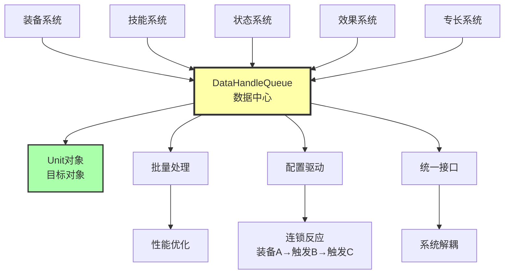
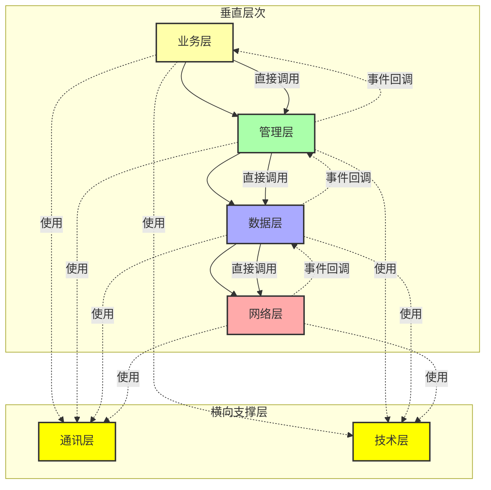

# 编程技术核心观点

## 1. 杜绝硬编码
避免在代码中直接写入固定值，使用配置或常量管理。

## 2. 数据驱动核心思想
将逻辑和数据分离：复杂逻辑在代码中实现，数据存储在外部配置文件中。通过修改数据而非代码来调整游戏行为。

## 3. 将控制流写成脚本
使用脚本语言实现控制流程，提高灵活性和可维护性。

## 4. 合理评估任务实现方式
在开发前梳理任务需求，判断是否真的需要使用代码实现，避免过度工程化。

## 5. 避免重复数据
消除数据冗余，保持数据源单一，确保数据一致性。

## 6. 使用开发工具生成数据
利用工具自动生成数据，减少手工输入错误，提高开发效率。

# 个人开发观点

## 7. 模板化
将常用的交互类型和表现抽象为可复用的模板，通过配置ID而非代码实现来减少开发成本。核心思路是：将重复的初始化逻辑封装为模板，通过模板映射表统一管理，使用时只需配置模板ID，系统自动完成组件查找和初始化，支持参数化配置以适应不同场景。

## 8. 归一化接口思路
使用统一的 Context 参数对象替代多参数函数，实现接口归一化。核心思路是：所有功能通过统一的 Context 表结构传递参数，接口保持稳定，新增字段不破坏现有接口，支持参数灵活扩展，实现向后兼容。这样既避免了参数过多导致的函数签名臃肿，又保证了接口的稳定性和扩展性。

## 9. 数据驱动 + 队列管理
通过数据中心（DataHandleQueue）实现系统完全解耦，所有系统通过统一的数据访问接口进行通信。核心思路是：各系统不直接依赖，而是通过队列推送数据和查询数据，实现批量处理优化性能，支持配置驱动的连锁反应（装备A → 触发B → 触发C），形成统一的数据流管理。



## 10. 实时属性计算 vs 批量更新
采用实时获取机制替代传统的批量更新模式。核心思路是：属性计算时实时从各子系统获取最新数据并汇总，而非维护dirty标记和批量更新。这样实现数据一致性100%，无需管理复杂的状态同步，新增模块自动参与计算，按需计算避免不必要的全量更新。

## 11. 职责分离的公式系统
将公式系统分为三级：一级为基础获取函数（程序员提供），二级为派生计算（策划编写），三级为综合效果计算（策划编写）。核心思路是：程序员提供基础设施和类型安全保证，策划独立编写和测试公式，实现职责清晰分离，提高开发效率和可维护性。

## 12. 分层架构设计
将项目业务划分为多个层次：业务层、管理层、数据层、网络层从上往下调用，通讯层和技术层作为横向支撑层供所有层使用。核心思路是：高层直接调用底层接口，底层通过事件回调通知高层，形成清晰的依赖关系和通信机制。这样既保证了层次职责分明，又实现了松耦合的架构设计。



## 13. 生命周期一致性
通过统一的生命周期管理系统实现 C# 和 Lua 之间的生命周期桥接，支持自动映射机制。核心思路是：C# 端通过 mappingName 自动映射到对应的 Lua 函数，支持所有 Unity 生命周期事件（Awake、Start、Update、OnDestroy等），提供自定义参数字典（valueTypeDict、objectDict）实现灵活传参。这样既保证了 C# 和 Lua 生命周期的一致性，又实现了自动化的函数映射，减少了手动绑定的工作量。

## 14. 对象池模式优化
通过对象池管理频繁创建和销毁的对象，减少GC压力和内存分配开销。核心思路是：预创建对象池，使用时从池中获取，使用完毕后归还到池中，支持智能扩容、预热机制和容量控制。这样既避免了频繁的内存分配和回收，又保证了性能的稳定性，特别适用于粒子特效、子弹、UI元素等高频创建的对象。

## 15. 策略模式解耦
通过策略模式实现算法的可替换性，消除硬编码依赖。核心思路是：将算法封装为独立的策略类，通过工厂或配置选择具体策略，支持运行时动态切换。这样既保证了算法的可扩展性，又实现了代码的解耦，特别适用于资源加载、寻路算法、状态机等需要多种实现方式的场景。

## 16. 性能优化思路
通过有效范围限制、位图优化、缓存机制等策略实现性能提升。核心思路是：识别性能瓶颈，采用空间分割（有效范围）、数据结构优化（位图查询）、结果缓存等方式，避免不必要的全量计算。这样既保证了功能的完整性，又实现了性能的大幅提升（如网格系统有效范围优化实现2268倍性能提升）。

## 17. 解耦思路优先级体系
解耦是软件设计的核心目标之一，不同层级的解耦手段有不同的优先级和影响范围。核心思路是：按照从宏观到微观、从架构到实现的顺序，优先使用影响范围更大的解耦手段，形成完整的解耦体系。这样既保证了系统架构的清晰性，又实现了代码的可维护性和可扩展性。

### 解耦优先级（从高到低）

#### 1. 层设计（最高优先级 - 架构级解耦）
- **作用**：架构层面的解耦，影响整个系统结构
- **体现**：
  - AI 六层架构（数据层、决策层、执行层、技术层、管理层、通讯层）
  - 项目整体分层架构（业务层、管理层、数据层、网络层）
- **价值**：职责清晰、依赖单向、替换成本低
- **原则**：层设计就是最大的解耦

#### 2. 系统通讯（第二优先级 - 系统间解耦）
- **作用**：系统之间的解耦，避免直接依赖
- **体现**：
  - DataHandleQueue（数据中心，系统通过队列通信）
  - EventDispatch（事件系统，事件驱动通信）
  - MessageSystem（消息系统，消息驱动通信）
- **价值**：系统独立、可替换、批量处理

#### 3. 组件化设计（第三优先级 - 模块级解耦）
- **作用**：将功能封装为独立组件，通过组件化实现模块内部的解耦，遵循单一职责原则
- **体现**：
  - 三级公式系统（一级基础获取、二级派生计算、三级综合效果）
  - 系统模块化（Unit System、Effect System、Skill System 等）
  - 抽象原则（避免多方面抽象、不完整抽象）
- **价值**：组件独立、易于测试、易于维护、可复用

#### 4. 设计模式（第四优先级 - 代码级解耦）
- **作用**：代码层面的解耦，提高灵活性和可扩展性
- **体现**：
  - 命令模式（Command Pattern）
  - 策略模式（Strategy Pattern）- 如寻路算法、资源加载策略
  - 数据驱动（Data-Driven）- 配置化设计
  - 观察者模式（Observer Pattern）
  - 工厂模式（Factory Pattern）
- **价值**：算法可替换、逻辑可配置、行为可组合

#### 5. 归一化参数（第五优先级 - 接口级解耦）
- **作用**：接口层面的解耦，统一参数传递
- **体现**：
  - Context 模式（统一 Context 参数对象）
  - 接口归一化（所有功能通过统一的 Context 表结构传递参数）
  - 参数灵活扩展（新增字段不破坏现有接口）
- **价值**：接口稳定、向后兼容、参数灵活

### 优先级关系

```
解耦优先级（从高到低）
│
├─ 1. 层设计 ──────────────── 架构级解耦（最大影响）
│   └─ 职责清晰、依赖单向、替换成本低
│
├─ 2. 系统通讯 ────────────── 系统间解耦（中等影响）
│   └─ DataHandleQueue、EventDispatch、MessageSystem
│
├─ 3. 组件化设计 ──────────── 模块级解耦（模块内影响）
│   └─ 组件封装、单一职责、可复用
│
├─ 4. 设计模式 ────────────── 代码级解耦（局部影响）
│   └─ 命令模式、策略模式、数据驱动
│
└─ 5. 归一化参数 ──────────── 接口级解耦（最小影响）
    └─ Context 模式、接口统一、参数扩展
```

### 应用原则

1. **优先使用高层级解耦**：优先考虑层设计和系统通讯，再考虑组件化设计和设计模式
2. **组合使用**：不同层级的解耦手段可以组合使用，形成完整的解耦体系
3. **按需选择**：根据实际需求选择合适的解耦手段，避免过度设计
4. **持续优化**：随着系统演进，不断优化解耦设计，保持系统清晰

### 架构设计原则

**核心观点**：架构设计没有唯一解，只有适合不适合。过度设计只会增加开发成本。

#### 1. 没有银弹
- **不存在完美架构**：不存在适用于所有场景的完美架构
- **场景决定架构**：不同项目、不同团队、不同需求需要不同的架构
- **实践验证**：架构是否适合，需要通过实践验证，而不是理论推导

#### 2. 权衡取舍
架构设计需要在多个维度之间权衡：

```
解耦程度 ←→ 性能
    ↕
开发效率 ←→ 代码复杂度
    ↕
灵活性 ←→ 稳定性
    ↕
可扩展性 ←→ 开发成本
```

**权衡原则**：
- 小项目：优先开发效率，适度解耦
- 大项目：优先架构清晰，充分解耦
- 高性能项目：在解耦和性能之间找平衡
- 快速迭代项目：优先灵活性，适度解耦

#### 3. 渐进演进
- **不是一开始就完美**：架构应该随着项目发展而演进
- **解决当前问题**：优先解决当前面临的问题，而不是过度设计未来需求
- **持续重构**：随着需求变化，不断调整和优化架构
- **技术债务管理**：在快速开发和架构质量之间找平衡

#### 4. 团队适配
- **适配团队能力**：架构应该适配团队的技术水平和开发能力
- **降低学习成本**：选择团队熟悉的技术和模式，而不是追求最新技术
- **提高开发效率**：架构应该提高开发效率，而不是增加开发负担
- **便于协作**：架构应该便于团队协作，而不是增加沟通成本

#### 5. 实用主义
- **解决实际问题**：优先解决当前面临的实际问题
- **避免过度设计**：不要为了设计而设计，不要为了模式而模式
- **成本意识**：考虑开发成本、维护成本、学习成本
- **简单有效**：简单有效的方案往往比复杂完美的方案更好

#### 6. 判断标准
判断架构是否适合的标准：

1. ✅ **是否解决当前问题**：架构是否解决了项目面临的核心问题？
2. ✅ **是否适应团队能力**：团队是否有能力理解和维护这个架构？
3. ✅ **是否满足性能要求**：架构是否满足项目的性能要求？
4. ✅ **是否便于维护扩展**：架构是否便于后续维护和功能扩展？
5. ✅ **是否在合理成本内**：架构的实现和维护成本是否在可接受范围内？

#### 7. 避免过度设计
**过度设计的表现**：
- ❌ 为了用模式而用模式
- ❌ 为了分层而分层
- ❌ 为了解耦而解耦
- ❌ 设计未来可能用不到的功能
- ❌ 追求理论完美而忽视实际需求

**正确的做法**：
- ✅ 根据实际需求选择解耦手段
- ✅ 在解耦和性能之间找平衡
- ✅ 优先解决当前问题
- ✅ 保持架构简单清晰
- ✅ 持续优化而非一次性完美设计

## 架构思维分类：决策派 vs 组成派

### 思维差异

#### 组成派（Compositional）
- **关注点**："系统由什么组成"、"如何组合"
- **典型模式**：MVC、MVP、MVVM（定义固定的组件结构）
- **特点**：关注结构分解和组件职责划分
- **问题**：容易陷入"死板"的设计，强制套用固定结构

#### 决策派（Decision-based）
- **关注点**："为什么这样设计"、"在什么约束下"、"做了哪些权衡"
- **核心问题**：
  - 为什么要分离关注点？
  - 为什么选择这种交互方式？
  - 面临什么约束（性能、可维护性、团队能力等）？
  - 做了哪些权衡？
- **特点**：关注设计理据和决策背后的原因
- **优势**：灵活适应不同场景，避免过度设计

### 为什么 MVC 显得"死板"？

MVC 是典型的**组成派模式**，它的问题在于：

1. **固定结构**：强制要求 Model、View、Controller 三个组件
   - ❌ 不适用于所有场景
   - ❌ 小项目可能过度设计
   - ❌ 某些场景可能不需要 Controller

2. **缺乏理据**：只告诉你"是什么"，不告诉你"为什么"
   - ❌ 为什么必须是三个组件？
   - ❌ 为什么 Controller 必须操作 Model？
   - ❌ 在什么约束下才需要这样设计？

3. **忽视权衡**：没有说明适用场景和权衡取舍
   - ❌ 什么情况下用 MVC？
   - ❌ 什么情况下不用 MVC？
   - ❌ 性能和复杂度如何权衡？

### 决策派的设计思路

决策派不套用固定模式，而是基于**关键决策**和**权衡**来设计：

#### 1. 关注点分离决策
**问题**：为什么要分离关注点？
- **理据**：提高可维护性、可测试性、可扩展性
- **权衡**：增加复杂度 vs 提高可维护性
- **决策**：根据项目规模决定分离程度
  - 小项目：适度分离，避免过度设计
  - 大项目：充分分离，提高可维护性

#### 2. 系统通信决策
**问题**：系统之间如何通信？
- **选项**：直接依赖、事件驱动、队列管理、消息系统
- **权衡**：
  - 直接依赖：简单但耦合高
  - 事件驱动：解耦但调试困难
  - 队列管理：完全解耦但性能开销
- **决策**：根据项目需求选择
  - 你的项目：DataHandleQueue（完全解耦 + 批量处理）

#### 3. 接口设计决策
**问题**：如何设计接口？
- **选项**：多参数函数、参数对象、统一 Context
- **权衡**：
  - 多参数：类型安全但接口不稳定
  - 参数对象：灵活但需要定义类
  - 统一 Context：接口稳定但需要统一结构
- **决策**：根据扩展性需求选择
  - 你的项目：Context 模式（接口归一化 + 灵活扩展）

#### 4. 数据管理决策
**问题**：如何管理数据一致性？
- **选项**：批量更新、实时获取、观察者模式
- **权衡**：
  - 批量更新：性能好但需要管理 dirty 标记
  - 实时获取：数据一致但可能有性能开销
  - 观察者模式：响应式但复杂度高
- **决策**：根据数据一致性要求选择
  - 你的项目：实时获取（数据一致性 100% + 无需状态同步）

### 决策派的设计原则

1. **从问题出发**：先明确要解决什么问题，再选择方案
2. **理解约束**：明确性能、团队、时间等约束条件
3. **权衡取舍**：在多个维度之间找平衡点
4. **记录决策**：记录为什么这样设计（ADR - Architecture Decision Records）
5. **持续演进**：根据实际反馈调整架构

### 实际应用

你的项目设计体现了决策派思维：

- ✅ **Context 模式**：基于"接口稳定性"和"参数灵活性"的权衡
- ✅ **DataHandleQueue**：基于"系统解耦"和"批量处理"的权衡
- ✅ **实时属性计算**：基于"数据一致性"和"状态管理复杂度"的权衡
- ✅ **配置化 + 模板化**：基于"开发效率"和"灵活性"的权衡
- ✅ **六层架构**：基于"职责清晰"和"依赖管理"的权衡

**核心观点**：架构设计没有标准答案，只有适合不适合。决策派关注"为什么"和"权衡"，而不是套用固定模式。