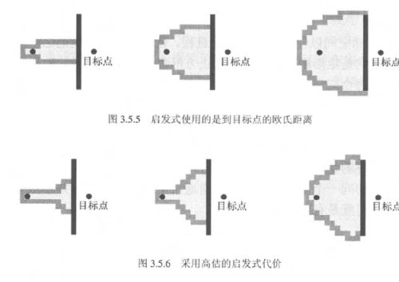
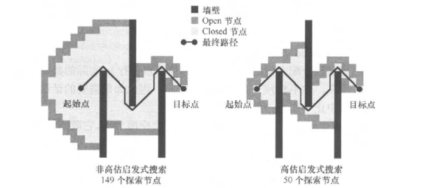
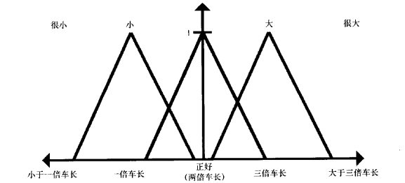
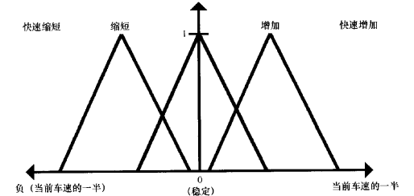
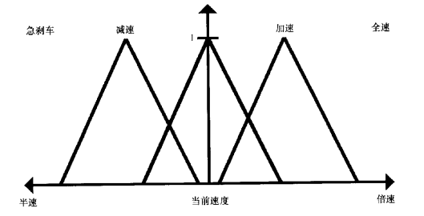
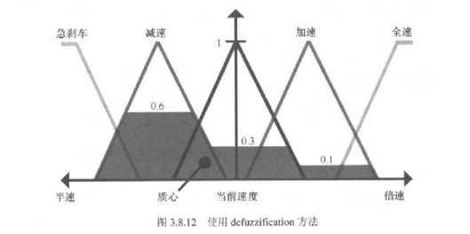
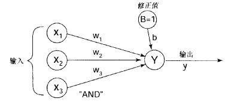
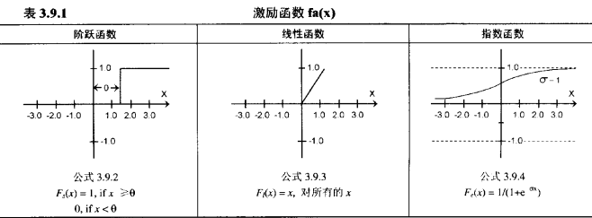


# AI相关算法

## A*

- A* 是一种启发式搜索算法，用于在图形和网格中找到最短路径。


**主要区别**：
- **内存使用**：A*需要维护优先队列，内存占用高；IDA*仅存储当前路径，内存占用低
- **时间效率**：A*通常更快；IDA*可能重复搜索，时间效率较低
- **选择原则**：内存充足选A*，内存受限选IDA*

### 平滑路径

- Catmull-Rom 插值算法, 预先计算的路径点, 然后使用插值算法平滑路径
- 分级路径点算法, 总是寻找到隔壁的门之外的门的路径。然后,每当角色穿过第一个门口时,抛
弃剩余路径并且重复这一过程。当道路的下半部分总被废弃时,它确实构造了最直接和最美
观的路线。

### 速度优化

- **搜索空间的影响**：A*算法的性能主要受**搜索空间大小**支配，搜索空间越大，计算开销越大。
- **存储优化**：由于A*可能消耗**大量内存**，优化存储地址分配和数据存取至关重要。合理的数据结构设计可以显著减少内存占用和提高访问效率。
- **排序优化**：A*算法需要频繁进行**节点排序操作**（如维护开放列表），优化排序算法（如使用堆结构）对性能提升至关重要。

#### 启发式算法

- **定义**：启发式算法通过估计函数来指导搜索方向，帮助算法更快地找到最优解。在路径查找中，启发式函数用于估算从当前节点到目标节点的距离。


*图：启发式搜索的扩展过程（使用到目标点的欧氏距离）*

- **高估启发式算法**：当启发式函数高估实际距离时，可能导致算法无法找到最优路径，但可以加快搜索速度。对于存在大型障碍物的场景，高估启发式可以显著减少探索节点数量，提高搜索效率。


*图：非高估启发式搜索（149个探索节点）与高估启发式搜索（50个探索节点）的对比*

**关键对比**：

- **非高估启发式**：探索范围更广，能保证找到最优路径，但需要探索更多节点
- **高估启发式**：探索范围更集中，搜索速度更快，但可能无法保证路径的最优性

### 搜索空间的优化

#### 节点银行（预分配）

- 预分配大量节点存储块，循环使用，避免动态分配
- 根据最大搜索规模确定大小，支持动态扩展或中止搜索

#### 节点数据结构

存储：父节点指针、到达代价、总代价、Open/Closed标记

#### 主节点表（哈希表）

- 哈希表存储所有已探索节点指针，O(1)查找
- Closed表即主节点表中Closed标记的节点集合
- Open表单独维护，主节点表也包含其指针（双重存储优化访问）
- GetNode函数：检查主节点表，存在则返回；否则从节点银行获取并初始化

#### Open表优化（二分堆）

- **选择原因**：频繁提取最小代价节点和插入操作，二分堆均为O(log n)
- **堆特性**：最小堆，双亲节点小于子节点，部分有序
- **时间复杂度**：插入O(log n)、提取O(log n)、更新O(n+log n)、判空O(1)
- **实现**：C# `List<T>`配合堆操作，或.NET 6+ `PriorityQueue<T>`

#### 优化效果

节点银行预分配 + 哈希表快速检索 + 优先队列高效排序，显著提升性能

## Steering Behaviors（定向行为系统）

### 核心概念

- **定义**：Reynolds提出的基础行为系统，用于实现各种移动行为
- **核心思想**：每个行为返回一个Steering（转向）矢量，多个行为可以组合，最终矢量决定Agent的移动方向

### 基础行为

- **Seek**：寻找目标
- **Flee**：逃离目标
- **Arrive**：到达目标（带减速）
- **Pursue**：追逐移动目标
- **Evade**：躲避移动目标
- **Align**：对齐朝向
- **VelocityMatch**：速度匹配
- **Wander**：漫游
- **AvoidWall/AvoidAgent**：避障

### 与Flocking的关系

- Steering Behaviors是基础系统，Flocking是基于它实现的群体行为
- 分离≈Flee，对齐≈Align+VelocityMatch，聚集≈Seek，躲避≈Flee

### 代码实现

.md)

## Flocking（群集行为）

### 核心概念

- **定义**：Craig Reynolds于1987年提出的分布式行为模型，模拟鸟群、鱼群等生物群体行为
- **特点**：通过简单规则组合产生复杂的群体运动，展现涌现行为（emergent behavior）
- **应用场景**：Unreal、Half-Life中的怪物和生物，Enemy Nations的部队队形，RTS/RPG中的群体动画

### 四个基本规则（Reynolds规则）

1. **分离（Separation）**：避免与邻近个体过于接近，保持最小距离
2. **对齐（Alignment）**：与邻近个体的平均航向和速度对齐
3. **聚集（Cohesion）**：向邻近个体的平均位置移动，保持群体聚集
4. **躲避（Avoidance）**：避免撞上局部区域内的障碍或敌人（第四规则）

### 无状态特性

- **无存储**：Flocking是无状态算法，两次更新之间不保存信息
- **实时反应**：每个boid在每轮更新中重新评估环境，对变化实时反应
- **涌现行为**：个体不知道群体目标，但群体整体表现出协调运动

### 实现要点（C#）

#### 类结构设计

- **FlockManager**：管理多个Flock，提供全局更新接口
- **Flock**：代表一个群体，管理成员列表，提供添加/删除成员方法
- **Boid**：个体主体，包含位置、速度、朝向等状态，实现定向行为规则

#### 核心方法

- **FlockIt()**：每帧更新方法，实现四个定向行为规则
- **KeepDistance()**：分离行为，计算避免拥挤的矢量
- **MatchHeading()**：对齐行为，计算匹配邻近个体航向的矢量
- **SteerToCenter()**：聚集行为，计算朝向邻近个体平均位置的矢量
- **FleeEnemies()**：躲避行为，计算避开敌人的矢量
- **SeeFriends()**：检测可见的群体同伴
- **SeeEnemies()**：检测可见的敌人

#### 矢量累积机制

- **矢量积聚**：所有定向行为的朝向变化累加到变化矢量
- **单位化处理**：变化矢量转化为单位矢量，保持适当比例
- **冲突解决**：多个相互冲突的指令通过矢量叠加部分满足

#### 约束参数

- **感知域（Perception Range）**：限制boid能"看"多远，影响群体组织度
- **最大速度（Max Speed）**：限制个体运动速度
- **最大速度变化（Max Velocity Change）**：限制转弯速度，防止不真实行为
- **视野角度**：可限制为前方视野而非360度全向

#### 局部空间与朝向

- **局部空间**：每个boid有局部坐标系（前=Z轴正向，左=X轴正向，上=Y轴正向）
- **朝向表示**：Roll（绕Z轴旋转）、Pitch（绕X轴旋转）、Yaw（绕Y轴旋转）
- **速度矢量**：通过构造速度矢量调整boid的局部朝向，满足定向行为规则
- **ComputeRPY()**：根据最终速度矢量变化计算正确的Roll/Pitch/Yaw朝向

#### 性能优化

- **空间分区**：使用四叉树、网格等优化邻居查找，避免O(n²)复杂度
- **邻居限制**：限制每个boid检测的邻居数量
- **可见性列表**：每帧重建，使用快速插入的数据结构（如`List<T>`）
- **多线程**：可并行更新不同Flock或不同区域

#### 边界处理

- **世界边界**：使用边界盒（Box）限制boid运动范围
- **边界行为**：可设置为环绕（wrap around）或反弹（bounce）
- **边界检测**：WorldBound()方法检测并处理超出边界的boid

### 代码实现


## 模糊逻辑（Fuzzy Logic）

### 核心概念

- **定义**：模糊逻辑是一种处理不确定性和模糊性的数学方法，允许变量在0到1之间取连续值，而不是传统的布尔逻辑（只有0或1）
- **提出时间**：1965年由Lotfi Zadeh提出
- **核心思想**：用"程度"（membership degree）表示概念，而不是绝对的"是"或"否"
- **应用场景**：游戏AI决策系统、NPC行为选择、难度调整、资源管理

### 与传统布尔逻辑的区别

| 特性 | 布尔逻辑 | 模糊逻辑 |
|------|---------|---------|
| **值域** | 0 或 1（非黑即白） | 0.0 到 1.0（连续值） |
| **判断** | 绝对：是/否 | 程度：很/比较/有点 |
| **灵活性** | 低（硬边界） | 高（平滑过渡） |
| **适用场景** | 精确判断 | 模糊判断 |

**示例对比**：

```csharp
// 布尔逻辑：血量是否低？
bool isLowHealth = health < 30;  // 29是低，30不是低（硬边界）

// 模糊逻辑：血量低的程度？
float lowHealthDegree = FuzzyLow(health);  // 29是0.9，30是0.8，50是0.3（平滑过渡）
```

### 模糊集合和隶属度函数

#### 基本概念

- **隶属度函数（Membership Function）**：定义某个值属于某个模糊集合的程度
- **本质**：X（输入值）→ Y（隶属度值）的映射关系，可以用图形表示
- **图形含义**：X到Y的整个变化过程构成图形，图形表达X→Y的变化率
- **常见形状**：三角形、梯形、S形、钟形
- **取值范围**：0.0（完全不属于）到 1.0（完全属于）

**直观理解**：
- **X轴**：输入值（如：血量 0-100）
- **Y轴**：隶属度值（0.0-1.0）
- **图形**：X→Y的映射曲线，表达变化率
- **不同图形**：不同的变化率（斜率）
  - 三角形：线性变化，变化率恒定
  - 梯形：有平台区，变化率分阶段
  - S形：非线性变化，变化率逐渐变化

#### 典型隶属度函数

1. **三角形函数**：适合表示单一峰值概念（如"低血量"）
   - 示例：低血量 0-30-60，30是峰值（隶属度=1.0）

2. **梯形函数**：适合表示有平台区的概念（如"中等血量"）
   - 示例：中等血量 20-40-60-80，40-60保持完全属于

3. **S形函数**：适合表示逐渐变化的概念（如"高血量"）
   - 平滑过渡，适合表示"逐渐变高"

### 核心原理

**模糊逻辑的工作流程**：

```
多个精确输入值 → 模糊化 → 模糊规则评估 → 聚合 → 去模糊化 → 精确输出（行为/数值）
```

**简单理解**：
1. **输入多个数值**（如：血量、距离、盟友数）
2. **转换为"程度"**（如：血量低程度0.5、敌人近程度0.7）
3. **应用模糊规则**（如：如果血量低 AND 敌人近 → 逃跑欲望高）
4. **综合所有规则**（如：逃跑欲望0.8、攻击欲望0.6）
5. **得到精确结果**（如：选择"逃跑"行为）

**核心优势**：通过"程度"的概念，实现平滑过渡，避免硬边界导致的突然行为变化。

### 模糊推理（Fuzzy Inference）

#### 基本步骤

模糊推理是将精确输入转换为精确输出的过程，包含四个步骤：

#### 模糊推理过程示意图

**步骤1：模糊化（Fuzzification）** - 将精确输入值转换为模糊值


*图：距离/长度的模糊集合（很小、小、正好、大、很大）。展示如何将精确距离值（如"1.5倍车长"）转换为模糊值（如：小程度0.6，正好程度0.4）。*


*图：变化率的模糊集合（快速缩短、缩短、稳定、增加、快速增加）。展示如何将精确变化值转换为模糊值。*


*图：速度控制的模糊集合（急刹车、减速、当前速度、加速、全速）。展示输出变量的模糊集合定义。*

**步骤4：去模糊化（Defuzzification）** - 将模糊输出转换为精确值


*图：展示如何通过质心法（Centroid Method）将聚合后的模糊集合（灰色阴影区域）转换为精确输出值（当前速度）。图中展示了多个隶属度函数（急刹车、减速、加速、全速）经过规则评估和聚合后，通过计算质心得到最终的精确速度值。*

**说明**：这四张图完整展示了模糊逻辑的核心过程：
- **前3张图**：展示模糊化过程（步骤1），通过隶属度函数将精确输入值转换为模糊值
- **第4张图**：展示去模糊化过程（步骤4），通过质心法将模糊输出转换为精确值
- **步骤2和3**（规则评估和聚合）在推理过程中完成，最终结果体现在第4张图的灰色阴影区域中

### 代码实现与应用

完整的代码实现、应用场景、优缺点分析、适用场景建议和与其他决策系统的对比，请参考：

.md)

## 神经网络（Neural Networks）

### 核心概念

- **定义**：模拟生物神经系统的计算模型，由多个相互连接的神经元（神经单元）组成
- **提出时间**：1943年McCulloch-Pitts提出第一个神经元模型
- **核心思想**：通过大量简单计算单元（神经元）的组合，实现复杂的非线性映射
- **应用场景**：游戏AI决策、行为预测、难度调整、NPC行为学习

### 神经单元（Neuron）

**基本神经网络模型**：


*图：基本神经网络模型（单层感知机）。展示输入层（X₁, X₂, X₃）、权重（w₁, w₂, w₃）、偏置项（B=1, 权重b）、输出神经元（Y）和输出（y）。这是所有神经网络的基础结构。*

**基本结构**：
- **输入层**：多个输入值（x₁, x₂, ..., xₙ）
- **权重**：每个输入对应的权重（w₁, w₂, ..., wₙ），决定输入的重要性
- **偏置项**：偏置值（b），用于调整激活阈值
- **神经元**：计算加权和并应用激活函数
- **激活函数**：非线性函数（如Sigmoid、ReLU、Tanh），引入非线性
- **输出**：单个输出值（y）

**计算过程**：
1. **加权求和**：`sum = w₁x₁ + w₂x₂ + w₃x₃ + b`
2. **应用激活函数**：`y = f(sum)`

**激活函数（Activation Function）**：


*图：三种常见的激活函数。激活函数决定神经元的输出，实现"鼓励"（激活）和"抑制"（不激活）的机制。*

激活函数的作用：**控制神经元的激活程度，实现"鼓励"和"抑制"**

| 激活函数 | 公式 | 特点 | 鼓励/抑制机制 |
|---------|------|------|--------------|
| **阶跃函数** | F(x) = 1 (x≥0), 0 (x<0) | 硬阈值，非黑即白 | 完全激活(1)或完全抑制(0) |
| **线性函数** | F(x) = x | 线性映射 | 按比例激活 |
| **Sigmoid函数** | F(x) = 1/(1+e^(-x)) | S形曲线，平滑过渡 | 平滑的激活/抑制(0-1) |

**鼓励和抑制的机制**：
- **输入值大（正数）** → 激活函数输出高 → **鼓励**（神经元激活）
- **输入值小（负数）** → 激活函数输出低 → **抑制**（神经元不激活）
- **阈值控制**：通过偏置调整激活阈值，控制何时鼓励/抑制

**多层神经网络结构**：


*图：多层神经网络结构（前馈网络）。包含输入层（X₁-X₄）、隐藏层（Y₁-Y₃）、输出层（Z₁-Z₃）。注意：w_ij（输入到隐藏层）和w*_ij（隐藏层到输出层）是不同的权重。*

**层（Layer）的概念**：

1. **空间结构**：所有层同时存在，不是按时间顺序
   - 输入层、隐藏层、输出层同时存在于网络中
   - 这是网络的结构，不是时间上的迭代

2. **数据流动**：数据从前一层流向后一层（前向传播）
   ```
   输入层 → 隐藏层 → 输出层
   (X₁-X₄)  (Y₁-Y₃)  (Z₁-Z₃)
   ```
3. **计算顺序**：虽然层是同时存在的，但计算是顺序的
   - 先计算隐藏层（基于输入层）
   - 再计算输出层（基于隐藏层）

**多层网络的计算过程**：
```
步骤1：隐藏层计算
Y₁ = f(Σ(X_i × w_i1) + b₁)  // 输入层→隐藏层
Y₂ = f(Σ(X_i × w_i2) + b₂)
Y₃ = f(Σ(X_i × w_i3) + b₃)

步骤2：输出层计算
Z₁ = f(Σ(Y_i × w*_i1) + b*₁)  // 隐藏层→输出层
Z₂ = f(Σ(Y_i × w*_i2) + b*₂)
Z₃ = f(Σ(Y_i × w*_i3) + b*₃)
```

**核心原理**：
- 这是神经网络最基本的计算单元
- 所有复杂的神经网络都是由多个这样的单元组合而成
- 通过调整权重和偏置，神经元可以学习不同的模式
- **激活函数实现鼓励和抑制机制**，决定神经元是否激活以及激活程度
- **多层结构**：通过多个层的组合，可以学习更复杂的非线性映射

### 在游戏AI中的应用

- **决策网络**：NPC行为决策（输入环境状态，输出行为选择）
- **行为预测**：预测玩家行为（输入历史数据，输出预测结果）
- **难度调整**：根据玩家表现动态调整难度（输入技能指标，输出难度值）

### 代码实现

.md)
