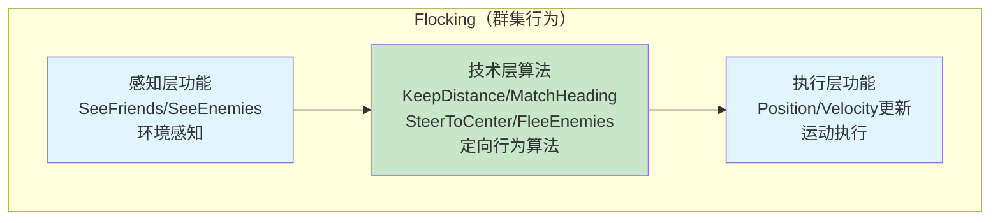

## Flocking（群集行为）

### 在AI架构中的归属

Flocking在AI分层架构中**主要属于执行层**，但包含多个层的功能：



**架构归属分析**：

1. **执行层（主要）**：
   - Flocking整体作为**执行层插件**
   - 负责执行运动行为（Position、Velocity、Orientation更新）
   - 最终输出：boid的运动状态

2. **技术层（算法支持）**：
   - 四个定向行为规则算法（分离、对齐、聚集、躲避）
   - 属于技术层的算法集合
   - 可通过黑板架构模式被决策层调用

3. **感知层（内部实现）**：
   - SeeFriends、SeeEnemies（环境感知）
   - 可作为独立的感知层插件，或作为Flocking内部实现

**推荐架构设计**：

- **执行层插件**：`FlockingExecutionPlugin` - 实现IPlugin接口，向管理层注册
- **技术层算法**：四个定向行为规则作为独立算法，注册到黑板
- **感知层插件**（可选）：`FlockingPerceptionPlugin` - 独立的感知功能

### 核心概念

- **定义**：Craig Reynolds于1987年提出的分布式行为模型，模拟鸟群、鱼群等生物群体行为
- **特点**：通过简单规则组合产生复杂的群体运动，展现涌现行为（emergent behavior）
- **应用场景**：Unreal、Half-Life中的怪物和生物，Enemy Nations的部队队形，RTS/RPG中的群体动画

```csharp
public class Boid
{
    public Vector3 Position { get; set; }
    public Vector3 Velocity { get; set; }
    public Vector3 Orientation { get; set; }
    
    public float PerceptionRange { get; set; } = 10f;
    public float MaxSpeed { get; set; } = 5f;
    public float MaxVelocityChange { get; set; } = 2f;
    
    private List<Boid> visibleFriends = new List<Boid>();
    private List<Boid> visibleEnemies = new List<Boid>();
    
    // 四个定向行为规则（Enemy参数可选）
    public void FlockIt(List<Boid> allBoids, List<Boid> enemies = null)
    {
        // 1. 检测可见的同伴和敌人
        SeeFriends(allBoids);
        if (enemies != null && enemies.Count > 0)
            SeeEnemies(enemies);
        
        // 2. 累积所有定向行为的矢量变化
        Vector3 changeVector = Vector3.zero;
        
        changeVector += KeepDistance() * 1.5f;      // 分离（权重1.5）
        changeVector += MatchHeading() * 1.0f;      // 对齐（权重1.0）
        changeVector += SteerToCenter() * 1.0f;     // 聚集（权重1.0）
        
        // 躲避行为（可选，仅在需要时启用）
        if (enemies != null && enemies.Count > 0)
            changeVector += FleeEnemies() * 2.0f;      // 躲避（权重2.0，优先级高）
        
        // 3. 单位化并应用变化
        if (changeVector.magnitude > 0)
        {
            changeVector.Normalize();
            Velocity += changeVector * MaxVelocityChange;
            
            // 限制最大速度
            if (Velocity.magnitude > MaxSpeed)
                Velocity = Velocity.normalized * MaxSpeed;
        }
        
        // 4. 更新位置和朝向
        Position += Velocity * Time.deltaTime;
        ComputeRPY();
        WorldBound();
    }
    
    // 分离：避免与邻近个体过于接近
    private Vector3 KeepDistance()
    {
        if (visibleFriends.Count == 0) return Vector3.zero;
        
        Vector3 steer = Vector3.zero;
        int count = 0;
        
        foreach (var friend in visibleFriends)
        {
            float distance = Vector3.Distance(Position, friend.Position);
            if (distance > 0 && distance < PerceptionRange)
            {
                Vector3 diff = Position - friend.Position;
                diff.Normalize();
                diff /= distance; // 距离越近，影响越大
                steer += diff;
                count++;
            }
        }
        
        if (count > 0)
            steer /= count;
        
        return steer;
    }
    
    // 对齐：与邻近个体的平均航向对齐
    private Vector3 MatchHeading()
    {
        if (visibleFriends.Count == 0) return Vector3.zero;
        
        Vector3 averageVelocity = Vector3.zero;
        foreach (var friend in visibleFriends)
        {
            averageVelocity += friend.Velocity;
        }
        averageVelocity /= visibleFriends.Count;
        
        return (averageVelocity - Velocity).normalized;
    }
    
    // 聚集：向邻近个体的平均位置移动
    private Vector3 SteerToCenter()
    {
        if (visibleFriends.Count == 0) return Vector3.zero;
        
        Vector3 centerOfMass = Vector3.zero;
        foreach (var friend in visibleFriends)
        {
            centerOfMass += friend.Position;
        }
        centerOfMass /= visibleFriends.Count;
        
        return (centerOfMass - Position).normalized;
    }
    
    // 躲避：避开敌人
    private Vector3 FleeEnemies()
    {
        if (visibleEnemies.Count == 0) return Vector3.zero;
        
        Vector3 fleeVector = Vector3.zero;
        foreach (var enemy in visibleEnemies)
        {
            Vector3 away = Position - enemy.Position;
            float distance = away.magnitude;
            if (distance > 0)
            {
                away.Normalize();
                away /= distance; // 距离越近，逃离越急
                fleeVector += away;
            }
        }
        
        return fleeVector.normalized;
    }
    
    // 检测可见的同伴
    private void SeeFriends(List<Boid> allBoids)
    {
        visibleFriends.Clear();
        foreach (var boid in allBoids)
        {
            if (boid != this && CanISee(boid))
                visibleFriends.Add(boid);
        }
    }
    
    // 检测可见的敌人
    private void SeeEnemies(List<Boid> enemies)
    {
        visibleEnemies.Clear();
        foreach (var enemy in enemies)
        {
            if (CanISee(enemy))
                visibleEnemies.Add(enemy);
        }
    }
    
    // 判断是否可见
    private bool CanISee(Boid other)
    {
        float distance = Vector3.Distance(Position, other.Position);
        return distance <= PerceptionRange;
    }
    
    // 计算Roll/Pitch/Yaw朝向
    private void ComputeRPY()
    {
        if (Velocity.magnitude > 0.1f)
        {
            Quaternion targetRotation = Quaternion.LookRotation(Velocity.normalized);
            Orientation = targetRotation.eulerAngles;
        }
    }
    
    // 边界处理（环绕）
    private void WorldBound()
    {
        // 假设世界边界为Box，超出边界则环绕到对面
        // 可根据需要实现反弹或其他行为
    }
}
```

#### Flock类（群体管理）

```csharp
public class Flock
{
    private List<Boid> members = new List<Boid>();
    public int Count => members.Count;
    
    public void AddBoid(Boid boid)
    {
        if (!members.Contains(boid))
            members.Add(boid);
    }
    
    public void RemoveBoid(Boid boid)
    {
        members.Remove(boid);
    }
    
    public void Update(List<Boid> enemies = null)
    {
        foreach (var boid in members)
        {
            boid.FlockIt(members, enemies);
        }
    }
    
    public List<Boid> GetAllMembers()
    {
        return new List<Boid>(members); // 返回副本，避免外部修改
    }
    
    public Boid GetFirstMember()
    {
        return members.Count > 0 ? members[0] : null;
    }
}
```

#### FlockManager类（全局管理 - 优化版）

```csharp
public class FlockManager : MonoBehaviour
{
    private List<Flock> flocks = new List<Flock>();
    
    // 优化1：缓存敌人列表，避免每帧重建
    private Dictionary<Flock, List<Boid>> enemyCache = new Dictionary<Flock, List<Boid>>();
    
    // 优化2：控制更新频率（可选）
    [SerializeField] private float updateInterval = 0.1f; // 每0.1秒更新一次
    private float lastUpdateTime = 0f;
    
    // 优化3：分帧更新（可选）
    [SerializeField] private int boidsPerFrame = 10; // 每帧更新10个boid
    private int currentBoidIndex = 0;
    
    public void AddFlock(Flock flock)
    {
        flocks.Add(flock);
        enemyCache[flock] = new List<Boid>();
    }
    
    void Update()
    {
        // 方式1：固定时间间隔更新（推荐）
        if (Time.time - lastUpdateTime >= updateInterval)
        {
            UpdateAllFlocks();
            lastUpdateTime = Time.time;
        }
        
        // 方式2：分帧更新（适合大量boid）
        // UpdateFlocksIncrementally();
    }
    
    // 固定时间间隔更新
    private void UpdateAllFlocks()
    {
        // 预计算所有flock的敌人列表（在Update外）
        RefreshEnemyCache();
        
        // 更新所有flock
        foreach (var flock in flocks)
        {
            flock.Update(enemyCache[flock]);
        }
    }
    
    // 刷新敌人缓存（只在需要时调用，不在每帧Update中）
    private void RefreshEnemyCache()
    {
        foreach (var currentFlock in flocks)
        {
            List<Boid> enemies = new List<Boid>();
            foreach (var otherFlock in flocks)
            {
                if (otherFlock != currentFlock)
                {
                    enemies.AddRange(otherFlock.GetAllMembers());
                }
            }
            enemyCache[currentFlock] = enemies;
        }
    }
    
    // 分帧更新（适合大量boid，避免单帧卡顿）
    private void UpdateFlocksIncrementally()
    {
        int updated = 0;
        foreach (var flock in flocks)
        {
            var members = flock.GetAllMembers();
            for (int i = 0; i < members.Count && updated < boidsPerFrame; i++)
            {
                int index = (currentBoidIndex + i) % members.Count;
                var boid = members[index];
                
                // 获取该boid所属flock的敌人
                var enemies = GetEnemiesForFlock(flock);
                boid.FlockIt(members, enemies);
                
                updated++;
            }
        }
        
        currentBoidIndex = (currentBoidIndex + boidsPerFrame) % GetTotalBoidCount();
    }
    
    private List<Boid> GetEnemiesForFlock(Flock flock)
    {
        if (!enemyCache.ContainsKey(flock))
            RefreshEnemyCache();
        return enemyCache[flock];
    }
    
    private int GetTotalBoidCount()
    {
        int count = 0;
        foreach (var flock in flocks)
            count += flock.Count;
        return count > 0 ? count : 1;
    }
}
```

#### 关于Enemy的说明

**为什么需要Enemy？**

- Enemy是Reynolds的**第四规则（躲避）**，用于实现：
  - 躲避其他flock的成员（如兔子躲避狐狸）
  - 躲避障碍物
  - 实现捕食-被捕食关系
- **不是必须的**：如果只需要基本的群集行为（分离、对齐、聚集），可以移除Enemy相关代码

**Enemy是否必须在Update外？**

- **当前实现**：在Update内每帧收集，效率低
- **优化方案**：
  - 使用`enemyCache`缓存敌人列表
  - 只在flock成员变化时刷新缓存
  - 或使用固定时间间隔刷新（如每0.5秒）

**Update频率优化**

- **固定时间间隔**：使用`updateInterval`控制更新频率（如0.1秒），减少CPU占用
- **分帧更新**：每帧只更新部分boid，避免单帧卡顿
- **LOD系统**：距离摄像机远的flock降低更新频率