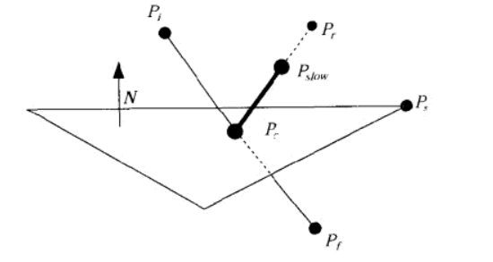


#  数学技巧

> **第二章核心价值**：提供游戏开发中**最常用、最实用**的数学计算技巧，解决碰撞检测、物理模拟、空间计算等核心问题。这些技巧是游戏开发的基础工具，掌握后能大幅提升开发效率和代码质量。

> **⚠️ 重要说明**：现代游戏引擎（如Unity）已经实现了这些机制的大部分功能。**学习这些技巧的价值在于理解原理**，而不是自己实现。实际开发中应该使用引擎提供的API和工具，而不是按照书中的方式手动实现。

## 📊 章节价值评估

| 章节 | Unity封装情况 | 学习价值 | 实际使用 |
|-----|--------------|---------|---------|
| **2.2 矢量和平面技巧** | ✅ 90%已封装 | ⭐⭐⭐⭐ | 使用Unity API |
| **2.3 3D线段交点** | ✅ 已封装 | ⭐⭐⭐ | 使用Physics.Raycast |
| **2.7 碰撞检测算法** | ✅ 已封装 | ⭐⭐⭐ | 使用Collider系统 |
| **2.4 反向弹道计算** | ❌ 未封装 | ⭐⭐ | 按需实现 |
| **2.5 平行移动镜头** | ✅ 工具支持 | ⭐⭐ | 使用Cinemachine |
| **2.6 四元数飞行路径** | ✅ 工具支持 | ⭐⭐ | 使用DOTween |
| **2.1 浮点优化** | ✅ 已优化 | ⭐ | 了解即可 |
| **2.8 不规则碎片** | ✅ 部分支持 | ⭐ | 了解即可 |

**统一结论**：**了解原理即可**，实际开发使用Unity API和工具，不需要按照书中的方式手动实现。

## 🎯 核心价值总结

### 1. **理解引擎原理**（主要价值）
- ✅ 理解Unity API背后的数学原理
- ✅ 知道引擎内部是如何实现的
- ✅ 遇到问题时知道如何调试和优化

### 2. **特殊情况处理**（次要价值）
- ✅ 遇到引擎没有封装的功能时知道如何实现
- ✅ 特殊场景的性能优化
- ✅ 自定义算法需求

### 3. **实际开发建议**
- ⚠️ **99%的情况**：直接使用Unity API和工具（DOTween、Cinemachine等）
- ⚠️ **1%的情况**：需要自己实现时，知道原理和算法
- ✅ **学习重点**：理解原理，而不是自己实现

## 📌 统一学习建议

**所有章节的学习策略**：
1. **了解原理**：知道数学公式和算法原理
2. **理解应用**：知道在什么场景下使用
3. **使用工具**：实际开发使用Unity API或第三方工具
4. **特殊情况**：遇到工具无法满足的需求时，知道如何实现

## 浮点数计算技巧 - 使用IEEE浮点格式提高性能 ⚠️ 了解即可

**定义**：利用浮点数在内存中的二进制表示特性，通过**位操作**替代传统数学运算来实现性能优化。

**IEEE 754浮点数格式**（32位）：
- 符号位(1位) + 指数位(8位) + 尾数位(23位)
- 数值公式：`value = (-1)^S × (1.M) × 2^(E-127)`

**优化思想**：通过位操作实现数学运算的快速近似，避免函数调用开销。

**快速平方根倒数算法原理**：
1. 将浮点数按位解释为整数，通过位操作（右移、减法）和魔法数`0x5f3759df`快速得到近似值
2. 使用一次牛顿迭代法提高精度

**现代情况**：1999年时比标准sqrt快3-4倍，但现代CPU的硬件指令（如`rsqrtss`）直接在CPU中执行，性能更好、精度更高，**通常不需要手动实现**。

**Unity/C#建议**：直接使用`Vector3.normalized`、`Mathf.Sqrt()`等Unity已优化的方法即可。

---

## 2.2 矢量和平面技巧 ⭐⭐⭐⭐

**核心概念**：基于**平面法线（Normal Vector）**的向量计算技巧，用于碰撞检测、反射计算、距离判断等。

**与法线原理的关系**：
- **平面法线**：垂直于平面的单位向量，定义平面的朝向
- **平面方程**：`ax + by + cz + d = 0`，其中`(a, b, c)`是法线向量
- **点积运算**：通过向量与法线的点积判断点在平面的哪一侧

**主要内容**：
1. **相对于碰撞面的高度**：使用点积计算点到平面的距离（高度）
2. **找出碰撞点**：通过射线与平面的交点计算
3. **到碰撞点的距离**：使用向量投影计算最短距离
4. **反射式碰撞**：利用法线计算反射向量（`R = I - 2(I·N)N`）
5. **阻尼碰撞**：在反射基础上添加能量损失 (`Ps = Pc + (Pr - Pc) * S`)



**Unity/C#应用**：

**✅ Unity已完全封装的功能**（直接使用）：
- `Vector3.Dot()` - 点积计算（点到平面距离、投影等）
- `Vector3.Project()` - 向量投影
- `Vector3.Reflect()` - 反射向量计算（反射碰撞）
- `Plane.GetDistanceToPoint()` - 点到平面距离
- `Plane.Raycast()` - 射线与平面交点
- `Physics.Raycast()` - 射线检测（碰撞点）
- `Physics.ComputePenetration()` - 碰撞穿透计算

**⚠️ 需要自己实现的部分**：
- **阻尼碰撞**：Unity没有直接提供，需要基于`Vector3.Reflect()`自己实现能量损失计算
- **特定算法优化**：某些特殊场景可能需要自定义实现以获得更好性能

**结论**：Unity已经封装了**90%以上**的矢量和平面计算功能，**通常不需要自己实现**。学习这些技巧的价值在于：
1. **理解原理**：知道Unity API背后的数学原理
2. **特殊情况**：遇到Unity没有封装的功能时知道如何实现
3. **性能优化**：某些特殊场景可以自己优化实现

## 2.3 一种快速、健壮的计算3D线段交点的方法 ⭐⭐⭐⭐

**Unity封装情况**：
- ✅ `Physics.Raycast()` - 射线与物体交点（最常用）
- ✅ `Plane.Raycast()` - 射线与平面交点
- ✅ `Physics.Linecast()` - 线段检测
- ⚠️ **3D线段与线段交点**：Unity没有直接提供，需要自己实现（但实际开发中很少用到）

**学习价值**：理解算法原理，处理Unity没有覆盖的特殊情况。

## 2.4 反向弹道计算 ⚠️ 了解即可

**核心概念**：计算发射角度，使弹道能够命中指定目标位置。

**核心原理**：
- **算法思想**：基于物理运动学公式，考虑重力、初速度、目标位置，通过数学计算求解发射角度
- **物理公式**：使用抛体运动方程，通过二次方程求解发射角度
- **解的情况**：
  - **两个解**：高抛（高角度）和低抛（低角度）
  - **一个解**：目标刚好在最大射程
  - **无解**：目标超出射程
- **特点**：需要处理无解情况（目标超出射程）和边界条件

**Unity封装情况**：
- ❌ Unity**没有直接提供**反向弹道计算
- ✅ 但可以使用`Physics`系统模拟，或自己实现数学计算
- ✅ 第三方插件如`ProjectileHelper`提供相关功能

**应用场景**：弹道类游戏、塔防游戏、射击游戏的AI瞄准系统、投掷物轨迹计算。

**Unity/C#建议**：需要自己实现，或使用第三方插件。

**代码实现**：

.md)

## 2.5 平行移动镜头 ⭐⭐⭐

**定义**：摄像机沿预定路径移动，保持与被拍摄对象的相对位置或朝向关系。

**与贝塞尔曲线的关系**：
- **平行移动镜头**：镜头移动的概念（保持相对位置/朝向）
- **贝塞尔曲线**：实现平滑路径的数学工具
- **关系**：平行移动镜头**可以使用贝塞尔曲线**来实现平滑的路径跟随

**实现方式**：
1. **直线路径**：简单的平行移动（沿直线）
2. **贝塞尔曲线路径**：使用贝塞尔曲线定义平滑路径，摄像机沿曲线跟随
3. **样条曲线**：使用样条曲线（如Catmull-Rom）实现更复杂的路径

**核心原理**：
- **路径定义**：使用控制点定义路径（直线、贝塞尔曲线、样条曲线）
- **参数化跟随**：`t ∈ [0, 1]` 沿路径移动
- **平滑插值**：使用`Lerp`或`Slerp`实现平滑过渡
- **朝向控制**：可以保持固定朝向，或沿路径切线方向

**Unity封装情况**：
- ✅ `Camera.transform` - 摄像机变换
- ✅ `Vector3.Lerp()` / `Vector3.Slerp()` - 平滑插值
- ✅ `AnimationCurve` - 动画曲线（速度控制）
- ✅ `Cinemachine`插件 - 专业镜头控制（支持路径动画，推荐）
- ⚠️ **贝塞尔曲线实现**：Unity没有直接提供，需要自己实现或使用第三方库

**Unity/C#实现示例**：
```csharp
// 使用贝塞尔曲线实现平行移动镜头
public class BezierCameraFollow : MonoBehaviour 
{
    public Transform[] controlPoints; // 贝塞尔曲线控制点
    public float speed = 1f;
    private float t = 0f;
    
    void Update() 
    {
        // 沿贝塞尔曲线移动
        transform.position = BezierCurve(controlPoints, t);
        t += speed * Time.deltaTime;
        if (t > 1f) t = 0f; // 循环
    }
    
    Vector3 BezierCurve(Transform[] points, float t) 
    {
        // 贝塞尔曲线计算
        // 可以使用二次或三次贝塞尔曲线
    }
}
```

**学习价值**：理解镜头控制的数学原理，实现自定义镜头效果（包括贝塞尔曲线路径跟随）。

## 2.6 平滑的基于四元数的飞行路径 ⭐⭐⭐

**四元数（Quaternion）的常见误解纠正**：

❌ **错误理解**：四元数包含坐标和旋转角度  
✅ **正确理解**：四元数**只表示旋转（朝向）**，不包含位置坐标

**四元数的实际用途**：
- **旋转/朝向**：四元数表示物体的旋转状态（朝向哪个方向）
- **不包含位置**：位置坐标是`Vector3`，旋转是`Quaternion`
- **Transform组合**：`Transform`包含`position`（Vector3）和`rotation`（Quaternion）

**飞行路径的实现**：
```
飞行路径 = 位置路径（Vector3） + 旋转路径（Quaternion）

1. 位置路径：使用Vector3.Lerp()或贝塞尔曲线定义位置
2. 旋转路径：使用Quaternion.Slerp()定义朝向（沿路径切线方向）
3. 组合使用：同时插值位置和旋转，实现平滑的飞行路径
```

**核心原理**：
- **位置插值**：`Vector3.Lerp(startPos, endPos, t)` - 沿路径移动
- **旋转插值**：`Quaternion.Slerp(startRot, endRot, t)` - 平滑旋转朝向
- **切线方向**：飞行时朝向应该沿路径的切线方向（使用`Quaternion.LookRotation()`计算）

**Unity封装情况**：
- ✅ `Quaternion.Lerp()` / `Quaternion.Slerp()` - 四元数插值（旋转平滑）
- ✅ `Quaternion.LookRotation()` - 朝向计算（沿路径切线方向）
- ✅ `Vector3.Lerp()` - 位置插值（路径移动）
- ✅ `AnimationCurve` - 动画曲线（速度控制）
- ✅ `Cinemachine`插件 - 路径动画（推荐，自动处理位置和旋转）
- ⚠️ **复杂路径算法**：可能需要自己实现位置和旋转的组合插值

**Unity/C#实现示例**：
```csharp
// 飞行路径：同时插值位置和旋转
public class FlightPath : MonoBehaviour 
{
    public Vector3[] pathPoints;      // 位置路径点
    public float speed = 1f;
    private float t = 0f;
    
    void Update() 
    {
        // 1. 位置插值（沿路径移动）
        Vector3 currentPos = Vector3.Lerp(pathPoints[0], pathPoints[1], t);
        transform.position = currentPos;
        
        // 2. 旋转插值（朝向路径方向）
        Vector3 direction = (pathPoints[1] - pathPoints[0]).normalized;
        Quaternion targetRot = Quaternion.LookRotation(direction);
        transform.rotation = Quaternion.Slerp(transform.rotation, targetRot, Time.deltaTime);
        
        t += speed * Time.deltaTime;
    }
}
```

**实际开发建议**：

**✅ 推荐使用工具**（比手动实现更方便）：
- **DOTween**：提供`DORotate()`、`DOMove()`等API，支持动画曲线，代码简洁
- **Cinemachine**：专业镜头控制插件，功能丰富，效果更好
- **LeanTween**：轻量级补间动画库
- **AnimationCurve**：Unity内置动画曲线编辑器

**为什么工具更好**：
1. **代码简洁**：`transform.DORotate(targetRot, 1f).SetEase(Ease.InOutQuad)`
2. **动画曲线**：可视化编辑，支持各种缓动效果
3. **功能丰富**：支持延迟、循环、回调等
4. **性能优化**：工具已优化，比自己实现更高效

**学习价值**：
- ✅ **理解原理**：知道四元数插值的工作原理
- ✅ **特殊情况**：遇到工具无法满足的需求时知道如何实现
- ⚠️ **实际开发**：通常使用DOTween等工具，不需要自己实现

**结论**：了解原理即可，实际开发推荐使用DOTween或Cinemachine，效果更丰富、代码更简洁。

## 2.7 递归逐维分组：一种快速的碰撞检测算法 ⭐⭐⭐⭐

**核心概念**：这是一种**空间分割优化算法**，用于提高碰撞检测的性能。

**与Unity碰撞体系统的关系**：

**Unity的碰撞体系统**：
- ✅ `Collider`组件（BoxCollider、SphereCollider等）- 定义碰撞形状
- ✅ `Rigidbody`组件 - 物理模拟
- ✅ `Physics`系统 - 自动处理碰撞检测和响应
- ✅ **内部优化**：Unity物理引擎内部已使用类似的空间分割算法优化性能

**递归逐维分组算法**：
- **作用**：优化碰撞检测的性能（减少检测次数）
- **原理**：将空间分割成多个区域，只检测同一区域内的物体
- **应用**：Unity物理引擎内部可能使用了类似的优化算法

**两者的关系**：
```
Unity碰撞体系统（用户层面）
    ↓
    使用Collider定义碰撞形状
    ↓
Unity物理引擎（底层）
    ↓
    内部使用空间分割算法优化（类似递归逐维分组）
    ↓
    自动处理碰撞检测和响应
```

**Unity封装情况**：
- ✅ `Physics.OverlapSphere()` - 球形范围检测（已优化）
- ✅ `Physics.OverlapBox()` - 盒形范围检测（已优化）
- ✅ `Physics.CheckSphere()` - 球形碰撞检测（已优化）
- ✅ `OnCollisionEnter()` / `OnTriggerEnter()` - 碰撞回调（自动触发）
- ✅ **空间分割优化**：Unity物理引擎内部已使用类似优化，**用户无需关心**

**实际开发建议**：

**✅ 推荐做法**（99%的情况）：
- 直接使用Unity的碰撞体系统（Collider + Rigidbody）
- Unity已自动优化，性能足够好
- 代码简洁：`OnCollisionEnter()`自动触发

**⚠️ 需要自己实现的情况**（1%的特殊场景）：
- 大规模场景（数千个物体）需要特殊优化
- 自定义碰撞检测逻辑（如游戏逻辑层面的碰撞，非物理碰撞）
- 性能瓶颈时可能需要自己实现空间分割

**学习价值**：
- ✅ **理解原理**：知道Unity碰撞检测背后的优化原理
- ✅ **性能优化**：遇到性能问题时知道如何优化
- ⚠️ **实际开发**：通常直接使用Unity碰撞体系统，不需要自己实现

**结论**：Unity已有完整的碰撞体系统，内部已优化。了解算法原理有助于理解Unity系统的工作原理和性能优化思路，但**实际开发通常不需要自己实现**。

## 2.8 不规则碎片编程 ⚠️ 了解即可

**定义**：使用分形噪声（Fractal Brownian Motion, FBM）生成程序化地形、纹理等不规则图案。

**核心原理**：
- 基于Perlin噪声或Simplex噪声，通过多层叠加生成自然的不规则图案
- 使用不同频率和振幅的噪声层叠加，形成细节丰富的分形结构
- 通过调整参数（频率、振幅、层数）控制生成效果

**应用场景**：程序化地形生成、程序化纹理、云层生成、水面波纹等。

**Unity/C#建议**：Unity的`Mathf.PerlinNoise()`提供基础噪声，或使用第三方库如`FastNoise`。
