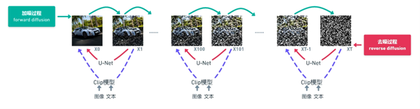

# 炼丹
**炼丹**的核心是通过数据训练模型，利用算法从数据中学习规律，最终实现特定目标。其过程通常包括数据收集、特征提取、模型训练和结果优化等步骤。

## Stable Diffusion
**Stable Diffusion（SD）** 是一种基于扩散模型的生成算法，能够实现以下功能：
1.  **图生图（Image-to-Image）**：根据输入图像生成风格化或内容相关的图像。
2.  **文生图（Text-to-Image）**：根据文本描述生成与之匹配的图像。

**SD**通过结合U-Net、VAE、CLIP等多种技术，实现了高质量的图像生成，广泛应用于艺术创作、设计辅助和内容生成等领域。

## 扩散模型与相关技术

1.  **Forward Diffusion（正向扩散过程）**  
    正向扩散过程通过逐步向数据添加噪声，将原始数据逐渐转化为纯噪声。这一过程模拟了数据从有序到无序的演变，为后续的去噪生成奠定基础。
    
2.  **U-Net**  
    U-Net是一种用于图像生成的神经网络架构，其核心作用是通过逐步去除噪声，将纯噪声数据还原为高质量的图像。U-Net通过编码器-解码器结构，结合跳跃连接（Skip  
    Connections），能够有效捕捉图像的局部和全局特征。
    
3.  **Stable Diffusion（稳定扩散模型）**  
    稳定扩散模型是一种先进的生成模型，结合了多种技术：
    
    - **U-Net**：用于逐步去噪，生成高质量图像。
        
    - **VAE（变分自编码器）**：用于压缩和重建图像，提升计算效率。
        
    - **梯度下降**：优化模型参数，确保生成效果稳定。
        
    - **CLIP（对比语言-图像预训练模型）**：通过文本-图像对齐，实现文本引导的图像生成。  
        这些技术的结合使得Stable  
        Diffusion能够生成高度逼真且符合文本描述的图像。
        

## 关键概念解析


| 术语  | 中文解释 |
| --- | --- |
| **Checkpoint** | 基于Dreambooth技术训练得到的模型文件，实际改变了模型的结构和参数，能够保存训练过程中的状态，便于后续加载和继续训练。Checkpoint通常包含模型的权重、优化器状态和其他训练相关信息，是模型训练中的重要保存点。 |
| **Loss值（损失值）** | 反映模型在当前参数下对训练数据的拟合程度： 
||**低Loss值**：预测结果与真实标签差异小，模型性能好。
||**高Loss值**：预测结果与真实标签差异大，模型性能差。
||Loss值是评估神经网络性能的关键指标之一，优化目标通常是最小化Loss值。常见的损失函数包括均方误差（MSE）、交叉熵损失（Cross-Entropy Loss）等。
| **Embedding（嵌入）** | 文本反转训练技术，通过将文本映射到低维向量空间，捕捉文本的语义信息，从而增强模型对文本的理解能力。Embedding广泛应用于自然语言处理（NLP）任务中，如词嵌入（Word Embedding）和句子嵌入（Sentence Embedding）。 |
| **Hypernetwork（超网络）** | 一种通过一个神经网络（超网络）动态生成另一个神经网络（目标网络）权重或其他参数的技术。它能够灵活调整目标网络的结构和参数，提升模型的适应能力。超网络常用于生成对抗网络（GAN）和元学习（Meta-Learning）等领域。 |
| **LoRA（Low-Rank Adaptation，低秩适应）** | 轻量化的模型调教方法，通过插入低秩矩阵来调整模型，避免直接修改原有模型参数。其特点包括： |
|| 体积小：便于在原有模型中插入新的数据处理层。 |     |
| |灵活性高：通过冻结底模并添加新层实现调教，适用于层次传递的神经网络结构。 |     |
| |变体：Lycoris与Dora是LoRA的改进版本，进一步优化了其性能和应用场景。 |     |
| **Dreambooth** | 一种微调预训练模型的技术，通过少量特定主题的图像数据，使模型能够生成与这些主题相关的高质量图像。Dreambooth广泛应用于个性化图像生成任务。 |
| **VAE（Variational Autoencoder，变分自编码器）** | 一种生成模型，通过编码器将输入数据映射到潜在空间，再通过解码器从潜在空间重建数据。VAE广泛应用于图像生成和数据压缩任务。 |
| **CLIP（Contrastive Language--Image Pretraining）** | 一种多模态模型，通过对比学习将文本和图像映射到同一潜在空间，从而实现文本-图像对齐。CLIP广泛应用于文本引导的图像生成任务。 |
| **U-Net** | 一种用于图像分割和生成的神经网络架构，通过编码器-解码器结构和跳跃连接（Skip Connections），能够有效捕捉图像的局部和全局特征。U-Net广泛应用于医学图像分割和图像生成任务。 |
| **Stable Diffusion** | 一种基于扩散模型的生成算法，结合了U-Net、VAE、CLIP等多种技术，能够实现高质量的图像生成。Stable Diffusion广泛应用于艺术创作、设计辅助和内容生成等领域。 |
| **Noise Schedule（噪声调度）** | 在扩散模型中，噪声调度定义了正向扩散过程中每一步添加噪声的强度和分布规律。合理的噪声调度能平衡生成质量与计算效率，常见类型包括线性调度、余弦调度等。 |
| **DDIM（Denoising Diffusion Implicit Models）** | 一种改进的扩散模型采样方法，通过隐式概率建模加速生成过程，可在更少步骤内生成高质量图像。 |
| **Attention Mechanism（注意力机制）** | 一种神经网络模块，通过动态分配权重关注输入数据的关键部分。在U-Net和Transformer中广泛应用，用于捕捉长距离依赖关系，提升生成图像的细节一致性。 |
| **FID（Fréchet Inception Distance）** | 评估生成模型质量的指标，通过计算生成图像与真实图像在特征空间中的分布距离，数值越低表示生成效果越接近真实数据。 |
| **Latent Space（潜在空间）** | 模型通过编码器将高维数据（如图像）压缩到的低维连续向量空间。在VAE和扩散模型中，潜在空间是生成过程的核心操作区域。 |
| **Data Augmentation（数据增强）** | 通过旋转、裁剪、色彩变换等技术扩充训练数据，提升模型的泛化能力，防止过拟合。 |
| **Adam Optimizer（Adam优化器）** | 一种自适应学习率优化算法，结合动量（Momentum）和自适应梯度调整，广泛应用于深度学习模型训练。 |
| **Mixed Precision Training（混合精度训练）** | 使用半精度（FP16）和单精度（FP32）混合计算，加速训练并减少显存占用，常用于大模型训练。 |
| **Gradient Clipping（梯度裁剪）** | 限制梯度值的范围，防止梯度爆炸问题，尤其在训练深度网络（如Transformer）时至关重要。 |
| **Model Distillation（模型蒸馏）** | 将复杂模型（教师模型）的知识迁移到轻量模型（学生模型）中，以降低推理成本，同时保持性能。 |
| **Self-Supervised Learning（自监督学习）** | 利用数据本身的结构（如图像补丁预测、掩码重建）生成监督信号，减少对人工标注数据的依赖。 |
| **Zero-Shot Learning（零样本学习）** | 模型在未经特定任务数据训练的情况下，直接完成该任务的推理，常见于CLIP等跨模态模型。 |
| **EMA（Exponential Moving Average，指数移动平均）** | 在训练过程中对模型权重进行平滑处理，提升模型鲁棒性，常用于生成模型的最终版本保存。 |
| **CFG（Classifier-Free Guidance，无分类器引导）** | 一种控制生成结果的技术，通过调整条件输入和无条件生成的权重比例，平衡生成图像的多样性与准确性。 |
| **Inpainting（图像修复）** | 根据上下文信息补全图像缺失区域的技术，扩散模型在此任务中表现出色，常用于编辑和修复老照片。 |


## **Lora - Train 简介**

### **模式介绍**

1.  **新手模式**：采用 SD1.5  
    模型。此模式专为初次接触相关训练任务的用户设计，SD1.5  
    具备相对基础且稳定的特性，能帮助新手快速上手并熟悉训练流程。
    
2.  **专家模式**：可选择 SD1.5 或 SDXL  
    模型。对于有一定经验的专业用户，SDXL  
    提供了更高的分辨率和更丰富的细节表现，满足他们在复杂、高质量项目上的训练需求；而  
    SD1.5 则在某些特定场景或对模型轻量性有要求时，依然能发挥其优势。
    

###  **训练功能**

1.  **Flux**：专注于训练 Flux 相关任务。通过该功能，用户能够对 Flux  
    模型进行有针对性的训练，以满足特定的应用场景或优化需求。
    
2.  **Dreambooth**：用于训练 DB 模型。Dreambooth  
    技术允许用户基于少量的特定图像数据对模型进行微调，从而使模型能够生成与这些特定数据风格或内容相关的图像。
    

###  **辅助工具**

1.  **Tensorboard**：作为训练过程监控工具，Tensorboard  
    能够实时展示训练过程中的各种关键指标，如损失函数变化、梯度信息等，帮助用户及时了解训练状态，以便做出相应的调整和优化。
    
2.  **WD  
    标签器**：这是一款图片反推提示词工具。它能够根据输入的图片，智能分析并生成相应的提示词，为图像生成任务提供更精准的文本描述引导，有效提升生成图像与预期效果的契合度。
    


###  **训练模型分类**


1.  **预训练模型**：基于 Compvis  
    基础算法构建，这类模型在大规模数据上进行预训练，学习到通用的图像特征表示，为后续的模型训练提供了基础架构和参数初始化。
    
2.  **微调模型**：在预训练模型的基础上，通过使用特定领域或任务的数据对模型进行进一步训练，使模型能够更好地适应特定的应用场景。
    
3.  **训练模型**：从初始状态开始，利用特定数据集进行完整训练，以满足特定任务需求。此过程需要更多的计算资源和时间，但能定制出高度贴合特定任务的模型。
    
4.  **融合模型**：由数据模型组成，虽然在特定数据上可能表现出色，但通用性较差，应用场景相对受限。
    

**Lora 版本与底模的关系**

> Lora 版本与底模版本呈现一一对应的关系，这种对应关系确保了 Lora  
> 在训练和应用过程中能够与相应底模良好适配，充分发挥其性能优势。

**NovelAI 在二次元领域的地位**

> NovelAI  
> 作为加入大量二次元风格模型的先驱，在二次元图像生成领域具有显著优势，是二次元相关应用的首要选择。其模型经过大量二次元数据的训练和优化，能够生成高质量、符合二次元风格特点的图像。

###  **Lora 应用领域**

1.  **具象概念**：能够帮助模型准确生成特定的具体对象或场景，例如特定人物、建筑等，使生成的图像在细节和特征上高度符合具象概念的描述。
    
2.  **类型概念**：可应用于生成具有特定类型特征的图像，如不同风格的风景、不同类别的动物等，拓宽了模型在特定类型图像生成方面的表现能力。
    
3.  **风格**：支持风格融合，如将水墨风格与二次元底模相结合，创造出独特的艺术风格图像，为艺术创作提供了更多新颖的可能性。
    
4.  **功能性**：在功能性方面，Lora  
    可用于优化模型在特定任务上的性能，例如图像修复、超分辨率等功能性应用场景，提升模型在这些方面的表现。
    

## **LoRA模型训练流程**

1.  **明确训练目标**  
    确定训练的具体目标，例如风格化、角色特征或特定场景生成。
    
2.  **准备训练数据**
    
    - 收集20-30张高质量图片，确保图片内容与训练目标一致。
        
    - 图片应尽量多样化，涵盖不同角度、光照条件和背景。
        
3.  **数据标注与提示词设置**
    
    - 为每张图片添加标签（Tags），标注关键特征。
        
    - 在提示词（Additional  
        Tags）中加入自定义关键词，并赋予较高权重，确保模型能准确学习目标特征。
        
4.  **选择基底模型与配置**
    
    - 选择适合的基底模型（Base Model），确保与训练目标兼容。
        
    - 配置数据集路径、模型名称及版本号，启动训练。
        
5.  **模型测试与调优**
    
    - 加载不同版本的LoRA模型（如V1、V2、V3等）。
        
    - 设置不同权重值（如0.0、0.2、0.4等），生成结果并对比效果。
        
    - 根据测试结果调整模型参数或重新训练，直至达到预期效果。
        

### **LoRA 模型评估常见问题及解决方法**

在评估 LoRA（Low - Rank  
Adaptation）模型的好坏时，过拟合、欠拟合、维度错误和炸炉是常见问题。以下是详细说明：

1.  **过拟合（Overfitting）**
    
    - **定义**：模型在训练集上表现很好，但在验证集或测试集上表现差。
        
    - **原因**：
        
        - 模型过于复杂，参数过多。
            
        - 训练数据不足或噪声过多。
            
        - 训练时间过长。
            
    - **解决方法**：
        
        - 增加正则化（如 L1、L2 正则化）。
            
        - 使用数据增强技术。
            
        - 早停法（Early Stopping）。
            
        - 增加训练数据。
            
2.  **欠拟合（Underfitting）**
    
    - **定义**：模型在训练集和验证集上表现都不佳。
        
    - **原因**：
        
        - 模型过于简单，无法捕捉数据特征。
            
        - 训练时间不足。
            
        - 特征选择不当。
            
    - **解决方法**：
        
        - 增加模型复杂度。
            
        - 延长训练时间。
            
        - 改进特征工程。
            
3.  **维度错误（Dimensionality Error）**
    
    - **定义**：输入数据维度与模型预期不符，导致错误。
        
    - **原因**：
        
        - 数据预处理不当。
            
        - 模型输入层配置错误。
            
        - **解决方法**：
            
        - 检查数据预处理步骤。
            
        - 确保输入数据维度与模型一致。
            
4.  **炸炉（Exploding Gradients）**
    
    - **定义**：训练过程中梯度值急剧增大，导致模型参数更新失控。
        
    - **原因**：
        
        - 学习率过高。
            
        - 初始化不当。
            
        - 网络层过深。
            
    - **解决方法**：
        
        - 降低学习率。
            
        - 使用梯度裁剪（Gradient Clipping）。
            
        - 改进权重初始化方法。
            
        - 使用归一化技术（如 Batch Normalization）。
            

**总结**

评估 LoRA  
模型时，需综合考虑过拟合、欠拟合、维度错误和炸炉等问题。通过调整模型复杂度、数据预处理、学习率和正则化等方法，可以有效提升模型性能。

**提升数据集质量**

1.  对数据集进行优化处理，提高图片质量，使用WD打标。
    
2.  使用标签编辑器来对生产的标签数据集进行优化，提高标注的准确性。
    
    1.  整体删标 -->删除误标减少不必要的提示。
        
    2.  批量增标-> 添加标签提高生成图像的可控性。
        
    3.  单张编辑-> 检查图标描述是准确。
        

**总结**

好的图片和好的标注是训练最重要的步骤。

## **Lora训练相关参数：**

#### **Epoch（轮数）**

1.  **定义**：在深度学习训练中，Epoch  
    指的是整个训练数据集通过神经网络一次的过程。例如，若训练集有 1000  
    个样本，当这 1000 个样本都被神经网络按顺序处理一次后，就完成了一个  
    Epoch。
    
2.  **作用**：适当增加 Epoch  
    数量通常可以让模型更好地学习数据中的特征和模式，提高模型的准确率。但如果  
    Epoch  
    数量过多，模型可能会过度拟合，即对训练数据表现得非常好，但在新的测试数据上表现很差。所以，需要通过实验和验证来确定一个合适的 Epoch 值。


#### **Batch_size（批次大小）**

1.  **定义**：每次梯度更新时所使用的样本数量。比如，Batch_size 设置为  
    32，那么神经网络在进行一次梯度计算和更新时，会从训练集中随机选取 32  
    个样本进行计算。
    
2.  **作用**：较大的 Batch_size  
    可以使梯度更新更加稳定，因为它基于更多样本的信息来计算梯度，减少了梯度的波动。然而，大的  
    Batch_size  
    可能需要更多的内存，并且训练速度可能较慢，因为每个批次处理的数据量较大。较小的  
    Batch_size  
    则梯度更新较为频繁，波动可能较大，但可以更快地收敛到最优解附近，同时在内存使用上更加友好。合适的  
    Batch_size 同样需要根据数据集大小、模型复杂度以及硬件资源来调整。
    


#### **Unet_lr（Unet 学习率）**

1.  **定义**：这里的 Unet_lr 指的是在 Lora 训练中，针对基于 U - Net  
    结构（常用于图像分割等任务）的模型所设置的学习率。学习率决定了在每次梯度更新时，模型参数调整的步长大小。
    
2.  **作用**：如果学习率设置过大，模型在训练过程中可能会错过最优解，导致无法收敛，甚至出现损失函数值不断增大的情况。相反，如果学习率设置过小，模型的训练速度会非常缓慢，需要更多的训练时间和迭代次数才能收敛到较好的结果。对于不同的模型架构和数据集，找到合适的 Unet_lr 对于模型的有效训练至关重要。

	

#### **Optimizer_type（优化器类型）**

1.  **定义**：优化器用于在训练过程中根据损失函数计算出的梯度来更新模型的参数。不同的优化器类型采用不同的策略来调整参数，以最小化损失函数。常见的优化器类型有  
    Stochastic Gradient Descent（SGD）、Adagrad、Adadelta、Adam、RMSProp  
    等。
    
2.  **作用**：不同的优化器适用于不同的场景和数据集。例如，SGD  
    是最基础的优化器，简单直接，但收敛速度可能较慢，且在处理非凸优化问题时容易陷入局部最优。Adam  
    优化器结合了动量（Momentum）和自适应学习率的优点，在很多情况下能够快速收敛，并且对超参数的选择相对不那么敏感。选择合适的优化器类型可以显著影响模型的训练效率和最终性能。
    

* * *

### **爬山寻宝**

以下是结合"爬山寻宝"的比喻，对 **Loss**、**UnetLr** 和 **优化器类型** 的生动表达：

#### **1\. Loss（损失值）------寻宝的目标**

**比喻**：  
Loss 就像寻宝的目标------宝藏的位置。你的目标是找到宝藏（最小化  
Loss），而 Loss 值的高低则代表你离宝藏的远近：

- **低 Loss 值**：你离宝藏很近，几乎触手可及。
    
- **高 Loss 值**：你离宝藏还很远，需要继续努力。
    

**实际意义**：  
Loss  是模型预测结果与真实标签之间的差异，优化目标是通过调整模型参数，逐步降低  
Loss 值，找到"宝藏"（最优解）。

* * *

#### **2\. UnetLr（U-Net 学习率）------爬山的步伐**

**比喻**：  UnetLr（U-Net 的学习率）就像你在爬山时的步伐大小：

- **学习率太大**：你迈的步子太大，可能会错过宝藏，甚至在山间来回跳跃，无法收敛。
    
- **学习率太小**：你迈的步子太小，虽然能稳步前进，但找到宝藏的速度会很慢。
    

**实际意义**：  
学习率决定了模型参数更新的幅度，需要根据任务和模型复杂度调整，找到"最佳步伐"。

* * *

#### **3\. 优化器类型------寻宝的工具**

**比喻**：优化器是你寻宝的工具，不同的优化器就像不同的登山装备：

- **SGD（随机梯度下降）**：普通的登山杖，简单但效率较低，容易陷入局部山谷（局部最优）。
    
- **Adam**：高级登山装备，结合了动量（Momentum）和自适应调整（Adaptive  
    Learning Rate），能快速找到宝藏。
    
- **RMSProp**：适合复杂地形的装备，能根据地形动态调整步伐，适合非平稳目标（如  
    NLP 任务）。
    

**实际意义**：  
优化器决定了模型参数更新的策略，选择合适的优化器能显著提升训练效率和模型性能。

* * *

**总结**
- **Loss** 是目标，指引你找到宝藏。 
- **UnetLr** 是步伐，决定了你接近目标的速度和稳定性。
- **优化器** 是工具，帮助你更高效地完成寻宝任务。
  
通过合理调整这些要素，你就能像一位经验丰富的登山者，顺利找到"宝藏"（训练出高性能模型）！

### **工具**

**1. 图片处理:**
	


**2. 图片收集软件：ImageAssistant（Google浏览器）**
**3. 图片去重软件：Visipics **
**4. 如果图片数量不足，**
-  midjourney 的blend 生成图片
> https://www.bilibili.com/video/BV1gm4y187Fq/?vd_source=877a7ae42663522197df2cbb6e0d385

- 小样本炼制Lora再生成图片

#### 打标工具


## 专家模式参数详解

### 数据集参数

以下是整理后的 **Markdown 格式关键内容**（核心参数/概念已加粗）：

---

### **1. 正则化 - 先验损失权重**
- **作用**：控制生成模型中先验约束对总损失的贡献比例（常见于GANs、Diffusers等模型）。  
- **不同值的影响**：  
  - **较高值（如 0.5~1.0）**：强调遵循先验分布（如图像统计规律），可能导致生成结果更"合理"但缺乏多样性。  
  - **较低值（如 0.1~0.3）**：弱化先验约束，允许模型自由探索潜在空间，可能生成更创新但偶尔发散的内容。  
- **合理场景**：  
  - 内容安全敏感任务（需稳定输出）→ **建议较高权重**。  
  - 需要创造性结果的实验 → **可尝试较低权重**。  

---

### **2. resolution (512×512)**
- **作用**：定义模型输入/输出的基础分辨率，所有训练图像将被裁剪/缩放到此尺寸。  
- **关键规则**：  
  - **必须是 64 的倍数**（硬件加速要求，如Tensor Core适配）。  
  - 支持非正方形（需配合 `enable.bucket` 使用）。  
- **取值建议**：  
  - **高分辨率（≥1024）**：适合细节密集型任务（如医学影像修复），需强GPU支持。  
  - **低分辨率（≤256）**：快速训练或资源有限时使用，可能牺牲细节。  

---

### **3. enable.bucket**
- **作用**：启用自适应分辨率桶（ARB Bucket），允许多尺度输入（动态宽高比）。  
- **价值**：  
  - ✅ **提升数据利用率**：无需手动裁剪，自动处理多样化的原始图像。  
  - ❌ **增加计算开销**：需额外处理多尺度特征。  
- **典型场景**：  
  - 用户上传图片尺寸不一（如社交媒体内容）→ **强烈推荐开启**。  
  - 固定输出格式任务（如人脸识别）→ **关闭以简化流程**。  

---

### **4. min resolution (256)**
- **作用**：设定自适应桶的最小分辨率下限，防止输入过小导致特征丢失。  
- **注意事项**：  
  - 若输入图像分辨率 <256，可能被拒绝或降级处理。  
  - **过低（如128）可能破坏特征结构，过高则会浪费资源**。  
- **调整依据**：  
  - 数据集中最小有效尺寸 → **设为略高于该值**（如用户常用手机拍照尺寸）。  

---

### **5. max bucket espacio (1024)**
- **作用**：限制自适应桶的最大分辨率，防止超大规模输入拖慢训练。  
- **权衡点**：  
  - **较大值（如2048）**：保留更多细节，但显著增加显存占用。  
  - **较小值（如512）**：加速训练，可能损失高频细节。  
- **实践建议**：  
  - 根据GPU显存容量选择（一般16GB显存可支撑1024×1024）。  

---

### **6. bucket resolution unit (64)**
- **作用**：定义分辨率划分粒度，影响多尺度特征提取方式。  
- **技术细节**：  
  - SDXL及以上模型建议 **32单位**（需模型自身分辨率 ≥32）。  
  - **单位越小**，分割越细 → 更注重局部细节，但计算成本上升。  
- **异常处理**：  
  - 当模型分辨率 <32时（如LoRA微调），此参数失效，需手动设置。  

---

### **7. bucket_no upscale (禁止上采样)**
- **作用**：禁用输入图像的上采样操作，强制使用原始分辨率。  
- **优势**：  
  - 避免放大低分辨率图片造成的模糊（如用户上传的手机截图）。  
  - **减少计算量**（省略上采样步骤）。  
- **缺点**：  
  - 输入分辨率差异大时，可能导致特征对齐困难。  
- **适用条件**：  
  - 确保所有训练图像已满足目标分辨率 → **推荐开启**。  
  - 需混合不同分辨率数据时 → **关闭以统一处理**。  

---

### **综合配置策略**

| **场景**               | **推荐配置**                          | **理由**                                                                 |
|------------------------|---------------------------------------|--------------------------------------------------------------------------|
| 资源受限（学生/轻量级） | `resolution=256`, `bucket_no upscale=1` | **最小化显存占用，快速迭代**                                            |
| 专业创作（4K输出）      | `resolution=1024`, `unit=32`          | **细节保留最大化，需高端GPU支持**                                        |
| 多源社交媒体数据处理    | `enable.bucket=1`, `min=512`         | **自动适应输入尺寸，平衡效率与质量**                                    |

---

### **调试建议**
1. **逐步调整**：优先修改 `resolution` 和 `bucket_no upscale`，观察生成质量和速度变化。  
2. **可视化验证**：随机选取训练样本，确认输入是否符合预期分辨率。  
3. **监控显存**：使用 `nvidia-smi` 实时查看显存占用，避免溢出。  

---

### **"桶"机制核心总结**
- **定义**：动态分辨率管理机制，允许模型自动适应输入图像的原始尺寸（无需手动裁剪或缩放）。  
- **核心功能**：  
  - 多尺度输入兼容 ✅  
  - 动态资源分配 ✅  
  - 细节保留与速度平衡 ⚖️  
- **关键参数**：  
  - `enable.bucket`：是否启用自适应桶机制。  
  - `min resolution`：桶的最小分辨率下限。  
  - `max bucket espacio`：桶的最大分辨率上限。  
  - `bucket resolution unit`：分辨率划分粒度（单位越小，分割越细）。  

---

## **保存参数配置**
| **参数**               | **说明**                                                                 | **关键配置建议**                                                                 |
|------------------------|-------------------------------------------------------------------------|--------------------------------------------------------------------------------|
| `output_name`           | 定义模型唯一标识符（如 `stylegan2-aki`）。                              | 使用描述性命名（如 `flowers_high_res`）或版本标记（如 `v1`）。                  |
| `output_dir`            | 模型保存根目录（如 `/mnt/ai_models`）。                                  | 确保路径存在且有写入权限，建议按实验类型创建子目录（如 `./checkpoints/style_transfer`）。 |
| `save as`              | 保存格式（`safetensors` 或 `checkpoint`）。                              | - 推理部署 → **`safetensors`**（文件小）<br>- 断点续训 → **`checkpoint`**（完整状态） |
| `save_precision`       | 保存精度（`fp16` 或 `fp32`）。                                          | - 显存紧张 → **`fp16`**<br>- 研究复现 → **`fp32`**（精度更高）                     |
| `save every_n_epochs` | 自动保存周期（单位：epoch）。                                            | - 本地调试 → **`1`**<br>- 大规模训练 → **`5~10`**                              |
| `save_state`           | 是否保存训练中间状态（包括优化器梯度）。                                | - 断点续训 → **`True`**<br>- 快速推理 → **`False`**                              |

---

**调试技巧**：  
1. 验证保存路径：训练前打印 `output_dir`（如 `print(os.path.abspath(output_dir))`）。  
2. 恢复训练断点：添加断言 `assert "epoch" in checkpoint`。  
3. 监控存储占用：使用 `df -h` 检查 `output_dir` 磁盘空间。

* * *

## **保存参数配置**

### **1. output_name & 模型保存名称**
- **用途**：定义模型文件的唯一标识符（如 `output_name="stylegan2-aki"`）。  
- **关键规则**：  
  - **简洁命名**（如 `v1`, `v2`）→ 快速区分实验版本。  
  - **描述性命名**（如 `flowers_high_res`, `faces_cartoon`）→ 明确记录模型用途。  
- **合理场景**：  
  - **多任务实验** → 使用 `task_name+epoch`（如 `chair_256ep`）。  
  - **团队协作** → 加入日期或成员ID（如 `wang_2024-02-20`）。  

---

### **2. output_dir (模型保存文件夹)**
- **用途**：指定模型文件存储的根目录（如 `/mnt/ai_models`）。  
- **关键规则**：  
  - **路径必须存在且有写入权限** ✅  
  - **建议按实验类型创建子目录**（如 `./checkpoints/style_transfer`）。  
- **不同值的后果**：  
  - **错误路径** → 训练日志报错且模型无法保存 ❌  
  - **绝对路径 vs 相对路径** → 绝对路径更可靠（避免环境切换问题）。  

---

### **3. output (save_model as)**
- **用途**：选择模型保存格式（`safetensors` 或 `checkpoint`）。  
- **格式对比**：  

| **格式**     | **优点**                          | **缺点**                          |
|--------------|-----------------------------------|-----------------------------------|
| **safetensors** | 文件小（约节省30%）<br>加载速度快 | 部分旧框架不兼容 ❌                |
| **checkpoint** | 完整恢复训练状态（含优化器、学习率） | 文件体积大（可能翻倍） ❌          |

- **合理选择**：  
  - **快速推理部署** → **`safetensors`**  
  - **需要断点续训** → **`checkpoint`**  

---

### **4. save_precision (fp16 / fp32)**
- **用途**：控制模型权重保存的数值精度。  
- **技术细节**：  
  - **fp16**：半精度浮点数（需GPU支持，如NVIDIA A100）→ **显存占用减半**。  
  - **fp32**：单精度浮点数（通用性强）→ **精度更高**。  
- **合理场景**：  
  - **消费级显卡**（如RTX 3090）+ 轻量化模型 → **`fp16`**  
  - **研究复现** → **`fp32`**  

---

### **5. save every_n_epochs (2)**
- **用途**：设置自动保存周期（单位：epoch）。  
- **权衡点**：  
  - **较小值**（如 `1`）→ 实时备份，**降低中断风险**。  
  - **较大值**（如 `10`）→ 减少磁盘IO压力。  
- **最佳实践**：  
  - 结合 `save_state=True` → 每 `n` 个epoch保存完整训练状态。  
  - **本地调试** → 设置 `1`，**生产环境** → 设置 `5~10`。  

---

### **6. save_state (保存训练状态)**
- **关键作用**：  
  - `save_state=True + resume=True` → 断点续训无缝衔接。  
  - `save_state=False` → 仅保存模型参数，恢复时需重新初始化优化器。  
- **示例代码**：  
  ```python
  if resume:
      model.load_state_dict(checkpoint["model"])
      optimizer.load_state_dict(checkpoint["optimizer"])
      current_epoch = checkpoint["epoch"]
  ```

---

### **7. resume (从检查点恢复训练)**
- **使用场景**：  
  - 训练中断后继续（需 `save_state=True` 生成完整检查点）。  
  - 转移学习（需 `load_weights_only=True`）。  
- **注意事项**：  
  - 恢复时需确保 `output_dir` 存在 ✅  
  - **模型架构不一致**（如新增层）可能导致加载失败 ❌  

---

## **综合配置建议表**

| **场景**               | **推荐配置**                          | **理由**                                                                 |
|------------------------|---------------------------------------|--------------------------------------------------------------------------|
| 本地快速实验           | `save every_n_epochs=1`, `save_state=True` | **频繁备份，防止意外中断** ✅                                            |
| 超大规模训练（1000+epoch） | `save every_n_epochs=50`, `save_precision=fp16` | **平衡存储与性能，节省显存** ✅                                          |
| 团队协作/模型发布      | `save as=safetensors`, `output_dir=共享路径` | **文件体积小，便于协作和部署** ✅                                         |
| 研究复现               | `save as=checkpoint`, `save_precision=fp32` | **确保精度一致性，避免框架兼容性问题** ✅                                |

---

## **调试技巧**
1. **验证保存路径**：  
   ```python
   print(os.path.abspath(output_dir))  # 确保路径存在且有写入权限 ✅
   ```
2. **检查恢复逻辑**：  
   ```python
   assert "epoch" in checkpoint, "Invalid checkpoint for resuming training."  # 避免加载错误 ❌
   ```
3. **监控存储占用**：  
   ```bash
   df -h  # 定期检查 output_dir 磁盘空间，避免训练中断 ❗
   ```

---

**核心总结**：  
- **关键参数**：`output_dir`, `save as`, `save_precision`, `resume`  
- **优先级**：显存不足时优先使用 `fp16` + `checkpoint`，协作场景优先 `safetensors`。
---

## 训练相关参数


#### 1. **max_trainEpochs**  
- **用途**: 控制模型训练的最大轮数（完整遍历训练数据的次数）。  
- **不同值含义**:  
  - 较小值（如10）：减少训练时间，但可能欠拟合。  
  - 较大值（如50+）：增加模型精度，但可能导致过拟合。  
- **合理配置**:  
  - 推荐初始值 `10~30`，需配合 **早停策略**（Early Stopping）动态终止训练。  
  - 数据量小时（如<1000张）建议减小值，数据量大时适当增加。

---

#### 2. **train_batch_size**  
- **用途**: 每次迭代训练的样本数量，直接影响显存占用和计算效率。  
- **不同值含义**:  
  - `1`（当前值）：显存占用最低，但计算速度慢（适合小显存设备）。  
  - `32+`：加速训练（需GPU支持），显存占用随数值线性增长。  
- **合理配置**:  
  - 显存充足时优先设为 `32` 或 `64`（GPU加速）。  
  - 显存不足时通过 `gradient_accumulation_steps`（下文）模拟大batch。

---

#### 3. **gradient_checkpointing**  
- **用途**: 开启后通过检查点技术分步计算梯度，**节省显存**。  
- **不同状态含义**:  
  - 关闭（默认）：直接存储完整梯度，显存占用高但计算快。  
  - 开启：仅存储部分梯度，显存占用降低约 `50%~70%`，但计算延迟增加。  
- **合理配置**:  
  - 显存不足时必须开启（如显存<16GB）。  
  - 训练速度敏感场景（如实时推理）建议关闭。

---

#### 4. **gradient_accumulation_steps**  
- **用途**: 在显存不足时，累积多步梯度后统一更新参数，等效于增大batch_size。  
- **不同值含义**:  
  - `1`（默认）：单步更新（等同batch_size原始值）。  
  - `2~16`：需手动设置，越大越接近大batch效果，但计算延迟增加。  
- **合理配置**:  
  - 显存限制下设为 `2~4`（平衡速度与精度）。  
  - 需配合学习率调整（学习率 = 原学习率 × accumulation_steps）。

---

#### 5. **network.train_unet**  
- **用途**: 是否单独训练UNet模型（适用于SDKLora框架）。  
- **不同状态含义**:  
  - 推荐开启：UNet负责图像生成，单独训练可提升分割/生成效果。  
  - 关闭：联合训练文本编码器与UNet（需明确需求）。  
- **合理配置**:  
  - 仅需要图像生成任务时开启。  
  - 需联合优化文本-图像映射时关闭。

---

#### 6. **network.train_encoderonly**  
- **用途**: 是否单独训练文本编码器（可能存在拼写错误，原意应为 `train_encoderonly`）。  
- **不同状态含义**:  
  - 关闭：默认联合训练编码器与解码器。  
  - 开启：仅优化文本编码器（如需微调预训练模型）。  
- **合理配置**:  
  - 仅文本特征提取任务时开启。  
  - 需重新训练文本编码器时开启，且需确认输入数据格式符合编码器预期。

---

### 关键注意事项
1. **显存优先级**：  
   - `train_batch_size` 和 `gradient_checkpointing` 需优先配合调整。  
   - 显存<16GB时建议 `train_batch_size=1 + gradient_checkpointing=开启`。  

2. **超参数联动**：  
   - `gradient_accumulation_steps` 需与 `learning_rate` 按比例缩放（如 `accumulation_steps=2` 时，学习率应设为原值的 `1/2`）。  

3. **早停策略**：  
   - `max_trainEpochs` 不是唯一终止条件，需监控验证集损失（Validation Loss）防止过拟合。  

4. **任务匹配**：  
   - 单独训练UNet（`network.train_unet=开启`）适用于图像修复、分割等任务。  
   - 单独训练编码器（`network.train_encoderonly=开启`）需搭配自定义文本数据集。

---
### 学习率和优化器设置


#### 1. **learning_rate**  
- **用途**: 当 `UNET_lr` 和 `text_encoder_lr` **未单独设置** 时，控制模型整体学习率。  
- **不同值含义**:  
  - `1e-4`（当前值）：中等学习率，适用于大部分场景。  
  - 较小值（如 `1e-5`）：适合精细调优或易过拟合的任务。  
  - 较大值（如 `1e-3`）：加速初始训练，但可能导致不稳定。  
- **合理配置**:  
  - 若单独设置 `UNET_lr`/`text_encoder_lr`，需将 `learning_rate` 设为 `unset` 或留空。  
  - 默认建议 `1e-4 ~ 1e-3`，需配合早停策略和调度器动态调整。

---

#### 2. **UNET_lr / text_encoder_lr**  
- **用途**: 分别控制 U-Net 和文本编码器的独立学习率。  
- **不同值含义**:  
  - `UNET_lr=1e-4`：U-Net 学习率，通常比文本编码器高（因图像数据维度更高）。  
  - `text_encoder_lr=1e-5`：文本编码器学习率，需更小以避免破坏预训练权重（如适用）。  
- **合理配置**:  
  - 分开设置时需确保两学习率相差 **1~2 个数量级**（如 `1e-4` vs `1e-5`）。  
  - 若文本编码器使用预训练模型（如 LoRA），建议固定其学习率为极小值（如 `1e-5~1e-6`）。

---

#### 3. **I_scheduled（学习率调度器）**  
- **用途**: 选择学习率衰减策略，动态调整训练过程中的学习率。  
- **不同选项含义**:  
  - `cosine_with_restarts`（当前值）：余弦退火重启调度器，周期性恢复学习率以跳出局部最优。  
  - 其他常见选项：`step_decay`（阶梯衰减）、`exponential_decay`（指数衰减）。  
- **合理配置**:  
  - 推荐 `cosine_with_restarts`，尤其适合长期训练任务。  
  - 结合 `Ir_scheduler_num cycles`（重启次数）设置周期长度（如 `num_cycles=5` 表示每5个epoch重置一次）。

---

#### 4. **Ir_scheduler_num cycles**  
- **用途**: 控制学习率调度器的周期数（重启次数）。  
- **不同值含义**:  
  - `1`（当前值）：单周期调度，学习率从初始值衰减到最低后结束。  
  - `>1`：多周期调度，学习率周期性重置，增强模型收敛能力。  
- **合理配置**:  
  - 训练周期较长时（如 >50 epoch）建议 `num_cycles=3~5`。  
  - 需配合 `I_scheduled` 的选择（仅 `cosine_with_restarts` 支持多周期）。

---

#### 5. **loss_type**  
- **用途**: 选择损失函数类型，直接影响模型优化目标。  
- **常见选项**:  
  - `cross_entropy`（分类任务）。  
  - `mse`（回归任务）。  
  - `dice_loss`（图像分割任务）。  
- **合理配置**:  
  - 根据任务类型选择（如图像分割推荐 `dice_loss`）。  
  - 需验证损失函数是否支持当前模型输出格式。

---

#### 6. **optimizer type**  
- **用途**: 选择优化器算法，影响参数更新策略和收敛速度。  
- **不同选项含义**:  
  - `AdamW8bit`（当前值）：支持 8位浮点计算的 AdamW 优化器，节省显存并加速训练。  
  - `SGD`：简单梯度下降，需手动设置学习率调度器。  
  - `LAMB`：大batch 优化器，适合显存充足的场景。
	
- **合理配置**:  
  - 显存有限时优先使用 `AdamW8bit`。  
  - 模型易陷入局部最优时尝试 `LAMB` 或带动量的 `SGD`。

---

#### 7. **min_snr_gamma**  
- **用途**: 最小信噪比伽马值，用于控制生成质量的稳定性。  
- **不同值含义**:  
  - `5`（当前值）：平衡生成质量与稳定性。  
  - 较小值（如 `3`）：允许更高噪声输入，可能提升多样性但增加失真风险。  
  - 较大值（如 `7`）：更稳定但生成效果可能受限。  
- **合理配置**:  
  - 推荐 `5~7`，需根据具体任务调整（如医学图像建议更高值）。  

---

### 关键注意事项
1. **学习率分离逻辑**：  
   - 若同时设置 `UNET_lr` 和 `text_encoder_lr`，必须将顶层的 `learning_rate` 设为 `unset`，否则后者会被忽略。

2. **优化器与显存关系**：  
   - `AdamW8bit` 需 GPU 支持 INT8/FP16 计算，若显存不足可切换为 `AdamW`（FP32）。

3. **损失函数匹配性**：  
   - 分割任务需确保 `loss_type` 与模型输出格式兼容（如 `sigmoid` 后接 `binary_cross_entropy`）。

4. **超参数联动调试**：  
   - 学习率调度器（如 `cosine_with_restarts`）需与 `I_scheduled_steps`（预热水数）配合，建议初始设为 `0` 或 `10`，逐步调整。
  
---

### **优化器全解析表**

| 优化器名称                   | 核心特性                                                                 | 适用场景                                                                 | 需联动修改的参数                                                                 |
|------------------------------|-------------------------------------------------------------------------|-------------------------------------------------------------------------|----------------------------------------------------------------------------------|
| **AdamW**                   | AdamW的默认FP32版本，权重衰减集成，收敛稳定                                           | 中等规模数据训练（显存≥16GB）<br>常规图像分类/生成任务                                            | ✅ `weight_decay=1e-5`（需显式设置）<br>✅ 学习率建议 `1e-4 ~ 1e-3`                                          |
| **AdamW8bit**                | AdamW的INT8量化版本，显存占用减少50%-60%                                              | 移动端/显存受限设备（如RTX 3080 Laptop）<br>轻量级模型微调                                       | ✅ `learning_rate` 降低1-2倍（如从 `1e-4` 改为 `5e-5`）<br>✅ 开启混合精度 (`fp16=True`)                     |
| **PagedAdamW8bit**           | 增加分页内存机制的AdamW8bit，支持更大batch_size的INT8训练                                         | 显存受限但需大batch训练（如batch_size=256）<br>多GPU分布式场景                                    | ✅ `batch_size=128~256`<br>✅ 开启 `cudnn.benchmark=True` 加速内存分配                                     |
| **RADamScheduleFree**        | RAdam改进版，自动适应非凸损失函数，集成免费学习率调度                                               | GANs/扩散模型等非凸优化任务<br>无需手动设置学习率调度器                                           | ❌ 无需设置 `learning_rate`<br>✅ 关闭 `weight_decay` 以避免冲突                                            |
| **Lion**                    | 新型自适应优化器（2023），收敛速度比Adam快2倍，内存占用更低                                         | 大规模数据训练（显存≥32GB）<br>追求快速实验迭代（如Stable Diffusion训练）                          | ✅ `momentum=0.99`（默认值）<br>✅ 学习率建议从 `1e-4` 起步                                                |
| **Lion8bit**                 | Lion的INT8量化版本，性能接近FP32但显存占用减半                                               | 移动端部署/旧GPU显存受限（如NVIDIA A100 16GB）<br>轻量级模型推理                                | ✅ `learning_rate` 降低1.5倍（如从 `1e-4` 改为 `6e-5`）<br>✅ 关闭 `fp16` 以避免精度损失                     |
| **PagedLion8bit**            | 结合分页内存管理的Lion8bit，支持超长序列训练（如Transformer模型）                                 | 长文本生成/NLP任务（如GPT微调）且显存有限                                                      | ✅ `max_sequence_length` 设为分页大小（默认4096）<br>✅ 开启 `cache_efficient=True`                      |
| **SGDEN steroidew6bit**      | SGD增强版（带权重衰减和动态学习率），"steroid"表示强收敛增强特性                                   | 小数据集微调（如医疗图像分类）<br>高精度控制场景                                                 | ✅ 必须绑定学习率调度器（如 `CosineAnnealingLR`）<br>✅ `weight_decay=1e-5~1e-4`                           |
| **SGDENesterov8bit**        | Nesterov加速SGD的INT8版本，适合高维参数更新                                                 | 高维特征提取任务（如CLIP模型）<br>显存受限场景                                                   | ✅ `momentum=0.9`（需显式设置）<br>✅ 开启 `fp16=False` 以保证数值稳定性                                    |
| **DAdaptation**             | 自适应学习率框架基础版，动态调整所有参数的学习率                                             | 多任务联合优化（如图文对齐）<br>需精细控制各模块收敛速度的场景                                    | ✅ 所有参数学习率需设为 `unset`<br>✅ 需配合自定义 `AdaptationConfig` 文件                                |
| **DAdaptAdam**              | DAdapt框架下的Adam适配版，自动平衡不同层的学习率                                     | 深度网络微调（如ResNet预训练）<br>需缓解深层网络梯度消失问题                                    | ✅ 禁用顶层 `learning_rate`<br>✅ 建议关闭 `weight_decay`（由框架自动管理）                               |
| **DAdaptAdaGrad**            | DAdapt框架下的AdaGrad适配版，适合稀疏梯度场景                                              | 文本分类/NLP任务（如BERT微调）<br>梯度稀疏且需长尾优化                                            | ✅ 禁用顶层 `learning_rate`<br>✅ 开启 `gradient_accumulation_steps=2` 以提高稳定性                          |
| **DAdaptAdam1P**            | DAdapt框架下的AdamOneParam变体，仅更新权重参数学习率                                       | 参数量大但更新稀疏的场景（如Vision Transformer）<br>需减少内存占用                                | ✅ 禁用顶层 `learning_rate`<br>✅ `beta1=0.9`（默认值）                                                |
| **DAdaptLion**              | DAdapt框架下的Lion适配版，动态调整动量参数                                             | 复杂优化问题（如Stable Diffusion微调）<br>需兼顾收敛速度和稳定性                                  | ✅ 禁用顶层 `learning_rate`<br>✅ `momentum=0.99`（需显式设置）                                            |
| **DAdaptnGd**               | DAdapt框架下的Nesterov SGD变体，支持动态动量调整                                           | 需快速收敛且参数更新波动大的场景（如强化学习）<br>显存充足                                        | ✅ `momentum_range=(0.6, 0.9)`（需实验确定）<br>✅ 开启 `nesterov=True`                                |
| **AdaFactor**               | 自适应因子分解学习率，内存效率高                                               | 大batch训练（需显存≥32GB）<br>参数维度极高（如CLIP模型）                                         | ✅ `factor=0.5`（默认值）<br>✅ 关闭 `weight_decay`（由AdaFactor内置）                                     |
| **Prodigy**                | 商业级混合精度训练套件，集成超参自动优化与分布式训练管理                                     | 中小型团队协作项目<br>需专业级超参调优和多节点训练支持                                          | ❌ 学习率需通过界面配置<br>✅ 启用 `num_nodes=4` 表示4节点并行训练                                         |
| **prodigyPlusScheduleFree** | Prodigy专业版免费授权，包含高级调度策略和模型分析工具                                       | 学术研究或开源项目协作<br>需长期训练监控与自动早停                                              | ✅ 绑定 `CosineWithRestarts` 调度器<br>✅ 开启 `early_stopping=True` 和 `metric='val_loss'`              |

---

### **选择决策树**


---

### **关键配置建议**
1. **混合精度训练**：
   - 所有 `8bit` 优化器需在代码中显式启用：
     ```python
     model = model.to("cuda")
     optimizer = AdamW8bit(model.parameters(), lr=5e-5)
     trainer = Trainer(
         accelerator="gpu",
         fp16=True,
         precision=16,
         gradient_checkpointing=True
     )
     ```

2. **学习率调度器绑定**：
   - SGDEN系列必须绑定调度器：
     ```python
     from torch.optim.lr_scheduler import CosineAnnealingLR
     scheduler = CosineAnnealingLR(optimizer, T_max=100)
     optimizer = SGDEN_steroid(model.parameters(), lr=scheduler.get_lr()[0])
     ```

3. **DAdapt框架使用规范**：
   - 需在初始化时加载配置文件：
     ```python
     from adaptdl import DAdaptConfig
     config = DAdaptConfig("config.yaml")
     optimizer = DAdaptAdam(config, model.parameters())
     ```

---

### **进阶注意事项**
- **动态Loss Scaling**：在使用Lion8bit时，建议开启：
  ```python
  scaler = DynamicLossScaler(initial_scale=2**15, num_steps=2048)
  for data, target in dataloader:
      loss = model(data)
      scaler.scale(loss).backward()
      scaler.update()
  ```

- **许可证限制**：Prodigy系列需商业授权，学术场景推荐替换为 `WandB` 或 `MLflow`

- **数值稳定性**：当使用 `RADamScheduleFree` 时，建议增加 `eps=1e-8` 防止梯度爆炸：
  ```python
  optimizer = RADamScheduleFree(model.parameters(), eps=1e-8)
  ```

如果需要某个优化器的数学原理推导或具体代码实现案例，可以进一步说明需求。


---

### **网络参数**

#### **1. network_module**  
- **用途**: 选择当前训练的网络架构模块（如 LoRA、UNet 等）。  
- **不同值含义**:  
  - `networks.lora`（当前值）：加载 LoRA 模型框架，适用于图像生成类任务。  
  - 其他模块（如 `unet`、`transformer`）：需根据具体任务切换。  
- **合理配置**:  
  - 若需继续微调 LoRA 模型，必须保持默认值 `networks.lora`。  
  - 切换模块后需重新加载对应预训练权重。

---

#### **2. network_weights**  
- **用途**: 指定已有的 LoRA 模型权重路径，用于 **继续训练**。  
- **不同值含义**:  
  - 空路径（默认）：从头开始训练新模型。  
  - 有效路径（如 `./lora.pth`）：从指定权重文件微调。  
- **合理配置**:  
  - 微调任务必填路径，需确保文件存在且格式正确（如 PyTorch `.pth`）。  
  - 路径错误会导致训练失败或初始化异常。

---

#### **3. network_dim**  
- **用途**: 控制 LoRA 适配矩阵的秩（Rank），直接影响模型容量和显存占用。  
- **不同值含义**:  
  - 较小值（如 `32`）：降低显存占用，适合移动端/小显存设备，但可能限制模型表达能力。  
  - 较大值（如 `128`）：增强模型适应性，提升生成效果，但需更多显存（≥16GB）。  
- **合理配置**:  
  - 显存<16GB：优先 `32~64`。  
  - 显存≥32GB 且追求效果：可尝试 `128`。  
  - *提示*：值需为偶数，且不超过 LoRA 支持的最大维度。

---

#### **4. network_alpha**  
- **用途**: 调整 LoRA 适配中的权重缩放因子，与 `network_dim` 关联。  
- **不同值含义**:  
  - `network_dim`（如 `32`）：默认值，平衡适配能力与计算效率。  
  - `network_dim/2`（如 `16`）：需增大学习率以补偿缩放，适合精细微调。  
  - `1`：弱化 LoRA 适配效果，接近全量训练。  
- **合理配置**:  
  - 初始微调建议设为 `network_dim`。  
  - 追求稳定性时设为 `network_dim/2`，但需手动调整学习率（如 `1e-4 → 2e-4`）。

---

#### **5. network_dropout**  
- **用途**: 设置网络层的 Dropout 概率，防止过拟合。  
- **不同值含义**:  
  - `0`（默认）：禁用 Dropout，训练更快但易过拟合。  
  - `0.1~0.5`：常用范围，平衡泛化能力与训练速度。  
- **合理配置**:  
  - 数据量小（<1000）或过拟合风险高时设为 `0.3~0.5`。  
  - *注意*：需与 `lcoris` 库版本兼容，若报错需改为 `lcoris` 提供的 Dropout 实现。

---

#### **6. scale-weight norms**  
- **用途**: 启用最大范数正则化（L2 Regularization），控制权重增长幅度。  
- **不同值含义**:  
  - `1`（推荐）：标准化约束，稳定训练过程。  
  - `>1`：增强正则化效果，可能抑制模型性能。  
  - `0`：禁用正则化。  
- **合理配置**:  
  - 始终建议设为 `1`，除非观察到训练不稳定（如损失剧烈波动）。  

---

#### **7. networkargs_custom**  
- **用途**: 手动添加自定义网络参数（如 `lr`, `momentum`），覆盖默认配置。  
- **不同值含义**:  
  - 空行：使用默认参数。  
  - 自定义行（如 `learning_rate=5e-5`）：按需修改参数。  
- **合理配置**:  
  - 仅推荐高级用户使用，常见需求可通过其他参数（如 `network_alpha`）满足。  

---

#### **8. enable_block_weightlarna**  
- **用途**: 启用分层学习率训练，对 LoRA 的不同层应用独立学习率。  
- **不同值含义**:  
  - `On`：按块（Layer）分配学习率，提升微调灵活性。  
  - `Off`：统一学习率，简化训练流程。  
- **合理配置**:  
  - 需要精细调整特定层时开启（如修复特定层偏差）。  
  - *限制*：仅支持 `networks.lora` 模块。

---

#### **9. enable_status**  
- **用途**: 控制是否启用基础权重（Base Weights）的训练。  
- **不同值含义**:  
  - `On`：联合训练基础模型和 LoRA 适配层（需更多计算资源）。  
  - `Off`：仅训练 LoRA 适配层（保持基础模型固定）。  
- **合理配置**:  
  - 微调任务建议设为 `Off`，避免破坏预训练基础模型。  
  - 需大幅修改基础模型时设为 `On`。

---

### **关键配置建议总结**
| 参数                | 推荐配置场景                          | 配置示例                     |
|---------------------|---------------------------------------|------------------------------|
| network_dim         | 显存<16GB → 32<br>显存≥32GB → 128      | `network_dim=64`             |
| network_alpha       | 初始微调 → `network_dim`<br>精细调优 → `network_dim/2` | `network_alpha=32`          |
| network_dropout     | 小数据集 → 0.3<br>中等数据集 → 0.1       | `network_dropout=0.3`        |
| scale-weight norms   | 始终建议开启                          | `scale-weight norms=1`       |
| enable_block_weightlarna | 需要层级微调时开启                   | `enable_block_weightlarna=On`|

---

### **注意事项**
1. **路径验证**：修改 `network_weights` 后需检查文件是否存在，否则训练会崩溃。  
2. **混合精度冲突**：若使用 `AdamW8bit`，需确保 `fp16=True` 并开启混合精度支持。  
3. **正则化兼容性**：`scale-weight norms` 与 `weight_decay` 可能冲突，建议仅启用其一。

---
### **网络模块分类解析及选择指南**

#### 1. `networks.lora`
- **核心功能**:  
  - **LoRA（Low-Rank Adaptation）** 的标准实现，通过低秩矩阵适配预训练模型参数，实现轻量级微调。  
- **适用场景**:  
  - **快速微调**: 在预训练模型（如Stable Diffusion）基础上进行小规模数据微调（<10,000张图片）。  
  - **显存敏感任务**: 显存<16GB时优先选择（适配矩阵秩 `network_dim` 可调）。  
- **关键参数联动**:  
  - `network_dim`: 控制适配矩阵大小（建议32~128）。  
  - `network_alpha`: 需与 `network_dim` 搭配（通常设为 `network_dim` 或 `network_dim/2`）。  

---

#### 2. **`networks.dylora`**  
- **核心功能**:  
  - **Dynamic LoRA** 的改进版，支持动态调整适配矩阵的秩（Rank），适应不同层级的参数更新需求。  
- **适用场景**:  
  - **分层微调需求**: 需要对模型不同层（如文本编码器、UNet）分配不同适配秩的场景。  
  - **数据分布不均**: 输入数据类别差异大，需动态平衡各层优化优先级。  
- **关键参数联动**:  
  - `enable_block_weightlarna`: 需开启块级权重学习以支持动态秩调整。  
  - `network_dim`: 建议设为总层数的1%~5%（如模型含50层，`network_dim=2~3`）。  

---

#### 3. **`networks.oft`**  
- **核心功能**:  
  - **SoftLoRA** 的实现，结合标签平滑（Label Smoothing）和知识蒸馏（Knowledge Distillation），在微调时保留预训练模型的泛化能力。  
- **适用场景**:  
  - **高精度需求**: 需要在微调后保持模型对原始数据集的适应性（如医疗影像分类）。  
  - **小样本微调**: 数据量极小（<1,000张）时减少过拟合风险。  
- **关键参数联动**:  
  - `scale-weight norms`: 建议开启（值设为1）以稳定权重更新。  
  - `network_dropout`: 可适当提高（如0.3~0.5）增强正则化效果。  

---

#### 4. **`lycoris.kohya`**  
- **核心功能**:  
  - Lycoris框架下的专用模块，专为图像修复（Inpainting）和高质量生成设计，集成先进的感知损失函数。  
- **适用场景**:  
  - **图像修复任务**: 如去除图像中的遮挡物或瑕疵。  
  - **高保真生成**: 需要生成细节丰富、与真实图像接近的结果（如Stable Diffusion的进阶版本）。  
- **关键参数联动**:  
  - `loss_type`: 需设置为 `perceptual_loss` 或 `dice_loss`。  
  - `min_snr_gamma`: 建议≥5以确保生成稳定性。  

---

### **决策建议树**
```plaintext
是否需要快速微调？ → 是 → networks.lora  
是否需分层控制适配秩？ → 是 → networks.dylora  
是否追求高精度和小样本鲁棒性？ → 是 → networks.oft  
是否专注于图像修复/高质量生成？ → 是 → lycoris.kohya  
```

---

### **配置示例**
| 任务类型               | 推荐模块          | 核心参数配置                                                                 |
|------------------------|-------------------|-----------------------------------------------------------------------------|
| 快速微调（文档分类）    | networks.lora     | network_dim=64, network_alpha=64, enable_block_weightlarna=Off           |
| 分层微调（多模态数据）  | networks.dylora   | network_dim=4（总层数50层）, enable_block_weightlarna=On                  |
| 医疗影像微调           | networks.oft      | scale-weight norms=1, network_dropout=0.3, learning_rate=1e-5            |
| 高清图像修复           | lycoris.kohya     | loss_type=perceptual_loss, min_snr_gamma=7, gradient_checkpointing=On        |

---

### **注意事项**
1. **模块互斥性**: 同一时间只能选择一个 `networks.*` 模块，切换后需重新加载预训练权重。  
2. **兼容性限制**: `lycoris.kohya` 可能依赖特定库版本（如 `diffusers==1.10.0`），需提前验证环境。 3. **性能权衡**: `networks.dylora` 的动态秩调整会增加计算开销，建议仅在显存≥32GB时使用。

---

### **针对日志配置界面的简单建议与注意事项**

#### **一、核心建议**
1. **日志模块选择**  
   - ✅ 推荐默认保留 `log_with: tensorboard`（便于可视化训练过程）。  
   - ⚠️ 若仅需文件记录，可关闭 `tensorboard` 以节省资源。  

2. **日志前缀与追踪器命名**  
   - ✅ 使用简明标识符，如 `logPrefix: /project_name/run_20240221`（含日期+项目名）。  
   - ❌ 避免特殊字符（如 `#`, `*`），防止路径解析错误。  

3. **日志保存路径配置**  
   - ✅ 明确指定绝对路径（如 `logging_dir: /mnt/logs`），避免相对路径导致的找不到目录问题。  
   - ⚠️ 确保目标目录有写入权限，且预留足够存储空间（建议每日清理旧日志）。  

4. **Flags 高级配置**  
   - ✅ 开发阶段可临时启用 `--debug`，但部署到生产环境需关闭。  
   - ❗ 仔细阅读 `Flags` 说明文档（如是否支持 `--log_level` 调整日志详细度）。  

---

#### **二、关键注意事项**
1. **日志文件管理**  
   - 🔍 定期检查 `logging_dir` 内的日志文件大小，避免磁盘空间耗尽。  
   - 🔒 敏感信息（如用户隐私数据）禁止写入日志，需通过过滤规则排除。  

2. **多模块日志隔离**  
   - 🔄 若同时启用 `log_with: tensorboard` 和文件日志，建议为不同模块设置独立追踪器名称（如 `tracker_name: modelA`, `tracker_name: modelB`）。  

3. **环境一致性**  
   - ⚙️ 开发/测试环境与生产环境的 `logPrefix` 和 `logging_dir` 需保持一致命名规则，便于后期追溯。  

4. **性能影响**  
   - 📉 日志级别调至 `INFO` 或 `WARNING` 可减少 I/O 开销（默认 `DEBUG` 级别适合排查问题）。  

---

#### **三、推荐配置示例**
```plaintext
日志模块: log_with: [tensorboard]  
日志前缀: /exp/my_project_20240221  
日志追踪器名称: my_experiment_tracker  
日志保存文件夹: /data/logs/exp/my_project  
Flags: --log_level=INFO  # 根据环境调整
```

---

通过清晰的前缀命名和路径规划，可显著提升日志系统的可维护性和故障排查效率！


---

### **参数作用及配置建议详解**

---

#### **1. **`caption_extension`**  
- **用途**: 设置标签文件的扩展名（默认 `.txt`）。  
- **不同值含义**:  
  - `.txt`（默认）：通用文本格式。  
  - `.json`/.`csv`：适配结构化标签数据（需配合解析脚本）。  
- **合理配置**:  
  - 根据数据集实际格式修改（如标注工具生成的 `.json` 标签需设为 `.json`）。  

---

#### **2. **`shuffle_caption`**  
- **用途**: 控制训练时是否随机打乱标签中的 `token` 序列。  
- **不同值含义**:  
  - `On`：打乱顺序以增强泛化能力（防过拟合）。  
  - `Off`：保持原始顺序（适用于时序敏感任务，如视频分割）。  
- **合理配置**:  
  - **小数据集** → `On`（避免过拟合）。  
  - **时序相关任务** → `Off`。  
  - ❗ 不推荐与 `weighted_captions` 同时开启（权重分布可能失效）。

---

#### **3. **`weighted_captions`**  
- **用途**: 对标签中的 `token` 添加权重，强调特定类别。  
- **不同值含义**:  
  - `On`：启用权重分配（需手动定义权重文件或通过 `tag_weights` 参数输入）。  
  - `Off`：所有 `token` 等权重（默认行为）。  
- **合理配置**:  
  - **类别不平衡数据** → `On`（通过权重提升少数类重要性）。  
  - ❗ 需配合权重文件使用，且 **不要与 `shuffle_caption` 同时开启**。

---

#### **4. **`keep_tokens`**  
- **用途**: 在打乱 `token` 时保留前 `N` 个不变的 `token`（防止关键标签丢失）。  
- **不同值含义**:  
  - `0`（默认）：完全打乱所有 `token`。  
  - `≥1`：保留前 `N` 个 `token`（如 `keep_tokens=5`）。  
- **合理配置**:  
  - **关键标签需固定位置** → 设置具体数值（如 `keep_tokens=3`）。  
  - **普通任务** → `0`（最大化打乱效果）。  

---

#### **5. **`keep_tokens_separator`**  
- **用途**: 定义保留 `token` 的分隔符（默认 `,`）。  
- **不同值含义**:  
  - 字符串（如 `,` `/`）：按分隔符拆分 `token` 列表，仅保留前 `N` 个。  
- **合理配置**:  
  - 根据标签文件的实际分隔符修改（如标签列用 `|` 分隔则设为 `|`）。  

---

#### **6. **`max_token_length`**  
- **用途**: 限制单条标签的最大字符长度（包括空格和分隔符）。  
- **不同值含义**:  
  - 较小值（如 `255`，默认）：节省内存和计算资源。  
  - 较大值（如 `512`）：适应长文本标签（如详细描述）。  
- **合理配置**:  
  - **短标签任务**（如分类）→ `255`。  
  - **长文本任务**（如摘要生成）→ 适当调大（需测试显存占用）。  

---

#### **7. **`caption_dropout_rate`**  
- **用途**: 每次训练随机丢弃全部标签的概率（防止过拟合）。  
- **不同值含义**:  
  - `0%`（默认）：不丢弃标签。  
  - `1%~5%`：轻度扰动（适合小数据集）。  
  - `>5%`：较强扰动（需配合早停策略）。  
- **合理配置**:  
  - **过拟合风险高** → `3%~5%`。  
  - **验证集损失波动大** → 降低至 `1%~2%`。  

---

#### **8. **`caption_dropout_every_n_epochs`**  
- **用途**: 每隔 `N` 个 epoch 应用一次 `caption_dropout_rate`。  
- **不同值含义**:  
  - `1`（默认）：每个 epoch 都可能触发 dropout。  
  - `5~10`：每隔若干 epoch 触发（增强长期稳定性）。  
- **合理配置**:  
  - **训练早期** → `1~3`（频繁扰动探索更广）。  
  - **训练后期** → `5~10`（减少波动，稳定收敛）。  

---

#### **9. **`caption_tag_dropout_rate`**  
- **用途**: 按逗号分隔的标签列表，对特定标签随机丢弃的概率。  
- **不同值含义**:  
  - 例如 `"0.2,0.5"`：标签列表中第1类丢弃概率 `20%`，第2类丢弃概率 `50%`。  
- **合理配置**:  
  - **提升少数类多样性** → 对目标类设置较低丢弃率（如 `0.1`）。  
  - **降低过拟合风险** → 对高频类别设置较高丢弃率（如 `0.3`）。  

---

### **关键注意事项**
1. **`shuffle_caption` vs `weighted_captions`**:  
   - ❗ 二者不可同时开启，权重计算会因打乱顺序失效。  

2. **`keep_tokens` 与 `shuffle_caption` 逻辑互斥**:  
   - 若 `shuffle_caption=On`，`keep_tokens` 仅保留前 `N` 个固定位置的 `token`，其余随机打乱。  

3. **`max_token_length` 的实际限制**:  
   - 需确保输入数据的实际长度 ≤ 设置值，否则会被截断导致信息丢失。  

4. **Dropout 参数联动**:  
   - `caption_dropout_rate` 和 `caption_dropout_every_n_epochs` 建议配合使用（如 `3% + every 5 epochs`）。  

---

### **配置示例**
```plaintext
# 常规分类任务（小数据集）
shuffle_caption=On          # 防过拟合
keep_tokens=0               # 全部打乱
max_token_length=255         # 默认长度足够
caption_dropout_rate=3%      # 轻度扰动

# 长文本生成任务（需保留关键标签）
shuffle_caption=Off          # 保持顺序
keep_tokens=5,separator="|"  # 保留前5个用|分隔的token
max_token_length=512         # 适应长描述
```

---

### **参数作用及配置建议详解**


#### **一、噪声设置（Noise Settings）**
| 参数名称                 | 用途                                                                 | 不同值含义                                                                 | 合理取值建议                                                                 |
|--------------------------|----------------------------------------------------------------------|-------------------------------------------------------------------------|----------------------------------------------------------------------------|
| **noise_offset**          | 控制训练时添加的噪声偏移量，用于修正生成图像过暗/过亮的问题。                                      | - 推荐值 `0.1`（平衡修正效果与自然性）<br>- 较大值（如 `0.3`）：增强暗部细节，但可能引入伪影<br>- 较小值（如 `0.05`）：轻微调整，保留原图质感 | ✅ 生成图像暗部不足时启用<br>⚠️ 过亮区域明显时优先开启<br>❗ 与 `multires_noise_` 参数互斥 |
| **multires_noise_iterations** | 多分辨率（金字塔）噪声迭代次数，增强图像细节层次感。                                               | - 推荐值 `6~10`（平衡细节与计算开销）<br>- 较小值（如 `4`）：生成较粗糙但速度快<br>- 较大值（如 `12`）：细节丰富但显存占用高 | ✅ 需要精细生成效果时启用<br>⚠️ 显存<16GB时建议 `6~8`<br>❗ 与 `noise_offset` 互斥 |
| **multires_noise_discount** | 控制多分辨率噪声的衰减率，影响细节融合强度。                                                   | - 推荐值 `0.3~0.8`（高值保留更多低层细节）<br>- 较小值（如 `0.2`）：弱化细节，接近单分辨率效果      | ✅ 需要高保真生成时开启<br>⚠️ 建议与 `iterations=6~10` 配合使用<br>❗ 必须与 `iterations` 同时启用 |

---

#### **二、数据增强（Data Augmentation）**
| 参数名称                 | 用途                                                                 | 不同值含义                                                                 | 合理取值建议                                                                 |
|--------------------------|----------------------------------------------------------------------|-------------------------------------------------------------------------|----------------------------------------------------------------------------|
| **color_aug**             | 调整图像颜色分布，增强模型对色彩变化的鲁棒性。                                                 | - 开启（`True`）：自动随机调整色相/饱和度/明度<br>- 关闭（`False`）：保留原始颜色               | ✅ 数据量小或过拟合风险高时启用<br>⚠️ 生成任务需谨慎（可能破坏画面一致性）                     |
| **flip_aug**             | 水平/垂直翻转图像，模拟真实世界的镜像对称性。                                                   | - 开启（`True`）：随机翻转<br>- 关闭（`False`）：保持原方向                                           | ✅ 通用推荐开启（除非任务依赖方向特征，如人脸识别）<br>❗ 注意与 `random_crop` 协同效应 |
| **random_crop**           | 随机裁剪图像，扩大模型对局部特征的感知能力。                                               | - 开启（`True`）：随机裁剪（默认比例 `0.8~0.9`）<br>- 关闭（`False`）：保留完整图像                | ✅ 数据量小或需提高泛化性时启用<br>⚠️ 裁剪比例不宜过大（避免丢失关键信息）                     |

---

#### **三、其他设置（Other Settings）**
| 参数名称                 | 用途                                                                 | 不同值含义                                                                 | 合理取值建议                                                                 |
|--------------------------|----------------------------------------------------------------------|-------------------------------------------------------------------------|----------------------------------------------------------------------------|
| **seed**                 | 控制随机种子，固定训练过程的随机性以实现可复现性。                                                 | - 整数值（如 `1337`）<br>- `None` 或 `random`：自动生成随机种子                                       | ✅ 实验复现时需固定种子<br>⚠️ 调参时建议关闭固定种子以探索不同可能性                              |
| **clip_skip**             | CLIP模型跳过层数，影响文本-图像对齐的稳定性（玄学参数）。                                         | - 推荐值 `0~4`（常见 `0` 或 `4`）<br>- 较大值（如 `8`）：更激进地跳过中间层，可能提升生成多样性但降低可控性 | ✅ 初始训练建议 `0`（稳定对齐）<br>⚠️ 需要突破生成瓶颈时可尝试 `4~8`                                |
| **ui_custom_params**       | 自定义TOML格式参数，用于覆盖界面内任何参数（高级功能）。                                            | - TOML字符串（如 `{"noise_offset": 0.15}`）<br>- 空值：禁用自定义                                    | ✅ 需要临时修改隐藏参数时使用<br>⚠️ 必须验证TOML语法正确性<br>❗ 操作前备份原始配置                    |

---

### **关键决策建议**


---

### **注意事项**
1. **参数互斥性**:  
   - `noise_offset` 与 `multires_noise_` 参数组（iterations/discout）**不可同时启用**，需根据需求选择其一。

2. **数据增强协同**:  
   - 启用 `random_crop` 时建议配合 `flip_aug` 使用，可覆盖更多空间变换场景。

3. **自定义参数风险**:  
   - 修改 `ui_custom_params` 可能覆盖界面参数，操作前务必确认修改内容（建议先备份配置文件）。

4. **玄学参数调试**:  
   - `clip_skip` 的最佳值需结合具体任务实验，建议从 `0` 开始逐步增加并观察生成效果。

---

### **典型配置示例**
```plaintext
# 高质量图像生成（显存充足）
noise_offset=0.15           # 修正暗部细节
multires_noise_iterations=8     # 增强多尺度细节
multires_noise_discount=0.4    # 平衡细节与自然度
color_aug=True                # 增加色彩多样性
flip_aug=True                # 防止对称性过强
random_crop=True             # 提升局部特征学习
seed=1337                    # 固定实验可复现性
clip_skip=4                  # 尝试突破生成瓶颈

# 快速验证模型（小数据集）
noise_offset=0               # 关闭噪声修正
multires_noise_iterations=0     # 禁用多分辨率噪声
color_aug=True                # 启用数据增强
flip_aug=True
random_crop=True
seed=None                     # 随机初始化
clip_skip=0                  # 稳定CLIP对齐
```


---

### **速度优化参数详解及配置建议**

#### **1. 混合精度训练（Mixed Precision）**  
- **用途**: 同时使用 FP16（高计算效率）和 FP32（高精度）进行训练，平衡显存占用与模型精度。  
- **选项说明**:  
  - `mixed_precision`（蓝色开关）：默认开启，自动适配硬件支持的精度格式。  
  - `full_fp16`（蓝色开关）：完全使用 FP16 精度，需 GPU 支持（如 RTX 30+）。  
  - `full_bf16`（灰色开关）：完全使用 BF16 精度，需 NVIDIA A100/V100 等支持 INT8/FP16 的硬件。  
- **合理配置**:  
  - **RTX 30+ 设备** → 开启 `full_fp16`（速度提升约 2~3 倍）。  
  - **显存<16GB** → 开启 `mixed_precision` 并关闭 `full_bf16`。  
  - **精度敏感任务**（如医疗影像）→ 关闭 `mixed_precision`，仅用 FP32。  

---

#### **2. VAE 相关优化**  
- **no_half_vae**（灰色开关）:  
  - **用途**: 禁用 VAE 模块的半精度计算，改用 FP32。  
  - **适用场景**:  
    - VAE 训练不稳定时（如生成图像模糊）。  
    - 显存充足且对生成精度要求高。  

- **cache_latent_to_disk**（蓝色开关）:  
  - **用途**: 将潜在变量（Latent）缓存到磁盘，减少显存占用。  
  - **合理配置**:  
    - 显存<32GB 时开启，但需预留足够磁盘空间（建议 ≥50GB）。  
    - 关闭 `shuffle_caption` 以避免缓存冲突。  

---

#### **3. 数据加载与并行优化**  
- **persistent_data_loader_workers**（蓝色开关）:  
  - **用途**: 保留数据加载 Worker 进程，减少 Epoch 间停顿。  
  - **合理配置**:  
    - 多 GPU 训练时必开（默认开启）。  
    - 单 GPU 小数据集训练可关闭以节省内存。  

- **vae_batch_size**（数值输入框）:  
  - **用途**: 控制 VAE 批量大小，直接影响显存占用与生成速度。  
  - **合理取值**:  
    - 显存≥32GB → 设置为 `256`（最大化利用 GPU）。  
    - 显存<16GB → 设为 `64~128`。  

---

#### **4. 其他高级选项**  
- **sdpa**（蓝色开关）:  
  - **用途**: 启用 Stochastic Depthwise Partial Attention（SDPA），加速 Transformer 计算。  
  - **适用场景**:  
    - 使用 Vision Transformer（ViT）架构的模型（如 CLIP）。  
    - 显存≥32GB 且追求训练速度。  

- **xformats**（蓝色开关）:  
  - **用途**: 启用 XFormat 数据格式（如 FP8/INT8），进一步压缩显存占用。  
  - **硬件要求**:  
    - 仅支持 NVIDIA Ada Lovelace 架构（RTX 4090+）。  

- **lowram**（蓝色开关）:  
  - **用途**: 低显存模式，将 U-Net、文本编码器、VAE 部分加载到 CPU。  
  - **适用场景**:  
    - 显存<8GB 设备（如移动端 GPU）。  
    - 生成任务优先级高于推理速度时。  

---

### **决策建议表**
| 场景                     | 推荐配置                                                                 |
|--------------------------|-------------------------------------------------------------------------|
| **追求极致速度（显存充足）** | `full_fp16=On` + `sdpa=On` + `persistent_data_loader_workers=On`      |
| **显存受限（<16GB）**       | `mixed_precision=On` + `lowram=On` + `cache_latent_to_disk=On`        |
| **高精度需求（如医疗影像）** | `mixed_precision=Off` + `no_half_vae=On` + `full_fp16=Off`           |
| **多 GPU 并行训练**         | `persistent_data_loader_workers=On` + `vae_batch_size=256`            |

---

### **关键注意事项**
1. **精度与速度权衡**:  
   - 启用 `full_bf16` 可能导致模型精度下降，需通过验证集监控生成效果。  

2. **缓存策略冲突**:  
   - 开启 `cache_textencoderoutputs` 时必须关闭 `shuffle_caption`，否则会导致标签权重计算错误。  

3. **硬件兼容性**:  
   - `xformats` 和 `full_bf16` 需 GPU 支持对应指令集（查询 `nvidia-smi` 确认架构）。  

4. **低显存模式风险**:  
   - `lowram=On` 可能导致训练不稳定，建议先在小批量数据上测试。  

---

### **典型配置示例**
```plaintext
# 高速训练（RTX 4090, 32GB显存）
mixed_precision=Off          # 完全使用 FP16
full_fp16=On                 # 最大化速度
sdpa=On                     # 加速 Transformer
persistent_data_loader_workers=On
vae_batch_size=256           # 充分利用显存

# 移动端低显存训练（RTX 3080 Laptop, 8GB显存）
mixed_precision=On          # FP16/FP32 混合
lowram=On                   # 关键模块加载到 CPU
cache_latent_to_disk=On      # 缓存潜在变量到磁盘
```


---

### **Flux 专用参数详解及配置建议**


#### **1. **`timestep_sampling`**  
- **用途**: 控制时间步长（Time Step）的采样策略，影响生成过程的稳定性和细节表现。  
- **不同值含义**:  
  - **`linear`（默认）**: 线性递增时间步长，适合逐步引导生成过程。  
  - **`cosine`**: 余弦衰减时间步长，增强生成多样性和稳定性。  
- **合理配置**:  
  - **高质量生成任务** → `cosine`（减少模式崩溃风险）。  
  - **快速探索** → `linear`（更快的收敛速度）。  

---

#### **2. **`sigmoid_scale`**  
- **用途**: 调整 Sigmoid 函数的缩放因子，控制生成结果的平滑程度。  
- **不同值含义**:  
  - **`sigma=0.5`（默认）**: 平衡细节与自然性。  
  - **`sigma<0.5`**: 输出更平滑（可能丢失细节）。  
  - **`sigma>0.5`**: 增强边缘锐利度（但可能引入伪影）。  
- **合理配置**:  
  - **高细节需求**（如线稿修复）→ `sigma=0.7~0.8`。  
  - **艺术化风格生成** → `sigma=0.3~0.5`。  

---

#### **3. **`model_prediction_type`**  
- **用途**: 选择模型预测的输出类型，影响生成逻辑。  
- **不同值含义**:  
  - **`sigmoid`（当前值）**: 基于概率分布的预测，输出柔和渐变效果。  
  - **`uniform`**: 均匀分布预测，增强随机性和多样性。  
- **合理配置**:  
  - **写实风格生成** → `sigmoid`（如照片修复）。  
  - **创意抽象风格** → `uniform`（如艺术画作生成）。  

---

#### **4. **`shift`**  
- **用途**: 控制潜在空间（Latent Space）的位移量，调节生成内容的偏移方向。  
- **不同值含义**:  
  - **`shift=1`（默认）**: 基础位移量，平衡生成与原始分布。  
  - **`shift>1`**: 向特定方向偏移（需结合具体任务调整）。  
  - **`shift<1`**: 反向偏移（可能导致生成内容偏离预期）。  
- **合理配置**:  
  - **微调现有模型** → `shift=0.5~1.5`（小幅调整）。  
  - **极端风格迁移** → `shift=2~3`（需配合 `loss_type` 调整）。  

---

#### **5. **`loss_type`**  
- **用途**: 选择损失函数类型，直接影响模型优化目标。  
- **不同值含义**:  
  - **`12`（当前值）**: 较大数值（如 `L2` 损失），强调像素级准确性。  
  - **`1`**: 较小数值（如 `L1` 损失），提升生成多样性。  
- **合理配置**:  
  - **高保真度任务**（如图像修复）→ `loss_type=12`。  
  - **创意生成任务** → `loss_type=1`。  

---

#### **6. **`guidance_scale`**  
- **用途**: 控制文本引导强度（Classifier-Free Guidance），平衡文本相似性与生成自由度。  
- **不同值含义**:  
  - **`guidance_scale=1`（默认）**: 弱引导，生成结果更自由。  
  - **`guidance_scale>1`**: 强引导，输出更贴合文本描述（需配合 `loss_type`）。  
- **合理配置**:  
  - **精准文本生成** → `guidance_scale=7~8`（常用值）。  
  - **开放性任务** → `guidance_scale=1~3`。  

---

#### **7. **`tsxml_max_token_length`**  
- **用途**: 限制文本编码器输入的序列长度（单位：Token）。  
- **不同值含义**:  
  - **`T5XXLM`（默认）**: 自动适配最长序列（如 512 Token）。  
  - **手动设置**（如 `256`）: 限制输入长度以节省显存。  
- **合理配置**:  
  - **长文本任务**（如段落生成）→ 保持 `T5XXLM`。  
  - **短文本任务**（如单句描述）→ 设为 `256`。  

---

#### **8. **`train_t5xxL`**  
- **用途**: 是否训练 T5-XXL 文本编码器（需显存≥32GB）。  
- **不同值含义**:  
  - **`Yes`（推荐）**: 联合训练文本编码器，提升多语言/复杂文本生成能力。  
  - **`No`（默认）**: 仅使用预训练 T5-XXL，节省显存。  
- **合理配置**:  
  - **多语言/长文本任务** → `train_t5xxL=Yes`。  
  - **显存紧张或简单任务** → `train_t5xxL=No`。  

---

### **关键决策建议**


---

### **注意事项**
1. **参数联动性**:  
   - `model_prediction_type` 与 `sigmoid_scale` 需配合使用（如 `sigmoid` + `sigma=0.7`）。  
   - `guidance_scale` 需与 `loss_type` 协同调整（高 `guidance_scale` 需匹配高 `loss_type`）。  

2. **显存管理**:  
   - `train_t5xxL=Yes` 会占用大量显存（建议 ≥32GB），关闭后可释放约 8~12GB 显存。  

3. **实验复现**:  
   - 修改 `shift` 值时需同步记录 `loss_type` 和 `guidance_scale`，避免结果不可复现。  

---

### **典型配置示例**
```plaintext
# 高保真图像修复（显存≥32GB）
loss_type=12               # 像素级精度
guidance_scale=7           # 强文本引导
model_prediction_type=sigmoid # 柔和输出
sigmoid_scale=0.7          # 增强细节
train_t5xxL=Yes           # 联合训练文本编码器

# 创意抽象生成（显存<16GB）
loss_type=1               # 多样性优先
guidance_scale=1           # 弱引导
model_prediction_type=uniform # 均匀分布预测
sigmoid_scale=0.5          # 平滑输出
train_t5xxL=No            # 仅使用预训练编码器
```