# 架构图表集合

> 基于《软件架构设计（温昱）》和 TBBattle 项目实践生成的架构图表

---

## 📋 目录

1. [代码图](#1-代码图)
2. [UML图](#2-uml图)
3. [包图](#3-包图)
4. [甘特图](#4-甘特图)
5. [时序图](#5-时序图)
6. [协作图](#6-协作图)
7. [状态图](#7-状态图)

---

## 1. 代码图

### 1.1 UnitData 代码结构图

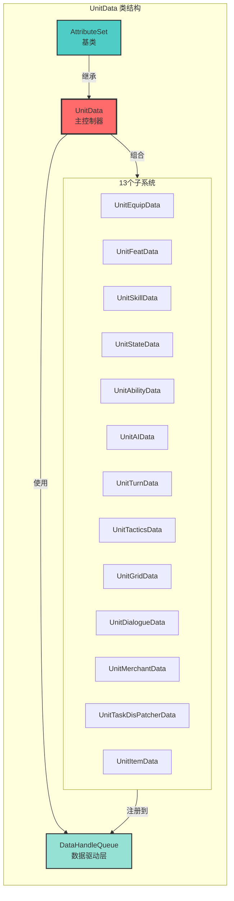
```mermaid
graph TB
    subgraph UnitData["UnitData 类结构"]
        direction TB
        Base[AttributeSet<br/>基类]
        Main[UnitData<br/>主控制器]
        
        Base -->|继承| Main
        
        subgraph SubSystems["13个子系统"]
            direction LR
            Equip[UnitEquipData]
            Feat[UnitFeatData]
            Skill[UnitSkillData]
            State[UnitStateData]
            Ability[UnitAbilityData]
            AI[UnitAIData]
            Turn[UnitTurnData]
            Tactics[UnitTacticsData]
            Grid[UnitGridData]
            Dialogue[UnitDialogueData]
            Merchant[UnitMerchantData]
            Task[UnitTaskDisPatcherData]
            Item[UnitItemData]
        end
        
        Main -->|组合| SubSystems
        Main -->|使用| Queue[DataHandleQueue<br/>数据驱动层]
        SubSystems -->|注册到| Queue
    end
    
    style Main fill:#ff6b6b,stroke:#333,stroke-width:3px
    style Base fill:#4ecdc4,stroke:#333,stroke-width:2px
    style Queue fill:#95e1d3,stroke:#333,stroke-width:2px
```

### 1.2 代码调用关系图

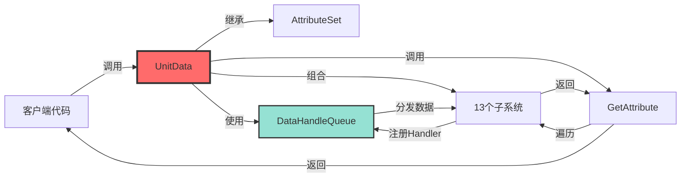
```mermaid
graph LR
    Client[客户端代码] -->|调用| UnitData[UnitData]
    UnitData -->|继承| AttributeSet[AttributeSet]
    UnitData -->|使用| Queue[DataHandleQueue]
    UnitData -->|组合| SubSystems[13个子系统]
    
    SubSystems -->|注册Handler| Queue
    Queue -->|分发数据| SubSystems
    
    UnitData -->|调用| GetAttr[GetAttribute]
    GetAttr -->|遍历| SubSystems
    SubSystems -->|返回| GetAttr
    GetAttr -->|返回| Client
    
    style UnitData fill:#ff6b6b,stroke:#333,stroke-width:3px
    style Queue fill:#95e1d3,stroke:#333,stroke-width:2px
```

---

## 2. UML图

### 2.1 类图（Class Diagram）

#### UnitData 类图

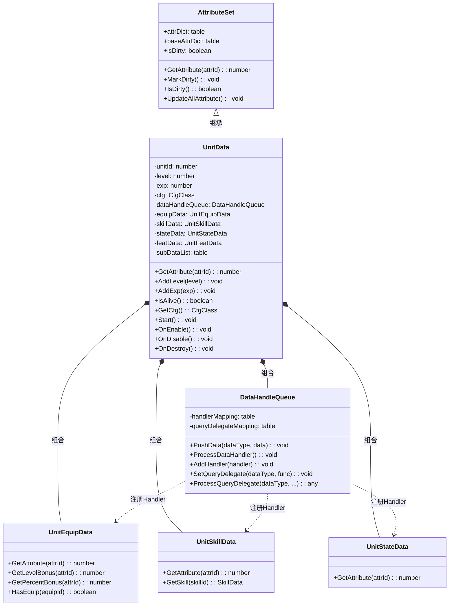
```mermaid
classDiagram
    class AttributeSet {
        +attrDict: table
        +baseAttrDict: table
        +isDirty: boolean
        +GetAttribute(attrId): number
        +MarkDirty(): void
        +IsDirty(): boolean
        +UpdateAllAttribute(): void
    }
    
    class UnitData {
        -unitId: number
        -level: number
        -exp: number
        -cfg: CfgClass
        -dataHandleQueue: DataHandleQueue
        -equipData: UnitEquipData
        -skillData: UnitSkillData
        -stateData: UnitStateData
        -featData: UnitFeatData
        -subDataList: table
        +GetAttribute(attrId): number
        +AddLevel(level): void
        +AddExp(exp): void
        +IsAlive(): boolean
        +GetCfg(): CfgClass
        +Start(): void
        +OnEnable(): void
        +OnDisable(): void
        +OnDestroy(): void
    }
    
    class DataHandleQueue {
        -handlerMapping: table
        -queryDelegateMapping: table
        +PushData(dataType, data): void
        +ProcessDataHandler(): void
        +AddHandler(handler): void
        +SetQueryDelegate(dataType, func): void
        +ProcessQueryDelegate(dataType, ...): any
    }
    
    class UnitEquipData {
        +GetAttribute(attrId): number
        +GetLevelBonus(attrId): number
        +GetPercentBonus(attrId): number
        +HasEquip(equipId): boolean
    }
    
    class UnitSkillData {
        +GetAttribute(attrId): number
        +GetSkill(skillId): SkillData
    }
    
    class UnitStateData {
        +GetAttribute(attrId): number
    }
    
    AttributeSet <|-- UnitData : 继承
    UnitData *-- DataHandleQueue : 组合
    UnitData *-- UnitEquipData : 组合
    UnitData *-- UnitSkillData : 组合
    UnitData *-- UnitStateData : 组合
    DataHandleQueue ..> UnitEquipData : 注册Handler
    DataHandleQueue ..> UnitSkillData : 注册Handler
    DataHandleQueue ..> UnitStateData : 注册Handler
```

### 2.2 组件图（Component Diagram）

#### TBBattle 系统组件图

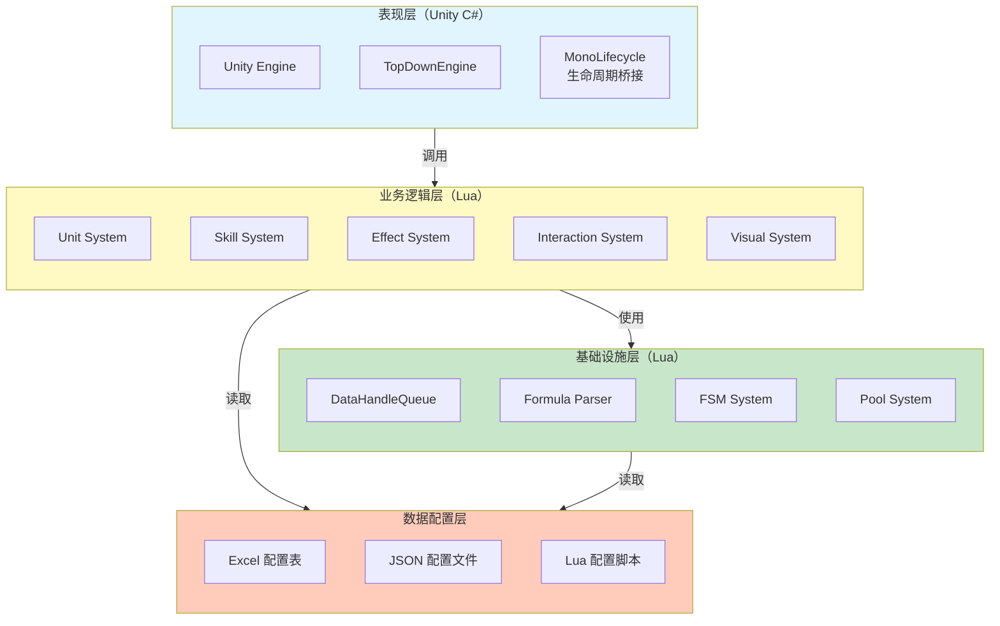
```mermaid
graph TB
    subgraph Presentation["表现层（Unity C#）"]
        direction TB
        Unity[Unity Engine]
        TopDown[TopDownEngine]
        MonoLifecycle[MonoLifecycle<br/>生命周期桥接]
    end
    
    subgraph Business["业务逻辑层（Lua）"]
        direction TB
        Unit[Unit System]
        Skill[Skill System]
        Effect[Effect System]
        Interaction[Interaction System]
        Visual[Visual System]
    end
    
    subgraph Infrastructure["基础设施层（Lua）"]
        direction TB
        Queue[DataHandleQueue]
        Formula[Formula Parser]
        FSM[FSM System]
        Pool[Pool System]
    end
    
    subgraph Data["数据配置层"]
        direction TB
        Excel[Excel 配置表]
        JSON[JSON 配置文件]
        LuaConfig[Lua 配置脚本]
    end
    
    Presentation -->|调用| Business
    Business -->|使用| Infrastructure
    Business -->|读取| Data
    Infrastructure -->|读取| Data
    
    style Presentation fill:#e1f5ff
    style Business fill:#fff9c4
    style Infrastructure fill:#c8e6c9
    style Data fill:#ffccbc
```

---

## 3. 包图

### 3.1 TBBattle 包结构图

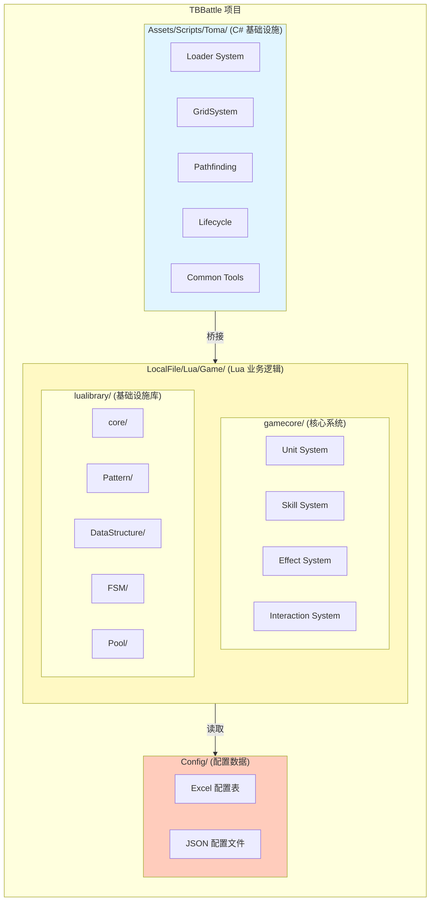
```mermaid
graph TB
    subgraph TBBattle["TBBattle 项目"]
        direction TB
        
        subgraph CSharp["Assets/Scripts/Toma/ (C# 基础设施)"]
            direction LR
            Loader[Loader System]
            GridSystem[GridSystem]
            Pathfinding[Pathfinding]
            Lifecycle[Lifecycle]
            Common[Common Tools]
        end
        
        subgraph Lua["LocalFile/Lua/Game/ (Lua 业务逻辑)"]
            direction TB
            
            subgraph Gamecore["gamecore/ (核心系统)"]
                direction LR
                Unit[Unit System]
                Skill[Skill System]
                Effect[Effect System]
                Interaction[Interaction System]
            end
            
            subgraph Library["lualibrary/ (基础设施库)"]
                direction LR
                Core[core/]
                Pattern[Pattern/]
                DataStructure[DataStructure/]
                FSM[FSM/]
                Pool[Pool/]
            end
        end
        
        subgraph Config["Config/ (配置数据)"]
            direction LR
            Excel[Excel 配置表]
            JSON[JSON 配置文件]
        end
    end
    
    CSharp -->|桥接| Lua
    Lua -->|读取| Config
    
    style CSharp fill:#e1f5ff
    style Lua fill:#fff9c4
    style Config fill:#ffccbc
```

### 3.2 Unit 系统包图

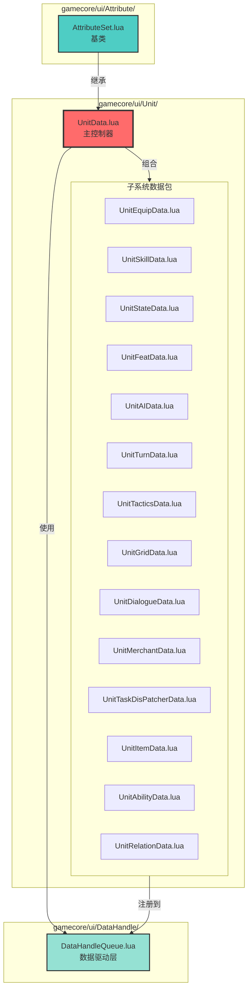
```mermaid
graph TB
    subgraph UnitPackage["gamecore/ui/Unit/"]
        direction TB
        
        UnitData[UnitData.lua<br/>主控制器]
        
        subgraph SubData["子系统数据包"]
            direction LR
            UnitEquipData[UnitEquipData.lua]
            UnitSkillData[UnitSkillData.lua]
            UnitStateData[UnitStateData.lua]
            UnitFeatData[UnitFeatData.lua]
            UnitAIData[UnitAIData.lua]
            UnitTurnData[UnitTurnData.lua]
            UnitTacticsData[UnitTacticsData.lua]
            UnitGridData[UnitGridData.lua]
            UnitDialogueData[UnitDialogueData.lua]
            UnitMerchantData[UnitMerchantData.lua]
            UnitTaskDisPatcherData[UnitTaskDisPatcherData.lua]
            UnitItemData[UnitItemData.lua]
            UnitAbilityData[UnitAbilityData.lua]
            UnitRelationData[UnitRelationData.lua]
        end
        
        UnitData -->|组合| SubData
    end
    
    subgraph AttributePackage["gamecore/ui/Attribute/"]
        AttributeSet[AttributeSet.lua<br/>基类]
    end
    
    subgraph QueuePackage["gamecore/ui/DataHandle/"]
        DataHandleQueue[DataHandleQueue.lua<br/>数据驱动层]
    end
    
    AttributeSet -->|继承| UnitData
    UnitData -->|使用| DataHandleQueue
    SubData -->|注册到| DataHandleQueue
    
    style UnitData fill:#ff6b6b,stroke:#333,stroke-width:3px
    style AttributeSet fill:#4ecdc4,stroke:#333,stroke-width:2px
    style DataHandleQueue fill:#95e1d3,stroke:#333,stroke-width:2px
```

---

## 4. 甘特图

### 4.1 软件架构设计过程甘特图

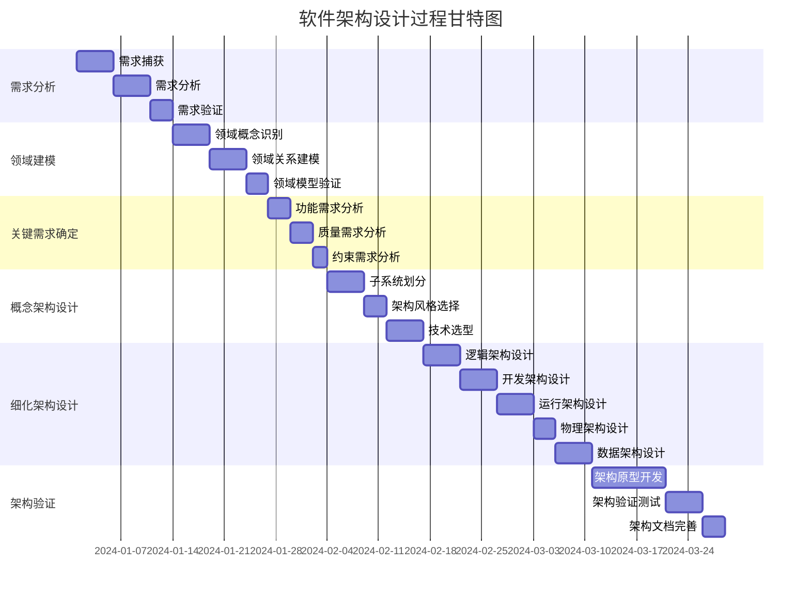
```mermaid
gantt
    title 软件架构设计过程甘特图
    dateFormat YYYY-MM-DD
    section 需求分析
    需求捕获           :a1, 2024-01-01, 5d
    需求分析           :a2, after a1, 5d
    需求验证           :a3, after a2, 3d
    
    section 领域建模
    领域概念识别       :b1, after a3, 5d
    领域关系建模       :b2, after b1, 5d
    领域模型验证       :b3, after b2, 3d
    
    section 关键需求确定
    功能需求分析       :c1, after b3, 3d
    质量需求分析       :c2, after c1, 3d
    约束需求分析       :c3, after c2, 2d
    
    section 概念架构设计
    子系统划分         :d1, after c3, 5d
    架构风格选择       :d2, after d1, 3d
    技术选型           :d3, after d2, 5d
    
    section 细化架构设计
    逻辑架构设计       :e1, after d3, 5d
    开发架构设计       :e2, after e1, 5d
    运行架构设计       :e3, after e2, 5d
    物理架构设计       :e4, after e3, 3d
    数据架构设计       :e5, after e4, 5d
    
    section 架构验证
    架构原型开发       :f1, after e5, 10d
    架构验证测试       :f2, after f1, 5d
    架构文档完善       :f3, after f2, 3d
```

### 4.2 UnitData 系统开发甘特图

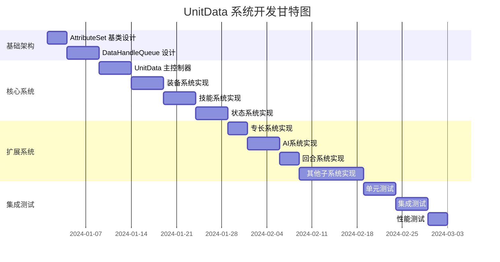
```mermaid
gantt
    title UnitData 系统开发甘特图
    dateFormat YYYY-MM-DD
    section 基础架构
    AttributeSet 基类设计    :a1, 2024-01-01, 3d
    DataHandleQueue 设计     :a2, after a1, 5d
    
    section 核心系统
    UnitData 主控制器        :b1, after a2, 5d
    装备系统实现            :b2, after b1, 5d
    技能系统实现            :b3, after b2, 5d
    状态系统实现            :b4, after b3, 5d
    
    section 扩展系统
    专长系统实现            :c1, after b4, 3d
    AI系统实现             :c2, after c1, 5d
    回合系统实现            :c3, after c2, 3d
    其他子系统实现          :c4, after c3, 10d
    
    section 集成测试
    单元测试               :d1, after c4, 5d
    集成测试               :d2, after d1, 5d
    性能测试               :d3, after d2, 3d
```

---

## 5. 时序图

### 5.1 UnitData 属性获取时序图

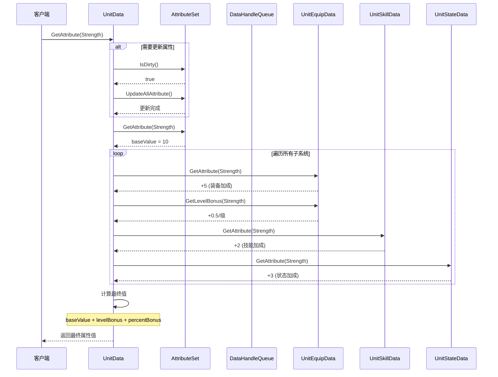
```mermaid
sequenceDiagram
    participant Client as 客户端
    participant UnitData as UnitData
    participant AttributeSet as AttributeSet
    participant Queue as DataHandleQueue
    participant EquipData as UnitEquipData
    participant SkillData as UnitSkillData
    participant StateData as UnitStateData
    
    Client->>UnitData: GetAttribute(Strength)
    
    alt 需要更新属性
        UnitData->>AttributeSet: IsDirty()
        AttributeSet-->>UnitData: true
        UnitData->>AttributeSet: UpdateAllAttribute()
        AttributeSet-->>UnitData: 更新完成
    end
    
    UnitData->>AttributeSet: GetAttribute(Strength)
    AttributeSet-->>UnitData: baseValue = 10
    
    loop 遍历所有子系统
        UnitData->>EquipData: GetAttribute(Strength)
        EquipData-->>UnitData: +5 (装备加成)
        
        UnitData->>EquipData: GetLevelBonus(Strength)
        EquipData-->>UnitData: +0.5/级
        
        UnitData->>SkillData: GetAttribute(Strength)
        SkillData-->>UnitData: +2 (技能加成)
        
        UnitData->>StateData: GetAttribute(Strength)
        StateData-->>UnitData: +3 (状态加成)
    end
    
    UnitData->>UnitData: 计算最终值
    Note over UnitData: baseValue + levelBonus + percentBonus
    UnitData-->>Client: 返回最终属性值
```

### 5.2 装备变更数据流时序图

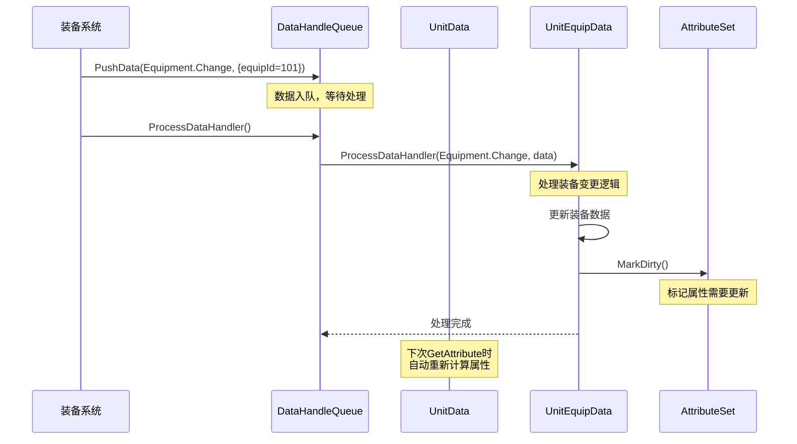
```mermaid
sequenceDiagram
    participant EquipSystem as 装备系统
    participant Queue as DataHandleQueue
    participant UnitData as UnitData
    participant EquipData as UnitEquipData
    participant AttributeSet as AttributeSet
    
    EquipSystem->>Queue: PushData(Equipment.Change, {equipId=101})
    Note over Queue: 数据入队，等待处理
    
    EquipSystem->>Queue: ProcessDataHandler()
    
    Queue->>EquipData: ProcessDataHandler(Equipment.Change, data)
    Note over EquipData: 处理装备变更逻辑
    
    EquipData->>EquipData: 更新装备数据
    EquipData->>AttributeSet: MarkDirty()
    Note over AttributeSet: 标记属性需要更新
    
    EquipData-->>Queue: 处理完成
    
    Note over UnitData: 下次GetAttribute时<br/>自动重新计算属性
```

### 5.3 UnitData 生命周期时序图

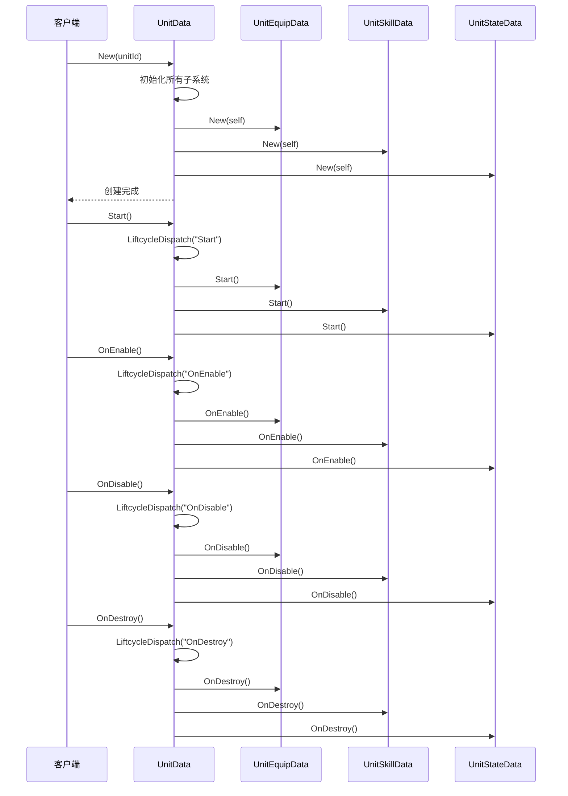
```mermaid
sequenceDiagram
    participant Client as 客户端
    participant UnitData as UnitData
    participant EquipData as UnitEquipData
    participant SkillData as UnitSkillData
    participant StateData as UnitStateData
    
    Client->>UnitData: New(unitId)
    UnitData->>UnitData: 初始化所有子系统
    UnitData->>EquipData: New(self)
    UnitData->>SkillData: New(self)
    UnitData->>StateData: New(self)
    UnitData-->>Client: 创建完成
    
    Client->>UnitData: Start()
    UnitData->>UnitData: LiftcycleDispatch("Start")
    UnitData->>EquipData: Start()
    UnitData->>SkillData: Start()
    UnitData->>StateData: Start()
    
    Client->>UnitData: OnEnable()
    UnitData->>UnitData: LiftcycleDispatch("OnEnable")
    UnitData->>EquipData: OnEnable()
    UnitData->>SkillData: OnEnable()
    UnitData->>StateData: OnEnable()
    
    Client->>UnitData: OnDisable()
    UnitData->>UnitData: LiftcycleDispatch("OnDisable")
    UnitData->>EquipData: OnDisable()
    UnitData->>SkillData: OnDisable()
    UnitData->>StateData: OnDisable()
    
    Client->>UnitData: OnDestroy()
    UnitData->>UnitData: LiftcycleDispatch("OnDestroy")
    UnitData->>EquipData: OnDestroy()
    UnitData->>SkillData: OnDestroy()
    UnitData->>StateData: OnDestroy()
```

---

## 6. 协作图

### 6.1 UnitData 系统协作图

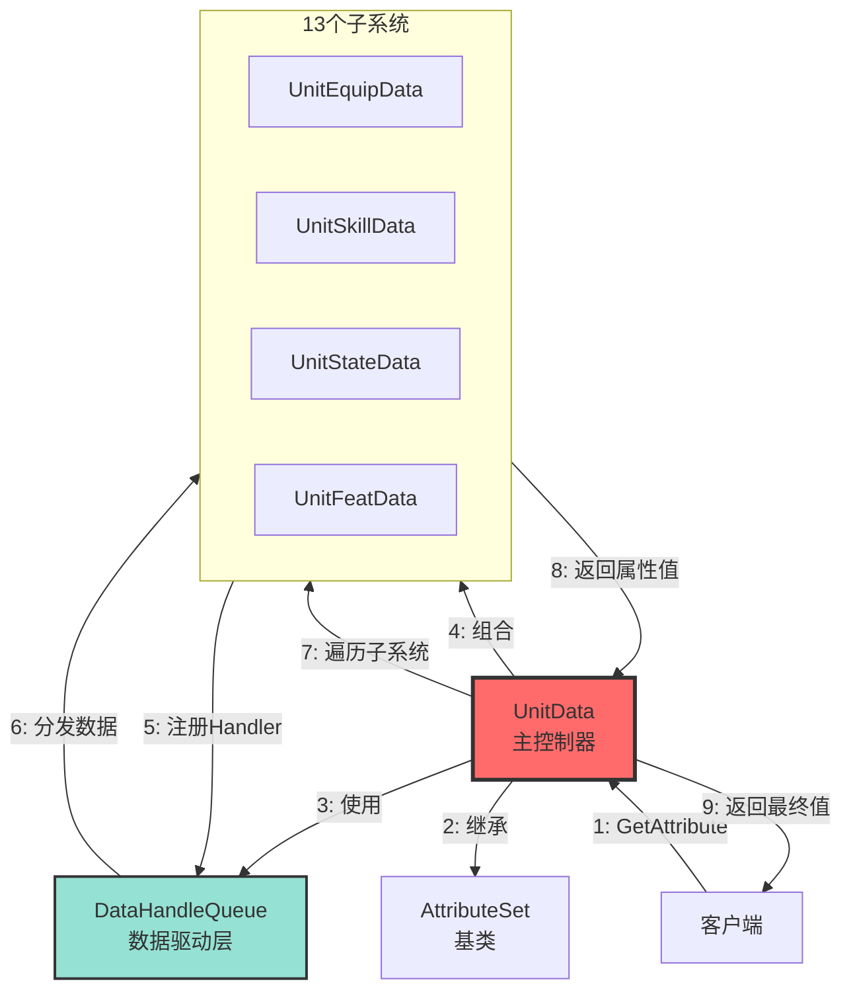
```mermaid
graph TB
    Client[客户端]
    UnitData[UnitData<br/>主控制器]
    AttributeSet[AttributeSet<br/>基类]
    Queue[DataHandleQueue<br/>数据驱动层]
    
    subgraph SubSystems["13个子系统"]
        EquipData[UnitEquipData]
        SkillData[UnitSkillData]
        StateData[UnitStateData]
        FeatData[UnitFeatData]
    end
    
    Client -->|1: GetAttribute| UnitData
    UnitData -->|2: 继承| AttributeSet
    UnitData -->|3: 使用| Queue
    UnitData -->|4: 组合| SubSystems
    
    SubSystems -->|5: 注册Handler| Queue
    Queue -->|6: 分发数据| SubSystems
    
    UnitData -->|7: 遍历子系统| SubSystems
    SubSystems -->|8: 返回属性值| UnitData
    UnitData -->|9: 返回最终值| Client
    
    style UnitData fill:#ff6b6b,stroke:#333,stroke-width:3px
    style Queue fill:#95e1d3,stroke:#333,stroke-width:2px
```

### 6.2 数据驱动架构协作图

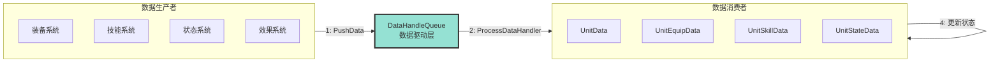
```mermaid
graph LR
    subgraph Producers["数据生产者"]
        EquipSystem[装备系统]
        SkillSystem[技能系统]
        StateSystem[状态系统]
        EffectSystem[效果系统]
    end
    
    Queue[DataHandleQueue<br/>数据驱动层]
    
    subgraph Consumers["数据消费者"]
        UnitData[UnitData]
        EquipData[UnitEquipData]
        SkillData[UnitSkillData]
        StateData[UnitStateData]
    end
    
    Producers -->|1: PushData| Queue
    Queue -->|2: ProcessDataHandler| Consumers
    Consumers -->|3: 处理数据| Consumers
    Consumers -->|4: 更新状态| Consumers
    
    style Queue fill:#95e1d3,stroke:#333,stroke-width:3px
```

---

## 7. 状态图

### 7.1 UnitData 生命周期状态图

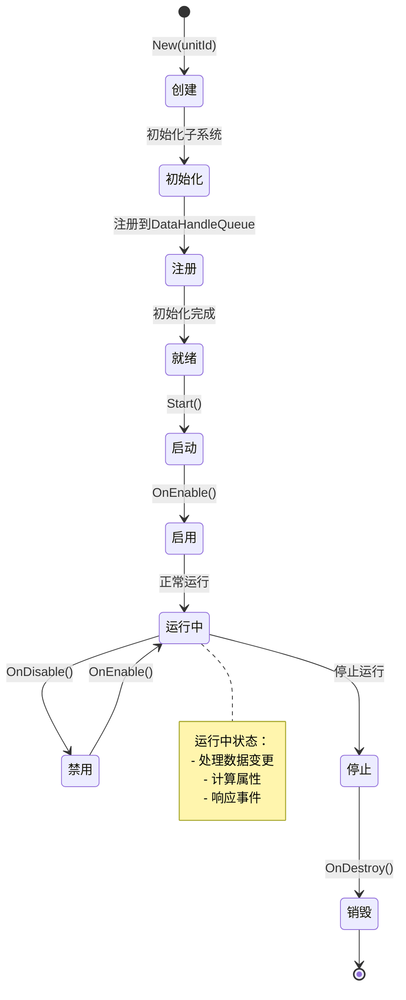
```mermaid
stateDiagram-v2
    [*] --> 创建: New(unitId)
    创建 --> 初始化: 初始化子系统
    初始化 --> 注册: 注册到DataHandleQueue
    注册 --> 就绪: 初始化完成
    
    就绪 --> 启动: Start()
    启动 --> 启用: OnEnable()
    启用 --> 运行中: 正常运行
    
    运行中 --> 禁用: OnDisable()
    禁用 --> 运行中: OnEnable()
    
    运行中 --> 停止: 停止运行
    停止 --> 销毁: OnDestroy()
    销毁 --> [*]
    
    note right of 运行中
        运行中状态：
        - 处理数据变更
        - 计算属性
        - 响应事件
    end note
```

### 7.2 属性计算状态图

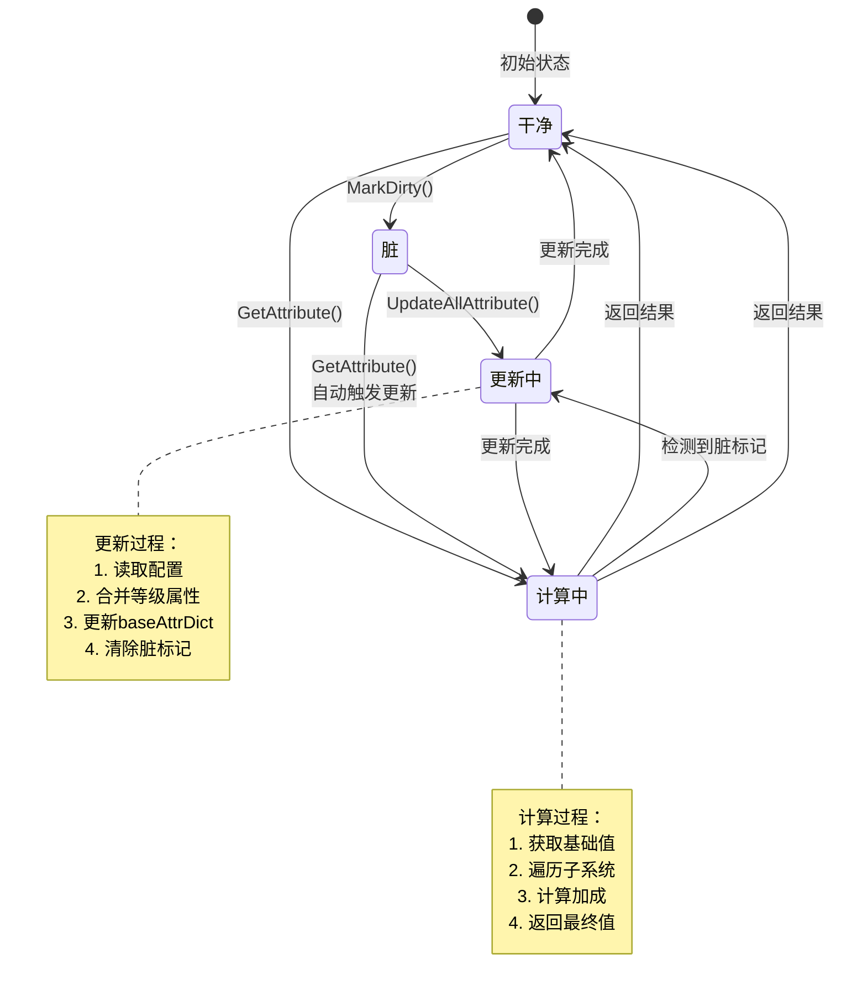
```mermaid
stateDiagram-v2
    [*] --> 干净: 初始状态
    干净 --> 脏: MarkDirty()
    脏 --> 更新中: UpdateAllAttribute()
    更新中 --> 干净: 更新完成
    
    干净 --> 计算中: GetAttribute()
    计算中 --> 干净: 返回结果
    
    脏 --> 计算中: GetAttribute()<br/>自动触发更新
    计算中 --> 更新中: 检测到脏标记
    更新中 --> 计算中: 更新完成
    计算中 --> 干净: 返回结果
    
    note right of 更新中
        更新过程：
        1. 读取配置
        2. 合并等级属性
        3. 更新baseAttrDict
        4. 清除脏标记
    end note
    
    note right of 计算中
        计算过程：
        1. 获取基础值
        2. 遍历子系统
        3. 计算加成
        4. 返回最终值
    end note
```

### 7.3 数据流处理状态图

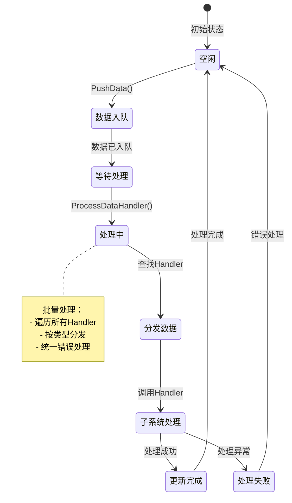
```mermaid
stateDiagram-v2
    [*] --> 空闲: 初始状态
    空闲 --> 数据入队: PushData()
    数据入队 --> 等待处理: 数据已入队
    
    等待处理 --> 处理中: ProcessDataHandler()
    处理中 --> 分发数据: 查找Handler
    分发数据 --> 子系统处理: 调用Handler
    
    子系统处理 --> 更新完成: 处理成功
    子系统处理 --> 处理失败: 处理异常
    
    更新完成 --> 空闲: 处理完成
    处理失败 --> 空闲: 错误处理
    
    note right of 处理中
        批量处理：
        - 遍历所有Handler
        - 按类型分发
        - 统一错误处理
    end note
```

---

## 8. 其他常用图表

### 8.1 流程图（Flowchart）

#### 属性计算流程图

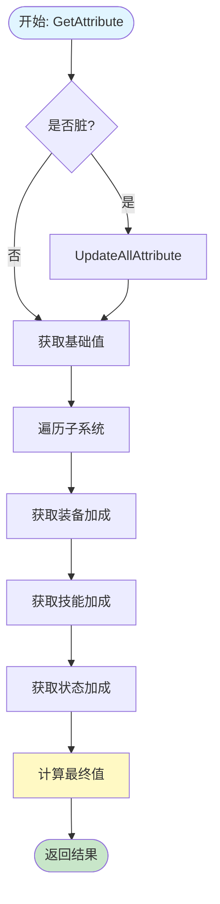
```mermaid
flowchart TD
    Start([开始: GetAttribute]) --> CheckDirty{是否脏?}
    CheckDirty -->|是| Update[UpdateAllAttribute]
    CheckDirty -->|否| GetBase[获取基础值]
    Update --> GetBase
    GetBase --> Loop[遍历子系统]
    Loop --> Equip[获取装备加成]
    Equip --> Skill[获取技能加成]
    Skill --> State[获取状态加成]
    State --> Calc[计算最终值]
    Calc --> Return([返回结果])
    
    style Start fill:#e1f5ff
    style Return fill:#c8e6c9
    style Calc fill:#fff9c4
```

### 8.2 饼图（Pie Chart）

#### 子系统复杂度分布

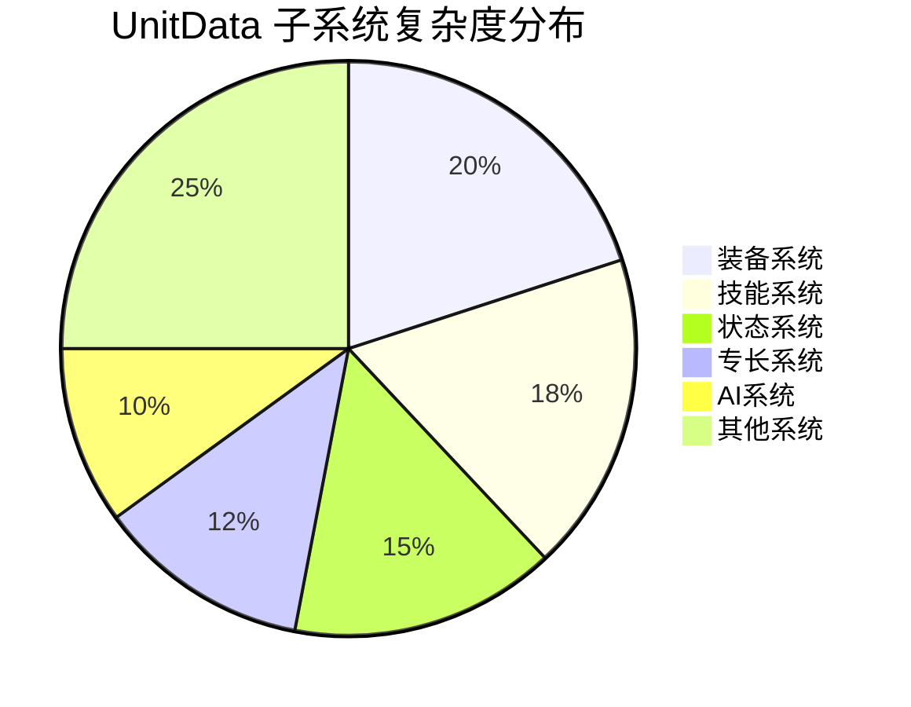
```mermaid
pie title UnitData 子系统复杂度分布
    "装备系统" : 20
    "技能系统" : 18
    "状态系统" : 15
    "专长系统" : 12
    "AI系统" : 10
    "其他系统" : 25
```

#### 架构视图关注度分布

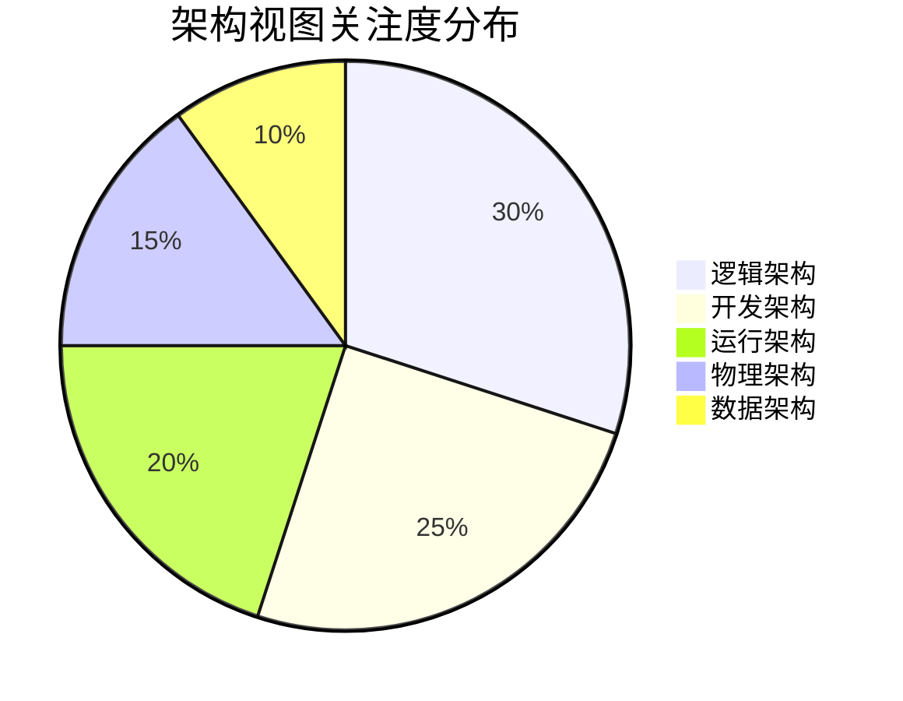
```mermaid
pie title 架构视图关注度分布
    "逻辑架构" : 30
    "开发架构" : 25
    "运行架构" : 20
    "物理架构" : 15
    "数据架构" : 10
```

### 8.3 实体关系图（ER Diagram）

#### UnitData 数据模型关系图

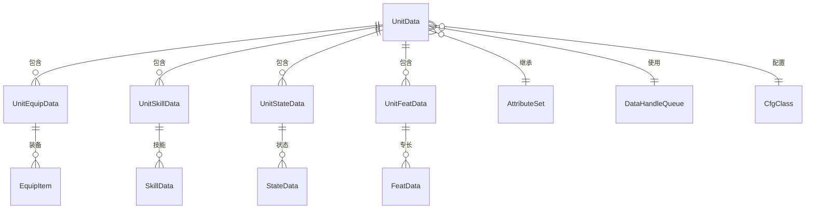
```mermaid
erDiagram
    UnitData ||--o{ UnitEquipData : "包含"
    UnitData ||--o{ UnitSkillData : "包含"
    UnitData ||--o{ UnitStateData : "包含"
    UnitData ||--o{ UnitFeatData : "包含"
    UnitData }o--|| AttributeSet : "继承"
    UnitData }o--|| DataHandleQueue : "使用"
    UnitData }o--|| CfgClass : "配置"
    
    UnitEquipData ||--o{ EquipItem : "装备"
    UnitSkillData ||--o{ SkillData : "技能"
    UnitStateData ||--o{ StateData : "状态"
    UnitFeatData ||--o{ FeatData : "专长"
```

### 8.4 用户旅程图（User Journey）

#### 架构设计过程用户旅程

```mermaid
journey
    title 软件架构设计过程用户旅程
    section 需求分析
      需求捕获: 5: 架构师, 业务人员
      需求分析: 4: 架构师
      需求验证: 3: 架构师, 业务人员
    section 领域建模
      领域概念识别: 5: 架构师, 领域专家
      领域关系建模: 4: 架构师
      领域模型验证: 3: 架构师, 领域专家
    section 架构设计
      概念架构设计: 5: 架构师
      细化架构设计: 4: 架构师, 开发人员
      架构验证: 3: 架构师, 测试人员
```

### 8.5 Git 图（Gitgraph）

#### 架构设计版本演进

```mermaid
gitgraph
    commit id: "初始架构"
    commit id: "添加Unit系统"
    branch feature-skill
    checkout feature-skill
    commit id: "实现技能系统"
    checkout main
    commit id: "添加Effect系统"
    merge feature-skill
    commit id: "集成测试"
    branch feature-interaction
    checkout feature-interaction
    commit id: "实现交互系统"
    checkout main
    commit id: "性能优化"
    merge feature-interaction
    commit id: "架构稳定"
```

### 8.6 象限图（Quadrant Chart）

#### 系统复杂度 vs 重要性分析

```mermaid
quadrantChart
    title 系统复杂度 vs 重要性分析
    x-axis 低复杂度 --> 高复杂度
    y-axis 低重要性 --> 高重要性
    quadrant-1 高优先级
    quadrant-2 优化重点
    quadrant-3 低优先级
    quadrant-4 简化目标
    Unit系统: [0.8, 0.9]
    Skill系统: [0.7, 0.8]
    Effect系统: [0.6, 0.7]
    Interaction系统: [0.5, 0.6]
    Visual系统: [0.4, 0.5]
```

### 8.7 需求矩阵图（Requirement Matrix）

#### 需求优先级矩阵

```mermaid
graph TB
    subgraph High["高优先级需求"]
        direction LR
        H1[功能需求1]
        H2[功能需求2]
        H3[质量需求1]
    end
    
    subgraph Medium["中优先级需求"]
        direction LR
        M1[功能需求3]
        M2[质量需求2]
        M3[约束需求1]
    end
    
    subgraph Low["低优先级需求"]
        direction LR
        L1[功能需求4]
        L2[质量需求3]
    end
    
    High --> Medium
    Medium --> Low
```

---

## 📊 图表使用说明

### 图表类型说明

| 图表类型 | 用途 | 适用场景 |
|---------|------|---------|
| **代码图** | 展示代码结构和调用关系 | 代码审查、架构理解 |
| **UML类图** | 展示类的结构和关系 | 设计文档、代码生成 |
| **UML组件图** | 展示系统组件和依赖 | 系统架构设计 |
| **包图** | 展示包结构和组织 | 代码组织、模块划分 |
| **甘特图** | 展示项目进度和时间安排 | 项目管理、进度跟踪 |
| **时序图** | 展示对象间的交互时序 | 流程分析、接口设计 |
| **协作图** | 展示对象间的协作关系 | 系统交互、依赖分析 |
| **状态图** | 展示对象的状态转换 | 状态机设计、生命周期 |
| **流程图** | 展示业务流程和决策流程 | 业务分析、流程设计 |
| **饼图** | 展示数据分布和比例 | 数据分析、统计展示 |
| **实体关系图** | 展示数据模型关系 | 数据库设计、数据建模 |
| **用户旅程图** | 展示用户体验流程 | 用户体验设计、流程分析 |
| **Git图** | 展示版本演进历史 | 版本管理、开发历史 |
| **象限图** | 展示二维数据分析 | 优先级分析、决策支持 |

### 图表生成工具

- **Mermaid**：支持多种图表类型，易于维护
- **PlantUML**：专业的UML工具，功能强大
- **Draw.io**：可视化编辑器，适合复杂图表

### 图表维护建议

1. **保持同步**：代码变更时及时更新图表
2. **版本控制**：图表文件纳入版本管理
3. **定期审查**：定期检查图表的准确性
4. **文档化**：为图表添加必要的说明和注释

---

## 📚 相关参考

- [软件架构设计（温昱）](./软件架构设计(温昱%20).md)
- [分层架构模式](./架构模式/分层架构模式.md)
- [消息总线架构模式](./架构模式/消息总线架构模式.md)
- [TBBattle 项目框架说明](../../../TBBattle/LocalFile/tbbattle-code-formwork.mdc)

---

**最后更新**：2025-01-27  
**维护者**：AI Assistant

