# CQRS架构模式（Command Query Responsibility Segregation Pattern）

## 目录

- [概述](#概述)
- [核心概念](#核心概念)
- [架构结构](#架构结构)
- [设计规则](#设计规则)
- [优缺点分析](#优缺点分析)
- [实践指南](#实践指南)
- [与其他架构模式的关系](#与其他架构模式的关系)
- [应用场景](#应用场景)
- [实际案例](#实际案例)
- [设计原则](#设计原则)
- [总结](#总结)

---

## 概述

**CQRS架构模式（Command Query Responsibility Segregation Pattern）**，即**命令查询职责分离模式**，是由Greg Young提出的一种架构模式。它将系统的读写操作分离，使用不同的模型来处理命令（写操作）和查询（读操作），从而优化性能和可扩展性。

### 什么是CQRS？

CQRS将系统的读写操作完全分离：

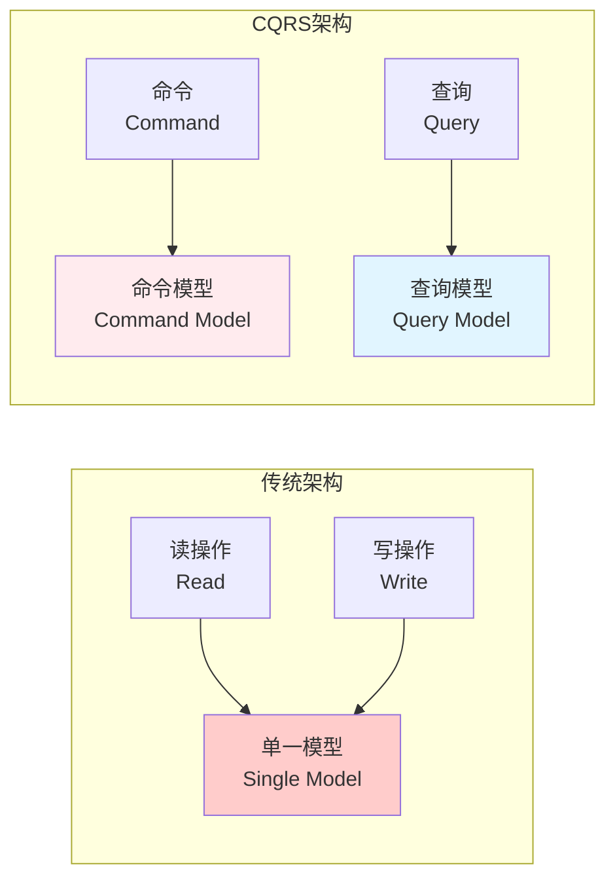
```mermaid
graph LR
    subgraph "传统架构"
        SingleModel[单一模型<br/>Single Model]
        Read[读操作<br/>Read]
        Write[写操作<br/>Write]
        
        Read --> SingleModel
        Write --> SingleModel
    end
    
    subgraph "CQRS架构"
        CommandModel[命令模型<br/>Command Model]
        QueryModel[查询模型<br/>Query Model]
        Command[命令<br/>Command]
        Query[查询<br/>Query]
        
        Command --> CommandModel
        Query --> QueryModel
    end
    
    style SingleModel fill:#ffcccb
    style CommandModel fill:#ffebee
    style QueryModel fill:#e1f5ff
```

**核心原则**：
- **读写分离**：命令和查询使用不同的模型
- **独立优化**：读写可以独立优化
- **独立扩展**：读写可以独立扩展
- **最终一致性**：读写模型可以最终一致

### 为什么需要CQRS？

CQRS解决了以下问题：
- **性能优化**：读写可以独立优化，查询可以高度优化
- **可扩展性**：读写可以独立扩展，查询可以水平扩展
- **复杂度管理**：读写模型可以有不同的复杂度
- **安全性**：读写可以有不同的安全策略
- **灵活性**：可以针对不同场景优化不同模型

---

## 核心概念

### 核心思想

CQRS的核心思想是**职责分离（Separation of Concerns）**：

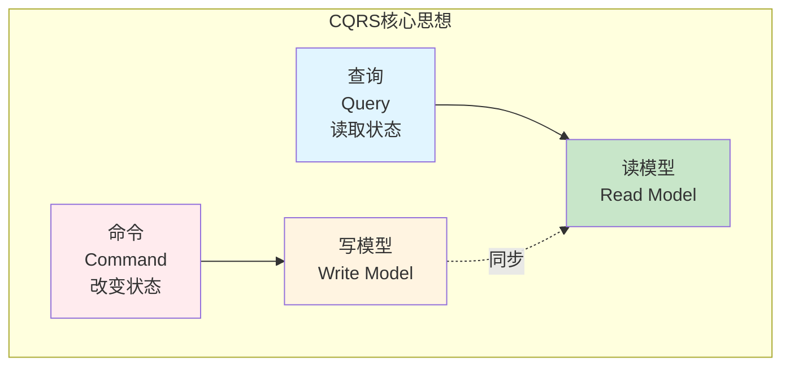
```mermaid
graph TB
    subgraph "CQRS核心思想"
        Command[命令<br/>Command<br/>改变状态]
        Query[查询<br/>Query<br/>读取状态]
        
        Command --> WriteModel[写模型<br/>Write Model]
        Query --> ReadModel[读模型<br/>Read Model]
        
        WriteModel -.同步.-> ReadModel
    end
    
    style Command fill:#ffebee
    style Query fill:#e1f5ff
    style WriteModel fill:#fff4e1
    style ReadModel fill:#c8e6c9
```

**关键原则**：
1. **命令和查询分离**：命令改变状态，查询读取状态
2. **不同模型**：命令和查询使用不同的模型
3. **独立优化**：读写可以独立优化
4. **最终一致性**：读写模型可以最终一致

### 基本特征

- **读写分离**：命令和查询完全分离
- **不同模型**：读写使用不同的数据模型
- **独立优化**：读写可以独立优化
- **独立扩展**：读写可以独立扩展
- **最终一致性**：读写模型可以最终一致

---

## 架构结构

### CQRS完整架构

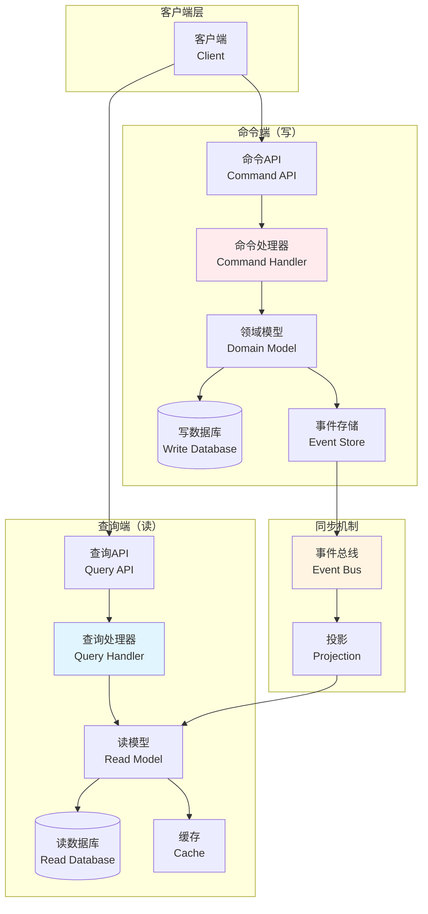
```mermaid
graph TB
    subgraph "客户端层"
        Client[客户端<br/>Client]
    end
    
    subgraph "命令端（写）"
        CommandAPI[命令API<br/>Command API]
        CommandHandler[命令处理器<br/>Command Handler]
        DomainModel[领域模型<br/>Domain Model]
        WriteDB[(写数据库<br/>Write Database)]
        EventStore[事件存储<br/>Event Store]
    end
    
    subgraph "查询端（读）"
        QueryAPI[查询API<br/>Query API]
        QueryHandler[查询处理器<br/>Query Handler]
        ReadModel[读模型<br/>Read Model]
        ReadDB[(读数据库<br/>Read Database)]
        Cache[缓存<br/>Cache]
    end
    
    subgraph "同步机制"
        EventBus[事件总线<br/>Event Bus]
        Projection[投影<br/>Projection]
    end
    
    Client --> CommandAPI
    Client --> QueryAPI
    
    CommandAPI --> CommandHandler
    CommandHandler --> DomainModel
    DomainModel --> WriteDB
    DomainModel --> EventStore
    
    QueryAPI --> QueryHandler
    QueryHandler --> ReadModel
    ReadModel --> ReadDB
    ReadModel --> Cache
    
    EventStore --> EventBus
    EventBus --> Projection
    Projection --> ReadModel
    
    style CommandHandler fill:#ffebee
    style QueryHandler fill:#e1f5ff
    style EventBus fill:#fff4e1
```

### 核心组件详解

#### 1. 命令（Command）

**定义**：表示改变系统状态的意图

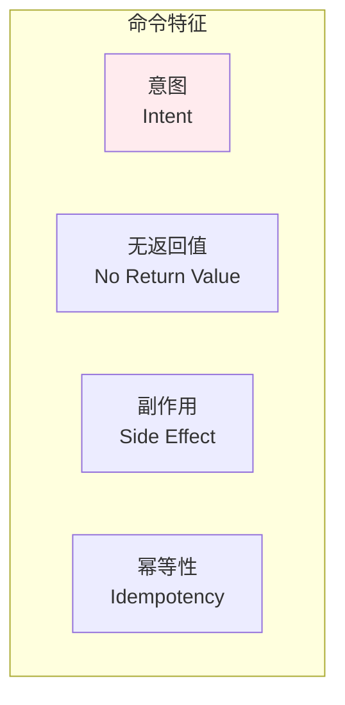
```mermaid
graph TB
    subgraph "命令特征"
        Intent[意图<br/>Intent]
        NoReturn[无返回值<br/>No Return Value]
        SideEffect[副作用<br/>Side Effect]
        Idempotent[幂等性<br/>Idempotency]
    end
    
    style Intent fill:#ffebee
```

**特点**：
- 表示改变状态的意图
- 通常无返回值（或返回结果）
- 有副作用（改变状态）
- 应该支持幂等性

**示例**：
- CreateOrder（创建订单）
- UpdateOrder（更新订单）
- CancelOrder（取消订单）

#### 2. 查询（Query）

**定义**：表示读取系统状态的请求

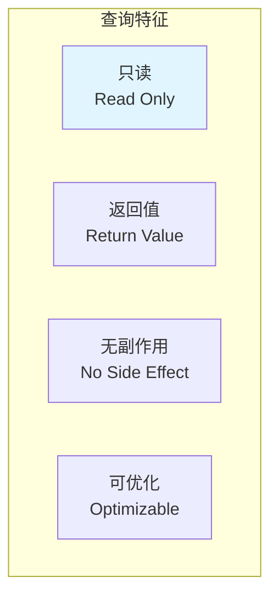
```mermaid
graph TB
    subgraph "查询特征"
        ReadOnly[只读<br/>Read Only]
        ReturnValue[返回值<br/>Return Value]
        NoSideEffect[无副作用<br/>No Side Effect]
        Optimized[可优化<br/>Optimizable]
    end
    
    style ReadOnly fill:#e1f5ff
```

**特点**：
- 只读取状态，不改变状态
- 有返回值
- 无副作用
- 可以高度优化

**示例**：
- GetOrder（获取订单）
- ListOrders（列出订单）
- GetOrderStatistics（获取订单统计）

#### 3. 命令模型（Command Model）

**定义**：用于处理命令的领域模型

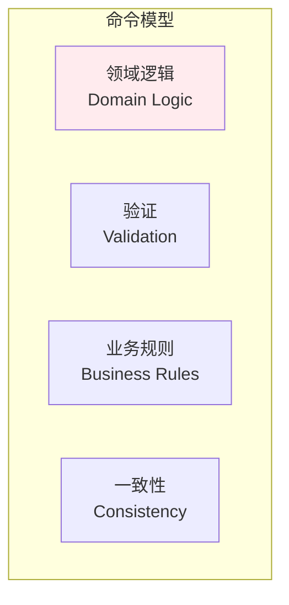
```mermaid
graph TB
    subgraph "命令模型"
        DomainLogic[领域逻辑<br/>Domain Logic]
        Validation[验证<br/>Validation]
        BusinessRules[业务规则<br/>Business Rules]
        Consistency[一致性<br/>Consistency]
    end
    
    style DomainLogic fill:#ffebee
```

**特点**：
- 包含完整的领域逻辑
- 保证数据一致性
- 验证业务规则
- 可以复杂

#### 4. 查询模型（Query Model）

**定义**：用于处理查询的优化模型

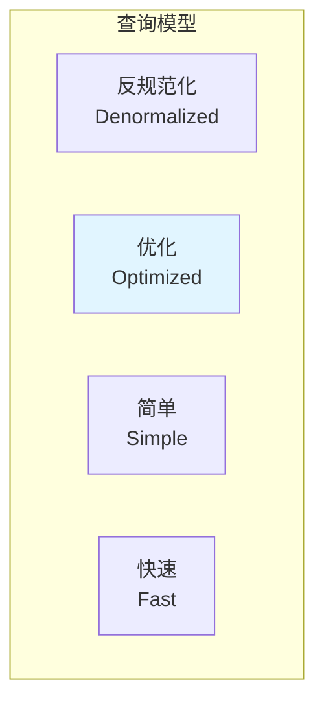
```mermaid
graph TB
    subgraph "查询模型"
        Denormalized[反规范化<br/>Denormalized]
        Optimized[优化<br/>Optimized]
        Simple[简单<br/>Simple]
        Fast[快速<br/>Fast]
    end
    
    style Optimized fill:#e1f5ff
```

**特点**：
- 可以反规范化
- 高度优化
- 结构简单
- 查询快速

#### 5. 事件总线（Event Bus）

**定义**：同步读写模型的机制

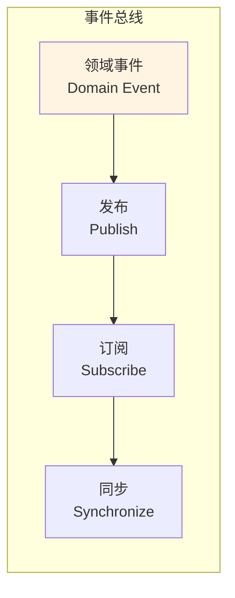
```mermaid
graph LR
    subgraph "事件总线"
        Event[领域事件<br/>Domain Event]
        Publish[发布<br/>Publish]
        Subscribe[订阅<br/>Subscribe]
        Sync[同步<br/>Synchronize]
    end
    
    Event --> Publish
    Publish --> Subscribe
    Subscribe --> Sync
    
    style Event fill:#fff4e1
```

**职责**：
- 发布领域事件
- 订阅事件
- 同步读写模型
- 保证最终一致性

#### 6. 投影（Projection）

**定义**：将命令模型的事件投影到查询模型

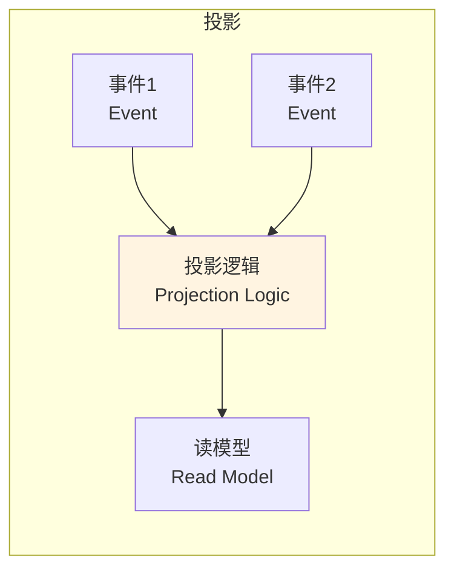
```mermaid
graph LR
    subgraph "投影"
        Event1[事件1<br/>Event]
        Event2[事件2<br/>Event]
        Projection[投影逻辑<br/>Projection Logic]
        ReadModel[读模型<br/>Read Model]
        
        Event1 --> Projection
        Event2 --> Projection
        Projection --> ReadModel
    end
    
    style Projection fill:#fff4e1
```

**职责**：
- 监听领域事件
- 更新查询模型
- 保持读写模型同步
- 处理事件重放

---

## 设计规则

### 读写分离规则

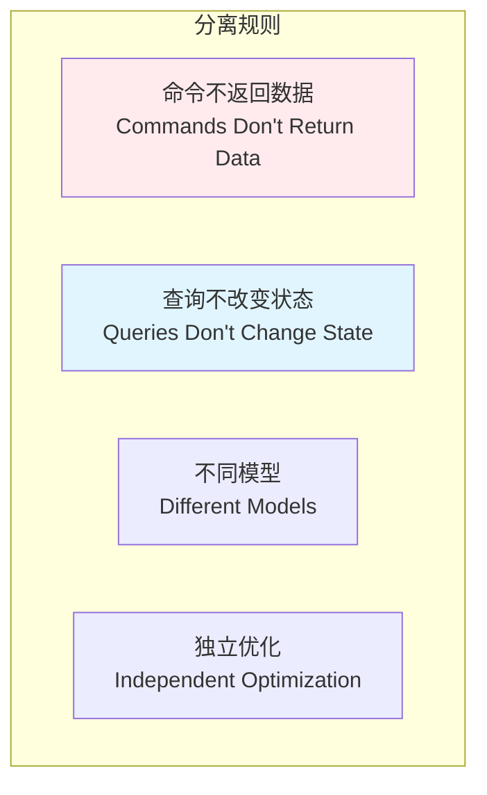
```mermaid
graph TB
    subgraph "分离规则"
        Rule1[命令不返回数据<br/>Commands Don't Return Data]
        Rule2[查询不改变状态<br/>Queries Don't Change State]
        Rule3[不同模型<br/>Different Models]
        Rule4[独立优化<br/>Independent Optimization]
    end
    
    style Rule1 fill:#ffebee
    style Rule2 fill:#e1f5ff
```

**规则说明**：
- ✅ **命令不返回数据**：命令只返回成功/失败，不返回数据
- ✅ **查询不改变状态**：查询只读取数据，不改变状态
- ✅ **不同模型**：命令和查询使用不同的数据模型
- ✅ **独立优化**：读写可以独立优化

### 一致性规则

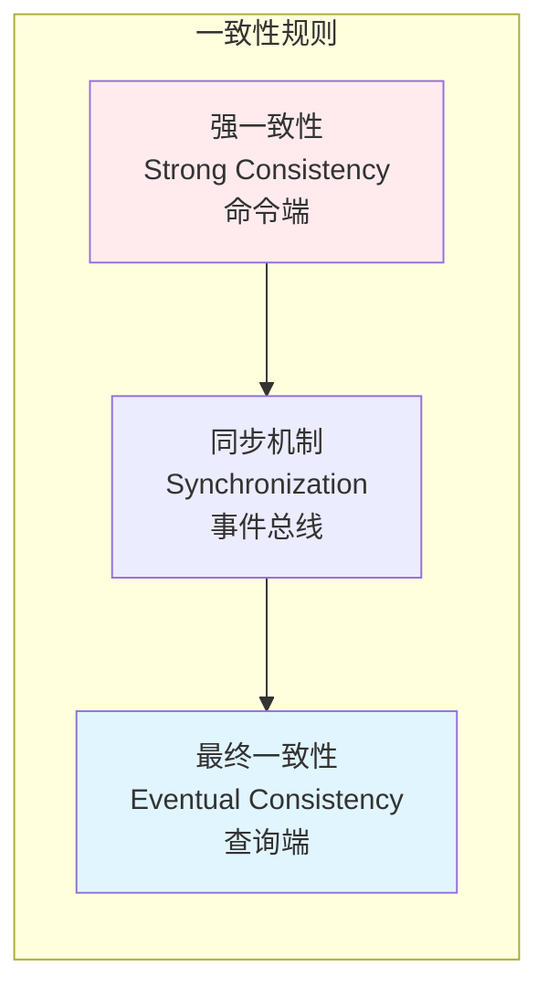
```mermaid
graph LR
    subgraph "一致性规则"
        Strong[强一致性<br/>Strong Consistency<br/>命令端]
        Eventual[最终一致性<br/>Eventual Consistency<br/>查询端]
        Sync[同步机制<br/>Synchronization<br/>事件总线]
    end
    
    Strong --> Sync
    Sync --> Eventual
    
    style Strong fill:#ffebee
    style Eventual fill:#e1f5ff
```

**规则说明**：
- ✅ **命令端强一致性**：写操作保证强一致性
- ✅ **查询端最终一致性**：读操作可以最终一致
- ✅ **同步机制**：通过事件总线同步

---

## 优缺点分析

### 优点

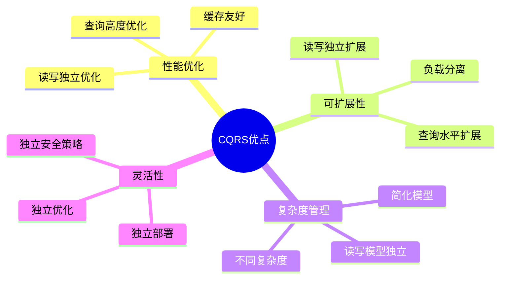
```mermaid
mindmap
  root((CQRS优点))
    性能优化
      读写独立优化
      查询高度优化
      缓存友好
    可扩展性
      读写独立扩展
      查询水平扩展
      负载分离
    复杂度管理
      读写模型独立
      不同复杂度
      简化模型
    灵活性
      独立优化
      独立部署
      独立安全策略
```

**详细说明**：
- ✅ **性能优化**：读写可以独立优化，查询可以高度优化
- ✅ **可扩展性**：读写可以独立扩展，查询可以水平扩展
- ✅ **复杂度管理**：读写模型可以有不同的复杂度
- ✅ **灵活性**：可以针对不同场景优化不同模型
- ✅ **安全性**：读写可以有不同的安全策略

### 缺点

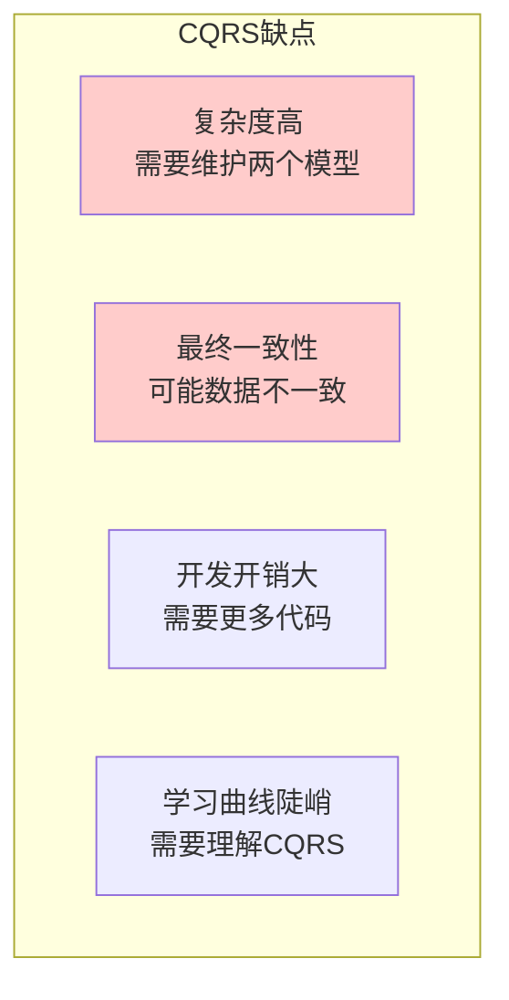
```mermaid
graph TB
    subgraph "CQRS缺点"
        Complexity[复杂度高<br/>需要维护两个模型]
        Consistency[最终一致性<br/>可能数据不一致]
        Overhead[开发开销大<br/>需要更多代码]
        Learning[学习曲线陡峭<br/>需要理解CQRS]
    end
    
    style Complexity fill:#ffcccb
    style Consistency fill:#ffcccb
```

**详细说明**：
- ❌ **复杂度高**：需要维护两个模型和同步机制
- ❌ **最终一致性**：查询端可能数据不一致
- ❌ **开发开销大**：需要更多代码和基础设施
- ❌ **学习曲线陡峭**：需要理解CQRS概念
- ❌ **可能过度设计**：简单系统可能不需要CQRS

---

## 实践指南

### CQRS实施步骤

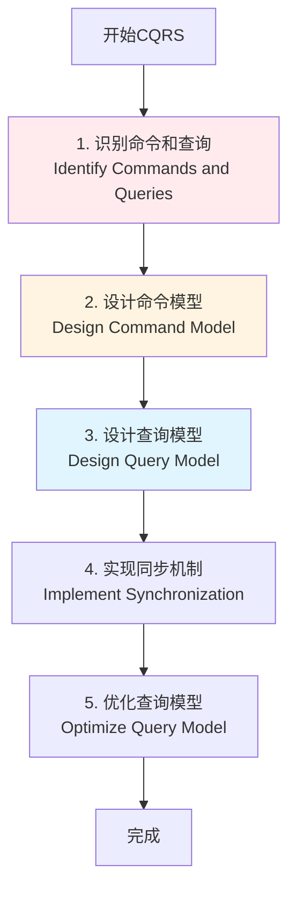
```mermaid
graph TD
    Start[开始CQRS] --> Step1[1. 识别命令和查询<br/>Identify Commands and Queries]
    Step1 --> Step2[2. 设计命令模型<br/>Design Command Model]
    Step2 --> Step3[3. 设计查询模型<br/>Design Query Model]
    Step3 --> Step4[4. 实现同步机制<br/>Implement Synchronization]
    Step4 --> Step5[5. 优化查询模型<br/>Optimize Query Model]
    Step5 --> End[完成]
    
    style Step1 fill:#ffebee
    style Step2 fill:#fff4e1
    style Step3 fill:#e1f5ff
```

### 何时使用CQRS

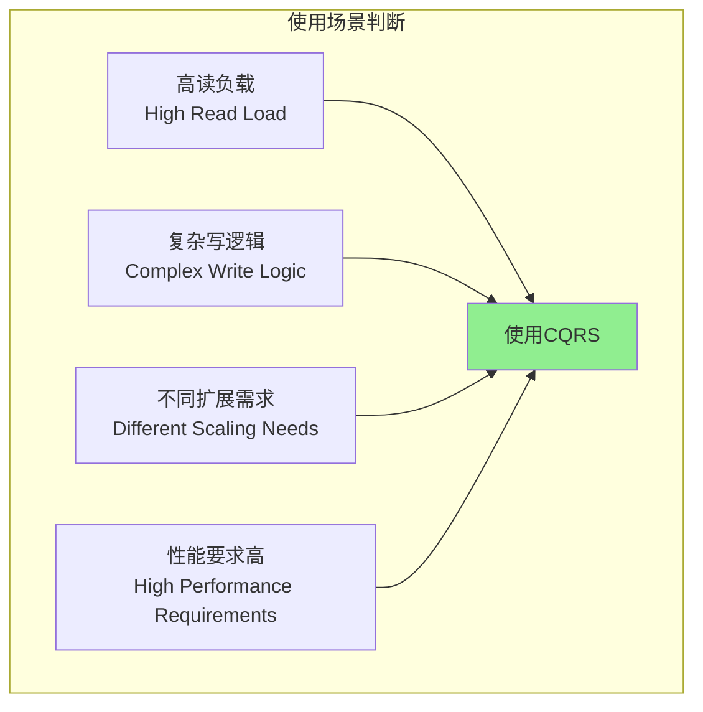
```mermaid
graph TB
    subgraph "使用场景判断"
        HighRead[高读负载<br/>High Read Load]
        ComplexWrite[复杂写逻辑<br/>Complex Write Logic]
        DifferentScale[不同扩展需求<br/>Different Scaling Needs]
        Performance[性能要求高<br/>High Performance Requirements]
        
        HighRead --> UseCQRS[使用CQRS]
        ComplexWrite --> UseCQRS
        DifferentScale --> UseCQRS
        Performance --> UseCQRS
    end
    
    style UseCQRS fill:#90ee90
```

**使用建议**：
- ✅ **高读负载**：读操作远多于写操作
- ✅ **复杂写逻辑**：写操作逻辑复杂
- ✅ **不同扩展需求**：读写需要不同的扩展策略
- ✅ **性能要求高**：需要高度优化的查询性能

---

## 与其他架构模式的关系

### CQRS与其他架构的关系

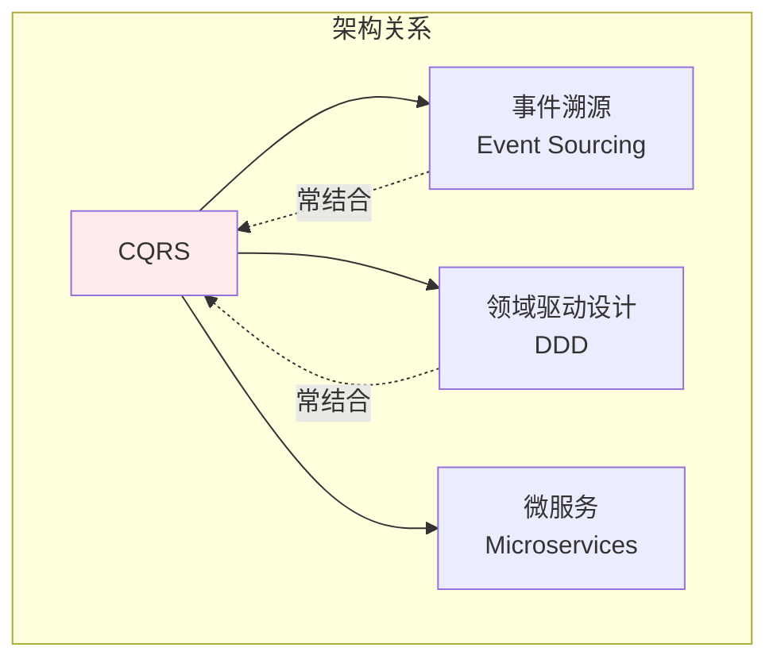
```mermaid
graph TB
    subgraph "架构关系"
        CQRS[CQRS]
        ES[事件溯源<br/>Event Sourcing]
        DDD[领域驱动设计<br/>DDD]
        Micro[微服务<br/>Microservices]
        
        CQRS --> ES
        CQRS --> DDD
        CQRS --> Micro
        
        ES -.常结合.-> CQRS
        DDD -.常结合.-> CQRS
    end
    
    style CQRS fill:#ffebee
```

**关系说明**：
- **事件溯源**：CQRS常与事件溯源结合使用
- **领域驱动设计**：CQRS常与DDD结合使用
- **微服务**：CQRS适合微服务架构
- **读写分离**：CQRS是读写分离的极致实现

---

## 应用场景

### 适用场景

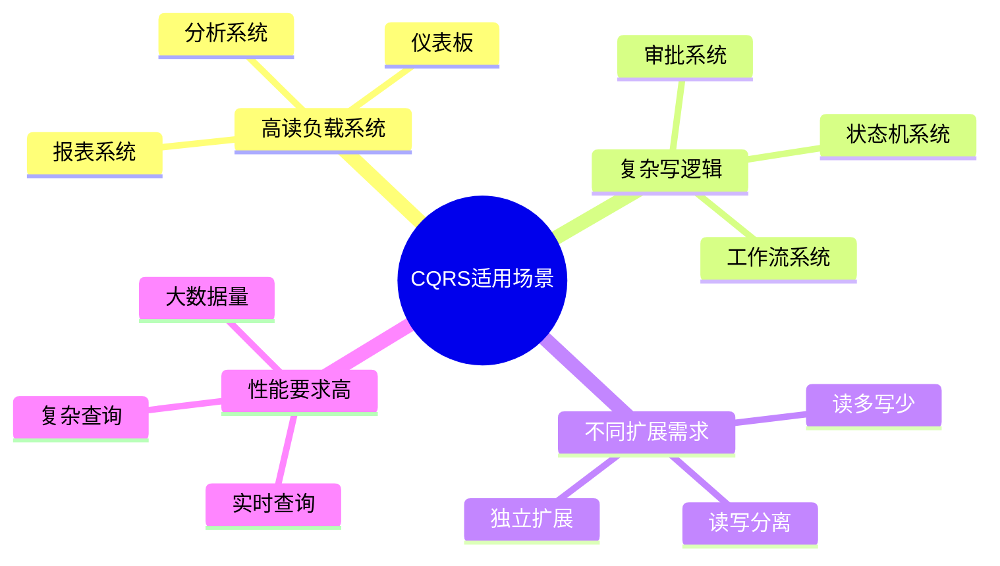
```mermaid
mindmap
  root((CQRS适用场景))
    高读负载系统
      报表系统
      分析系统
      仪表板
    复杂写逻辑
      工作流系统
      审批系统
      状态机系统
    不同扩展需求
      读多写少
      读写分离
      独立扩展
    性能要求高
      实时查询
      复杂查询
      大数据量
```

**具体场景**：
- ✅ **报表系统**：高读负载，复杂查询
- ✅ **分析系统**：读多写少，需要优化查询
- ✅ **工作流系统**：复杂写逻辑，简单查询
- ✅ **电商系统**：高读负载，需要优化查询性能

### 不适用场景

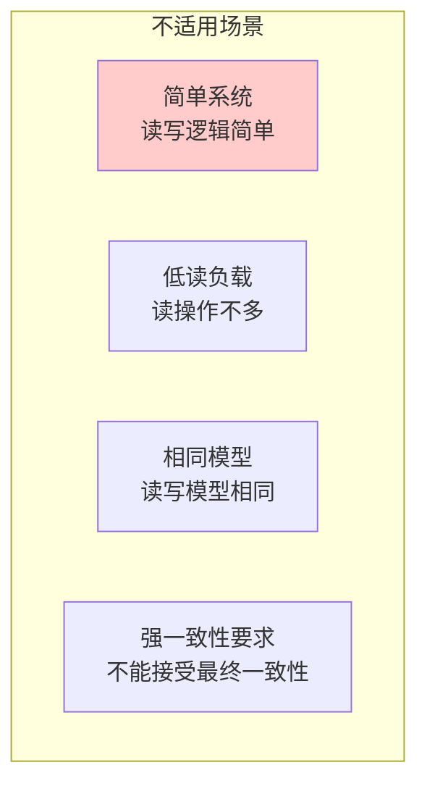
```mermaid
graph TB
    subgraph "不适用场景"
        Simple[简单系统<br/>读写逻辑简单]
        LowRead[低读负载<br/>读操作不多]
        SameModel[相同模型<br/>读写模型相同]
        StrongConsistency[强一致性要求<br/>不能接受最终一致性]
    end
    
    style Simple fill:#ffcccb
```

**不适用场景**：
- ❌ **简单系统**：读写逻辑简单，不需要分离
- ❌ **低读负载**：读操作不多，不需要优化
- ❌ **相同模型**：读写模型相同，不需要分离
- ❌ **强一致性要求**：不能接受最终一致性

---

## 实际案例

### 案例1：电商订单系统

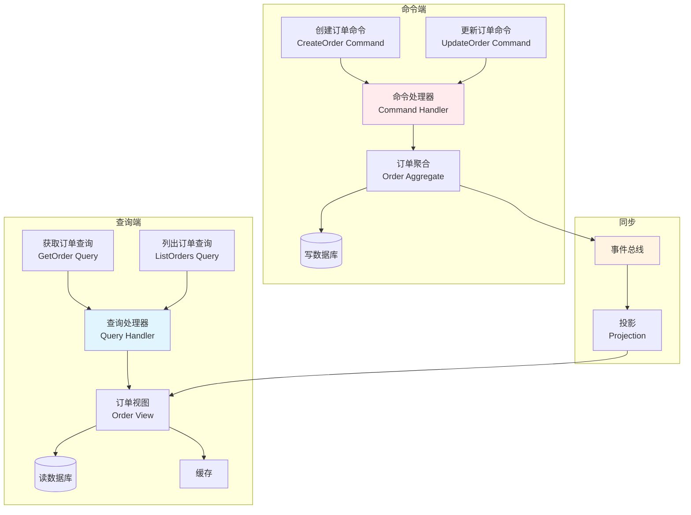
```mermaid
graph TB
    subgraph "命令端"
        CreateOrder[创建订单命令<br/>CreateOrder Command]
        UpdateOrder[更新订单命令<br/>UpdateOrder Command]
        CommandHandler[命令处理器<br/>Command Handler]
        OrderAggregate[订单聚合<br/>Order Aggregate]
        WriteDB[(写数据库)]
    end
    
    subgraph "查询端"
        GetOrder[获取订单查询<br/>GetOrder Query]
        ListOrders[列出订单查询<br/>ListOrders Query]
        QueryHandler[查询处理器<br/>Query Handler]
        OrderView[订单视图<br/>Order View]
        ReadDB[(读数据库)]
        Cache[缓存]
    end
    
    subgraph "同步"
        EventBus[事件总线]
        Projection[投影<br/>Projection]
    end
    
    CreateOrder --> CommandHandler
    UpdateOrder --> CommandHandler
    CommandHandler --> OrderAggregate
    OrderAggregate --> WriteDB
    OrderAggregate --> EventBus
    
    GetOrder --> QueryHandler
    ListOrders --> QueryHandler
    QueryHandler --> OrderView
    OrderView --> ReadDB
    OrderView --> Cache
    
    EventBus --> Projection
    Projection --> OrderView
    
    style CommandHandler fill:#ffebee
    style QueryHandler fill:#e1f5ff
    style EventBus fill:#fff4e1
```

### 案例2：游戏战斗系统

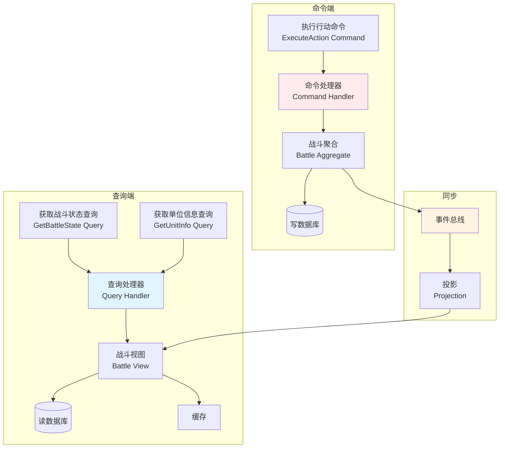
```mermaid
graph TB
    subgraph "命令端"
        ExecuteAction[执行行动命令<br/>ExecuteAction Command]
        CommandHandler[命令处理器<br/>Command Handler]
        BattleAggregate[战斗聚合<br/>Battle Aggregate]
        WriteDB[(写数据库)]
    end
    
    subgraph "查询端"
        GetBattleState[获取战斗状态查询<br/>GetBattleState Query]
        GetUnitInfo[获取单位信息查询<br/>GetUnitInfo Query]
        QueryHandler[查询处理器<br/>Query Handler]
        BattleView[战斗视图<br/>Battle View]
        ReadDB[(读数据库)]
        Cache[缓存]
    end
    
    subgraph "同步"
        EventBus[事件总线]
        Projection[投影<br/>Projection]
    end
    
    ExecuteAction --> CommandHandler
    CommandHandler --> BattleAggregate
    BattleAggregate --> WriteDB
    BattleAggregate --> EventBus
    
    GetBattleState --> QueryHandler
    GetUnitInfo --> QueryHandler
    QueryHandler --> BattleView
    BattleView --> ReadDB
    BattleView --> Cache
    
    EventBus --> Projection
    Projection --> BattleView
    
    style CommandHandler fill:#ffebee
    style QueryHandler fill:#e1f5ff
    style EventBus fill:#fff4e1
```

---

## 设计原则

### CQRS设计原则

```mermaid
graph TB
    subgraph "CQRS设计原则"
        Principle1[读写分离<br/>Separate Read and Write]
        Principle2[独立优化<br/>Independent Optimization]
        Principle3[最终一致性<br/>Eventual Consistency]
        Principle4[事件驱动<br/>Event-Driven]
        Principle5[模型独立<br/>Independent Models]
    end
    
    style Principle1 fill:#ffebee
```

**核心原则**：
- **读写分离**：命令和查询完全分离
- **独立优化**：读写可以独立优化
- **最终一致性**：查询端可以最终一致
- **事件驱动**：通过事件同步读写模型
- **模型独立**：读写模型可以独立设计

---

## 总结

CQRS架构模式通过将读写操作完全分离，使用不同的模型处理命令和查询，从而优化性能和可扩展性。

**核心价值**：
- 🚀 **性能优化**：读写可以独立优化，查询可以高度优化
- 📈 **可扩展性**：读写可以独立扩展，查询可以水平扩展
- 🎯 **复杂度管理**：读写模型可以有不同的复杂度
- 🔄 **灵活性**：可以针对不同场景优化不同模型

**适用场景**：
- ✅ 高读负载系统
- ✅ 复杂写逻辑
- ✅ 不同扩展需求
- ✅ 性能要求高

**注意事项**：
- ⚠️ 复杂度较高，需要维护两个模型
- ⚠️ 最终一致性，查询端可能数据不一致
- ⚠️ 开发开销大，需要更多代码
- ⚠️ 简单系统可能不需要CQRS

CQRS是优化高性能、高可扩展性系统的优秀架构模式，特别适合读多写少、需要高度优化查询性能的系统。

