# Clean架构模式（Clean Architecture Pattern）

## 目录

- [概述](#概述)
- [核心概念](#核心概念)
- [架构结构](#架构结构)
- [设计规则](#设计规则)
- [优缺点分析](#优缺点分析)
- [实践指南](#实践指南)
- [与其他架构模式的关系](#与其他架构模式的关系)
- [应用场景](#应用场景)
- [实际案例](#实际案例)
- [设计原则](#设计原则)
- [总结](#总结)

---

## 概述

**Clean架构模式（Clean Architecture Pattern）**，也称为**整洁架构**，是由Robert C. Martin（Uncle Bob）提出的一种架构模式。它综合了六边形架构、洋葱架构和领域驱动设计的精华，将系统组织成一系列同心圆，业务规则在中心，框架和技术在外围。

### 什么是Clean架构？

Clean架构将系统分为多个同心圆层：

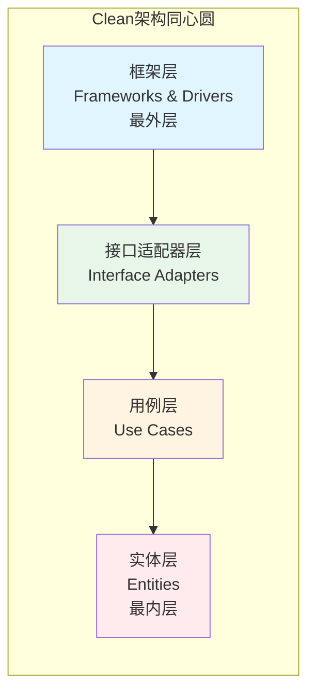

**核心原则**：
- **依赖规则**：依赖方向只能从外向内，内层不依赖外层
- **业务规则在中心**：最内层包含业务实体和用例
- **框架无关**：业务逻辑不依赖任何框架
- **可测试性**：业务逻辑可以独立测试

### 为什么需要Clean架构？

Clean架构解决了以下问题：
- **业务逻辑隔离**：业务规则完全独立于框架和技术
- **可测试性**：业务逻辑可以独立测试，无需框架
- **框架无关性**：可以轻松替换框架和技术栈
- **可维护性**：清晰的依赖方向，易于理解和维护
- **可扩展性**：新功能只需添加新的用例，不影响现有代码

---

## 核心概念

### 核心思想

Clean架构模式的核心思想是**依赖倒置（Dependency Inversion）**和**关注点分离（Separation of Concerns）**：

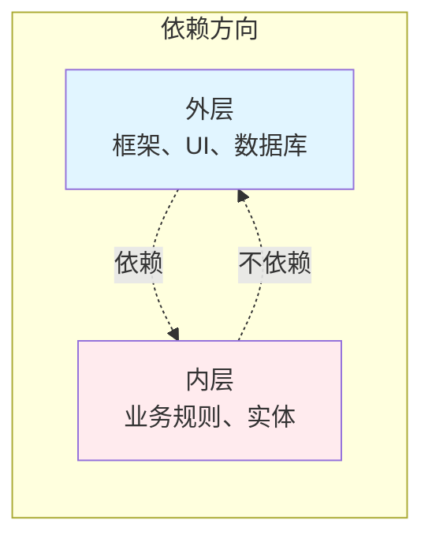

**关键原则**：
1. **依赖规则**：依赖只能从外向内，内层不依赖外层
2. **业务规则在中心**：实体和用例在最内层
3. **接口隔离**：通过接口定义边界
4. **框架无关**：业务逻辑不依赖框架

### 基本特征

- **同心圆结构**：系统组织成多个同心圆层
- **依赖倒置**：依赖方向从外向内
- **业务中心**：业务规则在中心，框架在外围
- **接口抽象**：通过接口定义层间交互
- **可测试性**：业务逻辑可以独立测试

---

## 架构结构

### Clean架构完整结构

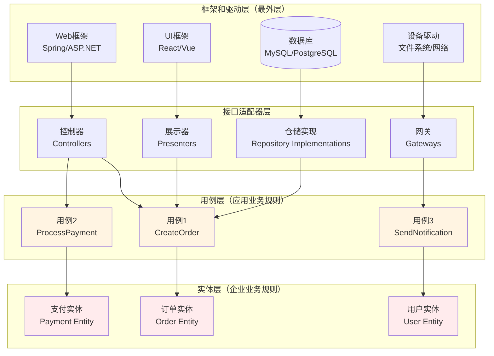

### 各层职责详解

#### 1. 实体层（Entities）

**位置**：最内层，核心业务规则

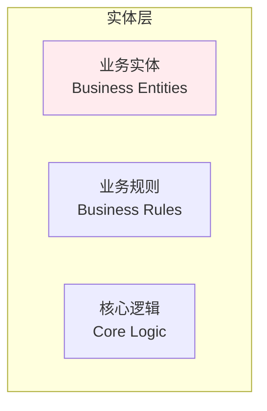

**职责**：
- 包含企业级业务规则
- 定义业务实体和值对象
- 不依赖任何外部框架
- 可以被所有外层使用

**特点**：
- 最稳定的一层
- 变化频率最低
- 包含核心业务概念

#### 2. 用例层（Use Cases）

**位置**：第二层，应用业务规则

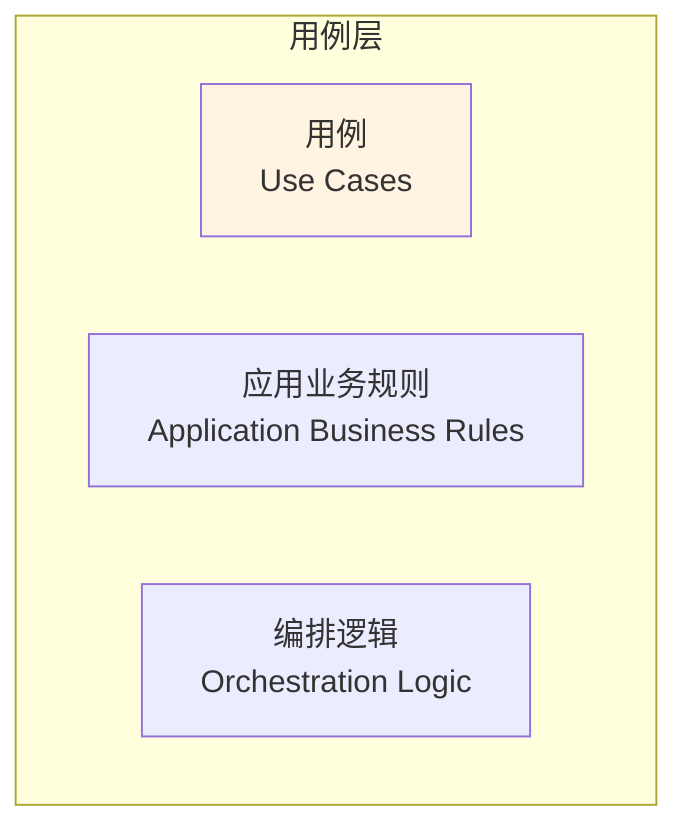

**职责**：
- 包含应用级业务规则
- 实现具体的业务用例
- 协调实体完成业务目标
- 定义应用输入输出接口

**特点**：
- 依赖实体层
- 不依赖框架和UI
- 包含应用特定的业务逻辑

#### 3. 接口适配器层（Interface Adapters）

**位置**：第三层，转换层

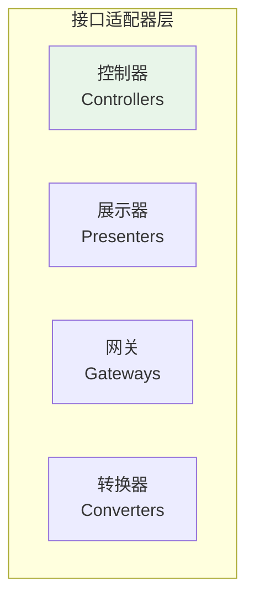

**职责**：
- 转换数据格式
- 适配外部接口
- 实现接口定义
- 连接用例和框架

**组件类型**：
- **控制器（Controllers）**：处理HTTP请求，调用用例
- **展示器（Presenters）**：格式化用例输出，供UI使用
- **网关（Gateways）**：适配外部服务接口
- **仓储实现（Repository Implementations）**：实现数据访问接口

#### 4. 框架和驱动层（Frameworks & Drivers）

**位置**：最外层，技术实现

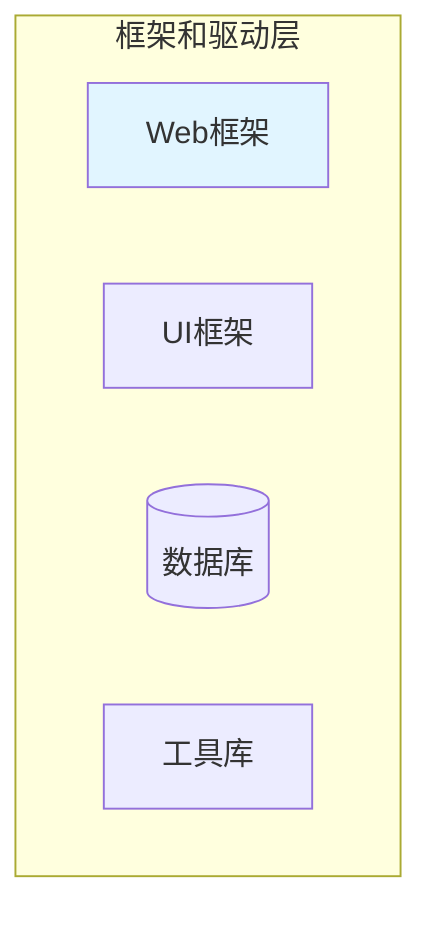

**职责**：
- 实现具体的技术细节
- 提供框架和工具
- 处理外部系统交互
- 实现接口适配器定义的接口

**组件类型**：
- **Web框架**：Spring、ASP.NET、Express
- **UI框架**：React、Vue、Angular
- **数据库**：MySQL、PostgreSQL、MongoDB
- **工具库**：日志、配置、工具类

---

## 设计规则

### 依赖规则（Dependency Rule）

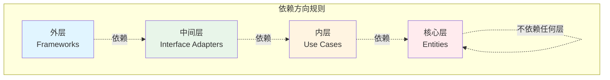

**规则说明**：
- ✅ **允许**：外层依赖内层
- ❌ **禁止**：内层依赖外层
- ✅ **允许**：通过接口定义依赖
- ❌ **禁止**：直接依赖具体实现

### 数据流规则

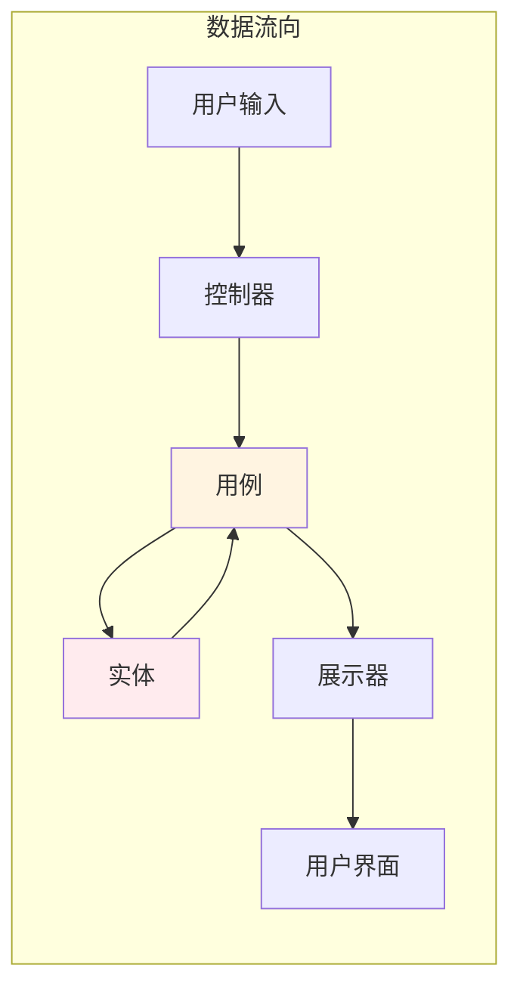

**数据流特点**：
- 数据从外层流向内层（请求）
- 数据从内层流向外层（响应）
- 内层不直接访问外层数据
- 通过接口定义数据契约

---

## 优缺点分析

### 优点

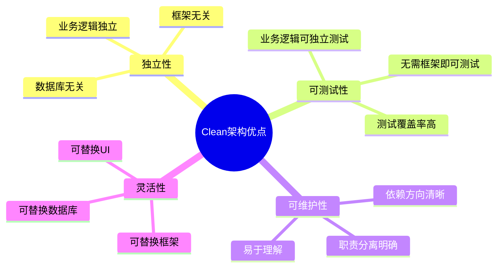

**详细说明**：
- ✅ **业务逻辑独立**：业务规则完全独立于框架和技术
- ✅ **高度可测试**：业务逻辑可以独立测试，无需框架
- ✅ **框架无关**：可以轻松替换任何框架
- ✅ **数据库无关**：可以轻松替换数据库
- ✅ **UI无关**：可以轻松替换UI框架
- ✅ **依赖清晰**：依赖方向明确，易于理解

### 缺点

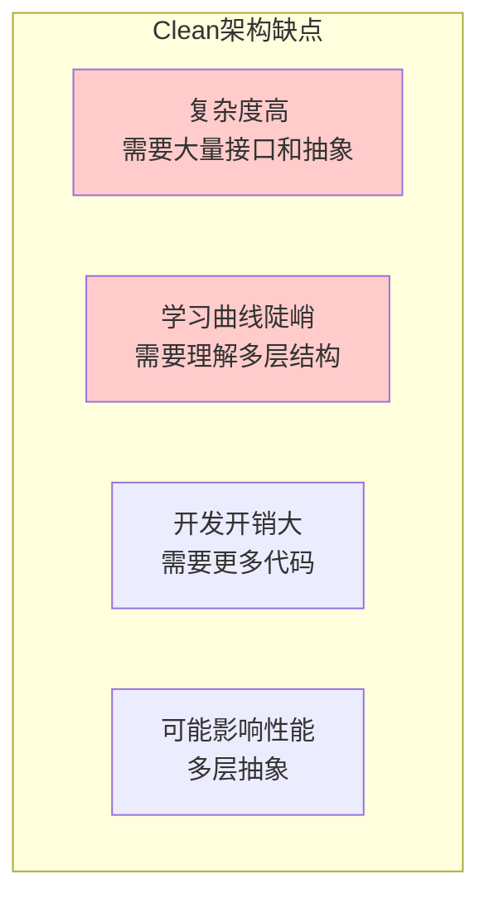

**详细说明**：
- ❌ **复杂度高**：需要定义大量接口和抽象
- ❌ **学习曲线陡峭**：需要理解多层结构和依赖规则
- ❌ **开发开销大**：需要编写更多代码（接口、适配器）
- ❌ **可能过度设计**：简单项目可能不需要这么复杂的架构
- ❌ **性能开销**：多层抽象可能带来性能开销

---

## 实践指南

### 实施步骤

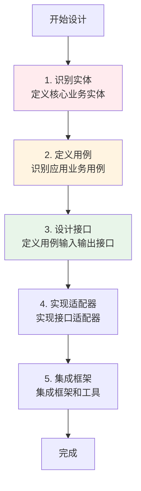

### 分层实施策略

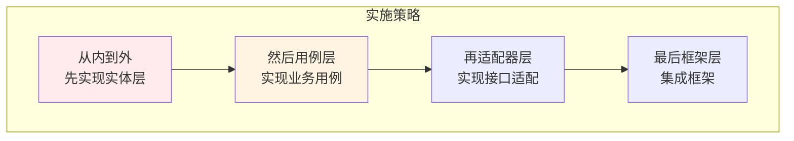

**实施建议**：
1. **从核心开始**：先实现实体层，定义核心业务概念
2. **用例驱动**：围绕用例实现应用逻辑
3. **接口先行**：先定义接口，再实现适配器
4. **逐步集成**：最后集成框架和工具

---

## 与其他架构模式的关系

### Clean架构与其他架构的关系

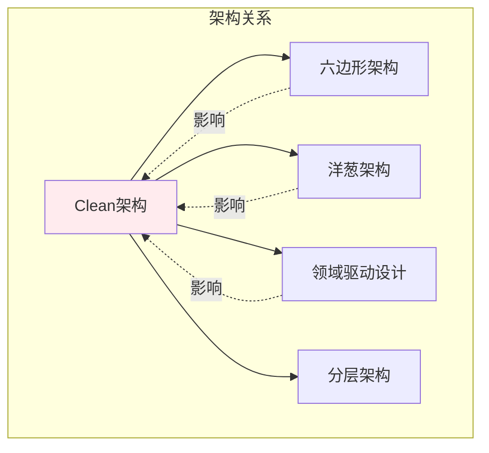

**关系说明**：
- **六边形架构**：Clean架构的灵感来源之一
- **洋葱架构**：Clean架构的同心圆结构来源于此
- **领域驱动设计**：Clean架构的实体层体现了DDD思想
- **分层架构**：Clean架构是分层架构的进化版本

### 架构对比

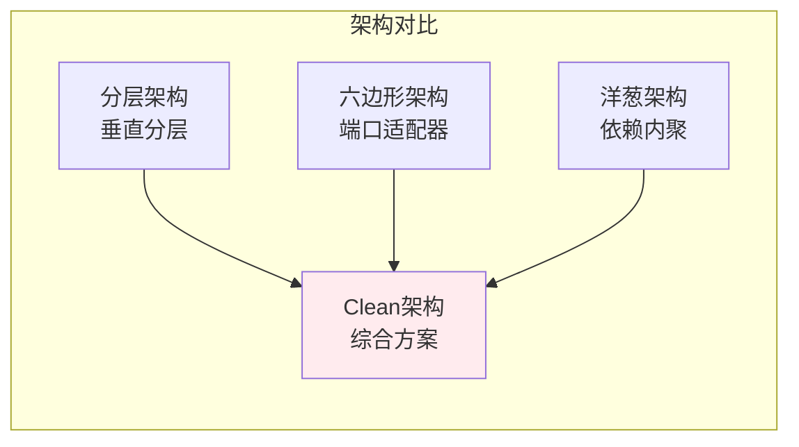

---

## 应用场景

### 适用场景

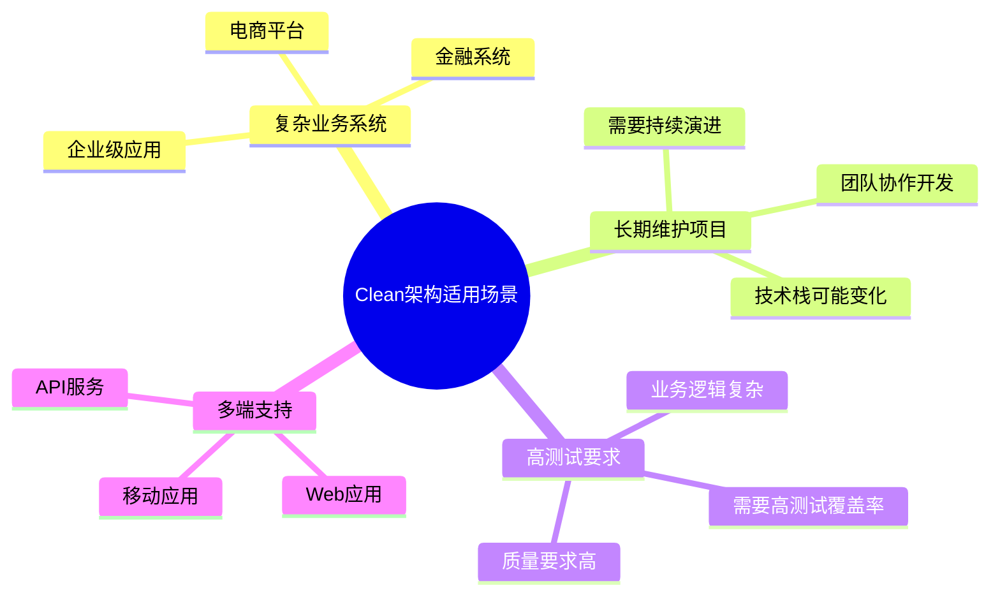

**具体场景**：
- ✅ **企业级应用**：复杂的业务逻辑，需要长期维护
- ✅ **金融系统**：高可靠性要求，业务规则复杂
- ✅ **电商平台**：多端支持，业务逻辑复杂
- ✅ **SaaS应用**：需要支持多种客户，灵活扩展

### 不适用场景

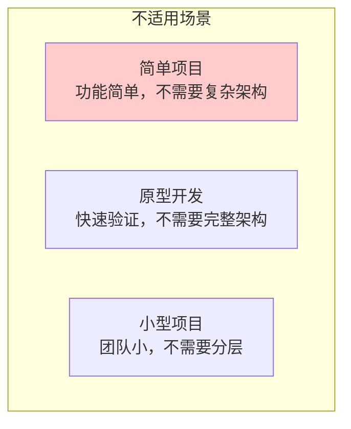

**不适用场景**：
- ❌ **简单项目**：功能简单，不需要复杂架构
- ❌ **原型开发**：快速验证想法，不需要完整架构
- ❌ **小型项目**：团队小，过度设计反而增加复杂度

---

## 实际案例

### 案例1：电商订单系统

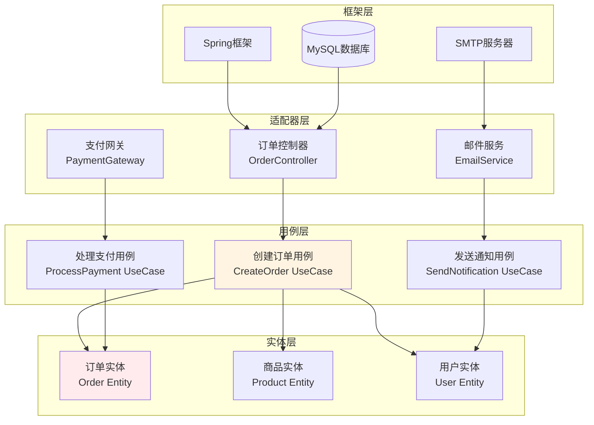

### 案例2：游戏战斗系统

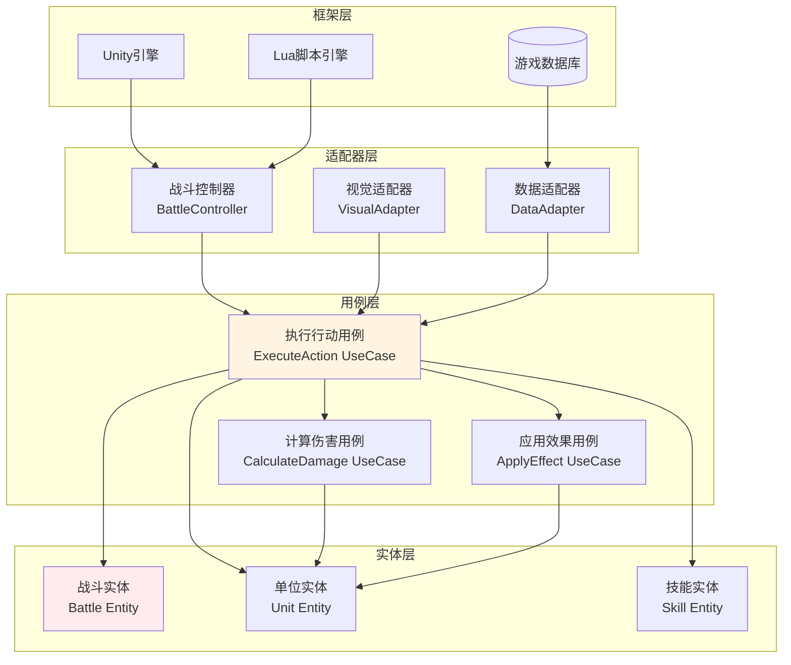

---

## 设计原则

### SOLID原则在Clean架构中的应用

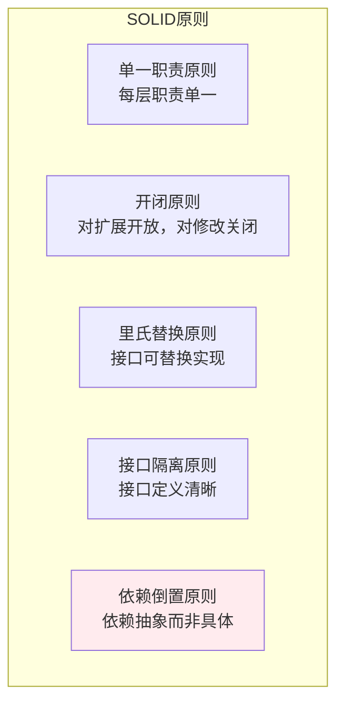

**原则应用**：
- **单一职责**：每层只负责自己的职责
- **开闭原则**：通过接口扩展，无需修改内层
- **里氏替换**：接口实现可以替换
- **接口隔离**：接口定义清晰，职责单一
- **依赖倒置**：依赖抽象接口，而非具体实现

---

## 总结

Clean架构模式是一种综合性的架构模式，它综合了六边形架构、洋葱架构和领域驱动设计的精华，通过同心圆结构组织系统，将业务规则放在中心，框架和技术放在外围。

**核心价值**：
- 🎯 **业务逻辑独立**：业务规则完全独立于框架
- 🧪 **高度可测试**：业务逻辑可以独立测试
- 🔄 **灵活可扩展**：可以轻松替换框架和技术
- 📐 **依赖清晰**：依赖方向明确，易于理解

**适用场景**：
- ✅ 复杂业务系统
- ✅ 长期维护项目
- ✅ 高测试要求
- ✅ 多端支持

**注意事项**：
- ⚠️ 复杂度较高，需要团队理解
- ⚠️ 开发开销较大，需要更多代码
- ⚠️ 简单项目可能过度设计

Clean架构是构建可维护、可测试、可扩展系统的优秀选择，特别适合复杂业务系统和长期维护的项目。

