# ECS架构模式（Entity Component System Architecture Pattern）

## 目录

- [概述](#概述)
- [核心概念](#核心概念)
- [架构结构](#架构结构)
- [设计规则](#设计规则)
- [优缺点分析](#优缺点分析)
- [实践指南](#实践指南)
- [与其他架构模式的关系](#与其他架构模式的关系)
- [应用场景](#应用场景)
- [实际案例](#实际案例)
- [设计原则](#设计原则)
- [总结](#总结)

---

## 概述

**ECS架构模式（Entity Component System Architecture Pattern）**，即**实体-组件-系统架构模式**，是一种将数据与逻辑完全分离的架构模式。它通过实体（Entity）、组件（Component）和系统（System）三个核心概念来组织代码，特别适合游戏开发和需要高性能的系统。

### 什么是ECS架构？

ECS架构将系统组织成三个核心部分：

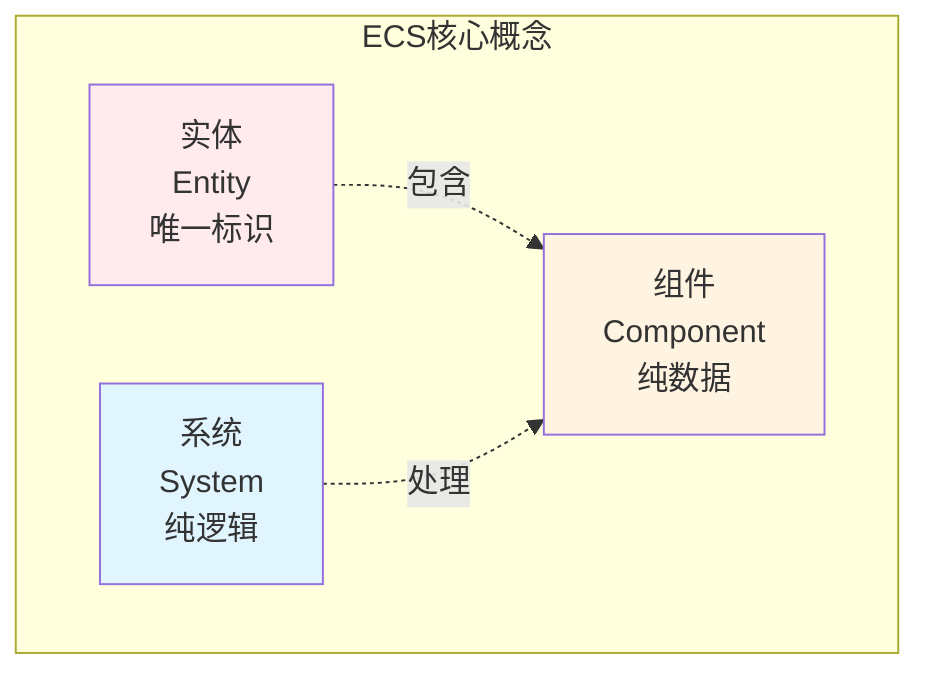

**核心原则**：
- **实体（Entity）**：唯一标识，只是一个ID
- **组件（Component）**：纯数据，无逻辑
- **系统（System）**：纯逻辑，无状态
- **数据与逻辑分离**：组件是数据，系统是逻辑

### 为什么需要ECS架构？

ECS架构解决了以下问题：
- **性能优化**：数据局部性好，缓存友好，适合并行处理
- **组合优于继承**：通过组合组件实现功能，避免继承层次
- **灵活性**：可以动态添加/移除组件，改变实体行为
- **可扩展性**：添加新功能只需添加新组件和系统
- **解耦**：组件和系统完全解耦，易于维护

---

## 核心概念

### 核心思想

ECS架构的核心思想是**数据与逻辑分离（Data-Logic Separation）**：

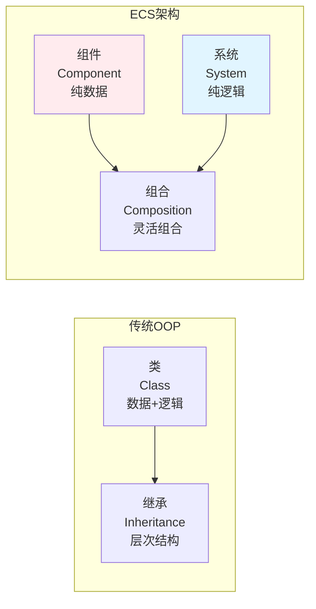

**关键原则**：
1. **数据与逻辑分离**：组件是数据，系统是逻辑
2. **组合优于继承**：通过组合组件实现功能
3. **系统批量处理**：系统批量处理相同类型的组件
4. **数据局部性**：相同类型的组件连续存储，缓存友好

### 基本特征

- **实体即ID**：实体只是一个唯一标识
- **组件即数据**：组件是纯数据结构，无逻辑
- **系统即逻辑**：系统是纯逻辑，无状态
- **组合灵活**：通过组合组件实现功能
- **批量处理**：系统批量处理组件，性能高

---

## 架构结构

### ECS完整架构

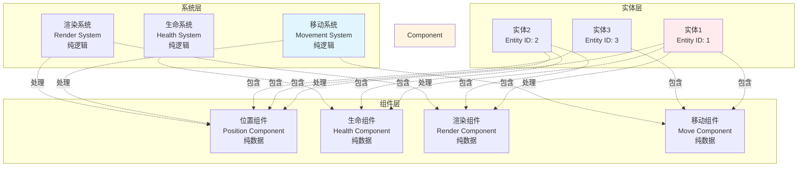

### 核心组件详解

#### 1. 实体（Entity）

**定义**：只是一个唯一标识符

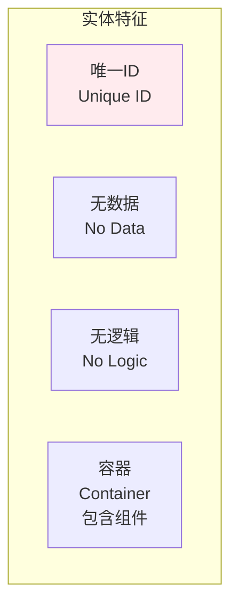

**特点**：
- 只是一个唯一标识符（ID）
- 不包含任何数据
- 不包含任何逻辑
- 通过包含的组件定义行为

**示例**：
- 玩家实体：ID = 1
- 敌人实体：ID = 2
- 道具实体：ID = 3

#### 2. 组件（Component）

**定义**：纯数据结构，无逻辑

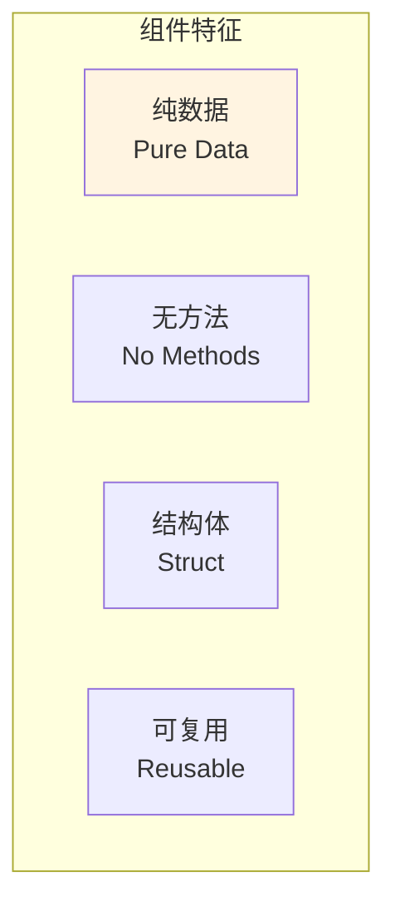

**特点**：
- 纯数据结构
- 无方法，无逻辑
- 通常是小结构体
- 可以在不同实体间复用

**示例**：
- PositionComponent：{x: 0, y: 0, z: 0}
- HealthComponent：{current: 100, max: 100}
- RenderComponent：{mesh: "player", texture: "player.png"}

#### 3. 系统（System）

**定义**：纯逻辑，无状态

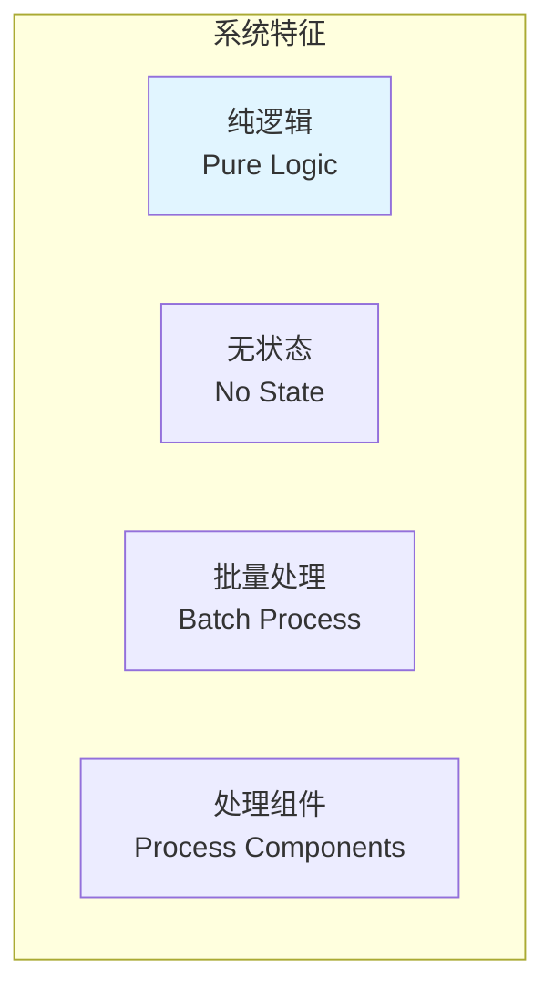

**特点**：
- 纯逻辑，无状态
- 批量处理相同类型的组件
- 可以并行处理
- 性能高

**示例**：
- MovementSystem：处理所有PositionComponent和MoveComponent
- RenderSystem：处理所有PositionComponent和RenderComponent
- HealthSystem：处理所有HealthComponent

---

## 设计规则

### 组件设计规则

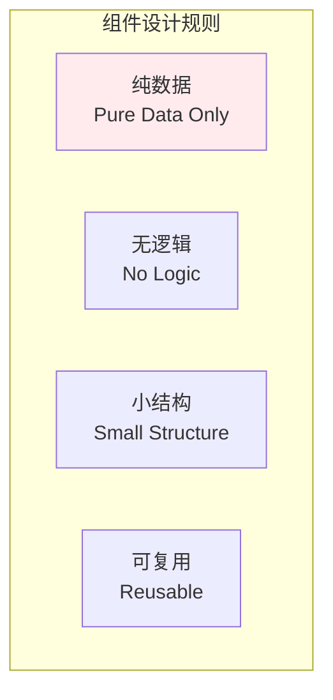

**规则说明**：
- ✅ **纯数据**：组件只包含数据，无方法
- ✅ **无逻辑**：组件不包含任何业务逻辑
- ✅ **小结构**：组件应该尽可能小
- ✅ **可复用**：组件可以在不同实体间复用

### 系统设计规则

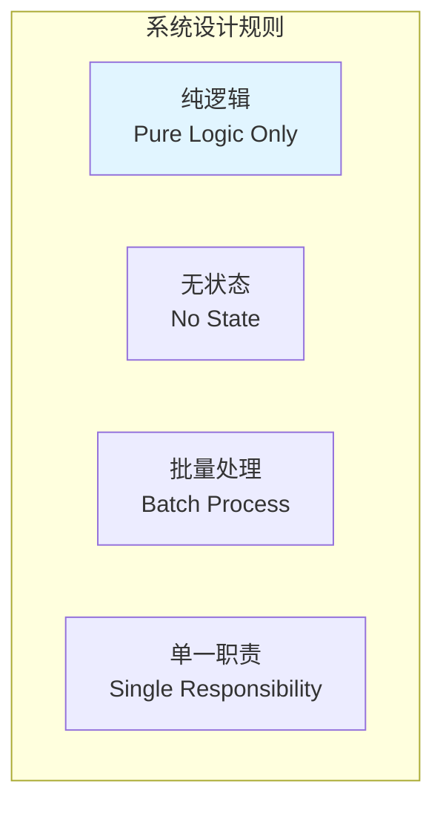

**规则说明**：
- ✅ **纯逻辑**：系统只包含逻辑，无数据
- ✅ **无状态**：系统不保存状态
- ✅ **批量处理**：系统批量处理组件
- ✅ **单一职责**：每个系统只负责一个功能

### 实体设计规则

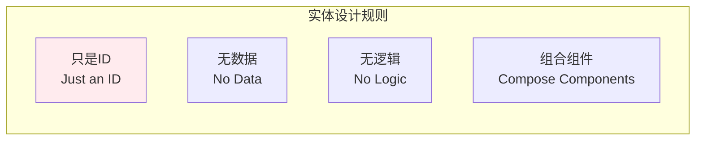

**规则说明**：
- ✅ **只是ID**：实体只是一个唯一标识符
- ✅ **无数据**：实体不包含数据
- ✅ **无逻辑**：实体不包含逻辑
- ✅ **组合组件**：通过组合组件定义行为

---

## 优缺点分析

### 优点

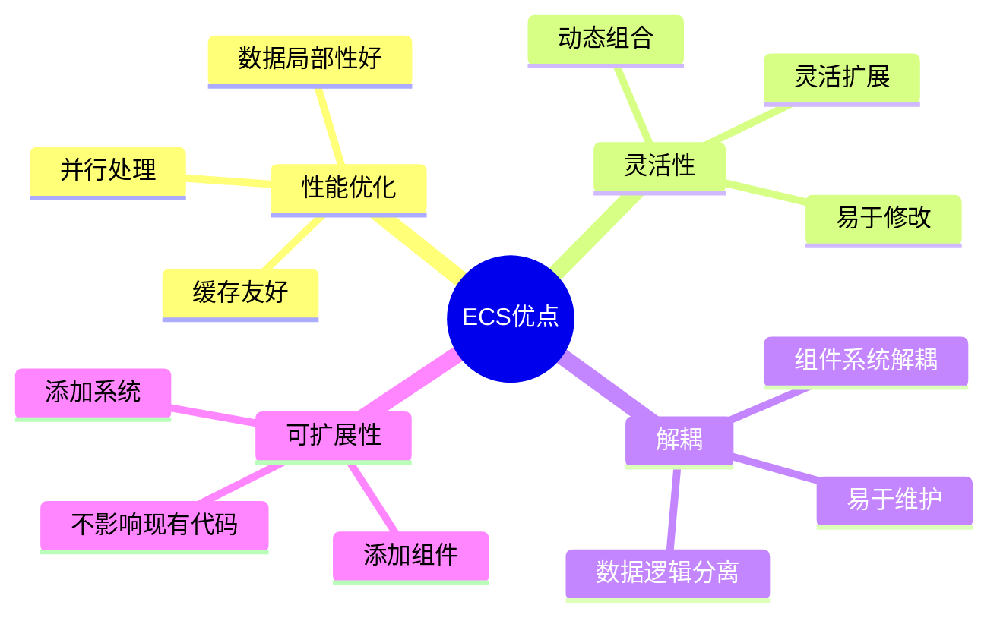

**详细说明**：
- ✅ **性能优化**：数据局部性好，缓存友好，适合并行处理
- ✅ **灵活性**：可以动态添加/移除组件，改变实体行为
- ✅ **解耦**：组件和系统完全解耦，易于维护
- ✅ **可扩展性**：添加新功能只需添加新组件和系统
- ✅ **组合优于继承**：通过组合实现功能，避免继承层次

### 缺点

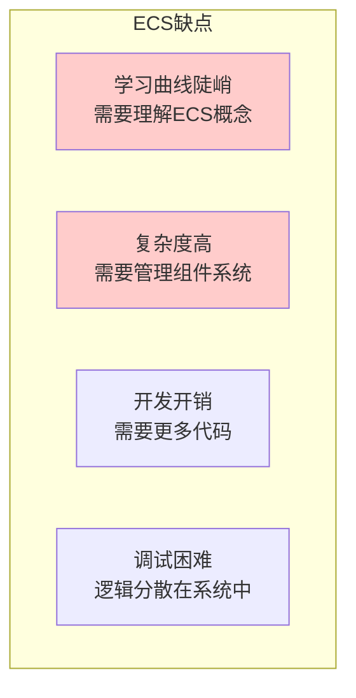

**详细说明**：
- ❌ **学习曲线陡峭**：需要理解ECS概念和思维方式
- ❌ **复杂度高**：需要管理组件、系统和实体
- ❌ **开发开销**：需要更多代码来组织组件和系统
- ❌ **调试困难**：逻辑分散在系统中，调试可能困难
- ❌ **不适合简单场景**：简单场景可能过度设计

---

## 实践指南

### ECS实施步骤

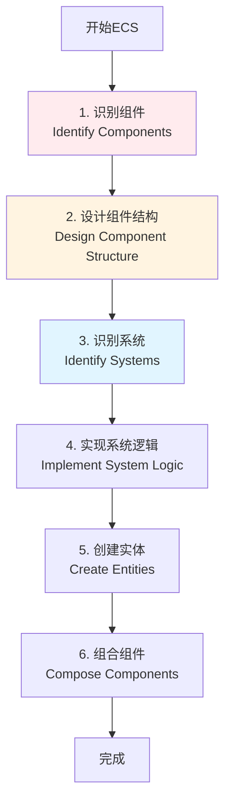

### 组件设计策略

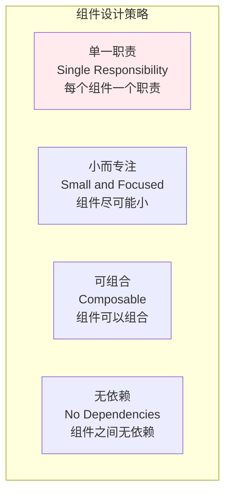

**设计建议**：
- ✅ **单一职责**：每个组件只负责一个方面
- ✅ **小而专注**：组件尽可能小，只包含必要数据
- ✅ **可组合**：组件可以灵活组合
- ✅ **无依赖**：组件之间不应该有依赖

---

## 与其他架构模式的关系

### ECS与其他架构的关系

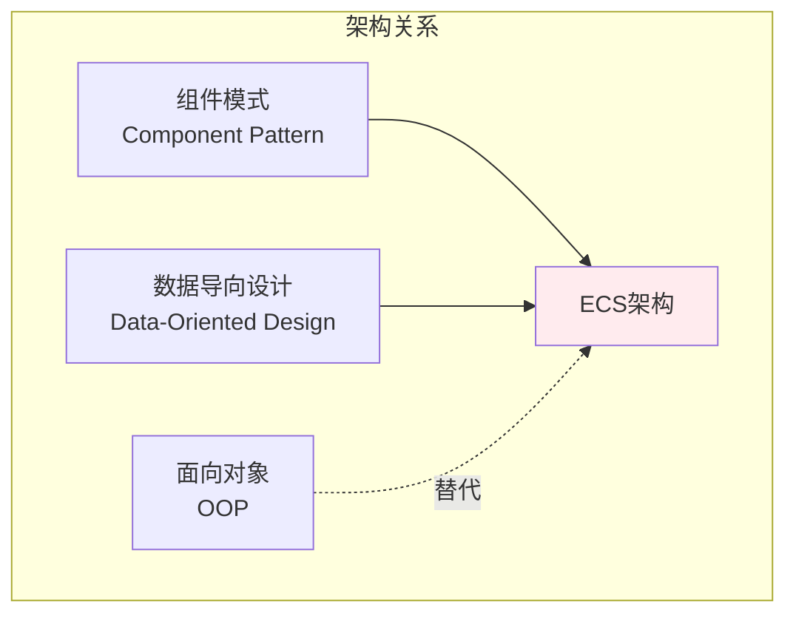

**关系说明**：
- **组件模式**：ECS是组件模式的极致实现
- **数据导向设计**：ECS体现了数据导向设计思想
- **面向对象**：ECS是OOP的替代方案，组合优于继承

---

## 应用场景

### 适用场景

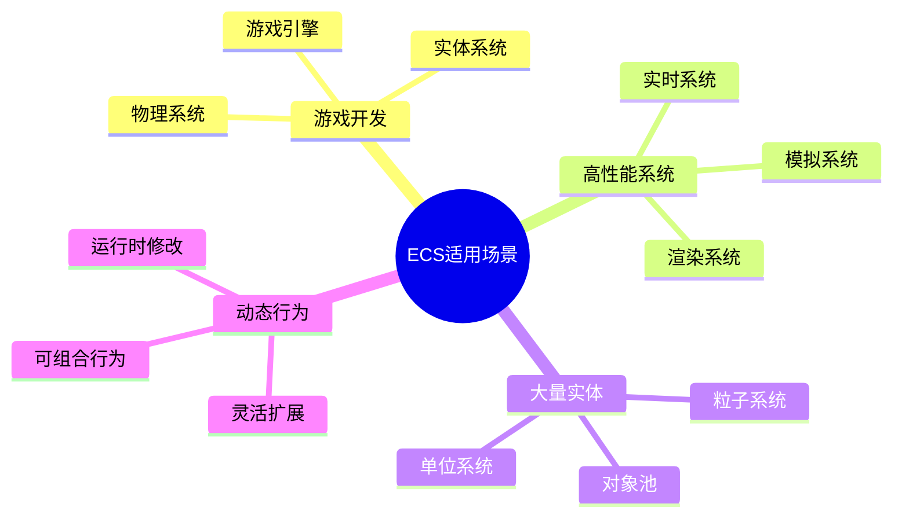

**具体场景**：
- ✅ **游戏开发**：Unity DOTS、Unreal ECS
- ✅ **高性能系统**：需要高性能的实时系统
- ✅ **大量实体**：需要处理大量实体的系统
- ✅ **动态行为**：需要动态改变实体行为的系统

### 不适用场景

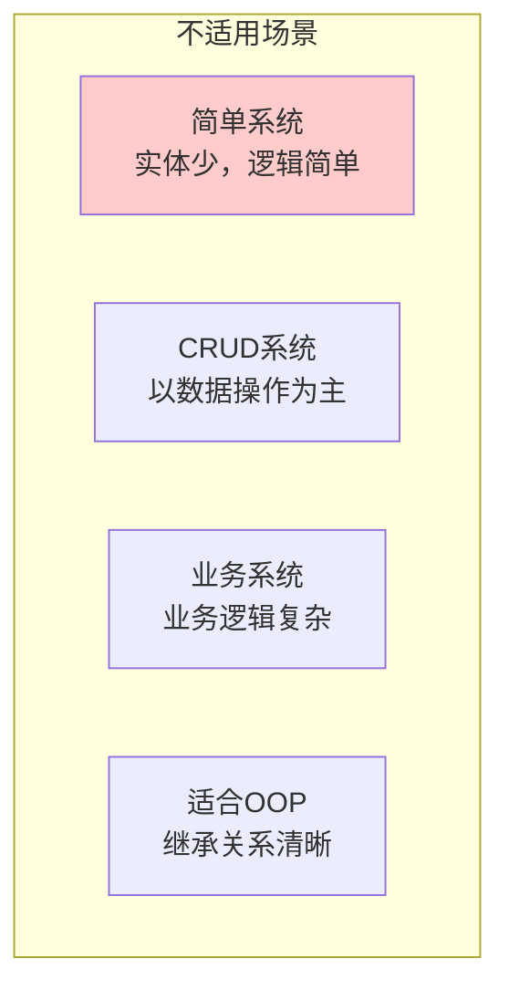

**不适用场景**：
- ❌ **简单系统**：实体少，逻辑简单，不需要ECS
- ❌ **CRUD系统**：以数据操作为主，不需要ECS
- ❌ **业务系统**：业务逻辑复杂，OOP可能更适合
- ❌ **适合OOP**：继承关系清晰，OOP可能更适合

---

## 实际案例

### 案例1：游戏角色系统

```mermaid
graph TB
    subgraph "实体"
        Player[玩家实体<br/>Entity ID: 1]
        Enemy[敌人实体<br/>Entity ID: 2]
    end
    
    subgraph "组件"
        Position[位置组件<br/>PositionComponent<br/>{x, y, z}]
        Health[生命组件<br/>HealthComponent<br/>{current, max}]
        Render[渲染组件<br/>RenderComponent<br/>{mesh, texture}]
        Move[移动组件<br/>MoveComponent<br/>{speed, direction}]
        AI[AI组件<br/>AIComponent<br/>{behavior, target}]
    end
    
    subgraph "系统"
        Movement[移动系统<br/>MovementSystem<br/>处理Position+Move]
        Render[渲染系统<br/>RenderSystem<br/>处理Position+Render]
        Health[生命系统<br/>HealthSystem<br/>处理Health]
        AI[AI系统<br/>AISystem<br/>处理AI]
    end
    
    Player -.包含.-> Position
    Player -.包含.-> Health
    Player -.包含.-> Render
    Player -.包含.-> Move
    
    Enemy -.包含.-> Position
    Enemy -.包含.-> Health
    Enemy -.包含.-> Render
    Enemy -.包含.-> AI
    
    Movement -.处理.-> Position
    Movement -.处理.-> Move
    Render -.处理.-> Position
    Render -.处理.-> Render
    Health -.处理.-> Health
    AI -.处理.-> AI
    
    style Player fill:#ffebee
    style Position fill:#fff4e1
    style Movement fill:#e1f5ff
```

### 案例2：战斗系统

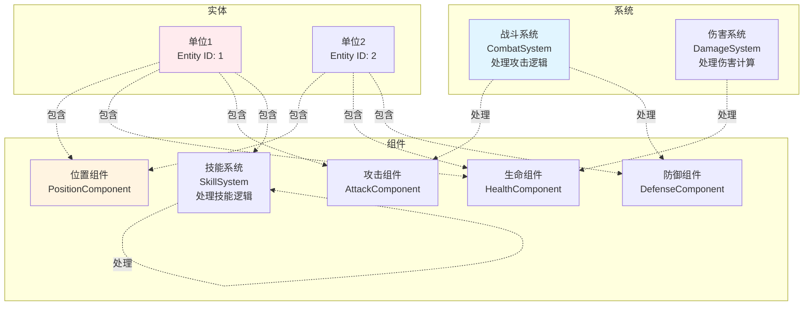

---

## 设计原则

### ECS设计原则

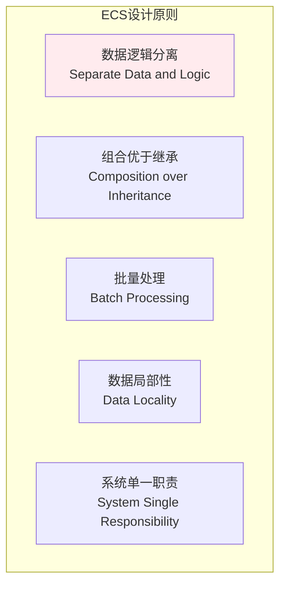

**核心原则**：
- **数据逻辑分离**：组件是数据，系统是逻辑
- **组合优于继承**：通过组合组件实现功能
- **批量处理**：系统批量处理组件，性能高
- **数据局部性**：相同类型的组件连续存储
- **系统单一职责**：每个系统只负责一个功能

---

## 总结

ECS架构模式通过将数据与逻辑完全分离，使用实体、组件和系统三个核心概念来组织代码，特别适合游戏开发和需要高性能的系统。

**核心价值**：
- 🚀 **性能优化**：数据局部性好，缓存友好，适合并行处理
- 🔧 **灵活性**：可以动态添加/移除组件，改变实体行为
- 🔌 **解耦**：组件和系统完全解耦，易于维护
- 📈 **可扩展性**：添加新功能只需添加新组件和系统
- 🎯 **组合优于继承**：通过组合实现功能，避免继承层次

**适用场景**：
- ✅ 游戏开发
- ✅ 高性能系统
- ✅ 大量实体
- ✅ 动态行为

**注意事项**：
- ⚠️ 学习曲线陡峭，需要理解ECS概念
- ⚠️ 复杂度高，需要管理组件、系统和实体
- ⚠️ 开发开销大，需要更多代码
- ⚠️ 简单场景可能过度设计

ECS是构建高性能、灵活、可扩展系统的优秀架构模式，特别适合游戏开发和需要处理大量实体的高性能系统。

