# MVVM架构模式（Model-View-ViewModel Architecture Pattern）

## 目录

- [概述](#概述)
- [核心概念](#核心概念)
- [架构结构](#架构结构)
- [设计规则](#设计规则)
- [优缺点分析](#优缺点分析)
- [实践指南](#实践指南)
- [与其他架构模式的关系](#与其他架构模式的关系)
- [应用场景](#应用场景)
- [实际案例](#实际案例)
- [设计原则](#设计原则)
- [总结](#总结)

---

## 概述

**MVVM架构模式（Model-View-ViewModel Architecture Pattern）**，即**模型-视图-视图模型架构模式**，是由John Gossman在2005年提出的一种UI架构模式。它将UI逻辑与业务逻辑分离，通过数据绑定实现视图与视图模型的自动同步。

### 什么是MVVM？

MVVM将UI分为三个部分：

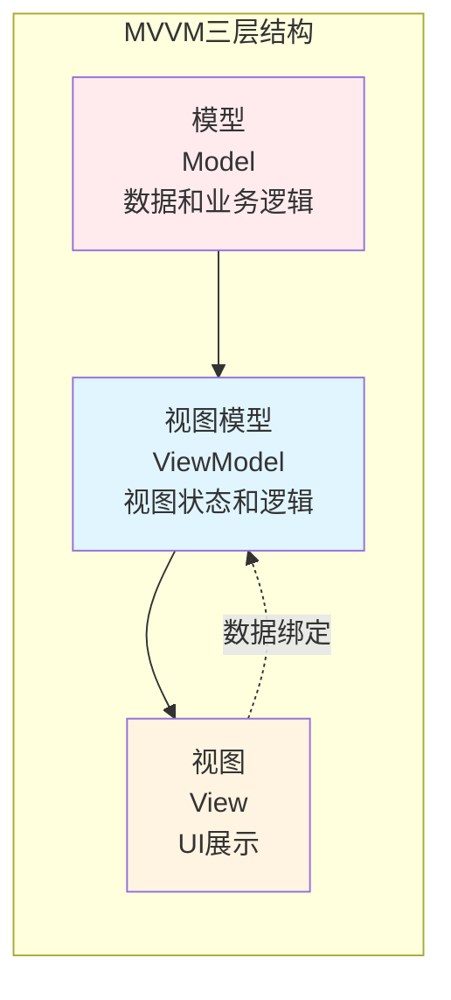
```mermaid
graph LR
    subgraph "MVVM三层结构"
        Model[模型<br/>Model<br/>数据和业务逻辑]
        View[视图<br/>View<br/>UI展示]
        ViewModel[视图模型<br/>ViewModel<br/>视图状态和逻辑]
        
        Model --> ViewModel
        ViewModel --> View
        View -.数据绑定.-> ViewModel
    end
    
    style Model fill:#ffebee
    style View fill:#fff4e1
    style ViewModel fill:#e1f5ff
```

**核心原则**：
- **模型（Model）**：数据和业务逻辑
- **视图（View）**：UI展示，只负责展示
- **视图模型（ViewModel）**：视图的状态和逻辑
- **数据绑定**：视图与视图模型自动同步

### 为什么需要MVVM？

MVVM解决了以下问题：
- **UI与逻辑分离**：视图只负责展示，逻辑在ViewModel中
- **可测试性**：ViewModel可以独立测试，无需UI
- **可维护性**：职责清晰，易于维护
- **可复用性**：ViewModel可以在不同视图中复用
- **数据绑定**：自动同步，减少样板代码

---

## 核心概念

### 核心思想

MVVM的核心思想是**关注点分离（Separation of Concerns）**和**数据绑定（Data Binding）**：

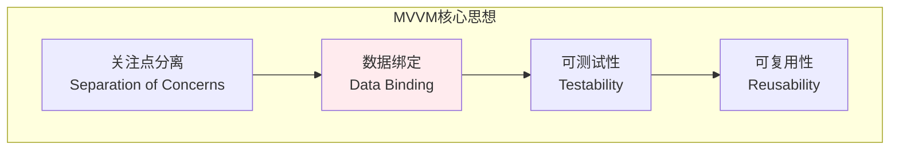
```mermaid
graph TB
    subgraph "MVVM核心思想"
        Separation[关注点分离<br/>Separation of Concerns]
        Binding[数据绑定<br/>Data Binding]
        Testability[可测试性<br/>Testability]
        Reusability[可复用性<br/>Reusability]
    end
    
    Separation --> Binding
    Binding --> Testability
    Testability --> Reusability
    
    style Binding fill:#ffebee
```

**关键原则**：
1. **关注点分离**：视图、视图模型、模型各司其职
2. **数据绑定**：视图与视图模型通过数据绑定自动同步
3. **可测试性**：ViewModel可以独立测试
4. **可复用性**：ViewModel可以在不同视图中复用

### 基本特征

- **三层结构**：Model、View、ViewModel
- **数据绑定**：视图与视图模型自动同步
- **命令模式**：通过命令处理用户交互
- **可测试性**：ViewModel可以独立测试
- **可复用性**：ViewModel可以在不同视图中复用

---

## 架构结构

### MVVM完整架构

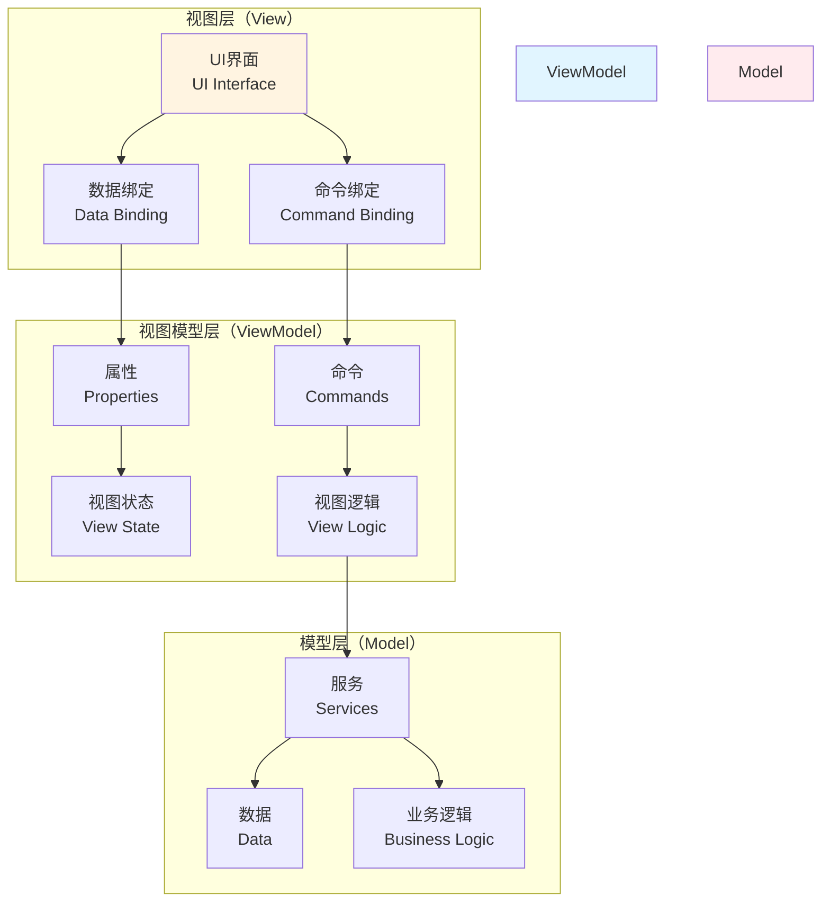
```mermaid
graph TB
    subgraph "视图层（View）"
        UI[UI界面<br/>UI Interface]
        Binding[数据绑定<br/>Data Binding]
        Commands[命令绑定<br/>Command Binding]
    end
    
    subgraph "视图模型层（ViewModel）"
        State[视图状态<br/>View State]
        Properties[属性<br/>Properties]
        CommandsVM[命令<br/>Commands]
        Logic[视图逻辑<br/>View Logic]
    end
    
    subgraph "模型层（Model）"
        Data[数据<br/>Data]
        BusinessLogic[业务逻辑<br/>Business Logic]
        Services[服务<br/>Services]
    end
    
    UI --> Binding
    Binding --> Properties
    UI --> Commands
    Commands --> CommandsVM
    
    Properties --> State
    CommandsVM --> Logic
    Logic --> Services
    Services --> Data
    Services --> BusinessLogic
    
    style UI fill:#fff4e1
    style ViewModel fill:#e1f5ff
    style Model fill:#ffebee
```

### 核心组件详解

#### 1. 模型（Model）

**定义**：数据和业务逻辑

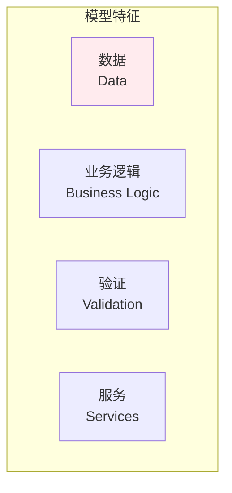
```mermaid
graph TB
    subgraph "模型特征"
        Data[数据<br/>Data]
        BusinessLogic[业务逻辑<br/>Business Logic]
        Validation[验证<br/>Validation]
        Services[服务<br/>Services]
    end
    
    style Data fill:#ffebee
```

**职责**：
- 包含业务数据
- 实现业务逻辑
- 数据验证
- 与后端服务交互

**特点**：
- 不依赖View和ViewModel
- 包含业务规则
- 可以独立测试
- 可以在不同ViewModel中复用

#### 2. 视图（View）

**定义**：UI展示层

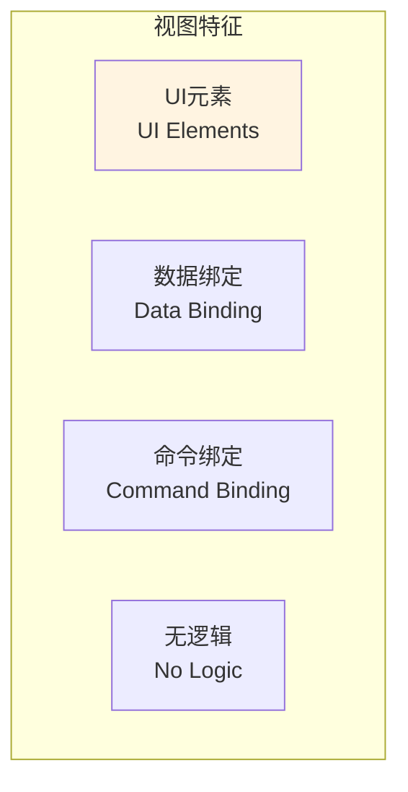
```mermaid
graph TB
    subgraph "视图特征"
        UI[UI元素<br/>UI Elements]
        Binding[数据绑定<br/>Data Binding]
        Commands[命令绑定<br/>Command Binding]
        NoLogic[无逻辑<br/>No Logic]
    end
    
    style UI fill:#fff4e1
```

**职责**：
- 展示UI界面
- 绑定ViewModel属性
- 绑定ViewModel命令
- 处理UI交互

**特点**：
- 只负责展示
- 不包含业务逻辑
- 通过数据绑定与ViewModel通信
- 可以轻松替换（如Web、移动端）

#### 3. 视图模型（ViewModel）

**定义**：视图的状态和逻辑

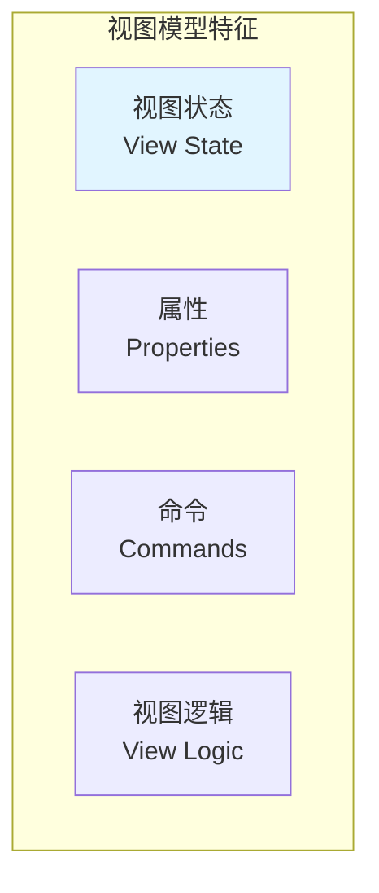
```mermaid
graph TB
    subgraph "视图模型特征"
        State[视图状态<br/>View State]
        Properties[属性<br/>Properties]
        Commands[命令<br/>Commands]
        Logic[视图逻辑<br/>View Logic]
    end
    
    style State fill:#e1f5ff
```

**职责**：
- 管理视图状态
- 暴露属性供视图绑定
- 暴露命令处理用户交互
- 包含视图相关的逻辑

**特点**：
- 不依赖View
- 可以独立测试
- 可以在不同View中复用
- 通过属性通知机制更新视图

#### 4. 数据绑定（Data Binding）

**定义**：视图与视图模型的自动同步机制

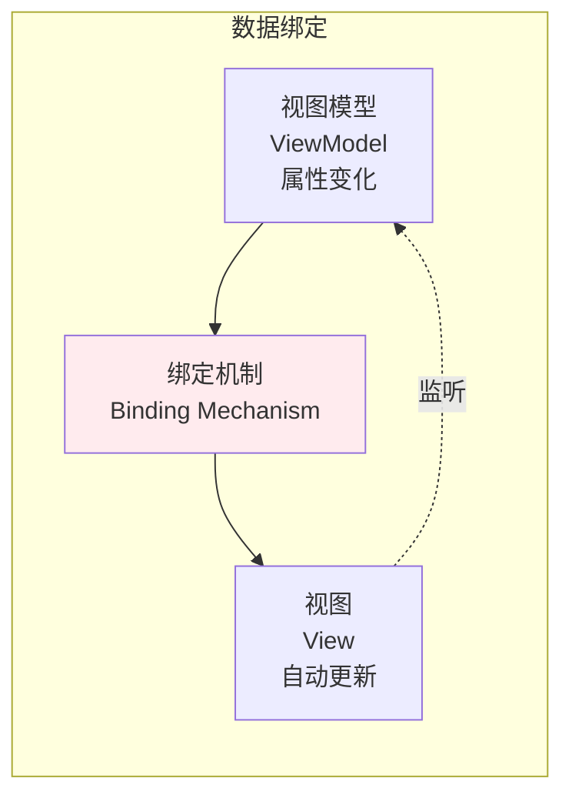
```mermaid
graph LR
    subgraph "数据绑定"
        ViewModel[视图模型<br/>ViewModel<br/>属性变化]
        Binding[绑定机制<br/>Binding Mechanism]
        View[视图<br/>View<br/>自动更新]
        
        ViewModel --> Binding
        Binding --> View
        View -.监听.-> ViewModel
    end
    
    style Binding fill:#ffebee
```

**类型**：
- **单向绑定**：ViewModel → View
- **双向绑定**：ViewModel ↔ View
- **命令绑定**：View → ViewModel（命令）

**特点**：
- 自动同步
- 减少样板代码
- 声明式编程
- 解耦视图和视图模型

---

## 设计规则

### MVVM设计规则

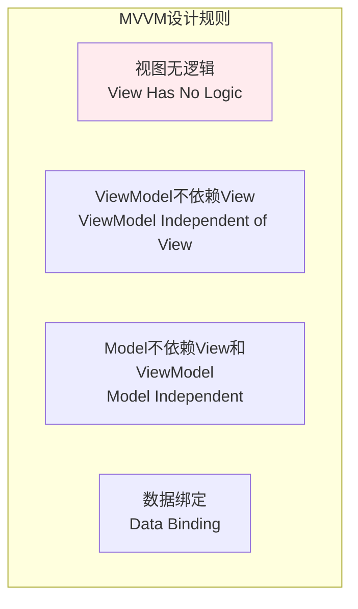
```mermaid
graph TB
    subgraph "MVVM设计规则"
        Rule1[视图无逻辑<br/>View Has No Logic]
        Rule2[ViewModel不依赖View<br/>ViewModel Independent of View]
        Rule3[Model不依赖View和ViewModel<br/>Model Independent]
        Rule4[数据绑定<br/>Data Binding]
    end
    
    style Rule1 fill:#ffebee
```

**规则说明**：
- ✅ **视图无逻辑**：视图只负责展示，不包含业务逻辑
- ✅ **ViewModel不依赖View**：ViewModel可以独立测试
- ✅ **Model不依赖View和ViewModel**：Model可以在不同场景复用
- ✅ **数据绑定**：通过数据绑定实现视图与视图模型的同步

### 依赖方向规则

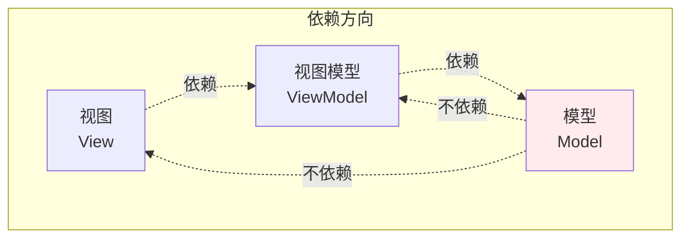
```mermaid
graph TB
    subgraph "依赖方向"
        View[视图<br/>View]
        ViewModel[视图模型<br/>ViewModel]
        Model[模型<br/>Model]
        
        View -.依赖.-> ViewModel
        ViewModel -.依赖.-> Model
        Model -.不依赖.-> View
        Model -.不依赖.-> ViewModel
    end
    
    style Model fill:#ffebee
```

**规则说明**：
- ✅ **View依赖ViewModel**：视图通过绑定依赖视图模型
- ✅ **ViewModel依赖Model**：视图模型使用模型的数据和逻辑
- ✅ **Model独立**：模型不依赖View和ViewModel

---

## 优缺点分析

### 优点

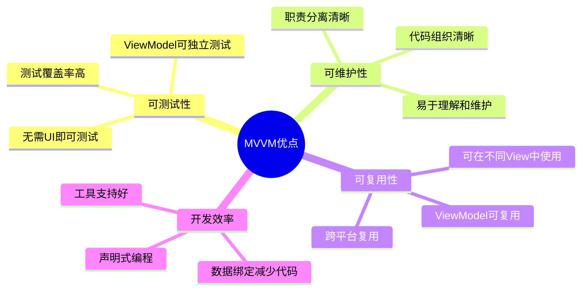
```mermaid
mindmap
  root((MVVM优点))
    可测试性
      ViewModel可独立测试
      无需UI即可测试
      测试覆盖率高
    可维护性
      职责分离清晰
      易于理解和维护
      代码组织清晰
    可复用性
      ViewModel可复用
      可在不同View中使用
      跨平台复用
    开发效率
      数据绑定减少代码
      声明式编程
      工具支持好
```

**详细说明**：
- ✅ **可测试性**：ViewModel可以独立测试，无需UI
- ✅ **可维护性**：职责分离清晰，易于维护
- ✅ **可复用性**：ViewModel可以在不同视图中复用
- ✅ **开发效率**：数据绑定减少样板代码
- ✅ **工具支持**：现代框架都有良好的MVVM支持

### 缺点

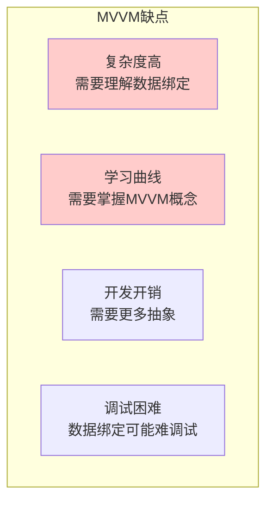
```mermaid
graph TB
    subgraph "MVVM缺点"
        Complexity[复杂度高<br/>需要理解数据绑定]
        Learning[学习曲线<br/>需要掌握MVVM概念]
        Overhead[开发开销<br/>需要更多抽象]
        Debug[调试困难<br/>数据绑定可能难调试]
    end
    
    style Complexity fill:#ffcccb
    style Learning fill:#ffcccb
```

**详细说明**：
- ❌ **复杂度高**：需要理解数据绑定和MVVM概念
- ❌ **学习曲线**：需要掌握MVVM的设计思想
- ❌ **开发开销**：需要创建ViewModel，增加代码量
- ❌ **调试困难**：数据绑定可能难以调试
- ❌ **可能过度设计**：简单UI可能不需要MVVM

---

## 实践指南

### MVVM实施步骤

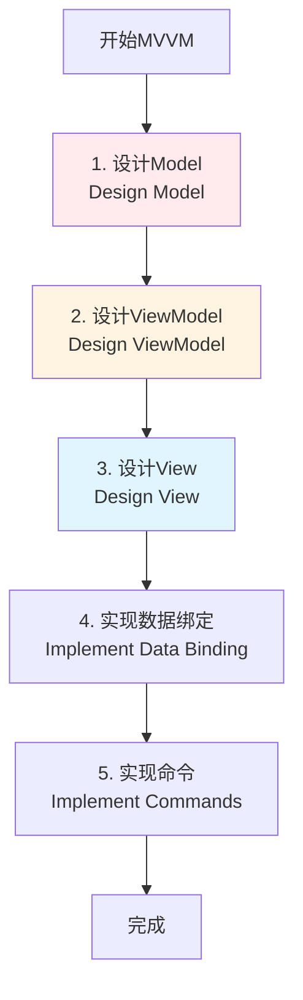
```mermaid
graph TD
    Start[开始MVVM] --> Step1[1. 设计Model<br/>Design Model]
    Step1 --> Step2[2. 设计ViewModel<br/>Design ViewModel]
    Step2 --> Step3[3. 设计View<br/>Design View]
    Step3 --> Step4[4. 实现数据绑定<br/>Implement Data Binding]
    Step4 --> Step5[5. 实现命令<br/>Implement Commands]
    Step5 --> End[完成]
    
    style Step1 fill:#ffebee
    style Step2 fill:#fff4e1
    style Step3 fill:#e1f5ff
```

### ViewModel设计策略

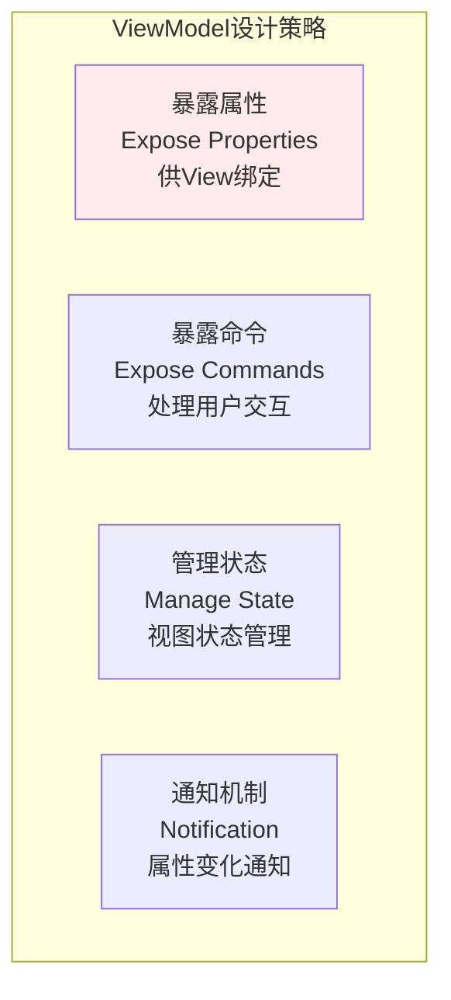
```mermaid
graph TB
    subgraph "ViewModel设计策略"
        Strategy1[暴露属性<br/>Expose Properties<br/>供View绑定]
        Strategy2[暴露命令<br/>Expose Commands<br/>处理用户交互]
        Strategy3[管理状态<br/>Manage State<br/>视图状态管理]
        Strategy4[通知机制<br/>Notification<br/>属性变化通知]
    end
    
    style Strategy1 fill:#ffebee
```

**设计建议**：
- ✅ **暴露属性**：通过属性暴露数据，支持数据绑定
- ✅ **暴露命令**：通过命令处理用户交互
- ✅ **管理状态**：管理视图相关的状态
- ✅ **通知机制**：实现属性变化通知（如INotifyPropertyChanged）

---

## 与其他架构模式的关系

### MVVM与其他架构的关系

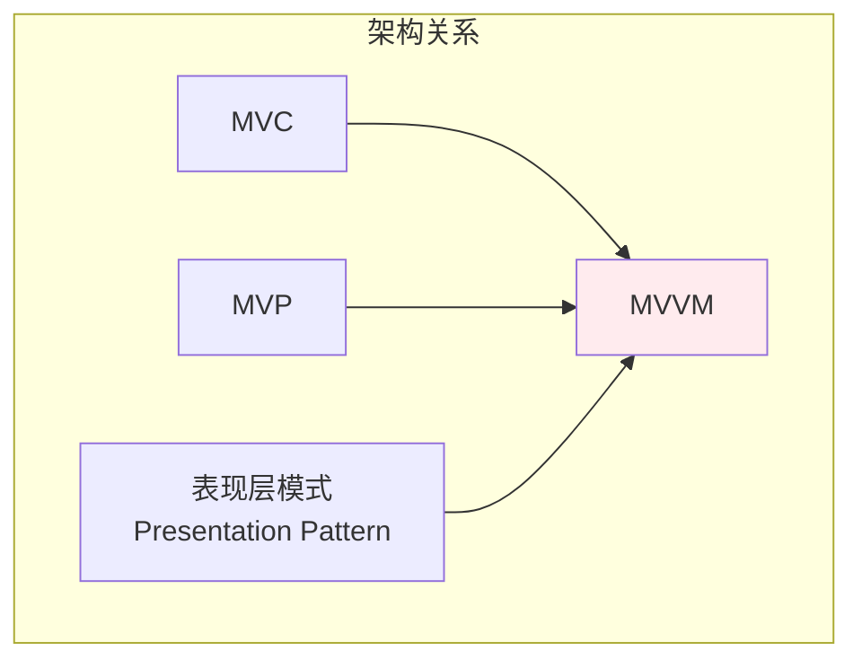
```mermaid
graph TB
    subgraph "架构关系"
        MVVM[MVVM]
        MVC[MVC]
        MVP[MVP]
        Presentation[表现层模式<br/>Presentation Pattern]
        
        MVC --> MVVM
        MVP --> MVVM
        Presentation --> MVVM
    end
    
    style MVVM fill:#ffebee
```

**关系说明**：
- **MVC**：MVVM是MVC的进化版本
- **MVP**：MVVM是MVP的改进版本，增加了数据绑定
- **表现层模式**：MVVM是表现层模式的实现

### 架构对比

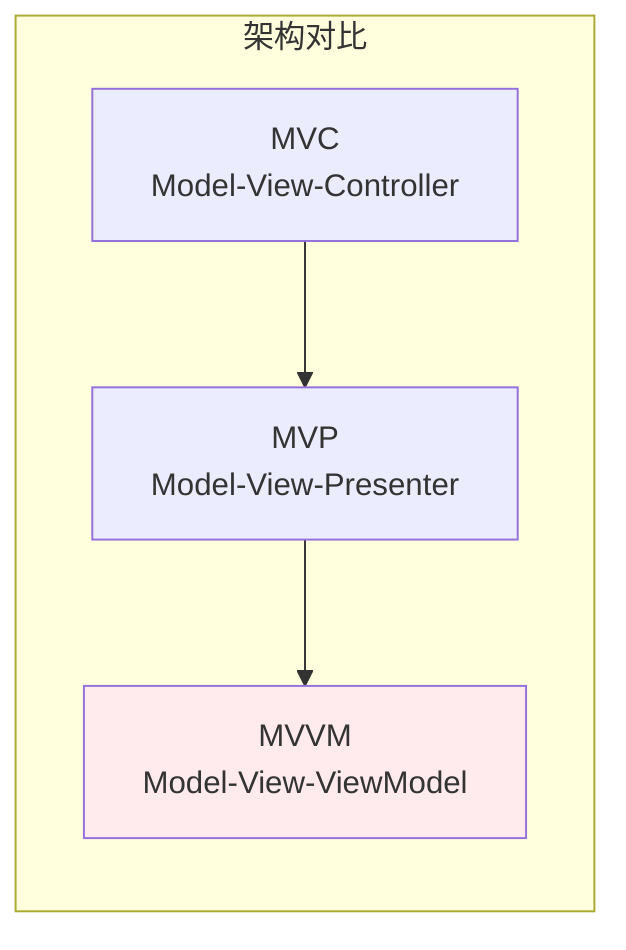
```mermaid
graph LR
    subgraph "架构对比"
        MVC[MVC<br/>Model-View-Controller]
        MVP[MVP<br/>Model-View-Presenter]
        MVVM[MVVM<br/>Model-View-ViewModel]
        
        MVC --> MVP
        MVP --> MVVM
    end
    
    style MVVM fill:#ffebee
```

---

## 应用场景

### 适用场景

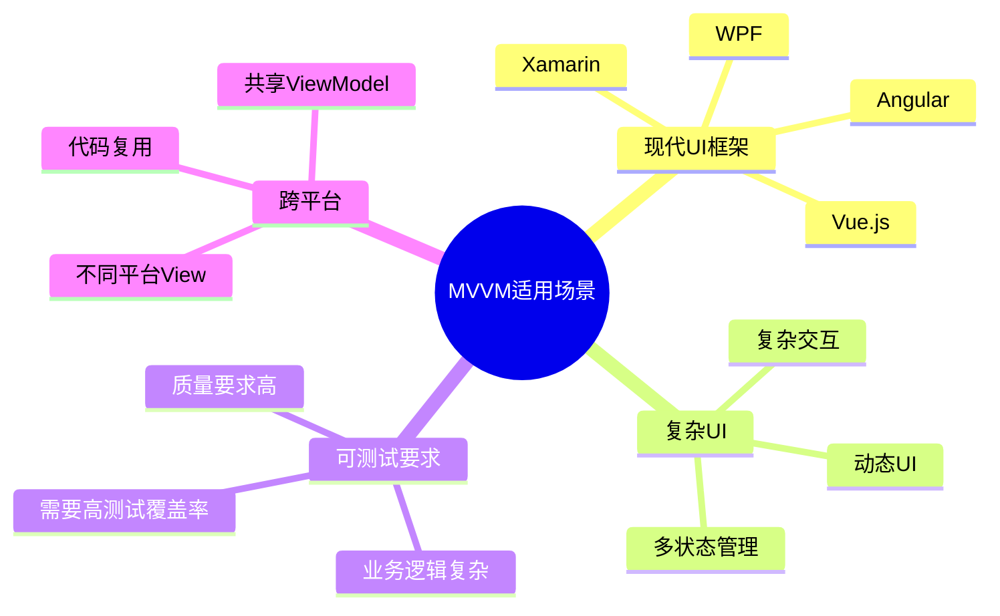
```mermaid
mindmap
  root((MVVM适用场景))
    现代UI框架
      WPF
      Xamarin
      Vue.js
      Angular
    复杂UI
      多状态管理
      复杂交互
      动态UI
    可测试要求
      需要高测试覆盖率
      业务逻辑复杂
      质量要求高
    跨平台
      共享ViewModel
      不同平台View
      代码复用
```

**具体场景**：
- ✅ **WPF应用**：Windows桌面应用
- ✅ **Xamarin应用**：跨平台移动应用
- ✅ **Vue.js应用**：现代Web应用
- ✅ **Angular应用**：企业级Web应用

### 不适用场景

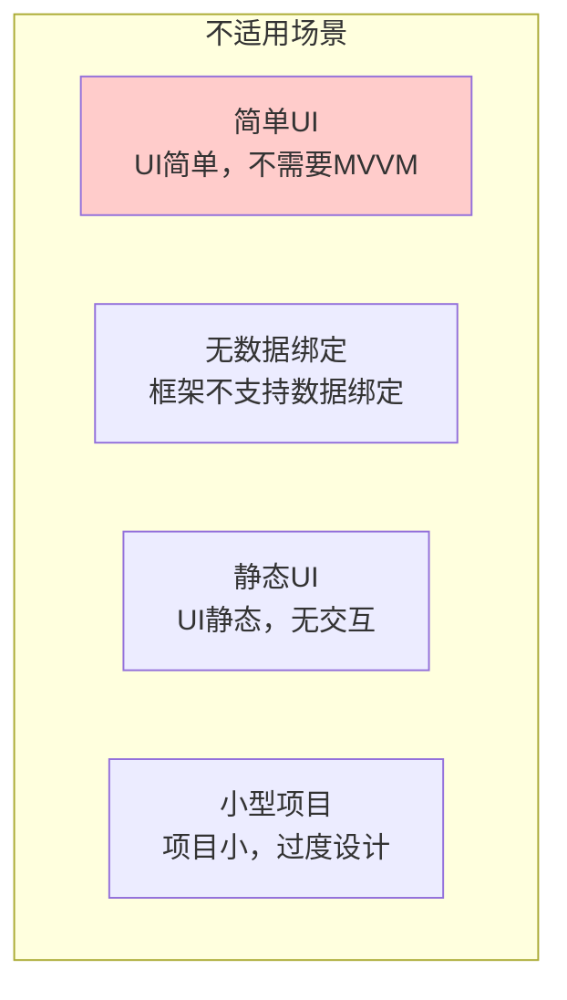
```mermaid
graph TB
    subgraph "不适用场景"
        Simple[简单UI<br/>UI简单，不需要MVVM]
        NoBinding[无数据绑定<br/>框架不支持数据绑定]
        Static[静态UI<br/>UI静态，无交互]
        Small[小型项目<br/>项目小，过度设计]
    end
    
    style Simple fill:#ffcccb
```

**不适用场景**：
- ❌ **简单UI**：UI简单，不需要MVVM
- ❌ **无数据绑定**：框架不支持数据绑定
- ❌ **静态UI**：UI静态，无交互
- ❌ **小型项目**：项目小，MVVM可能过度设计

---

## 实际案例

### 案例1：用户管理界面

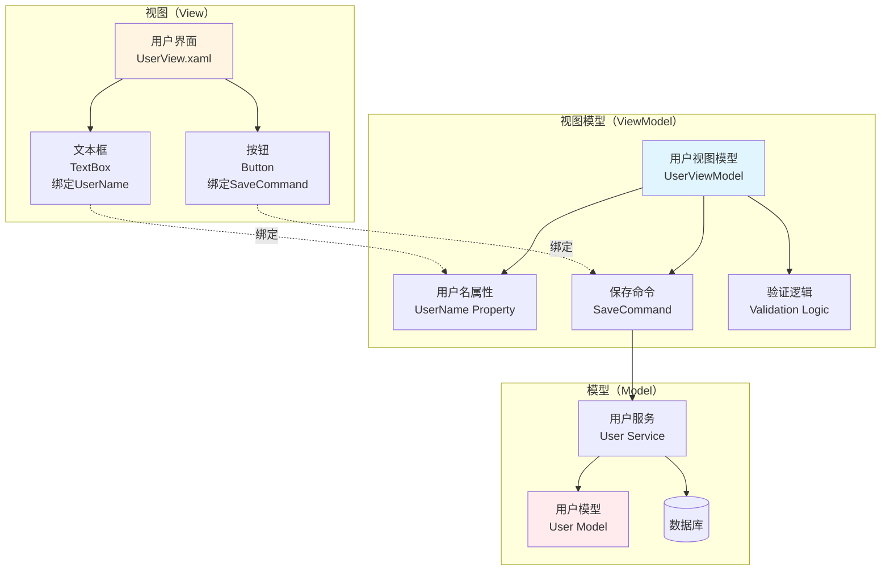
```mermaid
graph TB
    subgraph "视图（View）"
        UserView[用户界面<br/>UserView.xaml]
        TextBox[文本框<br/>TextBox<br/>绑定UserName]
        Button[按钮<br/>Button<br/>绑定SaveCommand]
    end
    
    subgraph "视图模型（ViewModel）"
        UserViewModel[用户视图模型<br/>UserViewModel]
        UserName[用户名属性<br/>UserName Property]
        SaveCommand[保存命令<br/>SaveCommand]
        Validation[验证逻辑<br/>Validation Logic]
    end
    
    subgraph "模型（Model）"
        UserModel[用户模型<br/>User Model]
        UserService[用户服务<br/>User Service]
        Database[(数据库)]
    end
    
    UserView --> TextBox
    UserView --> Button
    TextBox -.绑定.-> UserName
    Button -.绑定.-> SaveCommand
    
    UserViewModel --> UserName
    UserViewModel --> SaveCommand
    UserViewModel --> Validation
    
    SaveCommand --> UserService
    UserService --> UserModel
    UserService --> Database
    
    style UserView fill:#fff4e1
    style UserViewModel fill:#e1f5ff
    style UserModel fill:#ffebee
```

### 案例2：游戏战斗UI

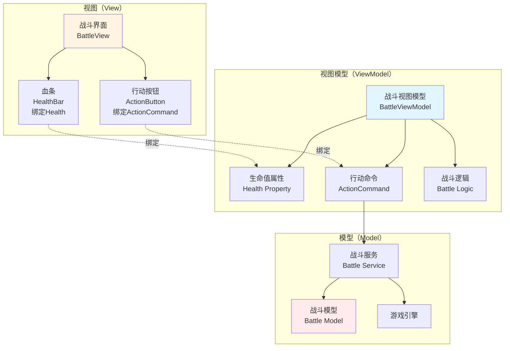
```mermaid
graph TB
    subgraph "视图（View）"
        BattleView[战斗界面<br/>BattleView]
        HealthBar[血条<br/>HealthBar<br/>绑定Health]
        ActionButton[行动按钮<br/>ActionButton<br/>绑定ActionCommand]
    end
    
    subgraph "视图模型（ViewModel）"
        BattleViewModel[战斗视图模型<br/>BattleViewModel]
        Health[生命值属性<br/>Health Property]
        ActionCommand[行动命令<br/>ActionCommand]
        BattleLogic[战斗逻辑<br/>Battle Logic]
    end
    
    subgraph "模型（Model）"
        BattleModel[战斗模型<br/>Battle Model]
        BattleService[战斗服务<br/>Battle Service]
        GameEngine[游戏引擎]
    end
    
    BattleView --> HealthBar
    BattleView --> ActionButton
    HealthBar -.绑定.-> Health
    ActionButton -.绑定.-> ActionCommand
    
    BattleViewModel --> Health
    BattleViewModel --> ActionCommand
    BattleViewModel --> BattleLogic
    
    ActionCommand --> BattleService
    BattleService --> BattleModel
    BattleService --> GameEngine
    
    style BattleView fill:#fff4e1
    style BattleViewModel fill:#e1f5ff
    style BattleModel fill:#ffebee
```

---

## 设计原则

### MVVM设计原则

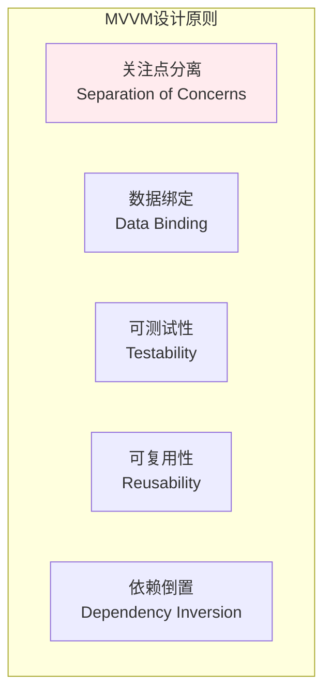
```mermaid
graph TB
    subgraph "MVVM设计原则"
        Principle1[关注点分离<br/>Separation of Concerns]
        Principle2[数据绑定<br/>Data Binding]
        Principle3[可测试性<br/>Testability]
        Principle4[可复用性<br/>Reusability]
        Principle5[依赖倒置<br/>Dependency Inversion]
    end
    
    style Principle1 fill:#ffebee
```

**核心原则**：
- **关注点分离**：视图、视图模型、模型各司其职
- **数据绑定**：通过数据绑定实现自动同步
- **可测试性**：ViewModel可以独立测试
- **可复用性**：ViewModel可以在不同视图中复用
- **依赖倒置**：视图依赖抽象（ViewModel），而非具体实现

---

## 总结

MVVM架构模式通过将UI逻辑与业务逻辑分离，使用数据绑定实现视图与视图模型的自动同步，是现代UI开发的重要架构模式。

**核心价值**：
- 🧪 **可测试性**：ViewModel可以独立测试，无需UI
- 🔧 **可维护性**：职责分离清晰，易于维护
- ♻️ **可复用性**：ViewModel可以在不同视图中复用
- ⚡ **开发效率**：数据绑定减少样板代码
- 🛠️ **工具支持**：现代框架都有良好的MVVM支持

**适用场景**：
- ✅ 现代UI框架
- ✅ 复杂UI
- ✅ 可测试要求
- ✅ 跨平台

**注意事项**：
- ⚠️ 复杂度较高，需要理解数据绑定
- ⚠️ 学习曲线，需要掌握MVVM概念
- ⚠️ 开发开销，需要创建ViewModel
- ⚠️ 简单UI可能不需要MVVM

MVVM是构建可测试、可维护、可复用UI的优秀架构模式，特别适合现代UI框架和复杂UI应用。

