# Saga架构模式（Saga Architecture Pattern）

## 目录

- [概述](#概述)
- [核心概念](#核心概念)
- [架构结构](#架构结构)
- [设计规则](#设计规则)
- [优缺点分析](#优缺点分析)
- [实践指南](#实践指南)
- [与其他架构模式的关系](#与其他架构模式的关系)
- [应用场景](#应用场景)
- [实际案例](#实际案例)
- [设计原则](#设计原则)
- [总结](#总结)

---

## 概述

**Saga架构模式（Saga Architecture Pattern）**是一种用于管理分布式系统中长时间运行事务的架构模式。它将一个长事务分解为一系列可以独立执行和补偿的本地事务，通过补偿机制保证最终一致性。

### 什么是Saga？

Saga将长事务分解为多个本地事务：

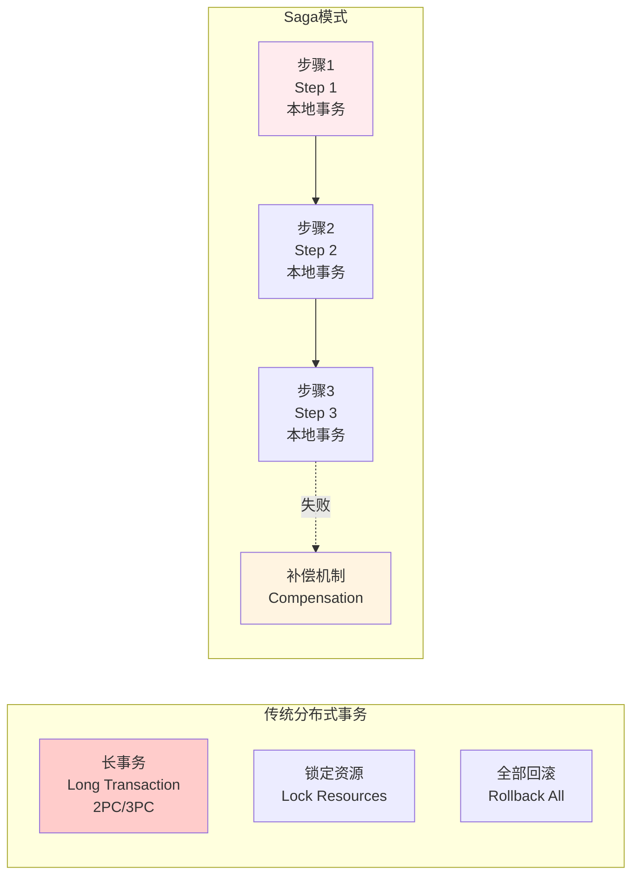
```mermaid
graph LR
    subgraph "传统分布式事务"
        LongTransaction[长事务<br/>Long Transaction<br/>2PC/3PC]
        Lock[锁定资源<br/>Lock Resources]
        Rollback[全部回滚<br/>Rollback All]
    end
    
    subgraph "Saga模式"
        Step1[步骤1<br/>Step 1<br/>本地事务]
        Step2[步骤2<br/>Step 2<br/>本地事务]
        Step3[步骤3<br/>Step 3<br/>本地事务]
        Compensate[补偿机制<br/>Compensation]
        
        Step1 --> Step2
        Step2 --> Step3
        Step3 -.失败.-> Compensate
    end
    
    style LongTransaction fill:#ffcccb
    style Step1 fill:#ffebee
    style Compensate fill:#fff4e1
```

**核心原则**：
- **分解事务**：将长事务分解为多个本地事务
- **顺序执行**：按顺序执行各个步骤
- **补偿机制**：失败时执行补偿操作
- **最终一致性**：保证最终一致性，而非强一致性

### 为什么需要Saga？

Saga解决了以下问题：
- **长事务问题**：分布式系统中长事务难以管理
- **资源锁定**：避免长时间锁定资源
- **性能问题**：提高系统性能和可用性
- **可扩展性**：支持微服务架构
- **容错性**：通过补偿机制处理失败

---

## 核心概念

### 核心思想

Saga的核心思想是**补偿事务（Compensating Transactions）**：

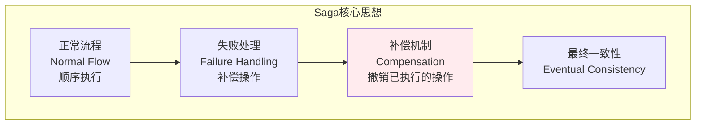
```mermaid
graph TB
    subgraph "Saga核心思想"
        Normal[正常流程<br/>Normal Flow<br/>顺序执行]
        Failure[失败处理<br/>Failure Handling<br/>补偿操作]
        Compensation[补偿机制<br/>Compensation<br/>撤销已执行的操作]
        Consistency[最终一致性<br/>Eventual Consistency]
    end
    
    Normal --> Failure
    Failure --> Compensation
    Compensation --> Consistency
    
    style Compensation fill:#ffebee
```

**关键原则**：
1. **分解事务**：将长事务分解为多个本地事务
2. **顺序执行**：按顺序执行各个步骤
3. **补偿机制**：失败时执行补偿操作撤销已执行的操作
4. **最终一致性**：保证最终一致性，而非强一致性

### 基本特征

- **本地事务**：每个步骤是独立的本地事务
- **顺序执行**：按顺序执行各个步骤
- **补偿机制**：失败时执行补偿操作
- **最终一致性**：保证最终一致性
- **无锁设计**：不需要长时间锁定资源

---

## 架构结构

### Saga完整架构

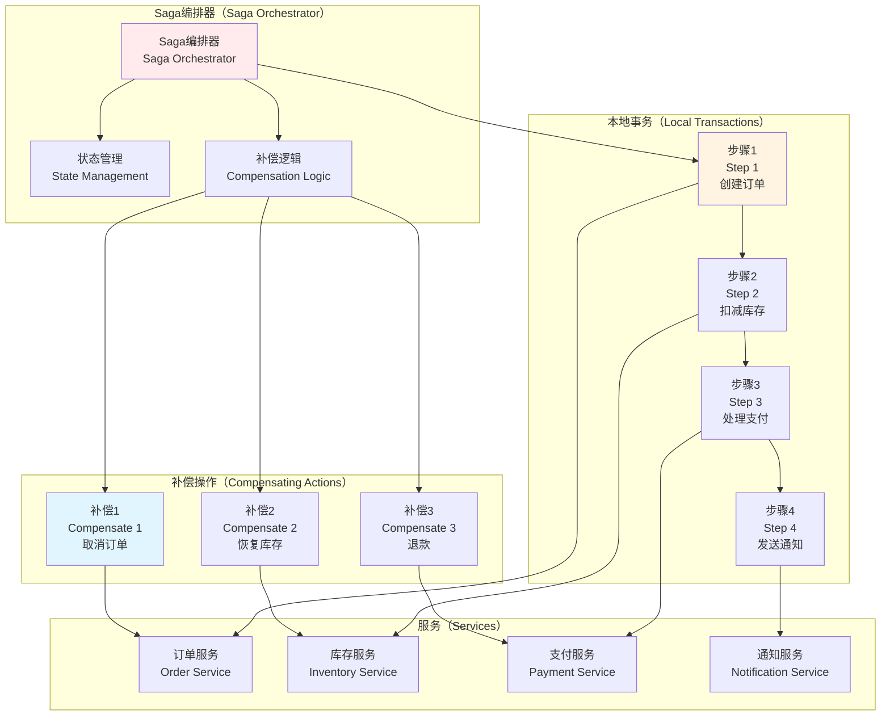
```mermaid
graph TB
    subgraph "Saga编排器（Saga Orchestrator）"
        Orchestrator[Saga编排器<br/>Saga Orchestrator]
        State[状态管理<br/>State Management]
        Compensation[补偿逻辑<br/>Compensation Logic]
    end
    
    subgraph "本地事务（Local Transactions）"
        Step1[步骤1<br/>Step 1<br/>创建订单]
        Step2[步骤2<br/>Step 2<br/>扣减库存]
        Step3[步骤3<br/>Step 3<br/>处理支付]
        Step4[步骤4<br/>Step 4<br/>发送通知]
    end
    
    subgraph "补偿操作（Compensating Actions）"
        Compensate1[补偿1<br/>Compensate 1<br/>取消订单]
        Compensate2[补偿2<br/>Compensate 2<br/>恢复库存]
        Compensate3[补偿3<br/>Compensate 3<br/>退款]
    end
    
    subgraph "服务（Services）"
        OrderService[订单服务<br/>Order Service]
        InventoryService[库存服务<br/>Inventory Service]
        PaymentService[支付服务<br/>Payment Service]
        NotificationService[通知服务<br/>Notification Service]
    end
    
    Orchestrator --> State
    Orchestrator --> Compensation
    
    Orchestrator --> Step1
    Step1 --> Step2
    Step2 --> Step3
    Step3 --> Step4
    
    Step1 --> OrderService
    Step2 --> InventoryService
    Step3 --> PaymentService
    Step4 --> NotificationService
    
    Compensation --> Compensate1
    Compensation --> Compensate2
    Compensation --> Compensate3
    
    Compensate1 --> OrderService
    Compensate2 --> InventoryService
    Compensate3 --> PaymentService
    
    style Orchestrator fill:#ffebee
    style Step1 fill:#fff4e1
    style Compensate1 fill:#e1f5ff
```

### 核心组件详解

#### 1. Saga编排器（Saga Orchestrator）

**定义**：协调Saga执行的组件

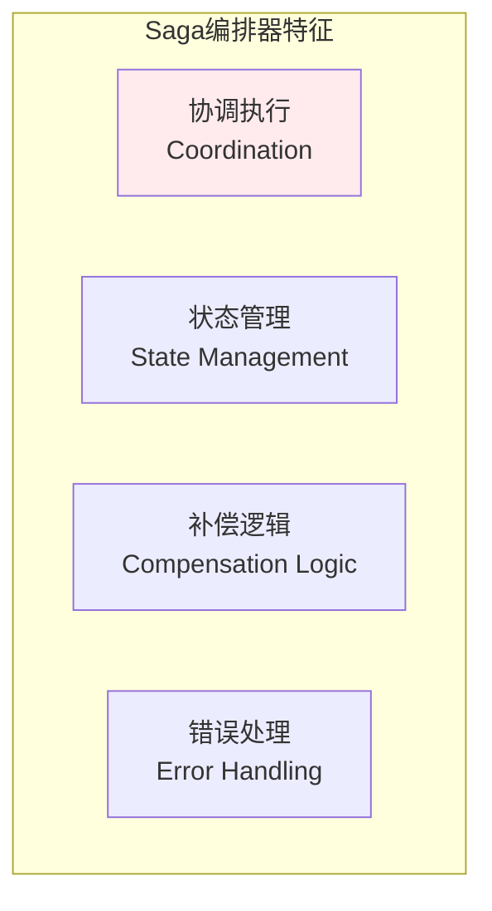
```mermaid
graph TB
    subgraph "Saga编排器特征"
        Coordination[协调执行<br/>Coordination]
        StateManagement[状态管理<br/>State Management]
        Compensation[补偿逻辑<br/>Compensation Logic]
        ErrorHandling[错误处理<br/>Error Handling]
    end
    
    style Coordination fill:#ffebee
```

**职责**：
- 协调各个步骤的执行
- 管理Saga状态
- 处理失败和补偿
- 保证执行顺序

**特点**：
- 集中式协调
- 状态管理
- 补偿逻辑
- 错误处理

#### 2. 本地事务（Local Transaction）

**定义**：Saga中的一个步骤，是独立的本地事务

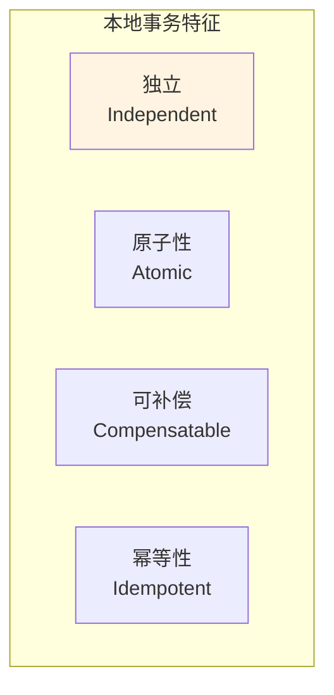
```mermaid
graph TB
    subgraph "本地事务特征"
        Independent[独立<br/>Independent]
        Atomic[原子性<br/>Atomic]
        Compensatable[可补偿<br/>Compensatable]
        Idempotent[幂等性<br/>Idempotent]
    end
    
    style Independent fill:#fff4e1
```

**特点**：
- 独立的本地事务
- 原子性保证
- 可以补偿
- 应该支持幂等性

**示例**：
- 创建订单（CreateOrder）
- 扣减库存（ReduceInventory）
- 处理支付（ProcessPayment）

#### 3. 补偿操作（Compensating Action）

**定义**：撤销已执行操作的补偿操作

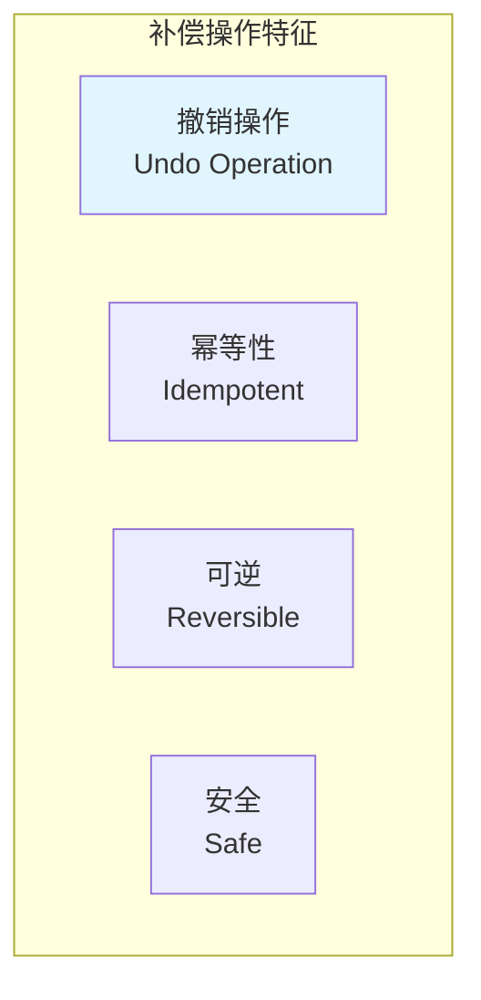
```mermaid
graph TB
    subgraph "补偿操作特征"
        Undo[撤销操作<br/>Undo Operation]
        Idempotent[幂等性<br/>Idempotent]
        Reversible[可逆<br/>Reversible]
        Safe[安全<br/>Safe]
    end
    
    style Undo fill:#e1f5ff
```

**特点**：
- 撤销已执行的操作
- 应该支持幂等性
- 应该是可逆的
- 应该是安全的

**示例**：
- 取消订单（CancelOrder）
- 恢复库存（RestoreInventory）
- 退款（Refund）

#### 4. Saga状态（Saga State）

**定义**：Saga执行的状态

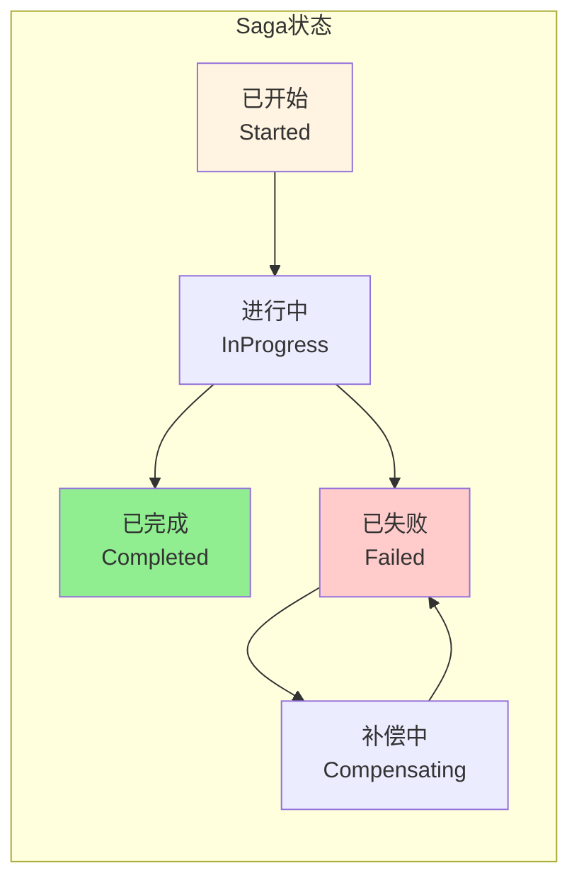
```mermaid
graph LR
    subgraph "Saga状态"
        Started[已开始<br/>Started]
        InProgress[进行中<br/>InProgress]
        Completed[已完成<br/>Completed]
        Compensating[补偿中<br/>Compensating]
        Failed[已失败<br/>Failed]
        
        Started --> InProgress
        InProgress --> Completed
        InProgress --> Failed
        Failed --> Compensating
        Compensating --> Failed
    end
    
    style Started fill:#fff4e1
    style Completed fill:#90ee90
    style Failed fill:#ffcccb
```

**状态说明**：
- **Started**：Saga已开始
- **InProgress**：正在执行中
- **Completed**：所有步骤完成
- **Compensating**：正在执行补偿
- **Failed**：执行失败

---

## 设计规则

### Saga设计规则

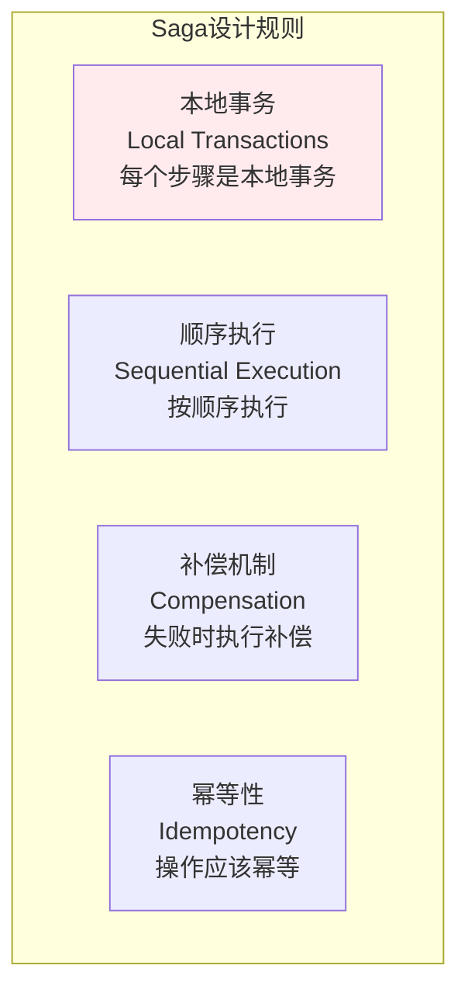
```mermaid
graph TB
    subgraph "Saga设计规则"
        Rule1[本地事务<br/>Local Transactions<br/>每个步骤是本地事务]
        Rule2[顺序执行<br/>Sequential Execution<br/>按顺序执行]
        Rule3[补偿机制<br/>Compensation<br/>失败时执行补偿]
        Rule4[幂等性<br/>Idempotency<br/>操作应该幂等]
    end
    
    style Rule1 fill:#ffebee
```

**规则说明**：
- ✅ **本地事务**：每个步骤是独立的本地事务
- ✅ **顺序执行**：按顺序执行各个步骤
- ✅ **补偿机制**：失败时执行补偿操作
- ✅ **幂等性**：操作应该支持幂等性

### 补偿设计规则

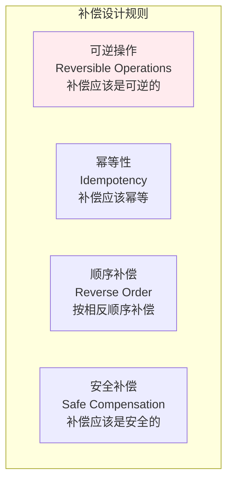
```mermaid
graph TB
    subgraph "补偿设计规则"
        Rule1[可逆操作<br/>Reversible Operations<br/>补偿应该是可逆的]
        Rule2[幂等性<br/>Idempotency<br/>补偿应该幂等]
        Rule3[顺序补偿<br/>Reverse Order<br/>按相反顺序补偿]
        Rule4[安全补偿<br/>Safe Compensation<br/>补偿应该是安全的]
    end
    
    style Rule1 fill:#ffebee
```

**规则说明**：
- ✅ **可逆操作**：补偿操作应该能够撤销原操作
- ✅ **幂等性**：补偿操作应该支持幂等性
- ✅ **顺序补偿**：按相反顺序执行补偿
- ✅ **安全补偿**：补偿操作应该是安全的

---

## 优缺点分析

### 优点

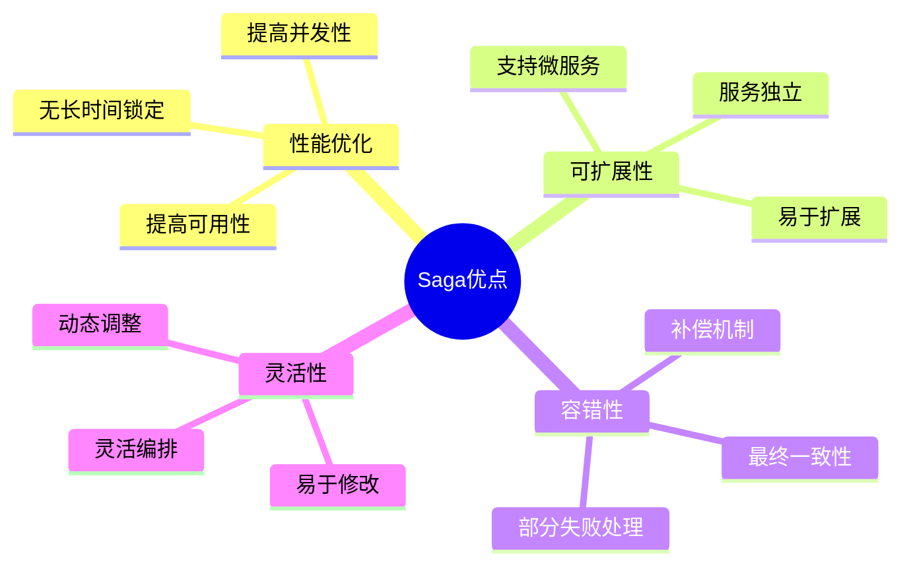
```mermaid
mindmap
  root((Saga优点))
    性能优化
      无长时间锁定
      提高并发性
      提高可用性
    可扩展性
      支持微服务
      服务独立
      易于扩展
    容错性
      补偿机制
      部分失败处理
      最终一致性
    灵活性
      灵活编排
      动态调整
      易于修改
```

**详细说明**：
- ✅ **性能优化**：无长时间锁定资源，提高并发性和可用性
- ✅ **可扩展性**：支持微服务架构，服务独立扩展
- ✅ **容错性**：通过补偿机制处理失败，保证最终一致性
- ✅ **灵活性**：可以灵活编排事务步骤，易于修改

### 缺点

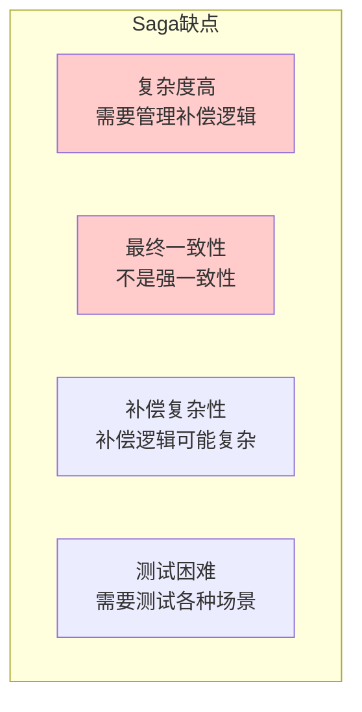
```mermaid
graph TB
    subgraph "Saga缺点"
        Complexity[复杂度高<br/>需要管理补偿逻辑]
        Consistency[最终一致性<br/>不是强一致性]
        Compensation[补偿复杂性<br/>补偿逻辑可能复杂]
        Testing[测试困难<br/>需要测试各种场景]
    end
    
    style Complexity fill:#ffcccb
    style Consistency fill:#ffcccb
```

**详细说明**：
- ❌ **复杂度高**：需要管理补偿逻辑和状态
- ❌ **最终一致性**：只能保证最终一致性，不是强一致性
- ❌ **补偿复杂性**：补偿逻辑可能很复杂
- ❌ **测试困难**：需要测试各种成功和失败场景
- ❌ **数据一致性**：可能存在中间状态不一致

---

## 实践指南

### Saga实施步骤

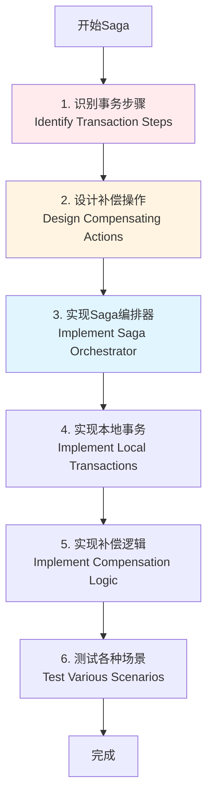
```mermaid
graph TD
    Start[开始Saga] --> Step1[1. 识别事务步骤<br/>Identify Transaction Steps]
    Step1 --> Step2[2. 设计补偿操作<br/>Design Compensating Actions]
    Step2 --> Step3[3. 实现Saga编排器<br/>Implement Saga Orchestrator]
    Step3 --> Step4[4. 实现本地事务<br/>Implement Local Transactions]
    Step4 --> Step5[5. 实现补偿逻辑<br/>Implement Compensation Logic]
    Step5 --> Step6[6. 测试各种场景<br/>Test Various Scenarios]
    Step6 --> End[完成]
    
    style Step1 fill:#ffebee
    style Step2 fill:#fff4e1
    style Step3 fill:#e1f5ff
```

### Saga编排模式

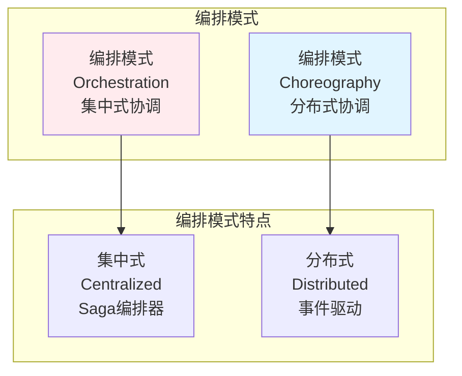
```mermaid
graph TB
    subgraph "编排模式"
        Orchestration[编排模式<br/>Orchestration<br/>集中式协调]
        Choreography[编排模式<br/>Choreography<br/>分布式协调]
    end
    
    subgraph "编排模式特点"
        Central[集中式<br/>Centralized<br/>Saga编排器]
        Distributed[分布式<br/>Distributed<br/>事件驱动]
    end
    
    Orchestration --> Central
    Choreography --> Distributed
    
    style Orchestration fill:#ffebee
    style Choreography fill:#e1f5ff
```

**编排模式**：
- **编排模式（Orchestration）**：集中式协调，Saga编排器协调执行
- **编排模式（Choreography）**：分布式协调，通过事件驱动

---

## 与其他架构模式的关系

### Saga与其他架构的关系

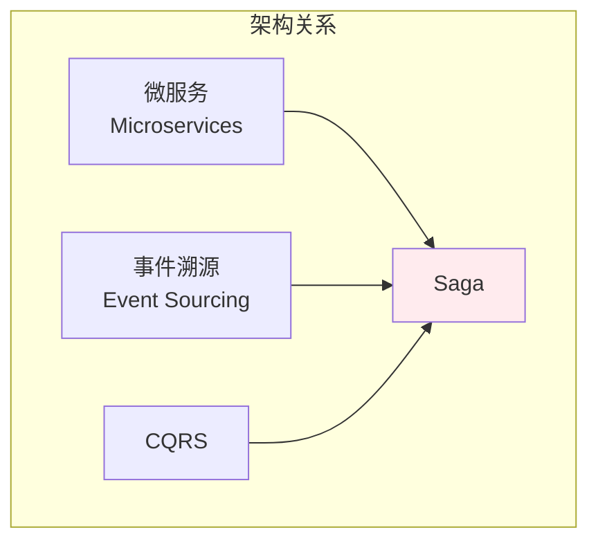
```mermaid
graph TB
    subgraph "架构关系"
        Saga[Saga]
        Microservices[微服务<br/>Microservices]
        EventSourcing[事件溯源<br/>Event Sourcing]
        CQRS[CQRS]
        
        Microservices --> Saga
        EventSourcing --> Saga
        CQRS --> Saga
    end
    
    style Saga fill:#ffebee
```

**关系说明**：
- **微服务**：Saga是微服务架构中处理分布式事务的解决方案
- **事件溯源**：Saga可以与事件溯源结合使用
- **CQRS**：Saga可以与CQRS结合使用

---

## 应用场景

### 适用场景

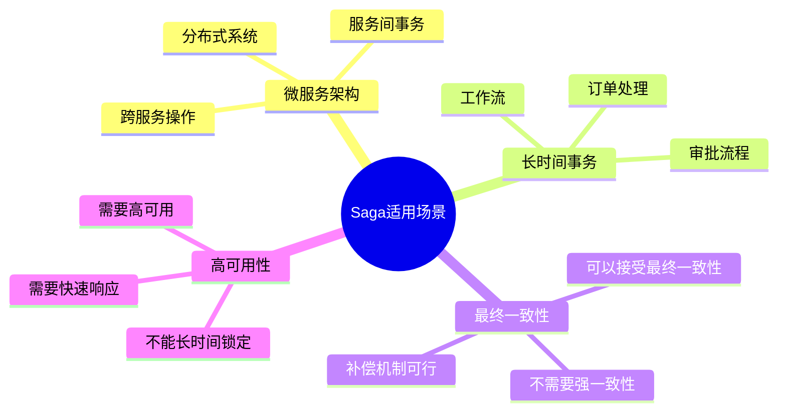
```mermaid
mindmap
  root((Saga适用场景))
    微服务架构
      分布式系统
      服务间事务
      跨服务操作
    长时间事务
      订单处理
      工作流
      审批流程
    最终一致性
      可以接受最终一致性
      不需要强一致性
      补偿机制可行
    高可用性
      需要高可用
      不能长时间锁定
      需要快速响应
```

**具体场景**：
- ✅ **微服务架构**：处理跨服务的分布式事务
- ✅ **订单处理**：电商订单创建、支付、发货流程
- ✅ **工作流系统**：多步骤工作流处理
- ✅ **审批流程**：多级审批流程

### 不适用场景

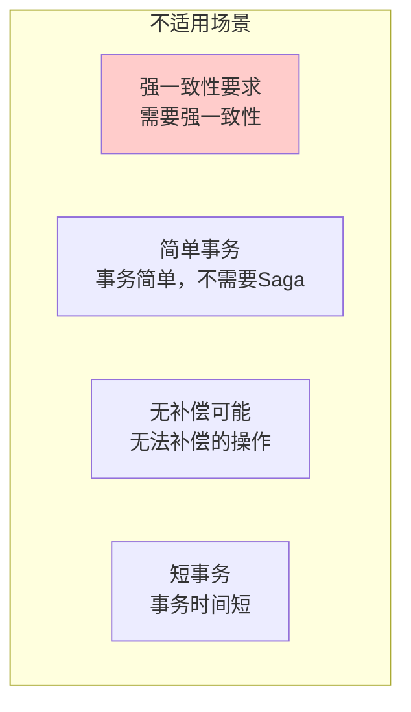
```mermaid
graph TB
    subgraph "不适用场景"
        StrongConsistency[强一致性要求<br/>需要强一致性]
        Simple[简单事务<br/>事务简单，不需要Saga]
        NoCompensation[无补偿可能<br/>无法补偿的操作]
        ShortTransaction[短事务<br/>事务时间短]
    end
    
    style StrongConsistency fill:#ffcccb
```

**不适用场景**：
- ❌ **强一致性要求**：需要强一致性的场景
- ❌ **简单事务**：事务简单，不需要Saga
- ❌ **无补偿可能**：无法补偿的操作（如发送邮件）
- ❌ **短事务**：事务时间短，可以使用传统事务

---

## 实际案例

### 案例1：电商订单处理

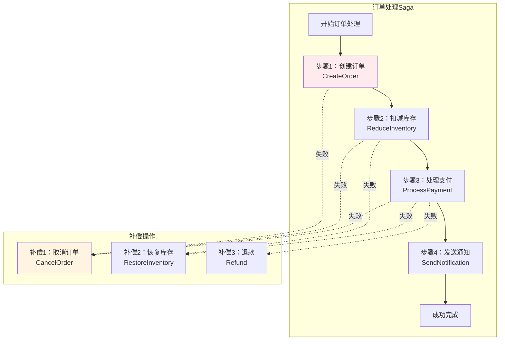
```mermaid
graph TB
    subgraph "订单处理Saga"
        Start[开始订单处理]
        Step1[步骤1：创建订单<br/>CreateOrder]
        Step2[步骤2：扣减库存<br/>ReduceInventory]
        Step3[步骤3：处理支付<br/>ProcessPayment]
        Step4[步骤4：发送通知<br/>SendNotification]
        Success[成功完成]
    end
    
    subgraph "补偿操作"
        Compensate1[补偿1：取消订单<br/>CancelOrder]
        Compensate2[补偿2：恢复库存<br/>RestoreInventory]
        Compensate3[补偿3：退款<br/>Refund]
    end
    
    Start --> Step1
    Step1 --> Step2
    Step2 --> Step3
    Step3 --> Step4
    Step4 --> Success
    
    Step1 -.失败.-> Compensate1
    Step2 -.失败.-> Compensate2
    Step2 -.失败.-> Compensate1
    Step3 -.失败.-> Compensate3
    Step3 -.失败.-> Compensate2
    Step3 -.失败.-> Compensate1
    
    style Step1 fill:#ffebee
    style Compensate1 fill:#fff4e1
```

### 案例2：游戏战斗流程

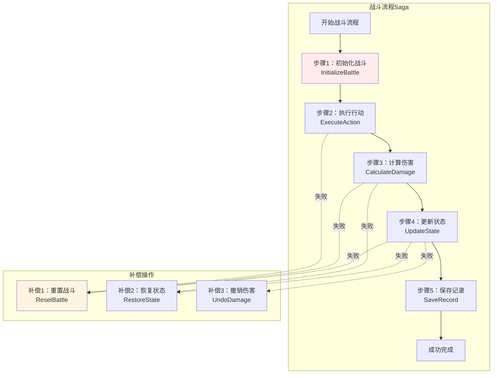
```mermaid
graph TB
    subgraph "战斗流程Saga"
        Start[开始战斗流程]
        Step1[步骤1：初始化战斗<br/>InitializeBattle]
        Step2[步骤2：执行行动<br/>ExecuteAction]
        Step3[步骤3：计算伤害<br/>CalculateDamage]
        Step4[步骤4：更新状态<br/>UpdateState]
        Step5[步骤5：保存记录<br/>SaveRecord]
        Success[成功完成]
    end
    
    subgraph "补偿操作"
        Compensate1[补偿1：重置战斗<br/>ResetBattle]
        Compensate2[补偿2：恢复状态<br/>RestoreState]
        Compensate3[补偿3：撤销伤害<br/>UndoDamage]
    end
    
    Start --> Step1
    Step1 --> Step2
    Step2 --> Step3
    Step3 --> Step4
    Step4 --> Step5
    Step5 --> Success
    
    Step2 -.失败.-> Compensate1
    Step3 -.失败.-> Compensate2
    Step3 -.失败.-> Compensate1
    Step4 -.失败.-> Compensate3
    Step4 -.失败.-> Compensate2
    Step4 -.失败.-> Compensate1
    
    style Step1 fill:#ffebee
    style Compensate1 fill:#fff4e1
```

---

## 设计原则

### Saga设计原则

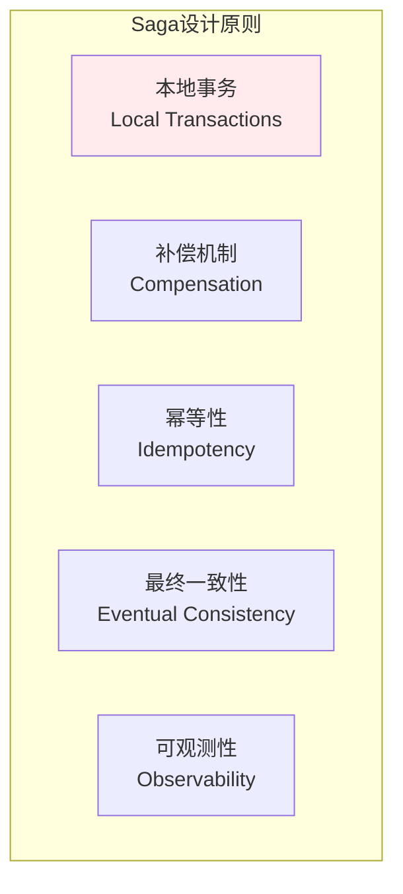
```mermaid
graph TB
    subgraph "Saga设计原则"
        Principle1[本地事务<br/>Local Transactions]
        Principle2[补偿机制<br/>Compensation]
        Principle3[幂等性<br/>Idempotency]
        Principle4[最终一致性<br/>Eventual Consistency]
        Principle5[可观测性<br/>Observability]
    end
    
    style Principle1 fill:#ffebee
```

**核心原则**：
- **本地事务**：每个步骤是独立的本地事务
- **补偿机制**：失败时执行补偿操作
- **幂等性**：操作应该支持幂等性
- **最终一致性**：保证最终一致性
- **可观测性**：提供Saga执行的可观测性

---

## 总结

Saga架构模式通过将长事务分解为多个本地事务，使用补偿机制处理失败，是微服务架构中处理分布式事务的重要解决方案。

**核心价值**：
- 🚀 **性能优化**：无长时间锁定资源，提高并发性和可用性
- 📈 **可扩展性**：支持微服务架构，服务独立扩展
- 🛡️ **容错性**：通过补偿机制处理失败，保证最终一致性
- 🔧 **灵活性**：可以灵活编排事务步骤，易于修改

**适用场景**：
- ✅ 微服务架构
- ✅ 长时间事务
- ✅ 最终一致性
- ✅ 高可用性

**注意事项**：
- ⚠️ 复杂度较高，需要管理补偿逻辑
- ⚠️ 只能保证最终一致性，不是强一致性
- ⚠️ 补偿逻辑可能很复杂
- ⚠️ 测试困难，需要测试各种场景

Saga是微服务架构中处理分布式事务的优秀架构模式，特别适合需要高可用性和可扩展性的分布式系统。

