# 事件溯源架构模式（Event Sourcing Architecture Pattern）

## 目录

- [概述](#概述)
- [核心概念](#核心概念)
- [架构结构](#架构结构)
- [设计规则](#设计规则)
- [优缺点分析](#优缺点分析)
- [实践指南](#实践指南)
- [与其他架构模式的关系](#与其他架构模式的关系)
- [应用场景](#应用场景)
- [实际案例](#实际案例)
- [设计原则](#设计原则)
- [总结](#总结)

---

## 概述

**事件溯源架构模式（Event Sourcing Architecture Pattern）**是一种将系统状态变化存储为事件序列的架构模式。系统不存储当前状态，而是存储所有导致状态变化的事件，通过重放事件来重建当前状态。

### 什么是事件溯源？

事件溯源将状态变化存储为不可变的事件序列：

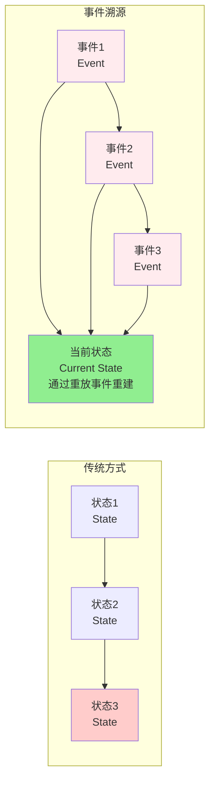

**核心原则**：
- **事件存储**：存储所有状态变化事件
- **不可变事件**：事件一旦创建不可修改
- **状态重建**：通过重放事件重建当前状态
- **完整历史**：保留完整的状态变化历史

### 为什么需要事件溯源？

事件溯源解决了以下问题：
- **完整审计**：保留所有状态变化的完整历史
- **时间旅行**：可以重建任意时间点的状态
- **调试能力**：可以重放事件来调试问题
- **业务洞察**：通过分析事件序列获得业务洞察
- **数据一致性**：通过事件保证数据一致性

---

## 核心概念

### 核心思想

事件溯源的核心思想是**事件即真相（Events as Truth）**：

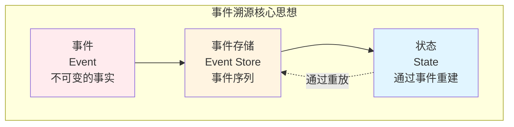

**关键原则**：
1. **事件存储**：所有状态变化都存储为事件
2. **不可变事件**：事件一旦创建不可修改
3. **状态重建**：通过重放事件重建状态
4. **完整历史**：保留完整的状态变化历史

### 基本特征

- **事件存储**：存储所有状态变化事件
- **不可变事件**：事件一旦创建不可修改
- **状态重建**：通过重放事件重建状态
- **完整历史**：保留完整的状态变化历史
- **时间旅行**：可以重建任意时间点的状态

---

## 架构结构

### 事件溯源完整架构

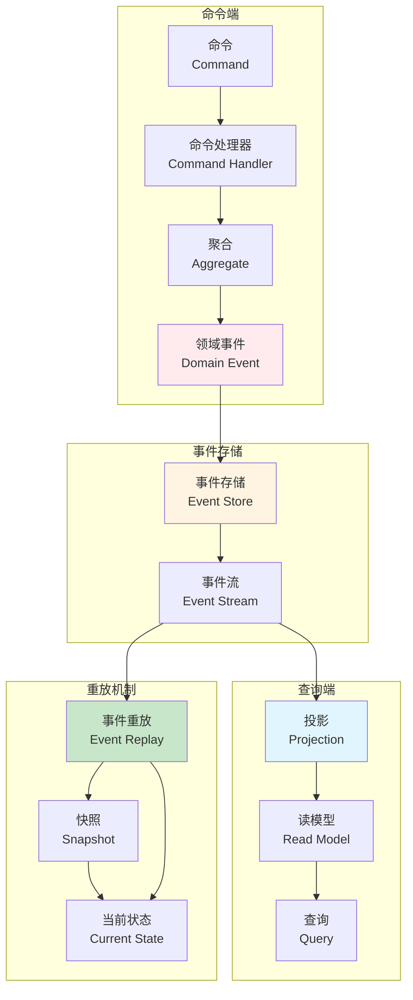

### 核心组件详解

#### 1. 事件（Event）

**定义**：表示系统中发生的重要事情

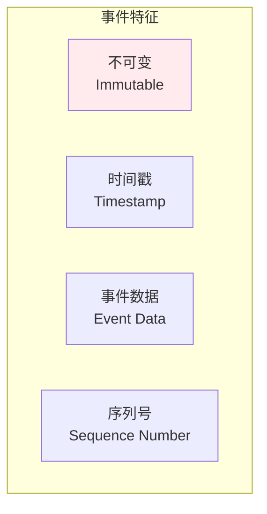

**特点**：
- 不可变（一旦创建不可修改）
- 有时间戳
- 包含事件数据
- 有序列号

**示例**：
- OrderCreated（订单已创建）
- OrderItemAdded（订单项已添加）
- OrderPaid（订单已支付）
- OrderCancelled（订单已取消）

#### 2. 事件存储（Event Store）

**定义**：存储所有事件的持久化存储

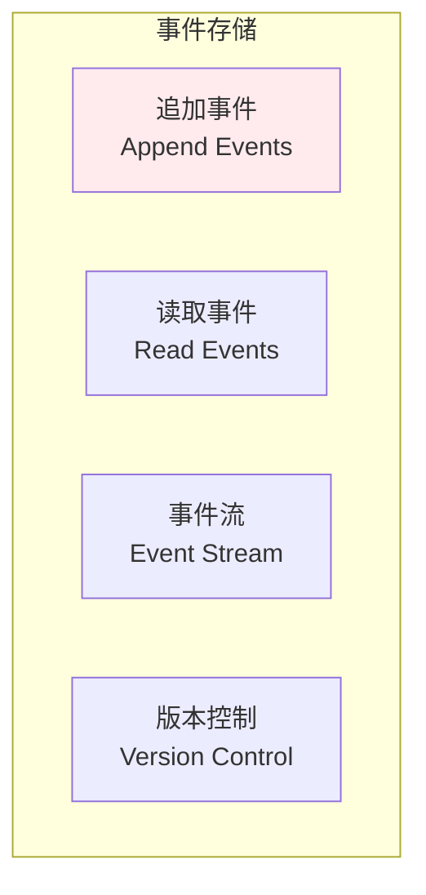

**职责**：
- 追加新事件
- 读取事件流
- 管理事件版本
- 保证事件顺序

**特点**：
- 只追加（Append-Only）
- 不可修改
- 有序存储
- 支持版本控制

#### 3. 聚合（Aggregate）

**定义**：通过事件重建状态的领域对象

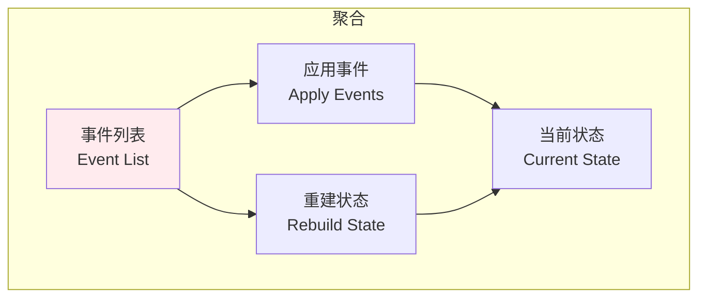

**职责**：
- 应用事件改变状态
- 重建当前状态
- 产生新事件
- 维护业务不变量

#### 4. 投影（Projection）

**定义**：将事件投影到读模型

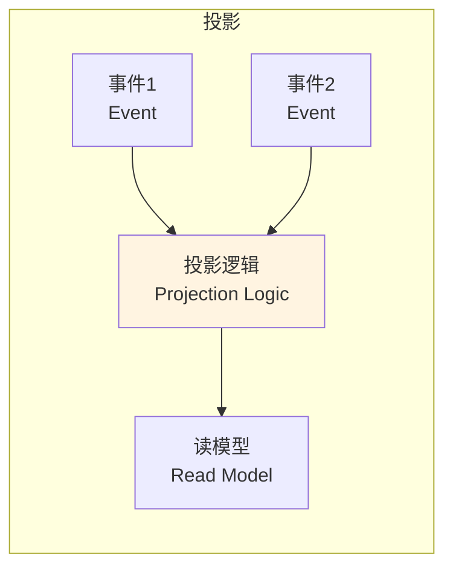

**职责**：
- 监听事件
- 更新读模型
- 处理事件重放
- 支持多个读模型

#### 5. 事件重放（Event Replay）

**定义**：通过重放事件重建状态

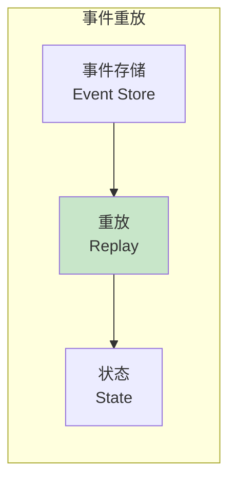

**职责**：
- 从事件存储读取事件
- 按顺序重放事件
- 重建当前状态
- 支持时间点重建

#### 6. 快照（Snapshot）

**定义**：状态的快照，用于优化重放性能

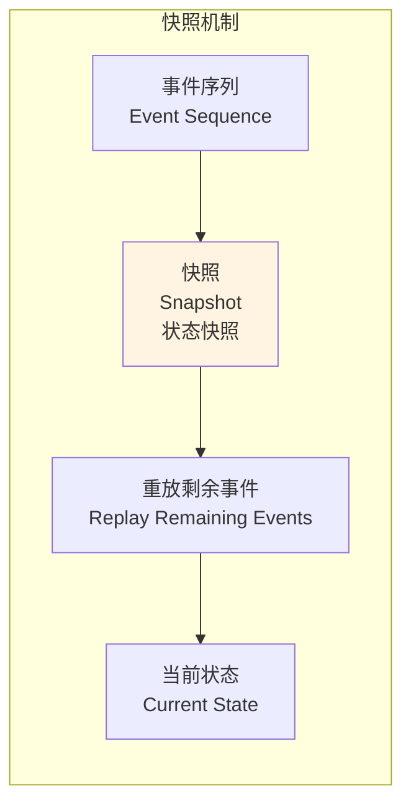

**职责**：
- 定期创建状态快照
- 优化重放性能
- 减少重放事件数量
- 支持快速恢复

---

## 设计规则

### 事件设计规则

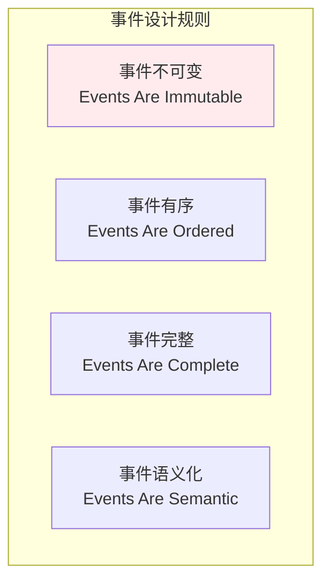

**规则说明**：
- ✅ **事件不可变**：事件一旦创建不可修改
- ✅ **事件有序**：事件按时间顺序存储
- ✅ **事件完整**：事件包含重建状态所需的所有信息
- ✅ **事件语义化**：事件名称清晰表达业务含义

### 状态重建规则

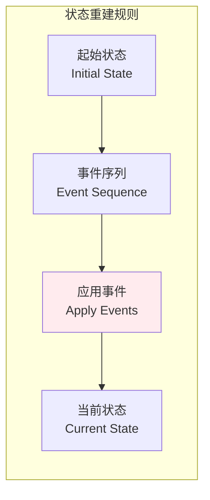

**规则说明**：
- ✅ **起始状态**：从初始状态开始
- ✅ **顺序应用**：按顺序应用所有事件
- ✅ **幂等性**：重放应该是幂等的
- ✅ **完整性**：所有事件都必须应用

---

## 优缺点分析

### 优点

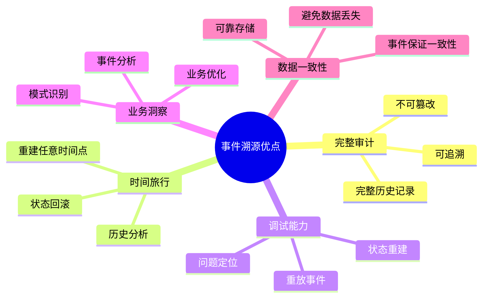

**详细说明**：
- ✅ **完整审计**：保留所有状态变化的完整历史
- ✅ **时间旅行**：可以重建任意时间点的状态
- ✅ **调试能力**：可以重放事件来调试问题
- ✅ **业务洞察**：通过分析事件序列获得业务洞察
- ✅ **数据一致性**：通过事件保证数据一致性

### 缺点

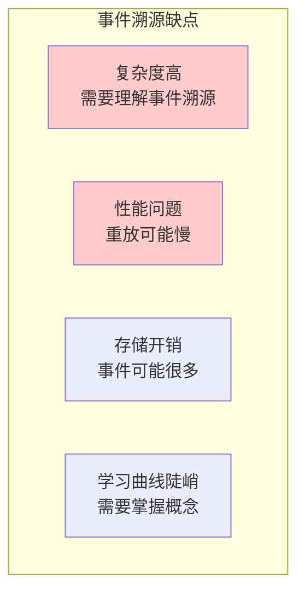

**详细说明**：
- ❌ **复杂度高**：需要理解事件溯源概念
- ❌ **性能问题**：重放大量事件可能很慢
- ❌ **存储开销**：事件可能很多，存储开销大
- ❌ **学习曲线陡峭**：需要掌握事件溯源概念
- ❌ **查询复杂**：查询需要重建状态或使用投影

---

## 实践指南

### 事件溯源实施步骤

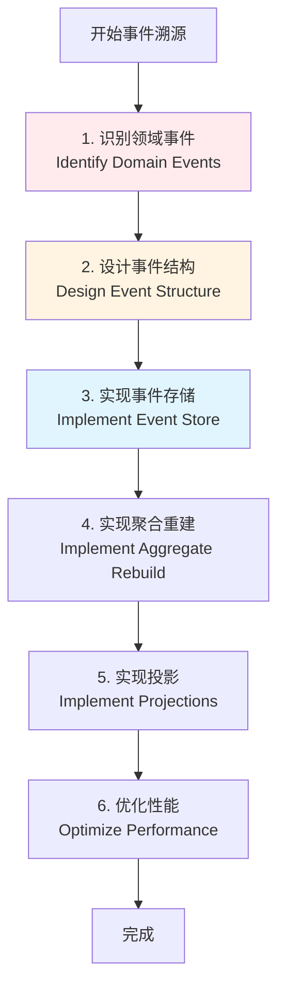

### 性能优化策略

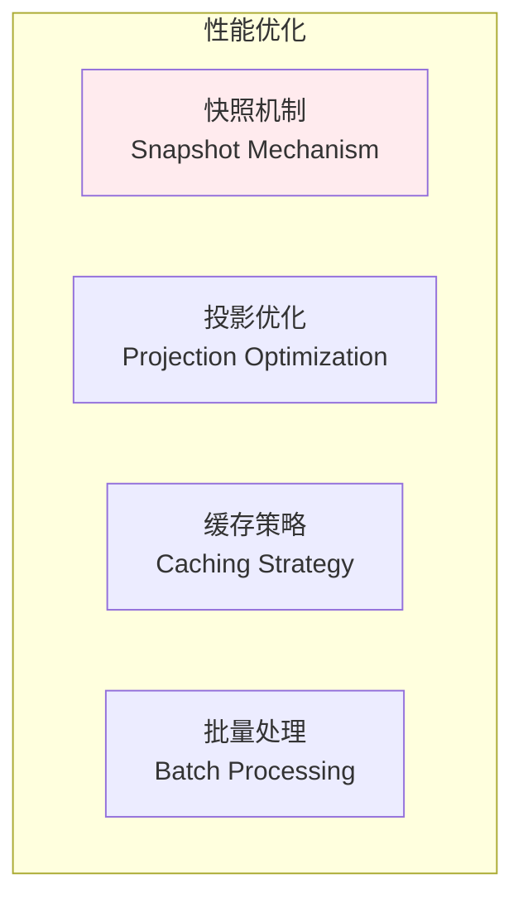

**优化建议**：
- ✅ **快照机制**：定期创建快照，减少重放事件
- ✅ **投影优化**：优化投影逻辑，提高查询性能
- ✅ **缓存策略**：缓存常用状态，减少重放
- ✅ **批量处理**：批量处理事件，提高性能

---

## 与其他架构模式的关系

### 事件溯源与其他架构的关系

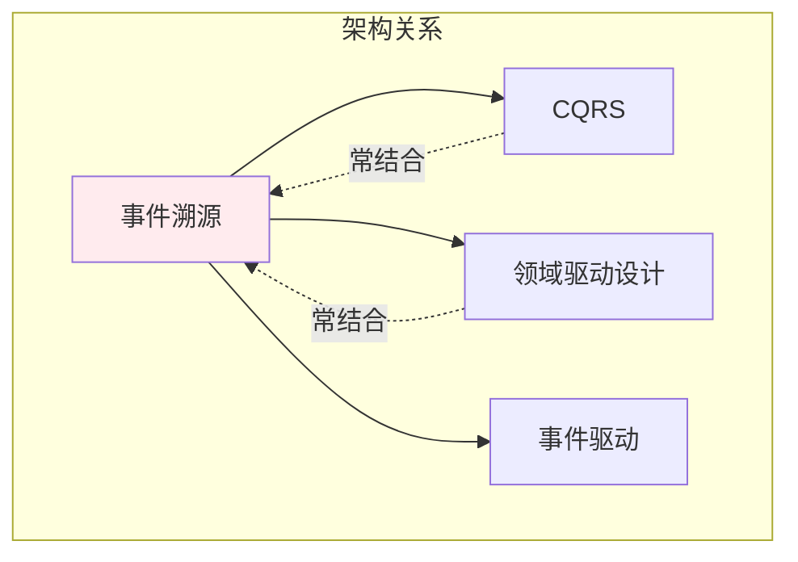

**关系说明**：
- **CQRS**：事件溯源常与CQRS结合使用
- **领域驱动设计**：事件溯源是DDD的实现方式之一
- **事件驱动**：事件溯源是事件驱动的极致实现

---

## 应用场景

### 适用场景

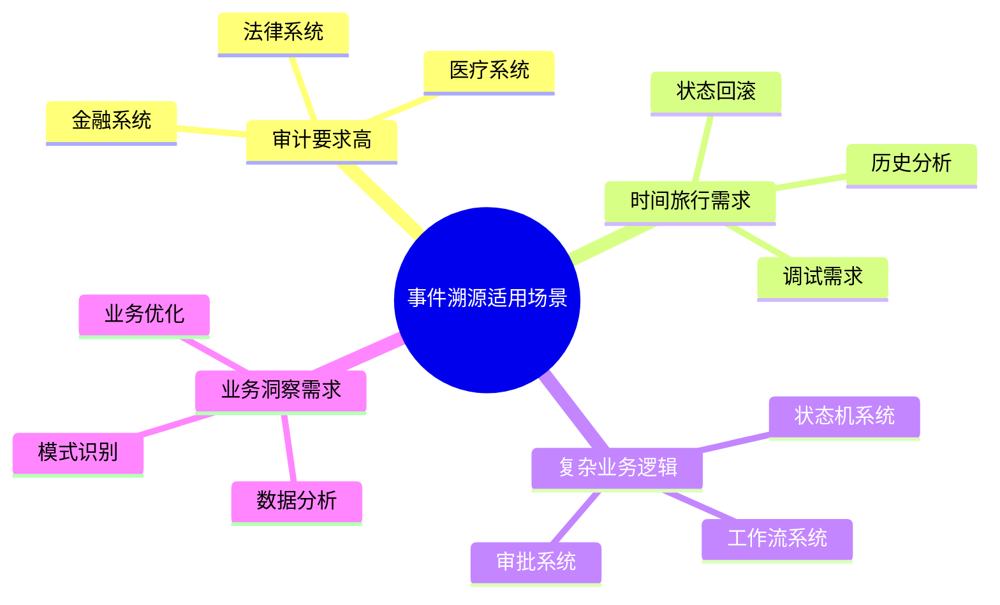

**具体场景**：
- ✅ **金融系统**：需要完整审计，时间旅行
- ✅ **医疗系统**：需要完整历史，不可篡改
- ✅ **工作流系统**：需要状态回滚，历史分析
- ✅ **电商系统**：需要完整订单历史，业务分析

### 不适用场景

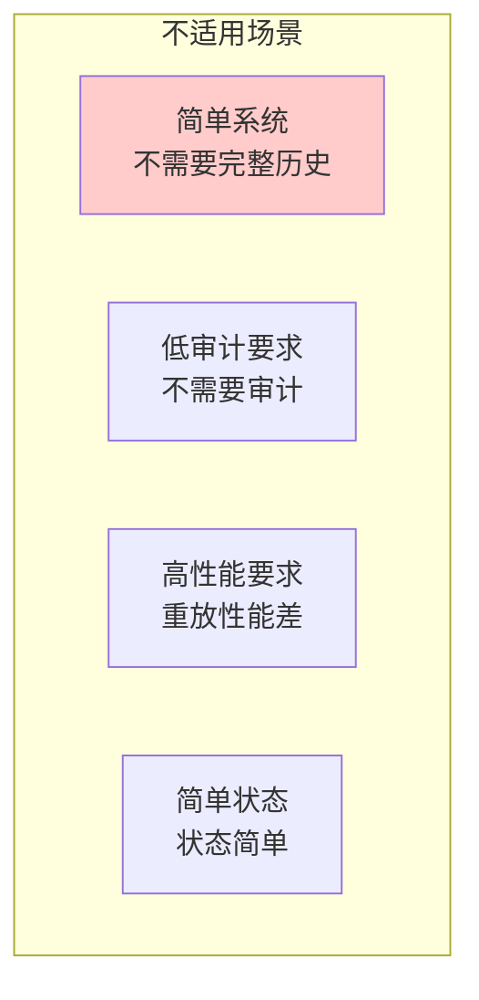

**不适用场景**：
- ❌ **简单系统**：不需要完整历史
- ❌ **低审计要求**：不需要审计功能
- ❌ **高性能要求**：重放性能可能不满足
- ❌ **简单状态**：状态简单，不需要事件溯源

---

## 实际案例

### 案例1：电商订单系统

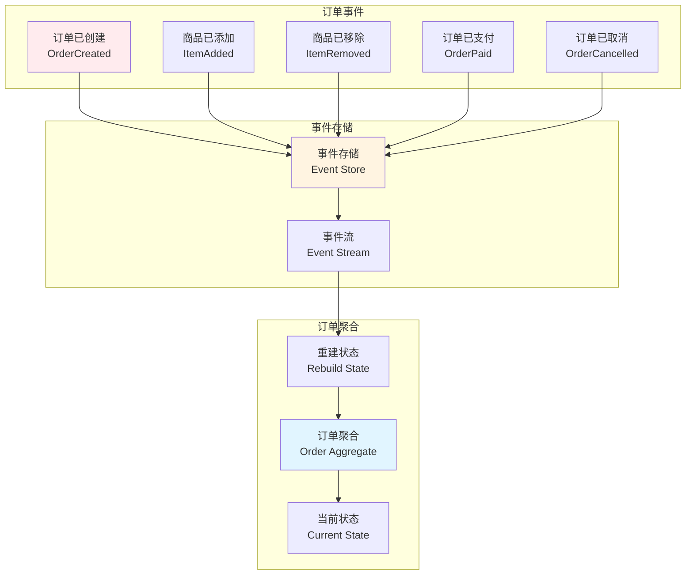

### 案例2：游戏战斗系统

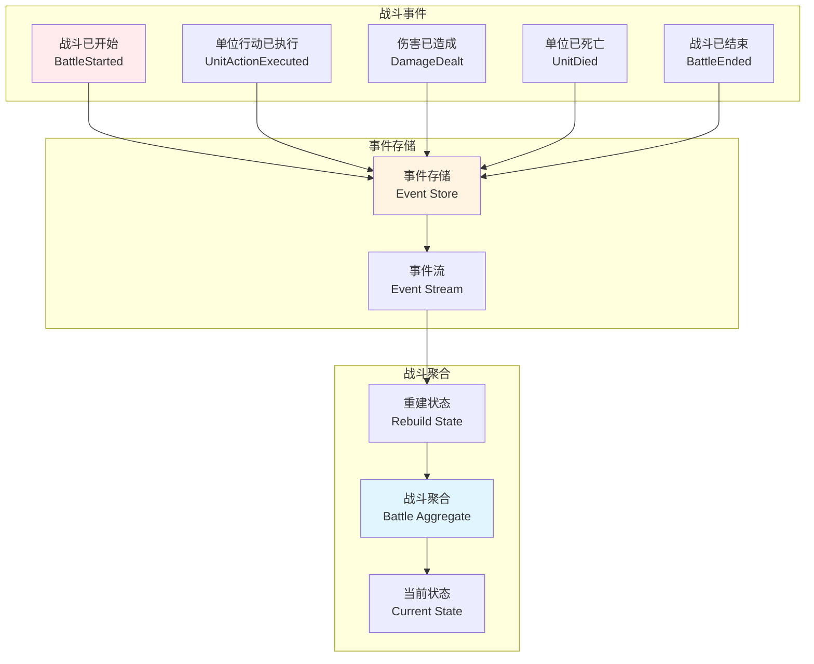

---

## 设计原则

### 事件溯源设计原则

```mermaid
graph TB
    subgraph "事件溯源设计原则"
        Principle1[事件不可变<br/>Events Are Immutable]
        Principle2[事件有序<br/>Events Are Ordered]
        Principle3[状态重建<br/>State Reconstruction]
        Principle4[完整历史<br/>Complete History]
        Principle5[性能优化<br/>Performance Optimization]
    end
    
    style Principle1 fill:#ffebee
```

**核心原则**：
- **事件不可变**：事件一旦创建不可修改
- **事件有序**：事件按时间顺序存储
- **状态重建**：通过重放事件重建状态
- **完整历史**：保留完整的状态变化历史
- **性能优化**：通过快照等机制优化性能

---

## 总结

事件溯源架构模式通过将状态变化存储为不可变的事件序列，保留完整的历史记录，支持时间旅行和完整审计。

**核心价值**：
- 📜 **完整审计**：保留所有状态变化的完整历史
- ⏰ **时间旅行**：可以重建任意时间点的状态
- 🐛 **调试能力**：可以重放事件来调试问题
- 💡 **业务洞察**：通过分析事件序列获得业务洞察
- 🔒 **数据一致性**：通过事件保证数据一致性

**适用场景**：
- ✅ 审计要求高
- ✅ 时间旅行需求
- ✅ 复杂业务逻辑
- ✅ 业务洞察需求

**注意事项**：
- ⚠️ 复杂度较高，需要理解事件溯源概念
- ⚠️ 性能问题，重放大量事件可能很慢
- ⚠️ 存储开销，事件可能很多
- ⚠️ 查询复杂，需要重建状态或使用投影

事件溯源是构建可审计、可追溯、可分析系统的优秀架构模式，特别适合需要完整历史记录和审计功能的系统。

