# 插件架构模式（Plugin Architecture Pattern）

## 目录

- [概述](#概述)
- [核心概念](#核心概念)
- [架构结构](#架构结构)
- [设计规则](#设计规则)
- [优缺点分析](#优缺点分析)
- [实践指南](#实践指南)
- [与其他架构模式的关系](#与其他架构模式的关系)
- [应用场景](#应用场景)
- [实际案例](#实际案例)
- [设计原则](#设计原则)
- [总结](#总结)

---

## 概述

**插件架构模式（Plugin Architecture Pattern）**是一种通过插件机制扩展系统功能的架构模式。它将核心系统与扩展功能分离，允许第三方或系统本身通过插件动态添加新功能，而无需修改核心系统代码。

### 什么是插件架构？

插件架构将系统分为核心和插件两部分：

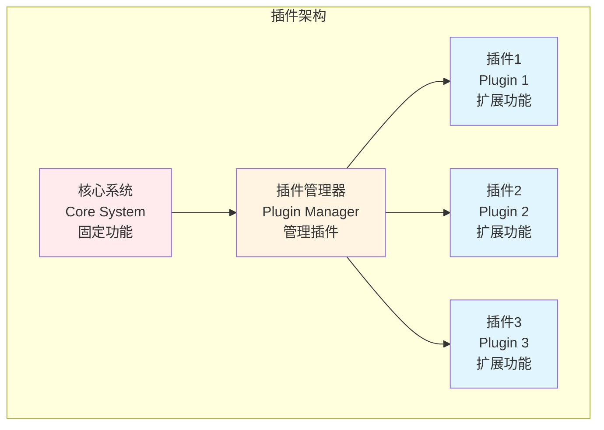
```mermaid
graph TB
    subgraph "插件架构"
        Core[核心系统<br/>Core System<br/>固定功能]
        Plugin1[插件1<br/>Plugin 1<br/>扩展功能]
        Plugin2[插件2<br/>Plugin 2<br/>扩展功能]
        Plugin3[插件3<br/>Plugin 3<br/>扩展功能]
        PluginManager[插件管理器<br/>Plugin Manager<br/>管理插件]
        
        Core --> PluginManager
        PluginManager --> Plugin1
        PluginManager --> Plugin2
        PluginManager --> Plugin3
    end
    
    style Core fill:#ffebee
    style PluginManager fill:#fff4e1
    style Plugin1 fill:#e1f5ff
    style Plugin2 fill:#e1f5ff
    style Plugin3 fill:#e1f5ff
```

**核心原则**：
- **核心系统**：提供基础功能和插件接口
- **插件**：实现特定功能，扩展系统能力
- **插件管理器**：管理插件的加载、卸载、生命周期
- **接口契约**：通过接口定义插件与核心系统的交互

### 为什么需要插件架构？

插件架构解决了以下问题：
- **可扩展性**：可以动态添加新功能，无需修改核心代码
- **可维护性**：核心系统稳定，插件独立开发和维护
- **灵活性**：可以根据需要启用或禁用插件
- **第三方集成**：允许第三方开发插件扩展系统
- **模块化**：功能模块化，易于管理

---

## 核心概念

### 核心思想

插件架构的核心思想是**开放封闭原则（Open-Closed Principle）**：

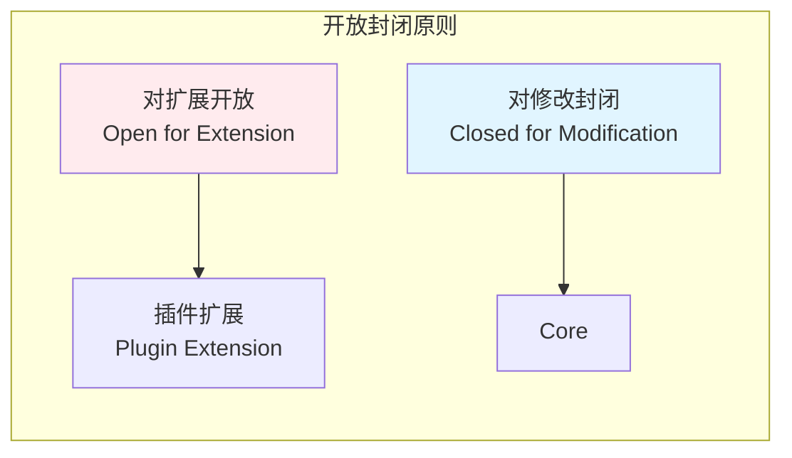
```mermaid
graph LR
    subgraph "开放封闭原则"
        Open[对扩展开放<br/>Open for Extension]
        Closed[对修改封闭<br/>Closed for Modification]
        Plugin[插件扩展<br/>Plugin Extension]
        
        Open --> Plugin
        Closed --> Core
    end
    
    style Open fill:#ffebee
    style Closed fill:#e1f5ff
```

**关键原则**：
1. **对扩展开放**：通过插件扩展系统功能
2. **对修改封闭**：核心系统不需要修改
3. **接口契约**：通过接口定义插件规范
4. **动态加载**：插件可以动态加载和卸载

### 基本特征

- **核心系统**：提供基础功能和插件接口
- **插件**：实现特定功能，扩展系统
- **插件管理器**：管理插件的生命周期
- **接口契约**：定义插件与核心系统的交互
- **动态加载**：插件可以动态加载和卸载

---

## 架构结构

### 插件架构完整结构

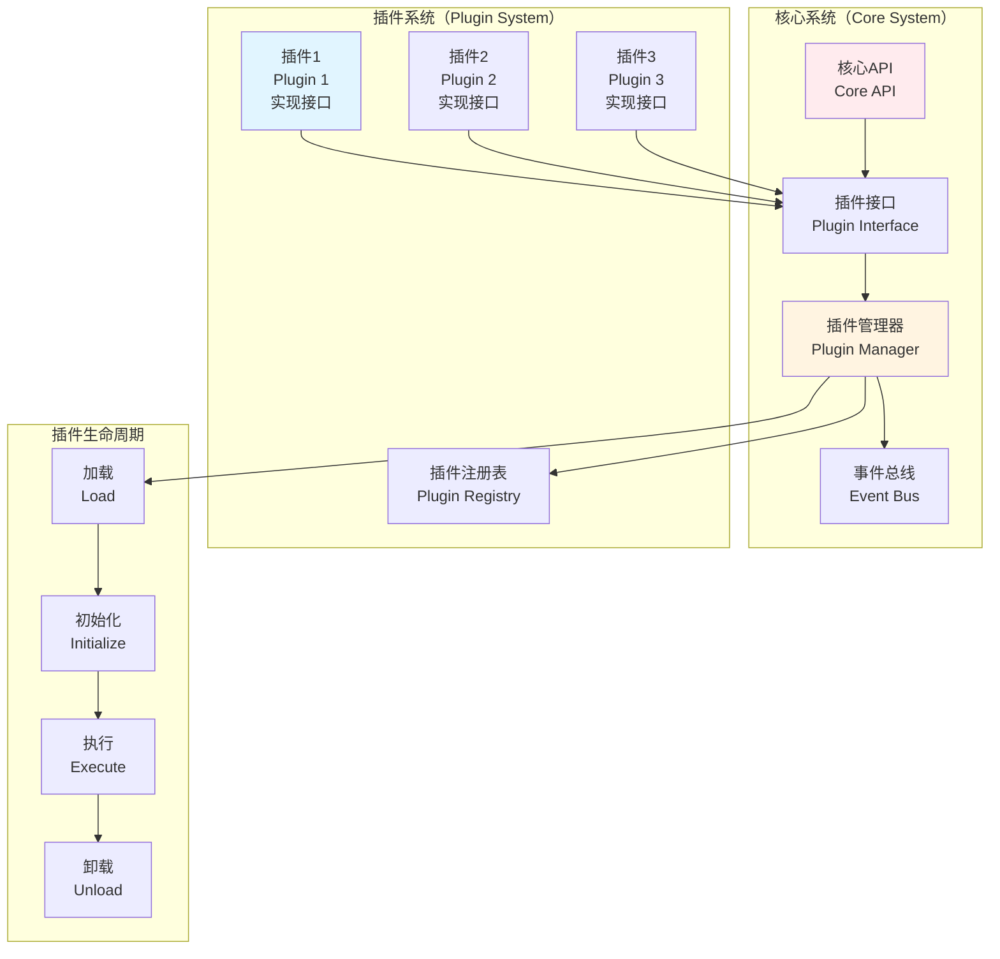
```mermaid
graph TB
    subgraph "核心系统（Core System）"
        CoreAPI[核心API<br/>Core API]
        PluginInterface[插件接口<br/>Plugin Interface]
        PluginManager[插件管理器<br/>Plugin Manager]
        EventBus[事件总线<br/>Event Bus]
    end
    
    subgraph "插件系统（Plugin System）"
        Plugin1[插件1<br/>Plugin 1<br/>实现接口]
        Plugin2[插件2<br/>Plugin 2<br/>实现接口]
        Plugin3[插件3<br/>Plugin 3<br/>实现接口]
        PluginRegistry[插件注册表<br/>Plugin Registry]
    end
    
    subgraph "插件生命周期"
        Load[加载<br/>Load]
        Initialize[初始化<br/>Initialize]
        Execute[执行<br/>Execute]
        Unload[卸载<br/>Unload]
    end
    
    CoreAPI --> PluginInterface
    PluginInterface --> PluginManager
    PluginManager --> PluginRegistry
    PluginManager --> EventBus
    
    Plugin1 --> PluginInterface
    Plugin2 --> PluginInterface
    Plugin3 --> PluginInterface
    
    PluginManager --> Load
    Load --> Initialize
    Initialize --> Execute
    Execute --> Unload
    
    style CoreAPI fill:#ffebee
    style PluginManager fill:#fff4e1
    style Plugin1 fill:#e1f5ff
```

### 核心组件详解

#### 1. 核心系统（Core System）

**定义**：提供基础功能和插件接口的系统

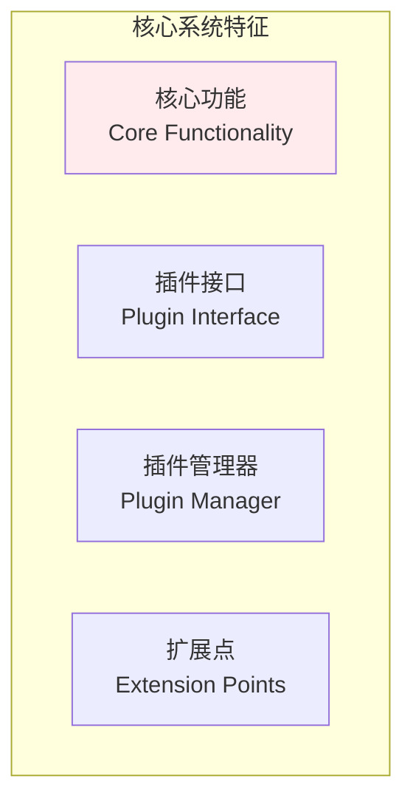
```mermaid
graph TB
    subgraph "核心系统特征"
        CoreFunction[核心功能<br/>Core Functionality]
        PluginInterface[插件接口<br/>Plugin Interface]
        PluginManager[插件管理器<br/>Plugin Manager]
        ExtensionPoint[扩展点<br/>Extension Points]
    end
    
    style CoreFunction fill:#ffebee
```

**职责**：
- 提供核心功能
- 定义插件接口
- 管理插件生命周期
- 提供扩展点

**特点**：
- 稳定，不经常变化
- 提供插件接口
- 管理插件加载和卸载
- 提供事件机制

#### 2. 插件（Plugin）

**定义**：实现特定功能，扩展系统的模块

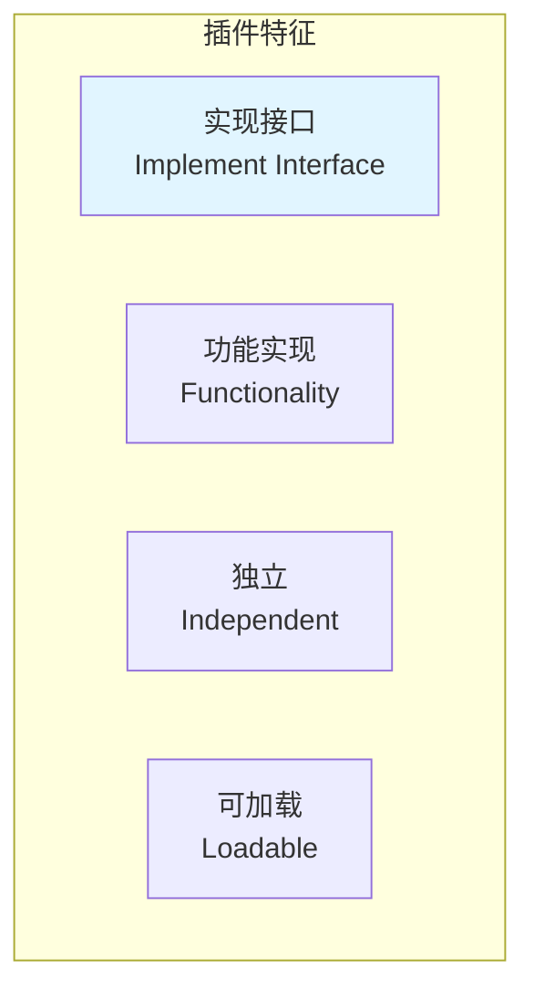
```mermaid
graph TB
    subgraph "插件特征"
        Interface[实现接口<br/>Implement Interface]
        Functionality[功能实现<br/>Functionality]
        Independent[独立<br/>Independent]
        Loadable[可加载<br/>Loadable]
    end
    
    style Interface fill:#e1f5ff
```

**职责**：
- 实现插件接口
- 提供扩展功能
- 响应系统事件
- 注册扩展点

**特点**：
- 实现插件接口
- 独立开发和部署
- 可以动态加载
- 可以独立测试

#### 3. 插件管理器（Plugin Manager）

**定义**：管理插件生命周期的组件

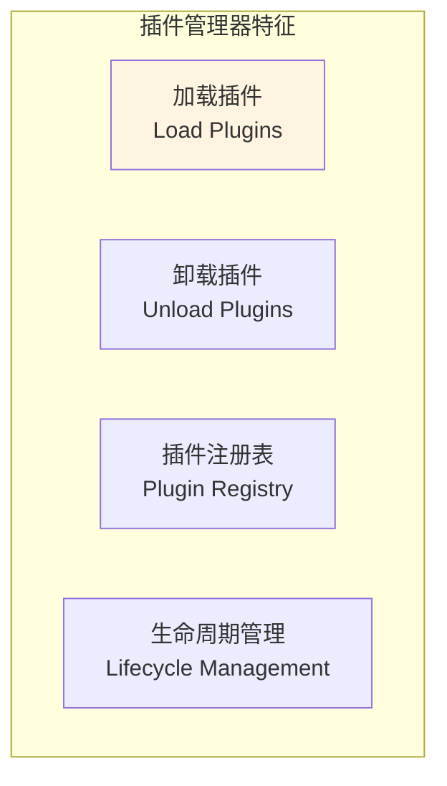
```mermaid
graph TB
    subgraph "插件管理器特征"
        Load[加载插件<br/>Load Plugins]
        Unload[卸载插件<br/>Unload Plugins]
        Registry[插件注册表<br/>Plugin Registry]
        Lifecycle[生命周期管理<br/>Lifecycle Management]
    end
    
    style Load fill:#fff4e1
```

**职责**：
- 发现和加载插件
- 管理插件生命周期
- 维护插件注册表
- 处理插件依赖

**功能**：
- 插件发现（扫描目录、配置文件）
- 插件加载（动态加载、依赖解析）
- 插件卸载（清理资源、移除注册）
- 插件查询（查找插件、获取插件信息）

#### 4. 插件接口（Plugin Interface）

**定义**：定义插件与核心系统交互的契约

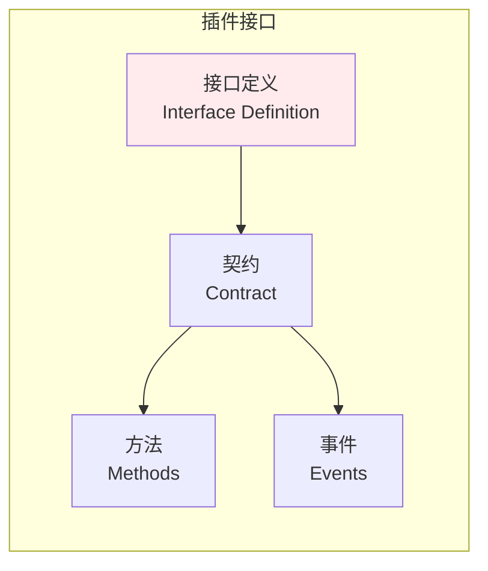
```mermaid
graph LR
    subgraph "插件接口"
        Interface[接口定义<br/>Interface Definition]
        Contract[契约<br/>Contract]
        Methods[方法<br/>Methods]
        Events[事件<br/>Events]
    end
    
    Interface --> Contract
    Contract --> Methods
    Contract --> Events
    
    style Interface fill:#ffebee
```

**职责**：
- 定义插件必须实现的方法
- 定义插件可以响应的事件
- 定义插件的数据结构
- 保证插件与核心系统的兼容性

#### 5. 扩展点（Extension Point）

**定义**：核心系统提供的扩展位置

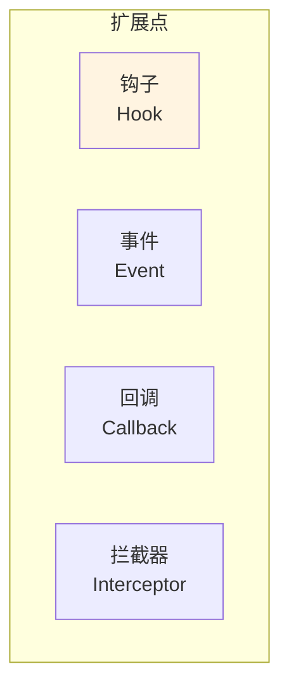
```mermaid
graph TB
    subgraph "扩展点"
        Hook[钩子<br/>Hook]
        Event[事件<br/>Event]
        Callback[回调<br/>Callback]
        Interceptor[拦截器<br/>Interceptor]
    end
    
    style Hook fill:#fff4e1
```

**类型**：
- **钩子（Hook）**：在特定时机调用插件
- **事件（Event）**：插件可以订阅的事件
- **回调（Callback）**：插件提供的回调函数
- **拦截器（Interceptor）**：拦截和处理请求

---

## 设计规则

### 插件设计规则

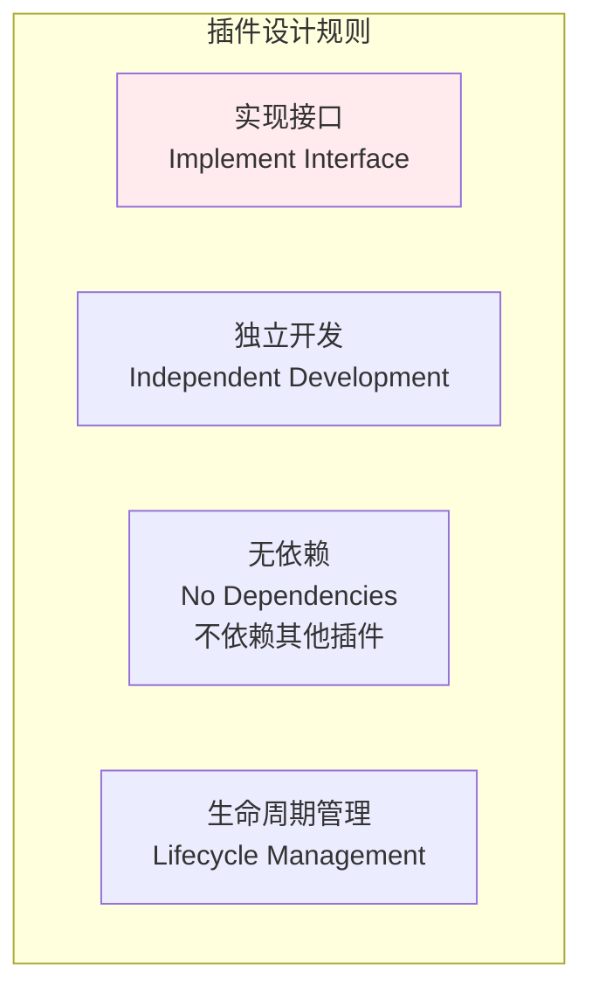
```mermaid
graph TB
    subgraph "插件设计规则"
        Rule1[实现接口<br/>Implement Interface]
        Rule2[独立开发<br/>Independent Development]
        Rule3[无依赖<br/>No Dependencies<br/>不依赖其他插件]
        Rule4[生命周期管理<br/>Lifecycle Management]
    end
    
    style Rule1 fill:#ffebee
```

**规则说明**：
- ✅ **实现接口**：插件必须实现插件接口
- ✅ **独立开发**：插件可以独立开发和测试
- ✅ **无依赖**：插件不应该依赖其他插件
- ✅ **生命周期管理**：插件需要管理自己的资源

### 核心系统设计规则

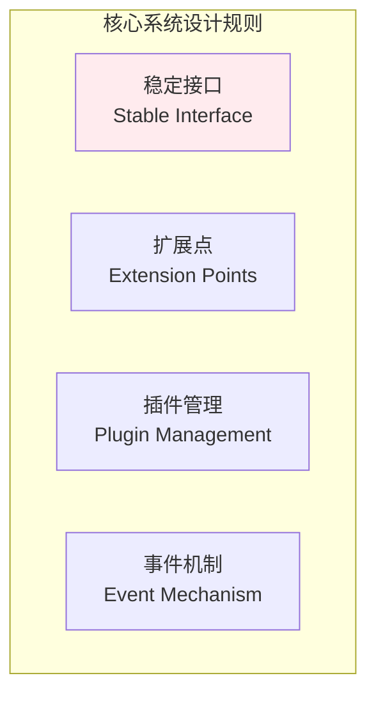
```mermaid
graph TB
    subgraph "核心系统设计规则"
        Rule1[稳定接口<br/>Stable Interface]
        Rule2[扩展点<br/>Extension Points]
        Rule3[插件管理<br/>Plugin Management]
        Rule4[事件机制<br/>Event Mechanism]
    end
    
    style Rule1 fill:#ffebee
```

**规则说明**：
- ✅ **稳定接口**：插件接口应该稳定，不经常变化
- ✅ **扩展点**：提供清晰的扩展点
- ✅ **插件管理**：提供插件管理功能
- ✅ **事件机制**：提供事件机制供插件使用

---

## 优缺点分析

### 优点

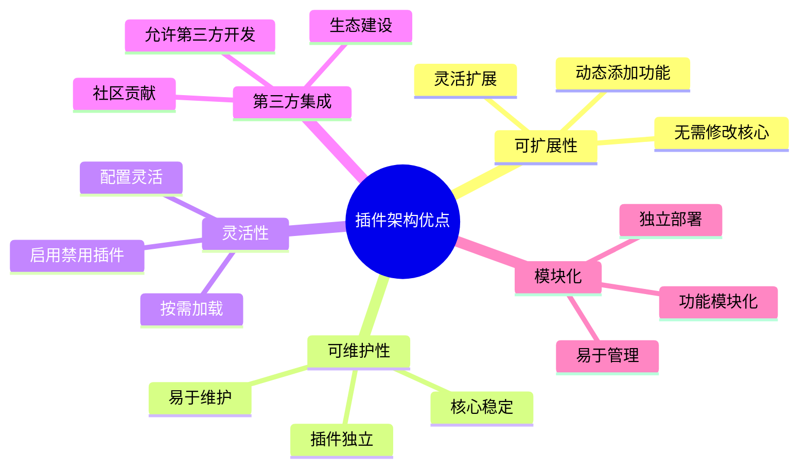
```mermaid
mindmap
  root((插件架构优点))
    可扩展性
      动态添加功能
      无需修改核心
      灵活扩展
    可维护性
      核心稳定
      插件独立
      易于维护
    灵活性
      启用禁用插件
      按需加载
      配置灵活
    第三方集成
      允许第三方开发
      生态建设
      社区贡献
    模块化
      功能模块化
      独立部署
      易于管理
```

**详细说明**：
- ✅ **可扩展性**：可以动态添加新功能，无需修改核心代码
- ✅ **可维护性**：核心系统稳定，插件独立开发和维护
- ✅ **灵活性**：可以根据需要启用或禁用插件
- ✅ **第三方集成**：允许第三方开发插件扩展系统
- ✅ **模块化**：功能模块化，易于管理

### 缺点

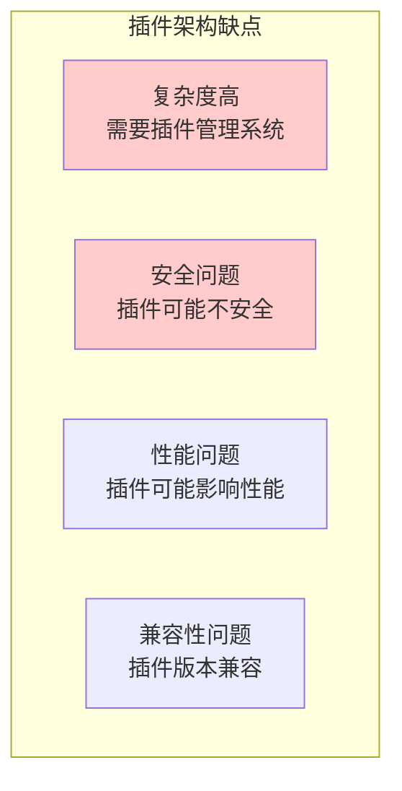
```mermaid
graph TB
    subgraph "插件架构缺点"
        Complexity[复杂度高<br/>需要插件管理系统]
        Security[安全问题<br/>插件可能不安全]
        Performance[性能问题<br/>插件可能影响性能]
        Compatibility[兼容性问题<br/>插件版本兼容]
    end
    
    style Complexity fill:#ffcccb
    style Security fill:#ffcccb
```

**详细说明**：
- ❌ **复杂度高**：需要插件管理系统和接口设计
- ❌ **安全问题**：插件可能包含恶意代码或安全漏洞
- ❌ **性能问题**：插件可能影响系统性能
- ❌ **兼容性问题**：插件版本兼容性管理复杂
- ❌ **调试困难**：插件问题可能难以调试

---

## 实践指南

### 插件架构实施步骤

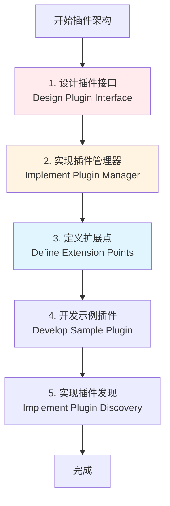
```mermaid
graph TD
    Start[开始插件架构] --> Step1[1. 设计插件接口<br/>Design Plugin Interface]
    Step1 --> Step2[2. 实现插件管理器<br/>Implement Plugin Manager]
    Step2 --> Step3[3. 定义扩展点<br/>Define Extension Points]
    Step3 --> Step4[4. 开发示例插件<br/>Develop Sample Plugin]
    Step4 --> Step5[5. 实现插件发现<br/>Implement Plugin Discovery]
    Step5 --> End[完成]
    
    style Step1 fill:#ffebee
    style Step2 fill:#fff4e1
    style Step3 fill:#e1f5ff
```

### 插件接口设计策略

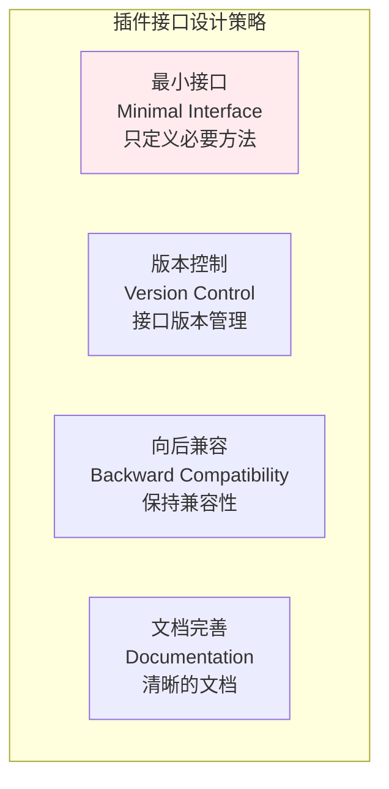
```mermaid
graph TB
    subgraph "插件接口设计策略"
        Strategy1[最小接口<br/>Minimal Interface<br/>只定义必要方法]
        Strategy2[版本控制<br/>Version Control<br/>接口版本管理]
        Strategy3[向后兼容<br/>Backward Compatibility<br/>保持兼容性]
        Strategy4[文档完善<br/>Documentation<br/>清晰的文档]
    end
    
    style Strategy1 fill:#ffebee
```

**设计建议**：
- ✅ **最小接口**：只定义必要的方法，保持接口简洁
- ✅ **版本控制**：管理接口版本，支持多版本插件
- ✅ **向后兼容**：新版本接口保持向后兼容
- ✅ **文档完善**：提供清晰的插件开发文档

---

## 与其他架构模式的关系

### 插件架构与其他架构的关系

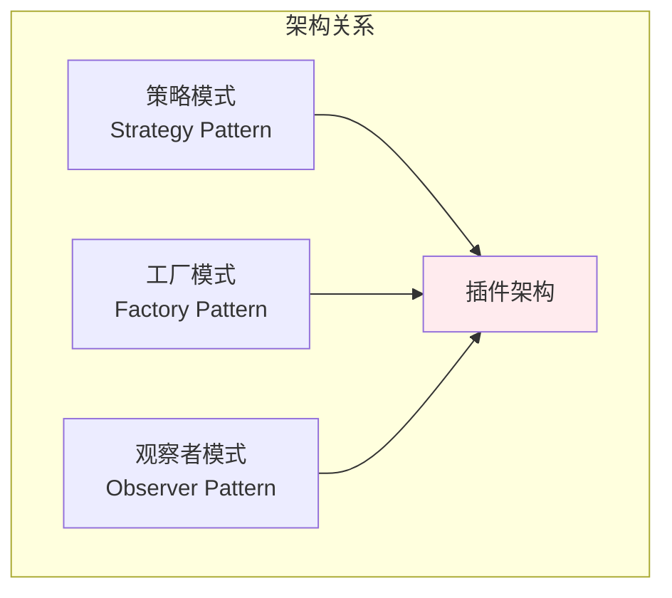
```mermaid
graph TB
    subgraph "架构关系"
        Plugin[插件架构]
        Strategy[策略模式<br/>Strategy Pattern]
        Factory[工厂模式<br/>Factory Pattern]
        Observer[观察者模式<br/>Observer Pattern]
        
        Strategy --> Plugin
        Factory --> Plugin
        Observer --> Plugin
    end
    
    style Plugin fill:#ffebee
```

**关系说明**：
- **策略模式**：插件可以看作不同的策略实现
- **工厂模式**：插件管理器使用工厂模式创建插件
- **观察者模式**：插件可以订阅系统事件

---

## 应用场景

### 适用场景

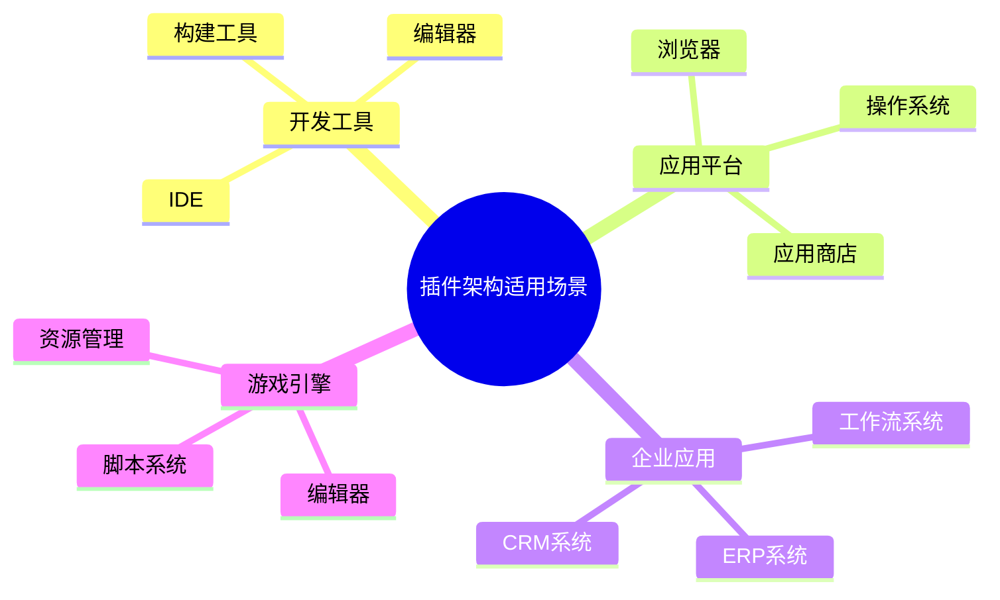
```mermaid
mindmap
  root((插件架构适用场景))
    开发工具
      IDE
      编辑器
      构建工具
    应用平台
      浏览器
      操作系统
      应用商店
    企业应用
      工作流系统
      ERP系统
      CRM系统
    游戏引擎
      编辑器
      脚本系统
      资源管理
```

**具体场景**：
- ✅ **IDE**：Visual Studio、Eclipse、VSCode
- ✅ **浏览器**：Chrome、Firefox扩展
- ✅ **游戏引擎**：Unity、Unreal插件系统
- ✅ **应用平台**：WordPress、Drupal插件

### 不适用场景

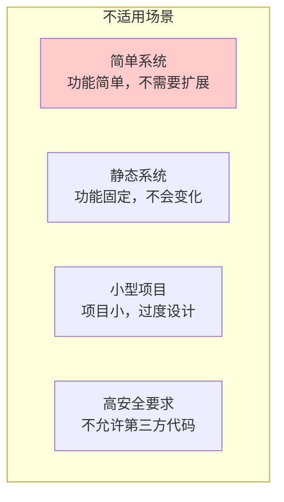
```mermaid
graph TB
    subgraph "不适用场景"
        Simple[简单系统<br/>功能简单，不需要扩展]
        Static[静态系统<br/>功能固定，不会变化]
        Small[小型项目<br/>项目小，过度设计]
        Security[高安全要求<br/>不允许第三方代码]
    end
    
    style Simple fill:#ffcccb
```

**不适用场景**：
- ❌ **简单系统**：功能简单，不需要扩展机制
- ❌ **静态系统**：功能固定，不会变化
- ❌ **小型项目**：项目小，插件架构可能过度设计
- ❌ **高安全要求**：不允许执行第三方代码

---

## 实际案例

### 案例1：IDE插件系统

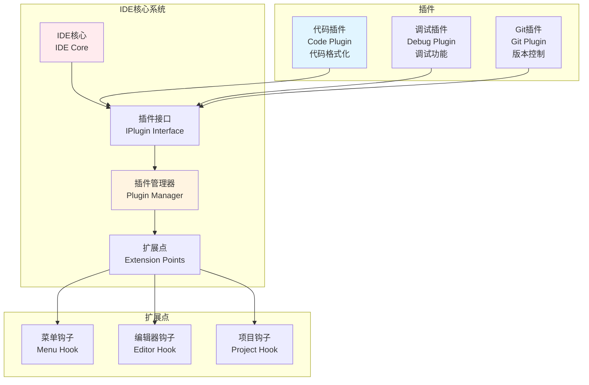
```mermaid
graph TB
    subgraph "IDE核心系统"
        CoreIDE[IDE核心<br/>IDE Core]
        PluginInterface[插件接口<br/>IPlugin Interface]
        PluginManager[插件管理器<br/>Plugin Manager]
        ExtensionPoint[扩展点<br/>Extension Points]
    end
    
    subgraph "插件"
        CodePlugin[代码插件<br/>Code Plugin<br/>代码格式化]
        DebugPlugin[调试插件<br/>Debug Plugin<br/>调试功能]
        GitPlugin[Git插件<br/>Git Plugin<br/>版本控制]
    end
    
    subgraph "扩展点"
        MenuHook[菜单钩子<br/>Menu Hook]
        EditorHook[编辑器钩子<br/>Editor Hook]
        ProjectHook[项目钩子<br/>Project Hook]
    end
    
    CoreIDE --> PluginInterface
    PluginInterface --> PluginManager
    PluginManager --> ExtensionPoint
    
    CodePlugin --> PluginInterface
    DebugPlugin --> PluginInterface
    GitPlugin --> PluginInterface
    
    ExtensionPoint --> MenuHook
    ExtensionPoint --> EditorHook
    ExtensionPoint --> ProjectHook
    
    style CoreIDE fill:#ffebee
    style PluginManager fill:#fff4e1
    style CodePlugin fill:#e1f5ff
```

### 案例2：游戏引擎插件系统

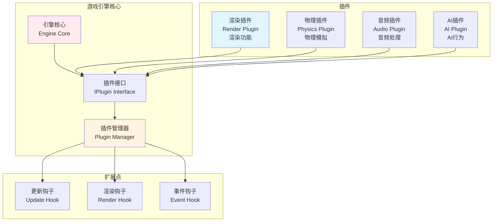
```mermaid
graph TB
    subgraph "游戏引擎核心"
        EngineCore[引擎核心<br/>Engine Core]
        PluginInterface[插件接口<br/>IPlugin Interface]
        PluginManager[插件管理器<br/>Plugin Manager]
    end
    
    subgraph "插件"
        RenderPlugin[渲染插件<br/>Render Plugin<br/>渲染功能]
        PhysicsPlugin[物理插件<br/>Physics Plugin<br/>物理模拟]
        AudioPlugin[音频插件<br/>Audio Plugin<br/>音频处理]
        AIPlugin[AI插件<br/>AI Plugin<br/>AI行为]
    end
    
    subgraph "扩展点"
        UpdateHook[更新钩子<br/>Update Hook]
        RenderHook[渲染钩子<br/>Render Hook]
        EventHook[事件钩子<br/>Event Hook]
    end
    
    EngineCore --> PluginInterface
    PluginInterface --> PluginManager
    
    RenderPlugin --> PluginInterface
    PhysicsPlugin --> PluginInterface
    AudioPlugin --> PluginInterface
    AIPlugin --> PluginInterface
    
    PluginManager --> UpdateHook
    PluginManager --> RenderHook
    PluginManager --> EventHook
    
    style EngineCore fill:#ffebee
    style PluginManager fill:#fff4e1
    style RenderPlugin fill:#e1f5ff
```

---

## 设计原则

### 插件架构设计原则

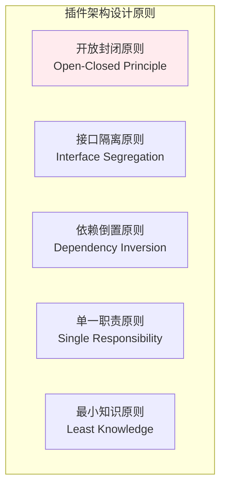
```mermaid
graph TB
    subgraph "插件架构设计原则"
        Principle1[开放封闭原则<br/>Open-Closed Principle]
        Principle2[接口隔离原则<br/>Interface Segregation]
        Principle3[依赖倒置原则<br/>Dependency Inversion]
        Principle4[单一职责原则<br/>Single Responsibility]
        Principle5[最小知识原则<br/>Least Knowledge]
    end
    
    style Principle1 fill:#ffebee
```

**核心原则**：
- **开放封闭原则**：对扩展开放，对修改封闭
- **接口隔离原则**：接口应该小而专注
- **依赖倒置原则**：依赖抽象接口，而非具体实现
- **单一职责原则**：每个插件只负责一个功能
- **最小知识原则**：插件不应该知道其他插件的存在

---

## 总结

插件架构模式通过插件机制扩展系统功能，将核心系统与扩展功能分离，允许动态添加新功能而无需修改核心代码。

**核心价值**：
- 🔌 **可扩展性**：可以动态添加新功能，无需修改核心代码
- 🛠️ **可维护性**：核心系统稳定，插件独立开发和维护
- 🔄 **灵活性**：可以根据需要启用或禁用插件
- 👥 **第三方集成**：允许第三方开发插件扩展系统
- 📦 **模块化**：功能模块化，易于管理

**适用场景**：
- ✅ 开发工具
- ✅ 应用平台
- ✅ 企业应用
- ✅ 游戏引擎

**注意事项**：
- ⚠️ 复杂度较高，需要插件管理系统
- ⚠️ 安全问题，插件可能不安全
- ⚠️ 性能问题，插件可能影响性能
- ⚠️ 兼容性问题，插件版本管理复杂

插件架构是构建可扩展、可维护系统的优秀架构模式，特别适合需要动态扩展功能的系统和平台。

