# 洋葱架构模式（Onion Architecture Pattern）

## 目录

- [概述](#概述)
- [核心概念](#核心概念)
- [架构结构](#架构结构)
- [设计规则](#设计规则)
- [优缺点分析](#优缺点分析)
- [实践指南](#实践指南)
- [与其他架构模式的关系](#与其他架构模式的关系)
- [应用场景](#应用场景)
- [实际案例](#实际案例)
- [设计原则](#设计原则)
- [总结](#总结)

---

## 概述

**洋葱架构模式（Onion Architecture Pattern）**是由Jeffrey Palermo提出的一种架构模式，它将应用程序组织成一系列同心圆层，依赖方向从外向内，核心领域模型在中心，不依赖任何外部层。

### 什么是洋葱架构？

洋葱架构将系统组织成多个同心圆层，就像洋葱的层次结构：

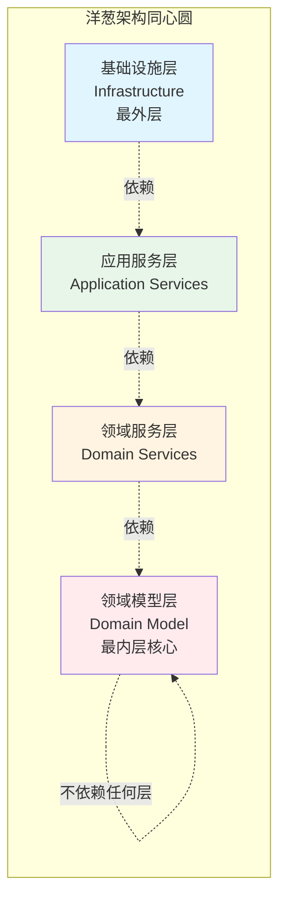

**核心原则**：
- **依赖方向**：依赖只能从外向内，内层不依赖外层
- **领域模型在中心**：核心业务逻辑在最内层
- **接口定义在外层**：接口定义在应用服务层，实现在基础设施层
- **依赖倒置**：通过接口实现依赖倒置

### 为什么需要洋葱架构？

洋葱架构解决了以下问题：
- **业务逻辑隔离**：核心业务逻辑完全独立于基础设施
- **可测试性**：领域模型可以独立测试，无需基础设施
- **技术无关性**：业务逻辑不依赖具体技术实现
- **可维护性**：清晰的依赖方向，易于理解和维护
- **可扩展性**：可以轻松替换基础设施，不影响业务逻辑

---

## 核心概念

### 核心思想

洋葱架构模式的核心思想是**依赖倒置（Dependency Inversion）**和**关注点分离（Separation of Concerns）**：

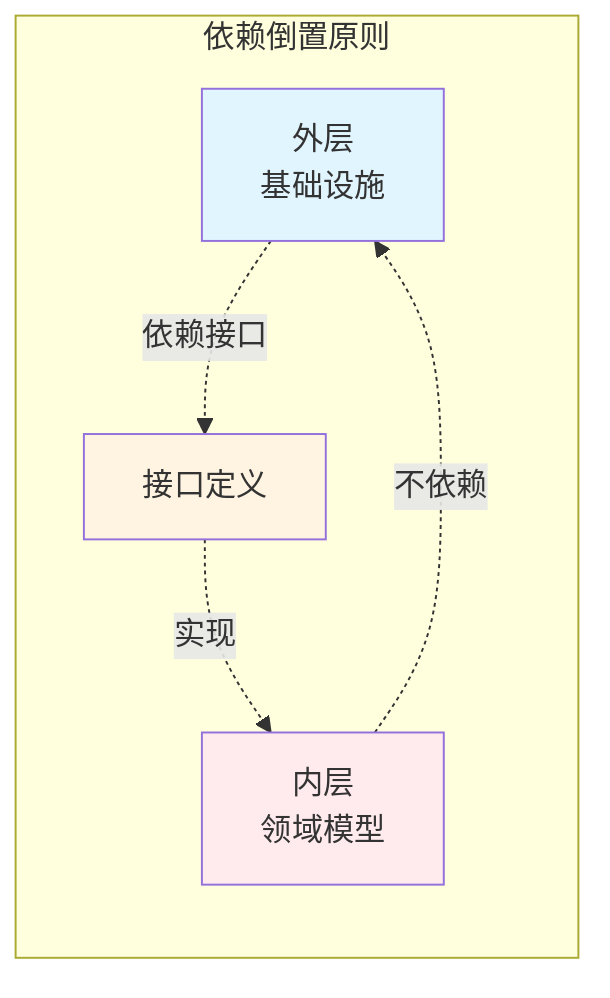

**关键原则**：
1. **依赖规则**：依赖只能从外向内，内层不依赖外层
2. **领域模型在中心**：核心业务逻辑在最内层
3. **接口定义在外层**：接口定义在应用服务层
4. **依赖倒置**：通过接口实现依赖倒置

### 基本特征

- **同心圆结构**：系统组织成多个同心圆层
- **依赖倒置**：依赖方向从外向内
- **领域中心**：领域模型在中心，基础设施在外围
- **接口抽象**：通过接口定义层间交互
- **可测试性**：领域模型可以独立测试

---

## 架构结构

### 洋葱架构完整结构

```mermaid
graph TB
    subgraph "基础设施层（最外层）"
        Web[Web框架<br/>ASP.NET/Spring]
        DB[(数据库<br/>SQL Server/MySQL)]
        File[文件系统<br/>File System]
        Email[邮件服务<br/>SMTP]
        Cache[缓存服务<br/>Redis]
    end
    
    subgraph "应用服务层"
        AppService1[应用服务1<br/>OrderService]
        AppService2[应用服务2<br/>PaymentService]
        AppService3[应用服务3[NotificationService]
        Interfaces[接口定义<br/>IOrderRepository<br/>IPaymentGateway]
    end
    
    subgraph "领域服务层"
        DomainService1[领域服务1<br/>OrderDomainService]
        DomainService2[领域服务2<br/>PricingDomainService]
        DomainService3[领域服务3<br/>ValidationDomainService]
    end
    
    subgraph "领域模型层（核心）"
        Entity1[订单实体<br/>Order Entity]
        Entity2[用户实体<br/>User Entity]
        Entity3[产品实体<br/>Product Entity]
        ValueObject1[值对象<br/>Money ValueObject]
        ValueObject2[值对象<br/>Address ValueObject]
    end
    
    Web --> AppService1
    DB --> AppService1
    File --> AppService2
    Email --> AppService3
    Cache --> AppService1
    
    AppService1 --> Interfaces
    AppService2 --> Interfaces
    AppService3 --> Interfaces
    
    Interfaces -.实现.-> DB
    Interfaces -.实现.-> Email
    
    AppService1 --> DomainService1
    AppService2 --> DomainService2
    AppService3 --> DomainService3
    
    DomainService1 --> Entity1
    DomainService2 --> Entity2
    DomainService3 --> Entity3
    
    Entity1 --> ValueObject1
    Entity2 --> ValueObject2
    
    style Entity1 fill:#ffebee
    style Entity2 fill:#ffebee
    style Entity3 fill:#ffebee
    style DomainService1 fill:#fff4e1
```

### 各层职责详解

#### 1. 领域模型层（Domain Model）

**位置**：最内层，核心业务逻辑

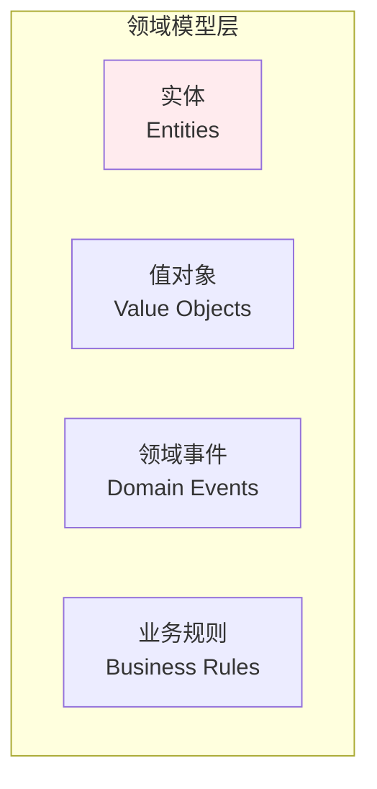

**职责**：
- 包含核心业务实体
- 定义值对象
- 包含业务规则和验证逻辑
- 定义领域事件
- 不依赖任何外部层

**特点**：
- 最稳定的一层
- 变化频率最低
- 包含核心业务概念
- 纯业务逻辑，无技术细节

#### 2. 领域服务层（Domain Services）

**位置**：第二层，跨实体的业务逻辑

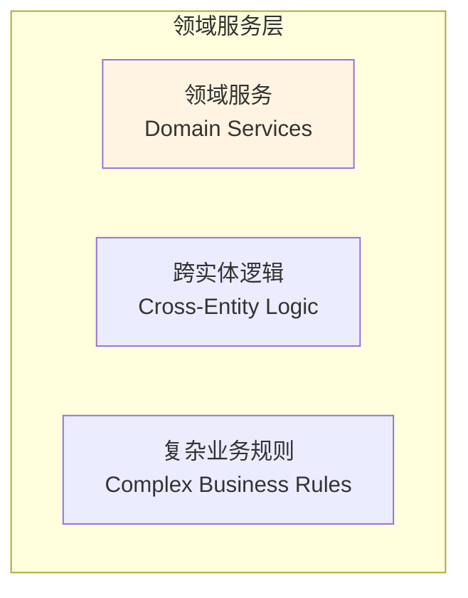

**职责**：
- 包含跨实体的业务逻辑
- 实现复杂的业务规则
- 协调多个实体完成业务目标
- 依赖领域模型层

**特点**：
- 依赖领域模型层
- 不依赖基础设施
- 包含领域特定的业务逻辑
- 无状态服务

#### 3. 应用服务层（Application Services）

**位置**：第三层，应用协调逻辑

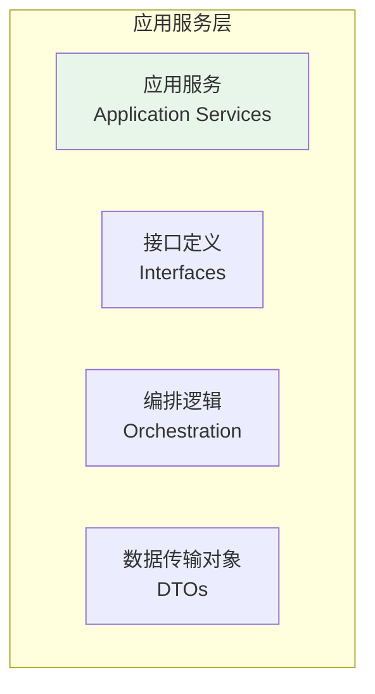

**职责**：
- 协调领域服务和领域模型
- 定义接口（仓储接口、服务接口）
- 处理应用级事务
- 转换DTO和领域对象
- 编排业务流程

**组件类型**：
- **应用服务**：协调领域对象完成用例
- **接口定义**：定义仓储、网关等接口
- **DTO**：数据传输对象，用于层间通信

#### 4. 基础设施层（Infrastructure）

**位置**：最外层，技术实现

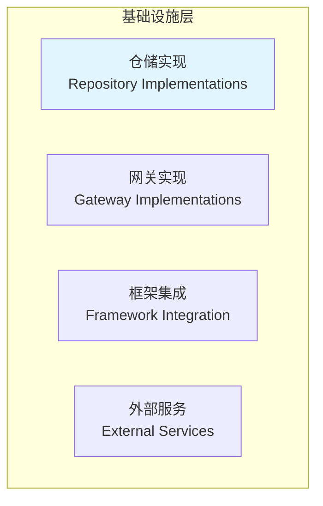

**职责**：
- 实现应用服务层定义的接口
- 提供技术实现（数据库、文件系统、网络）
- 集成外部框架和服务
- 处理技术细节

**组件类型**：
- **仓储实现**：实现数据访问接口
- **网关实现**：实现外部服务接口
- **框架集成**：集成Web框架、ORM等
- **外部服务**：邮件、支付、通知等服务

---

## 设计规则

### 依赖规则（Dependency Rule）

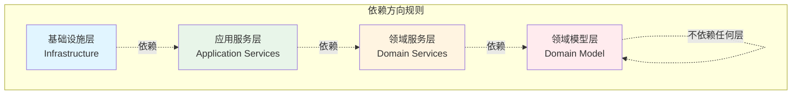

**规则说明**：
- ✅ **允许**：外层依赖内层
- ❌ **禁止**：内层依赖外层
- ✅ **允许**：通过接口定义依赖
- ❌ **禁止**：直接依赖具体实现

### 接口定义规则

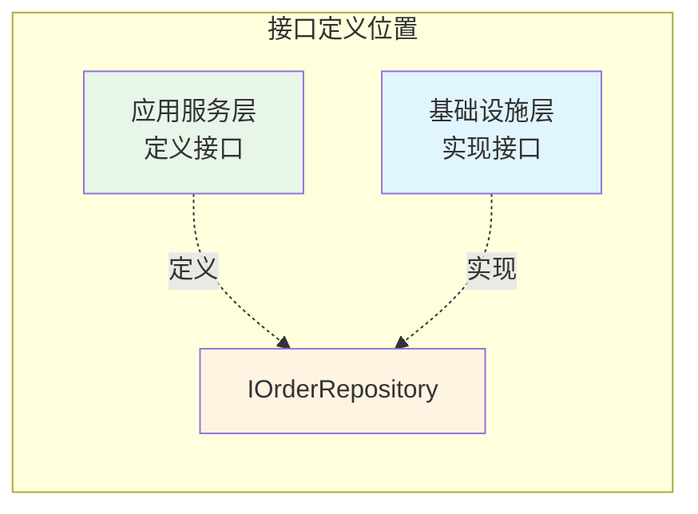

**规则说明**：
- ✅ **接口定义**：在应用服务层定义接口
- ✅ **接口实现**：在基础设施层实现接口
- ✅ **依赖倒置**：领域层依赖接口，不依赖实现

---

## 优缺点分析

### 优点

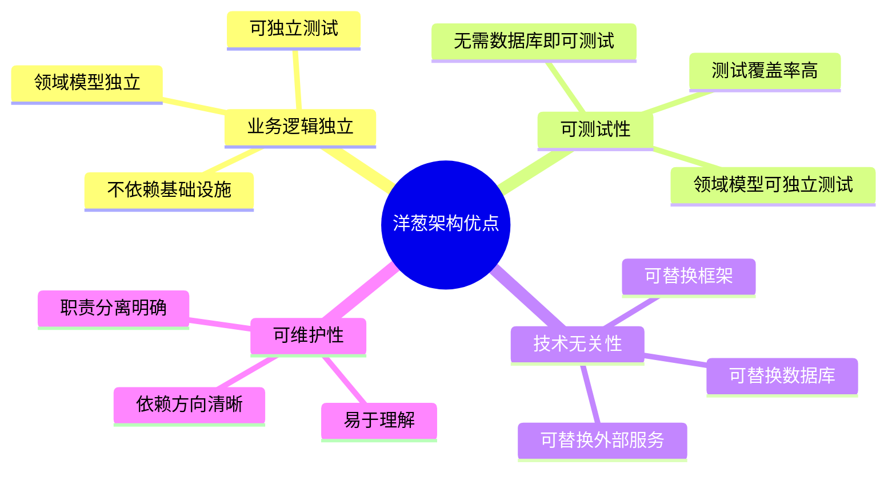

**详细说明**：
- ✅ **业务逻辑独立**：领域模型完全独立于基础设施
- ✅ **高度可测试**：领域模型可以独立测试，无需基础设施
- ✅ **技术无关性**：可以轻松替换任何技术实现
- ✅ **依赖清晰**：依赖方向明确，易于理解
- ✅ **接口抽象**：通过接口实现依赖倒置

### 缺点

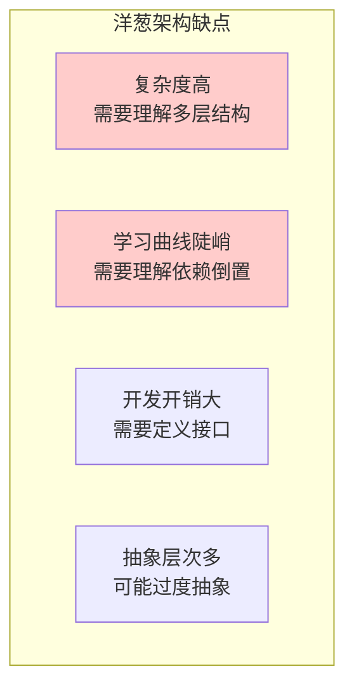

**详细说明**：
- ❌ **复杂度高**：需要理解多层结构和依赖规则
- ❌ **学习曲线陡峭**：需要理解依赖倒置和接口抽象
- ❌ **开发开销大**：需要定义接口和实现
- ❌ **可能过度设计**：简单项目可能不需要这么复杂的架构
- ❌ **抽象层次多**：多层抽象可能影响性能

---

## 实践指南

### 实施步骤

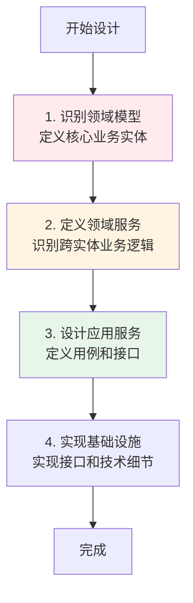

### 分层实施策略

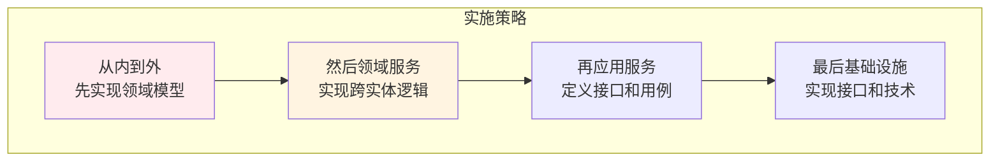

**实施建议**：
1. **从核心开始**：先实现领域模型层，定义核心业务概念
2. **领域服务**：识别跨实体的业务逻辑，实现领域服务
3. **接口先行**：在应用服务层定义接口，再在基础设施层实现
4. **逐步集成**：最后集成基础设施和技术框架

---

## 与其他架构模式的关系

### 洋葱架构与其他架构的关系

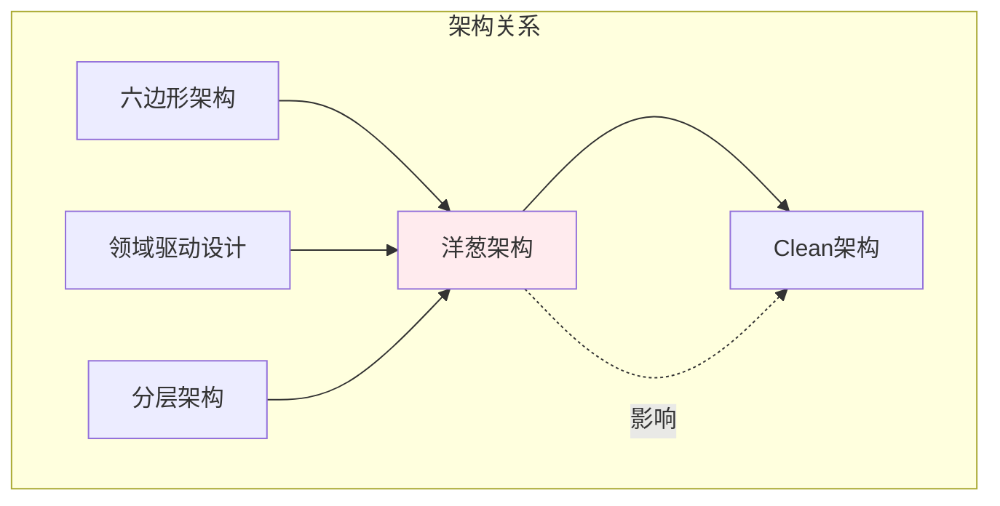

**关系说明**：
- **六边形架构**：洋葱架构的灵感来源之一
- **Clean架构**：洋葱架构的进化版本，更详细的层次划分
- **领域驱动设计**：洋葱架构的领域模型层体现了DDD思想
- **分层架构**：洋葱架构是分层架构的依赖倒置版本

### 架构对比

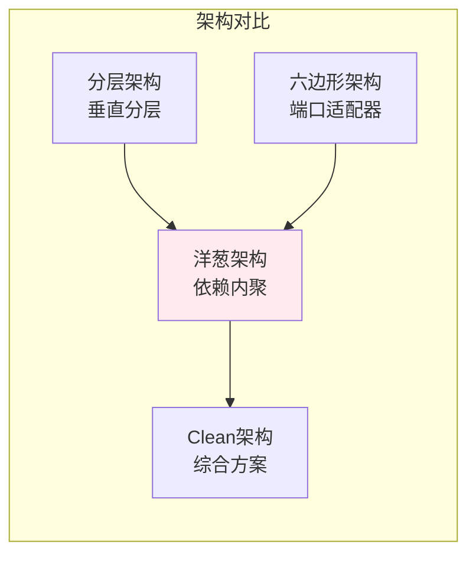

---

## 应用场景

### 适用场景

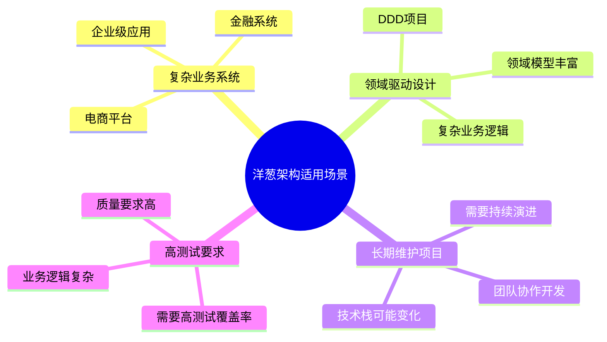

**具体场景**：
- ✅ **企业级应用**：复杂的业务逻辑，需要长期维护
- ✅ **DDD项目**：采用领域驱动设计的项目
- ✅ **金融系统**：高可靠性要求，业务规则复杂
- ✅ **电商平台**：业务逻辑复杂，需要灵活扩展

### 不适用场景

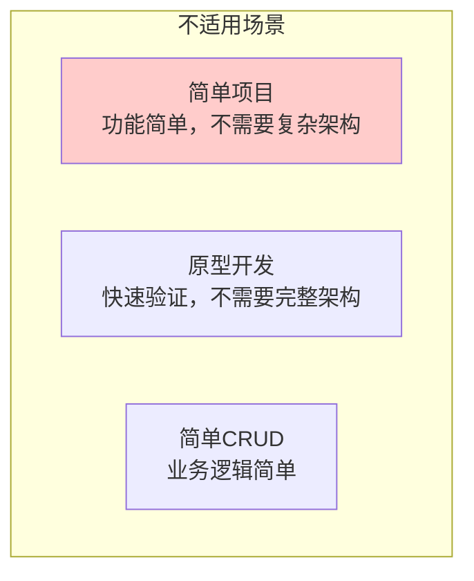

**不适用场景**：
- ❌ **简单项目**：功能简单，不需要复杂架构
- ❌ **原型开发**：快速验证想法，不需要完整架构
- ❌ **简单CRUD**：业务逻辑简单，不需要领域模型

---

## 实际案例

### 案例1：电商订单系统

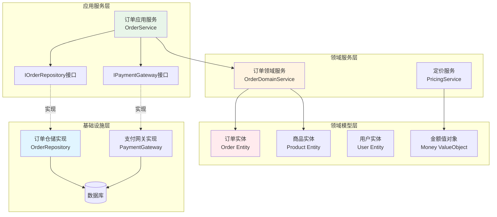

### 案例2：游戏战斗系统

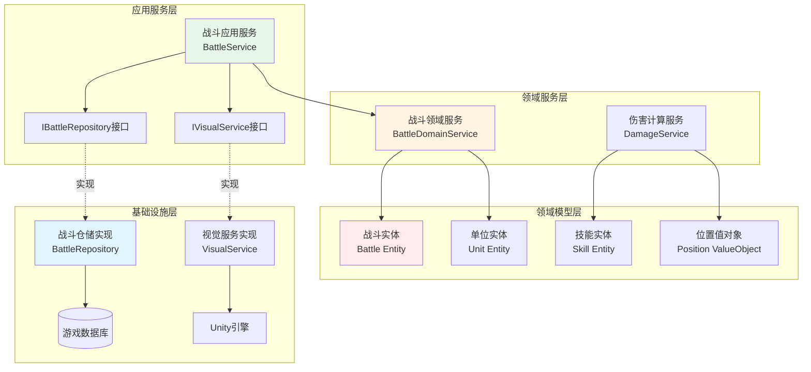

---

## 设计原则

### SOLID原则在洋葱架构中的应用

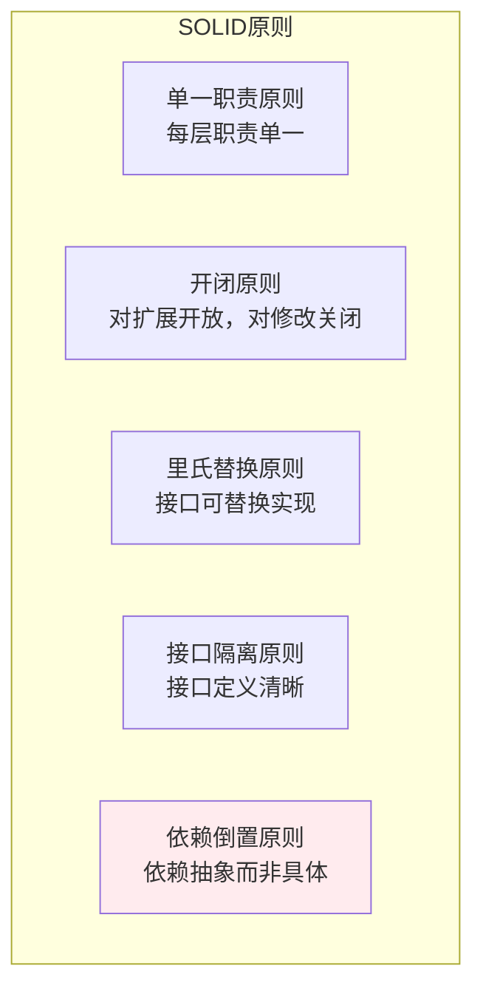

**原则应用**：
- **单一职责**：每层只负责自己的职责
- **开闭原则**：通过接口扩展，无需修改内层
- **里氏替换**：接口实现可以替换
- **接口隔离**：接口定义清晰，职责单一
- **依赖倒置**：依赖抽象接口，而非具体实现

---

## 总结

洋葱架构模式是一种以领域模型为中心的架构模式，通过同心圆结构组织系统，将核心业务逻辑放在中心，基础设施放在外围，依赖方向从外向内。

**核心价值**：
- 🎯 **领域模型独立**：核心业务逻辑完全独立于基础设施
- 🧪 **高度可测试**：领域模型可以独立测试
- 🔄 **技术无关**：可以轻松替换任何技术实现
- 📐 **依赖清晰**：依赖方向明确，易于理解

**适用场景**：
- ✅ 复杂业务系统
- ✅ DDD项目
- ✅ 长期维护项目
- ✅ 高测试要求

**注意事项**：
- ⚠️ 复杂度较高，需要团队理解
- ⚠️ 开发开销较大，需要定义接口
- ⚠️ 简单项目可能过度设计

洋葱架构是构建可维护、可测试、可扩展系统的优秀选择，特别适合采用领域驱动设计的复杂业务系统。

